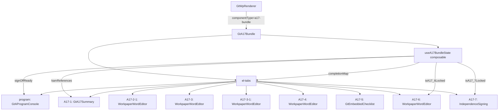

# 设计文档：A17 审计总结聚合组件

## 概述

将 A17（全面审核意见程序表）及其 12 个子底稿聚合为单一 `a17-bundle` 组件，内部通过 Tab 切换渲染各子底稿。遵循 `GtA11Bundle` / `GtA15Bundle` 已有模式：静态 Tab 配置 + el-tabs 分发 + wp_index 查询子底稿 wp_id。

核心复杂度：
1. Tab 数量多（9 个 Tab，含 A17-5 适用性分支）
2. 渲染器类型多（GtAProgramConsole / GtA17Summary / WorkpaperWordEditor / GtEmbeddedChecklist / IndependenceSigning）
3. 需从 wp_index 解析子底稿 wp_id
4. **子表间业务联动**：A17-5 完成状态驱动 A17-6/A17-7 可编辑性；签发前置条件校验
5. **KAM 引用聚合**：A17-1 自动引用 B50/D~N 重大发现
6. **完成状态仪表盘**：顶部进度总览

## 架构



决策变更：原设计为"无独立 composable 的简单 Tab 分发器"。由于新增联动逻辑（完成状态追踪 + 签发前置条件 + KAM 引用），需引入轻量 composable `useA17BundleState` 管理跨 Tab 业务状态。该 composable 仅做数据读取和状态推导，不做数据写入。

## 组件与接口

### GtA17Bundle.vue

```typescript
// Props
interface Props {
  wpId: string           // 父底稿 A17 的 wp_id
  sheetName?: string     // 外部跳转指定 Tab（如 'A17-1'）
  readonly?: boolean     // 只读模式
}

// Tab 配置（静态数组）
interface TabDef {
  id: string             // Tab 标识，同时作为 sheetName 路由值
  label: string          // Tab 显示名称
  kind: 'program' | 'a17-summary' | 'word' | 'checklist' | 'independence'
  wpCode?: string        // 子底稿编码（用于 wp_index 查询 wp_id）
  tracked?: boolean      // 是否参与完成状态追踪
}
```

### useA17BundleState composable

```typescript
// 文件: audit-platform/frontend/src/components/workpaper/composables/useA17BundleState.ts

export type CompletionStatus = 'completed' | 'in_progress' | 'not_started'

export interface SubTabCompletion {
  tabId: string
  label: string
  status: CompletionStatus
}

export interface SignOffPrecondition {
  id: string
  label: string
  satisfied: boolean
}

export interface KamReference {
  source: 'B50' | 'D-cycle' | 'E-cycle' | 'F-cycle' | string
  title: string
  riskLevel?: 'high' | 'medium'
  wpCode: string
  summary: string
}

export interface UseA17BundleStateOptions {
  projectId: Ref<string>
  wpIdMap: Ref<Record<string, string>>
}

export interface UseA17BundleStateReturn {
  // 完成状态
  completionMap: ComputedRef<Record<string, CompletionStatus>>
  subTabCompletions: ComputedRef<SubTabCompletion[]>

  // 联动锁定
  isA17_6Locked: ComputedRef<boolean>
  isA17_7Locked: ComputedRef<boolean>
  a17_6LockReason: ComputedRef<string>
  a17_7LockReason: ComputedRef<string>

  // 签发前置条件
  signOffPreconditions: ComputedRef<SignOffPrecondition[]>
  signOffReady: ComputedRef<boolean>

  // KAM 引用
  kamReferences: Ref<KamReference[]>

  // 操作
  refreshCompletionStatus: () => Promise<void>
  loadKamReferences: () => Promise<void>
}

export function useA17BundleState(options: UseA17BundleStateOptions): UseA17BundleStateReturn
```

### Tab 定义表

| id | label | kind | wpCode | 渲染组件 | tracked |
|----|-------|------|--------|----------|---------|
| program | 审计程序 | program | — | GtAProgramConsole | — |
| A17-1 | 重大事项概要 | a17-summary | A17-1 | GtA17Summary | ✓ |
| A17-2-1 | 交审审计专项 | word | A17-2-1 | WorkpaperWordEditor | — |
| A17-3 | 业务备案报告 | word | A17-3 | WorkpaperWordEditor | — |
| A17-3-1 | 备案部门检查报告 | word | A17-3-1 | WorkpaperWordEditor | — |
| A17-4 | 义务注意事项通知 | word | A17-4 | WorkpaperWordEditor | — |
| A17-5-* | 审计完成核对表 | checklist | A17-5-1~5 | GtEmbeddedChecklist | ✓ |
| A17-6 | 总结会议纪要 | word | A17-6 | WorkpaperWordEditor | ✓ |
| A17-7 | 独立性签署 | independence | A17-7 | IndependenceSigning | ✓ |

### wp_id 解析逻辑

```typescript
// 组件挂载时调用 getWpIndex(projectId) 获取项目底稿索引
// 按 wpCode 过滤出 A17 系列子底稿的 wp_id 映射
const wpIdMap = computed(() => {
  const map: Record<string, string> = {}
  for (const item of wpIndex.value) {
    if (item.wp_code?.startsWith('A17-')) {
      map[item.wp_code] = item.wp_id
    }
  }
  return map
})
```

### 适用性控制（A17-5 系列）

A17-5 系列有 5 种核对表（5-1 至 5-5），按项目业务类型选择性展示。判断逻辑：wp_index 中是否存在对应 wp_code 的底稿记录（有 wp_id 即适用）。

```typescript
const applicableA17_5 = computed(() =>
  ['A17-5-1','A17-5-2','A17-5-3','A17-5-4','A17-5-5']
    .filter(code => wpIdMap.value[code])
)
```

### sheetName 路由

```typescript
// 监听 props.sheetName + route.query.sheet
// 匹配 Tab id 则激活对应 Tab，不匹配则保持 program
watch(() => props.sheetName, (v) => {
  if (v && visibleTabs.value.some(t => t.id === v)) active.value = v
})
```

## 联动逻辑设计

### 完成状态推导规则

```typescript
/**
 * A17-5 完成状态推导：
 * 从各适用 A17-5-x 底稿的 checklist_responses 读取所有 item，
 * 按 conclusion 字段判断：
 * - 所有 item.conclusion 非空 → completed
 * - 部分非空 → in_progress
 * - 全部为空/null → not_started
 */
function deriveA17_5Status(responses: ChecklistResponse[]): CompletionStatus {
  if (responses.length === 0) return 'not_started'
  const filled = responses.filter(r => r.conclusion != null && r.conclusion !== '')
  if (filled.length === 0) return 'not_started'
  if (filled.length === responses.length) return 'completed'
  return 'in_progress'
}

/**
 * A17-1 完成状态推导：
 * 16 章内容中必填章节全部有内容 → completed
 * 部分有内容 → in_progress
 * 无内容 → not_started
 */
function deriveA17_1Status(responses: ChecklistResponse[]): CompletionStatus {
  // A17-1 的 item_id 格式为 'A17-1-ch{N}'，必填章节由 chapter_definitions 决定
  if (responses.length === 0) return 'not_started'
  const filled = responses.filter(r => r.remark != null && r.remark.trim() !== '')
  if (filled.length === 0) return 'not_started'
  // 粗略判断：有 10+ 章节内容视为 completed（实际按 required 字段精确判断）
  if (filled.length >= 10) return 'completed'
  return 'in_progress'
}

/**
 * A17-7 完成状态推导：
 * 读取 A17-7 底稿的 checklist_responses 中 sign_status 项
 * sign_status = 'signed' → completed
 * 其他 → not_started
 */
function deriveA17_7Status(responses: ChecklistResponse[]): CompletionStatus {
  const signItem = responses.find(r => r.item_id === 'A17-7-sign-status')
  if (signItem?.conclusion === 'signed') return 'completed'
  if (responses.some(r => r.conclusion != null && r.conclusion !== '')) return 'in_progress'
  return 'not_started'
}
```

### 联动锁定规则

```typescript
// A17-6 锁定：A17-5 未全部完成 → 锁定
const isA17_6Locked = computed(() =>
  completionMap.value['A17-5'] !== 'completed'
)
const a17_6LockReason = computed(() =>
  isA17_6Locked.value ? 'A17-5 审计完成核对表未完成，无法编辑总结会议纪要' : ''
)

// A17-7 锁定：A17-5 未全部完成 → 锁定
const isA17_7Locked = computed(() =>
  completionMap.value['A17-5'] !== 'completed'
)
const a17_7LockReason = computed(() =>
  isA17_7Locked.value ? 'A17-5 审计完成核对表未完成，无法进行独立性签署' : ''
)
```

### 签发前置条件

```typescript
const signOffPreconditions = computed<SignOffPrecondition[]>(() => [
  {
    id: 'kam',
    label: 'A17-1 关键审计事项编制完成',
    satisfied: completionMap.value['A17-1'] === 'completed',
  },
  {
    id: 'checklist',
    label: 'A17-5 审计完成核对表全部完成',
    satisfied: completionMap.value['A17-5'] === 'completed',
  },
  {
    id: 'independence',
    label: 'A17-7 独立性签署完成',
    satisfied: completionMap.value['A17-7'] === 'completed',
  },
])

const signOffReady = computed(() =>
  signOffPreconditions.value.every(p => p.satisfied)
)
```

### KAM 引用数据获取

```typescript
/**
 * 从后端 API 获取 KAM 引用数据：
 * GET /api/projects/{projectId}/kam-references
 * 返回 B50 重大风险 + D~N 循环重大发现的摘要列表
 *
 * 后端聚合逻辑：
 * 1. 查 B50 底稿 checklist_responses 中 risk_level='high' 的项
 * 2. 查 D~N 各循环底稿中标记为"重大错报"的调整分录
 * 3. 合并返回
 */
async function loadKamReferences() {
  try {
    const data = await api.get(`/api/projects/${projectId.value}/kam-references`)
    kamReferences.value = (data as KamReference[]) || []
  } catch {
    kamReferences.value = []
  }
}
```

### 完成状态仪表盘

```typescript
// 仪表盘数据结构
interface DashboardItem {
  tabId: string
  label: string
  status: CompletionStatus
  icon: string  // ✓ / ◐ / ○
  color: string // green / yellow / gray
}

const dashboardItems = computed<DashboardItem[]>(() => [
  { tabId: 'A17-1', label: 'KAM', ...statusToDisplay(completionMap.value['A17-1']) },
  { tabId: 'A17-5', label: '核对表', ...statusToDisplay(completionMap.value['A17-5']) },
  { tabId: 'A17-6', label: '总结会议', ...statusToDisplay(completionMap.value['A17-6']) },
  { tabId: 'A17-7', label: '独立性', ...statusToDisplay(completionMap.value['A17-7']) },
])

function statusToDisplay(status: CompletionStatus) {
  switch (status) {
    case 'completed': return { icon: '✓', color: 'green' }
    case 'in_progress': return { icon: '◐', color: 'yellow' }
    case 'not_started': return { icon: '○', color: 'gray' }
  }
}
```

## 数据模型

### 后端变更

1. **wp_code_overrides.json**：
   - `"A17": "a17-bundle"` — 新增
   - `"A17-1": "skip"` — 改（原 `a17-summary`）
   - `"A17-2-1"` ~ `"A17-7"`: 全部改为 `"skip"`

2. **VALID_COMPONENT_TYPES**（wp_classification_service.py）：
   - 新增 `"a17-bundle"`

3. **htmlRendererRegistry.ts**：
   - 新增 `HtmlComponentType` 联合成员 `'a17-bundle'`
   - 新增 `defineAsyncComponent(() => import('./GtA17Bundle.vue'))` 注册条目
   - contextProps: `'standard'`

4. **KAM 引用 API**（新增）：
   - `GET /api/projects/{project_id}/kam-references`
   - 返回 `KamReference[]`，聚合 B50 高风险项 + D~N 重大发现

### 数据流

```
底稿目录点击 A17
  → GtWpRenderer 查 componentType = 'a17-bundle'
  → 渲染 GtA17Bundle (props: wpId, sheetName?, readonly?)
  → GtA17Bundle onMounted:
      1. getWpIndex(projectId) → 获取子底稿 wp_id 映射
      2. 过滤适用 Tab（A17-5 系列按存在性过滤）
      3. useA17BundleState 初始化 → 加载完成状态 + KAM 引用
      4. 渲染仪表盘 + el-tabs，按 Tab.kind 分发子组件
      5. 联动锁定：A17-6/A17-7 根据 A17-5 状态决定 readonly

联动数据流:
  用户完成 A17-5 核对表某项
    → GtEmbeddedChecklist 保存 checklist_responses
    → useA17BundleState.refreshCompletionStatus()
    → completionMap['A17-5'] 重新计算
    → isA17_6Locked / isA17_7Locked 响应式更新
    → A17-6/A17-7 Tab 自动解锁/锁定

签发流程:
  用户点击 program Tab 签发
    → 检查 signOffReady
    → 全满足 → 允许签发
    → 未满足 → 显示阻断提示 + 未完成项列表
```

### 完成状态刷新机制

```typescript
/**
 * 刷新策略：
 * 1. 组件挂载时全量加载一次
 * 2. Tab 切换时按需刷新当前 Tab 对应的完成状态（避免频繁全量请求）
 * 3. 用户从 A17-5 Tab 切走时触发 A17-5 状态刷新（关键联动触发点）
 * 4. 提供手动 refresh 按钮（仪表盘旁）
 */
async function refreshCompletionStatus() {
  // 并行加载各 tracked 子表的 checklist_responses
  const [a17_1Res, a17_5Res, a17_7Res] = await Promise.all([
    loadA17_1Responses(),
    loadA17_5Responses(),
    loadA17_7Responses(),
  ])
  // 推导各子表状态
  rawResponses.value = { 'A17-1': a17_1Res, 'A17-5': a17_5Res, 'A17-7': a17_7Res }
}
```

## 正确性属性（Correctness Properties）

*属性是系统在所有合法执行路径下都应保持为真的特征或行为——本质上是对系统行为的形式化声明。*

### Property 1: 子底稿编码 skip 映射完整性

*For any* wp_code 属于 {A17-1, A17-2-1, A17-3, A17-3-1, A17-4, A17-5-1, A17-5-2, A17-5-3, A17-5-4, A17-5-5, A17-6, A17-7}，其在 wp_code_overrides 中的映射值应为 `skip`；且 `A17` 本身映射为 `a17-bundle`。

**Validates: Requirements 2.1, 2.2**

### Property 2: wp_id 解析与传播

*For any* wp_index 数据集（包含若干 A17-* 条目），GtA17Bundle 解析出的 wpIdMap 应正确映射每个 A17-* wp_code 到其对应的 wp_id，且每个 word/checklist/independence 类型 Tab 的子组件接收到的 wp_id 应等于 wpIdMap 中该 Tab.wpCode 对应的值。

**Validates: Requirements 3.3, 5.1, 5.4**

### Property 3: Tab 可见性由 wp_index 存在性驱动

*For any* wp_index 数据集，A17-5 系列 Tab 中仅 wp_index 中存在对应 wp_code 条目的子底稿应显示为可见 Tab；若 wp_index 中无任何 A17-5-* 条目，则不应显示 A17-5 相关 Tab。

**Validates: Requirements 3.6, 6.1, 6.2, 6.3, 6.4**

### Property 4: sheetName 路由正确激活 Tab

*For any* 合法的 Tab id 值（属于当前可见 Tab 列表），当通过 props.sheetName 或 route.query.sheet 传入时，active Tab 应切换为该值；若传入值不在可见 Tab 列表中，active Tab 应保持不变。

**Validates: Requirements 4.1, 4.2, 4.3, 4.4**

### Property 5: readonly 属性透传

*For any* Tab 和任意 readonly 布尔值，GtA17Bundle 渲染的子组件应接收到与父组件 props.readonly 一致的 readonly 值。

**Validates: Requirements 8.1**

### Property 6: A17-5 完成状态推导正确性

*For any* checklist_responses 集合（含 N 个 item，每个 item.conclusion 为 string|null），`deriveA17_5Status` 应满足：
- 全部 conclusion 非空 → `completed`
- 部分非空 → `in_progress`
- 全部为空/null → `not_started`
- 空数组 → `not_started`

**Validates: Requirements 9.2, 9.3, 9.4**

### Property 7: 联动锁定一致性

*For any* A17-5 完成状态值：
- `completed` → `isA17_6Locked = false` 且 `isA17_7Locked = false`
- `in_progress` 或 `not_started` → `isA17_6Locked = true` 且 `isA17_7Locked = true`

锁定时传入子组件的 readonly 应为 `true`（覆盖父级 readonly=false 的情况）。

**Validates: Requirements 10.1, 10.2, 11.1, 11.2**

### Property 8: 签发前置条件逻辑正确性

*For any* completionMap 状态组合，`signOffReady` 应等价于 `completionMap['A17-1'] === 'completed' && completionMap['A17-5'] === 'completed' && completionMap['A17-7'] === 'completed'`。仅当三者同时为 completed 时 signOffReady = true。

**Validates: Requirements 12.1, 12.2, 12.3**

### Property 9: 仪表盘状态与 completionMap 同步

*For any* completionMap 状态，仪表盘各项的 status/icon/color 应与 completionMap 中对应 tabId 的值一致（statusToDisplay 映射正确）。

**Validates: Requirements 14.2, 14.3, 14.4**

## 错误处理

| 场景 | 处理方式 |
|------|---------|
| wp_index API 调用失败 | 显示错误提示，隐藏所有需要子底稿 wp_id 的 Tab（仅保留 program Tab） |
| 子底稿 wp_id 不存在 | 对应 Tab 隐藏或禁用（v-if 基于 wpIdMap 有值） |
| sheetName 无效 | 忽略，保持当前 Tab（默认 program） |
| 子组件加载失败 | defineAsyncComponent 的 loadingComponent / errorComponent 兜底 |
| 完成状态加载失败 | 降级为全部 `not_started`，仪表盘显示"加载失败"提示 |
| KAM 引用 API 失败 | kamReferences 为空数组，A17-1 正常使用只是无引用提示 |
| A17-5 底稿不存在（项目无核对表） | completionMap['A17-5'] 视为 `completed`（无需检查即可放行） |

## 测试策略

### 属性测试（Property-Based Testing）

使用 `fast-check` 库（前端已有依赖），每个 property 至少运行 100 次迭代。

| Property | 测试方法 | 生成器 |
|----------|---------|--------|
| P1: skip 映射 | 读取 wp_code_overrides.json 验证 | 固定集合遍历 |
| P2: wp_id 解析 | 生成随机 wp_index 数组，调用解析逻辑，断言映射正确 | `fc.array(fc.record({wp_code: fc.constantFrom(...A17_CODES), wp_id: fc.uuid()}))` |
| P3: Tab 可见性 | 生成随机 A17-5-* 子集，断言仅存在的显示 | `fc.subsetOf(['A17-5-1',...,'A17-5-5'])` |
| P4: sheetName 路由 | 生成随机 sheetName（含合法/非法值），断言 active 状态正确 | `fc.oneof(fc.constantFrom(...VALID_IDS), fc.string())` |
| P5: readonly 透传 | 生成随机 boolean + 随机 Tab，断言子组件 readonly prop 一致 | `fc.boolean()` |
| P6: A17-5 完成推导 | 生成随机 checklist_responses 数组（conclusion 可为 string\|null），验证推导正确 | `fc.array(fc.record({item_id: fc.string(), conclusion: fc.option(fc.string())}))` |
| P7: 联动锁定 | 生成随机 CompletionStatus，验证 locked 状态正确 | `fc.constantFrom('completed','in_progress','not_started')` |
| P8: 签发前置条件 | 生成 3 个随机 CompletionStatus，验证 signOffReady 逻辑 | `fc.tuple(fc.constantFrom(...), fc.constantFrom(...), fc.constantFrom(...))` |
| P9: 仪表盘同步 | 生成随机 completionMap，验证 dashboardItems 映射正确 | `fc.record({...})` |

Tag 格式：`Feature: a17-audit-summary-bundle, Property {N}: {title}`

### 单元测试

- 注册表测试：验证 htmlRendererRegistry 包含 `a17-bundle` 条目，contextProps 为 `standard`
- 后端测试：验证 `VALID_COMPONENT_TYPES` 包含 `a17-bundle`
- Tab 配置测试：验证 Tab 顺序和内容与需求一致
- 组件集成：挂载 GtA17Bundle，mock wp_index API，验证子组件渲染
- composable 单元测试：验证 useA17BundleState 各推导逻辑
- 联动集成测试：模拟 A17-5 从 in_progress → completed，验证 A17-6/A17-7 解锁
- 仪表盘渲染测试：验证 dashboardItems 正确渲染三色状态

### 测试配置

- PBT 库：`fast-check`（前端已安装）
- 最小迭代：100 次/property
- 每个 property test 注释引用设计文档 Property 编号
