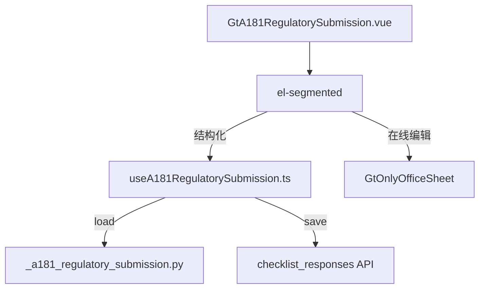

# Design Document: A18-1 向监管部门报送审计小结的函

## Overview

将 A18-1（向监管部门报送审计小结的函）从通用 word-template 升级为专属 HTML 组件。极简信函格式——3 区块卡片（收件人 + 正文 + 签发），~150 行主组件。

新增 componentType `a18-1-regulatory-submission`，前端 GtA181RegulatorySubmission.vue (~150 行) + useA181RegulatorySubmission.ts，后端 `_a181_regulatory_submission.py`。

## Architecture



### 关键设计决策

| 决策 | 理由 |
|------|------|
| 3 区块平铺 | 极简信函，无需分章或左导航 |
| 收件人前缀固定 | "中国证券监督管理委员会"永远不变 |
| 正文段落只读 | 固定格式文字不可编辑 |
| 自动填充 3 字段 | client_name/audit_year/partner_name 从项目上下文取 |
| 无跨底稿联动 | 信函为独立文档，仅 GtIndexChip 跳转 |

## Components and Interfaces

### 后端 `_a181_regulatory_submission.py`

```python
async def render(ctx: RenderContext) -> dict | None:
    # 查询 checklist_responses item_id LIKE 'a181-%'
    # 返回 recipient + body + issuance + project_context
```

返回结构:
```python
{
    "recipient": {
        "bureau": str | None  # 监管局名称（如"北京"）
    },
    "body": {
        "contact_partner": str | None,
        "contact_phone": str | None
    },
    "issuance": {
        "partner": str | None,
        "date": str | None
    },
    "project_context": {
        "client_name": str,
        "audit_year": str,
        "partner_name": str,
        "firm_name": str
    }
}
```

### 前端 `useA181RegulatorySubmission.ts`

```typescript
interface UseA181Return {
  recipient: Ref<{ bureau: string }>
  body: Ref<{ contactPartner: string; contactPhone: string }>
  issuance: Ref<{ partner: string; date: string }>
  projectContext: Ref<ProjectContext>
  saveStatus: Ref<'saved' | 'saving' | 'unsaved'>
  updateField(section: string, field: string, value: string): void
  flushPendingSaves(): Promise<void>
}
```

### 前端 `GtA181RegulatorySubmission.vue` (~150 行)

结构:
- el-segmented 双模式
- 区块 1 — 收件人卡片: 固定前缀 "中国证券监督管理委员会" + el-input (bureau)
- 区块 2 — 正文卡片:
  - 只读引言段 1（接受委托说明）
  - 只读引言段 2（报送依据）
  - 自动填充: {client_name}、{audit_year}
  - 联系人: el-input (partner) + el-input (phone)
  - 附件说明（只读拼接文字）
- 区块 3 — 签发卡片: 事务所(auto read-only) + 合伙人 el-input + el-date-picker
- AI 按钮 (disabled)

## Data Models

| item_id | remark |
|---------|--------|
| `a181-recipient-bureau` | 监管局名称 |
| `a181-contact-partner` | 联系合伙人姓名 |
| `a181-contact-phone` | 联系电话 |
| `a181-sign-partner` | 签发合伙人 |
| `a181-sign-date` | 签发日期 |

## Correctness Properties

### Property 1: item_id 格式

*For any* field edit, save SHALL produce item_id matching pattern `a181-{section}-{field}` or `a181-{field}`.

### Property 2: 自动填充完整性

*For any* first-load, client_name/audit_year/partner_name/firm_name SHALL be pre-filled from project context.

### Property 3: 响应结构完整性

*For any* valid render request, response SHALL contain recipient (1 key), body (2 keys), issuance (2 keys), project_context (4 keys).

### Property 4: 收件人前缀不可变

*For any* UI state, "中国证券监督管理委员会" prefix SHALL always display regardless of bureau input value.

## Testing Strategy

### PBT (Hypothesis): P3 返回结构完整性
### PBT (fast-check): P1 item_id 格式, P2 自动填充, P4 收件人前缀不可变
### Unit Tests: 3 区块渲染、自动填充、保存、模式切换
### E2E: 加载 → 验证自动填充 → 输入监管局 → 填联系人 → 签发 → 保存 → 刷新验证
