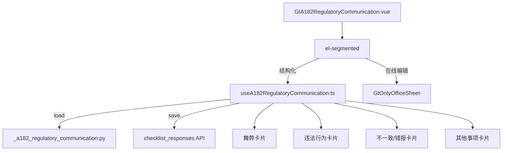

# Design Document: A18-2 与监管层沟通函

## Overview

将 A18-2（与监管层沟通函）从通用 word-template 升级为专属 HTML 组件。4 事项沟通函——5 区块卡片（收件人 + 引言折叠 + 4 事项适用性卡片 + 双签签发 + 提示折叠），~300 行主组件。

新增 componentType `a18-2-regulatory-communication`，前端 GtA182RegulatoryCommunication.vue (~300 行) + useA182RegulatoryCommunication.ts，后端 `_a182_regulatory_communication.py`。

## Architecture



### 关键设计决策

| 决策 | 理由 |
|------|------|
| 5 区块结构 | 收件人/引言/4事项/签发/提示，符合模板逻辑分段 |
| 适用性三态 Y/N/NA | 模板要求每个事项有明确适用性判断 |
| textarea 条件显隐 | 不适用时隐藏，减少视觉噪音 |
| 双 CPA 签字 | 模板要求两名注册会计师签名 |
| 提示表格 el-collapse | 参考信息默认折叠，需要时展开 |
| 收件人 select+input | 常见监管机构预置 + 自定义输入 |
| 无跨底稿联动 | 沟通函为独立文档，仅 GtIndexChip 跳转 |

## Components and Interfaces

### 后端 `_a182_regulatory_communication.py`

```python
async def render(ctx: RenderContext) -> dict | None:
    # 查询 checklist_responses item_id LIKE 'a182-%'
    # 返回 recipient + matters + issuance + project_context
```

返回结构:
```python
{
    "recipient": {
        "authority": str | None,  # 选中的监管机构
        "custom": str | None      # "其他"时的自定义名称
    },
    "matters": [
        {
            "id": 1,
            "title": "舞弊",
            "applicability": "Y" | "N" | "NA" | None,
            "content": str | None
        },
        {
            "id": 2,
            "title": "重大违反法律法规行为",
            "applicability": "Y" | "N" | "NA" | None,
            "content": str | None
        },
        {
            "id": 3,
            "title": "年度报告中信息不一致或错报",
            "applicability": "Y" | "N" | "NA" | None,
            "content": str | None
        },
        {
            "id": 4,
            "title": "其他事项",
            "applicability": "Y" | "N" | "NA" | None,
            "content": str | None
        }
    ],
    "issuance": {
        "cpa1": str | None,
        "cpa2": str | None,
        "date": str | None
    },
    "project_context": {
        "client_name": str,
        "audit_year": str,
        "firm_name": str
    }
}
```

### 前端 `useA182RegulatoryCommunication.ts`

```typescript
interface Matter {
  id: number
  title: string
  applicability: 'Y' | 'N' | 'NA' | null
  content: string
}

interface UseA182Return {
  recipient: Ref<{ authority: string; custom: string }>
  matters: Ref<Matter[]>
  issuance: Ref<{ cpa1: string; cpa2: string; date: string }>
  projectContext: Ref<ProjectContext>
  saveStatus: Ref<'saved' | 'saving' | 'unsaved'>
  updateRecipient(field: string, value: string): void
  updateMatter(matterId: number, field: 'applicability' | 'content', value: string): void
  updateIssuance(field: string, value: string): void
  flushPendingSaves(): Promise<void>
}
```

### 前端 `GtA182RegulatoryCommunication.vue` (~300 行)

结构:
- el-segmented 双模式
- 区块 1 — 收件人: el-select (3 options) + 条件 el-input (custom)
- 区块 2 — 引言: el-collapse (默认收起, 2 段只读文字, auto-fill client/year)
- 区块 3 — 4 事项卡片 (v-for):
  - 标题 + el-radio-group (Y/N/NA)
  - v-show textarea (autosize min 4 rows) when applicability === 'Y'
- 区块 4 — 签发: firm(auto read-only) + CPA1 input + CPA2 input + date-picker
- 区块 5 — 提示: el-collapse (默认收起, 2 个静态表格)
- AI 按钮 (disabled)

## Data Models

| item_id | remark |
|---------|--------|
| `a182-recipient-authority` | 监管机构选择 |
| `a182-recipient-custom` | 自定义监管机构名称 |
| `a182-matter1-applicability` | 舞弊适用性 |
| `a182-matter1-content` | 舞弊内容 |
| `a182-matter2-applicability` | 违法行为适用性 |
| `a182-matter2-content` | 违法行为内容 |
| `a182-matter3-applicability` | 不一致/错报适用性 |
| `a182-matter3-content` | 不一致/错报内容 |
| `a182-matter4-applicability` | 其他事项适用性 |
| `a182-matter4-content` | 其他事项内容 |
| `a182-sign-cpa1` | CPA 1 签名 |
| `a182-sign-cpa2` | CPA 2 签名 |
| `a182-sign-date` | 签发日期 |

## Correctness Properties

### Property 1: item_id 格式

*For any* field edit, save SHALL produce item_id matching pattern `a182-{section}-{field}` where section ∈ {recipient, matter1..4, sign}.

### Property 2: 适用性→textarea 联动

*For any* matter with applicability N or NA, textarea SHALL be hidden; for Y, textarea SHALL be visible.

### Property 3: 响应结构完整性

*For any* valid render request, response SHALL contain recipient (2 keys), matters (4 items each with id/title/applicability/content), issuance (3 keys), project_context (3 keys).

### Property 4: 双签完整性

*For any* issuance section, cpa1 and cpa2 SHALL be independent editable fields (not shared).

### Property 5: 适用性幂等

*For any* matter, setting applicability to the same value twice SHALL produce identical state (idempotent).

## Testing Strategy

### PBT (Hypothesis): P3 返回结构完整性 (4 matters, 各含 4 keys)
### PBT (fast-check): P1 item_id 格式, P2 适用性联动, P5 幂等性
### Unit Tests: 5 区块渲染、适用性三态切换、textarea 显隐、双签、select+custom input、折叠展开
### E2E: 加载 → 选监管机构 → 设置适用性 → 填内容 → 双签 → 保存 → 刷新验证
