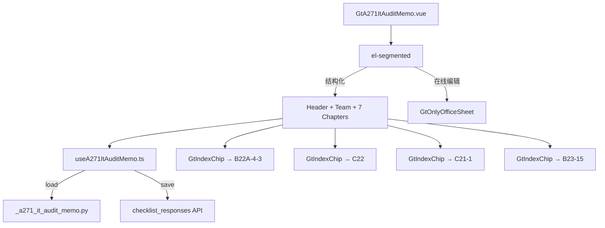

# Design Document: A27-1 IT审计总结备忘录

## Overview

将 A27-1（IT审计总结备忘录）从通用 word-template 升级为专属 HTML 组件。结构化 IT 审计报告：备忘录抬头 + IT团队表 + 7 章节卡片（含三选一 radio + 条件展开 + GtIndexChip 跳转）。

新增 componentType `a27-1-it-audit-memo`，前端 GtA271ItAuditMemo.vue (~500 行) + useA271ItAuditMemo.ts，后端 `_a271_it_audit_memo.py`。

## Architecture



### 关键设计决策

| 决策 | 理由 |
|------|------|
| 7 章节卡片平铺 | 章节数适中，不需导航 |
| 三选一 radio | 结论为固定 3 种（部分有效/无效/已有效）|
| 条件展开 | 仅"已有效"时隐藏缺陷段，减少噪音 |
| Chapter 4 条件显示 | 与 Chapter 3 结论联动（已有效则隐藏） |
| IT团队表 6 行默认 | 模板原始表格 6 行 |
| 4 个 GtIndexChip | 联动策略仅跳转 |

## Components and Interfaces

### 后端 `_a271_it_audit_memo.py`

```python
async def render(ctx: RenderContext) -> dict | None:
    # 查询 checklist_responses item_id LIKE 'a271-%'
    # 加载跨引用 wp_ids: B22A-4-3, C22, C21-1, B23-15
    # 返回完整结构
```

返回结构:
```python
{
    "meta_info": {"client_name": str, "audit_period": str, "index_no": "A27-1"},
    "header": {
        "date": str|None, "to": str|None,
        "from_user": str|None, "subject": str|None
    },
    "purpose_text": str,  # 固定目的段
    "it_team_table": [
        {"index": int, "name": str|None, "title": str|None}
    ],
    "chapters": [
        {
            "number": 1, "title": str,
            "content": str|None,
            "conclusion": str|None,  # for ch3, ch6 only
            "deficiency": str|None,  # for ch3, ch4, ch6 only
            "cross_ref": str|None    # wp_code reference
        }
        # ... 7 entries
    ],
    "cross_references": {
        "b22a_4_3_wp_id": str|None,
        "c22_wp_id": str|None,
        "c21_1_wp_id": str|None,
        "b23_15_wp_id": str|None
    },
    "project_context": {"client_name": str, "audit_period": str, "partner": str, "current_user": str}
}
```

### 前端 `useA271ItAuditMemo.ts`

```typescript
interface UseA271Return {
  metaInfo: Ref<MetaInfo>
  header: Ref<MemoHeader>
  itTeamTable: Ref<TeamRow[]>
  chapters: Ref<ChapterData[]>  // 7 chapters
  saveStatus: Ref<'saved' | 'saving' | 'unsaved'>
  // 计算属性
  showChapter4: ComputedRef<boolean>  // ch3 conclusion !== '已有效'
  showCh3Deficiency: ComputedRef<boolean>
  showCh6Deficiency: ComputedRef<boolean>
  // IT团队表操作
  addTeamMember(): void
  removeTeamMember(index: number): void
  // 通用
  updateHeader(field: string, value: string): void
  updateChapter(index: number, field: string, value: any): void
  flushPendingSaves(): Promise<void>
}
```

### 前端 `GtA271ItAuditMemo.vue` (~500 行)

布局:
- el-segmented 双模式
- 备忘录抬头: 4 字段行 (日期/致/发自/主题)
- 目的段: read-only el-alert
- IT团队表: el-table 动态增删行 (序号/姓名/职级)
- 7 章节卡片:
  - Ch1: textarea + GtIndexChip(B22A-4-3)
  - Ch2: textarea + GtIndexChip(C22)
  - Ch3: radio(3选1) + conditional textarea + GtIndexChip
  - Ch4: conditional card (visible when ch3 ≠ 已有效) + textarea + GtIndexChip(C21-1)
  - Ch5: textarea + GtIndexChip(B23-15)
  - Ch6: radio(3选1) + conditional textarea
  - Ch7: textarea + conclusion input

## Data Models

### item_id 映射

| item_id | remark |
|---------|--------|
| `a271-header-date` | 备忘录日期 |
| `a271-header-to` | 致 |
| `a271-header-from` | 发自 |
| `a271-header-subject` | 主题 |
| `a271-team-{N}` | IT团队行 N (JSON: {name, title}) |
| `a271-ch1-content` | 章一正文 |
| `a271-ch2-content` | 章二正文 |
| `a271-ch3-conclusion` | 章三结论 |
| `a271-ch3-deficiency` | 章三缺陷 |
| `a271-ch4-content` | 章四正文 |
| `a271-ch5-content` | 章五正文 |
| `a271-ch6-conclusion` | 章六结论 |
| `a271-ch6-deficiency` | 章六缺陷 |
| `a271-ch7-content` | 章七正文 |
| `a271-ch7-conclusion` | 章七结论 |

## Correctness Properties

### Property 1: item_id 格式

*For any* field save, item_id SHALL match pattern `a271-{section}-{field}` where section is one of: header, team, ch1~ch7.

### Property 2: IT团队表增删一致性

*For any* sequence of add/remove operations, row count SHALL equal (adds - removes + initial_rows) and never be negative.

### Property 3: 条件展开逻辑（Chapter 3）

*For any* ch3 conclusion value, WHEN conclusion is "已有效" THEN ch3 deficiency SHALL be hidden AND ch4 SHALL be hidden; WHEN conclusion is "部分有效" or "没有有效" THEN both SHALL be visible.

### Property 4: 条件展开逻辑（Chapter 6）

*For any* ch6 conclusion value, WHEN conclusion is "已有效" THEN ch6 deficiency SHALL be hidden; WHEN NOT "已有效" THEN visible.

### Property 5: 后端响应结构完整性

*For any* valid render request, response SHALL contain all 7 top-level keys with correct types, chapters array with exactly 7 entries.

### Property 6: 结论三选一互斥

*For any* conclusion radio (ch3, ch6), exactly one option SHALL be selected at a time, or none (initial state).

## Testing Strategy

### PBT (Hypothesis): P5 响应结构完整性 (7 chapters, 4 cross_references)
### PBT (fast-check): P1 item_id 格式, P2 团队增删, P3 ch3 条件展开, P4 ch6 条件展开, P6 互斥
### Unit Tests: 7 章渲染, 备忘录抬头, IT团队表 CRUD, radio 三选一, 条件展开, GtIndexChip×4, 模式切换
### E2E: 加载 → 填抬头 → 添加团队行 → 选 ch3 结论"部分有效" → 验证 ch4 出现 → 改为"已有效" → 验证 ch4 隐藏 → 保存 → 刷新验证
