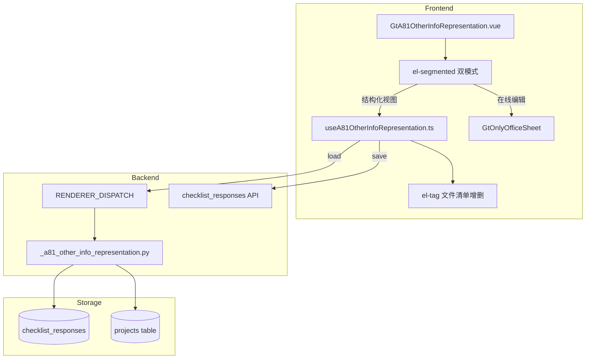

# Design Document: A8-1 管理层对审计报告日后公布其他信息的书面声明

## Overview

将 A8-1（管理层对其他信息的书面声明）从通用 word-template 渲染升级为专属 HTML 组件。6 条声明以卡片式渲染，3 条含动态文件清单（el-tag 增删）、1 条日期、1 条 Y/N、1 条 textarea。签字区自动填充。

新增 componentType `a8-1-other-info-representation`，前端 GtA81OtherInfoRepresentation.vue (~400 行) + useA81OtherInfoRepresentation.ts composable，后端 `_a81_other_info_representation.py` 渲染策略。

## Architecture



### 关键设计决策

| 决策 | 理由 |
|------|------|
| 文件清单用 JSON 数组存 remark | 动态长度列表，每条声明存一条 checklist_response，remark 存 `["文件A","文件B"]` |
| 6 条声明静态结构 | CAS 规定的声明格式固定，前端硬编码条款文本 |
| 无跨底稿联动 | A8-1 是独立书面声明，不依赖其他底稿数据 |
| 签字日期默认审计报告日 | 声明日期通常与审计报告日一致 |
| AI 按钮仅第1条 | 只有文件清单适合 AI 自动生成（读取年度报告目录） |

## Components and Interfaces

### 后端组件

#### 1. `routers/wp_render_strategies/_a81_other_info_representation.py`

```python
async def render(ctx: RenderContext) -> dict | None:
    """A8-1 渲染策略：返回 statements + signature_data + project_context"""
    # 1. 从 projects 表获取 client_name, audit_report_date, cpa_names
    # 2. 从 checklist_responses 查询 item_id LIKE 'a81-%'
    # 3. 组装 6 条 statement 数据（文件清单解析 JSON）
    # 4. 组装 signature_data
    # 5. 返回 {statements, signature_data, project_context}
```

返回结构:
```python
{
    "statements": {
        "1": {"files": list[str]},              # 年度报告文件清单
        "2": {"date": str | None},              # 计划公布日期
        "3": {"consistency": "Y" | "N" | None, "explanation": str | None},  # 一致性确认
        "4": {"files": list[str]},              # 审计报告日前提交文件
        "5": {"files": list[str]},              # 审计报告日后提供文件
        "6": {"other": str | None},             # 其他事项
    },
    "signature_data": {
        "representative": str | None,           # 法定代表人
        "signature_date": str | None,           # 签字日期
    },
    "project_context": {
        "client_name": str,
        "audit_report_date": str | None,
        "cpa_names": list[str],                 # 签字注册会计师
    },
}
```

### 前端组件

#### 2. `useA81OtherInfoRepresentation.ts` (composable)

```typescript
interface UseA81Options {
  wpId: Ref<string>
  projectId: Ref<string>
  htmlData: Ref<A81RenderData | null>
}

interface UseA81Return {
  // Data
  statements: Ref<{
    1: { files: string[] }
    2: { date: string | null }
    3: { consistency: 'Y' | 'N' | null; explanation: string | null }
    4: { files: string[] }
    5: { files: string[] }
    6: { other: string | null }
  }>
  signatureData: Ref<{ representative: string | null; signatureDate: string | null }>
  projectContext: Ref<{ clientName: string; auditReportDate: string | null; cpaNames: string[] }>

  // State
  loading: Ref<boolean>
  saveStatus: Ref<'saved' | 'saving' | 'unsaved'>

  // Methods
  addFile(statementNum: 1 | 4 | 5, fileName: string): void
  removeFile(statementNum: 1 | 4 | 5, index: number): void
  updateStatement(statementNum: number, fieldId: string, value: any): void  // debounce 2s
  updateSignature(fieldId: string, value: string): void  // debounce 2s
  flushPendingSaves(): Promise<void>
}
```

#### 3. `GtA81OtherInfoRepresentation.vue` (~400 行)

Props:
- `wpId: string`
- `projectId: string`
- `htmlData: object | null`

结构:
```vue
<template>
  <!-- el-segmented 双模式切换 -->
  <div v-if="mode === 'structured'" class="gt-a81">
    <!-- 编制指导 (collapsible) -->
    <el-collapse><el-collapse-item title="编制指导"><el-alert>...</el-alert></el-collapse-item></el-collapse>
    <!-- 抬头 -->
    <div class="gt-a81__header">{{ clientName }} + 致：致同会计师事务所</div>
    <!-- 引言段 (read-only, muted) -->
    <div class="gt-a81__intro muted">...</div>
    <!-- 6 条声明卡片 -->
    <el-card v-for="n in 6" class="gt-a81__statement">
      <!-- Statement 1: 文件清单 el-tag + add -->
      <!-- Statement 2: el-date-picker -->
      <!-- Statement 3: Y/N radio + conditional textarea -->
      <!-- Statement 4: 文件清单 el-tag + add -->
      <!-- Statement 5: 文件清单 el-tag + add -->
      <!-- Statement 6: textarea -->
    </el-card>
    <!-- 签字区 -->
    <el-card class="gt-a81__signature">
      <div>{{ clientName }}</div>
      <el-input placeholder="法定代表人签字" />
      <el-date-picker placeholder="签字日期" />
    </el-card>
  </div>
  <!-- 在线编辑模式 -->
  <GtOnlyOfficeSheet v-else ... />
</template>
```

### API 接口

| Method | Path | Description |
|--------|------|-------------|
| GET | `/api/workpapers/{wp_id}/render-config` | a8-1-other-info-representation 策略返回完整数据 |
| POST | `/api/checklist-responses/batch` | 保存 item_id: `a81-{section}-{field_id}` |

## Data Models

### checklist_responses 存储格式

| section | item_id 示例 | conclusion | remark |
|---------|-------------|------------|--------|
| statement | `a81-statement-1-files` | 文件数量(如 "5") | JSON: `["董事会报告","监事会报告","财务报告"]` |
| statement | `a81-statement-2-date` | "2026-04-30" | — |
| statement | `a81-statement-3-consistency` | "Y" 或 "N" | 不一致说明文本 |
| statement | `a81-statement-4-files` | 文件数量 | JSON 数组 |
| statement | `a81-statement-5-files` | 文件数量 | JSON 数组 |
| statement | `a81-statement-6-other` | — | 其他事项文本 |
| signature | `a81-signature-representative` | 法定代表人姓名 | — |
| signature | `a81-signature-date` | "2026-06-26" | — |

总计最多 8 条记录。

## Correctness Properties

### Property 1: item_id 格式一致性

*For any* field edit in GtA81OtherInfoRepresentation (statement field or signature field), the debounce-save SHALL produce a checklist_responses batch request where item_id matches pattern `a81-statement-{N}-{field_id}` or `a81-signature-{field_id}`.

**Validates: Requirements 4.5, 5.3, 6.4, 7.3, 8.3, 9.3, 10.5, 13.2**

### Property 2: 文件清单 JSON round-trip

*For any* file list (array of non-empty strings) saved to checklist_responses remark as JSON, reloading render-config SHALL return the same array with all items preserved in order.

**Validates: Requirements 4.5, 7.3, 8.3, 12.3**

### Property 3: 文件清单增删一致性

*For any* sequence of add/remove operations on a statement's file list, the final list length SHALL equal (initial_length + adds - removes), and all remaining items SHALL preserve their original values and order.

**Validates: Requirements 4.3, 4.4, 7.2, 8.2**

### Property 4: 一致性确认条件展开

*For any* consistency value in {"Y", "N", null}, the explanation textarea in Statement 3 SHALL be visible if and only if consistency === "N".

**Validates: Requirements 6.2, 6.3**

### Property 5: 渲染策略返回结构完整性

*For any* valid A8-1 render request, the response SHALL contain keys: statements (with keys "1" through "6"), signature_data (with representative and signature_date), project_context (with client_name, audit_report_date, cpa_names).

**Validates: Requirements 12.1, 12.2**

### Property 6: 签字日期默认值

*For any* first-load scenario where audit_report_date is present in project_context, the signature_date field SHALL default to audit_report_date.

**Validates: Requirements 10.4**

### Property 7: 双模式切换数据一致性

*For any* sequence of structured-edit → flush → switch-to-OO → switch-back, all statement values and file lists SHALL be preserved after the round-trip mode switch.

**Validates: Requirements 2.5, 13.1**

## Error Handling

| 场景 | 处理 |
|------|------|
| checklist_responses 保存失败 | el-message error + saveStatus "未保存"，不丢本地数据 |
| OnlyOffice 不可用 | 禁用在线编辑 tab，结构化视图独立可用 |
| render-config 返回失败 | 前端显示 el-result error 状态页 |
| JSON remark 解析失败 | 降级为空列表 + console.warn |
| AI 服务未部署 | 按钮 disabled + tooltip |
| audit_report_date 为空 | 签字日期不预填，用户手动选择 |
| cpa_names 为空 | "致"区域 CPA 姓名显示占位符 |

## Testing Strategy

### Property-Based Testing (Hypothesis — 后端)

| Property | 测试文件 | 策略 |
|----------|---------|------|
| P2 文件清单 round-trip | `test_a81_render_pbt.py` | 随机字符串列表存入再读取 |
| P5 返回结构 | `test_a81_render_pbt.py` | 随机 project context 验证 schema |

### Property-Based Testing (fast-check — 前端)

| Property | 测试文件 | 策略 |
|----------|---------|------|
| P1 item_id 格式 | `useA81OtherInfoRepresentation.spec.ts` | 随机 statement+field 组合 |
| P3 文件清单增删 | `useA81OtherInfoRepresentation.spec.ts` | 随机 add/remove 序列 |
| P4 一致性条件 | `GtA81OtherInfoRepresentation.spec.ts` | 随机 Y/N/null 验证可见性 |
| P6 默认值 | `GtA81OtherInfoRepresentation.spec.ts` | 有/无 audit_report_date 验证 |
| P7 模式切换 | `useA81OtherInfoRepresentation.spec.ts` | 随机编辑+切换验证持久化 |

### Unit Tests

- 后端: render 策略（正常/空数据/JSON 解析失败）
- 前端: 6 声明卡片渲染、文件清单增删、Y/N 交互、签字区自动填充、AI disabled

### Integration Tests

- Playwright E2E: 加载 A8-1 → 验证 6 声明卡片 → 添加文件到清单 → 选择日期 → Y/N 确认 → 保存 → 刷新验证持久化 → 切换模式
