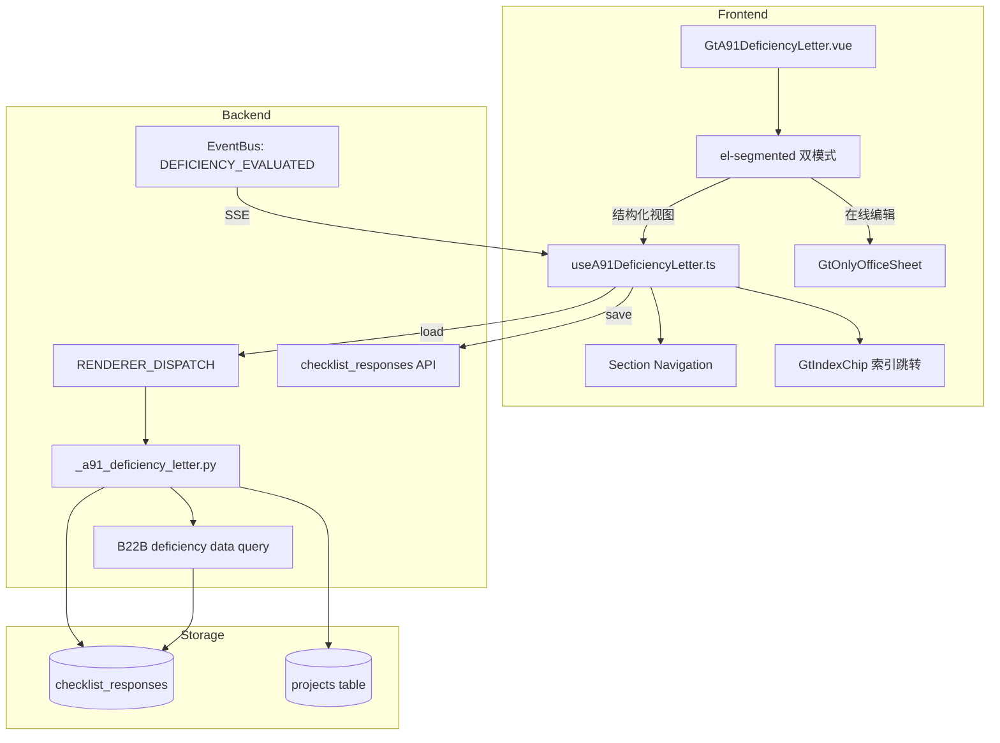

# Design Document: A9-1 内控缺陷沟通函专属组件

## Overview

将 A9-1（向管理层通报内部控制缺陷沟通函）从通用 word-template 渲染升级为专属 HTML 组件。组件将原 52 段落 + 2 表格的 docx 结构转化为 7 个卡片区块，核心价值是与 B22B 内控缺陷评价表的数据联动。

新增 componentType `a9-1-deficiency-letter`，前端 GtA91DeficiencyLetter.vue (~600 行) + useA91DeficiencyLetter.ts composable，后端 `_a91_deficiency_letter.py` 渲染策略。双模式通过 el-segmented 切换，OnlyOffice 走已有 GtOnlyOfficeSheet。

## Architecture



### 关键设计决策

| 决策 | 理由 |
|------|------|
| 新建 componentType | A9-1 有 7 个语义区块 + B22B 联动 + 独立性 Y/N 逻辑，通用 word-template 框架无法表达 |
| 前端静态定义区块结构 | 7 个区块固定不变（来自 CAS 格式），不需后端动态解析模板 |
| 缺陷列表 JSON 存 remark | 每个 severity 组存一条 checklist_response，remark 存 JSON 数组（避免 N 条缺陷生成 N×4 条记录） |
| B22B 联动走后端查询 | render-config 一次性返回 B22B 缺陷分组，前端无需额外请求 |
| EventBus 实时刷新 | B22B 评价缺陷后 SSE 推送 DEFICIENCY_EVALUATED，A9-1 自动刷新 |
| AI 按钮 disabled 预留 | Phase3 vLLM 接入后只需解除 disabled + 调 /ai-generate |
| 签发日期联动审计报告日期 | 项目 context 已有 audit_report_date，作为默认值 |

## Components and Interfaces

### 后端组件

#### 1. `routers/wp_render_strategies/_a91_deficiency_letter.py`

```python
async def render(ctx: RenderContext) -> dict | None:
    """A9-1 渲染策略：返回 section_data + deficiency_list + project_context"""
    # 1. 从 projects 表获取 client_name, audit_report_date
    # 2. 从 checklist_responses 查询 item_id LIKE 'a91-%' (当前项目+底稿)
    # 3. 查询 B22B 底稿的缺陷数据(从 B22B checklist_responses 中提取已评价缺陷)
    # 4. 按 severity 分组(重大/重要/一般)
    # 5. 返回 {section_data, deficiency_list, project_context}
```

返回结构:
```python
{
    "section_data": {
        "addressee": {"client_name": str, "custom_text": str | None},
        "independence": {
            "team_independent": "Y" | "N" | None,
            "no_relationships": "Y" | "N" | None,
            "no_relationships_detail": str | None,
            "safeguards_taken": "Y" | "N" | None,
            "non_audit_services": "Y" | "N" | None,
            "non_audit_services_detail": str | None,
        },
        "committee": {"applicability": "Y" | "N" | "NA" | None, "description": str | None},
        "signature": {"date": str | None},
        "response": {
            "opinion": str | None,
            "conclusion": str | None,
            "representative": str | None,
            "response_date": str | None,
        },
    },
    "deficiency_list": {
        "major": [DeficiencyItem],     # 重大缺陷
        "significant": [DeficiencyItem],  # 重要缺陷
        "general": [DeficiencyItem],   # 一般缺陷
    },
    "project_context": {
        "client_name": str,
        "firm_name": "致同会计师事务所（特殊普通合伙）",
        "audit_report_date": str | None,
    },
    "b22b_warning": str | None,  # 未找到B22B时的警告
}
```

DeficiencyItem 结构:
```python
@dataclass
class DeficiencyItem:
    id: str                    # 唯一标识
    description: str           # 缺陷描述
    impact: str               # 影响说明
    recommendation: str       # 整改建议
    index_ref: str | None     # 索引号(如 "B22B-001")
    source: str               # "b22b" | "manual"
    severity: str             # "major" | "significant" | "general"
```

#### 2. B22B 缺陷数据查询

```python
async def _load_b22b_deficiencies(project_id: str, db: AsyncSession) -> dict:
    """从 B22B 底稿的 checklist_responses 中提取已评价缺陷"""
    # 1. 通过 wp_index 找到同项目的 B22B 底稿
    # 2. 从 checklist_responses (item_id LIKE 'b22b-deficiency-%') 读取缺陷列表
    # 3. 按 severity 字段分组
    # 4. 返回 {"major": [...], "significant": [...], "general": [...]}
```

### 前端组件

#### 3. `useA91DeficiencyLetter.ts` (composable)

```typescript
interface UseA91DeficiencyLetterOptions {
  wpId: Ref<string>
  projectId: Ref<string>
  htmlData: Ref<A91RenderData | null>
}

interface DeficiencyItem {
  id: string
  description: string
  impact: string
  recommendation: string
  indexRef: string | null
  source: 'b22b' | 'manual'
  severity: 'major' | 'significant' | 'general'
}

interface UseA91DeficiencyLetterReturn {
  // Section data (reactive)
  sectionData: Ref<A91SectionData>
  deficiencyList: Ref<{ major: DeficiencyItem[]; significant: DeficiencyItem[]; general: DeficiencyItem[] }>
  projectContext: Ref<A91ProjectContext>
  b22bWarning: Ref<string | null>

  // State
  loading: Ref<boolean>
  saveStatus: Ref<'saved' | 'saving' | 'unsaved'>
  activeSection: Ref<string>  // for navigation scrollspy

  // Methods
  updateField(section: string, fieldId: string, value: string): void  // debounce 2s
  addDeficiency(severity: string): void
  removeDeficiency(severity: string, index: number): void
  updateDeficiency(severity: string, index: number, field: string, value: string): void
  flushPendingSaves(): Promise<void>
  refreshFromB22B(): Promise<void>
  scrollToSection(sectionId: string): void
}

export function useA91DeficiencyLetter(opts: UseA91DeficiencyLetterOptions): UseA91DeficiencyLetterReturn
```

#### 4. `GtA91DeficiencyLetter.vue` (~600 行)

Props:
- `wpId: string`
- `projectId: string`
- `htmlData: object | null` (从 render-config 获取的 A91RenderData)

结构:
```vue
<template>
  <!-- el-segmented 双模式切换 -->
  <!-- 结构化视图 -->
  <div v-if="mode === 'structured'" class="gt-a91">
    <!-- 左侧 mini 导航 -->
    <aside class="gt-a91__nav">...</aside>
    <!-- 右侧主内容 -->
    <main class="gt-a91__content">
      <!-- Section 1: 收件人 -->
      <el-card id="section-addressee">...</el-card>
      <!-- Section 2: 正文引言 (read-only, collapsible) -->
      <el-card id="section-intro">...</el-card>
      <!-- Section 3: 独立性声明 -->
      <el-card id="section-independence">...</el-card>
      <!-- Section 4: 内部控制缺陷 (核心) -->
      <el-card id="section-deficiency">...</el-card>
      <!-- Section 5: 审计委员会监督 -->
      <el-card id="section-committee">...</el-card>
      <!-- Section 6: 签发区 -->
      <el-card id="section-signature">...</el-card>
      <!-- Section 7: 管理层回复区 -->
      <el-card id="section-response">...</el-card>
    </main>
  </div>
  <!-- 在线编辑模式 -->
  <GtOnlyOfficeSheet v-else ... />
</template>
```

### API 接口

| Method | Path | Description |
|--------|------|-------------|
| GET | `/api/workpapers/{wp_id}/render-config` | 现有端点，a9-1-deficiency-letter 策略返回完整 section_data |
| POST | `/api/checklist-responses/batch` | 现有端点，保存字段值 (item_id: `a91-{section}-{field_id}`) |
| GET | `/api/workpapers/onlyoffice/health` | 现有端点，健康检查 |
| GET | `/api/workpapers/{wp_id}/sheets/{sheetName}/onlyoffice-config` | 现有端点，OO 配置 |

## Data Models

### checklist_responses 存储格式

| section | item_id 示例 | conclusion | remark |
|---------|-------------|------------|--------|
| addressee | `a91-addressee-client_name` | 自定义收件人文本 | — |
| independence | `a91-independence-team_independent` | "Y" 或 "N" | — |
| independence | `a91-independence-no_relationships` | "Y" 或 "N" | 补充说明文本 |
| independence | `a91-independence-safeguards_taken` | "Y" 或 "N" | — |
| independence | `a91-independence-non_audit_services` | "Y" 或 "N" | 服务说明文本 |
| deficiency | `a91-deficiency-major` | 条目数量(如 "3") | JSON: `[{id,description,impact,recommendation,indexRef,source}]` |
| deficiency | `a91-deficiency-significant` | 条目数量 | JSON 数组 |
| deficiency | `a91-deficiency-general` | 条目数量 | JSON 数组 |
| committee | `a91-committee-applicability` | "Y" / "N" / "NA" | 描述文本 |
| signature | `a91-signature-date` | "2026-06-26" | — |
| response | `a91-response-opinion` | — | 管理层意见文本 |
| response | `a91-response-conclusion` | — | 管理层结论文本 |
| response | `a91-response-representative` | 签字人姓名 | — |
| response | `a91-response-date` | "2026-06-26" | — |

### B22B 缺陷数据来源

从 B22B 底稿的 checklist_responses 中读取（item_id pattern `b22b-deficiency-*`），每条记录 remark 为 JSON:
```json
{
  "id": "DEF-001",
  "description": "...",
  "impact": "...",
  "severity": "major",
  "index_ref": "B22B-001"
}
```

渲染策略将 B22B 数据与 A9-1 手动新增的缺陷合并后返回。

## Correctness Properties

### Property 1: B22B 缺陷分组正确性

*For any* set of deficiencies from B22B with severity values in {"major", "significant", "general"}, the A91_Render_Strategy SHALL group each deficiency into the corresponding severity sub-list, and the total count across all three groups SHALL equal the total B22B deficiency count.

**Validates: Requirements 6.3, 6.4, 11.3**

### Property 2: item_id 格式一致性

*For any* field edit in GtA91DeficiencyLetter with section name and field_id, the debounce-save SHALL produce a checklist_responses batch request where item_id matches pattern `a91-{section}-{field_id}` with section ∈ {addressee, independence, deficiency, committee, signature, response}.

**Validates: Requirements 5.6, 6.10, 7.5, 8.4, 9.3, 12.2**

### Property 3: 缺陷列表 JSON round-trip

*For any* deficiency list (array of DeficiencyItem), serializing to JSON (for remark field storage) then deserializing SHALL produce an equivalent list with all fields preserved.

**Validates: Requirements 6.5, 12.3**

### Property 4: 独立性条件展开逻辑

*For any* combination of independence radio values, the conditional textareas SHALL be visible if and only if: (二) textarea visible ↔ no_relationships === "N"; 非审计服务 textarea visible ↔ non_audit_services === "Y".

**Validates: Requirements 5.3, 5.5**

### Property 5: 审计委员会适用性条件渲染

*For any* applicability value in {"Y", "N", "NA", null}, the committee description textarea SHALL be visible if and only if applicability === "Y".

**Validates: Requirements 7.2, 7.3, 7.4**

### Property 6: 缺陷动态增删保持一致性

*For any* sequence of add/remove operations on a severity group's deficiency list, the final list length SHALL equal (initial_length + adds - removes), and all remaining items SHALL preserve their original field values.

**Validates: Requirements 6.6, 6.7**

### Property 7: 渲染策略返回结构完整性

*For any* valid A9-1 render request, the A91_Render_Strategy SHALL return a dict containing keys: section_data (with 5 section sub-keys), deficiency_list (with 3 severity keys each containing a list), project_context (with client_name, firm_name, audit_report_date).

**Validates: Requirements 11.1, 11.2**

### Property 8: B22B 缺失时的降级行为

*For any* project where B22B workpaper does not exist, the A91_Render_Strategy SHALL return empty deficiency lists for all three severity groups and a non-null b22b_warning string.

**Validates: Requirements 11.4**

### Property 9: 默认值预填逻辑

*For any* first-load scenario (no saved checklist_responses), the firm_name SHALL be "致同会计师事务所（特殊普通合伙）" and the management conclusion SHALL contain default text starting with "同意上述贵所".

**Validates: Requirements 8.1, 9.4**

### Property 10: 双模式切换数据一致性

*For any* sequence of structured-edit → flush → switch-to-OO → switch-back-to-structured, all field values edited in structured mode SHALL be preserved after the round-trip mode switch.

**Validates: Requirements 2.5, 12.1**

## Error Handling

| 场景 | 处理 |
|------|------|
| B22B 底稿不存在 | 返回空缺陷列表 + b22b_warning，前端显示 el-alert info |
| checklist_responses 保存失败 | el-message error + saveStatus "未保存"，不丢本地数据 |
| OnlyOffice 不可用 | 禁用在线编辑 tab，结构化视图独立可用 |
| render-config 返回失败 | 前端显示 el-result error 状态页 |
| B22B EventBus 刷新失败 | 静默忽略，保留当前缺陷列表（手动刷新可恢复） |
| AI 服务未部署 | 按钮 disabled + tooltip 提示 |
| JSON remark 解析失败 | 降级为空列表 + console.warn |

## Testing Strategy

### Property-Based Testing (Hypothesis — 后端)

| Property | 测试文件 | 策略 |
|----------|---------|------|
| P1 B22B 分组 | `test_a91_render_pbt.py` | 生成随机 severity 缺陷列表，验证分组计数 |
| P3 JSON round-trip | `test_a91_render_pbt.py` | 生成随机 DeficiencyItem 列表，serialize/deserialize |
| P7 返回结构 | `test_a91_render_pbt.py` | 随机 project context，验证 schema |
| P8 B22B 缺失降级 | `test_a91_render_pbt.py` | 无 B22B 时验证空列表+warning |

### Property-Based Testing (fast-check — 前端)

| Property | 测试文件 | 策略 |
|----------|---------|------|
| P2 item_id 格式 | `useA91DeficiencyLetter.spec.ts` | 随机 section+field_id 组合 |
| P4 独立性条件展开 | `GtA91DeficiencyLetter.spec.ts` | 随机 Y/N 组合验证可见性 |
| P5 适用性条件 | `GtA91DeficiencyLetter.spec.ts` | 随机 Y/N/NA 验证 textarea 可见性 |
| P6 增删一致性 | `useA91DeficiencyLetter.spec.ts` | 随机 add/remove 序列 |
| P9 默认值 | `GtA91DeficiencyLetter.spec.ts` | 空数据验证默认预填 |
| P10 模式切换 | `useA91DeficiencyLetter.spec.ts` | 随机编辑序列+模式切换 |

### Unit Tests

- 后端: render 策略单元测试（正常/B22B缺失/空项目/item_id 查询）
- 前端: 组件渲染（7 区块卡片/radio/textarea/date-picker）、导航锚点、AI disabled

### Integration Tests

- 后端: render-config 端到端（含 B22B 联动数据）
- 前端 Playwright E2E: 加载 A9-1 → 验证 7 区块 → 填写独立性 → 新增缺陷 → 保存 → 刷新验证持久化

### 测试标签格式

```
Feature: a9-1-deficiency-letter, Property {N}: {title}
```
