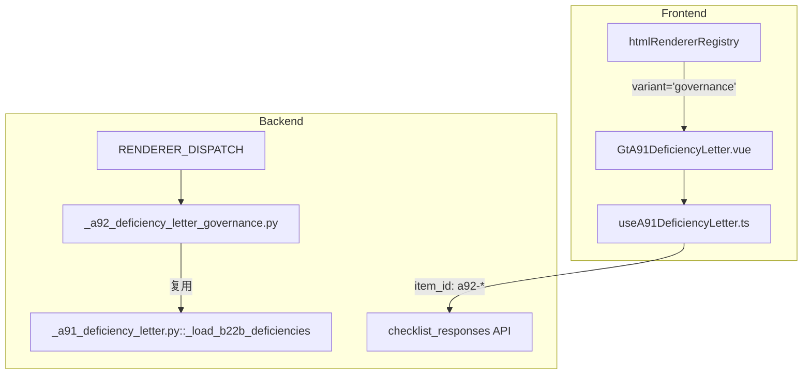

# Design Document: A9-2 向治理层通报内部控制缺陷沟通函

## Overview

复用 GtA91DeficiencyLetter 组件，通过 `variant='governance'` prop 实现治理层沟通函。差异点：收件人=董事会/监事会/审计委员会、缺陷只含重大+重要、无管理层回复区。后端新建极简渲染策略复用 A91 核心逻辑。

## Architecture



### 关键设计决策

| 决策 | 理由 |
|------|------|
| 复用 GtA91DeficiencyLetter 而非新建组件 | 49 段落结构几乎完全一致，仅 3 处条件差异，新建组件造成代码重复 |
| 独立 componentType 而非共用 | wp_code_overrides 需要 1:1 映射，且后端 item_id 命名空间需隔离 |
| variant prop 而非 componentType 内部判断 | 组件无法访问自身 componentType，prop 是最清晰的外部注入方式 |
| 后端独立策略文件 | 尽管逻辑简单，保持 RENDERER_DISPATCH 1:1 映射惯例 |
| item_id 用 a92- 前缀 | 同项目可能同时存在 A9-1 和 A9-2 底稿，数据必须隔离 |

## Components and Interfaces

### 后端组件

#### 1. `routers/wp_render_strategies/_a92_deficiency_letter_governance.py`

```python
async def render(ctx: RenderContext) -> dict | None:
    """A9-2 渲染策略：复用 A91 逻辑，过滤一般缺陷，排除管理层回复区"""
    from ._a91_deficiency_letter import _load_section_data, _load_b22b_deficiencies

    # 1. 加载 section_data（item_id LIKE 'a92-%'）
    section_data = await _load_section_data(ctx, prefix="a92")
    # 2. 移除 response section
    section_data.pop("response", None)
    # 3. 加载 B22B 缺陷（复用）
    deficiencies = await _load_b22b_deficiencies(ctx.project_id, ctx.db)
    # 4. 过滤一般缺陷
    deficiencies.pop("general", None)
    # 5. 加载 project_context
    # 6. 返回 {variant: "governance", section_data, deficiency_list, project_context}
```

返回结构:
```python
{
    "variant": "governance",
    "section_data": {
        "addressee": {"client_name": str, "custom_text": str | None},
        "independence": { ... },  # 同 A9-1
        "committee": {"applicability": "Y" | "N" | "NA" | None, "description": str | None},
        "signature": {"date": str | None},
        # 无 "response" key
    },
    "deficiency_list": {
        "major": [DeficiencyItem],
        "significant": [DeficiencyItem],
        # 无 "general" key
    },
    "project_context": {
        "client_name": str,
        "firm_name": "致同会计师事务所（特殊普通合伙）",
        "audit_report_date": str | None,
    },
    "b22b_warning": str | None,
}
```

### 前端组件

#### 2. GtA91DeficiencyLetter.vue 增量修改

新增 prop:
```typescript
interface Props {
  wpId: string
  projectId: string
  htmlData: object | null
  variant?: 'management' | 'governance'  // 新增，默认 'management'
}
```

条件渲染逻辑:
```vue
<!-- Section 1: 收件人 — 根据 variant 切换文本 -->
<span v-if="variant === 'governance'">{client_name}董事会\监事会\审计委员会：</span>
<span v-else>{client_name}总经理\财务总监\…：</span>

<!-- Section 4: 缺陷 — governance 模式隐藏一般缺陷 -->
<div v-if="variant !== 'governance'" class="deficiency-group-general">...</div>

<!-- Section 7: 管理层回复 — governance 模式隐藏 -->
<el-card v-if="variant !== 'governance'" id="section-response">...</el-card>
```

#### 3. useA91DeficiencyLetter.ts 增量修改

新增 option:
```typescript
interface UseA91DeficiencyLetterOptions {
  wpId: Ref<string>
  projectId: Ref<string>
  htmlData: Ref<A91RenderData | null>
  itemIdPrefix?: string  // 新增: 'a91' | 'a92'，默认 'a91'
}
```

item_id 生成逻辑使用 `itemIdPrefix` 替代硬编码 `a91`。

#### 4. htmlRendererRegistry 注册

```typescript
// htmlRendererRegistry.ts
registry.set('a9-2-deficiency-letter-governance', {
  component: GtA91DeficiencyLetter,
  props: { variant: 'governance' }
})
```

### API 接口

复用现有端点，无新增 API：
| Method | Path | Description |
|--------|------|-------------|
| GET | `/api/workpapers/{wp_id}/render-config` | a9-2-deficiency-letter-governance 策略返回 variant=governance 数据 |
| POST | `/api/checklist-responses/batch` | item_id: `a92-{section}-{field_id}` |

## Data Models

### checklist_responses 存储格式（A9-2 独立命名空间）

| section | item_id 示例 | conclusion | remark |
|---------|-------------|------------|--------|
| addressee | `a92-addressee-client_name` | 自定义收件人文本 | — |
| independence | `a92-independence-team_independent` | "Y" 或 "N" | — |
| deficiency | `a92-deficiency-major` | 条目数量 | JSON 数组 |
| deficiency | `a92-deficiency-significant` | 条目数量 | JSON 数组 |
| committee | `a92-committee-applicability` | "Y" / "N" / "NA" | 描述文本 |
| signature | `a92-signature-date` | "2026-06-26" | — |

注意：无 `a92-deficiency-general` 和 `a92-response-*` 记录。

## Correctness Properties

### Property 1: variant 条件渲染正确性

*For any* variant value in {"management", "governance"}, Section 7 (管理层回复区) SHALL be visible if and only if variant === "management", and the general deficiency sub-group SHALL be visible if and only if variant === "management".

**Validates: Requirements 4.1, 4.2, 5.1**

### Property 2: item_id 命名空间隔离

*For any* field edit in A9-2 mode, the save request SHALL produce item_id matching pattern `a92-{section}-{field_id}`, never `a91-*`.

**Validates: Requirements 7.1, 7.2**

### Property 3: 收件人文本 variant 差异

*For any* non-empty client_name and variant value, the addressee display text SHALL contain "董事会" if and only if variant === "governance", and SHALL contain "总经理" if and only if variant === "management".

**Validates: Requirements 3.1, 3.2**

### Property 4: 后端返回结构与 variant 一致性

*For any* A9-2 render request, the response SHALL contain variant="governance", SHALL NOT contain "general" key in deficiency_list, and SHALL NOT contain "response" key in section_data.

**Validates: Requirements 4.3, 6.1**

### Property 5: 导航项数量与 variant 一致

*For any* variant value, the left navigation SHALL show exactly 7 items when variant === "management" and exactly 6 items when variant === "governance".

**Validates: Requirements 5.2**

## Error Handling

| 场景 | 处理 |
|------|------|
| B22B 底稿不存在 | 同 A9-1：返回空缺陷列表 + b22b_warning |
| variant prop 缺失 | 默认 'management'（向后兼容 A9-1） |
| A9-1 和 A9-2 同时存在 | item_id 前缀隔离（a91/a92），互不干扰 |

## Testing Strategy

### Property-Based Testing (Hypothesis — 后端)

| Property | 测试文件 | 策略 |
|----------|---------|------|
| P4 返回结构 | `test_a92_render_pbt.py` | 随机 project context，验证 governance 结构无 general/response |

### Property-Based Testing (fast-check — 前端)

| Property | 测试文件 | 策略 |
|----------|---------|------|
| P1 条件渲染 | `GtA91DeficiencyLetter.spec.ts` (追加) | 随机 variant 验证 section 可见性 |
| P2 命名空间 | `useA91DeficiencyLetter.spec.ts` (追加) | 随机 field 验证 a92- 前缀 |
| P3 收件人文本 | `GtA91DeficiencyLetter.spec.ts` (追加) | 随机 client_name + variant 验证文本 |
| P5 导航数量 | `GtA91DeficiencyLetter.spec.ts` (追加) | variant → nav count 验证 |

### Unit Tests

- 后端: A92 render 策略返回无 general + 无 response
- 前端: variant='governance' 时 Section 7 不渲染、一般缺陷不渲染、收件人文本正确

### Integration Tests

- Playwright E2E: 加载 A9-2 → 验证仅 6 区块 → 确认无一般缺陷 → 确认无管理层回复区
