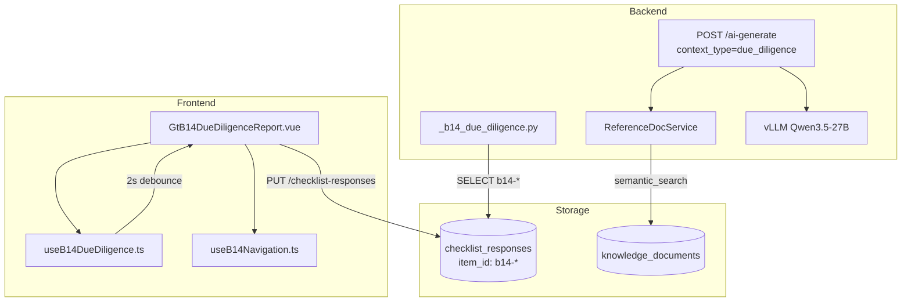

# Design Document: B1-4 尽职调查报告专属组件

## Overview

B1-4 尽职调查（预备调查）报告是 IPO 审计项目承接阶段的核心输出物。本设计将其从 word-template 模式升级为专属精美展示组件，采用 11 章卡片式结构化视图 + 左侧导航 + LLM 知识库辅助生成 + 标准版/简化版双变体切换。

整体架构遵循已验证的 A17-1 模式：
- 前端：Vue 组件 `GtB14DueDiligenceReport.vue` (~400 行) + 2 个 composable (`useB14DueDiligence.ts` + `useB14Navigation.ts`)
- 后端：渲染策略 `_b14_due_diligence.py` + LLM 端点扩展
- 持久化：checklist_responses 表，item_id 模式 `b14-{chapter}-{field}`

### 设计决策

| 决策 | 选择 | 理由 |
|------|------|------|
| 架构模式 | 参照 GtA171AuditSummary | 同为多章卡片+左侧导航+debounce保存，已验证成熟 |
| 变体机制 | el-segmented 切换 + 可见性控制 | 不删数据仅控制 UI 显示，保证切换无损 |
| LLM 集成 | POST /api/projects/{pid}/ai-generate + context_type="due_diligence" | 复用 A17 的 chapter ai-generate 模式 |
| 表格持久化 | JSON → checklist_responses.remark | 复用已有表格型章节模式 (A17-1 ch6/ch8) |
| 导航 | 180px sticky + IntersectionObserver scrollspy | 复用 A171Navigation 模式 |

## Architecture



### 数据流

1. **加载**：render-config → `_b14_due_diligence.render(ctx)` → SELECT checklist_responses WHERE item_id LIKE 'b14-%' → 组装 html_data → 前端 hydrate
2. **保存**：用户编辑 → composable 更新 reactive state → 2s debounce → PUT /api/workpapers/{wpId}/checklist-responses
3. **AI 生成**：用户点击 AI 按钮 → POST /api/projects/{pid}/b14/chapters/{chapter}/ai-generate → ReferenceDocService 检索知识库 → vLLM 生成 → 返回 draft → el-dialog 确认后填入

## Components and Interfaces

### 前端组件

#### GtB14DueDiligenceReport.vue (~400 行)

```typescript
// Props
interface Props {
  wpId: string
  projectId?: string
  htmlData?: B14RenderData | null
}

// 模板结构
// - Toolbar: el-segmented(结构化视图/在线编辑) + el-segmented(标准版/简化版) + 保存状态
// - Layout: 左侧导航(180px sticky) + 右侧内容区
//   - 右侧: 11~13 章 el-collapse 卡片(根据 variant)
//   - 签字区卡片
// - GtOnlyOfficeSheet (在线编辑模式)
```

#### useB14DueDiligence.ts (composable)

```typescript
export interface UseB14Options {
  wpId: Ref<string>
  projectId: Ref<string>
  htmlData: Ref<B14RenderData | null>
}

export interface UseB14Return {
  chapters: Ref<Record<string, B14ChapterData>>
  variant: Ref<'standard' | 'simplified'>
  signature: Ref<B14Signature>
  saveStatus: Ref<'saved' | 'saving' | 'unsaved'>
  // Actions
  updateTextarea: (chapterId: string, field: string, content: string) => void
  updateTableRows: (chapterId: string, tableId: string, rows: Record<string, any>[]) => void
  addTableRow: (chapterId: string, tableId: string) => void
  removeTableRow: (chapterId: string, tableId: string, rowIndex: number) => void
  setVariant: (v: 'standard' | 'simplified') => void
  updateSignature: (field: string, value: string) => void
  flushPendingSaves: () => Promise<void>
}
```

#### useB14Navigation.ts (composable)

```typescript
export interface UseB14NavReturn {
  activeChapter: Ref<string>
  scrollToChapter: (chapterId: string) => void
  completionStatus: ComputedRef<Record<string, boolean>>
  overallProgress: ComputedRef<number>  // 0~100
}
```

### 后端接口

#### 渲染策略 `_b14_due_diligence.py`

```python
async def render(ctx: RenderContext) -> dict | None:
    """B1-4 尽职调查报告渲染策略.
    
    返回:
    {
        "chapters": { "ch1": {...}, "ch2": {...}, ... },
        "variant": "standard" | "simplified",
        "signature": { "partner": null, "partner_date": null, "manager": null, "manager_date": null, "report_date": null },
        "project_context": { "client_name": "", "industry": "", "audit_period": "", "firm_name": "" }
    }
    """
```

#### LLM 生成端点

```
POST /api/projects/{project_id}/b14/chapters/{chapter_id}/ai-generate
Body: { "mode": "generate" | "polish", "user_hint": "...", "current_content": "..." }
Response: { "draft": "...", "model": "...", "confidence": 0.85, "error": null }
```

### 注册要求

1. `VALID_COMPONENT_TYPES` (wp_classification_service.py) 新增 `"b1-4-due-diligence-report"`
2. `htmlRendererRegistry.ts` 注册组件映射
3. `wp_code_overrides.json` 中 B1-4 映射到 `b1-4-due-diligence-report`
4. 后端 `RENDERER_DISPATCH` 注册渲染策略

## Data Models

### B14RenderData (后端→前端)

```typescript
interface B14RenderData {
  chapters: Record<string, B14ChapterData>
  variant: 'standard' | 'simplified'
  signature: B14Signature
  project_context: B14ProjectContext
}

interface B14ChapterData {
  id: string           // "ch1" ~ "ch13"
  title: string        // 中文章节标题
  type: 'textarea' | 'table' | 'mixed'
  visible: boolean     // 受 variant 控制
  sections?: B14Section[]  // mixed 类型的子节
}

interface B14Section {
  id: string
  title: string
  type: 'textarea' | 'table'
  content?: string | null           // textarea 类型
  tableId?: string                  // table 类型
  rows?: Record<string, any>[]      // table 类型
  columns?: B14TableColumn[]        // table 列定义
}

interface B14TableColumn {
  key: string
  label: string
  width?: number
  editable?: boolean
}

interface B14Signature {
  partner: string | null
  partner_date: string | null
  manager: string | null
  manager_date: string | null
  report_date: string | null
}

interface B14ProjectContext {
  client_name: string
  industry: string
  audit_period: string
  firm_name: string
}
```

### checklist_responses 持久化模式

| item_id 模式 | 用途 | conclusion | remark |
|---|---|---|---|
| `b14-meta-variant` | 变体选择 | "standard"/"simplified" | null |
| `b14-ch{N}-content` | textarea 章节正文 | null | 文本内容 |
| `b14-ch{N}-{section_id}` | 子节 textarea | null | 文本内容 |
| `b14-ch{N}-table-{tableId}` | 表格数据 | null | JSON rows |
| `b14-signature-{field}` | 签字区 | 值 | null |

### 章节结构定义

| 章号 | 标题 | 类型 | 子节 | 变体限制 |
|------|------|------|------|----------|
| ch1 | 序言 | textarea | — | 全部 |
| ch2 | 报告概要 | mixed | 调查目的/调查范围/调查方法/项目团队(table) | 全部 |
| ch3 | 释义 | textarea | — | 全部 |
| ch4 | 公司基本情况 | mixed | 历史沿革/组织架构/股东信息(table)/人力资源(table) | 全部 |
| ch5 | 公司经营情况 | mixed | 主营业务/主要客户(table)/主要供应商(table)/行业地位 | 全部 |
| ch6 | 财务信息分析 | mixed | 资产负债/利润/现金流/关键比率 | 全部 |
| ch7 | 同行业比较 | table | 对比表(指标/目标/对标1/对标2) | 全部 |
| ch8 | 税项 | mixed | 纳税情况/税收优惠 | 全部 |
| ch9 | 内部控制 | mixed | 控制环境/风险评估/控制活动 | 全部 |
| ch10 | 关联方关系及交易 | mixed | 关联方清单(table)/关联交易(table) | 全部 |
| ch11 | 上市条件分析 | mixed | 发行条件/主板条件/科创板条件 | standard only |
| ch12 | 财务尽职调查的结果 | textarea | — | standard only |
| ch13 | 公司存在的主要问题及建议 | mixed | 主要问题/建议措施 | 全部 |

### 预定义表格结构

```typescript
const TABLE_SCHEMAS: Record<string, B14TableColumn[]> = {
  'team': [
    { key: 'role', label: '角色', width: 120 },
    { key: 'name', label: '人员', width: 100 },
    { key: 'duty', label: '职责', width: 200 },
  ],
  'shareholders': [
    { key: 'name', label: '股东名称', width: 150 },
    { key: 'ratio', label: '持股比例(%)', width: 100 },
    { key: 'contribution', label: '出资方式', width: 120 },
  ],
  'customers': [
    { key: 'name', label: '客户名称', width: 150 },
    { key: 'revenue_ratio', label: '收入占比(%)', width: 100 },
    { key: 'aging', label: '账龄', width: 100 },
  ],
  'suppliers': [
    { key: 'name', label: '供应商名称', width: 150 },
    { key: 'purchase_ratio', label: '采购占比(%)', width: 100 },
  ],
  'industry_comparison': [
    { key: 'indicator', label: '指标', width: 120 },
    { key: 'target', label: '目标公司', width: 120 },
    { key: 'peer1', label: '对标公司1', width: 120 },
    { key: 'peer2', label: '对标公司2', width: 120 },
  ],
  'related_parties': [
    { key: 'name', label: '关联方名称', width: 150 },
    { key: 'relationship', label: '关联关系', width: 120 },
    { key: 'transaction_type', label: '交易类型', width: 120 },
    { key: 'amount', label: '交易金额(元)', width: 120 },
  ],
}
```


## Correctness Properties

*A property is a characteristic or behavior that should hold true across all valid executions of a system—essentially, a formal statement about what the system should do. Properties serve as the bridge between human-readable specifications and machine-verifiable correctness guarantees.*

### Property 1: Variant controls chapter visibility

*For any* variant value ('standard' or 'simplified') and the full chapter list, the set of visible chapters should exactly match the expected set: 'simplified' hides ch11 and ch12, 'standard' shows all 13 chapters. No other chapters are affected by variant changes.

**Validates: Requirements 2.2, 4.2**

### Property 2: Variant switch preserves chapter data

*For any* set of chapter data (with arbitrary filled content across all chapters) and any sequence of variant switches, the chapter data content (text, table rows, Y/N values) should remain identical before and after the switch. Only the `visible` flag may change.

**Validates: Requirements 4.3**

### Property 3: Completion status computation

*For any* chapter data state, the completion status for each chapter should be: true if the chapter has non-empty content (textarea has text, table has ≥1 row, mixed has ≥1 non-empty section), false otherwise. The overall progress percentage should equal (count of completed visible chapters / total visible chapters × 100), rounded to nearest integer.

**Validates: Requirements 3.4, 3.5**

### Property 4: item_id format correctness

*For any* chapter number (1-13), field identifier, and signature field name, the generated item_id should match the pattern `b14-ch{N}-{field_id}` for chapter fields, `b14-signature-{field}` for signature fields, and `b14-meta-variant` for the variant meta field. All item_ids produced by the composable must be valid against this schema.

**Validates: Requirements 5.2, 9.3**

### Property 5: Table data JSON round-trip

*For any* valid table rows array (containing objects with string/number/null values), serializing to JSON for storage in checklist_responses.remark and deserializing back should produce an equivalent array.

**Validates: Requirements 5.5**

### Property 6: B14RenderData serialization round-trip

*For any* valid B14RenderData object (containing chapters with various types, variant, signature, project_context), serializing to JSON and deserializing back should produce a structurally equivalent object.

**Validates: Requirements 7.4**

### Property 7: Render function produces well-structured output

*For any* set of checklist_responses rows with item_ids matching `b14-*` prefix, the render function should produce an output containing: a `chapters` dict keyed by chapter id, a `variant` string of value 'standard' or 'simplified', a `signature` dict with all required fields, and a `project_context` dict with client_name/industry/audit_period/firm_name.

**Validates: Requirements 7.2**

### Property 8: LLM prompt includes required context sections

*For any* chapter id, project context (client_name, industry, audit_period), knowledge base documents (0-3 docs), and cross-chapter summaries, the constructed LLM prompt should contain: the chapter title, all provided knowledge base documents, project basic info, and (if mode=polish) the current content.

**Validates: Requirements 6.4**

## Error Handling

| 场景 | 处理方式 |
|------|----------|
| checklist_responses 保存失败 | 指数退避重试 3 次，失败后 ElMessage.warning 提示 |
| render-config selfLoad 失败 | 静默失败，显示空章节结构供用户手动填写 |
| OnlyOffice 健康检查失败 | 隐藏"在线编辑"选项，仅保留结构化视图 |
| LLM 服务不可用 (超时/500) | AI 按钮 disabled + tooltip "AI 服务暂不可用" |
| LLM 生成返回空内容 | el-dialog 提示"生成失败，请稍后重试" |
| 知识库无匹配文档 | 继续生成（prompt 中不包含知识库参考部分），不报错 |
| 表格 JSON 解析失败 | 初始化空数组，ElMessage.warning 提示数据格式异常 |
| variant 值非法 | 降级为 'standard' |

## Testing Strategy

### 属性测试 (Property-Based Testing)

- 框架：前端 fast-check，后端 hypothesis
- 每个属性测试最少 100 次迭代
- 每个测试用注释标注对应的设计属性编号

标注格式：`/** Feature: b1-4-due-diligence-report, Property {N}: {title} */`

| Property | 测试方式 | 框架 |
|----------|----------|------|
| P1: Variant controls visibility | 生成随机 variant，验证 visible chapters 集合 | fast-check |
| P2: Variant switch preserves data | 生成随机 chapter data + 随机 variant 序列，验证 data 不变 | fast-check |
| P3: Completion computation | 生成随机 chapter data 状态，验证 completion 计算正确 | fast-check |
| P4: item_id format | 生成随机 chapter number + field name，验证 pattern 匹配 | fast-check |
| P5: Table JSON round-trip | 生成随机 table rows，验证 JSON.stringify→JSON.parse 等价 | fast-check |
| P6: RenderData round-trip | 生成随机 B14RenderData，验证序列化→反序列化等价 | hypothesis |
| P7: Render output structure | 生成随机 checklist_responses 行，验证 render 输出结构完整 | hypothesis |
| P8: LLM prompt context | 生成随机 context 参数，验证 prompt 包含所有必需部分 | hypothesis |

### 单元测试 (Unit Tests)

| 测试点 | 覆盖 |
|--------|------|
| hydrate 从 htmlData 正确初始化 chapters | Req 7.2 |
| updateTextarea 触发 pendingItems + scheduleSave | Req 5.1 |
| addTableRow/removeTableRow 正确修改 rows | Req 8.2 |
| setVariant 持久化 b14-meta-variant | Req 4.4 |
| selfLoad 在 htmlData=null 时调用 render-config | Req 1.6 |
| OO 健康检查失败 → modeOptions 只剩一项 | Req 1.5 |
| flushPendingSaves 在模式切换前被调用 | Req 1.4, 5.4 |
| 签字区字段 updateSignature 生成正确 item_id | Req 9.3 |
| GtIndexChip 出现在正确章节 | Req 10.1-10.3 |
| 默认展开 ch1+ch2 | Req 2.3 |

### 集成测试 (Backend)

| 测试点 | 覆盖 |
|--------|------|
| render 函数从空 checklist_responses 返回默认结构 | Req 7.2 |
| render 函数正确解析各 item_id 前缀 | Req 7.1 |
| project_context 从 projects 表正确加载 | Req 7.3 |
| AI generate 端点返回正确 schema | Req 6.2 |
| AI generate 注入知识库文档 | Req 6.3 |

### E2E 测试 (Playwright)

| 测试点 | 覆盖 |
|--------|------|
| 打开 B1-4 → 看到结构化视图 + 11 章 | Req 1.2, 2.1 |
| 切换变体 → ch11/ch12 显示/隐藏 | Req 4.2 |
| 编辑 textarea → 2s 后保存状态变为 ✓ | Req 5.1, 5.3 |
| 表格添加/删除行功能正常 | Req 8.1-8.3 |
