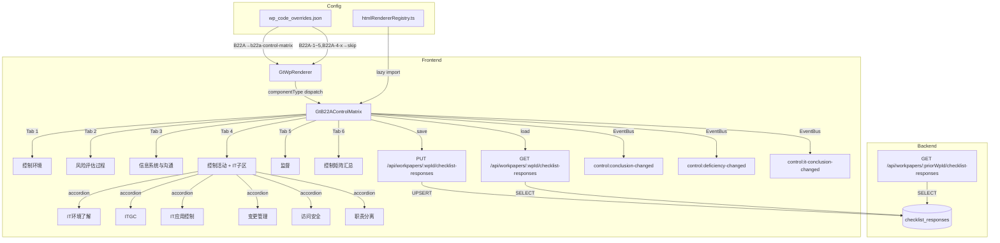

# Design Document — B22A 内部控制了解程序表

## Overview

本设计将现有 B22A-1~5 + B22A-4-1~4-5 共计 11 个独立 `d-form-table` 底稿替换为统一的 `GtB22AControlMatrix.vue` 组件，通过 6-tab 界面（5 COSO 要素 + 汇总）聚合全部内控了解工作流。

关键设计决策：
- **零新表**：所有数据通过 `checklist_responses` 表存储，item_id 前缀 `B22A-` 区分字段
- **零新端点**：复用 `PUT /api/workpapers/{wp_id}/checklist-responses` 批量保存
- **注册替换**：在 htmlRendererRegistry 注册 `b22a-control-matrix`，wp_code_overrides 映射 B22A→`b22a-control-matrix`，B22A-1~5 + B22A-4-x→`skip`
- **3 Composables**：`useB22AFormData`（数据加载/保存）+ `useB22AControlMatrix`（检查项管理/结论评估/要素评分/缺陷追踪）+ `useB22AReview`（现场经理复核签字/只读/Amendment）
- **COSO 五要素 Tab**：Tab_1~5 各含结构化检查项表 + Tab_4 内嵌 IT 控制子区（手风琴 6 面板）
- **汇总 Tab**：交叉矩阵 + 自动 Element_Score + 缺陷清单 + 整体结论
- **IT 依赖作用域**：IT_Dependency（高/中/低）决定 Tab_4 子区必填/选填状态
- **跨底稿联动**：EventBus 发布控制结论变更事件，驱动 B50 控制风险 + B22B 缺陷评价
- **续审继承**：从上年 checklist_responses 按 item_id 匹配加载历史数据

## Architecture



### 数据流

1. **打开底稿** → GtWpRenderer 查 wp_code_overrides → 得到 `b22a-control-matrix` → 从 registry 加载组件
2. **初始化** → 组件调用 GET checklist-responses 加载全部 `B22A-*` 数据，按 item_id 前缀分发到 6 个 tab
3. **续审加载** → 若项目为续审且当前数据为空，从上年 wp_id 加载历史 `B22A-*` 数据作为初始值
4. **编辑** → 文本字段 debounce 2s / Conclusion、Element_Score 选择立即保存 → PUT checklist-responses
5. **自动计算** → 检查项 Conclusion 变更 → 重算 Element_Score（有效/部分有效/无效）→ 更新 Summary_Tab
6. **缺陷追踪** → Conclusion 为设计无效/未实施 → 自动加入缺陷清单 → EventBus 通知 B22B
7. **复核** → 全部完成 → 现场经理签字 → 全组件只读 → emit `completed`
8. **联动** → 整体结论/IT 结论变更 → EventBus publish → B50 接收控制风险输入

## Components and Interfaces

### GtB22AControlMatrix.vue

```typescript
// Props（标准 contextProps='standard' 模式）
interface Props {
  wpId: string
  projectId: string
  wpCode: string
  year: number
  readonly?: boolean
}

// Emits
interface Emits {
  (e: 'save'): void
  (e: 'completed'): void
}

// Expose（GtWpToolbar 委托模式）
interface Expose {
  // 无额外 expose，toolbar 无自定义操作
}
```

### 内部组合式函数

```typescript
// composables/useB22AFormData.ts
// 管理全部 6 tab 数据加载、debounce 保存、即时保存、续审继承
export function useB22AFormData(wpId: Ref<string>) {
  return {
    // 响应式数据
    allResponses: Ref<Map<string, ChecklistResponse>>,
    loading: Ref<boolean>,
    saving: Ref<boolean>,
    // 方法
    loadAll(): Promise<void>,
    loadPriorYear(priorWpId: string): Promise<void>,
    saveImmediate(items: ChecklistItem[]): Promise<void>,
    saveDebouncedText(item: ChecklistItem): void,
    flushPendingSave(): void,
    // Tab 数据视图
    tab1Data: ComputedRef<TabState>,  // B22A-T1-
    tab2Data: ComputedRef<TabState>,  // B22A-T2-
    tab3Data: ComputedRef<TabState>,  // B22A-T3-
    tab4Data: ComputedRef<TabState>,  // B22A-T4- + B22A-T4-IT-
    tab5Data: ComputedRef<TabState>,  // B22A-T5-
    summaryData: ComputedRef<TabState>,  // B22A-SUM- + B22A-review- + B22A-amend-
    // Helper
    getField(itemId: string): ChecklistResponse,
    setFieldImmediate(itemId: string, data: Partial<ChecklistResponse>): void,
  }
}

// composables/useB22AControlMatrix.ts
// 管理检查项 CRUD、Conclusion 评估、Element_Score 自动计算、缺陷追踪、IT 依赖
export function useB22AControlMatrix(
  allResponses: Ref<Map<string, ChecklistResponse>>,
  saveImmediate: SaveFn
) {
  return {
    // 检查项管理（per tab）
    getCheckItems(tab: TabNumber): ComputedRef<CheckItem[]>,
    addCheckItem(tab: TabNumber, subPanel?: ITSubPanel): void,
    removeCheckItem(tab: TabNumber, index: number, subPanel?: ITSubPanel): void,
    setConclusion(tab: TabNumber, index: number, conclusion: Conclusion, subPanel?: ITSubPanel): void,
    setUnderstandingMethod(tab: TabNumber, index: number, methods: UnderstandingMethod[], subPanel?: ITSubPanel): void,
    // Element_Score
    computeElementScore(tab: TabNumber): ComputedRef<ElementScore>,
    overrideElementScore(tab: TabNumber, score: ElementScore, reason: string): void,
    isScoreOverridden(tab: TabNumber): ComputedRef<boolean>,
    // IT 依赖
    itDependency: Ref<ITDependency>,
    setITDependency(level: ITDependency): void,
    itgcConclusion: ComputedRef<ElementScore | null>,
    isITGCInvalid: ComputedRef<boolean>,
    // 缺陷追踪
    deficiencyList: ComputedRef<DeficiencyItem[]>,
    // 汇总统计
    elementStats: ComputedRef<Record<TabNumber, ElementStat>>,
    overallConclusion: Ref<ElementScore | null>,
    // Tab 完成状态
    tabStatus(tab: TabNumber): ComputedRef<TabStatus>,
    completedElementCount: ComputedRef<number>,
    // 续审
    priorYearData: Ref<Map<string, ChecklistResponse>>,
    markNoChange(tab: TabNumber, index: number, confirmer: string): void,
    // 业务规则警告
    controlEnvWeakWarning: ComputedRef<boolean>,
    itControlWeakWarning: ComputedRef<boolean>,
  }
}

// composables/useB22AReview.ts
// 管理现场经理复核签字、只读状态、Amendment 机制
export function useB22AReview(
  wpId: Ref<string>,
  allResponses: Ref<Map<string, ChecklistResponse>>,
  completedElementCount: ComputedRef<number>,
  overallConclusion: Ref<ElementScore | null>,
  externalReadonly: Ref<boolean>,
  saveImmediate: SaveFn
) {
  return {
    isReviewed: ComputedRef<boolean>,
    isReadonly: ComputedRef<boolean>,
    canReview: ComputedRef<boolean>,
    pendingItems: ComputedRef<string[]>,
    reviewInfo: ComputedRef<{ reviewer: string; date: string } | null>,
    // 操作
    doReview(): Promise<void>,
    startAmendment(reason: string): Promise<void>,
  }
}
```

### 注册

```typescript
// htmlRendererRegistry.ts — 新增条目
{
  componentType: 'b22a-control-matrix',
  component: defineAsyncComponent(() => import('./GtB22AControlMatrix.vue')),
  icon: '🛡️',
  label: 'B22A 内部控制了解程序表',
  emits: ['save', 'completed'],
  contextProps: 'standard',
}
```

### wp_code_overrides.json 变更

```json
"B22A": "b22a-control-matrix",
"B22A-1": "skip",
"B22A-2": "skip",
"B22A-3": "skip",
"B22A-4": "skip",
"B22A-4-1": "skip",
"B22A-4-2": "skip",
"B22A-4-3": "skip",
"B22A-4-4-1": "skip",
"B22A-4-4-2": "skip",
"B22A-4-5": "skip",
"B22A-5": "skip"
```

## Data Models

### 类型定义

```typescript
/** Tab 编号 */
type TabNumber = 1 | 2 | 3 | 4 | 5

/** 检查项结论 */
type Conclusion = '设计有效' | '设计无效' | '已实施' | '未实施' | '不适用'

/** 了解方法（多选） */
type UnderstandingMethod = '询问' | '观察' | '检查文件' | '穿行测试'

/** 要素层面评分 */
type ElementScore = '有效' | '部分有效' | '无效'

/** IT 依赖程度 */
type ITDependency = '高' | '中' | '低'

/** IT 子面板标识 */
type ITSubPanel = 'env' | 'itgc' | 'app' | 'change' | 'access' | 'sod'

/** Tab 完成状态 */
type TabStatus = 'empty' | 'partial' | 'complete'

/** 检查项 */
interface CheckItem {
  index: number
  controlPoint: string        // 控制要点
  description: string         // 控制活动描述
  methods: UnderstandingMethod[]  // 了解方法（多选）
  conclusion: Conclusion | null   // 结论
  reference: string           // 参考依据/索引
  isPreset: boolean           // 是否预置（不可删除）
  isDeficiency: boolean       // 是否为控制缺陷（computed）
  priorYearConclusion: Conclusion | null  // 上年结论（续审时显示）
  noChangeConfirmed: boolean  // 本年无变化确认标记
  noChangeConfirmer: string | null
  noChangeDate: string | null
}

/** 要素统计 */
interface ElementStat {
  total: number
  effective: number       // 设计有效 + 已实施
  deficient: number       // 设计无效 + 未实施
  notApplicable: number   // 不适用
  incomplete: number      // 未设置结论
}

/** 缺陷条目 */
interface DeficiencyItem {
  tab: TabNumber
  subPanel: ITSubPanel | null
  index: number
  controlPoint: string
  deficiencyType: '设计无效' | '未实施'
  elementName: string     // 所属要素名称
}

/** 复核状态 */
interface ReviewState {
  reviewed: boolean
  reviewerName: string | null
  reviewDate: string | null   // YYYY-MM-DD
  amendmentReason: string | null
}

/** EventBus 控制结论变更事件载荷 */
interface ControlConclusionPayload {
  elementScores: Record<TabNumber, ElementScore | null>
  itDependency: ITDependency
  itgcConclusion: ElementScore | null
  overallConclusion: ElementScore | null
}

/** EventBus 缺陷变更事件载荷 */
interface DeficiencyChangePayload {
  added: DeficiencyItem[]
  removed: DeficiencyItem[]
  total: number
}
```

### item_id 命名规范

所有字段使用 `checklist_responses` 表，通过 item_id 前缀 `B22A-` 区分：

| Tab/区域 | item_id 模式 | conclusion | remark | wp_ref |
|---------|-------------|-----------|--------|--------|
| **Tab 1~5 检查项** | | | | |
| 控制要点 | `B22A-T{n}-item-{idx}-point` | — | 控制要点文本 | — |
| 控制描述 | `B22A-T{n}-item-{idx}-desc` | — | 描述文本 | — |
| 了解方法 | `B22A-T{n}-item-{idx}-method` | — | 逗号分隔：询问,观察,检查文件,穿行测试 | — |
| 检查项结论 | `B22A-T{n}-item-{idx}-conclusion` | 设计有效/设计无效/已实施/未实施/不适用 | — | — |
| 参考引用 | `B22A-T{n}-item-{idx}-ref` | — | 参考文本 | — |
| 检查项数量 | `B22A-T{n}-count` | — | 数字字符串 | — |
| 要素审计说明 | `B22A-T{n}-note` | — | 说明文本 | — |
| 要素整体结论 | `B22A-T{n}-score` | 有效/部分有效/无效 | — | — |
| 手动覆盖标记 | `B22A-T{n}-score-override` | Y/null | 覆盖理由 | — |
| **Tab 4 IT 子区** | | | | |
| IT 依赖程度 | `B22A-T4-IT-dependency` | 高/中/低 | — | — |
| IT 子面板检查项 | `B22A-T4-IT-{panel}-{idx}-point` | — | 控制要点文本 | — |
| IT 子面板描述 | `B22A-T4-IT-{panel}-{idx}-desc` | — | 描述文本 | — |
| IT 子面板方法 | `B22A-T4-IT-{panel}-{idx}-method` | — | 逗号分隔方法 | — |
| IT 子面板结论 | `B22A-T4-IT-{panel}-{idx}-conclusion` | 设计有效/设计无效/已实施/未实施/不适用 | — | — |
| IT 子面板引用 | `B22A-T4-IT-{panel}-{idx}-ref` | — | 参考文本 | — |
| IT 子面板数量 | `B22A-T4-IT-{panel}-count` | — | 数字字符串 | — |
| ITGC 整体结论 | `B22A-T4-IT-itgc-score` | 有效/部分有效/无效 | — | — |
| **续审标记** | | | | |
| 本年无变化 | `B22A-T{n}-item-{idx}-nochange` | Y/null | 确认人姓名 | 日期 YYYY-MM-DD |
| IT 子面板无变化 | `B22A-T4-IT-{panel}-{idx}-nochange` | Y/null | 确认人姓名 | 日期 YYYY-MM-DD |
| **汇总 Tab** | | | | |
| 整体结论 | `B22A-SUM-overall` | 有效/部分有效/无效 | — | — |
| 整体说明 | `B22A-SUM-note` | — | 说明文本 | — |
| **现场经理复核** | | | | |
| 复核签字 | `B22A-review-sign` | Y/null | 复核人姓名 | 日期 YYYY-MM-DD |
| **修改（Amendment）** | | | | |
| 修改原因 | `B22A-amend-{n}-reason` | — | 原因文本 | — |
| 修改后复核 | `B22A-amend-{n}-review-sign` | Y/null | 复核人姓名 | 日期 |

> `{n}` = Tab 编号 1~5；`{idx}` = 行序号从 1 开始；`{panel}` = IT 子面板标识（env/itgc/app/change/access/sod）

### Element_Score 自动计算规则

```typescript
function computeAutoScore(items: CheckItem[]): ElementScore {
  // 排除"不适用"项
  const applicable = items.filter(i => i.conclusion && i.conclusion !== '不适用')
  if (applicable.length === 0) return '有效' // 全部不适用视为有效

  const deficient = applicable.filter(
    i => i.conclusion === '设计无效' || i.conclusion === '未实施'
  )

  if (deficient.length === 0) return '有效'
  if (deficient.length / applicable.length <= 0.2) return '部分有效'
  return '无效'
}
```

### 颜色编码映射

```typescript
const SCORE_COLOR_MAP: Record<ElementScore | '不适用', { bg: string; text: string }> = {
  '有效':     { bg: '#D1FAE5', text: '#059669' },  // 绿色系
  '部分有效': { bg: '#FEF3C7', text: '#D97706' },  // 黄色系
  '无效':     { bg: '#FEE2E2', text: '#DC2626' },  // 红色系
  '不适用':   { bg: '#F3F4F6', text: '#6B7280' },  // 灰色系
}
```

### IT 子面板配置

```typescript
const IT_SUB_PANELS: { key: ITSubPanel; label: string }[] = [
  { key: 'env', label: 'IT环境了解' },
  { key: 'itgc', label: 'IT通用控制(ITGC)' },
  { key: 'app', label: 'IT应用控制' },
  { key: 'change', label: '变更管理' },
  { key: 'access', label: '访问安全' },
  { key: 'sod', label: '职责分离' },
]

/** IT 依赖程度→子面板必填状态映射 */
const IT_REQUIRED_MAP: Record<ITDependency, { expanded: boolean; required: boolean; hint: string }> = {
  '高': { expanded: true, required: true, hint: '' },
  '中': { expanded: true, required: false, hint: '可选择性执行' },
  '低': { expanded: false, required: false, hint: '可简化执行' },
}
```

### COSO 五要素 Tab 配置

```typescript
const COSO_TABS: { tab: TabNumber; label: string; code: string }[] = [
  { tab: 1, label: '控制环境', code: 'T1' },
  { tab: 2, label: '风险评估过程', code: 'T2' },
  { tab: 3, label: '信息系统与沟通', code: 'T3' },
  { tab: 4, label: '控制活动', code: 'T4' },
  { tab: 5, label: '监督', code: 'T5' },
]
```

### 只读判定逻辑

```typescript
function computeIsReadonly(externalReadonly: boolean, reviewState: ReviewState): boolean {
  if (externalReadonly) return true
  return reviewState.reviewed === true
}
```

### Tab 完成状态计算

```typescript
function computeTabStatus(items: CheckItem[]): TabStatus {
  if (items.length === 0) return 'empty'
  const withConclusion = items.filter(i => i.conclusion !== null)
  if (withConclusion.length === 0) return 'empty'
  if (withConclusion.length === items.length) return 'complete'
  return 'partial'
}
```


## Correctness Properties

*A property is a characteristic or behavior that should hold true across all valid executions of a system—essentially, a formal statement about what the system should do. Properties serve as the bridge between human-readable specifications and machine-verifiable correctness guarantees.*

### Property 1: Tab 切换数据保持不变式

*For any* tab 切换操作序列和任意已编辑内容，切换前各 tab 的响应式数据状态在切换后 SHALL 保持不变。具体：对任意 `switchTab(from, to)` 后再 `switchTab(to, from)`，各 tab 数据的深度比较应等于切换前的快照。

**Validates: Requirements 1.3**

### Property 2: Element_Score 自动计算一致性

*For any* 要素下的检查项 Conclusion 分布，`computeAutoScore(items)` SHALL 满足：(a) 排除"不适用"后全部为"设计有效"/"已实施" → 返回"有效"；(b) 存在"设计无效"/"未实施"且占比≤20% → 返回"部分有效"；(c) 占比>20% → 返回"无效"。手动覆盖不影响计算逻辑本身，仅覆盖显示值。

**Validates: Requirements 5.1, 5.2, 5.3, 5.4, 4.2**

### Property 3: 控制缺陷清单同步不变式

*For any* 检查项 Conclusion 状态集合，`deficiencyList` SHALL 始终等于所有 Conclusion 为"设计无效"或"未实施"的检查项集合。将缺陷项修改为"设计有效"后应从清单移除；将有效项修改为"设计无效"后应加入清单。该不变式对 Tab_1~5 和 IT 子面板检查项统一适用。

**Validates: Requirements 6.1, 6.5, 2.7**

### Property 4: IT 依赖程度作用域约束

*For any* IT_Dependency 等级值，Tab_4 IT 子区的展开/必填状态 SHALL 满足：高 → 全部子面板展开且标记必填；中 → 子面板展开但标记可选；低 → 子面板收起且标注"可简化执行"。IT_Dependency 切换不改变已填写的数据内容，仅改变 UI 必填提示状态。WHEN ITGC 整体结论为"无效"时，IT 应用控制子面板 SHALL 显示依赖程度降低警告。

**Validates: Requirements 3.3, 3.4, 3.5, 3.7**

### Property 5: 复核前置条件完备性

*For any* 五要素检查项状态和 Summary_Tab 整体结论的组合，`canReview` SHALL 为 `true` 当且仅当：(a) 所有要素（Tab_1~5）的全部检查项（不含 conclusion 为"不适用"的）均已设置 Conclusion，且 (b) `overallConclusion` 已选择（非 null）。条件不满足时 `canReview` 必须为 `false`。

**Validates: Requirements 10.2**

### Property 6: 复核后只读不变式

*For any* 组件状态，若 `B22A-review-sign` 的 conclusion='Y' 或外部 `readonly` prop 为 `true`，则 `isReadonly` SHALL 为 `true`。在 `isReadonly=true` 时，所有写入操作（setConclusion / addCheckItem / removeCheckItem / setUnderstandingMethod / overrideElementScore / doReview）应被阻止（no-op 或抛出）。Amendment 操作 SHALL 重置 review 签字后恢复可编辑状态。

**Validates: Requirements 10.3, 10.5, 10.6**

### Property 7: 数据持久化往返一致性

*For any* 有效的 ChecklistItem（item_id 以 `B22A-` 开头，conclusion 在白名单范围内），通过 PUT 保存后再通过 GET 加载，返回的 { item_id, conclusion, remark, wp_ref } 四元组 SHALL 与保存前完全一致。

**Validates: Requirements 9.1, 9.5, 9.6**

### Property 8: item_id 命名唯一性

*For any* 组合（tab ∈ {T1,T2,T3,T4,T5} × 子区标识 × 行序号 × 字段类型），`generateItemId(tab, subPanel, index, field)` 生成的 item_id SHALL 唯一。对于 Tab_4 IT 子区，任意两个不同的 (panel, index, field) 三元组产生不同 item_id；相同三元组重复调用产生相同 item_id。

**Validates: Requirements 9.7**

### Property 9: 颜色编码双射

*For any* ElementScore 值，`SCORE_COLOR_MAP[score].bg` 映射 SHALL 满足双射：有效→绿色系、部分有效→黄色系、无效→红色系、不适用→灰色系。不存在同色不同级或同级不同色。

**Validates: Requirements 4.3**

### Property 10: 续审数据继承完整性

*For any* 续审项目从上年加载数据的操作，加载后各检查项的 `priorYearConclusion` SHALL 等于上年对应 item_id 的 conclusion 值。加载过程仅填充当前为空的检查项初始值，不覆盖已有编辑内容。

**Validates: Requirements 8.3, 8.4**

### Property 11: EventBus 控制结论变更事件发射

*For any* Summary_Tab 整体结论或要素 Element_Score 变更操作且新旧值不同，系统 SHALL 发布包含 `{ elementScores, itDependency, itgcConclusion, overallConclusion }` 的 `control:conclusion-changed` 事件。未变更时不发射事件。IT_Dependency 或 ITGC 结论变更 SHALL 额外触发 `control:it-conclusion-changed` 事件。Tab_1 控制环境结论为"无效"时 SHALL 触发控制环境薄弱事件。

**Validates: Requirements 7.1, 7.2, 7.3, 7.5**

### Property 12: Tab/要素完成状态准确性

*For any* 要素下的检查项状态集合，`tabStatus(tab)` SHALL 满足：无任何检查项有 conclusion → 'empty'；部分有 conclusion → 'partial'；全部有 conclusion → 'complete'。`completedElementCount` SHALL 等于 Element_Score 已设置（非 null）的要素数量。各要素统计 `elementStats[tab]` 中的 effective/deficient/notApplicable/incomplete 计数 SHALL 等于对应 conclusion 值的实际数量之和。

**Validates: Requirements 1.4, 1.6, 4.6**

### Property 13: 业务规则警告条件正确性

*For any* Tab_1 Element_Score 和关键检查项结论组合，`controlEnvWeakWarning` SHALL 为 `true` 当且仅当 Tab_1 score 为"无效"/"部分有效"且存在管理层诚信/治理层独立性相关检查项为"设计无效"。`itControlWeakWarning` SHALL 为 `true` 当且仅当 IT_Dependency="高"且 ITGC 结论为"无效"。条件恢复后警告 SHALL 自动消失。

**Validates: Requirements 13.1, 13.3, 13.4, 4.5**

## Error Handling

| 场景 | 行为 |
|------|------|
| PUT 保存失败（网络/500） | ElMessage.error('保存失败')，保留本地数据不回滚 |
| GET 加载失败 | ElMessage.warning('数据加载失败')，表单保持空白可编辑状态 |
| 续审加载上年数据失败 | ElMessage.warning('上年数据加载失败')，不阻塞当前底稿使用 |
| 删除预置检查项尝试 | 操作静默拒绝 + ElMessage.warning('预置检查项不可删除') |
| 复核时前置条件不满足 | 签字按钮禁用 + 显示待完成事项清单 |
| Amendment 原因为空/纯空白 | 拒绝提交，显示校验错误 |
| conclusion 值不在白名单 | 后端 422，前端显示校验错误 |
| ITGC 无效警告 | IT 应用控制子面板顶部显示黄色警告条（不阻止填写） |
| 控制环境薄弱警告 | Summary_Tab 顶部红色横幅（不阻止操作，仅提示） |
| 组件卸载时保存失败 | 静默失败（已离开页面），下次打开从后端加载 |
| EventBus 发布失败 | 仅 console.warn，不影响本组件保存 |
| 手动覆盖 Element_Score 无理由 | 拒绝覆盖操作，提示"需填写调整理由" |

### 后端 conclusion 白名单扩展

在 `checklist_responses.py` 现有 `elif item.item_id.startswith("B50-"):` 分支后新增 `elif item.item_id.startswith("B22A-"):` 分支：

```python
elif item.item_id.startswith("B22A-"):
    # B22A 内部控制了解：结论枚举 + 了解方法 + 评分 + 签字 + IT依赖
    allowed = (
        "设计有效", "设计无效", "已实施", "未实施", "不适用",  # Conclusion
        "Y", "N", "NA",                                      # 签字/标记
        "有效", "部分有效", "无效",                            # Element_Score
        "高", "中", "低",                                     # IT_Dependency
    )
    if item.conclusion not in allowed:
        raise HTTPException(
            status_code=422,
            detail=f"B22A conclusion 值无效，收到: '{item.conclusion}'",
        )
```

### Understanding_Method 存储说明

了解方法为多选字段，存储在 `remark` 列中以逗号分隔（如"询问,观察,检查文件"），不经过 conclusion 白名单校验。

## Testing Strategy

### Property-Based Testing（fast-check，前端）

测试文件路径：
```
audit-platform/frontend/src/components/workpaper/__tests__/b22aControlMatrix.property.spec.ts
```

配置：
- 库：`fast-check`（项目已安装）
- 最小迭代：100 次
- Tag 格式：`Feature: b22a-control-matrix, Property {N}: {title}`

| Property | 测试内容 | 生成器 |
|----------|---------|--------|
| 1 | tab 切换 → 数据不变 | 随机编辑内容 × 随机 switchTab 序列 → 深度比较 |
| 2 | 检查项 Conclusion 分布 → Element_Score | 随机 N 个检查项 × 随机 Conclusion 值 → 验证计算结果 |
| 3 | Conclusion 变更 → 缺陷清单同步 | 随机检查项集合 × 随机 Conclusion 变更序列 → 验证清单一致 |
| 4 | IT_Dependency → 子面板状态 | 随机 ITDependency 值 × 随机 ITGC 结论 → 验证展开/必填/警告状态 |
| 5 | 检查项完成度 + 整体结论 → canReview | 随机 5 tab 检查项状态 × 随机整体结论 → 验证前置条件 |
| 6 | review conclusion='Y' / readonly=true → 全只读 | 随机复核状态 × 随机 readonly prop → 验证 isReadonly |
| 7 | 后端 round-trip（integration） | 随机 B22A- item_id + 合法 conclusion + 随机 remark |
| 8 | generateItemId 唯一性 | 随机 tab × 随机 subPanel × 随机 index × 随机 field 组合 |
| 9 | ElementScore → 颜色双射 | 全量枚举（仅 4 值，exhaustive） |
| 10 | 续审加载 → priorYearConclusion 填充 | 随机上年数据 × 随机当前数据 → 验证仅空项被填充 |
| 11 | 结论变更 → EventBus 事件 | 随机要素 × 随机新旧 score × 随机 IT 状态 → 验证事件发射 |
| 12 | 检查项状态 → tabStatus + stats 准确 | 随机检查项分布 → 手动计数 vs 函数输出 |
| 13 | Tab_1 score + 关键检查项 → 警告条件 | 随机 Tab_1 score × 随机关键检查项结论 × 随机 IT 状态 → 验证警告布尔值 |

### Unit Tests（vitest，前端）

测试文件路径：
```
audit-platform/frontend/src/components/workpaper/__tests__/b22aControlMatrix.spec.ts
```

覆盖：
- 组件注册正确性（registry 包含 `b22a-control-matrix`）
- wp_code_overrides 映射正确性（B22A→b22a-control-matrix, B22A-1~5 + B22A-4-x→skip）
- 6 tab 渲染 + 默认激活 Tab_1
- 检查项 CRUD：新增/删除/预置不可删
- 了解方法多选组件交互
- Conclusion 下拉选择 + 立即保存行为
- debounce 2s 文本保存行为（fake timers）
- IT 子区手风琴展开/收起交互
- IT_Dependency 变更后子面板提示变化
- readonly 模式下所有交互禁用
- 手动覆盖 Element_Score（需理由校验）
- Amendment 启动流程（原因非空校验）
- 打印样式类存在性
- Tab 完成状态指示器渲染
- 控制环境薄弱横幅渲染条件
- 续审模式："本年无变化"按钮 + 上年结论灰色提示
- 签字操作 emit 行为（save / completed）

### 后端 PBT（hypothesis）

测试文件路径：
```
backend/tests/test_b22a_control_matrix_pbt.py
```

覆盖：
- Property 7: round-trip（生成随机 B22A- item_id + conclusion → PUT → GET → 验证一致）
- conclusion 白名单校验（生成随机 B22A- item_id + 随机 conclusion 值 → 验证 422/200）

### 契约测试

- componentType 契约：`componentTypeContract.spec.ts` 自动覆盖（已有 CI 卡点）
- HtmlComponentType union 类型更新后 TypeScript 编译即验证
- wp_code_overrides 契约：验证 B22A/B22A-1~5/B22A-4-x 映射值合法
