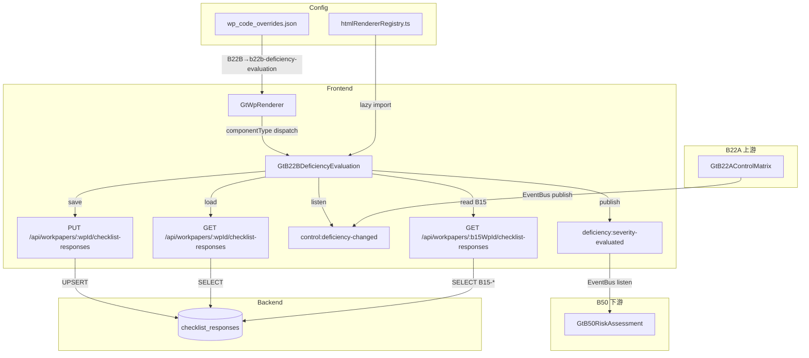

# Design Document — B22B 内部控制缺陷评价表

## Overview

本设计实现 B22B 内部控制缺陷评价表，作为 B22A（内控了解）的下游底稿。B22A 识别出控制缺陷后，缺陷条目通过 EventBus 自动流入 B22B 进行严重程度评价（重大缺陷/重要缺陷/一般缺陷），评价结果反馈 B50 控制风险评估。

关键设计决策：
- **零新表**：所有数据通过 `checklist_responses` 表存储，item_id 前缀 `B22B-` 区分字段
- **零新端点**：复用 `PUT /api/workpapers/{wp_id}/checklist-responses` 批量保存
- **注册替换**：在 htmlRendererRegistry 注册 `b22b-deficiency-evaluation`，wp_code_overrides 映射 `B22B`→`b22b-deficiency-evaluation`
- **3 Composables**：`useB22BFormData`（数据加载/保存/debounce）+ `useB22BDeficiency`（评价逻辑/严重程度建议/整体结论/EventBus）+ `useB22BReview`（复核/只读/Amendment）
- **缺陷来源自动同步**：监听 `control:deficiency-changed` 事件，组件初始化时从 B22A checklist_responses 加载现有缺陷
- **多维度评价**：报表项目范围/潜在错报金额/补偿性控制/纠正措施 → 严重程度自动建议
- **重要性水平对比**：从 B15 checklist_responses 读取 `B15-materiality-level` 进行金额对比
- **跨底稿联动**：评价结论变更 → EventBus 发布 `deficiency:severity-evaluated` → B50 调整控制风险

## Architecture



### 数据流

1. **打开底稿** → GtWpRenderer 查 wp_code_overrides → 得到 `b22b-deficiency-evaluation` → 从 registry 加载组件
2. **初始化** → 组件调用 GET checklist-responses 加载全部 `B22B-*` 已保存数据 + 从 B22A responses 中提取现有缺陷条目
3. **EventBus 同步** → 监听 `control:deficiency-changed`，added 新增条目，removed 移除/标记已消除
4. **评价** → 现场经理填写 4 维度评价 → 系统自动建议严重程度 → 可手动覆盖
5. **重要性对比** → 从 B15 读取重要性水平 → 潜在错报金额实时对比
6. **汇总** → 整体评价结论 = 所有缺陷中最高严重程度 → 数量统计
7. **联动** → 严重程度变更 → EventBus publish `deficiency:severity-evaluated` → B50 接收
8. **复核** → 全部缺陷评价完成 → 现场经理签字 → 全组件只读 → emit `completed`

## Components and Interfaces

### GtB22BDeficiencyEvaluation.vue

```typescript
// Props（标准 contextProps='standard' 模式）
interface Props {
  wpId: string
  projectId: string
  wpCode: string
  year: number
  readonly?: boolean
}

// Emits
interface Emits {
  (e: 'save'): void
  (e: 'completed'): void
}
```

### 内部组合式函数

```typescript
// composables/useB22BFormData.ts
// 管理数据加载、debounce 保存、即时保存、B15 重要性水平读取
export function useB22BFormData(wpId: Ref<string>, projectId: Ref<string>) {
  return {
    // 响应式数据
    allResponses: Ref<Map<string, ChecklistResponse>>,
    loading: Ref<boolean>,
    saving: Ref<boolean>,
    materialityLevel: Ref<number | null>,  // B15 重要性水平金额
    // 方法
    loadAll(): Promise<void>,
    loadMaterialityLevel(): Promise<void>,
    saveImmediate(items: ChecklistItem[]): Promise<void>,
    saveDebouncedText(item: ChecklistItem): void,
    flushPendingSave(): void,
    // Helper
    getField(itemId: string): ChecklistResponse,
    setFieldImmediate(itemId: string, data: Partial<ChecklistResponse>): void,
  }
}

// composables/useB22BDeficiency.ts
// 管理缺陷条目同步、评价逻辑、严重程度建议、整体结论、EventBus 发布
export function useB22BDeficiency(
  allResponses: Ref<Map<string, ChecklistResponse>>,
  materialityLevel: Ref<number | null>,
  saveImmediate: SaveFn
) {
  return {
    // 缺陷列表
    deficiencyItems: Ref<EvaluationItem[]>,
    eliminatedItems: Ref<EvaluationItem[]>,  // 已消除历史区
    // 同步
    syncFromEvent(payload: DeficiencyChangePayload): void,
    loadFromB22A(b22aResponses: ChecklistResponse[]): void,
    // 评价操作
    setCategory(index: number, category: DeficiencyCategory): void,
    setAffectedAccounts(index: number, accounts: string[]): void,
    setPotentialMisstatement(index: number, amount: number): void,
    setCompensatingControl(index: number, hasControl: boolean, description: string): void,
    setCorrectiveAction(index: number, hasAction: boolean, description: string): void,
    setSeverity(index: number, severity: SeverityLevel): void,
    setSeverityOverride(index: number, severity: SeverityLevel, reason: string): void,
    // 计算属性
    suggestSeverity(index: number): ComputedRef<SeverityLevel | null>,
    compareMateriality(amount: number): ComputedRef<MaterialityComparison>,
    overallConclusion: ComputedRef<OverallConclusion>,
    severityStats: ComputedRef<SeverityStats>,
    allEvaluated: ComputedRef<boolean>,
    // 整体评价说明
    overallNote: Ref<string>,
    // EventBus 发布
    publishSeverityEvent(): void,
    // 醒目提示
    showAuditImpactWarning: ComputedRef<boolean>,
  }
}

// composables/useB22BReview.ts
// 管理现场经理复核签字、只读状态、Amendment 机制
export function useB22BReview(
  wpId: Ref<string>,
  allResponses: Ref<Map<string, ChecklistResponse>>,
  allEvaluated: ComputedRef<boolean>,
  externalReadonly: Ref<boolean>,
  saveImmediate: SaveFn
) {
  return {
    isReviewed: ComputedRef<boolean>,
    isReadonly: ComputedRef<boolean>,
    canReview: ComputedRef<boolean>,
    pendingItems: ComputedRef<string[]>,
    reviewInfo: ComputedRef<{ reviewer: string; date: string } | null>,
    // 操作
    doReview(): Promise<void>,
    startAmendment(reason: string): Promise<void>,
  }
}
```

### 注册

```typescript
// htmlRendererRegistry.ts — 新增条目
{
  componentType: 'b22b-deficiency-evaluation',
  component: defineAsyncComponent(() => import('./GtB22BDeficiencyEvaluation.vue')),
  icon: '⚠️',
  label: 'B22B 内部控制缺陷评价表',
  emits: ['save', 'completed'],
  contextProps: 'standard',
}
```

### wp_code_overrides.json 变更

```json
"B22B": "b22b-deficiency-evaluation"
```

## Data Models

### 类型定义

```typescript
import type { TabNumber, ITSubPanel, DeficiencyItem } from './useB22AControlMatrix'

/** 缺陷分类 */
type DeficiencyCategory = '设计缺陷' | '运行缺陷'

/** 严重程度 */
type SeverityLevel = '重大缺陷' | '重要缺陷' | '一般缺陷'

/** 整体评价结论 */
type OverallConclusion = '存在重大缺陷' | '存在重要缺陷' | '仅存在一般缺陷' | '未发现控制缺陷'

/** 报表项目 */
type FinancialStatementItem = '资产' | '负债' | '所有者权益' | '收入' | '费用'

/** 重要性对比结果 */
interface MaterialityComparison {
  exceeds: boolean           // amount > materialityLevel
  difference: number | null  // amount - materialityLevel（超过时显示）
  color: 'red' | 'green'    // 超过=红色、未超过=绿色
}

/** 评价条目（单条缺陷的完整评价数据） */
interface EvaluationItem {
  // 来源信息（只读，来自 B22A DeficiencyItem）
  source: DeficiencyItem
  // 评价数据
  category: DeficiencyCategory | null
  affectedAccounts: FinancialStatementItem[]
  potentialMisstatement: number | null       // 潜在错报金额（元）
  hasCompensatingControl: boolean | null
  compensatingControlDesc: string
  hasCorrectiveAction: boolean | null
  correctiveActionDesc: string
  severity: SeverityLevel | null
  severityOverridden: boolean
  overrideReason: string
  // 状态
  eliminated: boolean  // 已消除（B22A 中对应缺陷已修复）
}

/** 严重程度统计 */
interface SeverityStats {
  material: number     // 重大缺陷数量
  significant: number  // 重要缺陷数量
  general: number      // 一般缺陷数量
  total: number        // 总计
}

/** EventBus 发布载荷：deficiency:severity-evaluated */
interface SeverityEvaluatedPayload {
  severities: { index: number; severity: SeverityLevel }[]
  overallConclusion: OverallConclusion
  materialCount: number       // 重大缺陷数量
  significantCount: number    // 重要缺陷数量
  impactsAuditOpinion: boolean        // true iff 存在重大缺陷
  requiresExtendedProcedures: boolean // true iff 存在重大或重要缺陷
}

/** EventBus 接收载荷：control:deficiency-changed（来自 B22A） */
interface DeficiencyChangePayload {
  added: DeficiencyItem[]
  removed: DeficiencyItem[]
  total: number
}

/** 复核状态 */
interface ReviewState {
  reviewed: boolean
  reviewerName: string | null
  reviewDate: string | null   // YYYY-MM-DD
  amendmentReason: string | null
}
```

### item_id 命名规范

所有字段使用 `checklist_responses` 表，通过 item_id 前缀 `B22B-` 区分：

| 区域 | item_id 模式 | conclusion | remark | wp_ref |
|------|-------------|-----------|--------|--------|
| **缺陷条目评价** | | | | |
| 缺陷分类 | `B22B-def-{idx}-category` | 设计缺陷/运行缺陷 | — | — |
| 影响报表项目 | `B22B-def-{idx}-accounts` | — | 逗号分隔：资产,负债,收入... | — |
| 潜在错报金额 | `B22B-def-{idx}-amount` | — | 金额数字字符串 | — |
| 补偿性控制 | `B22B-def-{idx}-compensating` | Y/N | 补偿性控制描述 | — |
| 纠正措施 | `B22B-def-{idx}-corrective` | Y/N | 纠正措施描述 | — |
| 严重程度 | `B22B-def-{idx}-severity` | 重大缺陷/重要缺陷/一般缺陷 | — | — |
| 手动覆盖标记 | `B22B-def-{idx}-override` | Y/null | 覆盖理由 | — |
| 缺陷来源信息 | `B22B-def-{idx}-source` | — | JSON: {tab,subPanel,index,controlPoint,deficiencyType,elementName} | — |
| 已消除标记 | `B22B-def-{idx}-eliminated` | Y/null | — | — |
| **整体评价** | | | | |
| 整体结论 | `B22B-overall-conclusion` | 存在重大缺陷/存在重要缺陷/仅存在一般缺陷/未发现控制缺陷 | — | — |
| 整体评价说明 | `B22B-overall-note` | — | 说明文本 | — |
| 缺陷条目总数 | `B22B-def-count` | — | 数字字符串 | — |
| **重要性水平** | | | | |
| 手动输入重要性水平 | `B22B-materiality-manual` | — | 金额数字字符串 | — |
| **现场经理复核** | | | | |
| 复核签字 | `B22B-review-sign` | Y/null | 复核人姓名 | 日期 YYYY-MM-DD |
| **修改（Amendment）** | | | | |
| 修改原因 | `B22B-amend-{n}-reason` | — | 原因文本 | — |
| 修改后复核 | `B22B-amend-{n}-review-sign` | Y/null | 复核人姓名 | 日期 |

> `{idx}` = 缺陷条目序号从 1 开始；`{n}` = 修改轮次从 1 开始

### 严重程度建议算法

```typescript
function suggestSeverity(
  potentialMisstatement: number | null,
  materialityLevel: number | null,
  hasCompensatingControl: boolean | null,
  hasCorrectiveAction: boolean | null
): SeverityLevel | null {
  if (potentialMisstatement === null || materialityLevel === null) return null

  const exceedsMateriality = potentialMisstatement > materialityLevel

  if (exceedsMateriality && !hasCompensatingControl && !hasCorrectiveAction) {
    return '重大缺陷'
  }
  if (exceedsMateriality && (hasCompensatingControl || hasCorrectiveAction)) {
    return '重要缺陷'
  }
  // 未超过重要性水平
  return '一般缺陷'
}
```

### 整体评价结论计算

```typescript
function computeOverallConclusion(items: EvaluationItem[]): OverallConclusion {
  const activeItems = items.filter(i => !i.eliminated && i.severity !== null)

  if (activeItems.length === 0) return '未发现控制缺陷'
  if (activeItems.some(i => i.severity === '重大缺陷')) return '存在重大缺陷'
  if (activeItems.some(i => i.severity === '重要缺陷')) return '存在重要缺陷'
  return '仅存在一般缺陷'
}
```

### 缺陷分类默认映射

```typescript
function defaultCategory(deficiencyType: '设计无效' | '未实施'): DeficiencyCategory {
  return deficiencyType === '设计无效' ? '设计缺陷' : '运行缺陷'
}
```

### 颜色编码

```typescript
const SEVERITY_COLOR_MAP: Record<SeverityLevel, { bg: string; text: string }> = {
  '重大缺陷': { bg: '#FEE2E2', text: '#DC2626' },  // 红色系
  '重要缺陷': { bg: '#FEF3C7', text: '#D97706' },  // 黄色系
  '一般缺陷': { bg: '#D1FAE5', text: '#059669' },  // 绿色系
}

const MATERIALITY_COLOR_MAP: Record<'red' | 'green', string> = {
  red: '#DC2626',    // 超过重要性水平
  green: '#059669',  // 未超过重要性水平
}
```

### 只读判定逻辑

```typescript
function computeIsReadonly(externalReadonly: boolean, reviewState: ReviewState): boolean {
  if (externalReadonly) return true
  return reviewState.reviewed === true
}
```


## Correctness Properties

*A property is a characteristic or behavior that should hold true across all valid executions of a system—essentially, a formal statement about what the system should do. Properties serve as the bridge between human-readable specifications and machine-verifiable correctness guarantees.*

### Property 1: 缺陷来源同步不变式

*For any* B22A `control:deficiency-changed` 事件序列（包含任意 added/removed 组合），B22B 的活跃缺陷条目列表 SHALL 始终等于 B22A 当前全部 Conclusion 为"设计无效"或"未实施"的检查项集合（排除已消除条目）。对任意事件序列，最终状态中每个 added 条目都存在于列表中，每个 removed 条目不存在于活跃列表中（移入已消除区）。

**Validates: Requirements 1.1, 1.2, 1.3, 1.4, 1.6**

### Property 2: 缺陷分类默认映射一致性

*For any* 导入的 DeficiencyItem，缺陷分类默认值 SHALL 满足双射：`deficiencyType="设计无效"` → `category="设计缺陷"`；`deficiencyType="未实施"` → `category="运行缺陷"`。手动修改后默认映射不再适用于该条目，但不影响其他条目的默认映射。

**Validates: Requirements 2.2, 2.3**

### Property 3: 严重程度建议逻辑一致性

*For any* 评价维度输入组合（潜在错报金额 M、重要性水平 T、补偿性控制 C ∈ {true,false}、纠正措施 A ∈ {true,false}），`suggestSeverity(M, T, C, A)` SHALL 满足：(a) M > T ∧ C=false ∧ A=false → "重大缺陷"；(b) M > T ∧ (C=true ∨ A=true) → "重要缺陷"；(c) M ≤ T → "一般缺陷"。当 M 或 T 为 null 时返回 null。手动覆盖不影响建议计算逻辑本身。

**Validates: Requirements 4.1, 4.2, 4.3, 4.4**

### Property 4: 整体评价结论汇总不变式

*For any* 缺陷条目的严重程度集合（排除已消除条目），`computeOverallConclusion` SHALL 满足：存在任一 severity="重大缺陷" → "存在重大缺陷"；无重大但存在 severity="重要缺陷" → "存在重要缺陷"；全部 severity="一般缺陷" → "仅存在一般缺陷"；集合为空或全部 severity=null → "未发现控制缺陷"。严重程度变更后整体结论同步更新。

**Validates: Requirements 5.1, 5.2, 5.3, 5.4, 5.5**

### Property 5: EventBus 事件发射正确性

*For any* 缺陷严重程度评定或变更操作，系统 SHALL 发布 `deficiency:severity-evaluated` 事件。事件载荷中 `impactsAuditOpinion` 为 `true` 当且仅当整体结论为"存在重大缺陷"；`requiresExtendedProcedures` 为 `true` 当且仅当整体结论为"存在重大缺陷"或"存在重要缺陷"。载荷中 materialCount/significantCount SHALL 等于对应严重程度的实际条目数。

**Validates: Requirements 6.1, 6.2, 6.3, 6.4**

### Property 6: 复核前置条件完备性

*For any* 缺陷条目状态集合，现场经理签字按钮可用（`canReview=true`）当且仅当：所有非已消除缺陷条目均已完成严重程度评定（severity 非 null）。条件不满足时按钮必须禁用。

**Validates: Requirements 8.2**

### Property 7: 复核后只读不变式

*For any* 已通过现场经理复核（`B22B-review-sign` conclusion='Y'）的组件状态或外部 `readonly=true`，所有字段 SHALL 处于只读模式，任何编辑操作（setCategory / setSeverity / setSeverityOverride / setCompensatingControl / setCorrectiveAction 等）应被阻止。通过 Amendment 机制重置复核状态后恢复可编辑。

**Validates: Requirements 8.3, 8.5, 8.6**

### Property 8: 数据持久化往返一致性

*For any* 有效的缺陷评价数据（item_id 以 `B22B-` 开头，conclusion 在白名单范围内），通过 PUT 保存后再通过 GET 加载，返回的 { item_id, conclusion, remark, wp_ref } 四元组 SHALL 与保存前完全一致。

**Validates: Requirements 7.1, 7.5, 7.6**

### Property 9: item_id 命名唯一性

*For any* 组合（缺陷序号 idx × 字段类型 field），`generateItemId(idx, field)` 生成的 item_id SHALL 唯一。不同（idx, field）组合不产生相同 item_id；相同（idx, field）重复调用产生相同 item_id。

**Validates: Requirements 7.7**

### Property 10: 重要性水平对比确定性

*For any* 相同的（潜在错报金额 M, 重要性水平 T）输入对（M ≥ 0, T > 0），对比结果 SHALL 始终一致：`exceeds=true` 当且仅当 M > T；`color='red'` 当且仅当 exceeds=true，否则 `color='green'`。重要性水平变更后所有条目的对比结果 SHALL 同步重新计算。

**Validates: Requirements 3.4, 11.2, 11.3**

### Property 11: 缺陷数量统计准确性

*For any* 缺陷条目集合及其严重程度分布，`severityStats` 中的 `{ material, significant, general, total }` SHALL 满足：`material` = severity="重大缺陷" 的非已消除条目数；`significant` = severity="重要缺陷" 的非已消除条目数；`general` = severity="一般缺陷" 的非已消除条目数；`total = material + significant + general`。

**Validates: Requirements 5.6**

### Property 12: 后端白名单校验正确性

*For any* item_id 以 `B22B-` 开头的请求，conclusion 值在白名单内时 SHALL 返回 200；conclusion 值不在白名单内时 SHALL 返回 HTTP 422。白名单为：重大缺陷、重要缺陷、一般缺陷、设计缺陷、运行缺陷、Y、N、存在重大缺陷、存在重要缺陷、仅存在一般缺陷、未发现控制缺陷。remark 字段接受任意文本。

**Validates: Requirements 10.1, 10.2, 10.3, 10.4**

## Error Handling

| 场景 | 行为 |
|------|------|
| PUT 保存失败（网络/500） | ElMessage.error('保存失败')，保留本地数据不回滚 |
| GET 加载失败 | ElMessage.warning('数据加载失败')，表单保持空白可编辑状态 |
| B15 重要性水平加载失败 | 显示提示"请先完成 B15 重要性水平确定"，允许手动输入 |
| B22A 缺陷数据加载失败 | ElMessage.warning('缺陷来源加载失败')，仅依赖已保存的 B22B 数据 |
| 移除已评价缺陷（removed 事件） | 弹出确认弹窗"该缺陷已评价，确认消除？" |
| 复核时前置条件不满足 | 签字按钮禁用 + 显示待完成事项清单 |
| 手动覆盖严重程度无理由 | 拒绝覆盖操作，提示"需填写调整理由" |
| Amendment 原因为空/纯空白 | 拒绝提交，显示校验错误 |
| conclusion 值不在白名单 | 后端 422，前端显示校验错误 |
| 组件卸载时保存失败 | 静默失败（已离开页面），下次打开从后端加载 |
| EventBus 发布失败 | 仅 console.warn，不影响本组件保存 |
| 潜在错报金额输入非数字 | 输入校验拒绝，保留上一个有效值 |

### 后端 conclusion 白名单扩展

在 `checklist_responses.py` 现有 `elif item.item_id.startswith("B22A-"):` 分支后新增 `elif item.item_id.startswith("B22B-"):` 分支：

```python
elif item.item_id.startswith("B22B-"):
    # B22B 缺陷评价：严重程度 + 分类 + 整体结论 + 签字/标记
    allowed = (
        "重大缺陷", "重要缺陷", "一般缺陷",                  # SeverityLevel
        "设计缺陷", "运行缺陷",                              # DeficiencyCategory
        "Y", "N",                                            # 签字/布尔标记
        "存在重大缺陷", "存在重要缺陷", "仅存在一般缺陷", "未发现控制缺陷",  # OverallConclusion
    )
    if item.conclusion not in allowed:
        raise HTTPException(
            status_code=422,
            detail=f"B22B conclusion 值无效，收到: '{item.conclusion}'",
        )
```

## Testing Strategy

### Property-Based Testing（fast-check，前端）

测试文件路径：
```
audit-platform/frontend/src/components/workpaper/__tests__/b22bDeficiencyEvaluation.property.spec.ts
```

配置：
- 库：`fast-check`（项目已安装）
- 最小迭代：100 次
- Tag 格式：`Feature: b22b-deficiency-evaluation, Property {N}: {title}`

| Property | 测试内容 | 生成器 |
|----------|---------|--------|
| 1 | 缺陷事件序列 → 列表同步 | 随机 DeficiencyItem[] × 随机 added/removed 事件序列 → 验证列表最终状态 |
| 2 | deficiencyType → 默认分类 | 随机 DeficiencyItem × deficiencyType ∈ {设计无效, 未实施} → 验证映射 |
| 3 | 评价维度输入 → 严重程度建议 | 随机 (amount>0, materiality>0, compensating∈{T,F}, corrective∈{T,F}) → 验证建议规则 |
| 4 | 严重程度集合 → 整体结论 | 随机 SeverityLevel[] (0~20条) → 验证 max-severity 规则 |
| 5 | 严重程度变更 → EventBus 载荷 | 随机缺陷集合 × 随机严重程度分布 → 验证 impactsAuditOpinion / requiresExtendedProcedures 标志 |
| 6 | 缺陷评价状态 → canReview | 随机缺陷条目（severity 部分为 null）→ 验证前置条件 |
| 7 | review conclusion='Y' / readonly=true → 全只读 | 随机复核状态 × 随机 readonly prop → 验证 isReadonly |
| 8 | 后端 round-trip（integration） | 随机 B22B- item_id + 合法 conclusion + 随机 remark |
| 9 | generateItemId 唯一性 | 随机 idx(1~50) × 随机 field ∈ {category,accounts,amount,compensating,corrective,severity,override,source,eliminated} |
| 10 | (amount, materiality) → 对比结果 | 随机正数对 → 验证 exceeds/color 逻辑 |
| 11 | 严重程度分布 → stats 计数 | 随机缺陷集合(含 eliminated) → 手动计数 vs severityStats |
| 12 | B22B- item_id + 随机 conclusion → 白名单校验 | 随机合法/非法 conclusion → 验证 200/422 |

### Unit Tests（vitest，前端）

测试文件路径：
```
audit-platform/frontend/src/components/workpaper/__tests__/b22bDeficiencyEvaluation.spec.ts
```

覆盖：
- 组件注册正确性（registry 包含 `b22b-deficiency-evaluation`）
- wp_code_overrides 映射正确性（B22B→b22b-deficiency-evaluation）
- 缺陷列表渲染 + 来源标注只读
- 缺陷分类下拉交互
- 4 维度评价表单渲染
- 潜在错报金额输入 + 重要性对比显示
- 补偿性控制/纠正措施 是/否 切换
- 严重程度下拉 + "已手动调整"标识
- debounce 2s 文本保存行为（fake timers）
- 选择字段立即保存行为
- 整体结论汇总区域渲染
- 严重程度数量统计渲染
- 审计影响醒目提示渲染条件
- readonly 模式下所有交互禁用
- 复核签字操作 emit 行为（save / completed）
- Amendment 启动流程（原因非空校验）
- B15 数据不可用时手动输入重要性水平

### 后端 PBT（hypothesis）

测试文件路径：
```
backend/tests/test_b22b_deficiency_evaluation_pbt.py
```

覆盖：
- Property 8: round-trip（生成随机 B22B- item_id + conclusion → PUT → GET → 验证一致）
- Property 12: conclusion 白名单校验（生成随机 B22B- item_id + 随机 conclusion 值 → 验证 422/200）

### 契约测试

- componentType 契约：`componentTypeContract.spec.ts` 自动覆盖（已有 CI 卡点）
- HtmlComponentType union 类型更新后 TypeScript 编译即验证
- wp_code_overrides 契约：验证 B22B 映射值合法
