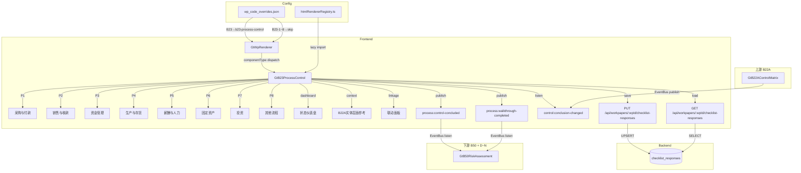

# Design Document — B23 业务流程与控制了解表

## Overview

本设计将现有 B23-1~8 共 8 个独立 `d-form-table` 底稿替换为统一的 `GtB23ProcessControl.vue` 组件，通过流程卡片 + 穿行测试 + 状态仪表盘界面聚合全部业务流程控制了解工作流。

关键设计决策：
- **零新表**：所有数据通过 `checklist_responses` 表存储，item_id 前缀 `B23-` 区分字段
- **零新端点**：复用 `PUT /api/workpapers/{wp_id}/checklist-responses` 批量保存
- **注册替换**：在 htmlRendererRegistry 注册 `b23-process-control`，wp_code_overrides 映射 B23→`b23-process-control`，B23-1~8→`skip`
- **3 Composables**：`useB23FormData`（数据加载/保存/debounce）+ `useB23ProcessControl`（流程卡片/控制点/穿行测试/结论/EventBus）+ `useB23Review`（复核/只读/Amendment）
- **8 流程卡片**：P1~P8（采购与付款/销售与收款/资金管理/生产与存货/薪酬与人力/固定资产/投资/其他），可展开/收起，左侧色带颜色编码
- **状态仪表盘**：顶部汇总各流程完成度/有效性分布/待穿行数量
- **流程结论自动建议**：基于控制点穿行测试结论分布 + 30% 阈值算法
- **四方联动**：B22A（实体层面）→ B23（流程层面）→ B50（控制风险）→ D~N（程序）
- **EventBus 事件**：监听 `control:conclusion-changed`（B22A），发布 `process:control-concluded` + `process:walkthrough-completed`

## Architecture



### 数据流

1. **打开底稿** → GtWpRenderer 查 wp_code_overrides → 得到 `b23-process-control` → 从 registry 加载组件
2. **初始化** → 组件调用 GET checklist-responses 加载全部 `B23-*` 数据，按 item_id 前缀分发到 8 张流程卡片
3. **编辑** → 文本字段 debounce 2s / Process_Conclusion、穿行测试结论、适用性开关立即保存 → PUT checklist-responses
4. **自动计算** → 控制点穿行结论变更 → 重算 Process_Conclusion 建议（30% 阈值）→ 更新 Status_Dashboard
5. **联动上游** → 监听 `control:conclusion-changed` → 更新 Entity_Level_Context 面板
6. **联动下游** → Process_Conclusion 变更 → EventBus publish `process:control-concluded` → B50 接收
7. **穿行完成** → 某流程全部穿行测试完成 → EventBus publish `process:walkthrough-completed`
8. **复核** → 全部适用流程评估完成 → 现场经理签字 → 全组件只读 → emit `completed`

## Components and Interfaces

### GtB23ProcessControl.vue

```typescript
// Props（标准 contextProps='standard' 模式）
interface Props {
  wpId: string
  projectId: string
  wpCode: string
  year: number
  readonly?: boolean
}

// Emits
interface Emits {
  (e: 'save'): void
  (e: 'completed'): void
}
```

### 内部组合式函数

```typescript
// composables/useB23FormData.ts
// 管理全部 8 流程数据加载、debounce 保存、即时保存
export function useB23FormData(wpId: Ref<string>) {
  return {
    // 响应式数据
    allResponses: Ref<Map<string, ChecklistResponse>>,
    loading: Ref<boolean>,
    saving: Ref<boolean>,
    // 方法
    loadAll(): Promise<void>,
    saveImmediate(items: ChecklistItem[]): Promise<void>,
    saveDebouncedText(item: ChecklistItem): void,
    flushPendingSave(): void,
    // 流程数据视图
    processData(processNum: ProcessNumber): ComputedRef<ProcessState>,
    // Helper
    getField(itemId: string): ChecklistResponse,
    setFieldImmediate(itemId: string, data: Partial<ChecklistResponse>): void,
  }
}


// composables/useB23ProcessControl.ts
// 管理流程卡片、控制点CRUD、穿行测试、结论建议、适用性、EventBus
export function useB23ProcessControl(
  allResponses: Ref<Map<string, ChecklistResponse>>,
  saveImmediate: SaveFn
) {
  return {
    // 流程卡片管理
    processes: ComputedRef<ProcessCard[]>,
    expandedProcesses: Ref<Set<ProcessNumber>>,
    toggleProcess(num: ProcessNumber): void,
    expandAll(): void,
    collapseAll(): void,
    // 适用性
    setApplicability(num: ProcessNumber, applicable: boolean): void,
    getApplicability(num: ProcessNumber): ComputedRef<boolean>,
    // 控制点管理（per process）
    getControlPoints(num: ProcessNumber): ComputedRef<ControlPoint[]>,
    addControlPoint(num: ProcessNumber): void,
    removeControlPoint(num: ProcessNumber, index: number): void,
    setControlPointField(num: ProcessNumber, index: number, field: ControlPointField, value: any): void,
    // 穿行测试
    getWalkthroughRecords(num: ProcessNumber, ctrlIndex: number): ComputedRef<WalkthroughRecord[]>,
    addWalkthroughSample(num: ProcessNumber, ctrlIndex: number): void,
    setWalkthroughField(num: ProcessNumber, ctrlIndex: number, sampleIndex: number, field: WalkthroughField, value: string): void,
    isWalkthroughComplete(num: ProcessNumber): ComputedRef<boolean>,
    walkthroughSummary(num: ProcessNumber): ComputedRef<WalkthroughSummary>,
    // Process_Conclusion
    suggestConclusion(num: ProcessNumber): ComputedRef<ProcessConclusion | null>,
    getConclusion(num: ProcessNumber): ComputedRef<ProcessConclusion | null>,
    setConclusion(num: ProcessNumber, conclusion: ProcessConclusion, overrideReason?: string): void,
    isConclusionOverridden(num: ProcessNumber): ComputedRef<boolean>,
    getOverrideReason(num: ProcessNumber): ComputedRef<string>,
    // Status Dashboard
    dashboardStats: ComputedRef<DashboardStats>,
    // Entity Level Context（B22A 参考）
    entityLevelContext: Ref<EntityLevelContext | null>,
    onControlConclusionChanged(payload: ControlConclusionPayload): void,
    // Linkage Panel
    linkageInfo: ComputedRef<LinkageInfo[]>,
    // EventBus 发布
    publishProcessConcluded(num: ProcessNumber, oldConclusion: ProcessConclusion | null, newConclusion: ProcessConclusion): void,
    publishWalkthroughCompleted(num: ProcessNumber): void,
  }
}

// composables/useB23Review.ts
// 管理现场经理复核签字、只读状态、Amendment 机制
export function useB23Review(
  wpId: Ref<string>,
  allResponses: Ref<Map<string, ChecklistResponse>>,
  processes: ComputedRef<ProcessCard[]>,
  externalReadonly: Ref<boolean>,
  saveImmediate: SaveFn
) {
  return {
    isReviewed: ComputedRef<boolean>,
    isReadonly: ComputedRef<boolean>,
    canReview: ComputedRef<boolean>,
    pendingItems: ComputedRef<string[]>,
    reviewInfo: ComputedRef<{ reviewer: string; date: string } | null>,
    // 操作
    doReview(): Promise<void>,
    startAmendment(reason: string): Promise<void>,
  }
}
```

### 注册

```typescript
// htmlRendererRegistry.ts — 新增条目
{
  componentType: 'b23-process-control',
  component: defineAsyncComponent(() => import('./GtB23ProcessControl.vue')),
  icon: '🔄',
  label: 'B23 业务流程与控制了解表',
  emits: ['save', 'completed'],
  contextProps: 'standard',
}
```

### wp_code_overrides.json 变更

```json
"B23": "b23-process-control",
"B23-1": "skip",
"B23-2": "skip",
"B23-3": "skip",
"B23-4": "skip",
"B23-5": "skip",
"B23-6": "skip",
"B23-7": "skip",
"B23-8": "skip"
```

## Data Models

### 类型定义

```typescript
/** 流程编号 */
type ProcessNumber = 1 | 2 | 3 | 4 | 5 | 6 | 7 | 8

/** 流程结论 */
type ProcessConclusion = '设计有效且已实施' | '设计有效但未有效实施' | '设计无效' | '不适用'

/** 穿行测试结论（控制点级） */
type WalkthroughConclusion = '控制有效运行' | '控制未有效运行' | '未执行穿行' | '不适用'

/** 了解方法（多选） */
type UnderstandingMethod = '询问' | '观察' | '检查文件' | '穿行测试' | '重新执行'

/** 控制频率 */
type ControlFrequency = '每笔' | '每日' | '每周' | '每月' | '每季' | '每年' | '不定期'

/** 控制点字段 */
type ControlPointField = 'objective' | 'description' | 'frequency' | 'executor' | 'methods' | 'conclusion' | 'remark'

/** 穿行测试字段 */
type WalkthroughField = 'sample' | 'path' | 'finding' | 'reference'

/** 控制点 */
interface ControlPoint {
  index: number
  objective: string               // 控制目标
  description: string             // 控制活动描述
  frequency: ControlFrequency | null  // 控制频率
  executor: string                // 执行人/部门
  methods: UnderstandingMethod[]  // 了解方法（多选）
  conclusion: WalkthroughConclusion | null  // 穿行测试结论
  remark: string                  // 备注/索引
  isPreset: boolean               // 是否预置
}

/** 穿行测试记录（单笔样本） */
interface WalkthroughRecord {
  sampleIndex: number
  sample: string        // 样本选取（凭证编号/交易日期/金额）
  path: string          // 测试路径描述
  finding: string       // 发现与结论
  reference: string     // 证据引用
}

/** 穿行测试摘要 */
interface WalkthroughSummary {
  testedCount: number   // 已测试控制点数
  totalCount: number    // 总控制点数（含穿行测试方法的）
  completionRate: number  // 完成率 0~1
}

/** 流程卡片 */
interface ProcessCard {
  num: ProcessNumber
  name: string
  applicable: boolean
  conclusion: ProcessConclusion | null
  suggestedConclusion: ProcessConclusion | null
  conclusionOverridden: boolean
  overrideReason: string
  controlPoints: ControlPoint[]
  walkthroughComplete: boolean
  completionRatio: string  // "N/M" 控制点完成比例
}

/** 状态仪表盘统计 */
interface DashboardStats {
  completionDistribution: {
    completed: number     // 已完成（有结论且非不适用）
    inProgress: number    // 进行中（有控制点但无结论）
    notStarted: number    // 未开始（无控制点）
    notApplicable: number // 不适用
  }
  effectivenessDistribution: {
    effective: number           // 设计有效且已实施
    partiallyEffective: number  // 设计有效但未有效实施
    ineffective: number         // 设计无效
    notApplicable: number       // 不适用
  }
  pendingWalkthroughCount: number  // 待穿行测试数量
}

/** B22A 实体层面上下文（只读） */
interface EntityLevelContext {
  elementScores: Record<number, ElementScore | null>  // 1~5 要素评分
  overallConclusion: ElementScore | null
  completed: boolean
}

/** 联动信息 */
interface LinkageInfo {
  processNum: ProcessNumber
  processName: string
  conclusion: ProcessConclusion | null
  b50Impact: string       // B50 控制风险影响描述
  targetCycle: string     // 对应 D~N 循环编码
  targetCycleName: string // 对应循环名称
  needsExtendedProcedures: boolean  // 需扩大实质性程序
}

/** EventBus: process:control-concluded 载荷 */
interface ProcessConcludedPayload {
  processNum: ProcessNumber
  processName: string
  oldConclusion: ProcessConclusion | null
  newConclusion: ProcessConclusion
}

/** EventBus: process:walkthrough-completed 载荷 */
interface WalkthroughCompletedPayload {
  processNum: ProcessNumber
  controlPointCount: number
  effectiveRate: number  // 有效率 0~1
}

/** EventBus: control:conclusion-changed 载荷（来自 B22A） */
interface ControlConclusionPayload {
  elementScores: Record<number, ElementScore | null>
  itDependency: string
  itgcConclusion: string | null
  overallConclusion: ElementScore | null
}

/** 要素评分（B22A 复用） */
type ElementScore = '有效' | '部分有效' | '无效'

/** 复核状态 */
interface ReviewState {
  reviewed: boolean
  reviewerName: string | null
  reviewDate: string | null   // YYYY-MM-DD
  amendmentReason: string | null
}
```

### item_id 命名规范

所有字段使用 `checklist_responses` 表，通过 item_id 前缀 `B23-` 区分：

| 区域 | item_id 模式 | conclusion | remark | wp_ref |
|------|-------------|-----------|--------|--------|
| **流程适用性** | | | | |
| 适用性标记 | `B23-P{n}-applicability` | Y/N | — | — |
| **控制点** | | | | |
| 控制目标 | `B23-P{n}-ctrl-{m}-objective` | — | 控制目标文本 | — |
| 控制描述 | `B23-P{n}-ctrl-{m}-description` | — | 描述文本 | — |
| 控制频率 | `B23-P{n}-ctrl-{m}-frequency` | 每笔/每日/每周/每月/每季/每年/不定期 | — | — |
| 执行人/部门 | `B23-P{n}-ctrl-{m}-executor` | — | 执行人文本 | — |
| 了解方法 | `B23-P{n}-ctrl-{m}-methods` | — | 逗号分隔：询问,观察,检查文件,穿行测试,重新执行 | — |
| 穿行测试结论 | `B23-P{n}-ctrl-{m}-conclusion` | 控制有效运行/控制未有效运行/未执行穿行/不适用 | — | — |
| 备注/索引 | `B23-P{n}-ctrl-{m}-remark` | — | 备注文本 | — |
| 控制点数量 | `B23-P{n}-ctrl-count` | — | 数字字符串 | — |
| **穿行测试记录** | | | | |
| 样本选取 | `B23-P{n}-wt-{m}-{s}-sample` | — | 凭证编号/日期/金额 | — |
| 测试路径 | `B23-P{n}-wt-{m}-{s}-path` | — | 路径描述文本 | — |
| 发现与结论 | `B23-P{n}-wt-{m}-{s}-finding` | — | 发现文本 | — |
| 证据引用 | `B23-P{n}-wt-{m}-{s}-reference` | — | 引用文本 | — |
| 穿行样本数量 | `B23-P{n}-wt-{m}-count` | — | 数字字符串 | — |
| **流程结论** | | | | |
| 流程结论 | `B23-P{n}-process-conclusion` | 设计有效且已实施/设计有效但未有效实施/设计无效/不适用 | — | — |
| 手动覆盖标记 | `B23-P{n}-conclusion-override` | Y/null | 覆盖理由 | — |
| **现场经理复核** | | | | |
| 复核签字 | `B23-review-sign` | Y/null | 复核人姓名 | 日期 YYYY-MM-DD |
| **修改（Amendment）** | | | | |
| 修改原因 | `B23-amend-{k}-reason` | — | 原因文本 | — |
| 修改后复核 | `B23-amend-{k}-review-sign` | Y/null | 复核人姓名 | 日期 |

> `{n}` = 流程编号 1~8；`{m}` = 控制点序号从 1 开始；`{s}` = 穿行测试样本序号从 1 开始；`{k}` = 修改轮次从 1 开始

### 8 标准流程配置

```typescript
const STANDARD_PROCESSES: { num: ProcessNumber; name: string; code: string; targetCycle: string }[] = [
  { num: 1, name: '采购与付款循环', code: 'P1', targetCycle: 'DA' },
  { num: 2, name: '销售与收款循环', code: 'P2', targetCycle: 'EA' },
  { num: 3, name: '资金管理循环', code: 'P3', targetCycle: 'FA' },
  { num: 4, name: '生产与存货循环', code: 'P4', targetCycle: 'GA' },
  { num: 5, name: '薪酬与人力循环', code: 'P5', targetCycle: 'HA' },
  { num: 6, name: '固定资产循环', code: 'P6', targetCycle: 'IA' },
  { num: 7, name: '投资循环', code: 'P7', targetCycle: 'JA' },
  { num: 8, name: '其他流程', code: 'P8', targetCycle: 'KA' },
]
```

### Process_Conclusion 自动建议算法

```typescript
function suggestProcessConclusion(controlPoints: ControlPoint[]): ProcessConclusion | null {
  // 仅考虑有穿行测试结论的控制点（排除 conclusion=null）
  const evaluated = controlPoints.filter(cp => cp.conclusion !== null && cp.conclusion !== '不适用')
  if (evaluated.length === 0) return null  // 无法建议

  const ineffective = evaluated.filter(cp => cp.conclusion === '控制未有效运行')
  const ineffectiveRatio = ineffective.length / evaluated.length

  if (ineffective.length === 0) {
    // 全部为"控制有效运行"或"不适用"
    return '设计有效且已实施'
  }
  if (ineffectiveRatio <= 0.3) {
    // 存在无效但占比≤30%
    return '设计有效但未有效实施'
  }
  // 占比>30%
  return '设计无效'
}
```

### 颜色编码常量

```typescript
/** 流程结论→颜色映射 */
const PROCESS_CONCLUSION_COLOR_MAP: Record<ProcessConclusion | '待测试', { color: string; bg: string; label: string }> = {
  '设计有效且已实施':     { color: '#52c41a', bg: '#f6ffed', label: '有效' },
  '设计有效但未有效实施': { color: '#faad14', bg: '#fffbe6', label: '部分有效' },
  '设计无效':            { color: '#ff4d4f', bg: '#fff2f0', label: '无效' },
  '不适用':              { color: '#bfbfbf', bg: '#fafafa', label: '不适用' },
  '待测试':              { color: '#1890ff', bg: '#e6f7ff', label: '待测试' },
}

/** 左侧色带宽度 */
const PROCESS_CARD_BORDER_WIDTH = '4px'
```

### 联动映射

```typescript
/** 流程结论→B50 控制风险影响 */
const CONCLUSION_TO_B50_IMPACT: Record<ProcessConclusion, string> = {
  '设计有效且已实施':     '控制风险=低',
  '设计有效但未有效实施': '控制风险=中',
  '设计无效':            '控制风险=高',
  '不适用':              '不影响控制风险评估',
}

/** 流程结论→实质性程序建议 */
const CONCLUSION_TO_PROCEDURE_ADVICE: Record<ProcessConclusion, string> = {
  '设计有效且已实施':     '控制可依赖——可适当缩小实质性程序范围',
  '设计有效但未有效实施': '控制不可依赖——建议扩大实质性程序范围和样本量',
  '设计无效':            '控制不可依赖——建议扩大实质性程序范围和样本量',
  '不适用':              '',
}
```

### 导入导出设计

```typescript
/** 导出模板/数据 + 导入（三级） */
// 复用项目已有 ExcelJS 库（不引入新依赖）
interface ExportImportConfig {
  // 导出模板：空白 Excel，8 Sheet（P1~P8），每 Sheet 含列标题行
  templateSheets: { sheetName: string; columns: string[] }[]
  // 导出数据：与模板结构一致 + 已填内容
  // 导入：解析 Excel → 校验结构 → 按 Sheet 映射到流程 → 写入 allResponses
}

const EXPORT_COLUMNS = ['序号', '控制目标', '控制活动描述', '控制频率', '执行人/部门', '了解方法', '穿行测试结论', '备注/索引']

// 导入冲突策略：弹窗让用户选择"覆盖"或"跳过"
type ImportConflictStrategy = 'overwrite' | 'skip'
```

### 关联流程图设计

```typescript
/** 审计链路流程图节点 */
interface FlowDiagramNode {
  id: string          // 底稿编号（如 'B22A', 'B23', 'B50', 'DA'）
  label: string       // 显示名称
  status: 'completed' | 'in-progress' | 'not-started'
  color: string       // 状态色
  wpId?: string       // 跳转目标 wp_id（ref_chip 用）
}

/** 节点间连线 */
interface FlowDiagramEdge {
  from: string        // 源节点 id
  to: string          // 目标节点 id
  label?: string      // 连线标签（如"控制结论"）
  visible: boolean    // 仅适用流程的连线可见
}

// 流程图使用纯 HTML/CSS + SVG path 实现（不引入 D3/ECharts 等大型库）
// 布局：左→右 水平流转：B22A → B23 → B50 → D~N（各循环竖排）
// 可折叠/展开，默认展开
```

### 只读判定逻辑

```typescript
function computeIsReadonly(externalReadonly: boolean, reviewState: ReviewState): boolean {
  if (externalReadonly) return true
  return reviewState.reviewed === true
}
```


## Correctness Properties

*A property is a characteristic or behavior that should hold true across all valid executions of a system—essentially, a formal statement about what the system should do. Properties serve as the bridge between human-readable specifications and machine-verifiable correctness guarantees.*

### Property 1: 状态仪表盘同步不变式

*For any* 流程卡片内的控制点、穿行测试结论或适用性变更操作，Status_Dashboard 中的 `dashboardStats` SHALL 始终满足：`completionDistribution` 各分类计数之和等于 8；`effectivenessDistribution` 各分类计数等于对应 Process_Conclusion 值的实际流程数；`pendingWalkthroughCount` 等于适用流程中 Understanding_Method 包含"穿行测试"但穿行测试结论为空的控制点总数。不适用流程不计入"待完成"。

**Validates: Requirements 1.1, 1.7, 2.4**

### Property 2: Process_Conclusion 自动建议一致性

*For any* 流程下控制点穿行测试结论分布，`suggestProcessConclusion(controlPoints)` SHALL 满足：(a) 排除 conclusion=null 和"不适用"后，全部为"控制有效运行" → 返回"设计有效且已实施"；(b) 存在"控制未有效运行"且占比≤30% → 返回"设计有效但未有效实施"；(c) 占比>30% → 返回"设计无效"；(d) 无已评估控制点时返回 null。手动覆盖不影响建议计算逻辑本身，仅覆盖存储值。

**Validates: Requirements 5.2, 5.3, 5.4, 5.5**

### Property 3: 流程适用性约束

*For any* 流程适用性切换操作，标记为"不适用"的流程 SHALL 自动将 Process_Conclusion 设为"不适用"；恢复为"适用"时 SHALL 清除该自动结论（设为 null）。适用性切换不删除已填写的控制点数据。对任意适用性 toggle 序列，最终 conclusion 状态仅由最后一次 toggle 决定。

**Validates: Requirements 2.2, 2.3, 2.5**

### Property 4: 穿行测试与了解方法联动

*For any* 控制点的 Understanding_Method 变更，WHEN Understanding_Method 包含"穿行测试"时，穿行测试区域 SHALL 存在对应的测试记录条目（至少一条）。穿行测试摘要中 `testedCount` SHALL 等于实际有穿行测试结论的控制点数，`totalCount` SHALL 等于 methods 包含"穿行测试"的控制点数。WHEN 某流程全部需要穿行的控制点均有结论时，`isWalkthroughComplete` SHALL 为 true。

**Validates: Requirements 4.3, 4.5, 4.6**

### Property 5: 复核前置条件与只读不变式

*For any* 流程卡片状态组合，`canReview` SHALL 为 `true` 当且仅当：所有适用流程的 Process_Conclusion 均已选择（非 null），且所有适用流程中 Understanding_Method 包含"穿行测试"的控制点均有穿行测试结论（非 null）。`isReadonly` SHALL 为 `true` 当 `B23-review-sign` conclusion='Y' 或外部 `readonly=true`。在 `isReadonly=true` 时所有编辑操作应被阻止。

**Validates: Requirements 9.2, 9.3, 9.5**

### Property 6: 数据持久化往返一致性

*For any* 有效的 B23 流程控制了解数据（包含 8 个流程的适用性 + 控制点 + 穿行测试 + 结论字段），通过 PUT 保存后再通过 GET 加载，所有字段值（item_id、conclusion、remark、wp_ref）SHALL 与保存前一致。

**Validates: Requirements 8.1, 8.6**

### Property 7: item_id 命名唯一性

*For any* 组合（流程编号 P{n} × 控制点序号 {m} × 穿行样本序号 {s} × 字段类型），生成的 item_id SHALL 唯一。不同业务含义的数据不可产生相同 item_id；相同业务含义的数据重复生成应产生相同 item_id。

**Validates: Requirements 8.7**

### Property 8: EventBus 事件发射正确性

*For any* Process_Conclusion 变更操作且新旧值不同，系统 SHALL 发布 `process:control-concluded` 事件（含 processNum、processName、oldConclusion、newConclusion）。未变更时不发射事件。WHEN 某流程全部穿行测试从未完成转为完成时 SHALL 发布 `process:walkthrough-completed` 事件（含 processNum、controlPointCount、effectiveRate）。

**Validates: Requirements 7.1, 7.2**

### Property 9: 颜色编码双射

*For any* ProcessConclusion 值，`PROCESS_CONCLUSION_COLOR_MAP[conclusion].color` 映射 SHALL 满足单射：设计有效且已实施→#52c41a、设计有效但未有效实施→#faad14、设计无效→#ff4d4f、不适用→#bfbfbf。待测试状态→#1890ff 不与任何结论色冲突。不存在同色不同结论。

**Validates: Requirements 12.1, 12.2, 12.4**

### Property 10: Entity_Level_Context 只读不变式

*For any* 用户交互操作，Entity_Level_Context 面板中显示的 B22A 数据 SHALL 始终为只读状态。该面板数据仅通过 EventBus `control:conclusion-changed` 事件或初始加载更新。WHEN `entityLevelContext.completed=false` 时显示"未完成"提示；WHEN elementScores[1]='无效'时显示控制环境薄弱警告。

**Validates: Requirements 6.2, 6.3, 6.4, 6.6**

### Property 11: 后端白名单校验正确性

*For any* item_id 以 `B23-` 开头的保存请求，conclusion 值在白名单（设计有效且已实施/设计有效但未有效实施/设计无效/不适用/控制有效运行/控制未有效运行/未执行穿行/Y/N）内时 SHALL 返回 200；conclusion 值不在白名单内时 SHALL 返回 HTTP 422。remark 字段接受任意文本。

**Validates: Requirements 11.1, 11.2, 11.4**

### Property 12: 联动面板结论映射

*For any* 流程的 Process_Conclusion 值，Linkage_Panel 中 `b50Impact` SHALL 满足映射：设计有效且已实施→"控制风险=低"、设计有效但未有效实施→"控制风险=中"、设计无效→"控制风险=高"、不适用→"不影响控制风险评估"。WHEN conclusion="设计无效"时 `needsExtendedProcedures` SHALL 为 true 并显示"需扩大实质性程序"提示。

**Validates: Requirements 7.3, 7.6**

## Error Handling

| 场景 | 行为 |
|------|------|
| PUT 保存失败（网络/500） | ElMessage.error('保存失败')，保留本地数据不回滚 |
| GET 加载失败 | ElMessage.warning('数据加载失败')，表单保持空白可编辑状态 |
| 删除预置控制点尝试 | 弹出确认弹窗"预置控制点需确认后方可删除"，确认后方可删除 |
| 复核时前置条件不满足 | 签字按钮禁用 + 显示待完成事项清单 |
| Amendment 原因为空/纯空白 | 拒绝提交，显示校验错误 |
| 手动覆盖 Process_Conclusion 无理由 | 拒绝覆盖操作，提示"需填写调整理由" |
| conclusion 值不在白名单 | 后端 422，前端显示校验错误 |
| EventBus 监听 B22A 事件失败 | Entity_Level_Context 显示"无法获取实体层面数据" |
| EventBus 发布失败 | 仅 console.warn，不影响本组件保存 |
| 组件卸载时保存失败 | 静默失败（已离开页面），下次打开从后端加载 |
| 穿行测试样本超过上限 | 前端限制最多 5 笔样本，达上限后"新增"按钮禁用 |
| 控制点数量超过合理范围 | 单流程最多 20 个控制点，达上限提示 |

### 后端 conclusion 白名单扩展

在 `checklist_responses.py` 现有 `elif item.item_id.startswith("B22B-"):` 分支后新增 `elif item.item_id.startswith("B23-"):` 分支：

```python
elif item.item_id.startswith("B23-"):
    # B23 业务流程控制：流程结论 + 穿行测试结论 + 控制频率 + 签字/标记
    allowed = (
        "设计有效且已实施", "设计有效但未有效实施", "设计无效", "不适用",  # ProcessConclusion
        "控制有效运行", "控制未有效运行", "未执行穿行",                  # WalkthroughConclusion
        "每笔", "每日", "每周", "每月", "每季", "每年", "不定期",       # ControlFrequency
        "Y", "N",                                                        # 签字/适用性标记
    )
    if item.conclusion not in allowed:
        raise HTTPException(
            status_code=422,
            detail=f"B23 conclusion 值无效，收到: '{item.conclusion}'",
        )
```

## Testing Strategy

### Property-Based Testing（fast-check，前端）

测试文件路径：
```
audit-platform/frontend/src/components/workpaper/__tests__/b23ProcessControl.property.spec.ts
```

配置：
- 库：`fast-check`（项目已安装）
- 最小迭代：100 次
- Tag 格式：`Feature: b23-process-control, Property {N}: {title}`

| Property | 测试内容 | 生成器 |
|----------|---------|--------|
| 1 | 流程状态分布 → dashboardStats | 随机 8 流程 × 随机适用性 × 随机控制点状态 × 随机结论 → 验证统计计数 |
| 2 | 控制点穿行结论分布 → suggestProcessConclusion | 随机 N 个控制点(1~20) × 随机 WalkthroughConclusion 值 → 验证 30% 阈值规则 |
| 3 | 适用性 toggle 序列 → conclusion 状态 | 随机流程 × 随机 toggle 序列(1~10) → 验证最终状态一致 |
| 4 | Understanding_Method 变更 → 穿行记录存在性 + 摘要 | 随机控制点集合 × 随机 methods 组合 → 验证联动条目和统计 |
| 5 | 流程状态组合 → canReview + isReadonly | 随机 8 流程完成度 × 随机 review 状态 × 随机 readonly prop → 验证前置条件 |
| 6 | 后端 round-trip（integration） | 随机 B23- item_id + 合法 conclusion + 随机 remark → PUT → GET → 验证一致 |
| 7 | generateItemId 唯一性 | 随机 processNum(1~8) × ctrlIndex(1~20) × sampleIndex(1~5) × 随机 field → 验证无碰撞 |
| 8 | 结论变更 → EventBus 事件发射 | 随机流程 × 随机新旧 conclusion × 随机穿行完成状态 → 验证事件触发条件 |
| 9 | ProcessConclusion → 颜色映射双射 | 全量枚举（5 值，exhaustive）→ 验证无重复色/无遗漏 |
| 10 | B22A 事件载荷 → entityLevelContext 状态 | 随机 ControlConclusionPayload → 验证只读 + 警告条件 |
| 11 | B23- item_id + 随机 conclusion → 白名单校验 | 随机合法/非法 conclusion → 验证 200/422 |
| 12 | ProcessConclusion → B50 影响映射 | 全量枚举 × 验证 CONCLUSION_TO_B50_IMPACT 映射 + needsExtendedProcedures 标志 |

### Unit Tests（vitest，前端）

测试文件路径：
```
audit-platform/frontend/src/components/workpaper/__tests__/b23ProcessControl.spec.ts
```

覆盖：
- 组件注册正确性（registry 包含 `b23-process-control`）
- wp_code_overrides 映射正确性（B23→b23-process-control, B23-1~8→skip）
- 8 张流程卡片渲染 + 默认全部适用
- 流程卡片展开/收起交互 + 全部展开/收起
- 适用性开关切换 → 灰色样式 + 结论自动设为"不适用"
- 控制点 CRUD：新增（自动序号）/删除（预置确认）
- 了解方法多选交互
- 控制频率下拉选择
- 穿行测试结论下拉 + "控制未有效运行"红色标识
- 穿行测试记录区域：自动创建条目 + 多笔样本
- Process_Conclusion 自动建议显示 + 手动覆盖（需理由）
- Status_Dashboard 统计数据渲染
- Entity_Level_Context 只读面板渲染 + 警告条件
- Linkage_Panel 映射关系 + ref_chip
- debounce 2s 文本保存行为（fake timers）
- 选择字段立即保存行为
- readonly 模式下所有交互禁用
- 复核签字操作 emit 行为（save / completed）
- Amendment 启动流程（原因非空校验）
- 打印样式类存在性（@media print）

### 后端 PBT（hypothesis）

测试文件路径：
```
backend/tests/test_b23_process_control_pbt.py
```

覆盖：
- Property 6: round-trip（生成随机 B23- item_id + conclusion → PUT → GET → 验证一致）
- Property 11: conclusion 白名单校验（生成随机 B23- item_id + 随机 conclusion 值 → 验证 422/200）

### 契约测试

- componentType 契约：`componentTypeContract.spec.ts` 自动覆盖（已有 CI 卡点）
- HtmlComponentType union 类型更新后 TypeScript 编译即验证
- wp_code_overrides 契约：验证 B23/B23-1~8 映射值合法
