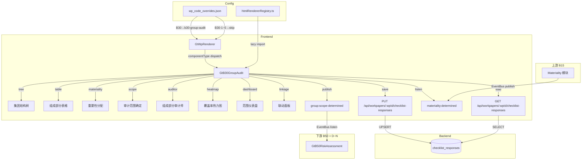

# Design Document — B30 集团审计范围确定底稿

## Overview

本设计将现有 B30 主表（`a-program-console`）+ B30-1~B30-15 共 15+ 个独立底稿替换为统一的 `GtB30GroupAudit.vue` 组件，通过集团结构树 + 组成部分表格 + 重要性分配 + 审计范围确定 + 覆盖率热力图 + 组成部分审计师管理 + 现场经理复核签字界面，聚合集团审计范围确定全流程。

关键设计决策：
- **零新表**：所有数据通过 `checklist_responses` 表存储，item_id 前缀 `B30-` 区分字段
- **零新端点**：复用 `PUT /api/workpapers/{wp_id}/checklist-responses` 批量保存
- **注册替换**：在 htmlRendererRegistry 注册 `b30-group-audit`，wp_code_overrides 映射 B30→`b30-group-audit`，B30-1~B30-5→`skip`
- **3 Composables**：`useB30FormData`（数据加载/保存/debounce）+ `useB30GroupAudit`（集团结构/组成部分/分类/范围/覆盖率/审计师/EventBus）+ `useB30Review`（复核/只读/Amendment）
- **集团结构树**：el-tree 组件，支持拖拽调整层级、节点 CRUD、左侧色带分类颜色编码
- **分类自动建议**：15% 阈值算法（任一占比>15%→重要、>5%→非重要、≤5%→不重要）
- **重要性分配**：B15 Group_Materiality × 占比 × 0.75 系数，15%~85% 约束区间
- **覆盖率加权算法**：全面=1.0/特定=0.5/分析=0.25/不执行=0.0
- **三方联动**：B15（重要性）→ B30（范围）→ B50（风险）→ D~N（程序）
- **EventBus 事件**：监听 `materiality:determined`（B15），发布 `group:scope-determined`


## Architecture



### 数据流

1. **打开底稿** → GtWpRenderer 查 wp_code_overrides → 得到 `b30-group-audit` → 从 registry 加载组件
2. **初始化** → 组件调用 GET checklist-responses 加载全部 `B30-*` 数据，还原集团结构树 + 组成部分表格 + 范围状态
3. **编辑** → 文本字段 debounce 2s / Classification、Scope_Type、审计师确认等选择字段立即保存 → PUT checklist-responses
4. **自动计算** → Financial_Data 变更 → 重算占比 → 重算分类建议 → 重算 Scope_Type 建议 → 重算覆盖率 → 更新热力图+仪表盘
5. **联动上游** → 监听 `materiality:determined` → 更新 Group_Materiality → 重算 Allocated_Materiality 建议
6. **联动下游** → 全部 Scope_Type 确定 → EventBus publish `group:scope-determined` → B50 接收
7. **复核** → 全部组成部分评估完成 → 现场经理签字 → 全组件只读 → emit `completed`


## Components and Interfaces

### GtB30GroupAudit.vue

```typescript
// Props（标准 contextProps='standard' 模式）
interface Props {
  wpId: string
  projectId: string
  wpCode: string
  year: number
  readonly?: boolean
}

// Emits
interface Emits {
  (e: 'save'): void
  (e: 'completed'): void
}
```

### 内部组合式函数

```typescript
// composables/useB30FormData.ts
// 管理全部数据加载、debounce 保存、即时保存（与 B23 同模式）
export function useB30FormData(wpId: Ref<string>) {
  return {
    // 响应式数据
    allResponses: Ref<Map<string, ChecklistResponse>>,
    loading: Ref<boolean>,
    saving: Ref<boolean>,
    // 方法
    loadAll(): Promise<void>,
    saveImmediate(items: ChecklistItem[]): Promise<void>,
    saveDebouncedText(item: ChecklistItem): void,
    flushPendingSave(): void,
    // Helper
    getField(itemId: string): ChecklistResponse,
    setFieldImmediate(itemId: string, data: Partial<ChecklistResponse>): void,
  }
}

// composables/useB30GroupAudit.ts
// 管理集团结构树、组成部分表格、分类、范围、重要性分配、覆盖率、审计师、EventBus
export function useB30GroupAudit(
  allResponses: Ref<Map<string, ChecklistResponse>>,
  saveImmediate: SaveFn
) {
  return {
    // ─── 集团结构树 ─────────────────────────────────────────
    treeData: Ref<TreeNode[]>,
    treeNodeCount: ComputedRef<number>,
    treeMaxDepth: ComputedRef<number>,
    addComponent(parentId: string | null, entity: NewComponentInput): void,
    removeComponent(componentId: string): void,
    moveComponent(componentId: string, newParentId: string): void,
    updateComponent(componentId: string, field: ComponentField, value: any): void,

    // ─── 组成部分表格 ────────────────────────────────────────
    components: ComputedRef<ComponentEntity[]>,
    groupTotals: ComputedRef<FinancialTotals>,
    filteredComponents(filter: ClassificationFilter): ComputedRef<ComponentEntity[]>,

    // ─── 分类建议 ────────────────────────────────────────────
    suggestClassification(entity: ComponentEntity): ComponentClassification,
    setClassification(componentId: string, classification: ComponentClassification, overrideReason?: string): void,
    getClassification(componentId: string): ComputedRef<ClassificationState>,

    // ─── 重要性分配 ──────────────────────────────────────────
    groupMateriality: Ref<number | null>,
    suggestAllocatedMateriality(entity: ComponentEntity): number | null,
    validateMaterialityBounds(allocated: number): MaterialityValidation,
    setAllocatedMateriality(componentId: string, amount: number): void,

    // ─── 审计范围确定 ────────────────────────────────────────
    suggestScopeType(classification: ComponentClassification): ScopeType,
    setScopeType(componentId: string, scopeType: ScopeType, overrideReason?: string): void,
    getScopeType(componentId: string): ComputedRef<ScopeState>,
    allScopeDetermined: ComputedRef<boolean>,

    // ─── 组成部分审计师 ──────────────────────────────────────
    setAuditorInfo(componentId: string, info: Partial<AuditorInfo>): void,
    getAuditorInfo(componentId: string): ComputedRef<AuditorInfo | null>,
    clearAuditorInfo(componentId: string): void,

    // ─── 覆盖率热力图 ────────────────────────────────────────
    coverageMatrix: ComputedRef<CoverageMatrix>,
    coverageTotals: ComputedRef<CoverageTotals>,
    coverageWarnings: ComputedRef<CoverageWarning[]>,

    // ─── 范围仪表盘 ──────────────────────────────────────────
    dashboardStats: ComputedRef<ScopeDashboardStats>,

    // ─── 联动面板 ────────────────────────────────────────────
    linkageInfo: ComputedRef<LinkageInfo>,

    // ─── EventBus ────────────────────────────────────────────
    publishScopeDetermined(): void,
    onMaterialityDetermined(payload: MaterialityPayload): void,
  }
}

// composables/useB30Review.ts
// 管理现场经理复核签字、只读状态、Amendment 机制（与 B23 同模式）
export function useB30Review(
  wpId: Ref<string>,
  allResponses: Ref<Map<string, ChecklistResponse>>,
  dashboardStats: ComputedRef<ScopeDashboardStats>,
  externalReadonly: Ref<boolean>,
  saveImmediate: SaveFn
) {
  return {
    isReviewed: ComputedRef<boolean>,
    isReadonly: ComputedRef<boolean>,
    canReview: ComputedRef<boolean>,
    pendingItems: ComputedRef<string[]>,
    reviewInfo: ComputedRef<{ reviewer: string; date: string } | null>,
    // 操作
    doReview(): Promise<void>,
    startAmendment(reason: string): Promise<void>,
  }
}
```

### 注册

```typescript
// htmlRendererRegistry.ts — 新增条目
{
  componentType: 'b30-group-audit',
  component: defineAsyncComponent(() => import('./GtB30GroupAudit.vue')),
  icon: '🏢',
  label: 'B30 集团审计范围确定',
  emits: ['save', 'completed'],
  contextProps: 'standard',
}
```

### wp_code_overrides.json 变更

```json
"B30": "b30-group-audit",
"B30-1": "skip",
"B30-2": "skip",
"B30-3": "skip",
"B30-4": "skip",
"B30-5": "skip"
```


## Data Models

### 类型定义

```typescript
// ─── 核心枚举 ─────────────────────────────────────────────────────────────────

/** 组成部分类型 */
export type ComponentType = '子公司' | '分公司' | '合营企业' | '联营企业' | '分部'

/** 组成部分分类 */
export type ComponentClassification = '重要组成部分' | '非重要组成部分' | '不重要组成部分'

/** 审计范围类型 */
export type ScopeType = '全面审计' | '特定项目审计' | '分析性程序' | '不执行程序'

/** 独立性确认 */
export type IndependenceConfirmation = '已确认' | '未确认' | '不适用'

/** 胜任能力评估 */
export type CompetenceAssessment = '充分' | '需补充' | '不充分'

/** 分类筛选选项 */
export type ClassificationFilter = 'all' | 'significant' | 'non-significant' | 'insignificant'

// ─── 数据结构 ─────────────────────────────────────────────────────────────────

/** 组成部分实体（表格行数据） */
export interface ComponentEntity {
  id: string                              // 序号（从 1 开始）
  name: string                            // 组成部分名称
  type: ComponentType | null              // 类型
  shareholding: number | null             // 持股比例（0~100%）
  parentId: string | null                 // 父节点 ID（null = 母公司直属）
  // 财务数据
  totalAssets: number | null              // 总资产（元）
  revenue: number | null                  // 营业收入（元）
  profit: number | null                   // 利润（元）
  // 计算占比
  assetRatio: number                      // 总资产占比（0~1）
  revenueRatio: number                    // 营收占比（0~1）
  profitRatio: number                     // 利润占比（0~1）
  // 分类
  classification: ComponentClassification | null
  suggestedClassification: ComponentClassification | null
  classificationOverridden: boolean
  classificationOverrideReason: string
  // 审计范围
  scopeType: ScopeType | null
  suggestedScopeType: ScopeType | null
  scopeOverridden: boolean
  scopeOverrideReason: string
  scopeDescription: string                // 特定项目说明
  // 重要性分配
  allocatedMateriality: number | null     // 分配重要性金额
  suggestedMateriality: number | null     // 建议分配金额
  materialityWarning: string | null       // 超出范围警告
  // 审计师
  auditorName: string                     // 审计师姓名/事务所
  independence: IndependenceConfirmation | null
  competence: CompetenceAssessment | null
  auditorRemark: string
  // 其他
  remark: string
}

/** 新增组成部分输入 */
export interface NewComponentInput {
  name: string
  type: ComponentType
  shareholding: number | null
}

/** 组成部分字段类型 */
export type ComponentField =
  | 'name' | 'type' | 'shareholding' | 'parentId'
  | 'totalAssets' | 'revenue' | 'profit'
  | 'classification' | 'classificationOverrideReason'
  | 'scopeType' | 'scopeOverrideReason' | 'scopeDescription'
  | 'allocatedMateriality'
  | 'auditorName' | 'independence' | 'competence' | 'auditorRemark'
  | 'remark'

/** 树节点 */
export interface TreeNode {
  id: string
  label: string                           // = name
  type: ComponentType | null
  classification: ComponentClassification | null
  scopeType: ScopeType | null
  children: TreeNode[]
}

/** 财务合计 */
export interface FinancialTotals {
  totalAssets: number
  revenue: number
  profit: number
}

/** 分类状态 */
export interface ClassificationState {
  current: ComponentClassification | null
  suggested: ComponentClassification | null
  overridden: boolean
  overrideReason: string
}

/** 范围状态 */
export interface ScopeState {
  current: ScopeType | null
  suggested: ScopeType | null
  overridden: boolean
  overrideReason: string
  warning: string | null
}

/** 重要性校验结果 */
export interface MaterialityValidation {
  valid: boolean
  warning: string | null          // 超上限/低下限提示
  upperBound: number              // Group_Materiality × 85%
  lowerBound: number              // Group_Materiality × 15%
}

/** 审计师信息 */
export interface AuditorInfo {
  name: string
  independence: IndependenceConfirmation | null
  competence: CompetenceAssessment | null
  remark: string
}

/** 覆盖率矩阵单元格 */
export interface CoverageCell {
  componentId: string
  componentName: string
  indicator: 'totalAssets' | 'revenue' | 'profit'
  amount: number                  // 金额
  ratio: number                   // 占比（0~1）
  scopeType: ScopeType | null
  weight: number                  // 加权系数
  contribution: number            // 加权后覆盖贡献（ratio × weight）
  colorLevel: 'high' | 'medium' | 'low' | 'none'  // ≥15%/5%~15%/<5%/0%
}

/** 覆盖率矩阵 */
export interface CoverageMatrix {
  rows: string[]                  // 组成部分 ID 列表
  columns: ('totalAssets' | 'revenue' | 'profit')[]
  cells: Map<string, CoverageCell>  // key = `${componentId}-${indicator}`
}

/** 覆盖率合计 */
export interface CoverageTotals {
  totalAssets: number             // 总资产加权覆盖率（0~1）
  revenue: number                 // 营收加权覆盖率（0~1）
  profit: number                  // 利润加权覆盖率（0~1）
}

/** 覆盖率警告 */
export interface CoverageWarning {
  indicator: 'totalAssets' | 'revenue' | 'profit'
  indicatorLabel: string
  coverageRate: number
  message: string                 // "覆盖率不足，建议扩大审计范围"
}

/** 范围仪表盘统计 */
export interface ScopeDashboardStats {
  // 基本统计
  componentCount: number
  treeNodeCount: number
  treeMaxDepth: number
  // 分类分布
  classificationDistribution: {
    significant: number
    nonSignificant: number
    insignificant: number
    unclassified: number
  }
  // 范围分布
  scopeDistribution: {
    fullAudit: number
    specificItems: number
    analyticalProcedures: number
    noWork: number
    undetermined: number
  }
  // 覆盖率
  coverageTotals: CoverageTotals
  // 重要性
  groupMateriality: number | null
  allocatedCount: number          // 已分配重要性的组成部分数
  // 待确认事项
  pendingCount: number
  pendingDetails: {
    unclassified: number          // 未分类
    undeterminedScope: number     // 未确定范围
    independenceUnconfirmed: number // 独立性未确认
  }
  // 审计师警告
  competenceInsufficient: number  // 胜任能力不充分
}

/** 联动信息 */
export interface LinkageInfo {
  b15Status: 'completed' | 'incomplete'
  b15Materiality: number | null
  b50Status: 'received' | 'not-received'
  significantComponents: { id: string; name: string; scopeType: ScopeType }[]
  overallCoverage: CoverageTotals
}

/** EventBus: group:scope-determined 载荷 */
export interface ScopeDeterminedPayload {
  significantComponents: { name: string; scopeType: ScopeType }[]
  componentScopes: { name: string; classification: ComponentClassification; scopeType: ScopeType }[]
  coverageTotals: CoverageTotals
}

/** EventBus: materiality:determined 载荷（来自 B15） */
export interface MaterialityPayload {
  groupMateriality: number
  performanceMateriality: number
  trivialThreshold: number
}

/** 复核状态 */
export interface ReviewState {
  reviewed: boolean
  reviewerName: string | null
  reviewDate: string | null       // YYYY-MM-DD
  amendmentReason: string | null
}
```


### 导出常量（exported for testing）

```typescript
// ─── 分类阈值常量 ─────────────────────────────────────────────────────────────

/** 分类阈值 */
export const CLASSIFICATION_THRESHOLDS = {
  /** 任一占比超过此值 → 重要组成部分 */
  SIGNIFICANT: 0.15,
  /** 任一占比超过此值但不超过 SIGNIFICANT → 非重要组成部分 */
  NON_SIGNIFICANT: 0.05,
} as const

// ─── 覆盖率权重常量 ─────────────────────────────────────────────────────────

/** 覆盖率加权系数 */
export const COVERAGE_WEIGHTS: Record<ScopeType, number> = {
  '全面审计': 1.0,
  '特定项目审计': 0.5,
  '分析性程序': 0.25,
  '不执行程序': 0.0,
} as const

/** 覆盖率颜色阈值 */
export const COVERAGE_COLOR_THRESHOLDS = {
  HIGH: 0.15,     // ≥15% → 深绿
  MEDIUM: 0.05,   // 5%~15% → 浅绿
  // <5% → 浅灰, 0% → 白色
} as const

/** 覆盖率进度条颜色阈值 */
export const COVERAGE_PROGRESS_THRESHOLDS = {
  GREEN: 0.80,    // ≥80% 绿色
  YELLOW: 0.60,   // 60%~80% 黄色
  // <60% 红色
} as const

/** 覆盖率不足警告阈值 */
export const COVERAGE_WARNING_THRESHOLD = 0.60

// ─── 重要性分配常量 ─────────────────────────────────────────────────────────

/** 重要性分配调整系数 */
export const MATERIALITY_ALLOCATION_COEFFICIENT = 0.75

/** 分配重要性上限（占集团重要性百分比） */
export const MATERIALITY_UPPER_BOUND = 0.85

/** 分配重要性下限（占集团重要性百分比） */
export const MATERIALITY_LOWER_BOUND = 0.15

// ─── 颜色编码常量 ─────────────────────────────────────────────────────────────

/** 组成部分分类→颜色映射 */
export const CLASSIFICATION_COLORS: Record<ComponentClassification, { color: string; bg: string; label: string }> = {
  '重要组成部分':   { color: '#ff4d4f', bg: '#fff2f0', label: '重要' },
  '非重要组成部分': { color: '#faad14', bg: '#fffbe6', label: '非重要' },
  '不重要组成部分': { color: '#bfbfbf', bg: '#fafafa', label: '不重要' },
}

/** 审计范围类型→颜色映射 */
export const SCOPE_COLORS: Record<ScopeType, { color: string; bg: string; label: string }> = {
  '全面审计':     { color: '#52c41a', bg: '#f6ffed', label: '全面' },
  '特定项目审计': { color: '#95de64', bg: '#f0fff0', label: '特定' },
  '分析性程序':   { color: '#1890ff', bg: '#e6f7ff', label: '分析' },
  '不执行程序':   { color: '#d9d9d9', bg: '#fafafa', label: '不执行' },
}

/** 热力图覆盖率贡献→颜色映射 */
export const HEATMAP_COLORS: Record<CoverageCell['colorLevel'], string> = {
  high: '#389e0d',    // 深绿（≥15%）
  medium: '#95de64',  // 浅绿（5%~15%）
  low: '#f0f0f0',    // 浅灰（<5%）
  none: '#ffffff',    // 白色（0%）
}

/** 覆盖率进度条颜色 */
export const COVERAGE_PROGRESS_COLORS = {
  green: '#52c41a',
  yellow: '#faad14',
  red: '#ff4d4f',
} as const

/** 树节点左侧色带宽度 */
export const TREE_NODE_BORDER_WIDTH = '4px'
```


### 核心算法

#### 分类自动建议算法

```typescript
/**
 * 基于占比阈值自动建议组成部分分类（15%/5% 双阈值）
 *
 * 规则：
 * (a) 任一占比 > 15% → "重要组成部分"
 * (b) 任一占比 > 5% 且全部 ≤ 15% → "非重要组成部分"
 * (c) 全部占比 ≤ 5% → "不重要组成部分"
 * (d) 财务数据不足时 → null
 */
export function suggestClassification(
  assetRatio: number,
  revenueRatio: number,
  profitRatio: number
): ComponentClassification | null {
  const ratios = [assetRatio, revenueRatio, profitRatio]
  // 无有效数据时无法建议
  if (ratios.every(r => r === 0)) return null

  const maxRatio = Math.max(...ratios)

  if (maxRatio > CLASSIFICATION_THRESHOLDS.SIGNIFICANT) {
    return '重要组成部分'
  }
  if (maxRatio > CLASSIFICATION_THRESHOLDS.NON_SIGNIFICANT) {
    return '非重要组成部分'
  }
  return '不重要组成部分'
}
```

#### 重要性分配建议算法

```typescript
/**
 * 建议组成部分分配重要性金额
 *
 * 公式：max(占比) × Group_Materiality × 0.75
 * 约束：结果 clamp 到 [Group_Materiality × 15%, Group_Materiality × 85%]
 */
export function suggestAllocatedMateriality(
  maxRatio: number,
  groupMateriality: number
): number {
  const raw = maxRatio * groupMateriality * MATERIALITY_ALLOCATION_COEFFICIENT
  const lower = groupMateriality * MATERIALITY_LOWER_BOUND
  const upper = groupMateriality * MATERIALITY_UPPER_BOUND
  return Math.max(lower, Math.min(upper, raw))
}

/**
 * 校验分配重要性是否在合理区间
 */
export function validateMaterialityBounds(
  allocated: number,
  groupMateriality: number
): MaterialityValidation {
  const upper = groupMateriality * MATERIALITY_UPPER_BOUND
  const lower = groupMateriality * MATERIALITY_LOWER_BOUND

  if (allocated > upper) {
    return { valid: false, warning: `超过集团重要性的 85%（上限 ${upper.toLocaleString()} 元）`, upperBound: upper, lowerBound: lower }
  }
  if (allocated < lower) {
    return { valid: false, warning: `低于集团重要性的 15%（下限 ${lower.toLocaleString()} 元）`, upperBound: upper, lowerBound: lower }
  }
  return { valid: true, warning: null, upperBound: upper, lowerBound: lower }
}
```

#### 覆盖率加权计算算法

```typescript
/**
 * 计算各指标的加权覆盖率
 *
 * 公式：coverage_indicator = Σ (component_ratio_indicator × weight(scopeType))
 * 权重：全面=1.0 / 特定=0.5 / 分析=0.25 / 不执行=0.0
 */
export function calculateCoverageRate(
  components: ComponentEntity[],
  indicator: 'totalAssets' | 'revenue' | 'profit'
): number {
  let totalCoverage = 0

  for (const comp of components) {
    const ratio = indicator === 'totalAssets' ? comp.assetRatio
      : indicator === 'revenue' ? comp.revenueRatio
      : comp.profitRatio

    const weight = comp.scopeType ? COVERAGE_WEIGHTS[comp.scopeType] : 0
    totalCoverage += ratio * weight
  }

  // Clamp to [0, 1]
  return Math.min(1, Math.max(0, totalCoverage))
}

/**
 * 确定热力图单元格颜色等级
 */
export function getCoverageColorLevel(contribution: number): CoverageCell['colorLevel'] {
  if (contribution === 0) return 'none'
  if (contribution >= COVERAGE_COLOR_THRESHOLDS.HIGH) return 'high'
  if (contribution >= COVERAGE_COLOR_THRESHOLDS.MEDIUM) return 'medium'
  return 'low'
}

/**
 * 确定覆盖率进度条颜色
 */
export function getCoverageProgressColor(rate: number): string {
  if (rate >= COVERAGE_PROGRESS_THRESHOLDS.GREEN) return COVERAGE_PROGRESS_COLORS.green
  if (rate >= COVERAGE_PROGRESS_THRESHOLDS.YELLOW) return COVERAGE_PROGRESS_COLORS.yellow
  return COVERAGE_PROGRESS_COLORS.red
}
```

#### Scope_Type 自动建议算法

```typescript
/**
 * 基于分类自动建议审计范围类型
 *
 * 映射：
 * - 重要组成部分 → 全面审计
 * - 非重要组成部分 → 特定项目审计
 * - 不重要组成部分 → 不执行程序
 */
export function suggestScopeType(classification: ComponentClassification | null): ScopeType | null {
  if (!classification) return null
  switch (classification) {
    case '重要组成部分': return '全面审计'
    case '非重要组成部分': return '特定项目审计'
    case '不重要组成部分': return '不执行程序'
  }
}
```

### item_id 命名规范

所有字段使用 `checklist_responses` 表，通过 item_id 前缀 `B30-` 区分：

| 区域 | item_id 模式 | conclusion | remark | wp_ref |
|------|-------------|-----------|--------|--------|
| **集团结构** | | | | |
| 树结构 JSON | `B30-tree-structure` | — | JSON 序列化的树结构 | — |
| 组成部分数量 | `B30-comp-count` | — | 数字字符串 | — |
| **组成部分基本信息** | | | | |
| 名称 | `B30-comp-{n}-name` | — | 名称文本 | — |
| 类型 | `B30-comp-{n}-type` | 子公司/分公司/合营企业/联营企业/分部 | — | — |
| 持股比例 | `B30-comp-{n}-shareholding` | — | 百分比数字字符串 | — |
| 父节点 | `B30-comp-{n}-parent` | — | 父节点编号或 root | — |
| **财务数据** | | | | |
| 总资产 | `B30-comp-{n}-assets` | — | 金额数字字符串 | — |
| 营业收入 | `B30-comp-{n}-revenue` | — | 金额数字字符串 | — |
| 利润 | `B30-comp-{n}-profit` | — | 金额数字字符串 | — |
| **分类** | | | | |
| 分类 | `B30-comp-{n}-classification` | 重要组成部分/非重要组成部分/不重要组成部分 | — | — |
| 分类覆盖标记 | `B30-comp-{n}-cls-override` | Y/null | 覆盖理由 | — |
| **审计范围** | | | | |
| 范围类型 | `B30-comp-{n}-scope` | 全面审计/特定项目审计/分析性程序/不执行程序 | — | — |
| 范围覆盖标记 | `B30-comp-{n}-scope-override` | Y/null | 覆盖理由 | — |
| 特定项目说明 | `B30-comp-{n}-scope-desc` | — | 说明文本 | — |
| **重要性分配** | | | | |
| 分配金额 | `B30-comp-{n}-materiality` | — | 金额数字字符串 | — |
| **组成部分审计师** | | | | |
| 审计师名称 | `B30-comp-{n}-auditor-name` | — | 姓名/事务所文本 | — |
| 独立性确认 | `B30-comp-{n}-independence` | 已确认/未确认/不适用 | — | — |
| 胜任能力评估 | `B30-comp-{n}-competence` | 充分/需补充/不充分 | — | — |
| 审计师备注 | `B30-comp-{n}-auditor-remark` | — | 备注文本 | — |
| **其他** | | | | |
| 备注 | `B30-comp-{n}-remark` | — | 备注文本 | — |
| **集团重要性** | | | | |
| B15 重要性 | `B30-group-materiality` | — | 金额数字字符串 | — |
| **现场经理复核** | | | | |
| 复核签字 | `B30-review-sign` | Y/null | 复核人姓名 | 日期 YYYY-MM-DD |
| **修改（Amendment）** | | | | |
| 修改原因 | `B30-amend-{k}-reason` | — | 原因文本 | — |
| 修改后复核 | `B30-amend-{k}-review-sign` | Y/null | 复核人姓名 | 日期 |

> `{n}` = 组成部分序号从 1 开始；`{k}` = 修改轮次从 1 开始

### item_id 生成函数

```typescript
/**
 * 生成 B30 item_id
 */
export function generateB30ItemId(
  type: 'tree-structure' | 'comp-count' | 'comp' | 'group-materiality' | 'review-sign' | 'amend',
  compIndex?: number,
  field?: string,
  amendRound?: number
): string {
  switch (type) {
    case 'tree-structure':
      return 'B30-tree-structure'
    case 'comp-count':
      return 'B30-comp-count'
    case 'comp':
      return `B30-comp-${compIndex}-${field}`
    case 'group-materiality':
      return 'B30-group-materiality'
    case 'review-sign':
      return 'B30-review-sign'
    case 'amend':
      return `B30-amend-${amendRound}-${field}`
  }
}
```


### 联动映射

```typescript
/** 分类→默认范围映射 */
export const CLASSIFICATION_TO_SCOPE: Record<ComponentClassification, ScopeType> = {
  '重要组成部分':   '全面审计',
  '非重要组成部分': '特定项目审计',
  '不重要组成部分': '不执行程序',
}

/** 范围类型→Scope_Dashboard 简称映射 */
export const SCOPE_SHORT_LABELS: Record<ScopeType, string> = {
  '全面审计':     '全面',
  '特定项目审计': '特定',
  '分析性程序':   '分析',
  '不执行程序':   '无',
}
```

### 导入导出设计

```typescript
/** 导出模板/数据 + 导入（三级） */
// 复用项目已有 ExcelJS 库（不引入新依赖）

/** Sheet 1: 集团结构 */
const EXPORT_SHEET1_COLUMNS = ['名称', '类型', '持股比例(%)', '父节点名称']

/** Sheet 2: 组成部分明细 */
const EXPORT_SHEET2_COLUMNS = [
  '名称', '总资产', '营业收入', '利润',
  '分类', '审计范围', '分配重要性',
  '审计师', '独立性确认', '胜任能力评估',
]

// 导入冲突策略：弹窗让用户选择"覆盖"或"跳过"
type ImportConflictStrategy = 'overwrite' | 'skip'
```

### 只读判定逻辑

```typescript
function computeIsReadonly(externalReadonly: boolean, reviewState: ReviewState): boolean {
  if (externalReadonly) return true
  return reviewState.reviewed === true
}
```

### EventBus 事件设计

```typescript
/** group:scope-determined — B30 发布，B50 监听 */
// 触发条件：所有组成部分 Scope_Type 非空
// 载荷：significantComponents + componentScopes + coverageTotals
window.dispatchEvent(new CustomEvent('group:scope-determined', {
  detail: {
    significantComponents: [{ name: '子公司A', scopeType: '全面审计' }],
    componentScopes: [{ name: '子公司A', classification: '重要组成部分', scopeType: '全面审计' }],
    coverageTotals: { totalAssets: 0.85, revenue: 0.78, profit: 0.82 },
  } satisfies ScopeDeterminedPayload,
}))

/** materiality:determined — B15 发布，B30 监听 */
// B30 初始化时也通过 API 获取 B15 数据作为 fallback
window.addEventListener('materiality:determined', (e: CustomEvent<MaterialityPayload>) => {
  // 更新 groupMateriality → 重算所有 Allocated_Materiality 建议
})
```


## Correctness Properties

*A property is a characteristic or behavior that should hold true across all valid executions of a system—essentially, a formal statement about what the system should do. Properties serve as the bridge between human-readable specifications and machine-verifiable correctness guarantees.*

### Property 1: 仪表盘同步不变式

*For any* 组成部分集合及其 Classification、Scope_Type、Financial_Data 的任意组合，Scope_Dashboard 中的 `dashboardStats` SHALL 始终满足：`classificationDistribution` 各分类计数之和等于组成部分总数；`scopeDistribution` 各范围计数之和等于组成部分总数；`pendingDetails` 各项计数等于实际满足对应条件的组成部分数；`treeNodeCount` 等于实际树节点数。

**Validates: Requirements 7.1, 7.2, 7.3, 7.4, 7.6, 4.6, 5.5**

### Property 2: 覆盖率计算一致性

*For any* 组成部分集合及其 Financial_Data 和 Scope_Type 组合，各指标的 Coverage_Rate SHALL 满足：每个组成部分的覆盖贡献 = 该组成部分指标占比 × 权重（全面=1.0/特定=0.5/分析=0.25/不执行=0.0），总覆盖率 = 所有组成部分贡献之和，结果 clamp 到 [0, 1] 区间内。WHEN 任一指标覆盖率 < 60% 时 SHALL 产生警告。

**Validates: Requirements 6.3, 6.4, 6.5, 6.6, 4.7**

### Property 3: 分类自动建议一致性

*For any* 组成部分的三个占比值（totalAssets/revenue/profit），分类自动建议 SHALL 满足：(a) 任一占比 > 15% → "重要组成部分"；(b) 任一占比 > 5% 且全部 ≤ 15% → "非重要组成部分"；(c) 全部占比 ≤ 5% → "不重要组成部分"。手动覆盖不影响建议计算逻辑本身，仅覆盖存储值。

**Validates: Requirements 2.4, 2.5, 2.6**

### Property 4: 重要性分配约束

*For any* 重要组成部分的 Allocated_Materiality 值及 Group_Materiality，校验逻辑 SHALL 满足：(a) allocated > Group_Materiality × 85% 时返回超上限警告；(b) allocated < Group_Materiality × 15% 时返回低下限警告；(c) 在区间内时无警告。自动建议公式 = max(三个占比) × Group_Materiality × 0.75，结果 clamp 到 [15%, 85%] 区间。非重要/不重要组成部分的 allocatedMateriality SHALL 为 null。

**Validates: Requirements 3.3, 3.4, 3.5, 3.6, 3.7, 3.9**

### Property 5: 树表双向同步不变式

*For any* Group_Structure_Tree 节点的添加/删除/命名操作序列，组成部分表格行数 SHALL 始终等于树节点数（不含根节点母公司或含根节点，取决于设计）。树中节点名称 SHALL 与对应表格行名称字段一致。集团合计 SHALL 等于所有组成部分对应指标之和。

**Validates: Requirements 1.2, 1.4, 1.5, 2.2, 2.3, 2.8**

### Property 6: 复核前置条件完备性

*For any* 组成部分状态组合，`canReview` SHALL 为 true 当且仅当：(a) 所有组成部分 Classification 非空；(b) 所有组成部分 Scope_Type 非空；(c) 所有"重要组成部分"的 Independence_Confirmation 为"已确认"或"不适用"。条件不满足时签字按钮必须禁用。

**Validates: Requirements 10.2**

### Property 7: 复核后只读不变式

*For any* 已通过现场经理复核的组件状态，`isReadonly` SHALL 为 true。外部 `readonly` prop 为 true 时也 SHALL 为 true。Amendment 解锁需提供非空理由，解锁后 `isReadonly` 恢复为 false 直到重新复核。

**Validates: Requirements 10.3, 10.5, 10.6**

### Property 8: 数据持久化往返一致性

*For any* 有效的集团审计范围数据（包含树结构 + 组成部分明细 + 分类 + 范围 + 审计师 + 重要性分配），通过 PUT 保存后再通过 GET 加载，所有字段值（item_id、conclusion、remark、wp_ref）SHALL 与保存前一致。

**Validates: Requirements 9.1, 9.5, 9.6**

### Property 9: item_id 命名唯一性

*For any* 组合（组成部分编号 {n} × 字段类型），`generateB30ItemId` 生成的 item_id SHALL 唯一。不同业务含义的数据不可产生相同 item_id；相同业务含义的数据重复生成应产生相同 item_id（幂等性）。

**Validates: Requirements 9.7**

### Property 10: EventBus 事件发射正确性

*For any* 组成部分 Scope_Type 状态组合，WHEN 全部组成部分均有非空 Scope_Type 时 SHALL 发布 `group:scope-determined` 事件。WHEN 存在任一组成部分 Scope_Type 为空时 SHALL 不发布事件。事件载荷中 `significantComponents` SHALL 精确等于 Classification="重要组成部分" 的组成部分集合。

**Validates: Requirements 8.1**

### Property 11: 颜色编码单射

*For any* ComponentClassification 值，`CLASSIFICATION_COLORS[classification].color` 映射 SHALL 满足单射：重要→#ff4d4f、非重要→#faad14、不重要→#bfbfbf。不存在同色不同分类。Scope_Type 颜色集（#52c41a/#95de64/#1890ff/#d9d9d9）与 Classification 颜色集不交叉。

**Validates: Requirements 13.1, 13.2, 13.4**

### Property 12: 后端白名单校验正确性

*For any* item_id 以 `B30-` 开头的保存请求，conclusion 值在白名单（重要组成部分/非重要组成部分/不重要组成部分/全面审计/特定项目审计/分析性程序/不执行程序/已确认/未确认/不适用/充分/需补充/不充分/子公司/分公司/合营企业/联营企业/分部/Y/N）内时 SHALL 返回 200；conclusion 值不在白名单内时 SHALL 返回 HTTP 422。remark 字段接受任意文本。

**Validates: Requirements 12.1, 12.2, 12.4**

### Property 13: Scope_Type 自动建议与分类关联

*For any* ComponentClassification 值，Scope_Type 自动建议 SHALL 满足确定性映射：重要组成部分→"全面审计"；非重要组成部分→"特定项目审计"；不重要组成部分→"不执行程序"。WHEN Classification 为"重要组成部分"且实际 Scope_Type ≠ "全面审计"时 SHALL 产生橙色警告。

**Validates: Requirements 4.2, 4.4**

### Property 14: 导入导出数据一致性

*For any* 已填写的集团审计范围数据，通过"导出数据"生成的数据结构再通过"导入"操作解析后，所有组成部分字段值（名称/类型/持股比例/财务数据/分类/范围/审计师）SHALL 与导出前一致。导入操作不影响未涉及组成部分的已有数据。

**Validates: Requirements 15.1, 15.2, 15.3**


## Error Handling

| 场景 | 行为 |
|------|------|
| PUT 保存失败（网络/500） | ElMessage.error('保存失败')，保留本地数据不回滚 |
| GET 加载失败 | ElMessage.warning('数据加载失败')，表单保持空白可编辑状态 |
| B15 重要性数据不可用 | 重要性分配区域显示灰色提示"B15 未完成，集团重要性待定"，禁用自动建议 |
| 删除有子节点的节点 | 弹出提示"请先删除或移动子节点"，拒绝操作 |
| 复核时前置条件不满足 | 签字按钮禁用 + 显示待完成事项清单（未分类/未确定范围/独立性未确认） |
| Amendment 原因为空/纯空白 | 拒绝提交，显示校验错误 |
| 手动覆盖 Classification/Scope_Type 无理由 | 拒绝覆盖操作，提示"需填写调整理由" |
| Allocated_Materiality 超出 15%~85% 区间 | 字段旁显示黄色警告，允许保存但标记 |
| conclusion 值不在白名单 | 后端 422，前端显示校验错误 |
| EventBus 监听 materiality:determined 失败 | 使用 API fallback 获取 B15 数据 |
| EventBus 发布 group:scope-determined 失败 | 仅 console.warn，不影响本组件保存 |
| 组件卸载时保存失败 | 静默失败（已离开页面），下次打开从后端加载 |
| 导入 Excel 格式不符 | ElMessage.error + 拒绝导入（不写入任何数据） |
| 导入存在同名组成部分冲突 | 弹出确认弹窗（覆盖/跳过） |
| 组成部分数量超过合理范围 | 单个集团最多 50 个组成部分，达上限后"新增"按钮禁用 |
| 树层级过深 | 最多 5 层嵌套，达上限时拖拽放置禁止 |
| 财务数据为负数 | 允许录入（利润可能为负），占比计算使用绝对值 |

### 后端 conclusion 白名单扩展

在 `checklist_responses.py` 现有 `elif item.item_id.startswith("B23-"):` 分支后新增 `elif item.item_id.startswith("B30-"):` 分支：

```python
elif item.item_id.startswith("B30-"):
    # B30 集团审计范围确定：分类 + 范围类型 + 组成部分类型 + 审计师确认 + 签字标记
    allowed = (
        "重要组成部分", "非重要组成部分", "不重要组成部分",           # ComponentClassification
        "全面审计", "特定项目审计", "分析性程序", "不执行程序",       # ScopeType
        "子公司", "分公司", "合营企业", "联营企业", "分部",           # ComponentType
        "已确认", "未确认", "不适用",                                 # IndependenceConfirmation
        "充分", "需补充", "不充分",                                   # CompetenceAssessment
        "Y", "N",                                                     # 签字/标记
    )
    if item.conclusion not in allowed:
        raise HTTPException(
            status_code=422,
            detail=f"B30 conclusion 值无效，收到: '{item.conclusion}'",
        )
```


## Testing Strategy

### Property-Based Testing（fast-check，前端）

测试文件路径：
```
audit-platform/frontend/src/components/workpaper/__tests__/b30GroupAudit.property.spec.ts
```

配置：
- 库：`fast-check`（项目已安装）
- 最小迭代：100 次
- Tag 格式：`Feature: b30-group-audit, Property {N}: {title}`

| Property | 测试内容 | 生成器 |
|----------|---------|--------|
| 1 | 组成部分集合 → dashboardStats 统计一致性 | 随机 N 个组成部分(1~50) × 随机 Classification × 随机 Scope_Type × 随机 Independence → 验证分布计数之和 |
| 2 | 组成部分 Financial_Data + Scope_Type → Coverage_Rate | 随机 N 个组成部分 × 随机金额(0~1e9) × 随机 ScopeType → 验证加权公式 + [0,1] 区间 + 警告阈值 |
| 3 | 三个占比值 → suggestClassification | 随机 3 个比例(0~1) → 验证 15%/5% 阈值规则一致性 |
| 4 | 占比 + Group_Materiality → Allocated_Materiality 约束 | 随机占比(0~1) × 随机 GM(1e5~1e9) → 验证建议值在 [15%, 85%] 区间 + 校验函数正确性 |
| 5 | 节点操作序列 → 树表同步 | 随机操作序列(add/remove/rename, 1~20步) → 验证树节点数 == 表格行数 + 名称一致 |
| 6 | 组成部分状态组合 → canReview 前置条件 | 随机 N 个组成部分 × 随机完成状态 → 验证 canReview = (全部分类非空 ∧ 全部范围非空 ∧ 重要组成部分独立性已确认) |
| 7 | 复核状态 + readonly prop → isReadonly | 随机 ReviewState × 随机 external readonly → 验证只读判定逻辑 |
| 8 | 随机 B30- item_id + 合法 conclusion → round-trip | 随机组成部分编号 × 随机字段 × 随机值 → PUT → GET → 验证一致 |
| 9 | generateB30ItemId 唯一性 | 随机 compIndex(1~50) × 随机 field(18种) → 验证无碰撞 |
| 10 | 组成部分 Scope_Type 状态 → EventBus 发射条件 | 随机 N 个组成部分 × 随机 ScopeType(含 null) → 验证全部非空时触发 + 载荷正确 |
| 11 | ComponentClassification + ScopeType → 颜色映射双射 | 全量枚举 → 验证无重复色 + 两组颜色集不交叉 |
| 12 | B30- item_id + 随机 conclusion → 白名单校验 | 随机合法/非法 conclusion → 验证 200/422 |
| 13 | Classification → suggestScopeType 映射 + 警告条件 | 随机 Classification × 随机实际 ScopeType → 验证建议值 + 警告触发 |
| 14 | 导入导出 round-trip | 随机组成部分数据集(1~20) → 导出 → 导入 → 验证字段值一致 |

### Unit Tests（vitest，前端）

测试文件路径：
```
audit-platform/frontend/src/components/workpaper/__tests__/b30GroupAudit.spec.ts
```

覆盖：
- 组件注册正确性（registry 包含 `b30-group-audit`）
- wp_code_overrides 映射正确性（B30→b30-group-audit, B30-1~5→skip）
- 集团结构树渲染（el-tree + 节点 CRUD + 拖拽）
- 组成部分表格渲染（默认列 + 合计行）
- 分类自动建议显示 + 手动覆盖（需理由）
- 重要性分配区域（B15 已完成/未完成两种状态）
- 重要性分配警告显示（超上限/低下限）
- Scope_Type 下拉选择 + 自动建议 + 手动覆盖
- 重要组成部分选择非全面审计时的橙色警告
- 特定项目审计时"特定项目说明"文本区显示
- 审计师管理区域（Scope_Type=不执行程序时隐藏）
- 独立性"未确认"红色警告 + 胜任能力"不充分"红色警告
- 覆盖率热力图渲染（颜色分级 + 合计行 + tooltip）
- 覆盖率 <60% 红色警告
- Scope_Dashboard 统计渲染（分类分布/范围分布/覆盖率进度条）
- 联动面板（B15 状态 + B50 状态 + ref_chip）
- debounce 2s 文本保存行为（fake timers）
- 选择字段（Classification/Scope_Type/Independence/Competence）立即保存
- readonly 模式下所有交互禁用
- 复核签字操作 emit 行为（save / completed）
- Amendment 启动流程（原因非空校验）
- 导入导出按钮（模板/数据/导入 三按钮）
- 打印样式类存在性（@media print）
- 树节点左侧色带颜色编码
- 组成部分删除确认弹窗
- 筛选功能（全部/仅重要/仅非重要/仅不重要）

### 后端 PBT（hypothesis）

测试文件路径：
```
backend/tests/test_b30_group_audit_pbt.py
```

覆盖：
- Property 8: round-trip（生成随机 B30- item_id + conclusion → PUT → GET → 验证一致）
- Property 12: conclusion 白名单校验（生成随机 B30- item_id + 随机 conclusion 值 → 验证 422/200）

### 契约测试

- componentType 契约：`componentTypeContract.spec.ts` 自动覆盖（已有 CI 卡点）
- HtmlComponentType union 类型更新后 TypeScript 编译即验证
- wp_code_overrides 契约：验证 B30/B30-1~5 映射值合法

