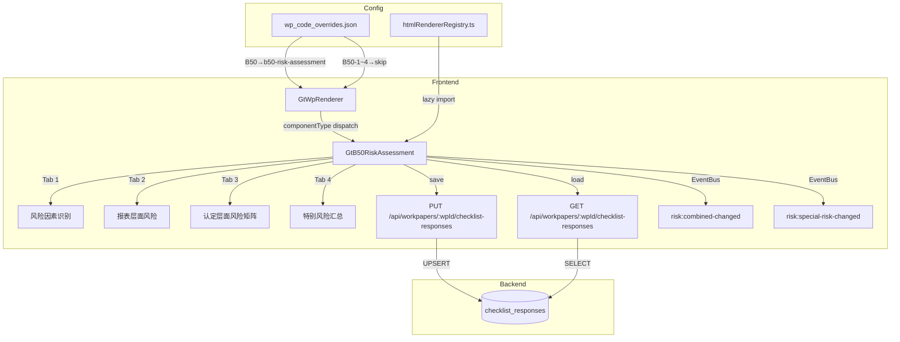

# Design Document — B50 重大错报风险评估汇总

## Overview

本设计将现有 B50（`a-program-console`）+ B50-1~4（`d-form-table`）的碎片化 5 底稿方案替换为统一的 `GtB50RiskAssessment.vue` 组件，通过 4-tab 界面聚合全部风险评估工作流。

关键设计决策：
- **零新表**：所有数据通过 `checklist_responses` 表存储，item_id 前缀 `B50-` 区分字段
- **零新端点**：复用 `PUT /api/workpapers/{wp_id}/checklist-responses` 批量保存
- **注册替换**：在 htmlRendererRegistry 注册 `b50-risk-assessment`，wp_code_overrides 映射 B50→`b50-risk-assessment`，B50-1~4→`skip`
- **3 Composables**：`useB50FormData`（数据加载/保存）+ `useB50RiskMatrix`（矩阵状态/计算）+ `useB50Approval`（合伙人审批）
- **风险矩阵**：CSS Grid 交叉表 + Popover 编辑面板 + 红/黄/绿色标
- **CAS 1211 强制**：收入确认舞弊推定 + 管理层凌驾不可变 + 特别风险应对约束
- **跨底稿联动**：EventBus 发布风险变更事件，驱动 D~N 程序表更新

## Architecture



### 数据流

1. **打开底稿** → GtWpRenderer 查 wp_code_overrides → 得到 `b50-risk-assessment` → 从 registry 加载组件
2. **初始化** → 组件调用 GET checklist-responses 加载全部 `B50-*` 数据，按 item_id 前缀分发到 4 个 tab
3. **编辑** → 文本字段 debounce 2s / 风险等级选择立即保存 → PUT checklist-responses
4. **矩阵交互** → 点击单元格 → Popover 编辑三层风险 → 保存 → 颜色即时刷新
5. **CAS 强制** → 收入确认降级触发反驳流程 / 管理层凌驾不可删除
6. **审批** → 全部完成 → 合伙人签字 → 全组件只读 → emit `completed`
7. **联动** → Combined_Risk 变更 → EventBus publish → D~N 程序表接收

## Components and Interfaces

### GtB50RiskAssessment.vue

```typescript
// Props（标准 contextProps='standard' 模式）
interface Props {
  wpId: string
  projectId: string
  wpCode: string
  year: number
  readonly?: boolean
}

// Emits
interface Emits {
  (e: 'save'): void
  (e: 'completed'): void
}

// Expose（GtWpToolbar 委托模式）
interface Expose {
  // 无额外 expose，toolbar 无自定义操作
}
```

### 内部组合式函数

```typescript
// composables/useB50FormData.ts
// 管理全部 4 tab 数据加载、debounce 保存、即时保存逻辑
export function useB50FormData(wpId: Ref<string>) {
  return {
    // 响应式数据
    allResponses: Ref<Map<string, ChecklistResponse>>,
    loading: Ref<boolean>,
    saving: Ref<boolean>,
    // 方法
    loadAll(): Promise<void>,
    saveImmediate(items: ChecklistItem[]): Promise<void>,
    saveDebouncedText(item: ChecklistItem): void,
    // Tab 数据视图
    tab1Data: ComputedRef<Tab1State>,
    tab2Data: ComputedRef<Tab2State>,
    tab3Data: ComputedRef<Tab3State>,
    tab4Data: ComputedRef<Tab4State>,
  }
}

// composables/useB50RiskMatrix.ts
// 管理 Tab_3 矩阵状态、颜色计算、统计、CAS 规则
export function useB50RiskMatrix(tab3Data: Ref<Tab3State>, saveImmediate: SaveFn) {
  return {
    // 矩阵操作
    accounts: Ref<AccountRow[]>,
    addAccount(name: string): void,
    removeAccount(index: number): void,
    setCellRisk(account: string, assertion: Assertion, layer: RiskLayer, level: RiskLevel): void,
    toggleSpecialRisk(account: string, assertion: Assertion): void,
    // 计算属性
    matrixStats: ComputedRef<MatrixStats>,
    incompleteAccounts: ComputedRef<string[]>,
    specialRiskCells: ComputedRef<SpecialRiskCell[]>,
    colorMap: ComputedRef<Map<string, CellColor>>,
    // CAS 强制
    isFraudPresumptionActive(account: string, assertion: Assertion): boolean,
    requestFraudRebuttal(account: string, assertion: Assertion): void,
    // 筛选
    filterLevel: Ref<RiskLevel | null>,
    filteredCells: ComputedRef<MatrixCell[]>,
  }
}

// composables/useB50Approval.ts
// 管理合伙人审批签字、只读状态、Amendment 机制
export function useB50Approval(
  wpId: Ref<string>,
  allResponses: Ref<Map<string, ChecklistResponse>>,
  incompleteAccounts: ComputedRef<string[]>,
  specialRiskCells: ComputedRef<SpecialRiskCell[]>,
  externalReadonly: Ref<boolean>,
  saveImmediate: SaveFn
) {
  return {
    isApproved: ComputedRef<boolean>,
    isReadonly: ComputedRef<boolean>,
    canApprove: ComputedRef<boolean>,
    pendingItems: ComputedRef<string[]>,
    approvalInfo: ComputedRef<{ signer: string; date: string } | null>,
    // 操作
    doApproval(): Promise<void>,
    startAmendment(reason: string): Promise<void>,
  }
}
```

### 注册

```typescript
// htmlRendererRegistry.ts — 新增条目
{
  componentType: 'b50-risk-assessment',
  component: defineAsyncComponent(() => import('./GtB50RiskAssessment.vue')),
  icon: '🎯',
  label: 'B50 重大错报风险评估',
  emits: ['save', 'completed'],
  contextProps: 'standard',
}
```

### wp_code_overrides.json 变更

```json
"B50": "b50-risk-assessment",
"B50-1": "skip",
"B50-2": "skip",
"B50-3": "skip",
"B50-4": "skip"
```

## Data Models

### 类型定义

```typescript
/** 风险等级 */
type RiskLevel = 'H' | 'M' | 'L'  // 高/中/低

/** 认定类型 */
type Assertion = 'existence' | 'completeness' | 'accuracy' | 'cutoff' | 'classification' | 'presentation'

/** 风险层 */
type RiskLayer = 'inherent' | 'control' | 'combined'

/** 矩阵单元格 */
interface MatrixCell {
  account: string
  assertion: Assertion
  inherentRisk: RiskLevel | null
  controlRisk: RiskLevel | null
  combinedRisk: RiskLevel | null
  isSpecialRisk: boolean
  remark: string
}

/** 科目行 */
interface AccountRow {
  index: number
  name: string
  cells: Record<Assertion, MatrixCell>
  isPreset: boolean  // 收入确认/管理层凌驾等预置行
}

/** Tab 1 风险因素 */
interface RiskFactor {
  index: number
  description: string
  sourceType: SourceType
  affectedAccounts: string
  affectedAssertions: string
  preliminaryRisk: RiskLevel | null
  transferredToMatrix: boolean
}

type SourceType = 'B22A' | 'B23' | 'industry' | 'discussion' | 'prior_audit' | 'management_interview' | 'other'

/** Tab 2 报表层面风险 */
interface FSLevelRisk {
  index: number
  description: string
  category: FSRiskCategory
  riskLevel: RiskLevel | null
  response: string
}

type FSRiskCategory = 'control_env' | 'management_integrity' | 'economic_env' | 'industry_factor' | 'other'

/** Tab 4 特别风险条目 */
interface SpecialRiskEntry {
  account: string
  assertion: Assertion
  description: string
  responseDescription: string
  wpRefs: string[]
  tag: 'cas_presumption' | 'mandatory_special' | 'user_marked' | null
}

/** 审批状态 */
interface ApprovalState {
  approved: boolean
  signerName: string | null
  signDate: string | null  // YYYY-MM-DD
  amendmentReason: string | null
}

/** 舞弊推定反驳 */
interface FraudRebuttal {
  account: string
  assertion: Assertion
  reason: string
  partnerSigned: boolean
  partnerName: string | null
  signDate: string | null
}
```

### item_id 命名规范

所有字段使用 `checklist_responses` 表，通过 item_id 前缀 `B50-` 区分：

| Tab | item_id 模式 | conclusion | remark | wp_ref |
|-----|-------------|-----------|--------|--------|
| **Tab 1 — 风险因素** | | | | |
| 风险因素描述 | `B50-T1-factor-{n}-desc` | — | 描述文本 | — |
| 来源类型 | `B50-T1-factor-{n}-source` | SourceType值 | — | — |
| 影响科目 | `B50-T1-factor-{n}-accounts` | — | 科目文本 | — |
| 影响认定 | `B50-T1-factor-{n}-assertions` | — | 认定文本 | — |
| 初步风险 | `B50-T1-factor-{n}-risk` | H/M/L | — | — |
| 已转入矩阵 | `B50-T1-factor-{n}-transferred` | Y/null | — | — |
| 因素总数 | `B50-T1-count` | — | 数字字符串 | — |
| **Tab 2 — 报表层面** | | | | |
| 风险描述 | `B50-T2-fs-{n}-desc` | — | 描述文本 | — |
| 风险类别 | `B50-T2-fs-{n}-category` | 类别值 | — | — |
| 风险等级 | `B50-T2-fs-{n}-level` | H/M/L | — | — |
| 应对措施 | `B50-T2-fs-{n}-response` | — | 措施文本 | — |
| 条目总数 | `B50-T2-count` | — | 数字字符串 | — |
| **Tab 3 — 风险矩阵** | | | | |
| 固有风险 | `B50-T3-matrix-{account}-{assertion}-IR` | H/M/L | 备注 | — |
| 控制风险 | `B50-T3-matrix-{account}-{assertion}-CR` | H/M/L | 备注 | — |
| 综合风险 | `B50-T3-matrix-{account}-{assertion}-RMM` | H/M/L | 备注 | — |
| 特别风险标记 | `B50-T3-matrix-{account}-{assertion}-SR` | Y/null | — | — |
| 科目清单 | `B50-T3-accounts` | — | JSON数组 | — |
| **Tab 4 — 特别风险** | | | | |
| 应对程序 | `B50-T4-sr-{account}-{assertion}-response` | — | 应对文本 | — |
| 底稿引用 | `B50-T4-sr-{account}-{assertion}-refs` | — | ref文本 | — |
| **舞弊推定反驳** | | | | |
| 反驳理由 | `B50-rebuttal-{account}-{assertion}-reason` | — | 理由文本 | — |
| 合伙人签字 | `B50-rebuttal-{account}-{assertion}-sign` | Y/null | 签字人姓名 | 日期 YYYY-MM-DD |
| **合伙人审批** | | | | |
| 审批签字 | `B50-approval-sign` | Y/null | 签字人姓名 | 日期 YYYY-MM-DD |
| **修改（Amendment）** | | | | |
| 修改原因 | `B50-amend-{n}-reason` | — | 原因文本 | — |
| 修改后审批 | `B50-amend-{n}-approval-sign` | Y/null | 签字人姓名 | 日期 |

### 风险等级颜色映射

```typescript
const RISK_COLOR_MAP: Record<RiskLevel, { bg: string; text: string; label: string }> = {
  H: { bg: '#FEE2E2', text: '#DC2626', label: '高' },  // 红色系
  M: { bg: '#FEF3C7', text: '#D97706', label: '中' },  // 黄色系
  L: { bg: '#D1FAE5', text: '#059669', label: '低' },  // 绿色系
}
```

### CAS 1211 预置规则

```typescript
/** 系统预置科目（不可删除） */
const PRESET_ACCOUNTS = [
  { name: '收入确认', preset: 'fraud_presumption' },       // 舞弊推定
  { name: '管理层凌驾控制', preset: 'management_override' }, // 强制特别风险
]

/** 舞弊推定默认值 */
const FRAUD_PRESUMPTION_DEFAULTS: Partial<Record<Assertion, RiskLevel>> = {
  existence: 'H',
  completeness: 'H',
  accuracy: 'H',
  cutoff: 'H',
}

/** 特别风险应对验证关键词 */
const DETAIL_TEST_KEYWORDS = ['细节测试', '函证', '检查', '观察', '询问', '重新执行', '监盘']
const ANALYTICAL_ONLY_KEYWORDS = ['分析程序', '分析性程序', '实质性分析程序', '趋势分析']
```

### 只读判定逻辑

```typescript
function computeIsReadonly(
  externalReadonly: boolean,
  approvalState: ApprovalState
): boolean {
  if (externalReadonly) return true
  return approvalState.approved === true
}
```

### Tab 完成状态计算

```typescript
type TabStatus = 'empty' | 'partial' | 'complete'

function computeTabStatus(tabIndex: 1 | 2 | 3 | 4, data: TabData): TabStatus {
  // Tab 1: 至少有 1 个风险因素 = partial, 全部因素有描述+来源 = complete
  // Tab 2: 至少有 1 个条目 = partial, 全部条目有等级+应对 = complete
  // Tab 3: 至少 1 个单元格有值 = partial, 全部科目全部认定都有 combined = complete
  // Tab 4: 存在特别风险 = partial, 全部特别风险有应对程序 = complete
}
```

## Correctness Properties

*A property is a characteristic or behavior that should hold true across all valid executions of a system—essentially, a formal statement about what the system should do. Properties serve as the bridge between human-readable specifications and machine-verifiable correctness guarantees.*

### Property 1: 特别风险 Tab_4 同步不变式

*For any* 矩阵状态，`computeSpecialRiskEntries(matrixState)` 返回的条目集合 SHALL 始终等于 Tab_3 中 `isSpecialRisk=true` 的单元格集合并上系统强制条目（管理层凌驾控制）。对任意添加/移除 Special_Risk 标记的操作序列，Tab_4 条目应同步更新。

**Validates: Requirements 5.1, 5.3, 5.4, 6.4**

### Property 2: 收入确认舞弊推定不变式

*For any* 收入确认科目的认定单元格和任意操作序列，`getInherentRisk('收入确认', assertion)` SHALL 返回 'H'，除非 `B50-rebuttal-{account}-{assertion}-reason` 的 remark 非空且 `B50-rebuttal-{account}-{assertion}-sign` 的 conclusion='Y'。无有效反驳时，`setCellRisk('收入确认', assertion, 'inherent', level)` 对 level≠'H' 的调用应被拒绝（抛出/返回 false）。

**Validates: Requirements 6.1, 6.2, 6.3**

### Property 3: 管理层凌驾控制不可变式

*For any* 操作序列（包括 removeAccount / toggleSpecialRisk / setCellRisk），'管理层凌驾控制' 条目 SHALL 始终存在于 `specialRiskCells` 中且 `isSpecialRisk=true`。`removeAccount('管理层凌驾控制')` 应被拒绝，`toggleSpecialRisk('管理层凌驾控制', *)` 对取消标记的调用应被拒绝。

**Validates: Requirements 6.4**

### Property 4: 风险矩阵颜色编码双射

*For any* RiskLevel 值 `level`，`RISK_COLOR_MAP[level].bg` 的映射 SHALL 满足双射：不同 level 产生不同 bg 值，相同 level 始终产生相同 bg 值。具体为 H→红色系、M→黄色系、L→绿色系，不存在同色不同级或同级不同色。

**Validates: Requirements 4.4, 3.2**

### Property 5: 审批前置条件完备性

*For any* 矩阵状态和 Tab_4 状态的组合，`canApprove` SHALL 为 `true` 当且仅当：(a) `incompleteAccounts.length === 0`（所有科目的全部认定均已设置 combinedRisk）且 (b) `specialRiskCells` 中每个条目的 responseDescription 非空非纯空白。条件不满足时 `canApprove` 必须为 `false`。

**Validates: Requirements 9.2, 4.8, 5.5, 6.6**

### Property 6: 审批后只读不变式

*For any* 组件状态，若 `B50-approval-sign` 的 conclusion='Y' 或外部 `readonly` prop 为 `true`，则 `isReadonly` SHALL 为 `true`。在 `isReadonly=true` 时，所有写入操作（setCellRisk / addAccount / removeAccount / saveDebouncedText / doApproval）应被阻止（no-op 或抛出）。

**Validates: Requirements 9.3, 9.4, 9.5, 9.6**

### Property 7: 数据持久化往返一致性

*For any* 有效的 ChecklistItem（item_id 以 `B50-` 开头，conclusion 在白名单范围内），通过 PUT 保存后再通过 GET 加载，返回的 { item_id, conclusion, remark, wp_ref } 四元组 SHALL 与保存前完全一致。

**Validates: Requirements 8.1, 8.5, 8.6**

### Property 8: item_id 命名唯一性

*For any* 组合（tab ∈ {T1,T2,T3,T4} × 行标识 × 字段类型），`generateItemId(tab, row, field)` 生成的 item_id SHALL 唯一。对于 Tab_3 矩阵，任意两个不同的 (account, assertion, layer) 三元组产生不同 item_id；相同三元组重复调用产生相同 item_id。

**Validates: Requirements 8.7**

### Property 9: 特别风险应对程序约束

*For any* `SpecialRiskEntry` 的 responseDescription 文本，`validateResponseProcedure(text)` SHALL 返回 `false` 当且仅当文本中仅包含 `ANALYTICAL_ONLY_KEYWORDS` 中的关键词而不包含 `DETAIL_TEST_KEYWORDS` 中的任何关键词。包含至少一个细节测试关键词即为合格。

**Validates: Requirements 6.5**

### Property 10: Tab 切换数据保持不变式

*For any* tab 切换操作序列和任意编辑内容，切换前各 tab 的响应式数据状态（tab1Data / tab2Data / tab3Data / tab4Data）在切换后 SHALL 保持不变。具体：`switchTab(from, to)` 后 `tabXData` 的深度比较应等于切换前的快照。

**Validates: Requirements 1.3**

### Property 11: 风险统计准确性

*For any* 矩阵状态，`matrixStats` 中的 `{ totalAccounts, highCount, mediumCount, lowCount }` SHALL 满足：`highCount` = combinedRisk='H' 的单元格数，`mediumCount` = combinedRisk='M' 的单元格数，`lowCount` = combinedRisk='L' 的单元格数，且 `highCount + mediumCount + lowCount + nullCount = totalAccounts × 6`。

**Validates: Requirements 4.7, 3.4, 11.5**

### Property 12: EventBus 风险变更事件发射

*For any* `setCellRisk(account, assertion, 'combined', newLevel)` 操作且 newLevel 与旧值不同，系统 SHALL 发布包含 `{ account, assertion, newLevel, oldLevel }` 的 `risk:combined-changed` 事件。未变更时不发射事件。

**Validates: Requirements 7.1, 7.3, 7.4**

### Property 13: 风险等级筛选正确性

*For any* filterLevel 值和矩阵状态，`filteredCells` SHALL 仅包含 `combinedRisk === filterLevel` 的单元格。当 filterLevel 为 null 时，返回全部单元格。筛选不改变底层数据。

**Validates: Requirements 11.2**

## Error Handling

| 场景 | 行为 |
|------|------|
| PUT 保存失败（网络/500） | ElMessage.error('保存失败')，保留本地数据不回滚 |
| GET 加载失败 | ElMessage.warning('数据加载失败')，表单保持空白可编辑状态 |
| 收入确认降级未经反驳 | 弹出确认弹窗，拒绝直接降级 |
| 反驳未经合伙人签字 | 反驳记录保存但不生效，降级被阻止 |
| 管理层凌驾删除/降级尝试 | 操作静默拒绝 + ElMessage.warning('此条目为 CAS 强制要求') |
| 特别风险应对仅含分析程序 | 保存时显示 warning 提示但不阻止保存（soft validation） |
| 审批时前置条件不满足 | 签字按钮禁用 + 显示待完成事项清单 |
| Amendment 原因为空/纯空白 | 拒绝提交，显示校验错误 |
| conclusion 值不在白名单 | 后端 422，前端显示校验错误 |
| 组件卸载时保存失败 | 静默失败（已离开页面），下次打开从后端加载 |
| EventBus 发布失败 | 仅 console.warn，不影响本组件保存 |

### 后端 conclusion 白名单扩展

当前 `checklist_responses.py` 的 conclusion 校验需对 `B50-` 前缀放行以下值：

| 字段类型 | 允许的 conclusion 值 |
|---------|-------------------|
| 风险等级（IR/CR/RMM） | `H` / `M` / `L` |
| 签字字段 | `Y` / `null` |
| 标记字段（转入矩阵/特别风险） | `Y` / `null` |
| 不适用标记 | `NA` |
| 来源类型 | `B22A` / `B23` / `industry` / `discussion` / `prior_audit` / `management_interview` / `other` |
| 风险类别 | `control_env` / `management_integrity` / `economic_env` / `industry_factor` / `other` |

实现方式：在 `checklist_responses.py` 现有 `elif item.item_id.startswith("A1-11-"):` 分支后新增 `elif item.item_id.startswith("B50-"):` 分支：

```python
elif item.item_id.startswith("B50-"):
    # B50 风险评估：风险等级 H/M/L, 签字 Y, 标记 Y, 不适用 NA, 来源/类别枚举
    allowed = (
        "H", "M", "L",           # 风险等级
        "Y", "N", "NA",          # 签字/标记/不适用
        "B22A", "B23", "industry", "discussion",
        "prior_audit", "management_interview", "other",  # 来源类型
        "control_env", "management_integrity",
        "economic_env", "industry_factor",               # 风险类别
    )
    if item.conclusion not in allowed:
        raise HTTPException(
            status_code=422,
            detail=f"B50 conclusion 值无效，收到: '{item.conclusion}'",
        )
```

## Testing Strategy

### Property-Based Testing（fast-check，前端）

测试文件路径：
```
audit-platform/frontend/src/components/workpaper/__tests__/b50RiskAssessment.property.spec.ts
```

配置：
- 库：`fast-check`（项目已安装）
- 最小迭代：100 次
- Tag 格式：`Feature: b50-risk-assessment, Property {N}: {title}`

| Property | 测试内容 | 生成器 |
|----------|---------|--------|
| 1 | 矩阵状态 → Tab_4 条目同步 | 随机矩阵（N 科目 × 6 认定 × 随机 specialRisk 标记） |
| 2 | 收入确认降级 → 需有效反驳 | 随机认定 × 随机降级目标等级 × 随机反驳状态 |
| 3 | 管理层凌驾 → 不可删除/降级 | 随机操作序列（delete/toggle/setRisk） |
| 4 | RiskLevel → 颜色双射 | 全量枚举（仅 3 值，exhaustive） |
| 5 | 矩阵完成度 + 应对完成度 → canApprove | 随机矩阵状态 × 随机应对填写状态 |
| 6 | approval conclusion='Y' / readonly=true → 全只读 | 随机审批状态 × 随机 readonly prop |
| 7 | 后端 round-trip（integration） | 随机 B50- item_id + 合法 conclusion + 随机 remark |
| 8 | generateItemId 唯一性 | 随机 tab × 随机行标识 × 随机字段类型组合 |
| 9 | 应对程序文本 → validateResponseProcedure | 随机文本（含/不含细节测试关键词 × 含/不含分析程序关键词） |
| 10 | tab 切换 → 数据不变 | 随机编辑 → 随机 switchTab 序列 → 深度比较 |
| 11 | 矩阵状态 → stats 准确 | 随机矩阵 → 手动计数 vs matrixStats |
| 12 | setCellRisk → EventBus 事件 | 随机单元格 × 随机新旧等级 |
| 13 | filterLevel → filteredCells 正确 | 随机矩阵 × 随机 filterLevel |

### Unit Tests（vitest，前端）

测试文件路径：
```
audit-platform/frontend/src/components/workpaper/__tests__/b50RiskAssessment.spec.ts
```

覆盖：
- 组件注册正确性（registry 包含 `b50-risk-assessment`）
- wp_code_overrides 映射正确性（B50→b50-risk-assessment, B50-1~4→skip）
- 4 tab 渲染 + 默认激活 Tab_3
- 签字操作 emit 行为（save / completed）
- debounce 2s 行为（fake timers）
- 风险等级变更立即保存（不等 debounce）
- readonly 模式下所有交互禁用
- CAS 预置科目存在性（收入确认 + 管理层凌驾）
- Amendment 启动流程（原因非空校验）
- 打印样式类存在性
- Tab 完成状态指示器渲染
- 特别风险 tooltip / Popover 交互

### 后端 PBT（hypothesis）

测试文件路径：
```
backend/tests/test_b50_risk_assessment_pbt.py
```

覆盖：
- Property 7: round-trip（生成随机 B50- item_id + conclusion → PUT → GET → 验证一致）
- conclusion 白名单校验（生成随机 B50- item_id + 随机 conclusion 值 → 验证 422/200）

### 契约测试

- componentType 契约：`componentTypeContract.spec.ts` 自动覆盖（已有 CI 卡点）
- HtmlComponentType union 类型更新后 TypeScript 编译即验证
- wp_code_overrides 契约：验证 B50/B50-1~4 映射值合法
