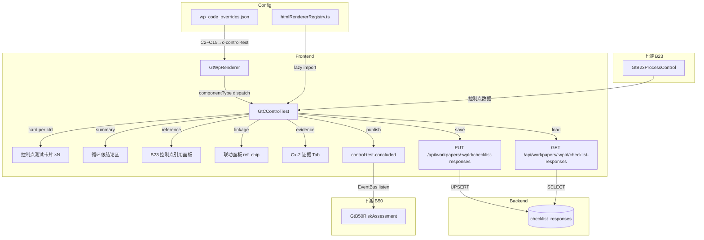

# Design Document — C 类控制测试专属组件

## Overview

本设计将 C2~C15 共 14 个业务循环的控制测试底稿从通用 `d-form-table` 升级为统一的 `GtCControlTest.vue` 专属组件。14 个循环共用同一组件，通过 wpCode prop 区分当前循环上下文。

关键设计决策：
- **零新表**：所有数据通过 `checklist_responses` 表存储，item_id 前缀 `C{n}-` 区分（n=2~15）
- **零新端点**：复用 `PUT/GET /api/workpapers/{wp_id}/checklist-responses` 批量保存
- **注册替换**：在 htmlRendererRegistry 注册 `c-control-test`，wp_code_overrides 映射 C2~C15→`c-control-test`
- **2 Composables**：`useCControlTestData`（数据持久化）+ `useCControlTest`（业务逻辑）
- **卡片式 UI**：每个控制点一张可折叠卡片，内含测试方法+样本列表+结果+偏差统计+结论
- **B23 引用**：从 B23 获取控制点清单作为测试基础
- **EventBus**：发布 `control:test-concluded` 事件至 B50
- **C21 排除**：C21 是控制环境评价（不同用途），不走本组件

## Architecture



### 数据流

1. **打开底稿** → GtWpRenderer 查 wp_code_overrides → 得到 `c-control-test` → 从 registry 加载组件
2. **初始化** → 组件根据 wpCode（C2~C15）提取循环编号 n → 调用 GET checklist-responses 加载 `C{n}-*` 数据
3. **B23 引用** → 调用 GET checklist-responses（B23 底稿）获取对应流程的控制点 或从本地缓存读取
4. **编辑** → 文本字段 debounce 2s / Test_Method、Sample_Result、结论立即保存 → PUT checklist-responses
5. **自动计算** → Sample_Result 变更 → 重算偏差率 → 重算 Control_Point_Conclusion 建议 → 重算 Cycle_Conclusion 建议
6. **联动下游** → Cycle_Conclusion 变更 → EventBus publish `control:test-concluded` → B50 接收
7. **复核** → 全部控制点结论完成 → 现场经理签字 → 全组件只读 → emit `completed`

## Components and Interfaces

### GtCControlTest.vue

```typescript
// Props（标准 contextProps='standard' 模式）
interface Props {
  wpId: string
  projectId: string
  wpCode: string  // C2~C15
  year: number
  readonly?: boolean
}

// Emits
interface Emits {
  (e: 'save'): void
  (e: 'completed'): void
}
```

### 内部组合式函数

```typescript
// composables/useCControlTestData.ts
// 管理数据加载、debounce 保存、即时保存
export function useCControlTestData(wpId: Ref<string>, cycleNum: Ref<number>) {
  return {
    // 响应式数据
    allResponses: Ref<Map<string, ChecklistResponse>>,
    loading: Ref<boolean>,
    saving: Ref<boolean>,
    // 方法
    loadAll(): Promise<void>,
    saveImmediate(items: ChecklistItem[]): Promise<void>,
    saveDebouncedText(item: ChecklistItem): void,
    flushPendingSave(): void,
    // Helper
    getField(itemId: string): ChecklistResponse | undefined,
    setFieldImmediate(itemId: string, data: Partial<ChecklistResponse>): void,
  }
}

// composables/useCControlTest.ts
// 管理控制点卡片、样本CRUD、偏差计算、结论建议、EventBus
export function useCControlTest(
  allResponses: Ref<Map<string, ChecklistResponse>>,
  cycleNum: Ref<number>,
  wpCode: Ref<string>,
  saveImmediate: SaveFn,
  externalReadonly: Ref<boolean>
) {
  return {
    // B23 引用
    b23ControlPoints: Ref<B23ControlPointRef[]>,
    loadB23Reference(): Promise<void>,
    // 控制点卡片管理
    controlPoints: ComputedRef<ControlPointTest[]>,
    expandedCards: Ref<Set<number>>,
    toggleCard(index: number): void,
    expandAll(): void,
    collapseAll(): void,
    addControlPoint(): void,
    removeControlPoint(index: number): void,
    // 测试方法
    setTestMethods(ctrlIndex: number, methods: TestMethod[]): void,
    // 样本管理
    getSamples(ctrlIndex: number): ComputedRef<SampleItem[]>,
    addSample(ctrlIndex: number, sample: Partial<SampleItem>): void,
    removeSample(ctrlIndex: number, sampleIndex: number): void,
    addBatchSamples(ctrlIndex: number, batch: BatchSampleInput): void,
    // 样本结果
    setSampleResult(ctrlIndex: number, sampleIndex: number, result: SampleResult): void,
    setDeviationDescription(ctrlIndex: number, sampleIndex: number, desc: string): void,
    // 偏差计算
    getDeviationStats(ctrlIndex: number): ComputedRef<DeviationStats>,
    // 控制点结论
    suggestPointConclusion(ctrlIndex: number): ComputedRef<ControlPointConclusion | null>,
    setPointConclusion(ctrlIndex: number, conclusion: ControlPointConclusion, overrideReason?: string): void,
    getPointConclusion(ctrlIndex: number): ComputedRef<ControlPointConclusion | null>,
    isPointConclusionOverridden(ctrlIndex: number): ComputedRef<boolean>,
    // 可容忍偏差率
    tolerableDeviationRate: Ref<number>,  // 默认 0.10
    setTolerableRate(rate: number): void,
    // 循环结论
    suggestCycleConclusion: ComputedRef<CycleConclusion | null>,
    cycleConclusion: ComputedRef<CycleConclusion | null>,
    setCycleConclusion(conclusion: CycleConclusion, overrideReason?: string): void,
    isCycleConclusionOverridden: ComputedRef<boolean>,
    // 复核
    isReviewed: ComputedRef<boolean>,
    isReadonly: ComputedRef<boolean>,
    canReview: ComputedRef<boolean>,
    pendingItems: ComputedRef<string[]>,
    reviewInfo: ComputedRef<{ reviewer: string; date: string } | null>,
    doReview(): Promise<void>,
    startAmendment(reason: string): Promise<void>,
    // EventBus
    publishTestConcluded(oldConclusion: CycleConclusion | null, newConclusion: CycleConclusion): void,
    // 联动信息
    linkageInfo: ComputedRef<CControlLinkageInfo>,
    // 循环映射
    cycleName: ComputedRef<string>,
    targetProcedureCycle: ComputedRef<string>,
  }
}
```

### 注册

```typescript
// htmlRendererRegistry.ts — 新增条目
{
  componentType: 'c-control-test',
  component: defineAsyncComponent(() => import('./GtCControlTest.vue')),
  icon: '🧪',
  label: 'C 控制测试',
  emits: ['save', 'completed'],
  contextProps: 'standard',
}
```

### wp_code_overrides.json 变更

```json
"C2": "c-control-test",
"C3": "c-control-test",
"C4": "c-control-test",
"C5": "c-control-test",
"C6": "c-control-test",
"C7": "c-control-test",
"C8": "c-control-test",
"C9": "c-control-test",
"C10": "c-control-test",
"C11": "c-control-test",
"C12": "c-control-test",
"C13": "c-control-test",
"C14": "c-control-test",
"C15": "c-control-test"
```

> 注：C21（控制环境评价）保持原有 d-form-table 渲染，不走本组件。Cx-2（已 skip）由 Evidence_Tab 内嵌渲染。

## Data Models

### 类型定义

```typescript
/** 循环编号（从 wpCode 提取） */
type CycleNumber = 2 | 3 | 4 | 5 | 6 | 7 | 8 | 9 | 10 | 11 | 12 | 13 | 14 | 15

/** 测试方法（多选） */
type TestMethod = '询问' | '观察' | '检查' | '重新执行'

/** 单笔样本测试结果 */
type SampleResult = '有效' | '偏差' | '不适用'

/** 控制点级结论 */
type ControlPointConclusion = '控制有效运行' | '控制存在偏差但可接受' | '控制无效'

/** 循环级整体结论 */
type CycleConclusion = '全部有效' | '部分偏差' | '控制失效'

/** B23 控制点引用 */
interface B23ControlPointRef {
  controlId: string       // B23 控制点编号（如 P1-ctrl-3）
  objective: string       // 控制目标
  description: string     // 控制活动描述
  processName: string     // 所属流程名称
}

/** 样本条目 */
interface SampleItem {
  index: number
  voucherNo: string       // 凭证编号
  date: string            // 日期 YYYY-MM-DD
  amount: string          // 金额
  result: SampleResult | null
  deviationDesc: string   // 偏差描述（result='偏差'时填写）
}

/** 批量添加样本输入 */
interface BatchSampleInput {
  startVoucherNo: string
  endVoucherNo: string
  dateRange?: { start: string; end: string }
}

/** 偏差统计 */
interface DeviationStats {
  totalSamples: number
  effectiveSamples: number   // 总样本 - 不适用样本
  deviationCount: number
  deviationRate: number | null  // null 表示无法计算（分母为0）
  exceedsTolerable: boolean
}

/** 控制点测试卡片数据 */
interface ControlPointTest {
  index: number
  controlId: string        // 控制点编号
  objective: string        // 控制目标（from B23 or 手动）
  testMethods: TestMethod[]
  samples: SampleItem[]
  deviationStats: DeviationStats
  conclusion: ControlPointConclusion | null
  suggestedConclusion: ControlPointConclusion | null
  conclusionOverridden: boolean
  overrideReason: string
  isFromB23: boolean       // 是否从B23引用
}

/** 联动信息 */
interface CControlLinkageInfo {
  b23WpCode: string        // B23 底稿编码
  b23ProcessNum: number    // 对应 B23 流程编号
  b50WpCode: string        // B50 底稿编码
  targetCycleCode: string  // 对应 D~N 程序表编码（DA/EA/...）
  targetCycleName: string  // 对应循环名称
  needsExtendedProcedures: boolean
}

/** EventBus: control:test-concluded 载荷 */
interface TestConcludedPayload {
  wpCode: string           // C2~C15
  cycleName: string        // 循环中文名
  conclusion: CycleConclusion
  deviationSummary: {
    totalControlPoints: number
    effectiveCount: number
    deviationAcceptableCount: number
    ineffectiveCount: number
    maxDeviationRate: number
  }
}

/** 复核状态 */
interface ReviewState {
  reviewed: boolean
  reviewerName: string | null
  reviewDate: string | null
  amendmentReason: string | null
}
```

### 14 循环配置映射

```typescript
/** wpCode → 循环信息映射 */
const CYCLE_CONFIG: Record<number, { name: string; b23ProcessNum: number; targetCycle: string; targetCycleName: string }> = {
  2:  { name: '采购与付款循环', b23ProcessNum: 1, targetCycle: 'DA', targetCycleName: '采购与付款' },
  3:  { name: '销售与收款循环', b23ProcessNum: 2, targetCycle: 'EA', targetCycleName: '销售与收款' },
  4:  { name: '资金管理循环', b23ProcessNum: 3, targetCycle: 'FA', targetCycleName: '资金管理' },
  5:  { name: '生产与存货循环', b23ProcessNum: 4, targetCycle: 'GA', targetCycleName: '生产与存货' },
  6:  { name: '薪酬与人力循环', b23ProcessNum: 5, targetCycle: 'HA', targetCycleName: '薪酬与人力' },
  7:  { name: '固定资产循环', b23ProcessNum: 6, targetCycle: 'IA', targetCycleName: '固定资产' },
  8:  { name: '投资循环', b23ProcessNum: 7, targetCycle: 'JA', targetCycleName: '投资' },
  9:  { name: '其他流程', b23ProcessNum: 8, targetCycle: 'KA', targetCycleName: '其他' },
  10: { name: '收入确认循环', b23ProcessNum: 2, targetCycle: 'EA', targetCycleName: '收入确认' },
  11: { name: '关联方交易循环', b23ProcessNum: 8, targetCycle: 'KA', targetCycleName: '关联方交易' },
  12: { name: '估计与判断循环', b23ProcessNum: 8, targetCycle: 'KA', targetCycleName: '估计与判断' },
  13: { name: '期末财务报告循环', b23ProcessNum: 8, targetCycle: 'KA', targetCycleName: '期末财务报告' },
  14: { name: '信息技术一般控制', b23ProcessNum: 8, targetCycle: 'KA', targetCycleName: 'ITGC' },
  15: { name: '其他特殊控制', b23ProcessNum: 8, targetCycle: 'KA', targetCycleName: '其他特殊' },
}
```

### item_id 命名规范

所有字段使用 `checklist_responses` 表，通过 item_id 前缀 `C{n}-` 区分：

| 区域 | item_id 模式 | conclusion | remark |
|------|-------------|-----------|--------|
| **控制点** | | | |
| 控制点编号 | `C{n}-ctrl-{m}-id` | — | 编号文本 |
| 控制目标 | `C{n}-ctrl-{m}-objective` | — | 目标文本 |
| 测试方法 | `C{n}-ctrl-{m}-methods` | 逗号分隔值 | — |
| 控制点结论 | `C{n}-ctrl-{m}-conclusion` | 控制有效运行/控制存在偏差但可接受/控制无效 | — |
| 结论覆盖标记 | `C{n}-ctrl-{m}-override` | Y/null | 覆盖理由 |
| 控制点数量 | `C{n}-ctrl-count` | — | 数字字符串 |
| **样本** | | | |
| 凭证编号 | `C{n}-ctrl-{m}-sample-{s}-voucher` | — | 凭证号文本 |
| 日期 | `C{n}-ctrl-{m}-sample-{s}-date` | — | YYYY-MM-DD |
| 金额 | `C{n}-ctrl-{m}-sample-{s}-amount` | — | 金额文本 |
| 测试结果 | `C{n}-ctrl-{m}-sample-{s}-result` | 有效/偏差/不适用 | — |
| 偏差描述 | `C{n}-ctrl-{m}-sample-{s}-deviation` | — | 描述文本 |
| 样本数量 | `C{n}-ctrl-{m}-sample-count` | — | 数字字符串 |
| **循环结论** | | | |
| 循环结论 | `C{n}-cycle-conclusion` | 全部有效/部分偏差/控制失效 | — |
| 结论覆盖标记 | `C{n}-cycle-conclusion-override` | Y/null | 覆盖理由 |
| 可容忍偏差率 | `C{n}-tolerable-rate` | — | 数字(0~50) |
| **复核** | | | |
| 复核签字 | `C{n}-review-sign` | Y/null | 复核人姓名 |
| 修改原因 | `C{n}-amend-{k}-reason` | — | 原因文本 |

> `{n}` = 循环编号 2~15；`{m}` = 控制点序号从 1 开始；`{s}` = 样本序号从 1 开始；`{k}` = 修改轮次从 1 开始

### 偏差率计算算法

```typescript
function calculateDeviationStats(samples: SampleItem[]): DeviationStats {
  const totalSamples = samples.length
  const notApplicable = samples.filter(s => s.result === '不适用').length
  const effectiveSamples = totalSamples - notApplicable
  const deviationCount = samples.filter(s => s.result === '偏差').length

  const deviationRate = effectiveSamples > 0
    ? deviationCount / effectiveSamples
    : null  // 无法计算

  return {
    totalSamples,
    effectiveSamples,
    deviationCount,
    deviationRate,
    exceedsTolerable: false,  // 由调用方根据 tolerableDeviationRate 设置
  }
}
```

### Control_Point_Conclusion 自动建议算法

```typescript
function suggestControlPointConclusion(
  deviationRate: number | null,
  tolerableRate: number
): ControlPointConclusion | null {
  if (deviationRate === null) return null  // 无法计算
  if (deviationRate === 0) return '控制有效运行'
  if (deviationRate <= tolerableRate) return '控制存在偏差但可接受'
  return '控制无效'
}
```

### Cycle_Conclusion 自动建议算法

```typescript
function suggestCycleConclusion(
  pointConclusions: (ControlPointConclusion | null)[]
): CycleConclusion | null {
  const evaluated = pointConclusions.filter(c => c !== null)
  if (evaluated.length === 0) return null

  const hasIneffective = evaluated.some(c => c === '控制无效')
  if (hasIneffective) return '控制失效'

  const hasDeviation = evaluated.some(c => c === '控制存在偏差但可接受')
  if (hasDeviation) return '部分偏差'

  return '全部有效'
}
```

### Cycle_Conclusion → B50 影响映射

```typescript
const CYCLE_CONCLUSION_TO_B50_IMPACT: Record<CycleConclusion, string> = {
  '全部有效': '控制风险=低，可依赖控制缩小实质性程序范围',
  '部分偏差': '控制风险=中，部分依赖控制但需扩大关键程序样本',
  '控制失效': '控制风险=高，不可依赖控制，需扩大全部实质性程序范围',
}
```

### 颜色编码

```typescript
const CONTROL_TEST_COLORS = {
  // 控制点结论色
  '控制有效运行': { color: '#52c41a', bg: '#f6ffed' },
  '控制存在偏差但可接受': { color: '#faad14', bg: '#fffbe6' },
  '控制无效': { color: '#ff4d4f', bg: '#fff2f0' },
  // 循环结论色
  '全部有效': { color: '#52c41a', bg: '#f6ffed' },
  '部分偏差': { color: '#faad14', bg: '#fffbe6' },
  '控制失效': { color: '#ff4d4f', bg: '#fff2f0' },
  // 样本结果色
  '有效': { color: '#52c41a', bg: '#f6ffed' },
  '偏差': { color: '#ff4d4f', bg: '#fff2f0' },
  '不适用': { color: '#bfbfbf', bg: '#fafafa' },
}
```

## Correctness Properties

### Property 1: 偏差率计算不变式

*For any* 控制点的样本集合（0~N 条 SampleItem，每条 result ∈ {有效, 偏差, 不适用, null}），`calculateDeviationStats(samples)` SHALL 满足：
- `deviationCount` = samples.filter(result='偏差').length
- `effectiveSamples` = totalSamples - samples.filter(result='不适用').length
- `deviationRate` = effectiveSamples > 0 ? deviationCount / effectiveSamples : null
- 当所有样本 result=null（未填）时，deviationCount=0、deviationRate=null（因为有效样本=0-0=0 无法除）

**Validates: Requirements 6.1, 6.2, 6.4**

### Property 2: Control_Point_Conclusion 自动建议一致性

*For any* deviationRate ∈ [0, 1] ∪ {null} 和 tolerableRate ∈ (0, 0.5]，`suggestControlPointConclusion` SHALL 满足：
- null → null
- 0 → "控制有效运行"
- (0, tolerableRate] → "控制存在偏差但可接受"
- (tolerableRate, 1] → "控制无效"

**Validates: Requirements 7.2, 7.3, 7.4, 7.5**

### Property 3: Cycle_Conclusion 汇总一致性

*For any* 控制点结论列表（0~20 条 ControlPointConclusion | null），`suggestCycleConclusion` SHALL 满足：
- 全 null → null
- 全"控制有效运行" → "全部有效"
- 存在"控制存在偏差但可接受"且无"控制无效" → "部分偏差"
- 存在任一"控制无效" → "控制失效"

**Validates: Requirements 8.2, 8.3, 8.4, 8.5**

### Property 4: EventBus 事件发射正确性

*For any* Cycle_Conclusion 变更操作，系统 SHALL 发布 `control:test-concluded` 事件当且仅当新旧值不同。载荷中 wpCode/cycleName/conclusion/deviationSummary 均正确填充。

**Validates: Requirements 10.1, 10.2, 10.3**

### Property 5: 数据持久化往返一致性

*For any* 有效的 C{n}- 前缀数据（控制点+样本+结果+结论），PUT 保存后 GET 加载，所有字段值 SHALL 与保存前一致。

**Validates: Requirements 12.1, 12.5, 12.6**

### Property 6: item_id 命名唯一性

*For any* (cycleNum × ctrlIndex × sampleIndex × fieldType) 组合，生成的 item_id SHALL 唯一且确定。不同业务含义→不同 item_id；相同业务含义→相同 item_id。

**Validates: Requirements 12.7**

### Property 7: 复核前置条件完备性

*For any* 控制点状态组合，`canReview` SHALL 为 true 当且仅当：所有控制点均有 Control_Point_Conclusion 且 Cycle_Conclusion 已选择。

**Validates: Requirements 13.2**

### Property 8: 后端白名单校验正确性

*For any* item_id 以 `C{n}-`（n=2~15）开头的保存请求，conclusion 值在白名单内→200，不在白名单内→422。

**Validates: Requirements 14.1, 14.2, 14.3, 14.4**

## Error Handling

| 场景 | 行为 |
|------|------|
| PUT 保存失败（网络/500） | ElMessage.error('保存失败')，保留本地数据不回滚 |
| GET 加载失败 | ElMessage.warning('数据加载失败')，表单保持空白可编辑状态 |
| B23 引用加载失败 | 显示"无法获取B23控制点，请手动添加"提示，允许手动新增 |
| 复核时前置条件不满足 | 签字按钮禁用 + 显示待完成事项清单 |
| Amendment 原因为空 | 拒绝提交，显示校验错误 |
| 手动覆盖结论无理由 | 拒绝覆盖操作，提示"需填写调整理由" |
| conclusion 值不在白名单 | 后端 422，前端显示校验错误 |
| EventBus 发布失败 | console.warn，不影响本组件保存 |
| 组件卸载时保存失败 | 静默失败，下次打开从后端加载 |
| 样本数量达上限 | 单控制点最多 50 笔样本，达上限后"新增"按钮禁用 |
| 控制点数量达上限 | 单循环最多 30 个控制点，达上限提示 |

### 后端 conclusion 白名单扩展

在 `checklist_responses.py` 现有分支后新增 C{n}- 前缀分支：

```python
elif item.item_id.startswith(tuple(f"C{n}-" for n in range(2, 16))):
    # C2~C15 控制测试：控制点结论 + 样本结果 + 循环结论 + 测试方法 + 签字标记
    allowed = (
        "控制有效运行", "控制存在偏差但可接受", "控制无效",       # ControlPointConclusion
        "有效", "偏差", "不适用",                                 # SampleResult
        "全部有效", "部分偏差", "控制失效",                       # CycleConclusion
        "询问", "观察", "检查", "重新执行",                       # TestMethod
        "Y", "N",                                                  # 签字/标记
    )
    if item.conclusion and item.conclusion not in allowed:
        raise HTTPException(
            status_code=422,
            detail=f"C控制测试 conclusion 值无效，收到: '{item.conclusion}'",
        )
```

## Testing Strategy

### Property-Based Testing（fast-check，前端）

测试文件路径：
```
audit-platform/frontend/src/components/workpaper/__tests__/cControlTest.property.spec.ts
```

| Property | 测试内容 | 生成器 |
|----------|---------|--------|
| 1 | 偏差率计算不变式 | 随机 N 条样本(0~50) × 随机 SampleResult → 验证计算公式 |
| 2 | 控制点结论建议一致性 | 随机 deviationRate(0~1) × 随机 tolerableRate(0.01~0.5) → 验证阈值规则 |
| 3 | 循环结论汇总一致性 | 随机 N 个控制点结论(0~30) → 验证优先级规则 |
| 4 | EventBus 事件发射正确性 | 随机新旧 conclusion → 验证仅在不同时发射 |
| 5 | item_id 唯一性 | 随机 cycleNum(2~15) × ctrlIndex(1~30) × sampleIndex(1~50) × field → 验证无碰撞 |
| 6 | 数据往返一致性 | 随机 C{n}- item_id + 合法 conclusion + 随机 remark → PUT → GET → 一致 |
| 7 | 复核前置条件 | 随机控制点完成度 × 随机 cycleConclusion → 验证 canReview 条件 |
| 8 | 白名单校验 | 随机 C{n}- item_id + 随机 conclusion（合法/非法）→ 验证 200/422 |

### Unit Tests（vitest，前端）

测试文件路径：
```
audit-platform/frontend/src/components/workpaper/__tests__/cControlTest.spec.ts
```

覆盖：
- 组件注册正确性（registry 包含 `c-control-test`）
- wp_code_overrides 映射（C2~C15→c-control-test）
- wpCode 解析循环编号
- B23 引用面板渲染 + 手动添加控制点
- 控制点卡片渲染 + 展开/收起
- 测试方法多选交互 + 即时保存
- 样本 CRUD + 批量添加
- 样本结果选择 + 偏差描述展开
- 偏差率实时计算 + 超限警告
- 控制点结论自动建议 + 手动覆盖需理由
- 循环结论汇总 + 手动覆盖
- 联动面板 ref_chip + "需扩大实质性程序"提示
- Evidence_Tab 渲染
- debounce 2s / 即时保存行为
- readonly 模式全交互禁用
- 复核签字 + emit completed
- Amendment 流程
- 打印样式类存在性

### 后端 PBT（hypothesis）

测试文件路径：
```
backend/tests/test_c_control_test_pbt.py
```

覆盖：
- Property 5: round-trip（C{n}- item_id + conclusion → PUT → GET → 一致）
- Property 8: 白名单校验（合法/非法 conclusion → 200/422）
