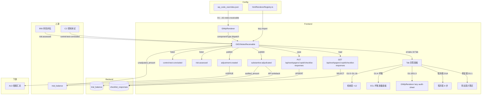

# Design Document — D1 应收票据专属组件

## Overview

本设计将 D1 应收票据审定表从通用 `d-form-table`/`audit-sheet` 渲染升级为专属 `GtD1NotesReceivable.vue` 组件。21 个 sheet 聚合为统一 Tab 入口，提供审定表联动计算、ECL 预期信用损失模型、贴息公式、监盘倒推、背书贴现终止确认等应收票据全流程审计能力。

关键设计决策：
- **零新表**：所有数据通过 `checklist_responses` 表存储，item_id 前缀 `D1-` 区分
- **零新端点**：复用 `PUT/GET /api/workpapers/{wp_id}/checklist-responses` 批量保存
- **注册替换**：在 htmlRendererRegistry 注册 `d1-notes-receivable`，wp_code_overrides 映射 D1→`d1-notes-receivable`，D1-1/D1-4→`skip`，D1-2/D1-3 保留 `audit-sheet`
- **3 Composables**：`useD1FormData`（数据层）+ `useD1NotesReceivable`（核心逻辑）+ `useD1Review`（复核）
- **Tab 式 UI**：21 sheet 通过 el-tabs 统一入口，分 18 个 Tab（附注合并为 1 个 Tab 带子切换）
- **子底稿 lazy**：D1-2/D1-3 用 GtWpRenderer 懒加载（audit-sheet 模式）
- **EventBus 联动**：发布 `substantive:adjudicated` + `adjustment:created`，监听 `risk:assessed` + `control:test-concluded`
- **审定表公式**：跨 sheet 引用 D1-2/D1-4 数据，自动计算审定数，回写 trial_balance
- **ECL 模型**：迁徙率法 + 个别认定双模式
- **贴息公式**：P × R × D / 360
- **监盘倒推**：盘点日余额 + 期间增减 = 资产负债表日余额

## Architecture



### 数据流

1. **打开底稿** → GtWpRenderer 查 wp_code_overrides → 得到 `d1-notes-receivable` → 从 registry 加载组件
2. **初始化** → 调用 GET checklist-responses 加载 `D1-*` 数据 + 从 trial_balance 获取未审数初始值
3. **审定表引用** → 从 D1-2（audit-sheet 子底稿）读取原值数据 + 从 D1-4（坏账面板）读取坏账准备数据 → 自动填充审定表对应单元格
4. **编辑** → 文本字段 debounce 2s / 结论/状态/选择类字段立即保存 → PUT checklist-responses
5. **审定数计算** → 未审数 + AJE + RJE → 审定数 → 发布 `substantive:adjudicated` → API 回写 trial_balance
6. **ECL 计算** → 迁徙率矩阵 → 预期损失率 → 各账龄段应计提 → 差异对比 → 高亮超过重要性水平
7. **联动上游** → 监听 B50 `risk:assessed` → 程序表显示风险标识；监听 C2 `control:test-concluded` → 程序表提示
8. **复核** → 全部必要步骤完成 → 现场经理签字 → 全组件只读 → emit `completed`

## Components and Interfaces

### GtD1NotesReceivable.vue

```typescript
// Props（标准 contextProps='standard' 模式）
interface Props {
  wpId: string
  projectId: string
  wpCode: string  // "D1"
  year: number
  readonly?: boolean
}

// Emits
interface Emits {
  (e: 'save'): void
  (e: 'completed'): void
}
```

### 内部组合式函数

```typescript
// composables/useD1FormData.ts
// 数据层：加载/保存 checklist_responses
export function useD1FormData(wpId: Ref<string>) {
  return {
    // 响应式数据
    allResponses: Ref<Map<string, ChecklistResponse>>,
    loading: Ref<boolean>,
    saving: Ref<boolean>,
    // 方法
    loadAll(): Promise<void>,
    saveImmediate(items: ChecklistItem[]): Promise<void>,
    saveDebouncedText(item: ChecklistItem): void,
    flushPendingSave(): void,
    // Helper
    getField(itemId: string): ChecklistResponse | undefined,
    setFieldImmediate(itemId: string, data: Partial<ChecklistResponse>): void,
    // trial_balance 回写
    writebackTrialBalance(accountCode: string, auditedAmount: number): Promise<void>,
    // 子底稿 D1-2/D1-3 数据读取
    loadSubWorkpaperData(subWpCode: string): Promise<Record<string, string | number>>,
  }
}

// composables/useD1NotesReceivable.ts
// 核心逻辑：审定表计算、ECL、程序表、联动
export function useD1NotesReceivable(
  allResponses: Ref<Map<string, ChecklistResponse>>,
  wpId: Ref<string>,
  projectId: Ref<string>,
  year: Ref<number>,
  saveImmediate: SaveFn,
  externalReadonly: Ref<boolean>
) {
  return {
    // === Tab 管理 ===
    activeTab: Ref<string>,
    tabCompletionStatus: ComputedRef<Map<string, TabStatus>>,
    setActiveTab(tab: string): void,

    // === 审定表 D1-1 ===
    adjudicationRows: ComputedRef<AdjudicationRow[]>,
    getAuditedAmount(rowKey: string): ComputedRef<number>,
    getChangeRate(rowKey: string): ComputedRef<number | null | ''>,
    crossSheetValues: ComputedRef<CrossSheetRefValues>,
    refreshCrossSheetData(): Promise<void>,
    // 调整分录
    adjustmentEntries: ComputedRef<AdjustmentEntry[]>,
    addAdjustment(entry: Partial<AdjustmentEntry>): void,
    removeAdjustment(index: number): void,
    updateAdjustment(index: number, data: Partial<AdjustmentEntry>): void,
    ajeTotal: ComputedRef<number>,
    rjeTotal: ComputedRef<number>,

    // === 程序表 D1A ===
    procedureSteps: ComputedRef<ProcedureStep[]>,
    setProcedureStatus(stepIndex: number, status: ProcedureStatus): void,
    setProcedureConclusion(stepIndex: number, conclusion: string): void,
    procedureProgress: ComputedRef<{ completed: number; total: number }>,
    canInputOverallConclusion: ComputedRef<boolean>,
    overallConclusion: Ref<string>,
    riskIndicators: Ref<Map<number, RiskIndicator>>,

    // === ECL 坏账准备 D1-4 ===
    eclMethod: Ref<EclMethod>,
    agingBands: ComputedRef<AgingBand[]>,
    migrationRateMatrix: Ref<MigrationRateRow[]>,
    calculateExpectedLossRate(bandIndex: number): ComputedRef<number>,
    calculateProvision(bandIndex: number): ComputedRef<number>,
    calculateDifference(bandIndex: number): ComputedRef<number>,
    isDifferenceExceedsMateriality(bandIndex: number): ComputedRef<boolean>,
    eclSummary: ComputedRef<EclSummary>,

    // === 业务模式 D1-6 ===
    maturityAnalysis: ComputedRef<MaturityGroup[]>,
    sppiTestResult: Ref<'Y' | 'N' | null>,
    businessModelChoice: Ref<BusinessModelType | null>,
    suggestedClassification: ComputedRef<string | null>,
    hasOverdue90Plus: ComputedRef<boolean>,

    // === 背书贴现 D1-8 ===
    endorsementItems: ComputedRef<EndorsementItem[]>,
    addEndorsement(item: Partial<EndorsementItem>): void,
    removeEndorsement(index: number): void,
    endorsementSummary: ComputedRef<EndorsementSummary>,

    // === 贴息 D1-9 ===
    discountInterestItems: ComputedRef<DiscountInterestItem[]>,
    calculateInterest(p: number, r: number, d: number): number,  // P×R×D/360

    // === 监盘 D1-10 ===
    inventoryReconciliation: ComputedRef<InventoryReconciliation>,
    calculateBSDateBalance(countBalance: number, additions: number, deductions: number): number,
    inventoryDifference: ComputedRef<number>,

    // === 质押 D1-12 ===
    pledgeItems: ComputedRef<PledgeItem[]>,
    pledgeTotalAmount: ComputedRef<number>,
    pledgeRatio: ComputedRef<number>,
    isPledgeRatioWarning: ComputedRef<boolean>,

    // === 关联方 D1-11 ===
    relatedPartyItems: ComputedRef<RelatedPartyItem[]>,
    matchedRelatedParties: ComputedRef<string[]>,

    // === 附注披露 ===
    disclosureTemplate: ComputedRef<'listed' | 'soe' | 'general'>,
    disclosureItems: ComputedRef<DisclosureCheckItem[]>,
    hasUndisclosedItems: ComputedRef<boolean>,

    // === EventBus ===
    publishAdjudicated(accountCode: string, auditedAmount: number): void,
    publishAdjustmentCreated(entry: AdjustmentEntry): void,
    onRiskAssessed(handler: (payload: RiskAssessedPayload) => void): void,
    onControlTestConcluded(handler: (payload: TestConcludedPayload) => void): void,

    // === 联动面板 ===
    linkageRefs: ComputedRef<LinkageRef[]>,
  }
}

// composables/useD1Review.ts
// 复核签字/只读/amendment
export function useD1Review(
  allResponses: Ref<Map<string, ChecklistResponse>>,
  procedureProgress: ComputedRef<{ completed: number; total: number }>,
  canInputOverallConclusion: ComputedRef<boolean>,
  saveImmediate: SaveFn,
  externalReadonly: Ref<boolean>
) {
  return {
    isReviewed: ComputedRef<boolean>,
    isReadonly: ComputedRef<boolean>,
    canReview: ComputedRef<boolean>,
    pendingItems: ComputedRef<string[]>,
    reviewInfo: ComputedRef<{ reviewer: string; date: string } | null>,
    doReview(): Promise<void>,
    startAmendment(reason: string): Promise<void>,
  }
}
```

### 注册

```typescript
// htmlRendererRegistry.ts — 新增条目
{
  componentType: 'd1-notes-receivable',
  component: defineAsyncComponent(() => import('./GtD1NotesReceivable.vue')),
  icon: '📄',
  label: 'D1 应收票据',
  emits: ['save', 'completed'],
  contextProps: 'standard',
}
```

### wp_code_overrides.json 变更

```json
"D1": "d1-notes-receivable",
"D1-1": "skip",
"D1-2": "audit-sheet",
"D1-3": "audit-sheet",
"D1-4": "skip"
```

> 注：D1-2/D1-3 保留 `audit-sheet`，作为子底稿通过 GtWpRenderer 懒加载嵌入 Tab。D1-1/D1-4 改为 `skip`，由主组件统一渲染审定表和坏账准备面板。

## Data Models

### 类型定义

```typescript
/** 程序表步骤状态 */
type ProcedureStatus = '未开始' | '执行中' | '已完成' | '不适用'

/** ECL 方法 */
type EclMethod = '组合评估' | '个别认定'

/** 业务模式分类 */
type BusinessModelType =
  | '以摊余成本计量'
  | '以公允价值计量且变动计入其他综合收益'
  | '以公允价值计量且变动计入当期损益'

/** 终止确认判断 */
type DerecognitionResult = '终止确认' | '不终止确认'

/** 披露检查结论 */
type DisclosureConclusion = '已披露且准确' | '已披露但需修改' | '未披露需补充' | '不适用'

/** 检查表结论 */
type CheckConclusion = '符合' | '不符合' | '不适用'

/** Tab 完成状态 */
type TabStatus = 'completed' | 'in-progress' | 'not-started'

/** 调整分录类型 */
type AdjustmentType = 'AJE' | 'RJE'

/** 审定表行 */
interface AdjudicationRow {
  rowKey: string               // 如 'bank-acceptance', 'commercial-acceptance', 'bad-debt', 'book-value'
  label: string                // 中文行标签
  priorPeriod: number          // 期初未审数 (B)
  currentUnadjusted: number    // 期末未审数 (C)
  periodChange: number         // 本期变动 (D) = C - B
  ajeDebit: number             // AJE 借方 (E)
  ajeCredit: number            // AJE 贷方 (F)
  rjeDebit: number             // RJE 借方 (G)
  rjeCredit: number            // RJE 贷方 (H)
  auditedAmount: number        // 审定数 (I) = C + E - F + G - H
  changeRate: number | null | ''  // 变动率 (K)
  isFromCrossSheet: boolean    // 是否从子 sheet 引用
}

/** 跨 sheet 引用值 */
interface CrossSheetRefValues {
  // D1-2 原值明细表（按类别）
  d12_B14: number  // 银行承兑汇票-期初
  d12_C14: number  // 银行承兑汇票-期末
  d12_D14: number  // 银行承兑汇票-变动
  d12_B13: number  // 商业承兑汇票-期初
  d12_C13: number  // 商业承兑汇票-期末
  d12_D13: number  // 商业承兑汇票-变动
  // D1-4 坏账准备明细表
  d14_B23: number  // 坏账准备-期初
  d14_C23: number  // 坏账准备-期末
}

/** 程序表步骤 */
interface ProcedureStep {
  stepOrder: number            // 1~8
  stepName: string             // 步骤名称
  description: string          // 描述
  status: ProcedureStatus
  executor: string             // 执行人
  executeDate: string          // 执行日期
  wpIndexRef: string           // 工作底稿索引
  findings: string             // 审计发现
  conclusion: string           // 结论
  isRequired: boolean          // 是否必要步骤
  relatedTab: string | null    // 关联 Tab 名称（ref_chip 跳转）
}

/** 风险标识（来自 B50） */
interface RiskIndicator {
  level: 'H' | 'M' | 'L'
  description: string
}

/** 账龄段（ECL 坏账准备） */
interface AgingBand {
  bandKey: string              // 如 'not-overdue', 'overdue-1-30', 'overdue-31-90', 'overdue-91-180', 'overdue-181-365', 'overdue-1year'
  label: string                // 中文标签
  priorBalance: number         // 期初余额
  currentProvision: number     // 本期计提
  currentReversal: number      // 本期转回
  currentWriteOff: number      // 本期核销
  endBalance: number           // 期末余额
  expectedLossRate: number     // 预期损失率
  shouldProvision: number      // 应计提金额 = endBalance × expectedLossRate
  actualProvision: number      // 被审计单位实际计提
  difference: number           // 差异 = actualProvision - shouldProvision
}

/** 迁徙率矩阵行 */
interface MigrationRateRow {
  fromBand: string             // 起始账龄段
  toBand: string               // 目标账龄段
  year1Rate: number            // 第1年迁徙率
  year2Rate: number            // 第2年迁徙率
  year3Rate: number            // 第3年迁徙率
  averageRate: number          // 平均迁徙率
}

/** ECL 汇总 */
interface EclSummary {
  totalEndBalance: number
  totalShouldProvision: number
  totalActualProvision: number
  totalDifference: number
  exceedsMateriality: boolean
}

/** 到期分析分组 */
interface MaturityGroup {
  groupKey: string             // 'not-overdue', 'overdue-30', 'overdue-31-90', 'overdue-90-plus'
  label: string
  amount: number
  percentage: number           // 占总额比例
}

/** 背书贴现明细 */
interface EndorsementItem {
  index: number
  noteNo: string               // 票据编号
  drawer: string               // 出票人
  amount: number               // 金额
  maturityDate: string         // 到期日
  endorseDate: string          // 背书/贴现日期
  transferee: string           // 受让人
  derecognition: DerecognitionResult | null  // 终止确认判断
  remark: string
}

/** 背书贴现汇总 */
interface EndorsementSummary {
  endorsedNotMatured: number   // 已背书未到期合计
  discountedNotMatured: number // 已贴现未到期合计
  derecognizedAmount: number   // 终止确认金额
  notDerecognizedAmount: number // 不终止确认金额
}

/** 贴息检查项 */
interface DiscountInterestItem {
  index: number
  discountAmount: number       // 贴现金额 (P)
  discountRate: number         // 贴现率 (R)
  discountDays: number         // 贴现天数 (D)
  auditeeInterest: number     // 被审计单位贴息
  auditorInterest: number     // 审计师复核贴息 = P×R×D/360
  difference: number           // 差异
}

/** 监盘倒推 */
interface InventoryReconciliation {
  countDate: string            // 盘点日期
  countLocation: string        // 盘点地点
  countBalance: number         // 盘点日余额
  additions: number            // 期间增加
  deductions: number           // 期间减少
  bsDateBalance: number        // 资产负债表日余额 = countBalance + additions - deductions
  bookBalance: number          // 账面余额
  difference: number           // 差异 = bookBalance - bsDateBalance
}

/** 质押项 */
interface PledgeItem {
  index: number
  noteNo: string
  amount: number
  pledgee: string              // 质押对象
  purpose: string              // 质押用途
  releaseDate: string          // 解质押日期
  isRestricted: boolean        // 是否限制性资产
}

/** 关联方交易项 */
interface RelatedPartyItem {
  index: number
  partyName: string            // 关联方名称
  relationType: string         // 关系类型
  transactionAmount: number    // 交易金额
  noteNo: string               // 票据编号
  isNormalTerms: boolean       // 是否正常商业条款
  remark: string
}

/** 附注披露检查项 */
interface DisclosureCheckItem {
  index: number
  checkItem: string            // 检查事项
  conclusion: DisclosureConclusion | null
  remark: string
}

/** 调整分录 */
interface AdjustmentEntry {
  index: number
  type: AdjustmentType         // AJE / RJE
  debitAccount: string         // 借方科目
  creditAccount: string        // 贷方科目
  amount: number               // 金额
  description: string          // 摘要
  isPushedToAdjTable: boolean  // 是否已过入审定表
}

/** 联动引用（ref_chip） */
interface LinkageRef {
  label: string                // 显示文本
  targetWpCode: string         // 目标底稿编码
  icon: string                 // 图标
}

/** EventBus: substantive:adjudicated 载荷 */
interface SubstantiveAdjudicatedPayload {
  wpCode: string               // "D1"
  accountCode: string          // 应收票据科目编码
  auditedAmount: number        // 审定数
  priorAmount: number          // 期初数
  changeRate: number | null    // 变动率
}

/** EventBus: adjustment:created 载荷 */
interface AdjustmentCreatedPayload {
  wpCode: string               // "D1"
  entryType: AdjustmentType
  debitAccount: string
  creditAccount: string
  amount: number
  description: string
}

/** 复核状态 */
interface ReviewState {
  reviewed: boolean
  reviewerName: string | null
  reviewDate: string | null
  amendmentReason: string | null
}
```

### item_id 命名规范

所有字段使用 `checklist_responses` 表，通过 item_id 前缀 `D1-` 区分：

| 区域 | item_id 模式 | conclusion | remark |
|------|-------------|-----------|--------|
| **程序表 D1A** | | | |
| 步骤状态 | `D1-proc-{n}-status` | 未开始/执行中/已完成/不适用 | — |
| 步骤执行人 | `D1-proc-{n}-executor` | — | 执行人姓名 |
| 步骤日期 | `D1-proc-{n}-date` | — | YYYY-MM-DD |
| 步骤结论 | `D1-proc-{n}-conclusion` | — | 结论文本 |
| 步骤发现 | `D1-proc-{n}-findings` | — | 发现文本 |
| 底稿索引 | `D1-proc-{n}-wpindex` | — | 底稿索引号 |
| 整体结论 | `D1-proc-overall` | — | 整体结论文本 |
| **审定表 D1-1** | | | |
| 未审数-期初 | `D1-adj-{row}-prior` | — | 金额字符串 |
| 未审数-期末 | `D1-adj-{row}-current` | — | 金额字符串 |
| AJE 借方 | `D1-adj-{row}-aje-dr` | — | 金额字符串 |
| AJE 贷方 | `D1-adj-{row}-aje-cr` | — | 金额字符串 |
| RJE 借方 | `D1-adj-{row}-rje-dr` | — | 金额字符串 |
| RJE 贷方 | `D1-adj-{row}-rje-cr` | — | 金额字符串 |
| **坏账准备 D1-4** | | | |
| ECL 方法 | `D1-ecl-method` | 组合评估/个别认定 | — |
| 账龄段余额 | `D1-ecl-{band}-balance` | — | 金额 |
| 预期损失率 | `D1-ecl-{band}-rate` | — | 百分比(0~100) |
| 实际计提 | `D1-ecl-{band}-actual` | — | 金额 |
| 迁徙率 | `D1-ecl-migration-{from}-{to}-y{k}` | — | 比例 |
| **调整分录 D1-5** | | | |
| 分录类型 | `D1-entry-{n}-type` | AJE/RJE | — |
| 借方科目 | `D1-entry-{n}-debit` | — | 科目名称 |
| 贷方科目 | `D1-entry-{n}-credit` | — | 科目名称 |
| 金额 | `D1-entry-{n}-amount` | — | 金额字符串 |
| 摘要 | `D1-entry-{n}-desc` | — | 摘要文本 |
| 分录数量 | `D1-entry-count` | — | 数字字符串 |
| **业务模式 D1-6** | | | |
| SPPI 结果 | `D1-sppi-result` | Y/N | — |
| 业务模式 | `D1-biz-model` | 以摊余成本计量/以公允价值计量且变动计入其他综合收益/以公允价值计量且变动计入当期损益 | — |
| 到期分组金额 | `D1-maturity-{group}-amount` | — | 金额 |
| **背书贴现 D1-8** | | | |
| 条目字段 | `D1-endorse-{n}-{field}` | 终止确认/不终止确认 | 字段值 |
| 条目数量 | `D1-endorse-count` | — | 数字字符串 |
| **贴息 D1-9** | | | |
| 贴息字段 | `D1-interest-{n}-{field}` | — | 数值 |
| 条目数量 | `D1-interest-count` | — | 数字字符串 |
| **监盘 D1-10** | | | |
| 监盘字段 | `D1-inventory-{field}` | — | 值 |
| **关联方 D1-11** | | | |
| 条目字段 | `D1-rp-{n}-{field}` | — | 值 |
| 条目数量 | `D1-rp-count` | — | 数字字符串 |
| **质押 D1-12** | | | |
| 条目字段 | `D1-pledge-{n}-{field}` | — | 值 |
| 条目数量 | `D1-pledge-count` | — | 数字字符串 |
| **检查表 D1-13** | | | |
| 检查项结论 | `D1-check-{n}-conclusion` | 符合/不符合/不适用 | — |
| 检查项备注 | `D1-check-{n}-remark` | — | 文本 |
| **ECL 政策 D1-14** | | | |
| 政策检查项 | `D1-policy-{n}-conclusion` | 符合/不符合/不适用 | — |
| **ECL 测试 D1-15** | | | |
| 测试数据 | `D1-ecltest-{field}` | — | 数值 |
| **转回核销 D1-16** | | | |
| 检查项 | `D1-writeoff-{n}-conclusion` | 符合/不符合/不适用 | — |
| **附注披露** | | | |
| 上市公司检查 | `D1-disc-listed-{n}` | 已披露且准确/已披露但需修改/未披露需补充/不适用 | — |
| 国企检查 | `D1-disc-soe-{n}` | 已披露且准确/已披露但需修改/未披露需补充/不适用 | — |
| **复核** | | | |
| 复核签字 | `D1-review-sign` | Y/null | 复核人姓名 |
| 复核日期 | `D1-review-date` | — | YYYY-MM-DD |
| 修改原因 | `D1-amend-{k}-reason` | — | 原因文本 |

> `{n}` = 序号从 1 开始；`{row}` = 审定表行标识（bank-accept/comm-accept/bad-debt/book-value）；`{band}` = 账龄段标识；`{field}` = 条目内字段名；`{k}` = 修改轮次

### 核心计算算法

#### 审定数计算

```typescript
/**
 * 审定数 = 期末未审数 + AJE借方 - AJE贷方 + RJE借方 - RJE贷方
 * 适用于资产类科目（应收票据为借方科目）
 */
function calculateAuditedAmount(row: AdjudicationRow): number {
  return row.currentUnadjusted + row.ajeDebit - row.ajeCredit + row.rjeDebit - row.rjeCredit
}

/**
 * 变动率计算（审定数相对期初变动）
 * - 期初=0 且 审定数=0 → '' (空，无意义)
 * - 期初=0 且 审定数≠0 → 1 (100%，从无到有)
 * - 其他 → (审定数 - 期初) / 期初
 */
function calculateChangeRate(priorPeriod: number, auditedAmount: number): number | null | '' {
  if (priorPeriod === 0 && auditedAmount === 0) return ''
  if (priorPeriod === 0) return 1
  return (auditedAmount - priorPeriod) / priorPeriod
}
```

#### ECL 迁徙率法

```typescript
/**
 * 迁徙率法计算预期损失率
 * 最终损失率 = 各阶段平均迁徙率连乘
 * 例：未逾期→30天(5%) × 30→90天(20%) × 90→180天(40%) × 180→365天(60%) × >1年(80%)
 *   = 0.05 × 0.20 × 0.40 × 0.60 × 0.80 = 0.192%
 */
function calculateMigrationLossRate(migrationRates: number[]): number {
  if (migrationRates.length === 0) return 0
  return migrationRates.reduce((acc, rate) => acc * rate, 1)
}

/**
 * 各账龄段应计提金额
 */
function calculateProvisionAmount(balance: number, lossRate: number): number {
  return balance * lossRate
}

/**
 * 差异 = 被审计单位实际计提 - 审计师测算应计提
 */
function calculateEclDifference(actualProvision: number, shouldProvision: number): number {
  return actualProvision - shouldProvision
}
```

#### 贴息公式

```typescript
/**
 * 贴息 = 贴现金额(P) × 贴现率(R) × 贴现天数(D) / 360
 * P ≥ 0, R ∈ [0, 1], D ≥ 0
 */
function calculateDiscountInterest(p: number, r: number, d: number): number {
  return p * r * d / 360
}
```

#### 监盘倒推

```typescript
/**
 * 资产负债表日余额 = 盘点日余额 + 期间增加 - 期间减少
 * 差异 = 账面余额 - 倒推余额
 */
function calculateBSDateBalance(countBalance: number, additions: number, deductions: number): number {
  return countBalance + additions - deductions
}
```

#### 程序表完成度判断

```typescript
/**
 * 复核前置条件：所有 is_required=true 的步骤 status 为 '已完成' 或 '不适用'
 */
function canReview(steps: ProcedureStep[]): boolean {
  return steps
    .filter(s => s.isRequired)
    .every(s => s.status === '已完成' || s.status === '不适用')
}

/**
 * 进度统计
 */
function calculateProgress(steps: ProcedureStep[]): { completed: number; total: number } {
  const total = steps.length
  const completed = steps.filter(s => s.status === '已完成' || s.status === '不适用').length
  return { completed, total }
}
```

#### Tab 完成状态判定

```typescript
/**
 * Tab 完成状态：
 * - completed: 所有必填项已填且有结论
 * - in-progress: 存在已填项但未全部完成
 * - not-started: 无任何数据
 */
function getTabStatus(tabResponses: ChecklistResponse[]): TabStatus {
  if (tabResponses.length === 0) return 'not-started'
  const hasConclusionOrValue = tabResponses.some(r => r.conclusion || r.remark)
  if (!hasConclusionOrValue) return 'not-started'
  const allComplete = tabResponses.every(r => r.conclusion || r.remark)
  return allComplete ? 'completed' : 'in-progress'
}
```

#### 业务模式分类建议

```typescript
/**
 * SPPI 通过 + 以收取合同现金流量为目标 → 建议以摊余成本计量
 */
function suggestClassification(
  sppiResult: 'Y' | 'N' | null,
  businessModel: BusinessModelType | null
): string | null {
  if (sppiResult === null || businessModel === null) return null
  if (sppiResult === 'Y' && businessModel === '以摊余成本计量') {
    return '分类正确：以摊余成本计量的金融资产'
  }
  if (sppiResult === 'N') {
    return '注意：SPPI 测试未通过，应以公允价值计量'
  }
  return null
}
```

### 跨 sheet 公式映射（源模板对照）

| 审定表 D1-1 单元格 | 引用来源 | 含义 |
|-------------------|---------|------|
| B8 | D1-2!B14 | 银行承兑汇票原值-期初 |
| C8 | D1-2!C14 | 银行承兑汇票原值-期末 |
| D8 | D1-2!D14 | 银行承兑汇票原值-变动 |
| B9 | D1-2!B13 | 商业承兑汇票原值-期初 |
| C9 | D1-2!C13 | 商业承兑汇票原值-期末 |
| D9 | D1-2!D13 | 商业承兑汇票原值-变动 |
| B12 | D1-4!B23 | 坏账准备-期初 |
| C12 | D1-4!C23 | 坏账准备-期末 |

### 颜色编码

```typescript
const D1_STATUS_COLORS = {
  // Tab 完成状态
  'completed': { color: '#52c41a', icon: '✓' },
  'in-progress': { color: '#1890ff', icon: '●' },
  'not-started': { color: '#bfbfbf', icon: '○' },
  // 差异警告
  'exceeds-materiality': { color: '#ff4d4f', bg: '#fff2f0' },
  'within-tolerance': { color: '#52c41a', bg: '#f6ffed' },
  // 程序步骤
  '已完成': { color: '#52c41a', bg: '#f6ffed' },
  '执行中': { color: '#1890ff', bg: '#e6f7ff' },
  '未开始': { color: '#bfbfbf', bg: '#fafafa' },
  '不适用': { color: '#8c8c8c', bg: '#f5f5f5' },
  // 风险标识
  'H': { color: '#ff4d4f', label: '高风险' },
  'M': { color: '#faad14', label: '中风险' },
  'L': { color: '#52c41a', label: '低风险' },
}
```

## Correctness Properties

*A property is a characteristic or behavior that should hold true across all valid executions of a system—essentially, a formal statement about what the system should do. Properties serve as the bridge between human-readable specifications and machine-verifiable correctness guarantees.*

### Property 1: 审定表公式计算不变式

*For any* 审定表行的期末未审数(C)、AJE借方(E)、AJE贷方(F)、RJE借方(G)、RJE贷方(H)值组合（均为非负实数），审定数(I) SHALL 始终等于 `C + E - F + G - H`。变动率(K) SHALL 满足三分支逻辑：期初=0且审定数=0→空字符串、期初=0且审定数≠0→1、其他→(审定数-期初)/期初。

**Validates: Requirements 3.5, 3.6**

### Property 2: 跨 sheet 引用一致性

*For any* 源 sheet 单元格值（D1-2 的 B14/C14/D14/B13/C13/D13 和 D1-4 的 B23/C23），审定表 D1-1 对应目标单元格（B8/C8/D8/B9/C9/D9/B12/C12）SHALL 始终等于源值。当源值变更时，目标值必须同步更新，引用值与源值始终相等。

**Validates: Requirements 3.2, 3.3, 3.4, 3.9**

### Property 3: ECL 迁徙率法计算正确性

*For any* 账龄段余额（≥0）和迁徙率矩阵（各阶段迁徙率 ∈ [0, 1]），预期损失率 SHALL 等于各阶段平均迁徙率连乘。应计提金额 SHALL 等于余额 × 预期损失率。差异 SHALL 等于实际计提 − 应计提。所有中间结果和最终结果保持算术一致性。

**Validates: Requirements 5.3, 5.4, 5.5**

### Property 4: 贴息计算正确性

*For any* 贴现金额 P（≥0）、贴现率 R（∈ [0, 1]）、贴现天数 D（≥0 整数），贴息 SHALL 等于 `P × R × D / 360`。差异 SHALL 等于被审计单位贴息 − 审计师复核贴息。

**Validates: Requirements 7.6**

### Property 5: 监盘倒推一致性

*For any* 盘点日余额(A ≥ 0)、期间增加(B ≥ 0)、期间减少(C ≥ 0)，资产负债表日余额 SHALL 等于 `A + B - C`。差异 SHALL 等于账面余额 − 倒推余额。

**Validates: Requirements 8.2**

### Property 6: trial_balance 回写一致性

*For any* 审定表审定数变更，回写到 trial_balance 的 audited_amount SHALL 等于审定表最终计算的审定数。科目编码 SHALL 与项目 trial_balance 中应收票据科目匹配。PUT 后 GET 回读值必须一致。

**Validates: Requirements 3.7, 10.2**

### Property 7: 数据持久化往返一致性

*For any* 有效的 D1- 前缀 checklist_responses 数据集（程序表状态 + 审定表数值 + ECL 参数 + 检查表结论 + 明细条目），通过 PUT 批量保存后再通过 GET 加载，所有字段的 conclusion 和 remark 值 SHALL 与保存前一致。

**Validates: Requirements 11.6**

### Property 8: item_id 命名唯一性与确定性

*For any* (sheet标识 × 序号 × 字段类型) 组合，生成的 item_id SHALL 唯一且确定。不同业务含义的数据不可产生相同 item_id；相同业务含义的数据始终生成相同 item_id。所有生成的 item_id 必须以 `D1-` 前缀开头。

**Validates: Requirements 11.7**

### Property 9: 程序表完成度与复核前置条件

*For any* 8 步程序表的步骤状态组合（每步 ∈ {未开始, 执行中, 已完成, 不适用}），复核签字按钮可用（canReview=true）当且仅当：所有 isRequired=true 的步骤 status 为 "已完成" 或 "不适用"。进度计数 = 状态为"已完成"或"不适用"的步骤数。

**Validates: Requirements 4.6, 12.2**

### Property 10: EventBus 事件发射正确性

*For any* 审定数变更操作，WHEN 新旧审定数值不同时 SHALL 发布 `substantive:adjudicated` 事件（载荷含正确的 wpCode/accountCode/auditedAmount）。WHEN 值未变时 SHALL 不发布。WHEN 新增调整分录时 SHALL 发布 `adjustment:created` 事件（载荷含正确的分录信息）。

**Validates: Requirements 10.1, 10.5**

### Property 11: 调整分录与审定表双向同步

*For any* 调整分录集合的增/删/改操作，审定表对应行的 AJE 调整列 SHALL 始终等于所有 type='AJE' 分录金额之和，RJE 调整列 SHALL 始终等于所有 type='RJE' 分录金额之和。AJE合计 = Σ(AJE entries)，RJE合计 = Σ(RJE entries)。

**Validates: Requirements 15.3, 15.5**

### Property 12: 后端白名单校验正确性

*For any* item_id 以 `D1-` 开头的保存请求，conclusion 值在白名单（未开始/执行中/已完成/不适用/符合/不符合/以摊余成本计量/以公允价值计量且变动计入其他综合收益/以公允价值计量且变动计入当期损益/终止确认/不终止确认/已披露且准确/已披露但需修改/未披露需补充/组合评估/个别认定/Y/N）内时 SHALL 返回 200；conclusion 值不在白名单内时 SHALL 返回 422。remark 字段接受任意文本不做限制。

**Validates: Requirements 13.1, 13.2, 13.4**

### Property 13: Tab 完成状态一致性

*For any* Tab 关联的 checklist_responses 数据子集，Tab 标签完成状态标记 SHALL 满足：无任何 conclusion/remark 数据→"not-started"（灰色）、存在部分数据但未全部完成→"in-progress"（蓝色点）、所有必填项均有值→"completed"（绿色勾）。状态判定必须实时反映底层数据变化。

**Validates: Requirements 2.6**

## Error Handling

| 场景 | 行为 |
|------|------|
| PUT 保存失败（网络/500） | ElMessage.error('保存失败，请稍后重试')，保留本地数据不回滚 |
| GET 加载失败 | ElMessage.warning('数据加载失败')，表单保持空白可编辑状态 |
| 子底稿 D1-2/D1-3 加载失败 | 对应 Tab 显示"子底稿加载失败，请刷新"提示，其他 Tab 不受影响 |
| trial_balance 回写失败 | ElMessage.warning('审定数回写失败')，本地审定表数据保留，不阻塞其他操作 |
| trial_balance 初始值获取失败 | 未审数默认 0，提示"无法获取试算表数据，请手动填入" |
| ECL 迁徙率矩阵除零（分母=0） | 对应损失率显示为 0，不抛异常 |
| 贴息天数为负数 | 前端校验拒绝输入，显示"贴现天数不能为负" |
| 监盘倒推差异超过 100% | 标红+黄色警告"差异异常，请核实数据" |
| 复核时前置条件不满足 | 签字按钮禁用 + 显示待完成步骤清单 |
| Amendment 原因为空 | 拒绝提交，显示校验错误"请填写修改原因" |
| conclusion 值不在白名单 | 后端 422，前端显示"无效结论值" |
| EventBus 发布失败 | console.warn，不影响本组件保存和显示 |
| 组件卸载时 pending save | 尝试 flushPendingSave，失败则静默（下次打开从后端加载） |
| Tab localStorage 读取失败 | 默认显示第一个 Tab（底稿目录） |
| 背书贴现条目超过 100 条 | "新增"按钮禁用，提示"已达上限" |
| 调整分录金额为负数 | 前端校验拒绝，提示"金额不能为负，如需贷方请使用对应列" |

### 后端 conclusion 白名单扩展

在 `checklist_responses.py` 现有分支后新增 D1- 前缀分支：

```python
elif item.item_id.startswith("D1-"):
    # D1 应收票据：程序表状态 + 业务模式 + 终止确认 + 披露结论 + 检查结论 + ECL方法 + 标记
    allowed = (
        "未开始", "执行中", "已完成", "不适用",                              # ProcedureStatus
        "符合", "不符合",                                                      # CheckConclusion
        "以摊余成本计量", "以公允价值计量且变动计入其他综合收益",             # BusinessModelType
        "以公允价值计量且变动计入当期损益",
        "终止确认", "不终止确认",                                              # DerecognitionResult
        "已披露且准确", "已披露但需修改", "未披露需补充",                     # DisclosureConclusion
        "组合评估", "个别认定",                                                # EclMethod
        "Y", "N",                                                              # 标记（SPPI/签字）
    )
    if item.conclusion and item.conclusion not in allowed:
        raise HTTPException(
            status_code=422,
            detail=f"D1 应收票据 conclusion 值无效，收到: '{item.conclusion}'",
        )
```

## Testing Strategy

### Property-Based Testing（fast-check，前端）

测试文件路径：
```
audit-platform/frontend/src/components/workpaper/__tests__/d1NotesReceivable.property.spec.ts
```

| Property | 测试内容 | 生成器 |
|----------|---------|--------|
| 1 | 审定表公式不变式 | fc.record({ currentUnadjusted: fc.float({min:0,max:1e9}), ajeDebit: fc.float({min:0,max:1e8}), ajeCredit: fc.float({min:0,max:1e8}), rjeDebit: fc.float({min:0,max:1e8}), rjeCredit: fc.float({min:0,max:1e8}), priorPeriod: fc.float({min:0,max:1e9}) }) → 验证 audited = C+E-F+G-H，changeRate 三分支 |
| 2 | 跨 sheet 引用一致性 | fc.record({ d12_B14: fc.float(), d12_C14: fc.float(), ... }) → 设置源值 → 验证目标等于源 |
| 3 | ECL 迁徙率法 | fc.array(fc.float({min:0,max:1}), {minLength:1,maxLength:6}) × fc.float({min:0,max:1e9}) → 验证 lossRate=连乘, provision=balance×rate, diff=actual-should |
| 4 | 贴息公式 | fc.record({ p: fc.float({min:0,max:1e9}), r: fc.float({min:0,max:1}), d: fc.integer({min:0,max:365}) }) → 验证 interest = p×r×d/360 |
| 5 | 监盘倒推 | fc.record({ countBalance: fc.float({min:0,max:1e9}), additions: fc.float({min:0,max:1e8}), deductions: fc.float({min:0,max:1e8}) }) → 验证 bsDate = A+B-C |
| 6 | trial_balance 回写 | 随机 auditedAmount → writebackTrialBalance → loadTrialBalance → 验证一致 |
| 7 | 数据持久化往返 | fc.record({ itemId: d1ItemIdArb, conclusion: d1ConclusionArb, remark: fc.string() }) → PUT → GET → 验证一致 |
| 8 | item_id 唯一性 | fc.tuple(sheetArb, indexArb, fieldArb) × 2 → 不同组合生成不同 id；相同组合生成相同 id |
| 9 | 复核前置条件 | fc.array(fc.constantFrom('未开始','执行中','已完成','不适用'), {minLength:8,maxLength:8}) → 验证 canReview 逻辑 |
| 10 | EventBus 发射 | fc.record({ oldAmount: fc.float(), newAmount: fc.float() }) → 验证 old≠new 时发射，old=new 时不发射 |
| 11 | 调整分录↔审定表同步 | fc.array(fc.record({type: fc.constantFrom('AJE','RJE'), amount: fc.float({min:0,max:1e8})}), {minLength:0,maxLength:20}) → 验证 sum 一致 |
| 12 | 后端白名单 | fc.record({ itemId: d1PrefixArb, conclusion: fc.oneof(validConclusionArb, invalidStringArb) }) → 验证 200/422 |
| 13 | Tab 完成状态 | fc.array(fc.record({conclusion: fc.option(fc.string()), remark: fc.option(fc.string())})) → 验证状态判定逻辑 |

每个 property test 最少 100 iterations。标签格式：
```typescript
// Feature: d1-notes-receivable, Property 1: 审定表公式计算不变式
```

### Unit Tests（vitest，前端）

测试文件路径：
```
audit-platform/frontend/src/components/workpaper/__tests__/d1NotesReceivable.spec.ts
```

覆盖：
- 组件注册正确性（registry 包含 `d1-notes-receivable`）
- wp_code_overrides 映射（D1→d1-notes-receivable, D1-1→skip, D1-4→skip, D1-2/D1-3→audit-sheet）
- 18 Tab 渲染 + 标签文本 + 顺序
- 附注 Tab 子切换（上市公司/国企）
- D1-2/D1-3 GtWpRenderer lazy 渲染
- Tab 切换 + localStorage 记忆
- 审定表结构渲染 + 单元格编辑
- 程序表 8 步渲染 + 状态切换 + ref_chip 跳转
- 程序表"已完成"步骤必须有结论（validation）
- 程序表进度条 N/8
- ECL 方法切换（组合/个别）
- 迁徙率矩阵输入 + 损失率显示
- 差异超重要性水平高亮
- 业务模式分类建议
- SPPI 检查 Y/N
- 逾期 90 天以上红色警告
- 背书贴现 CRUD + 终止确认判断 + 汇总
- 贴息差异高亮
- 监盘倒推差异标红
- 质押比例 >50% 黄色警告
- 关联方自动匹配
- 通用检查表结论选择
- 调整分录 CRUD + AJE/RJE 合计
- 披露检查结论选择 + "未披露需补充"红色提醒
- EventBus 监听 risk:assessed / control:test-concluded
- 联动面板 ref_chip
- debounce 2s / 即时保存行为
- readonly 模式全交互禁用
- 复核签字 + emit completed
- Amendment 流程（填写原因 → 解锁 → 重新复核）
- 已复核绿色横幅显示

### 后端 PBT（hypothesis）

测试文件路径：
```
backend/tests/test_d1_notes_receivable_pbt.py
```

覆盖：
- Property 7: round-trip（D1- item_id + conclusion/remark → PUT → GET → 一致）
- Property 12: 白名单校验（合法/非法 conclusion → 200/422）

```python
# Feature: d1-notes-receivable, Property 12: 后端白名单校验正确性
@given(
    item_id=st.from_regex(r"D1-(proc|adj|ecl|entry|sppi|biz|endorse|interest|inventory|rp|pledge|check|policy|ecltest|writeoff|disc|review)-[a-z0-9\-]+", fullmatch=True),
    conclusion=st.one_of(
        st.sampled_from(VALID_D1_CONCLUSIONS),  # 合法值 → expect 200
        st.text(min_size=1, max_size=20).filter(lambda x: x not in VALID_D1_CONCLUSIONS),  # 非法值 → expect 422
    ),
)
@settings(max_examples=100)
def test_d1_whitelist_validation(item_id, conclusion):
    ...
```

### VALID_COMPONENT_TYPES 更新

后端 `wp_classification_service.py` 的 `VALID_COMPONENT_TYPES` 白名单需新增：
```python
"d1-notes-receivable"
```
