# Design Document — D2 应收账款专属组件

## Overview

本设计将 D2 应收账款审定表从通用 `d-form-table`/`audit-sheet` 渲染升级为专属 `GtD2AccountsReceivable.vue` 组件。20 个 sheet 聚合为统一 Tab 入口，提供审定表 SUMIF 三分类联动计算、ECL 预期信用损失测算（双 sheet）、D0 函证联动、截止测试、保理终止确认分析等应收账款全流程审计能力。

关键设计决策：
- **零新表**：所有数据通过 `checklist_responses` 表存储，item_id 前缀 `D2-` 区分
- **零新端点**：复用 `PUT/GET /api/workpapers/{wp_id}/checklist-responses` 批量保存
- **注册替换**：在 htmlRendererRegistry 注册 `d2-accounts-receivable`，wp_code_overrides 映射 D2→`d2-accounts-receivable`，D2-1/D2-3/D2-4→`skip`，D2-2/D2-5/D2-6 保留 `audit-sheet`
- **3 Composables**：`useD2FormData`（数据层）+ `useD2AccountsReceivable`（核心逻辑）+ `useD2Review`（复核）
- **Tab 式 UI**：20 sheet 通过 el-tabs 统一入口，分 17 个 Tab（附注合并为 1 个 Tab 带子切换）
- **子底稿 lazy**：D2-2/D2-5/D2-6 用 GtWpRenderer 懒加载（audit-sheet 模式）
- **SUMIF 聚合**：审定表从 D2-2 按 AI 列分类（"单项计提"/"账龄组合"/"客户类型组合"）SUMIF 聚合 S/Z/AA 列
- **D0 函证联动**：监听函证完成事件，显示回函率/差异
- **截止测试**：程序表内嵌截止测试样本记录区
- **ECL 双 sheet**：D2-9 测算 + D2-10 计量测试
- **保理分析**：D2-12 含终止确认判断 + 保理合同分析
- **EventBus 联动**：发布 `substantive:adjudicated` + `adjustment:created`，监听 `risk:assessed` + `control:test-concluded` + D0 函证完成
- **科目 1122**：应收账款科目编码，回写 trial_balance

## Architecture

```mermaid
graph TD
    subgraph Frontend
        GtWpRenderer -->|componentType dispatch| GtD2AccountsReceivable
        GtD2AccountsReceivable -->|el-tabs 17 Tab| TabsPanel[Tab 页签面板]
        TabsPanel -->|审定表 D2-1| AdjudicationTable[审定表 SUMIF 计算区]
        TabsPanel -->|程序表 D2A| ProcedureTable[程序表 7 步]
        TabsPanel -->|D2-2/D2-5/D2-6| GtWpRendererLazy[GtWpRenderer lazy audit-sheet]
        TabsPanel -->|D2-3 坏账| BadDebtPanel[坏账准备面板]
        TabsPanel -->|D2-9/D2-10| ECLPanel[ECL 测算 + 计量测试]
        TabsPanel -->|D2-12| FactoringPanel[保理分析面板]
        TabsPanel -->|D2-7~D2-13| FormTabs[检查表 ×7]
        GtD2AccountsReceivable -->|load| ChecklistGET[GET /api/workpapers/:wpId/checklist-responses]
        GtD2AccountsReceivable -->|save| ChecklistPUT[PUT /api/workpapers/:wpId/checklist-responses]
        GtD2AccountsReceivable -->|publish| SubstantiveEvent[substantive:adjudicated]
        GtD2AccountsReceivable -->|publish| AdjustmentEvent[adjustment:created]
        GtD2AccountsReceivable -->|listen| RiskEvent[risk:assessed]
        GtD2AccountsReceivable -->|listen| ControlEvent[control:test-concluded]
        GtD2AccountsReceivable -->|listen| ConfirmationEvent[D0 函证完成]
    end

    subgraph Backend
        ChecklistPUT -->|UPSERT| PG[(checklist_responses)]
        ChecklistGET -->|SELECT| PG
        SubstantiveEvent -->|API writeback| TB[(trial_balance)]
    end

    subgraph Config
        WpCodeOverrides[wp_code_overrides.json] -->|D2→d2-accounts-receivable| GtWpRenderer
        Registry[htmlRendererRegistry.ts] -->|lazy import| GtD2AccountsReceivable
    end

    subgraph Upstream[上游]
        B50[B50 风险评估] -->|risk:assessed| GtD2AccountsReceivable
        C3[C3 控制测试] -->|control:test-concluded| GtD2AccountsReceivable
        D0[D0 函证模块] -->|confirmation:completed| GtD2AccountsReceivable
        TrialBalance[trial_balance] -->|unadjusted_amount| GtD2AccountsReceivable
    end

    subgraph Downstream[下游]
        SubstantiveEvent -->|audited_amount| TrialBalance
        AdjustmentEvent -->|AJE/RJE| A13[A13 错报汇总]
    end
```



### 数据流

1. **打开底稿** → GtWpRenderer 查 wp_code_overrides → 得到 `d2-accounts-receivable` → 从 registry 加载组件
2. **初始化** → 调用 GET checklist-responses 加载 `D2-*` 数据 + 从 trial_balance 获取科目 1122 未审数初始值
3. **审定表 SUMIF** → 从 D2-2（audit-sheet 子底稿）读取 AI 列分类 + S/Z/AA 列金额 → 按"单项计提/账龄组合/客户类型组合"SUMIF 聚合 → 自动填充审定表对应行
4. **编辑** → 文本字段 debounce 2s / 结论/状态/选择类字段立即保存 → PUT checklist-responses
5. **审定数计算** → 未审数 + AJE + RJE → 审定数 → 发布 `substantive:adjudicated` → API 回写 trial_balance（科目 1122）
6. **ECL 计算** → D2-9 迁徙率矩阵 → 预期损失率 → 各账龄段应计提 → 差异对比 → 高亮超过重要性水平
7. **D0 函证联动** → 监听函证完成事件 → 接收回函率/差异金额 → 审定表区域显示汇总
8. **截止测试** → 程序表内嵌样本记录区 → 日期比较判定跨期
9. **保理分析** → D2-12 明细 + 终止确认判断 → 汇总已质押/已保理金额
10. **联动上游** → 监听 B50 `risk:assessed` → 程序表显示风险标识；监听 C3 `control:test-concluded` → 程序表提示
11. **复核** → 全部必要步骤完成 → 现场经理签字 → 全组件只读 → emit `completed`

## Components and Interfaces

### GtD2AccountsReceivable.vue

```typescript
// Props（标准 contextProps='standard' 模式）
interface Props {
  wpId: string
  projectId: string
  wpCode: string  // "D2"
  year: number
  readonly?: boolean
}

// Emits
interface Emits {
  (e: 'save'): void
  (e: 'completed'): void
}
```

### 内部组合式函数

```typescript
// composables/useD2FormData.ts
// 数据层：加载/保存 checklist_responses
export function useD2FormData(wpId: Ref<string>) {
  return {
    // 响应式数据
    allResponses: Ref<Map<string, ChecklistResponse>>,
    loading: Ref<boolean>,
    saving: Ref<boolean>,
    // 方法
    loadAll(): Promise<void>,
    saveImmediate(items: ChecklistItem[]): Promise<void>,
    saveDebouncedText(item: ChecklistItem): void,
    flushPendingSave(): void,
    // Helper
    getField(itemId: string): ChecklistResponse | undefined,
    setFieldImmediate(itemId: string, data: Partial<ChecklistResponse>): void,
    // trial_balance 回写
    writebackTrialBalance(accountCode: string, auditedAmount: number): Promise<void>,
    // 子底稿 D2-2 数据读取（SUMIF 源数据）
    loadSubWorkpaperData(subWpCode: string): Promise<Record<string, string | number>>,
  }
}

// composables/useD2AccountsReceivable.ts
// 核心逻辑：审定表SUMIF计算、ECL、程序表、函证联动、截止测试、保理
export function useD2AccountsReceivable(
  allResponses: Ref<Map<string, ChecklistResponse>>,
  wpId: Ref<string>,
  projectId: Ref<string>,
  year: Ref<number>,
  saveImmediate: SaveFn,
  externalReadonly: Ref<boolean>
) {
  return {
    // === Tab 管理 ===
    activeTab: Ref<string>,
    tabCompletionStatus: ComputedRef<Map<string, TabStatus>>,
    setActiveTab(tab: string): void,

    // === 审定表 D2-1（SUMIF 联动） ===
    adjudicationRows: ComputedRef<AdjudicationRow[]>,
    getAuditedAmount(rowKey: string): ComputedRef<number>,
    getChangeRate(rowKey: string): ComputedRef<number | null | ''>,
    sumifValues: ComputedRef<SumifAggregation>,
    refreshSumifData(): Promise<void>,
    // 函证汇总信息
    confirmationSummary: Ref<ConfirmationSummary | null>,
    // 调整分录
    adjustmentEntries: ComputedRef<AdjustmentEntry[]>,
    addAdjustment(entry: Partial<AdjustmentEntry>): void,
    removeAdjustment(index: number): void,
    updateAdjustment(index: number, data: Partial<AdjustmentEntry>): void,
    ajeTotal: ComputedRef<number>,
    rjeTotal: ComputedRef<number>,

    // === 程序表 D2A ===
    procedureSteps: ComputedRef<ProcedureStep[]>,
    setProcedureStatus(stepIndex: number, status: ProcedureStatus): void,
    setProcedureConclusion(stepIndex: number, conclusion: string): void,
    procedureProgress: ComputedRef<{ completed: number; total: number }>,
    canInputOverallConclusion: ComputedRef<boolean>,
    overallConclusion: Ref<string>,
    riskIndicators: Ref<Map<number, RiskIndicator>>,

    // === 坏账准备 D2-3 ===
    badDebtMethod: Ref<BadDebtMethod>,
    agingBands: ComputedRef<AgingBand[]>,
    migrationRateMatrix: Ref<MigrationRateRow[]>,
    calculateExpectedLossRate(bandIndex: number): ComputedRef<number>,
    calculateProvision(bandIndex: number): ComputedRef<number>,
    calculateDifference(bandIndex: number): ComputedRef<number>,
    isDifferenceExceedsMateriality(bandIndex: number): ComputedRef<boolean>,
    eclSummary: ComputedRef<EclSummary>,

    // === ECL 测算 D2-9 ===
    eclCalculationData: ComputedRef<EclCalculationData>,

    // === 计量测试 D2-10 ===
    eclMeasurementTest: ComputedRef<EclMeasurementTestData>,

    // === 截止测试（程序表内嵌） ===
    cutoffTestSamples: ComputedRef<CutoffTestSample[]>,
    addCutoffSample(sample: Partial<CutoffTestSample>): void,
    removeCutoffSample(index: number): void,
    updateCutoffSample(index: number, data: Partial<CutoffTestSample>): void,
    hasCutoffErrors: ComputedRef<boolean>,
    determineCutoff(revDate: string, bsDate: string): boolean,

    // === 保理分析 D2-12 ===
    factoringItems: ComputedRef<FactoringItem[]>,
    addFactoring(item: Partial<FactoringItem>): void,
    removeFactoring(index: number): void,
    updateFactoring(index: number, data: Partial<FactoringItem>): void,
    factoringDerecognitionJudge(transferRisk: boolean, retainControl: boolean): DerecognitionResult,
    factoringSummary: ComputedRef<FactoringSummary>,
    pledgeRatio: ComputedRef<number>,
    isPledgeRatioWarning: ComputedRef<boolean>,

    // === 函证联动 ===
    onConfirmationCompleted(payload: ConfirmationCompletedPayload): void,

    // === 分析程序 D2-5 ===
    analysisRatios: ComputedRef<AnalysisRatios>,
    isTurnoverDaysWarning: ComputedRef<boolean>,

    // === 关联方 D2-6 ===
    matchedRelatedParties: ComputedRef<string[]>,

    // === 附注披露 ===
    disclosureTemplate: ComputedRef<'listed' | 'soe' | 'general'>,
    disclosureItems: ComputedRef<DisclosureCheckItem[]>,
    hasUndisclosedItems: ComputedRef<boolean>,

    // === EventBus ===
    publishAdjudicated(accountCode: string, auditedAmount: number): void,
    publishAdjustmentCreated(entry: AdjustmentEntry): void,
    onRiskAssessed(handler: (payload: RiskAssessedPayload) => void): void,
    onControlTestConcluded(handler: (payload: TestConcludedPayload) => void): void,

    // === 联动面板 ===
    linkageRefs: ComputedRef<LinkageRef[]>,
  }
}

// composables/useD2Review.ts
// 复核签字/只读/amendment
export function useD2Review(
  allResponses: Ref<Map<string, ChecklistResponse>>,
  procedureProgress: ComputedRef<{ completed: number; total: number }>,
  canInputOverallConclusion: ComputedRef<boolean>,
  saveImmediate: SaveFn,
  externalReadonly: Ref<boolean>
) {
  return {
    isReviewed: ComputedRef<boolean>,
    isReadonly: ComputedRef<boolean>,
    canReview: ComputedRef<boolean>,
    pendingItems: ComputedRef<string[]>,
    reviewInfo: ComputedRef<{ reviewer: string; date: string } | null>,
    doReview(): Promise<void>,
    startAmendment(reason: string): Promise<void>,
  }
}
```

### 注册

```typescript
// htmlRendererRegistry.ts — 新增条目
{
  componentType: 'd2-accounts-receivable',
  component: defineAsyncComponent(() => import('./GtD2AccountsReceivable.vue')),
  icon: '💰',
  label: 'D2 应收账款',
  emits: ['save', 'completed'],
  contextProps: 'standard',
}
```

### wp_code_overrides.json 变更

```json
"D2": "d2-accounts-receivable",
"D2-1": "skip",
"D2-2": "audit-sheet",
"D2-3": "skip",
"D2-4": "skip",
"D2-5": "audit-sheet",
"D2-6": "audit-sheet"
```

> 注：D2-2/D2-5/D2-6 保留 `audit-sheet`，作为子底稿通过 GtWpRenderer 懒加载嵌入 Tab。D2-1/D2-3/D2-4 改为 `skip`，由主组件统一渲染审定表、坏账准备和调整分录。

## Data Models

### 类型定义

```typescript
/** 程序表步骤状态 */
type ProcedureStatus = '未开始' | '执行中' | '已完成' | '不适用'

/** 坏账计提方式 */
type BadDebtMethod = '单项计提' | '账龄组合' | '客户类型组合'

/** 终止确认判断 */
type DerecognitionResult = '终止确认' | '不终止确认'

/** 披露检查结论 */
type DisclosureConclusion = '已披露且准确' | '已披露但需修改' | '未披露需补充' | '不适用'

/** 检查表结论 */
type CheckConclusion = '符合' | '不符合' | '不适用'

/** Tab 完成状态 */
type TabStatus = 'completed' | 'in-progress' | 'not-started'

/** 调整分录类型 */
type AdjustmentType = 'AJE' | 'RJE'

/** 截止测试跨期判定 */
type CutoffResult = '跨期' | '未跨期'

/** 函证确认状态 */
type ConfirmationStatus = '确认' | '不一致' | '未回函'

/** 审定表行 */
interface AdjudicationRow {
  rowKey: string               // 如 'individual', 'aging-combo', 'customer-combo', 'bad-debt', 'book-value', 'total'
  label: string                // 中文行标签（应收账款-单项计提/账龄组合/客户类型组合/坏账准备/账面价值/合计）
  priorUnadjusted: number      // 期初未审数 (E)
  currentUnadjusted: number    // 期末未审数 (I)
  ajeAdjustment: number        // 审计调整 (J)
  auditedAmount: number        // 审定数 (K) = I + ajeAdjustment
  changeRate: number | null | ''  // 变动率 (K列)
  sumifPrior: number           // SUMIF 引用期初 (F列，来自 D2-2!S列)
  sumifChange: number          // SUMIF 引用变动 (G列，来自 D2-2!Z列)
  sumifEnd: number             // SUMIF 引用期末 (H列，来自 D2-2!AA列)
}

/** SUMIF 聚合值（从 D2-2 按分类聚合） */
interface SumifAggregation {
  // 单项计提
  individual_prior: number     // SUMIF(AI列,"单项计提",S列) 期初
  individual_change: number    // SUMIF(AI列,"单项计提",Z列) 变动
  individual_end: number       // SUMIF(AI列,"单项计提",AA列) 期末
  // 账龄组合
  agingCombo_prior: number     // SUMIF(AI列,"账龄组合",S列)
  agingCombo_change: number    // SUMIF(AI列,"账龄组合",Z列)
  agingCombo_end: number       // SUMIF(AI列,"账龄组合",AA列)
  // 客户类型组合
  customerCombo_prior: number  // SUMIF(AI列,"客户类型组合",S列)
  customerCombo_change: number // SUMIF(AI列,"客户类型组合",Z列)
  customerCombo_end: number    // SUMIF(AI列,"客户类型组合",AA列)
}

/** 程序表步骤 */
interface ProcedureStep {
  stepOrder: number            // 1~7
  stepName: string             // 步骤名称
  description: string          // 描述
  status: ProcedureStatus
  executor: string             // 执行人
  executeDate: string          // 执行日期
  wpIndexRef: string           // 工作底稿索引
  findings: string             // 审计发现
  conclusion: string           // 结论
  isRequired: boolean          // 是否必要步骤
  relatedTab: string | null    // 关联 Tab 名称（ref_chip 跳转）
}

/** 风险标识（来自 B50） */
interface RiskIndicator {
  level: 'H' | 'M' | 'L'
  description: string
}

/** 账龄段（坏账准备） */
interface AgingBand {
  bandKey: string              // 如 'within-1y', '1-2y', '2-3y', '3-4y', '4-5y', 'over-5y'
  label: string                // 中文标签（1年以内/1-2年/2-3年/3-4年/4-5年/5年以上）
  priorBalance: number         // 期初余额
  currentProvision: number     // 本期计提
  currentReversal: number      // 本期转回
  currentWriteOff: number      // 本期核销
  endBalance: number           // 期末余额
  expectedLossRate: number     // 预期损失率
  shouldProvision: number      // 应计提金额 = endBalance × expectedLossRate
  actualProvision: number      // 被审计单位实际计提
  difference: number           // 差异 = actualProvision - shouldProvision
}

/** 迁徙率矩阵行 */
interface MigrationRateRow {
  fromBand: string             // 起始账龄段
  toBand: string               // 目标账龄段
  year1Rate: number            // 第1年迁徙率
  year2Rate: number            // 第2年迁徙率
  year3Rate: number            // 第3年迁徙率
  averageRate: number          // 平均迁徙率
}

/** ECL 汇总 */
interface EclSummary {
  totalEndBalance: number
  totalShouldProvision: number
  totalActualProvision: number
  totalDifference: number
  exceedsMateriality: boolean
}

/** ECL 测算数据 (D2-9) */
interface EclCalculationData {
  method: '迁徙率法' | '个别认定' | '组合评估'
  agingBands: AgingBand[]
  migrationMatrix: MigrationRateRow[]
  summary: EclSummary
}

/** ECL 计量测试数据 (D2-10) */
interface EclMeasurementTestData {
  inputParameters: Record<string, string | number>  // 模型输入参数
  assumptions: Record<string, string>               // 关键假设
  testResults: Array<{
    testItem: string
    expected: number
    actual: number
    difference: number
    isAcceptable: boolean
  }>
}

/** 截止测试样本 */
interface CutoffTestSample {
  index: number
  invoiceNo: string            // 发票号
  revenueDate: string          // 收入确认日期
  arBookingDate: string        // 应收入账日期
  amount: number               // 金额
  isCutoffError: boolean       // 是否跨期
  conclusion: CutoffResult     // 结论
  remark: string
}

/** 保理/质押明细 */
interface FactoringItem {
  index: number
  category: '质押' | '保理'    // 类别
  customerName: string         // 客户名称
  amount: number               // 金额
  counterparty: string         // 质押对象或保理商
  contractNo: string           // 合同编号
  startDate: string            // 起始日期
  endDate: string              // 截止日期
  derecognition: DerecognitionResult | null  // 终止确认判断
  transferRisk: boolean | null // 是否转移风险和报酬
  retainControl: boolean | null // 是否保留控制
  remark: string
}

/** 保理汇总 */
interface FactoringSummary {
  pledgedTotal: number         // 已质押金额合计
  factoredTotal: number        // 已保理金额合计
  derecognizedAmount: number   // 终止确认金额
  notDerecognizedAmount: number // 不终止确认金额
  pledgeRatio: number          // 质押比例 = pledgedTotal / 应收账款总额
}

/** 函证汇总信息 */
interface ConfirmationSummary {
  sentCount: number            // 发函数
  receivedCount: number        // 回函数
  responseRate: number         // 回函率
  confirmedAmount: number      // 确认金额
  differenceAmount: number     // 差异金额
  items: Array<{
    customerName: string
    status: ConfirmationStatus
    sentAmount: number
    confirmedAmount: number
    difference: number
  }>
}

/** 分析程序关键比率 */
interface AnalysisRatios {
  turnoverRate: number         // 应收账款周转率
  turnoverDays: number         // 周转天数
  priorTurnoverDays: number    // 上期周转天数
  turnoverDaysChangeRate: number // 周转天数变化率
  badDebtRate: number          // 坏账率
  priorBadDebtRate: number     // 上期坏账率
}

/** 附注披露检查项 */
interface DisclosureCheckItem {
  index: number
  checkItem: string            // 检查事项
  conclusion: DisclosureConclusion | null
  remark: string
}

/** 调整分录 */
interface AdjustmentEntry {
  index: number
  type: AdjustmentType         // AJE / RJE
  debitAccount: string         // 借方科目
  creditAccount: string        // 贷方科目
  amount: number               // 金额
  description: string          // 摘要
  isPushedToAdjTable: boolean  // 是否已过入审定表
}

/** 联动引用（ref_chip） */
interface LinkageRef {
  label: string                // 显示文本
  targetWpCode: string         // 目标底稿编码
  icon: string                 // 图标
}

/** EventBus: substantive:adjudicated 载荷 */
interface SubstantiveAdjudicatedPayload {
  wpCode: string               // "D2"
  accountCode: string          // "1122" 应收账款
  auditedAmount: number        // 审定数
  priorAmount: number          // 期初数
  changeRate: number | null    // 变动率
}

/** EventBus: adjustment:created 载荷 */
interface AdjustmentCreatedPayload {
  wpCode: string               // "D2"
  entryType: AdjustmentType
  debitAccount: string
  creditAccount: string
  amount: number
  description: string
}

/** 复核状态 */
interface ReviewState {
  reviewed: boolean
  reviewerName: string | null
  reviewDate: string | null
  amendmentReason: string | null
}
```

### item_id 命名规范

所有字段使用 `checklist_responses` 表，通过 item_id 前缀 `D2-` 区分：

| 区域 | item_id 模式 | conclusion | remark |
|------|-------------|-----------|--------|
| **程序表 D2A** | | | |
| 步骤状态 | `D2-proc-{n}-status` | 未开始/执行中/已完成/不适用 | — |
| 步骤执行人 | `D2-proc-{n}-executor` | — | 执行人姓名 |
| 步骤日期 | `D2-proc-{n}-date` | — | YYYY-MM-DD |
| 步骤结论 | `D2-proc-{n}-conclusion` | — | 结论文本 |
| 步骤发现 | `D2-proc-{n}-findings` | — | 发现文本 |
| 底稿索引 | `D2-proc-{n}-wpindex` | — | 底稿索引号 |
| 整体结论 | `D2-proc-overall` | — | 整体结论文本 |
| **审定表 D2-1** | | | |
| 未审数-期初 | `D2-adj-{row}-prior` | — | 金额字符串 |
| 未审数-期末 | `D2-adj-{row}-current` | — | 金额字符串 |
| AJE 调整 | `D2-adj-{row}-aje` | — | 金额字符串 |
| RJE 调整 | `D2-adj-{row}-rje` | — | 金额字符串 |
| SUMIF 期初 | `D2-adj-{row}-sumif-prior` | — | 金额字符串 |
| SUMIF 变动 | `D2-adj-{row}-sumif-change` | — | 金额字符串 |
| SUMIF 期末 | `D2-adj-{row}-sumif-end` | — | 金额字符串 |
| **坏账准备 D2-3** | | | |
| 坏账方式 | `D2-baddebt-method` | 单项计提/账龄组合/客户类型组合 | — |
| 账龄段余额 | `D2-ecl-{band}-balance` | — | 金额 |
| 预期损失率 | `D2-ecl-{band}-rate` | — | 百分比(0~100) |
| 实际计提 | `D2-ecl-{band}-actual` | — | 金额 |
| 迁徙率 | `D2-ecl-migration-{from}-{to}-y{k}` | — | 比例 |
| **ECL 测算 D2-9** | | | |
| 测算方法 | `D2-ecl9-method` | 组合评估/个别认定 | — |
| 测算数据 | `D2-ecl9-{field}` | — | 数值 |
| **计量测试 D2-10** | | | |
| 测试数据 | `D2-ecl10-{field}` | — | 数值 |
| 测试结论 | `D2-ecl10-{n}-acceptable` | Y/N | — |
| **截止测试** | | | |
| 样本字段 | `D2-cutoff-{n}-{field}` | 跨期/未跨期 | 字段值 |
| 样本数量 | `D2-cutoff-count` | — | 数字字符串 |
| **调整分录 D2-4** | | | |
| 分录类型 | `D2-entry-{n}-type` | AJE/RJE | — |
| 借方科目 | `D2-entry-{n}-debit` | — | 科目名称 |
| 贷方科目 | `D2-entry-{n}-credit` | — | 科目名称 |
| 金额 | `D2-entry-{n}-amount` | — | 金额字符串 |
| 摘要 | `D2-entry-{n}-desc` | — | 摘要文本 |
| 分录数量 | `D2-entry-count` | — | 数字字符串 |
| **保理/质押 D2-12** | | | |
| 条目字段 | `D2-factoring-{n}-{field}` | 终止确认/不终止确认 | 字段值 |
| 条目数量 | `D2-factoring-count` | — | 数字字符串 |
| **检查表 D2-7** | | | |
| 检查项结论 | `D2-check7-{n}-conclusion` | 符合/不符合/不适用 | — |
| 检查项备注 | `D2-check7-{n}-remark` | — | 文本 |
| **会计政策 D2-8** | | | |
| 政策检查项 | `D2-policy-{n}-conclusion` | 符合/不符合/不适用 | — |
| **转回核销 D2-11** | | | |
| 检查项 | `D2-writeoff-{n}-conclusion` | 符合/不符合/不适用 | — |
| **业务模式 D2-13** | | | |
| 检查项 | `D2-bizmodel-{n}-conclusion` | 符合/不符合/不适用 | — |
| **附注披露** | | | |
| 上市公司检查 | `D2-disc-listed-{n}` | 已披露且准确/已披露但需修改/未披露需补充/不适用 | — |
| 国企检查 | `D2-disc-soe-{n}` | 已披露且准确/已披露但需修改/未披露需补充/不适用 | — |
| **函证联动** | | | |
| 函证汇总 | `D2-confirm-summary` | — | JSON 汇总数据 |
| 替代程序 | `D2-alternative-{n}-{field}` | — | 文本 |
| **复核** | | | |
| 复核签字 | `D2-review-sign` | Y/null | 复核人姓名 |
| 复核日期 | `D2-review-date` | — | YYYY-MM-DD |
| 修改原因 | `D2-amend-{k}-reason` | — | 原因文本 |

> `{n}` = 序号从 1 开始；`{row}` = 审定表行标识（individual/aging-combo/customer-combo/bad-debt/book-value）；`{band}` = 账龄段标识；`{field}` = 条目内字段名；`{k}` = 修改轮次

### 核心计算算法

#### 审定数计算

```typescript
/**
 * 审定数 = 期末未审数 + AJE调整 + RJE调整
 * 注：AJE/RJE 已含借贷方向（正数=借方增加，负数=贷方减少）
 */
function calculateAuditedAmount(row: AdjudicationRow): number {
  return row.currentUnadjusted + row.ajeAdjustment + row.rjeAdjustment
}

/**
 * 变动率计算（审定数相对期初变动）
 * - 期初=0 且 审定数=0 → '' (空，无意义)
 * - 期初=0 且 审定数≠0 → 1 (100%，从无到有)
 * - 其他 → (审定数 - 期初) / 期初
 */
function calculateChangeRate(priorPeriod: number, auditedAmount: number): number | null | '' {
  if (priorPeriod === 0 && auditedAmount === 0) return ''
  if (priorPeriod === 0) return 1
  return (auditedAmount - priorPeriod) / priorPeriod
}
```

#### SUMIF 跨 sheet 聚合

```typescript
/**
 * SUMIF 聚合：从 D2-2 明细表按 AI 列分类求和
 * @param detailRows D2-2 所有行数据
 * @param classification 分类标识（"单项计提"/"账龄组合"/"客户类型组合"）
 * @param valueColumn 求和目标列（'S'=期初, 'Z'=变动, 'AA'=期末）
 */
function sumif(
  detailRows: DetailRow[],
  classification: string,
  valueColumn: 'S' | 'Z' | 'AA'
): number {
  return detailRows
    .filter(row => row.AI === classification)
    .reduce((sum, row) => sum + (Number(row[valueColumn]) || 0), 0)
}

// 审定表引用映射
// F8 ← SUMIF(D2-2!AI列, "单项计提", D2-2!S列)  期初
// G8 ← SUMIF(D2-2!AI列, "单项计提", D2-2!Z列)  变动
// H8 ← SUMIF(D2-2!AI列, "单项计提", D2-2!AA列) 期末
// F10 ← SUMIF(D2-2!AI列, "账龄组合", D2-2!S列)
// G10 ← SUMIF(D2-2!AI列, "账龄组合", D2-2!Z列)
// H10 ← SUMIF(D2-2!AI列, "账龄组合", D2-2!AA列)
// F11 ← SUMIF(D2-2!AI列, "客户类型组合", D2-2!S列)
// G11 ← SUMIF(D2-2!AI列, "客户类型组合", D2-2!Z列)
// H11 ← SUMIF(D2-2!AI列, "客户类型组合", D2-2!AA列)
```

#### ECL 迁徙率法

```typescript
/**
 * 迁徙率法计算预期损失率
 * 最终损失率 = 各阶段平均迁徙率连乘
 * 例：1年以内→1-2年(5%) × 1-2年→2-3年(20%) × 2-3年→3-4年(40%) × ...
 */
function calculateMigrationLossRate(migrationRates: number[]): number {
  if (migrationRates.length === 0) return 0
  return migrationRates.reduce((acc, rate) => acc * rate, 1)
}

/**
 * 各账龄段应计提金额
 */
function calculateProvisionAmount(balance: number, lossRate: number): number {
  return balance * lossRate
}

/**
 * 差异 = 被审计单位实际计提 - 审计师测算应计提
 */
function calculateEclDifference(actualProvision: number, shouldProvision: number): number {
  return actualProvision - shouldProvision
}
```

#### 质押比例计算

```typescript
/**
 * 质押比例 = 已质押金额 / 应收账款总额
 * T = 0 时返回 0（避免除零）
 * P / T > 0.5 时触发警告
 */
function calculatePledgeRatio(pledgedAmount: number, totalAR: number): number {
  if (totalAR === 0) return 0
  return pledgedAmount / totalAR
}
```

#### 截止测试跨期判定

```typescript
/**
 * 截止测试：判断是否跨期
 * WHEN 收入确认日期在资产负债表日之后 且 对应应收已在资产负债表日前入账
 * → 标记"跨期"
 */
function determineCutoff(revenueDate: string, bsDate: string): boolean {
  const rev = new Date(revenueDate)
  const bs = new Date(bsDate)
  return rev > bs  // 收入确认日在资产负债表日之后 = 跨期
}
```

#### 程序表完成度判断

```typescript
/**
 * 复核前置条件：所有 is_required=true 的步骤 status 为 '已完成' 或 '不适用'
 */
function canReview(steps: ProcedureStep[]): boolean {
  return steps
    .filter(s => s.isRequired)
    .every(s => s.status === '已完成' || s.status === '不适用')
}

/**
 * 进度统计
 */
function calculateProgress(steps: ProcedureStep[]): { completed: number; total: number } {
  const total = steps.length
  const completed = steps.filter(s => s.status === '已完成' || s.status === '不适用').length
  return { completed, total }
}
```

#### Tab 完成状态判定

```typescript
/**
 * Tab 完成状态：
 * - completed: 所有必填项已填且有结论
 * - in-progress: 存在已填项但未全部完成
 * - not-started: 无任何数据
 */
function getTabStatus(tabResponses: ChecklistResponse[]): TabStatus {
  if (tabResponses.length === 0) return 'not-started'
  const hasConclusionOrValue = tabResponses.some(r => r.conclusion || r.remark)
  if (!hasConclusionOrValue) return 'not-started'
  const allComplete = tabResponses.every(r => r.conclusion || r.remark)
  return allComplete ? 'completed' : 'in-progress'
}
```

#### 保理终止确认判断辅助

```typescript
/**
 * 终止确认判断（CAS 23 金融资产终止确认）
 * - 转移了几乎所有风险和报酬 → 终止确认
 * - 保留了几乎所有风险和报酬 → 不终止确认
 * - 未转移也未保留 → 看是否保留了控制
 *   - 保留控制 → 不终止确认（继续涉入）
 *   - 未保留控制 → 终止确认
 */
function judgeDerecognition(transferRisk: boolean, retainControl: boolean): DerecognitionResult {
  if (transferRisk) return '终止确认'
  if (!transferRisk && !retainControl) return '终止确认'
  return '不终止确认'
}
```

### 跨 sheet SUMIF 公式映射（源模板对照）

| 审定表 D2-1 单元格 | 引用来源 | 含义 |
|-------------------|---------|------|
| F8 | SUMIF(D2-2!AI,"单项计提",D2-2!S) | 单项计提-期初 |
| G8 | SUMIF(D2-2!AI,"单项计提",D2-2!Z) | 单项计提-本期变动 |
| H8 | SUMIF(D2-2!AI,"单项计提",D2-2!AA) | 单项计提-期末 |
| F10 | SUMIF(D2-2!AI,"账龄组合",D2-2!S) | 账龄组合-期初 |
| G10 | SUMIF(D2-2!AI,"账龄组合",D2-2!Z) | 账龄组合-变动 |
| H10 | SUMIF(D2-2!AI,"账龄组合",D2-2!AA) | 账龄组合-期末 |
| F11 | SUMIF(D2-2!AI,"客户类型组合",D2-2!S) | 客户类型组合-期初 |
| G11 | SUMIF(D2-2!AI,"客户类型组合",D2-2!Z) | 客户类型组合-变动 |
| H11 | SUMIF(D2-2!AI,"客户类型组合",D2-2!AA) | 客户类型组合-期末 |

### 颜色编码

```typescript
const D2_STATUS_COLORS = {
  // Tab 完成状态
  'completed': { color: '#52c41a', icon: '✓' },
  'in-progress': { color: '#1890ff', icon: '●' },
  'not-started': { color: '#bfbfbf', icon: '○' },
  // 差异警告
  'exceeds-materiality': { color: '#ff4d4f', bg: '#fff2f0' },
  'within-tolerance': { color: '#52c41a', bg: '#f6ffed' },
  // 截止错误
  'cutoff-error': { color: '#ff4d4f', bg: '#fff2f0' },
  // 质押警告
  'pledge-warning': { color: '#faad14', bg: '#fffbe6' },
  // 程序步骤
  '已完成': { color: '#52c41a', bg: '#f6ffed' },
  '执行中': { color: '#1890ff', bg: '#e6f7ff' },
  '未开始': { color: '#bfbfbf', bg: '#fafafa' },
  '不适用': { color: '#8c8c8c', bg: '#f5f5f5' },
  // 风险标识
  'H': { color: '#ff4d4f', label: '高风险' },
  'M': { color: '#faad14', label: '中风险' },
  'L': { color: '#52c41a', label: '低风险' },
  // 函证状态
  '确认': { color: '#52c41a' },
  '不一致': { color: '#ff4d4f' },
  '未回函': { color: '#faad14' },
}
```

## Correctness Properties

*A property is a characteristic or behavior that should hold true across all valid executions of a system—essentially, a formal statement about what the system should do. Properties serve as the bridge between human-readable specifications and machine-verifiable correctness guarantees.*

### Property 1: 审定表公式计算不变式

*For any* 审定表行的期末未审数(I)、AJE调整、RJE调整值组合（均为实数），以及期初未审数(E)，审定数 SHALL 始终等于 `I + AJE + RJE`。变动率 SHALL 满足三分支逻辑：期初=0且审定数=0→空字符串、期初=0且审定数≠0→1、其他→(审定数-期初)/期初。

**Validates: Requirements 3.5, 3.6**

### Property 2: SUMIF 跨 sheet 引用一致性

*For any* D2-2 明细表行集合，其中每行含 AI 列分类标识（"单项计提"/"账龄组合"/"客户类型组合"）和对应 S/Z/AA 列金额值，审定表 D2-1 对应行的 SUMIF 引用值（F8/G8/H8、F10/G10/H10、F11/G11/H11）SHALL 始终等于按分类过滤后对应列的求和值。即 `sumif(rows, classification, column) === rows.filter(r => r.AI === classification).reduce((s, r) => s + r[column], 0)`。

**Validates: Requirements 3.2, 3.3, 3.4, 3.9**

### Property 3: ECL 计算正确性

*For any* 账龄段余额（≥0）和迁徙率矩阵（各阶段迁徙率 ∈ [0, 1]），预期损失率 SHALL 等于各阶段平均迁徙率连乘。应计提金额 SHALL 等于余额 × 预期损失率。差异 SHALL 等于实际计提 − 应计提。所有中间结果和最终结果保持算术一致性。

**Validates: Requirements 5.3, 5.4, 5.5**

### Property 4: 质押比例计算正确性

*For any* 已质押金额(P ≥ 0) 和应收账款总额(T ≥ 0)，WHEN T > 0 时质押比例 SHALL 等于 P / T；WHEN T = 0 时质押比例 SHALL 为 0（避免除零）。WHEN P / T > 0.5 时 SHALL 触发警告标记为 true。

**Validates: Requirements 8.6, 8.7**

### Property 5: 截止测试跨期判定一致性

*For any* 截止测试样本的收入确认日期(revDate)和资产负债表日(bsDate)，WHEN revDate 在 bsDate 之后时 SHALL 标记"跨期"为 true；WHEN revDate 在 bsDate 当日或之前时 SHALL 标记"跨期"为 false。判定结果与日期比较逻辑始终一致。

**Validates: Requirements 7.5, 7.6**

### Property 6: trial_balance 回写一致性

*For any* 审定表审定数变更，回写到 trial_balance 的 audited_amount SHALL 等于审定表最终计算的审定数。回写科目编码 SHALL 为 1122（应收账款）。PUT 后 GET 回读值必须一致。

**Validates: Requirements 10.1, 10.2, 10.7**

### Property 7: 数据持久化往返一致性

*For any* 有效的 D2- 前缀 checklist_responses 数据集（程序表状态 + 审定表数值 + ECL 参数 + 检查表结论 + 截止测试样本 + 保理条目），通过 PUT 批量保存后再通过 GET 加载，所有字段的 conclusion 和 remark 值 SHALL 与保存前一致。

**Validates: Requirements 11.5, 11.6**

### Property 8: item_id 命名唯一性与确定性

*For any* (sheet标识 × 序号 × 字段类型) 组合，生成的 item_id SHALL 唯一且确定。不同业务含义的数据不可产生相同 item_id；相同业务含义的数据始终生成相同 item_id。所有生成的 item_id 必须以 `D2-` 前缀开头。

**Validates: Requirements 11.7**

### Property 9: 程序表完成度与复核前置条件

*For any* 7 步程序表的步骤状态组合（每步 ∈ {未开始, 执行中, 已完成, 不适用}），复核签字按钮可用（canReview=true）当且仅当：所有 isRequired=true 的步骤 status 为 "已完成" 或 "不适用"。进度计数 = 状态为"已完成"或"不适用"的步骤数。

**Validates: Requirements 4.5, 4.6, 12.2**

### Property 10: EventBus 事件发射正确性

*For any* 审定数变更操作，WHEN 新旧审定数值不同时 SHALL 发布 `substantive:adjudicated` 事件（载荷含正确的 wpCode="D2"/accountCode="1122"/auditedAmount）。WHEN 值未变时 SHALL 不发布。WHEN 新增调整分录时 SHALL 发布 `adjustment:created` 事件（载荷含正确的分录信息）。

**Validates: Requirements 10.1, 10.5**

### Property 11: 调整分录与审定表双向同步

*For any* 调整分录集合的增/删/改操作，审定表对应行的 AJE 调整列 SHALL 始终等于所有 type='AJE' 分录金额之和，RJE 调整列 SHALL 始终等于所有 type='RJE' 分录金额之和。AJE合计 = Σ(AJE entries)，RJE合计 = Σ(RJE entries)。

**Validates: Requirements 15.3, 15.5**

### Property 12: 后端白名单校验正确性

*For any* item_id 以 `D2-` 开头的保存请求，conclusion 值在白名单（未开始/执行中/已完成/不适用/符合/不符合/单项计提/账龄组合/客户类型组合/终止确认/不终止确认/已披露且准确/已披露但需修改/未披露需补充/组合评估/个别认定/Y/N/是/否/跨期/未跨期）内时 SHALL 返回 200；conclusion 值不在白名单内时 SHALL 返回 422。remark 字段接受任意文本不做限制。

**Validates: Requirements 13.1, 13.2, 13.4**

### Property 13: Tab 完成状态一致性

*For any* Tab 关联的 checklist_responses 数据子集，Tab 标签完成状态标记 SHALL 满足：无任何 conclusion/remark 数据→"not-started"（灰色）、存在部分数据但未全部完成→"in-progress"（蓝色点）、所有必填项均有值→"completed"（绿色勾）。状态判定必须实时反映底层数据变化。

**Validates: Requirements 2.6**

## Error Handling

| 场景 | 行为 |
|------|------|
| PUT 保存失败（网络/500） | ElMessage.error('保存失败，请稍后重试')，保留本地数据不回滚 |
| GET 加载失败 | ElMessage.warning('数据加载失败')，表单保持空白可编辑状态 |
| 子底稿 D2-2/D2-5/D2-6 加载失败 | 对应 Tab 显示"子底稿加载失败，请刷新"提示，其他 Tab 不受影响 |
| trial_balance 回写失败 | ElMessage.warning('审定数回写失败')，本地审定表数据保留，不阻塞其他操作 |
| trial_balance 初始值获取失败 | 未审数默认 0，提示"无法获取试算表数据，请手动填入" |
| SUMIF 源数据加载失败（D2-2 不可达） | SUMIF 引用值显示为 0，提示"明细表数据未加载，SUMIF 引用暂不可用" |
| ECL 迁徙率矩阵除零（分母=0） | 对应损失率显示为 0，不抛异常 |
| 截止测试日期格式无效 | 前端校验拒绝输入，显示"请输入有效日期" |
| 保理条目超过 100 条 | "新增"按钮禁用，提示"已达上限" |
| D0 函证事件数据格式异常 | console.warn 记录，函证汇总区域显示"数据异常，请检查函证底稿" |
| 复核时前置条件不满足 | 签字按钮禁用 + 显示待完成步骤清单 |
| Amendment 原因为空 | 拒绝提交，显示校验错误"请填写修改原因" |
| conclusion 值不在白名单 | 后端 422，前端显示"无效结论值" |
| EventBus 发布失败 | console.warn，不影响本组件保存和显示 |
| 组件卸载时 pending save | 尝试 flushPendingSave，失败则静默（下次打开从后端加载） |
| Tab localStorage 读取失败 | 默认显示第一个 Tab（底稿目录） |
| 调整分录金额为负数 | 前端校验拒绝，提示"金额不能为负，如需贷方请使用对应列" |
| 周转天数变化超 30% | 黄色警告"周转效率显著变化，需关注原因"（非阻塞） |
| 质押比例超 50% | 黄色警告"大额质押，需关注流动性和披露"（非阻塞） |

### 后端 conclusion 白名单扩展

在 `checklist_responses.py` 现有分支后新增 D2- 前缀分支：

```python
elif item.item_id.startswith("D2-"):
    # D2 应收账款：程序表状态 + 坏账方式 + 终止确认 + 披露结论 + 检查结论 + ECL方法 + 截止判定 + 标记
    allowed = (
        "未开始", "执行中", "已完成", "不适用",                              # ProcedureStatus
        "符合", "不符合",                                                      # CheckConclusion
        "单项计提", "账龄组合", "客户类型组合",                               # BadDebtMethod
        "终止确认", "不终止确认",                                              # DerecognitionResult
        "已披露且准确", "已披露但需修改", "未披露需补充",                     # DisclosureConclusion
        "组合评估", "个别认定",                                                # EclMethod
        "Y", "N",                                                              # 标记
        "是", "否",                                                            # 布尔中文
        "跨期", "未跨期",                                                      # CutoffResult
    )
    if item.conclusion and item.conclusion not in allowed:
        raise HTTPException(
            status_code=422,
            detail=f"D2 应收账款 conclusion 值无效，收到: '{item.conclusion}'",
        )
```

## Testing Strategy

### Property-Based Testing（fast-check，前端）

测试文件路径：
```
audit-platform/frontend/src/components/workpaper/__tests__/d2AccountsReceivable.property.spec.ts
```

| Property | 测试内容 | 生成器 |
|----------|---------|--------|
| 1 | 审定表公式不变式 | fc.record({ currentUnadjusted: fc.float({min:-1e9,max:1e9}), aje: fc.float({min:-1e8,max:1e8}), rje: fc.float({min:-1e8,max:1e8}), priorPeriod: fc.float({min:-1e9,max:1e9}) }) → 验证 audited = I+AJE+RJE，changeRate 三分支 |
| 2 | SUMIF 跨 sheet 引用 | fc.array(fc.record({ AI: fc.constantFrom('单项计提','账龄组合','客户类型组合'), S: fc.float(), Z: fc.float(), AA: fc.float() }), {minLength:0,maxLength:50}) → 验证 sumif 聚合等于过滤求和 |
| 3 | ECL 迁徙率法 | fc.array(fc.float({min:0,max:1}), {minLength:1,maxLength:6}) × fc.float({min:0,max:1e9}) → 验证 lossRate=连乘, provision=balance×rate, diff=actual-should |
| 4 | 质押比例 | fc.record({ pledged: fc.float({min:0,max:1e9}), total: fc.float({min:0,max:1e9}) }) → 验证 ratio=P/T(T>0), ratio=0(T=0), warning=(ratio>0.5) |
| 5 | 截止测试跨期判定 | fc.record({ revDate: fc.date({min:new Date('2020-01-01'),max:new Date('2030-12-31')}), bsDate: fc.date({min:new Date('2020-01-01'),max:new Date('2030-12-31')}) }) → 验证 isCutoff = (revDate > bsDate) |
| 6 | trial_balance 回写 | 随机 auditedAmount → writebackTrialBalance → loadTrialBalance → 验证一致 |
| 7 | 数据持久化往返 | fc.record({ itemId: d2ItemIdArb, conclusion: d2ConclusionArb, remark: fc.string() }) → PUT → GET → 验证一致 |
| 8 | item_id 唯一性 | fc.tuple(sheetArb, indexArb, fieldArb) × 2 → 不同组合生成不同 id；相同组合生成相同 id |
| 9 | 复核前置条件 | fc.array(fc.constantFrom('未开始','执行中','已完成','不适用'), {minLength:7,maxLength:7}) → 验证 canReview 逻辑 |
| 10 | EventBus 发射 | fc.record({ oldAmount: fc.float(), newAmount: fc.float() }) → 验证 old≠new 时发射，old=new 时不发射 |
| 11 | 调整分录↔审定表同步 | fc.array(fc.record({type: fc.constantFrom('AJE','RJE'), amount: fc.float({min:0,max:1e8})}), {minLength:0,maxLength:20}) → 验证 sum 一致 |
| 12 | 后端白名单 | fc.record({ itemId: d2PrefixArb, conclusion: fc.oneof(validConclusionArb, invalidStringArb) }) → 验证 200/422 |
| 13 | Tab 完成状态 | fc.array(fc.record({conclusion: fc.option(fc.string()), remark: fc.option(fc.string())})) → 验证状态判定逻辑 |

每个 property test 最少 100 iterations。标签格式：
```typescript
// Feature: d2-accounts-receivable, Property 1: 审定表公式计算不变式
```

### Unit Tests（vitest，前端）

测试文件路径：
```
audit-platform/frontend/src/components/workpaper/__tests__/d2AccountsReceivable.spec.ts
```

覆盖：
- 组件注册正确性（registry 包含 `d2-accounts-receivable`）
- wp_code_overrides 映射（D2→d2-accounts-receivable, D2-1/D2-3/D2-4→skip, D2-2/D2-5/D2-6→audit-sheet）
- 17 Tab 渲染 + 标签文本 + 顺序
- 附注 Tab 子切换（上市公司/国企）
- D2-2/D2-5/D2-6 GtWpRenderer lazy 渲染
- Tab 切换 + localStorage 记忆
- 审定表 SUMIF 结构渲染 + 单元格编辑
- SUMIF 聚合值正确计算并回填审定表
- 程序表 7 步渲染 + 状态切换 + ref_chip 跳转
- 程序表"已完成"步骤必须有结论（validation）
- 程序表进度条 N/7
- 坏账准备三种方式切换（单项/账龄/客户类型）
- ECL 迁徙率矩阵输入 + 损失率显示
- 差异超重要性水平高亮
- ECL 测算面板 D2-9 渲染
- 计量测试面板 D2-10 渲染
- 截止测试样本 CRUD + 跨期标记 + 红色提示
- 保理分析 CRUD + 终止确认判断辅助
- "不终止确认"行提示
- 保理/质押汇总 + 质押比例 >50% 黄色警告
- D0 函证联动：函证汇总显示 + 差异标注
- 替代程序记录区
- 分析程序关键比率显示 + 周转天数变化 >30% 警告
- 关联方自动匹配 + 超重要性水平警告
- 通用检查表结论选择
- 调整分录 CRUD + AJE/RJE 合计
- 披露检查结论选择 + "未披露需补充"红色提醒
- EventBus 监听 risk:assessed / control:test-concluded / D0 函证完成
- 联动面板 ref_chip（→trial_balance/→D0/→B50/→C3/→A13）
- debounce 2s / 即时保存行为
- readonly 模式全交互禁用
- 复核签字 + emit completed
- Amendment 流程
- 已复核绿色横幅显示
- Tab 完成状态标记实时更新

### 后端 PBT（hypothesis）

测试文件路径：
```
backend/tests/test_d2_accounts_receivable_pbt.py
```

覆盖：
- Property 7: round-trip（D2- item_id + conclusion/remark → PUT → GET → 一致）
- Property 12: 白名单校验（合法/非法 conclusion → 200/422）

```python
# Feature: d2-accounts-receivable, Property 12: 后端白名单校验正确性
@given(
    item_id=st.from_regex(r"D2-(proc|adj|ecl|entry|baddebt|cutoff|factoring|check7|policy|writeoff|bizmodel|disc|ecl9|ecl10|confirm|alternative|review)-[a-z0-9\-]+", fullmatch=True),
    conclusion=st.one_of(
        st.sampled_from(VALID_D2_CONCLUSIONS),  # 合法值 → expect 200
        st.text(min_size=1, max_size=20).filter(lambda x: x not in VALID_D2_CONCLUSIONS),  # 非法值 → expect 422
    ),
)
@settings(max_examples=100)
def test_d2_whitelist_validation(item_id, conclusion):
    ...
```

### VALID_COMPONENT_TYPES 更新

后端 `wp_classification_service.py` 的 `VALID_COMPONENT_TYPES` 白名单需新增：
```python
"d2-accounts-receivable"
```
