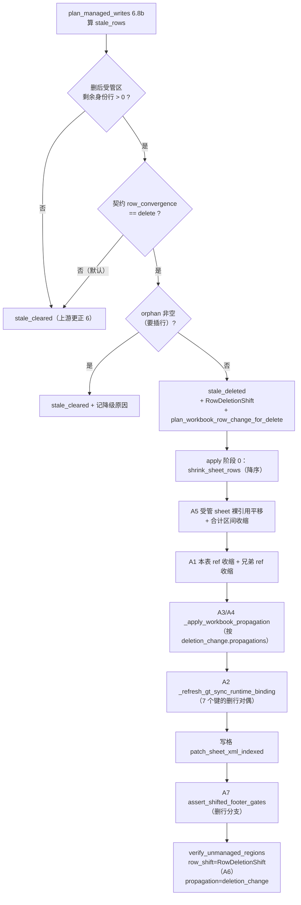
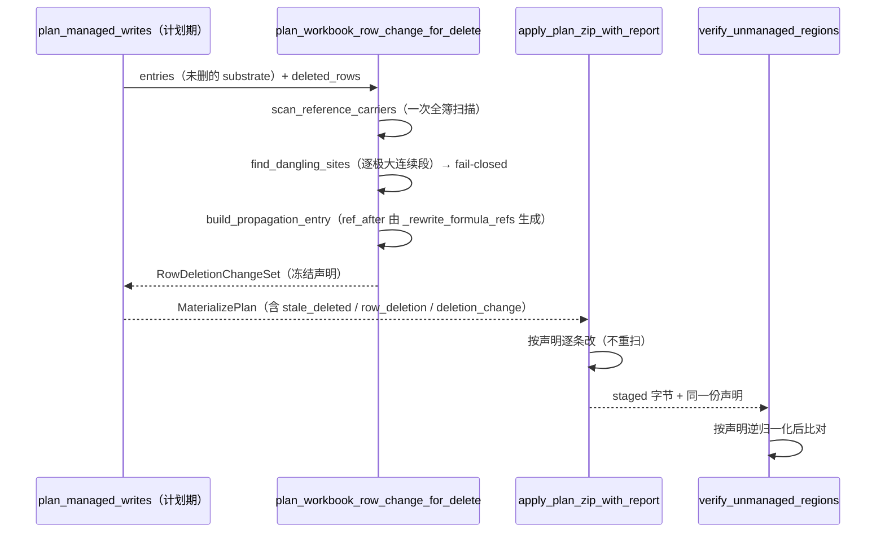

# Design — 受管行删物理行的多区位移联动

> 上游：`workpaper-sync-managed-row-convergence`（已封板）§第十一轮 **G2** 裁决 + §收尾裁决「转出 spec B」。
> 本 spec 只补齐「删物理行」这条路径的位移联动，**不碰** adopt merge 语义与刷新取数弹窗（那是并行 A 线
> `workpaper-sync-adopt-overwrite-and-refresh-source`：`store_mirror.py` / `adopt_substrate_response.py` /
> `GtWpRenderer.vue` 三个文件本 spec 一个字都不改）。

---

## 现算基线（全部本轮现读/现算，**禁写死**；实施期须复算）

| # | 量 | 现算值 | 取法 |
|---|---|---|---|
| B1 | `plan_workbook_row_change_for_delete` 全仓命中 | **0**（定义 0 / 生产调用 0 / 测试调用 0） | AST 扫 **6867** 个 `.py`（排除 import/注释/字符串） |
| B2 | `plan_workbook_row_change_for_insert` 生产调用方 | **2** —— `excel_materialize.plan_managed_writes` 与 `d2_bidirectional_bridge` | 同上 |
| B3 | `shrink_sheet_rows` 生产调用方 | **2** —— `excel_materialize.apply_plan_zip_with_report` 与 `excel_workbook_row_change.apply_workbook_row_change` | 同上 |
| B4 | `build_delete_plan` / `find_dangling_sites` / `find_undeletable_rows` / `resolve_deleted_row_keys` 生产调用方 | 各 **0 / 1 / 1 / 1**，且那 1 处**全在 `build_delete_plan` 函数体内** ⇒ 三者的真实生产入口只有 `build_delete_plan`，而它自己 **0** | 同上 |
| B5 | `apply_workbook_row_change` 生产调用方 | **1**，就是 `apply_workbook_row_change_to_path`（同模块）⇒ materialize 链路**从不经过它** | 同上 |
| B6 | `_refresh_gt_sync_runtime_binding` 函数体内的 `GT_*` 键 | **8** 个：被**重写 7** 个（`GT_ROW_UUID_LAST_ROW` / `GT_FOOTER_ROW` / `GT_FOOTER_ROW_{TID}` / `GT_MANAGED_RANGE` / `GT_MANAGED_TABLE_REF` / `GT_LAST_SHIFT` / `GT_STRUCTURE_FINGERPRINT`）＋**只读 1** 个（`GT_ROW_UUID_COLUMN`，只喂 fingerprint） | AST 取该函数体内的字符串常量 |
| B7 | 该函数是否 insert-only | **是**（首行即 `shift = plan.row_shift` + `assert shift is not None`） | 现读源码 |
| B8 | 「同 sheet 多受管区」**结构性**爆炸面 | **18** 组（17 个双区 + 1 个三区），涉及 **47** 个单区 + 37 个多区 table = **84** 个不同受管 Excel Table | 扫 `backend/storage/**/*.xlsx` 中含 `_GT_SYNC` 的 **931** 份 artifact，按 `displayName` 集合去重 |
| B9 | 同一爆炸面的 artifact **副本**计数 | 1907 个 sheet / 237 份 artifact（副本口径，**不是**结构数） | 同上，未去重 |
| B10 | `definedName` 规模（含 `_GT_SYNC` 的 artifact 内） | 总 **712,536** / 带行分量 **109,159** / `GT_FOOTER_ANCHOR*` **16,069** / `_xlnm.Print_Area` **29,431** | raw XML 直读 `xl/workbook.xml` |
| B11 | 契约 `delete_policy` 分布 | `tombstone` **139** / `reject` **2** / 未声明 **12**（153 个 table / 62 个契约文件） | 解析 `backend/data/workpaper_sync_contracts/*.json` |
| B12 | 跨 sheet 引用规模（Property 28 冻结分母） | xlsx **351** / 含跨 sheet 引用的模板 **182** / 引用处 **144,154** / 公式条 **72,825** / 3D **0** / 外部 **2,908** | `test_workbook_row_change_zero_regression.EXPECTED_DENOMINATORS` 现读 |

### B8 的两条口径纪律

1. 🔴 **同一扫描器在 `backend/wp_templates/` 上得 0，那是扫错了 population，不是结构性零。**
   GT_* 受管 Excel Table 由 `excel_instrumentation` 在**运行期**写入，模板库里本就没有
   （现算：351 份模板 / 2722 个 worksheet / 挂 ≥2 个 Table 的 sheet = **0**，解析失败 0）。
   实施期复算 B8 **必须**扫 `backend/storage/**`，且必须带**变异证明**（本轮用合成双区 zip 得计数 **2**）。
2. B8 的 18 组横跨 **D1 / D2 / D3 / D4 / D6 / D7** 六个循环：
   `D1-13`/`D1-15`/`D1-16`/`D1-4`/`D1-7`/`D1-8` · `D2-3` · `D3-4`/`D3-7` · `D4-1`/`D4-9`/`D4-20`(三区)/`D4-34`/`D4-36` ·
   `D6-6`/`D6-9` · `D7-4`/`D7-7`。
   🔴 归档 README（`_archive/15-workpaper-sync-engine-hardening`）只记了 **5** 个 D4 案例
   （D4-1 / D4-9 / D4-20 / D4-34 / D4-36）—— 那是 insert 侧修复时的样本，**不是全集**。
   删行侧的兄弟收缩判据必须按 **18** 组覆盖，按 5 个写会在 D1/D2/D3/D6/D7 上静默漏掉。

### 〇.1 对上游任务书两处锚点的现读更正

| 任务书原话 | 现读结论 |
|---|---|
| 「footer 重冻结：`_refresh_gt_sync_runtime_binding` **只重冻结本 sheet 的 `GT_FOOTER_ROW_{TID}`**」 | ⚠ **口径偏紧**。现读该函数已按 `same_sheet_tids`（worksheet rels → 兄弟 Table `displayName` → `_GT_SYNC` 平行清册）重冻结**本 sheet 全部**per-template footer 键**含同 sheet 兄弟区**，并在注释里记载了「把『同 sheet 兄弟』和『不同 sheet』混成一类」这个已修的坑。真实欠账不是「只管一个 TID」，而是**整函数 insert-only**（B7）⇒ 删行时 7 个键一个都不动。修法因此是「抽位移载体协议 + 复用 `same_sheet_tids`」，**不是**「把单 TID 扩成多 TID」 |
| 「`excel_materialize.py` 的删行执行（约 L2516 起）…全程不产工作簿级传播声明」 | ✅ **成立**。现读该分支只做 `shrink_sheet_rows`（降序逐行）＋ `_shrink_managed_table_ref` 两件；`_apply_workbook_propagation` / `_refresh_gt_sync_runtime_binding` / `_grow_managed_table_ref`（内含兄弟收缩）三件全在 `if plan.row_shift is not None:` 之内。🔴 行号按纪律不写进判据，锚点用符号名与形态特征 |

🔴 另有一处**文档与实现不一致**，本 spec 一并勘误（不回填上游归档 spec，登记在此）：
`apply_workbook_row_change` 的 docstring 表格声称「受管 sheet / delete / 裸引用：**位移**」，
而现读 `shrink_sheet_rows` 只 `re.sub` 了 `<row r=>` / `<c r=>` 两个属性与 `<dimension>`，
公式文本一个字不动 —— 见「§ 七条欠账逐条」A5。

---

## Overview

问题的结构：声明通道是通的，**生产者缺失**

现读确认整条 workbook 级传播链路已经端到端存在，唯一断点在**计划期的产出**：

```
计划期                                     apply 期                      verify 期
────────────────────────────────────────────────────────────────────────────────────
plan_workbook_row_change_for_insert   ─┐
   （插行：产 WorkbookRowChangePlan）   │
                                        ├→ MaterializePlan.workbook_row_change
   🔴 ∅  删行无对偶（B1 = 0）          ─┘        │
                                                 ├→ _apply_workbook_propagation（只读 .propagations）
                                                 │     改引用侧 sheet + xl/workbook.xml
                                                 └→ ExcelMaterializeOutcome.workbook_row_change
                                                        │
                                            merge_workbook_row_change_propagations
                                                        │（adapters/excel.py，2 处生产调用）
                                                        ▼
                                            verify_unmanaged_regions(propagation=…)
                                              → unmanaged_region_digest 按 {entry.part} 归一化
```

⇒ **删行只要能产出一份 `.propagations`，下游三段（apply / merge / verify）一行都不用改。**
这条判断是本 spec 把范围压住的关键；它也解释了为什么 G2 当时看到的是「补一处又冒一处」——
当时补的是 apply 侧的**执行**，而声明侧从头就没有生产者，执行补得再多 verify 也不认。

### 1.1 当前删行分支的真实形态（现读，不是推测）

`excel_materialize.apply_plan_zip_with_report` 的**阶段 0**（`if plan.stale_deleted:`）只做两件事：

```python
for row in sorted(plan.stale_deleted, reverse=True):
    xml, _ = shrink_sheet_rows(xml, delete_at=row, count=1)     # ① 受管 sheet 删行 + r= 重编号
entries = _shrink_managed_table_ref(entries, plan=plan, removed=len(plan.stale_deleted))  # ② 本表 ref 收缩
```

而**插行**分支（`if plan.row_shift is not None:`）做五件：`shift_sheet_rows`（阶段 1）→
`_grow_managed_table_ref`（阶段 2，内部**再调** `_shift_sibling_table_refs`）→
`_apply_workbook_propagation`（阶段 2b）→ `_refresh_gt_sync_runtime_binding`（阶段 2c）。
删行分支缺后三件，且 `_shrink_managed_table_ref` **不调** `_shift_sibling_table_refs`
（现算：`_shift_sibling_table_refs` 全仓生产调用 **1** 处，就在 `_grow_managed_table_ref` 末尾）。

另：`_apply_step_to_bytes` 里 apply 后的 footer 两门（`assert_shifted_footer_gates`）
以 `if plan.row_shift is not None` 为门，`assert_shifted_footer_gates` 自身首行也是
`if plan.row_shift is None: return None` ⇒ **删行后不复核 footer**。

---

## 七条欠账逐条：现状 · 不做会怎样 · 做法 · 验法

> 上游点名四条（A1~A4）＋ 本轮现算新增三条（A5~A7）。**共 7 条，下表恰 7 行。**
> 每条的「不做会怎样」都落到**具体错误码或具体错值**上，不写「可能有问题」。

| # | 欠账 | 现状（现读） |
|---|---|---|
| A1 | 兄弟 Excel Table 的 `ref` 不随删行收缩 | `_shrink_managed_table_ref` 只改 `plan.table_part` 一个 part，且**首行一律不动**；`_shift_sibling_table_refs` 只被 `_grow_managed_table_ref` 调用 |
| A2 | `_GT_SYNC` runtime binding 不重冻结 | `_refresh_gt_sync_runtime_binding` insert-only（B7），7 个被重写键（B6）在删行时全部停留在旧值 |
| A3 | `definedName` 位移既不声明也不执行 | `propagate_defined_names` 能力在，但删行路径不产 `plan.workbook_row_change` ⇒ `_apply_workbook_propagation` 直接 `return entries` |
| A4 | 跨 sheet 公式传播既不声明也不执行 | 同 A3（`propagate_reference_side` 同一条通道） |
| A5 | 受管 sheet **自身裸引用**不平移（含 footer 合计区间） | `shrink_sheet_rows` 只改 `<row r=>` / `<c r=>` **属性**，不碰公式文本；`propagate_reference_side` 是 `qualified_only=True` ⇒ 裸 `SUM(B7:B25)` 无人处理。insert 侧由 `shift_sheet_rows` 覆盖 |
| A6 | verify 侧受管 sheet 的归一化载体对删行不存在 | `unmanaged_region_digest(row_shift=…)` 的鸭子接口是 `unshift` / `inserted_rows`（＋ `unextend_total_formula_chain` 用 `insert_at` / `count`），删行侧无对应载体 ⇒ 只能传 `None` |
| A7 | apply 后 footer 两门不复核 | `assert_shifted_footer_gates` 首行 `if plan.row_shift is None: return None` |

### A1 兄弟 Table ref 收缩

**不做会怎样（G2 实测症状的完整链条）**：D4-1 同 sheet 双区，main `GT_D41_MAIN_ROWS`、
other `GT_D41_OTHER_ROWS`。删 main 区一行 ⇒ 物理上 other 区整体上移 1 行，而 other 的 `ref` 逐字不动
⇒ `resolve_managed_region` 按旧 `ref` 算出的 `region.row_span` **头部少一行、尾部多一行**
⇒ `excel_extract` 里 `raw_uuid_by_row = {row: cells.get(f"{uuid_col}{row}") … for row in region.row_span}`
在多出来的那一行读到空串 ⇒ `_scan_row_identities` 按 `delete_policy=tombstone`（B11：139/153 个 table 都是它）
走 `EmptyRowIdentityDisposition.assign_new_id` ⇒ `mint_row_identity` 产 `GTROW-MINTED-*`
⇒ 新身份不在 `intended` ⇒ **又一轮 `extra`** ⇒ `roundtrip_projection_mismatch` 500。
（这正是 G2 观察到的「other 区出 uuid 空行 + 被重新 mint」。）

**做法**：`_shrink_managed_table_ref` 末尾对称调一个新的 `_shrink_sibling_table_refs`，
与 `_shift_sibling_table_refs` **共用同一个 `ref=` 正则与同一套边界推导**，只把 `remap` 换成删行侧映射。
🔴 兄弟表 **首行也要动**（与本表相反）：本表首行是区首锚点、删的是它自己区内的数据行；
兄弟表整块在删除点**下方**，首尾都要上移。判据用统一的 `remap(row)`，不写两个 if。

**验法**：合成双区 artifact（main R8:W22 / other R24:X36）删 main 区 1 行后断言
① other 的 `ref` 变成 `A23:X35`（首尾各 −1）② 再 `extract` 一次 `scan.minted_by_row` **为空**
③ 变异反证：把 `_shrink_sibling_table_refs` 的调用摘掉 ⇒ ②必须打红（否则判据没区分力）。

### A2 `_GT_SYNC` runtime binding 重冻结

**不做会怎样**：7 个键停在删行前口径 ⇒ **下一次** materialize 在计划期就撞
`assert_footer_anchor_stable` 的 `FooterAnchorDriftError`（可见侧 marker 实测 = 冻结值 − 删行数，
而 `row_shift is None` 分支要求两者严格相等）。症状是「删行这次成功了、下次点在线编辑起 500」——
时间差让根因极难归位，这是本条必须与 A1 同批落地的理由。

**做法**：把该函数的 `plan.row_shift` 依赖抽成一个**位移载体协议**（见「§ Components and Interfaces」），
insert 传 `RowShiftPlan`、delete 传新的删行载体；7 个键逐个给删行语义：

| 键 | insert 现行 | delete 对偶 |
|---|---|---|
| `GT_ROW_UUID_LAST_ROW` | `>= insert_at-1` 则 `+count` | `-`（本区内删几行减几行，用载体的 `shift`） |
| `GT_FOOTER_ROW` | 仅本趟是 primary 时 `shift()` | 同条件，`shift()` 给负向 |
| `GT_FOOTER_ROW_{TID}` | **本 sheet 含兄弟区**全部 TID 各自 `shift()` | 同一 `same_sheet_tids` 推导，`shift()` 给负向 |
| `GT_MANAGED_RANGE` | `_grow_range_string` | 新 `_shrink_range_string`（同一函数按载体方向分流，不抄第二份） |
| `GT_MANAGED_TABLE_REF` | 同上 | 同上 |
| `GT_LAST_SHIFT` | `{at}|{count}|{累计}` | 同形态但 `count` 为负 ⇒ 累计可回落（模板升级重放需要可逆） |
| `GT_STRUCTURE_FINGERPRINT` | 位移后坐标摘要 | 同一 `_structure_fingerprint`，喂删行后的坐标 |

🔴 **`same_sheet_tids` 的推导必须复用现有那一段**（worksheet rels → 兄弟 Table `displayName` →
`GT_MANAGED_TABLES`/`GT_TEMPLATE_IDS` 平行清册）。抄第二份 = 第二真源；而这一段正是 insert 侧
踩过「把『同 sheet 兄弟』和『不同 sheet』混成一类」的地方，抄一遍就会把那个坑复制过来。

**验法**：删行后读回 `_GT_SYNC`，7 个键逐个与预期值相等；**变异反证**：把 `GT_FOOTER_ROW_{TID}` 那一支
去掉 ⇒ 紧接着再跑一次 materialize 必须抛 `FooterAnchorDriftError`（证明这条键真的被下游消费）。

### A3 definedName 位移

**不做会怎样**：`GT_FOOTER_ANCHOR_*`（B10：16,069 处）与 `_xlnm.Print_Area`（29,431 处）
指向删除点下方的行号不变 ⇒ ① footer anchor 指到错行，与 A2 叠加放大 ② 打印区域越界或含已删区
③ **且一旦 A3 的执行补上而声明没补上**，`xl/workbook.xml` 落在 `workbook_and_styles` 桶
（现读 `unmanaged_region_digest` 的注释明确记载该桶曾因此打红）⇒ `adapter_unmanaged_region_drift`。

**做法**：产出 `.propagations` 即可 —— `_apply_workbook_propagation` 已按声明逐条替换
（含 `&apos;` 四候选形态），`propagate_defined_names` 在 `apply_workbook_row_change` 里已有实现可参照。
🔴 本 spec **不改** `_apply_workbook_propagation` 的替换算法，只给它喂声明。

**验法**：删行后 `xl/workbook.xml` 的 `GT_FOOTER_ANCHOR_*` / `Print_Area` 行号 = 原值 − 删除数；
且 `verify_unmanaged_regions(propagation=…)` 判等价；变异反证：声明里去掉 workbook.xml 那几条
⇒ verify 必须判 `adapter_unmanaged_region_drift`（证明归一化真的依赖声明而非放行整桶）。

### A4 跨 sheet 公式传播

**不做会怎样**：B12 的 144,154 处跨 sheet 引用里，指向受管 sheet 且落在删除点下方的那些
**静默指向错行** —— 产物能正常打开、格子里有值，值是隔壁那一行的。审计底稿上这是最贵的一类缺陷
（模块 docstring 首段就写着「静默指向错行比报错贵得多」）。另与 A3 同源的 verify 后果落在
`other_sheet_parts` 桶。

**做法**：与 A3 同一份 `.propagations`（`build_propagation_entry` 已保证 `ref_after` 由
`_rewrite_formula_refs` 生成，与 apply 侧同一入口 ⇒ 声明与执行不可能漂移）。

**验法**：合成「引用侧 sheet 引用受管 sheet 删除点上/下/跨区间」三类样本，断言
上方逐字不动 / 下方 −N / 跨区间收缩；变异反证：区间引用被**删光**的那种必须走
`find_dangling_sites` 的 `range_emptied` 并 fail-closed（不进传播清单）。

### A5 受管 sheet 自身裸引用（含 footer 合计区间）

**不做会怎样**：D4-1 main 区 R8~R22、footer 在 R23、合计是裸 `SUM(B8:B22)`。删 R22 后
物理区变 R8~R21、footer 上移到 R22，而公式仍是 `B8:B22` ⇒ **合计把 footer 自己算进去** ⇒
Excel 循环引用；即便某些形态不报循环，也是「合计多算一行」的静默错值。
🔴 `apply_workbook_row_change` 的 docstring 表格写着「受管 sheet / delete / 裸引用：**位移**」——
**现读 `shrink_sheet_rows` 的实现并不做这件事**（它只 `re.sub` 了 `<row r=>` 与 `<c r=>` 两个属性
以及 `<dimension>`）。这是文档与实现的不一致，本 spec 一并勘误（不回填上游归档 spec，登记在此）。

**做法**：apply 阶段 0 在 `shrink_sheet_rows` 之后追加一次**受管 sheet 内的裸引用平移**，
入口用 `excel_row_shift.remap_a1_rows`（已有的唯一入口）＋ 合计区间按 `carries_total_formula`
契约声明**收缩**（与 insert 侧「未声明即 fail-closed」对称：未声明就不改它，让
`assert_footer_formula_covers_managed_rows` 去拦）。
🔴 **不复用 `shift_sheet_rows`** —— 上游已明文「那个函数的语义是造新行+下移，共用会让边界互相干扰」。

**验法**：删行后 footer 公式区间末行 = 删行后受管区末行；`assert_footer_formula_covers_managed_rows`
（不传 row_shift 口径）通过；变异反证：跳过平移 ⇒ 该断言必须打红。

### A6 verify 侧归一化载体

**不做会怎样**：受管 sheet 里**未管理**的格（不在 `managed_coords` 内的那些）在删行后行号变了，
digest 逐格比对 ⇒ `managed_sheet_unmanaged_cells` 与 `managed_sheet_structure` 两个 aspect 判漂移
⇒ `adapter_unmanaged_region_drift`。这条与 A3/A4 不同桶，**补了 A3/A4 也不会顺带解决**。

**做法**：新增删行位移载体（「§ Components and Interfaces」），使其鸭子兼容 `unshift` / `inserted_rows`；
`unextend_total_formula_chain` 需要删行对偶（把「还原扩张」变成「还原收缩」：`extend_by` 取正）。
`inserted_rows` 对删行恒为 `frozenset()` —— 🔴 这一条要**显式断言**，否则「恒空集」会让
`_normalise_cell_ref` 里那条 `row in inserted` 分支在删行路径上成为不可达代码而无人察觉。

**验法**：删行产物 vs 原产物跑 `verify_unmanaged_regions`，两个 aspect 判等价；
变异反证：不传载体（`row_shift=None`）⇒ 必须判漂移（证明载体真的在起作用，不是"反正都过"）。

### A7 apply 后 footer 两门

**不做会怎样**：删行后没有任何一相复核 footer，A2/A5 的任何一处算错都要等到**下一次** materialize
才以 `FooterAnchorDriftError` / `FooterFormulaRangeError` 暴露 —— 而那时产物已经发布出去了。
上游把这一相独立出来的理由（「计划期跑在未位移的 substrate 上，要求实测==冻结+位移是错的」）
在删行侧同样成立，只是符号相反。

**做法**：`assert_shifted_footer_gates` 的门从 `plan.row_shift is None` 改为
「两个位移载体都为空才 return」，并把 `row_shift=` 参数改为接受位移载体协议。

**验法**：删行成功路径上该函数**真的执行过**（用返回值非 `None` 断言，不用「没报错」）；
变异反证：故意让 `_GT_SYNC` 的 footer 键少减 1 ⇒ 本门必须当次打红（而不是下次）。

---

## Components and Interfaces

delete 对偶怎么建：三个方案与裁定

### 3.1 问题的真正形状：stale 行**不是**一个连续区间

`plan_managed_writes` 的 6.8b 产出的是 `stale_rows: dict[int, str]`（行号 → 身份），
而 `build_delete_plan(at=, count=)` 与 `WorkbookRowChangePlan` 的 `at`/`count` 是**单个连续区间**语义。
现行 apply 用「降序逐行 `count=1`」绕过了这一点，但那只对**受管 sheet 内的行删除**成立；
一旦要产传播声明，就必须回答「一处引用在 N 次单行删除之后应该落在哪一行」。

正确的合成映射是：

```python
def remap(row: int) -> int | None:
    if row in deleted:
        return None                                    # 被删行没有「删后行号」
    return row - sum(1 for d in deleted if d < row)     # 上方被删几行就上移几行
```

⇒ **同一份声明里不同条目的 `delta` 互不相同**。而 `WorkbookRowChangePlan._validate_propagations`
断言「每条 `entry.delta == -count`」，强塞会当场打红或（更糟）逼实施者把 delta 抹平成谎报值。

这与归档 spec `multi-sheet-materialize-defined-name-shift-normalization` 遇到的是**同一个形状**：
「多 sheet 各有自己的 `at`/`count`，单一标量无法诚实表达」。它的解法是新类
`MaterializeWorkbookChangeSet`（只暴露 `propagations`，鸭子兼容 verify），本 spec **直接沿用**。

### 3.2 三个方案

| 方案 | 内容 | 取 | 舍 |
|---|---|---|---|
| **A** 新增 `plan_workbook_row_change_for_delete` | 与 insert 门面平行的第二个公开门面 | 与模块既有形状一致（`build_insert_plan` / `build_delete_plan` 本来就是两个函数）；insert 门面签名**逐字不变** ⇒ B2 的 2 个生产调用方零改动 | 要么复制 ~40 行 zip→scan 门面，要么抽公共私有函数 |
| **B** 把 insert 门面泛化成带 `kind` 的单一入口 | `plan_workbook_row_change(entries, *, kind, …)` | 只有一个入口 | ① 改签名 ⇒ B2 的 2 处生产调用方 + 1 处测试调用方全要改，零回归不再"按定义成立"而要靠测试证明 ② `style_from`（insert 必需）与 `row_uuids`/`allow_ref_errors`（delete 必需）会双双退化成 `None` 默认值 ⇒ 漏传从 `TypeError` 降级成深埋在 `__post_init__` 的 `RowChangeKindError` ③ 3.1 的非连续区间让 `kind=delete` 无法复用 `at`/`count` 形参 |
| **C** = A ＋ 抽出私有 `_scan_from_entries` | 新增公开 delete 门面；把「entries → 内存 zip → `_parse_workbook_xml` → `scan_reference_carriers`」抽成私有函数，两个门面各调一次 | A 的全部优点 ＋ 不复制扫描逻辑（模块 docstring 明令「不另写一份扫描逻辑，抄第二份必然与执行侧漂移」） | 多一个私有函数 |

### 3.3 裁定：**方案 C**，返回类型是 `MaterializeWorkbookChangeSet` 而不是 `WorkbookRowChangePlan`

```python
def plan_workbook_row_change_for_delete(
    entries: Mapping[str, bytes],
    *,
    managed_sheet_name: str,
    managed_sheet_part: str,
    deleted_rows: Sequence[int],          # 🔴 非连续集合，位移**前**口径
    region_first_row: int,
    region_last_row: int,
    row_uuids: Mapping[int, str] | None = None,
    stable_ordinals: Mapping[int, str] | None = None,
    allow_ref_errors: bool = False,
) -> RowDeletionChangeSet | None:
    """删行的工作簿级位移声明。`None` = 零传播路径（逐字节与本 spec 之前相同）。"""
```

`RowDeletionChangeSet` 是 `MaterializeWorkbookChangeSet` 的删行特化（或直接复用后者 + 一个
独立的位移载体），须同时承载：

```python
@dataclass(frozen=True)
class RowDeletionShift:
    """删行的位移载体。与 RowShiftPlan / CompositeRowShift 鸭子兼容（verify 侧零改动）。"""
    deleted_rows: tuple[int, ...]         # 升序、去重、位移前口径
    region_first_row: int
    region_last_row: int

    inserted_rows: frozenset[int]         # 恒 frozenset() —— 🔴 显式断言，见 A6
    def shift(self, row: int) -> int | None   # 被删行返回 None（与 WorkbookRowChangePlan.shift 同纪律）
    def unshift(self, row: int) -> int        # 删后行号 → 删前行号（verify 归一化）
    @property
    def count(self) -> int                    # len(deleted_rows)，诊断用
```

**四条理由**：

1. **诚实表达 > 复用类型。** 非连续删除的 delta 逐条不同，`WorkbookRowChangePlan` 的
   `_validate_propagations` 会（正确地）拒绝它。把它塞进去只有两条出路：改弱那条校验（弱化既有
   fail-closed，本 spec 明确拒绝）或谎报 delta。
2. **下游零改动。** `_apply_workbook_propagation` 只读 `.propagations`；
   `merge_workbook_row_change_propagations` 的入参已声明为
   `WorkbookRowChangePlan | MaterializeWorkbookChangeSet | None`；`unmanaged_region_digest`
   只读 `propagation.propagations`。三处现读确认。
3. **保留 `build_delete_plan` 的坏引用拦截。** 新门面**内部**对每个「极大连续段」各调一次
   `find_dangling_sites`（不是 `build_delete_plan` 整体 —— 那个会顺带构造一个 `at`/`count` 计划），
   把 `DanglingReferenceError` 留在**计划期**抛，与上游 §更正 4「不得传 `allow_ref_errors=True` 绕过」一致。
   `resolve_deleted_row_keys` 仍调，产出的业务键进声明供审计留痕（它现算的唯一生产入口就是
   `build_delete_plan`，本门面成为第二个 ⇒ B4 的「0 生产消费方」由此闭合）。
4. **`None` 语义与 insert 门面对齐**：无任何指向受管 sheet 的引用、或全部引用都在删除点之上
   ⇒ 返回 `None` ⇒ 走零传播路径，产物与不产声明时逐字节相同。

## Data Models

```python
# 既有
workbook_row_change: Any | None = None      # insert 声明（WorkbookRowChangePlan）
stale_deleted: tuple[int, ...] = ()
stale_cleared: tuple[int, ...] = ()
# 新增（默认值保证既有构造点逐字不变）
row_deletion: Any | None = None             # RowDeletionShift | None
deletion_change: Any | None = None          # RowDeletionChangeSet | None
```

🔴 **不复用 `workbook_row_change` 一个字段装两种声明**：`_apply_workbook_propagation` 与
`assert_shifted_footer_gates` 需要按 kind 分流（insert 走 `plan.row_shift`、delete 走 `plan.row_deletion`），
共用一个字段就得在每个消费点做 `isinstance` 判断 —— 那是把 kind 信息从类型里挤到调用点，
每个漏判的点都是一处静默错向。四个默认 `None`/`()` 的字段让「本次没有这类变更」在类型上就可判。

---

## 删与插共存：**不解除**，但把 fail-closed 改成 fail-soft 降级

### 4.1 现状

`apply_plan_zip_with_report` 在删行分支之前拦：

```python
if plan.stale_deleted and plan.row_shift is not None:
    raise RowSetDivergenceError("[convergence_delete_with_insert_unsupported] …")
```

上游注释写明理由：`row_shift.insert_at` 按**删行前**行号算，先插后删会被重编号、先删后插则插入点也要下移，
「将来真遇到共存再按『删后重算 insert_at』实现，那需要一条独立判据而不是在这里凑」。

### 4.2 裁定：共存仍不支持删行，但**降级回清空**而不是抛错

**理由（这条是本 spec 相对上游的实质改变，必须写明）**：
今天 `stale_deleted` 恒为 `()`，所以这个拦截**从未在生产触发**。一旦启用删行，
「store 同一次保存里既删了行又加了行」的 entry 会从**现在能用**（走 `stale_cleared`，
第十一轮真实链路已验 200）变成 **500**。那是拿一个新功能换掉一个已验证可用的行为，净亏。

⇒ 分流判定提前到**计划期 6.8b**：

```
stale_rows 非空 ？
├─ 否 → 两个分支都空（现状）
└─ 是 → 受管区删后剩余有身份数据行 <= 0 ？
        ├─ 是 → stale_cleared（上游更正 6，保住 IdentityCarrierMissingError 的结构前提）
        └─ 否 → 契约声明 row_convergence == delete ？（「§ 启用受控」）
                ├─ 否 → stale_cleared（默认，逐字节零回归）
                └─ 是 → orphan 非空（即 row_shift 非空）？
                        ├─ 是 → stale_cleared ＋ 记一条可观测的降级原因      ← 本 spec 新增
                        └─ 否 → stale_deleted（真正走删行）
```

apply 期那条 `RowSetDivergenceError` **保留**，语义改为**纵深防御断言**：
计划期已保证两者不共存，走到这里说明 6.8b 与 apply 口径漂移了。
🔴 配一条判据断言「`plan_managed_writes` 不可能同时产出两者」——**不是**断言这个 raise 不存在
（那会把纵深防御删掉），而是断言计划期分流覆盖了全部组合。

**为什么共存留在范围外仍然安全**：
① 降级目标是**当前生产行为**，不是新代码路径，风险等于零；
② 降级是「少做」（不删物理行）而不是「多做」，不会产出坏字节；
③ 降级必须**可观测**（`stale_clear_reason` 计入 `MaterializePlan.as_dict()`），
否则「删行功能上线了但在双向变更的 entry 上从来没跑过」会成为一个看不见的空转 ——
那正是本平台反复踩的「能力已建 ≠ 接线完整」的另一面。

---

## 启用受控：契约声明 opt-in，默认逐字节零回归

### 5.1 为什么不是环境变量开关

平台既有的同型先例是**契约声明**而不是全局 flag：`footer_anchor.carries_total_formula`
默认 `False`，「未声明即引擎无权扩张合计区间」（现读其 docstring：「默认 `False` 是纯增量的关键；
改默认值会让**全部**既有契约的语义静默变化」）。删物理行的破坏力比扩张合计区间更大，
灰度粒度必须**细到单张表**，而环境变量只能一刀切全平台。

现读确认 `_parse_table` 用 `raw.get(...)` 逐键取值、**不拒绝未知键** ⇒ 新增可选键是纯增量：
既有 62 个契约文件一个字节都不用改，它们的 content-address（`definition_store/contracts/<sha>.json`）
因此不变。

### 5.2 契约字段

```python
class RowConvergenceMode(str, Enum):
    clear = "clear"     # 默认：清空 editable 字面值格（当前生产行为）
    delete = "delete"   # 删物理行（本 spec 的新路径）

@dataclass(frozen=True)
class TableSpec:
    ...
    row_convergence: RowConvergenceMode = RowConvergenceMode.clear
```

＋ 一条契约校验规则（沿用 CS-xx 编号习惯，实际编号实施期现算取下一个可用值）：
**声明 `row_convergence=delete` 的表必须同时声明 `row_identity` 与 `delete_policy`** ——
没有行身份就没有 `resolve_deleted_row_keys` 的留痕来源，而删除是不可逆的数据丢失。

### 5.3 「启用前后 `stale_cleared` 路径逐字节零回归」的判据

三层，缺一层都可能假绿：

1. **默认值层**：全部 62 个契约文件解析后 `row_convergence` 恒为 `clear`（现算断言，**禁写死 62**）。
2. **字节层**：同一份 substrate + 同一份 projection，在本 spec 前后各跑一次
   `apply_plan_zip_with_report`，产物 **sha256 逐字节相等**。基线用「本 spec 落地前的产物字节」
   冻结在 `backend/tests/workpaper_sync/data/` 下（与 Property 28 同款做法）。
3. **路径层**：AST 断言 `plan_managed_writes` 里 `stale_deleted` 的赋值**被 `row_convergence` 门控**
   —— 防有人把门控写在门面里而计划期无条件产删行计划。
   🔴 **变异反证**：把门控条件改成恒真 ⇒ 第 2 层必须打红。只有第 2 层会打红才证明它真的在观测字节。

### 5.4 上游反向守卫的处置（原 Task 15）

现读 `backend/tests/workpaper_sync/test_managed_row_convergence.py`
::`TestConvergenceIsDualToOverlay::test_convergence_clears_cells_and_never_deletes_rows` 里有一条：

```python
assert "stale_deleted = tuple(sorted(stale_rows))" not in src, (...)
```

它是 G2 的看门狗。本 spec 完成后**才**允许改它，且**必须换成正向判据**，不是删掉：

| 旧（反向） | 新（正向，三条合取） |
|---|---|
| 「收敛不得产出删行计划」 | ① 产删行计划**必须**同时产 `row_deletion` 与 `deletion_change` 两个声明（AST + 运行时双断言）② 产删行计划**必须**在 `row_convergence == delete` 门控之内 ③ 删行的 apply 路径**必须**依次经过 A1~A5 五个动作（用实测报告计数断言，不用「没报错」） |

同一文件里还有 `test_convergence_clears_cells_and_never_deletes_rows` 的姊妹断言
`"stale_cleared = tuple(sorted(stale_rows))" in src` —— 它在新分流下**仍然成立**（clear 仍是默认分支），
不需要改。🔴 实施期必须现读确认这一点，不能假设。

---

## 复现 G2 实测症状的测试：修复前必红，修复后必绿

### 6.1 症状链（每一环都要被断言，不能只断言末端）

```
删 main 区 1 行
  └─① 兄弟 Table `ref` 未收缩            → other 区 ref 覆盖区间整体错位 1 行
      └─② region.row_span 尾部多一行     → 该行 uuid 列为空串
          └─③ _scan_row_identities        → delete_policy=tombstone ⇒ assign_new_id
              └─④ mint_row_identity       → 产 GTROW-MINTED-*
                  └─⑤ 新身份 ∉ intended   → extra ≠ 0
                      └─⑥ roundtrip 判据  → roundtrip_projection_mismatch（500）
```

### 6.2 测试形态：合成双区 artifact（**不用** live 数据、不造假业务数据）

固件按 B8 的真实形状构造最小双区工作簿（一张 sheet、两个 GT_* Table、各带 uuid 列与
`delete_policy=tombstone` 契约）：

```
sheet "双区"        A..W = main 区 (Table GT_SYN_MAIN_ROWS, ref A7:W10, uuid=W)
                    A..X = other 区 (Table GT_SYN_OTHER_ROWS, ref A12:X15, uuid=X)
                    R16  = 空行（用于让「尾部多一行」真的读到空 uuid）
```

**红/绿两态由同一个测试函数覆盖**，用 `monkeypatch` 把 `_shrink_sibling_table_refs` 的调用
短路成 no-op 来制造「修复前」——🔴 **不用改磁盘文件的方式做变异**（上游归档 README 教训 6 明确记载
「变异 harness 自身会假绿」：还原动作被 `continue` 跳过后把已变异文件当 pristine 快照）。

| 断言 | 修复前（短路兄弟收缩） | 修复后 |
|---|---|---|
| other 区 `ref` | `A12:X15`（不动） | `A11:X14`（首尾各 −1） |
| `region.row_span` 尾行的 uuid | `""`（空） | 非空 |
| `scan.minted_by_row` | **非空**，且键恰是那一行 | `{}` |
| `extract` 后的 `extra`（`_managed` 生产口径） | **非 0** | **0** |

🔴 `extra` 一律用生产口径 `_assert_roundtrip_equivalent` 的 `_managed()` 复算，禁自造裸差集
（上游 §更正 2：裸差集让数字虚高 3.9 倍，同型问题踩过三次）。

### 6.3 为什么这条测试不可替代

上游 G2 的结论是靠**真实链路实测**得到的；如果本 spec 只加「兄弟 ref 收缩后 ref 值对」这类
单点断言，就无法证明整条链断开了 —— ①②③④ 任一环的判据都可能各自绿而链条仍通。
所以断言必须**沿链逐环**，且修复前那一态必须真的红（`pytest.raises` / 显式不等断言），
否则这条测试只是在断言一个恒真的事。

---

## Property 28 冻结基线：**不得变化**，且本 spec 的改动按定义不会让它变化

### 7.1 现读该基线到底挂在什么上

`backend/tests/workpaper_sync/test_workbook_row_change_zero_regression.py` ＋ 生成器
`backend/scripts/gen/generate_workbook_row_change_zero_regression_baseline.py`：

* 被观测对象 = **`excel_row_shift._rewrite_formula_refs` 单个函数**（生成器 `from … import _rewrite_formula_refs`）；
* 情景 = `SCENARIOS = ("insert_ctx", "insert_no_ctx", "filldown")`，**三个 remap 全是非负方向**
  （`_insert_remap` = `row+1 if row>=7`、`_filldown_remap` = `row+1`）；
* 冻结产物 = `backend/tests/workpaper_sync/data/workbook_row_change_zero_regression_baseline.json`
  （现算 **221,278** 字节，sha256 `421e7bf8…3a0ffc`；**禁写死**，实施期复算）；
* 分母断言 = B12 那六个数。

### 7.2 裁定

1. **本 spec 不得修改** `_rewrite_formula_refs`、`translate_formula_rows`、`_scenario_kwargs`、
   `SCENARIOS`、`CANONICAL_INSERT_AT` / `CANONICAL_COUNT`。删行侧的负向 remap 通过**调用方传参**实现
   （`remap` 是入参，不是函数内部常量）⇒ 基线按定义不受影响。
2. **不往 Property 28 里加第四个删行情景。** 现读 `test_baseline_covers_every_template` 断言
   `set(rec["digest"]) == set(G.SCENARIOS)` ⇒ 加情景会让**全部 351 份模板**的 digest 键集合变化，
   必须整体重生成 —— 那正是「让冻结基线静默变化」的形态。删行侧的负向 remap 覆盖由本 spec
   **自己的**判据承担（「§ 七条欠账逐条」A4 的三类样本 + 变异反证），不借道别人的基线。
3. **加一条基线文件级看门狗**：断言该 JSON 的 sha256 与本 spec 交付时现算值相等。
   理由：`test_behaviour_matches_frozen_baseline` 只在**跑得动**的时候才保护它
   （全库 351 份约 9 秒，容易被 `-k` 过滤掉）；文件级 sha 断言是毫秒级的第二道锁。
   🔴 该看门狗必须写明「若这是**有意**重生成，改这里的期望值并在 commit 说明每一处 diff 的合法性」，
   否则它会变成阻止合法演进的水泥。
4. 如果实施期发现**必须**改 `_rewrite_formula_refs`（例如负向 remap 暴露该函数的真实缺陷），
   那是**范围变更**：停下，先按七条机械核验（该守卫 docstring 记载的 Task 27 先例）逐条取证，
   再显式 `--apply` 重新冻结并在 commit 里说明每一处 diff 的合法性。**不得**在实施中顺手重生成。

---

## Architecture

架构与时序

### 8.1 计划期 / apply 期 / verify 期的三相（删行支路，粗线为本 spec 新增）



### 8.2 声明与执行同源（为什么顺序不可交换）



🔴 三处必须**同源于同一份声明**：计划期冻结 → apply 按声明改 → verify 按声明还原。
apply 期重扫 = 两个真源；verify 按观测差异反推 = 让被检查对象自证合法（上游 design 明确拒绝）。

---

## Error Handling

错误处理

| 场景 | 处置 | 错误码 |
|---|---|---|
| 被删区间内有单格引用 / 区间被删光 | 计划期抛，零字节写入 | `DanglingReferenceError`（既有，`allow_ref_errors` 默认 False，**不得**传 True） |
| 被删行取不到业务键 | 计划期抛 | `MissingRowIdentityError`（既有） |
| 删后受管区归零 | **不抛**，6.8b 降级 `stale_cleared` | —（上游更正 6 AC 5） |
| 删与插共存 | **不抛**，6.8b 降级 `stale_cleared` + 记可观测原因；apply 期原 raise 保留为纵深防御 | `[convergence_delete_with_insert_unsupported]`（保留但应不可达） |
| Table ref 收缩后末行 < 首行 | 抛（既有） | `[convergence_table_ref_underflow]` |
| 本表 ref 一处都没缩 | 抛（既有） | `[convergence_table_ref_not_shrunk]` |
| 兄弟 ref 一处都没缩 | **不抛** | —（兄弟区完全在删除点上方时零改动是正确行为，与 `_shift_sibling_table_refs` 同纪律） |
| 声明要改的 part 不在 zip 里 / 实改数 ≠ 声明数 | 抛（既有） | `PropagationDriftError` |
| `_GT_SYNC` 部件定位不到 / 一对键都读不到 | 抛（既有） | `[excel_row_shift_gt_sync_part_missing]` / `[excel_row_shift_gt_sync_empty]` |
| 删行后 footer 实测 ≠ 冻结 − 声明删除量 | 抛（A7 新分支） | `FooterAnchorDriftError` |

🔴 **一条也不准 fail-open。** 删行是不可逆的数据丢失，「传播不了就当没传播」会产出一张
看着有值、值是隔壁行的审计底稿。

---

## 验证纪律

1. **离线 harness 为主判据，HTTP 状态码为辅**（复用 `backend/tests/workpaper_sync/d4_materialize_harness.py`
   的 `build_world` / `rebased_world`）。
2. **每条「结构性零」结论必配变异证明。** 本 spec 已踩一次：同一个兄弟 Table 扫描器在
   `wp_templates/` 上得 0（扫错 population），在 `storage/` 上得 1907 —— 若无变异证明会写成
   「平台没有同 sheet 多受管区」这个彻底相反的结论。
3. **「读出为空」先排除解析失败。** 本 spec 大量读 xlsx 内部结构，一律 **raw XML + zipfile**，
   不用 openpyxl 的属性访问（先例：`ws.oddFooter` 解析失败后**静默返回空**）。
   探针必须显式统计并打印 `解析失败` 计数（本轮 storage 扫描实测 28 份 `BadZipFile`，
   若不统计就会被当成「28 份没有 `_GT_SYNC`」）。
4. **含正则的核验一律写探针文件**，禁 `python -c`（shell 传参把 `\d` 变字面反斜杠）。
5. **文件校验一律 Python 读 bytes + decode**（PowerShell 的行数与编码显示都不可信）。
6. **判据禁写死行号**；计数类一律现算或标「现算值 + 禁写死」。
7. **PBT** 用 hypothesis，`max_examples=5`（用户明确要求，禁默认 100）。
8. 定向跑测试（`backend/tests/workpaper_sync/` 整目录 >15 分钟超时），按符号反查测试文件。

---

## 风险与未验证项（诚实标注）

| # | 项 | 状态 |
|---|---|---|
| R1 | A5「受管 sheet 裸引用平移」是本轮从代码现读**推断**的缺口（`shrink_sheet_rows` 不碰公式文本 ∧ `propagate_reference_side` 是 `qualified_only=True`），**未实测** | 🔴 实施第一步先写探针实证：构造带裸 `SUM` 的受管 sheet，删一行后读回公式文本。若证伪（某处已在处理）则 A5 降级为「已有产物」并更正本设计 |
| R2 | `unextend_total_formula` 的删行对偶是否真的需要，取决于 `_is_total_row` 在删行载体下的取值 | 🔴 未实测。实施期先跑 `verify_unmanaged_regions`，若 `managed_sheet_unmanaged_cells` 不因合计公式打红则本项为空欠账，**必须配变异证明**（把合计行改成不带公式 ⇒ 判据须仍绿）才能下这个结论 |
| R3 | B8 的 18 组里只有 D4 那 5 组有真实业务数据支撑；D1/D2/D3/D6/D7 的 13 组是模板结构存在但**未实测其删行行为** | 判据按 18 组参数化，但真实数据 UAT 只能覆盖 D4 ⇒ 其余 13 组标「结构判据已覆盖，真实数据待环境」 |
| R4 | 真实链路验收需要一个 `row_convergence=delete` 的契约与一个真的 stale 行 | D4 的 live 污染已被上游 §更正 5 保留为回归靶子，但第十一轮收敛后 `extra` 已归 0 ⇒ **靶子可能已消失**。实施期须先现算「D4 当前还有几个 stale 身份」，若为 0 则改用合成 artifact + 显式构造 stale |
| R5 | 有并发会话在改 `excel_materialize.py` | 归档 README 教训 4 记载该文件在别的会话里被从 94 行 diff 改到 237 行。每个实现任务开始前**先重新现读**相关函数，且零改动判据用「会话基线 sha256 + 本 spec 符号命中」而不是 `git diff == 0` |

---

## 依赖

* **代码依赖（只读，不改）**：`excel_row_shift`（`_rewrite_formula_refs` / `remap_a1_rows` /
  `CompositeRowShift` / `unextend_total_formula`）· `excel_extract`（`_scan_row_identities` /
  `resolve_managed_region` / `unmanaged_region_digest`）· `adapters/excel.py` 的
  `merge_workbook_row_change_propagations` 接线。
* **代码依赖（要改）**：`excel_workbook_row_change.py`（新门面 + 新载体）·
  `excel_materialize.py`（6.8b 分流 / apply 阶段 0 / `_shrink_managed_table_ref` /
  `_refresh_gt_sync_runtime_binding` / `assert_shifted_footer_gates`）· `contracts.py`（新契约字段 + CS 规则）。
* **明确不碰**：`store_mirror.py` · `adopt_substrate_response.py` ·
  `audit-platform/frontend/src/components/workpaper/GtWpRenderer.vue`（A 线范围）。
* **测试依赖**：`pytest` · `hypothesis`（`max_examples=5`）· `d4_materialize_harness`。
* **不新增第三方依赖。**

---

## Correctness Properties

*属性是一条「对系统全部合法执行都应成立」的陈述 —— 它把人读的规格与机器可验的正确性保证连起来。*

> 19 条，全部带 `Validates`。PBT 一律 hypothesis `max_examples=5`（用户明确要求）。
> 结构性约束（源码锁 / AST / 覆盖面普查 / 变异反证）不进属性表，由单测承担，见「§ Testing Strategy」测试策略。

### Property 1: 零传播路径恒等

*对任意*工作簿，若其中没有任何指向受管 sheet 的引用，或全部这类引用都位于被删行之上，
则删行产物的字节 SHALL 与「不产任何传播声明时」的产物逐字节相同。

**Validates: Requirements 1.2, 1.3**

### Property 2: 删行位移载体的三条不变量

*对任意*被删行集合与任意行号，位移载体 SHALL 满足：① 被删行的映射结果为空值；
② 非被删行的映射结果等于其行号减去「严格位于其上的被删行数」；③ 新增行集合为空集合。

**Validates: Requirements 1.12, 1.13, 6.6**

### Property 3: 声明与载体同源

*对任意*工作簿与任意被删行集合，产出声明里每一条传播条目的行号增量 SHALL 等于
把该条目的改前行号喂给同一位移载体所得的位移量；且每一条条目 SHALL 指向受管 sheet。

**Validates: Requirements 1.1, 1.6**

### Property 4: 删行计划必带两份声明

*对任意*走删行分支的受管写入计划，「被删行集合非空」SHALL 与「位移载体与传播声明同时非空」
互为充要条件。

**Validates: Requirements 1.11**

### Property 5: 悬空引用一律在计划期 fail-closed

*对任意*被删行集合，悬空引用检测 SHALL 被施加于该集合的每一个极大连续段；
且*对任意*落在被删区间内的单格引用或被删光的区间引用，声明生产 SHALL 在写盘之前抛错，
并在错误里覆盖全部坏点处数。

**Validates: Requirements 1.7, 1.8**

### Property 6: 留痕键与被删行一一对应

*对任意*被删行集合，若每行都能取到行身份或稳定序号，则留痕键 SHALL 两两不同且数量与被删行数相等；
若任一行两者皆缺，则 SHALL 抛错而不是产出一份不完整的留痕。

**Validates: Requirements 1.9, 1.10**

### Property 7: 兄弟 Table `ref` 收缩

*对任意*同 sheet 兄弟 Excel Table 的 `ref` 与任意被删行集合，收缩结果 SHALL 满足：
① 首行与末行各自等于位移载体对其的映射；② 列跨度逐字保留；
③ 当该 `ref` 完全位于被删行之上时逐字不变且不抛错。

**Validates: Requirements 2.1, 2.2, 2.4**

### Property 8: 收缩后零身份 mint

*对任意*同 sheet 多受管区布局与任意被删行集合，在兄弟 `ref` 已按 Property 7 收缩之后，
行身份扫描 SHALL 不为任何兄弟区行 mint 新身份。

**Validates: Requirements 2.5**

### Property 9: runtime binding 重冻结的三条不变量

*对任意*冻结键集合与任意被删行集合，重冻结结果 SHALL 满足：
① 受删行影响的键等于位移载体对其旧值的映射；② 属于其它 sheet 的 per-template footer 键逐字不变；
③ 与行号无关的键逐字保留。

**Validates: Requirements 3.1, 3.2, 3.3, 3.5**

### Property 10: 按声明位移的三类形态

*对任意*传播声明集合，apply 之后 SHALL 满足：① 声明点名的每处引用都已改成其声明的改后文本；
② 位于被删行之上的引用逐字不变；③ 跨越被删区间的区间引用，其覆盖行数的减少量等于该区间内的被删行数。

**Validates: Requirements 4.1, 4.5, 4.6, 4.7**

### Property 11: 传播对账 fail-closed

*对任意*传播声明，若其点名的部件不在工作簿里，或实际改动处数与声明处数不等，
则 apply SHALL 抛 `PropagationDriftError` 且不产出任何字节。

**Validates: Requirements 4.3, 4.4**

### Property 12: 受管 sheet 裸引用平移

*对任意*写在受管 sheet 上的裸 A1 引用与任意被删行集合，删行后其行号 SHALL 等于
原行号减去严格位于其上的被删行数。

**Validates: Requirements 5.1**

### Property 13: 合计区间收缩受契约声明门控

*对任意*被删行集合：当契约声明该 footer 携带合计公式时，合计区间末行 SHALL 等于删行后的受管区末行；
当契约未声明时，该 footer 行上的全部公式文本 SHALL 逐字不变。

**Validates: Requirements 5.4, 5.5**

### Property 14: 合计区间不得覆盖 footer 自身

*对任意*被删行集合，删行后合计公式的区间末行 SHALL 严格小于 footer 所在行号。

**Validates: Requirements 5.6**

### Property 15: 验证归一化等价且不被弱化

*对任意*被删行集合与任意未管理格布局：以删行位移载体与传播声明归一化后，
删行产物与删行前产物在受管 sheet 的未管理格与结构两方面 SHALL 判等价；
合计区间的收缩 SHALL 按声明的被删行数被精确还原；
而*对任意*注入的、声明之外的字节改动，验证 SHALL 仍判漂移。

**Validates: Requirements 6.2, 6.4, 6.7**

### Property 16: footer 两门的算术与零产物

*对任意*被删行集合，footer 锚点的预期行号 SHALL 等于冻结值减去声明的被删行数，
合计覆盖判据 SHALL 用删行后的受管区末行求值；
且*对任意*非零偏差，SHALL 抛 `FooterAnchorDriftError` 并且不落下任何文件。

**Validates: Requirements 7.2, 7.3, 7.4**

### Property 17: 契约门控的默认与分流

*对任意*契约载荷：未声明 `row_convergence` 时解析结果 SHALL 为 `clear`，声明时 SHALL 与载荷一致；
且*对任意* stale 行集合，当该表为 `clear` 时 SHALL 只产出清空分支、删行集合为空。

**Validates: Requirements 8.1, 8.2, 8.4**

### Property 18: 开启删行必须同时具备行身份与删除策略

*对任意*声明 `row_convergence=delete` 却缺行身份或缺删除策略的契约载荷，解析 SHALL 抛
`ContractSchemaError`。

**Validates: Requirements 8.3**

### Property 19: 共存降级为清空且原因可读

*对任意* stale 行集合与 orphan 身份集合的组合，受管写入计划 SHALL NOT 同时产出删行与插行两个分支；
当两者皆非空时 SHALL 选择清空分支，并在计划的可读摘要里给出非空的降级原因。

**Validates: Requirements 9.1, 9.2, 9.5, 9.6**

---

## Testing Strategy

测试策略

### 14.1 单测（例子 / 边界 / 结构锁）承担的部分

属性表**刻意不含**下列判据 —— 它们不是「对全部输入成立」的陈述，而是结构约束或覆盖面普查：

| 形态 | 对应 AC | 做法 |
|---|---|---|
| 源码 / AST 锁（单一真源、禁第二份实现、禁复用错函数） | 1.4 / 1.5 / 1.9 / 2.3 / 2.6 / 3.4 / 4.2 / 5.2 / 5.3 / 6.1 / 6.3 / 8.7 / 9.3 / 9.4 / 10.1 / 10.2 / 10.5 / 11.4 / 11.5 / 12.1~12.5 | `inspect.getsource` + `ast`；🔴 断言形态本身是被守护对象，**复刻而非 import 私有函数**（上游同款纪律） |
| 覆盖面普查（分母现算、禁写死） | 2.7 / 8.5 | 参数化清单由现算生成，并断言「参数条数 == 现算分母」 |
| 变异反证 | 2.8 / 3.7 / 4.8 / 5.7 / 6.5 / 8.8 / 11.3 | 进程内 `monkeypatch` 短路目标动作，断言对应判据**打红** |
| 沿链复现（G2 症状） | 11.1 / 11.2 | 合成双区固件 + 四环逐环断言 |
| 端到端一次即可说明 | 3.6 / 7.1 / 7.5 | 离线 harness 连跑两趟 / 断言返回值非 `None` |
| 冻结基线比对 | 8.6 / 10.3 / 10.4 | 字节 sha256；失败文案含「有意重生成怎么办」 |
| 流程纪律（不可测试） | 10.6 | 写进 tasks 的执行纪律，无自动判据 |

### 14.2 属性测试配置

* 库：`hypothesis`，`max_examples=5`（**禁默认 100**）。
* 每个属性测试的 docstring 首行须写
  `Feature: workpaper-sync-row-deletion-multi-region-propagation, Property {N}: {属性标题}`。
* 生成器须覆盖：空被删集合 / 单行 / 连续多行 / **非连续多段** / 紧贴区首 / 紧贴区末 / 全区删空
  （最后一种应被容量分级挡在清空分支，属性须断言这一点而不是断言删空成功）。

### 14.3 执行纪律

* 定向跑（整目录 >15 分钟超时），按符号反查测试文件。
* 每个实现任务开始前**先重新现读**相关函数（有并发会话在改 `excel_materialize.py`）。
* 零改动判据用「会话基线 sha256 + 本 spec 符号命中」，**不用** `git diff == 0`（脏工作树上不成立）。

---

## 勘误节（实施期 Task 1.1~1.4 现算/实证，append-only，不改上面的历史结论）

> 本节由实施期追加。上面各节保持写作时的原样 —— 结论若被本节推翻，**以本节为准**，
> 但不回填修改上面的文字（append-only 审计轨迹）。

### E.1 B1~B12 复算（Task 1.1）

探针：`_bdelp_b1_b7_ast.py`（AST 口径）+ `_bdelp_b6_b12.py`。

| # | design 记载 | 现算 | 判定 |
|---|---|---|---|
| B1 | 0 / 0 / 0 | **0 定义 / 0 生产 / 0 测试** | ✅ 逐值命中 |
| B2 | 2（`excel_materialize.plan_managed_writes` · `d2_bidirectional_bridge`） | **2**，逐个同名 | ✅ |
| B3 | 2 | **2**（`apply_plan_zip_with_report` · `apply_workbook_row_change`） | ✅ |
| B4 | 0 / 1 / 1 / 1，那 1 处全在 `build_delete_plan` 体内 | **0 / 1 / 1 / 1**，三处 enclosing 函数均为 `build_delete_plan` | ✅ |
| B5 | 1（`apply_workbook_row_change_to_path`） | **1**，同名 | ✅ |
| B6 | 8 键 / 重写 7 / 只读 1 | AST 取到 **9** 个唯一 `GT_*` 常量，其中 `GT_FOOTER_ROW_`（`startswith` 前缀判断）与 `GT_FOOTER_ROW_{…}`（f-string）**是同一键族的两种写法** ⇒ 去重后 **8**，重写 7、只读 `GT_ROW_UUID_COLUMN` | ✅（口径已写明） |
| B7 | insert-only | 现读 `shift = plan.row_shift` + `assert shift is not None` | ✅ |
| B8 | 18 组（17 双区 + 1 三区）/ 47 单区 + 37 多区 = 84 | **18 组（17 + 1）/ 47 + 37 = 84** | ✅ 逐值命中 |
| B9 | 1907 sheet / 237 artifact | **1943 sheet / 240 artifact**（含 `_GT_SYNC` 的 artifact 944，design 记 931） | ⚠ **快照漂移**（`storage/` 在增长），不是偏差；结论不变 |
| B10 | 712,536 / 109,159 / 16,069 / 29,431 | **713,295 / 113,293 / 16,184 / 29,704** | ⚠ 快照漂移；另「带行分量」design 未写口径，本轮口径 = `definedName` body 内含 `\$?\d+` |
| B11 | tombstone 139 / reject 2 / 未声明 12（153 table / 62 文件） | **逐值命中** | ✅ |
| B12 | 351 / 182 / 144,154 / 72,825 / 0 / 2,908 | **逐值命中**（`EXPECTED_DENOMINATORS` 现读） | ✅ |

**`.py` 分母是两个口径，不是偏差**：design B1 取法写「AST 扫 6867 个 `.py`」，
现算仓库根（排除 `.venv`/`node_modules`/`.git`/`.hypothesis`/`__pycache__`）**6976**、
仅 `backend/` **6092**、含 `.venv` 全部 **28,863**。6867 与 6976 的差是快照漂移；
B1~B5 的结论在三个口径下都成立（这些符号只在 `backend/app/services/workpaper_sync/` 内）。

**B8 两条口径纪律均已履行**：
* 变异证明 —— 合成双区 zip 上同一扫描器命中 **2** 个 `GT_*` table ✅；
* 错 population 对照 —— `wp_templates/` 上得 **351 模板 / 2722 worksheet / 挂 ≥2 Table 的 sheet 0 / 解析失败 0**，与 design 逐值命中；
* 解析失败显式统计 —— `storage/` 扫 2117 份 xlsx，**`BadZipFile` 28 份**（与 design 记载一致），未被当成「没有 `_GT_SYNC`」。

B8 的 18 组按 `displayName` 前缀归循环，与 design 清单逐条对上：
D1 六组（`D113`/`D115`/`D116`/`D14`/`D17`/`D18`）· D2 一组（`D23`）· D3 两组（`D34`/`D37`）·
D4 五组（`D41`/`D420`**三区**/`D434`/`D436`/`D49`）· D6 两组（`D66`/`D69`）· D7 两组（`D74`/`D77`）。

### E.2 R1 —— ✅ **成立**（Task 1.2）

探针：`_bdelp_r1_r2_v2.py`，靶子是真实权威模板 K11（受管区 7..25、合计行 26 上是裸
`SUM(B7:B25)` 共享公式主格）。

* 删 r=20 后：合计公式文本 `['G26-D26', 'SUM(B7:B25)']` → `['G26-D26', 'SUM(B7:B25)']` **逐字不变**；
  另注入的裸单格 `B22*2` 同样**逐字不变**；
* **变异对照**：坐标属性确实上移（注入格 `K38`→`K37` 存在）⇒ 删行真的生效，判据非空转。

⇒ `shrink_sheet_rows` 只改 `<row r=>` / `<c r=>` / `<dimension>`，公式文本一个字不动。
**A5 是真欠账**，Requirement 5 不降级。

**同时勘误** `apply_workbook_row_change` 的 docstring 表格：
`| 受管 sheet | shift_sheet_rows（上游，复用） | shrink_sheet_rows | **位移** |` ——
最后一列的「位移」对 **insert 半成立**（`shift_sheet_rows` 确实平移裸引用），
对 **delete 半不成立**。该表把两半共用一列，读者会以为删行侧也位移。

**探针自身两处缺陷（记录不抹掉）**：
1. 首版 `_formulas_of` 用 `<c ...>(.*?)</c>` 正则，被**自闭合** `<c r="X"/>` 过度匹配 ——
   `(?:(?P<body>.*?)</c>)?` 这个**可选**组会从自闭合格的 `/>` 之后一路吞到下一格的 `</c>`，
   于是被吞掉的那格读出 `None`，差点把「读不出来」写成「已平移」。改用 `ElementTree`
   （与生产 `_managed_sheet_cell_digest` 的 `iterparse` 同口径）从形态上消除这一类。
   需要正则时用**互斥交替** `(?:/>|>(?P<body>.*?)</c>)`，不用可选组。
2. 首版把 R1 的结论与这个假象合取，一度打印「🔴 证伪」。

### E.3 R2 —— **不需要**删行对偶，但 A6 的欠账比 design 描述的**多一类**（Task 1.3）

探针：`_bdelp_r2_cells.py`（逐格元组对账）+ `_bdelp_r2_verdict.py`（四态定论）。

首版探针只看 `unmanaged_region_digest` 的成败，结果**变异证明（合计行不带公式）也打红**
⇒ 按纪律「结构性结论必配变异证明」判定结论不可信，改成复刻 `_managed_sheet_cell_digest`
的逐格元组（`ref`/`t`/`s`/`formula`/`value`，先归一化再判 `managed`）逐条点名。
🔴 首版还踩了一次口径错：**先判 `managed` 再归一化**，与生产相反，于是「消失的格」清单里
混进 `C26`/`H26`/`J26` 三个假条目。

删行侧的打红源精确分三类（K11、删 r=20、region 7..25、footer 26）：

| # | 打红源 | 实测 | `unshift` 能否表达 |
|---|---|---|---|
| ① | **被删行上的未管理格整体消失** | 7 个：`A20`/`B20`/`D20`/`E20`/`F20`/`G20`/`I20`（其中 5 个还带跨 sheet 公式 `'明细表K11-2'!…`） | 🔴 **不能** —— 格没了，不是行号变了 |
| ② | 受管 sheet 上未管理格里的**裸引用**没平移 | 3 处：`B28`=`B26-B27` / `C28`=`C26-C27` / `H26`=`G26-D26` | 由 **A5** 解决 |
| ③ | 合计区间 | `B26`=`SUM(B7:B25)` | 由 **A5** 解决 |

🔴 **① 是 design「§ 七条欠账逐条」A6 未描述的独立打红源。** A6 原文只说「未管理的格
行号变了」，而删物理行会把那一行上的未管理格**整体删掉**；`unshift` 是行号映射，
表达不了「这些格不存在了」。
**处置**：沿用既有的 `extra_managed_coords` —— 它在 `verify_unmanaged_regions` 里对
**before 与 after 两侧都生效**（现读确认两处调用都传），把被删行的坐标并进受管集合即可
两侧对称排除。这不是「只对 after 归一化」的例外（Requirement 6.3 说的是归一化），
而是受管集合的定义。

**② ③ 全部由 A5 解决**，四态实测（`_bdelp_r2_verdict.py`）：

| 态 | 结果 |
|---|---|
| A5 全做（裸引用平移 + 合计收缩） | ✅ 逐格等价 |
| A5 只平移、不单独收缩合计 | ✅ **也等价** |
| 反向变异：不做 A5 | ✅ **打红**（仅 before 4 / 仅 after 4，恰是②③的 4 处）⇒ 判据有区分力 |
| 变异证明：合计行不带公式 + A5 全做 | ✅ **仍绿** |

⇒ **R2 定论：不需要 `unextend_total_formula` 的删行对偶。**
理由不是「合计不重要」，而是**方向相反**：插行侧的扩张让区间末行落在 `insert_at-1+count`，
而 `unshift` 在该区间上是恒等映射 ⇒ 还原不回去，必须有 `unextend`；删行侧区间末行在
删除点**下方**，`unshift` 恰好是精确逆运算（实测 `SUM(B7:B24)` --unshift--> `SUM(B7:B25)`）。
Requirement 6.4 因此**由 `unshift` 自动满足**，不新增函数。

### E.4 R2 衍生的两处范围澄清（实施必带）

1. **合计区间「收缩」在删行侧不是独立动作。** 裸引用平移天然覆盖它
   （末行 25 在删除点 20 下方 ⇒ 上移到 24；footer 自身从 26 上移到 25 ⇒ 区间不覆盖 footer，
   Requirement 5.6 自动成立）。Requirement 5.4 仍需要，但**只为覆盖一个边界**：
   **区间末行本身就是被删行**时（`shift(d)` 返回 `None`），须钳到「删后受管区末行」。
   判据因此要显式含这个边界样本，否则 5.4 在常见形态上恒真空转。
2. **`find_dangling_sites` 覆盖不到受管 sheet 上的裸引用。** 现读 `scan_reference_carriers`
   只产**限定**引用（`build_propagation_entry` 要求 `ref.kind == "sheet"`，
   `propagate_reference_side` 是 `qualified_only=True`）⇒ 裸 `A20` 从不进 `scan.sites`。
   按 Requirement 1.8 的「**任一**引用会因删行变成 `#REF!`」与本模块 fail-closed 纪律，
   A5 需要**自己的**计划期悬空检测：受管 sheet 上的裸**单格**引用指向被删行 ⇒ 抛
   `DanglingReferenceError`（裸**区间**引用只被删部分行属正确收缩，不算坏）。

### E.5 R4 —— 🔴 靶子**已消失**（Task 1.4）

探针：`_bdelp_r4.py`（真库 + 真 artifact）。

* live D4 entry `xlsx/gt-d4-operating-revenue` → representation generation **166**
  → artifact `…/000000166-d7d15bc324af.xlsx`（260,880 B，磁盘存在，解析失败 0）；
* 物理 `GTROW` 身份 **357**，其中模板骨架（**生产口径** `contracts.is_template_skeleton_identity`）
  **357**、运行期 mint（`GTROW-MINTED-`）**0** ⇒ **非骨架 0**；
* store（`checklist_responses` wp_id `b3ab3c46…`，54 项）声明 72 个 `GTROW` row key；
* **stale 候选（物理非骨架 ∧ store 未声明）= 0**。

⇒ 上游第十一轮收敛后靶子确已归零。**Task 23.2 的真实链路验收改用合成 artifact +
显式构造 stale**，并在结论里如实写明「真实 live stale 靶子已不存在」。
（探针口径说明：store 行集用 `remark` 里的 `GTROW` 词元抽取，不是 `store_item_registry`
的正式解析；但本判定只依赖**物理非骨架 = 0** 这一侧，与 store 口径无关 ⇒ 结论不受影响。）

### E.6 🔴 **推翻 E.3 的一半**：区间端点塌陷**不可逆**（Task 13 实测）

E.3 写的是「删行侧**不需要** `unextend_total_formula` 的对偶，因为 `unshift` 恰好是精确逆
运算」。这个结论**只在区内行上成立** —— E.3 的探针只删了 K11 的 r=20（受管区 7..25），
是一个**区内**样本，**缺边界样本**。

Task 13 用 D1-8（区 14..21）补上边界样本后当场推翻：

前向映射在区间**终点**上是 `shift_range_end(row) = row - |{d ≤ row}|`。取 D={21}：

```
shift_range_end(21) = 21 - 1 = 20      ← 被删的端点
shift_range_end(20) = 20 - 0 = 20      ← 它上面那个存活行
```

两个不同的前像映到**同一个**后像 ⇒ 前向**非单射** ⇒ **不存在逆映射**。`unshift` 也好、
任何别的行号重映射也好，都还原不回去：给定 after 侧的 `20`，它的前像有两个候选。

**这是数学事实，不是实现欠账。** 所以这一类只能做**两侧对称排除**：

* 单元格公式那一类 —— 用既有 `extra_managed_coords`（`collapsed_total_formula_coordinates`），
  两侧都传；
* 结构块那一类 —— 新增 `excel_extract.COLLAPSED_ENDPOINT_SENTINEL` +
  `deletion_collapse_rows(carrier)`，before 侧只收排除集合（`structure_collapse_rows`）、
  after 侧由载体自己导出。

🔴 排除集**必须取并集** `D ∪ {shift_range_end(d) for d in D}`，不能只取 `D`：
只取 `D` 时 before 侧的 `A14:A20`（20 ∉ D）会被保留，而它的 after 像
`shift_range_end(20) = 20` 落在像集合里被排除 ⇒ **一侧排一侧不排 ⇒ 判漂移（假红）**。
取并集后集合只由载体导出、两侧逐值相同 ⇒ 对称性由构造保证。

🔴 排除必须配**补偿控制**，否则就是白排：A7 的合计覆盖门新增了一条**删行侧独有的上界**
（区间终点仍等于删行**前**的受管末行 ⇒ A5 没收缩 ⇒ 抛）。判据
`test_row_deletion_footer_gates::test_skipping_the_bare_ref_shift_makes_the_total_gate_red`
用 monkeypatch 短路 A5 证明它真的会打红。

该上界故意**只认「终点恰等于老末行」**：合计区间是受管区**超集**的形态真实存在
（H1 模板 `SUM(I13:I27)` 而受管区到 26，已在 `pilot_h1_grouped_dynamic` 里登记），
宽口径（`last > effective_last`）会把一整类合法模板判死。成对判据见同文件
`test_superset_total_range_is_not_flagged` / `test_unshrunk_range_is_flagged_on_the_same_synthetic_sheet`。

### E.7 🔴 **第八条欠账 A8**：受管 sheet 的结构块删行侧完全没平移（Task 13 实测）

design「七条欠账逐条」列了 A1~A7。实测发现**第八条**：`shrink_sheet_rows` 只改
`<row r=>` / `<c r=>` / `<dimension>`，而插行侧的 `shift_sheet_rows` 另有阶段 C/D 处理
`mergeCell@ref` / `dataValidation@sqref` / `conditionalFormatting@sqref` / `hyperlink@ref` /
`autoFilter@ref` / `brk@id` / `formula1|formula2|sqref` 文本 —— **删行侧一个都没有**。

实测（D1-8，删 r=16 或 r=21）：`mergeCells` 的 `N24:N25` 与 `dataValidations` 的
`sqref="A14:A21 A26:A33"` 逐字未变 ⇒ `verify_unmanaged_regions` 的
`managed_sheet_structure` 当场判漂移（Requirement 6.2 过不去）。产物侧的真实后果是
**合并块错位一行、下拉框落在错误的行上**。

落法：新增 `excel_materialize._shift_managed_sheet_structures`，走 `excel_row_shift` 从
`ROW_BEARING_STRUCTURES` **派生**的三张表（`STRUCTURE_ROW_BEARING_ATTRS` /
`STRUCTURE_BARE_ROW_ATTRS` / `STRUCTURE_ROW_BEARING_TEXT_TAGS`）—— 与 verifier 归一化用
的是**同一批表**，加新结构时只改清单一处、两侧同时生效。

🔴 但派生表只是**「哪些属性携带行号」**的单一真源，**不是「谁负责改它」**的：
`dimension@ref` 同时落在派生表与 `shrink_sheet_rows` 的改写范围里，A8 照表无脑遍历
⇒ 同一属性被**收缩两次**（D1-8 `A1:AD38` → 37 → **36**），verify 侧 `unshift` 只能还原
一次 ⇒ 判漂移，而产物 `<dimension>` 比实际行数少一行。属主另有一方的项登记在
`excel_materialize.STRUCTURE_ATTRS_OWNED_BY_SHRINK`，判据
`test_row_deletion_verify_normalisation::TestStructureAttrOwnership` 正反两向钉死
（正向证 `shrink_sheet_rows` 真的改它、反向证 A8 真的不碰它且同次调用里 `mergeCell` 真被改）。

### E.8 🔴 G2 症状链的**尾巴今天被更早的门抢先**（Task 21 实测）

G2 原叙事（写在 `excel_materialize` 6.8b 那段注释里）的链条是：

```
只补了自己的 Table ref 收缩（未补兄弟 ref）
  → other 区出现 uuid 空行
  → 反读时 `_scan_row_identities` 按 tombstone 策略重新 mint 身份
  → 新身份不在 intended
  → 又一轮 extra（`roundtrip_projection_mismatch` 500）
```

Task 21 在 D4-1 真实双区上把「修复前」态造出来（进程内 monkeypatch 短路
`_shrink_sibling_table_refs`）后实测：反读 other 区**抛**
`IdentityRetentionError: OO 往返后丢失 1 个 row identity 'GTROW-D41OTHER-0014'`。

也就是说环③④ 的**原始形态不可达** —— `assert_identity_inventory_retained`
（Property 23/66，G2 之后才加的）在 mint 之前就拦住了「身份清册少了一个」。

处置（如实登记，不假装四环都按原形态红了）：
* 把异常也当成一种观测值收进沿链取样，不让它打断取样；
* 四环红的**实测形态**是「①没缩 ②尾行 UUID 空 ③④ 被保留门抢先」；
* 单独立 `test_the_retention_gate_preempts_the_mint_tail` 钉死这件事 ——
  保留门哪天改动（或该形态变成可反读）就当场打红，逼迫重判 G2 尾巴停在哪里，
  而不是让一段过时的叙事继续留在测试注释里。

⚠ 为什么不把它写成「环③④ 也红了」就完事：那会让人以为 mint/extra 两条判据在「修复前」态
被**执行过**。实际是**没执行到**（反读根本没返回）。这个区别必须留在案上。

### E.9 Task 23.2 真实链路验收的实际范围（如实登记）

按 E.5 的结论，live 靶子已消失 ⇒ 验收改走**权威模板现场 instrument** 出来的 D4-1 双区
（不是 live 数据，也不造假业务数据 —— 那一行的业务值就是模板自带的）。

已验收的四条（`test_row_deletion_realchain_acceptance.py`，走**完整**
`materialize_projection` 而不只是 `plan` + `apply`）：
① materialize 成功 **且** 计划里真的带删行声明（「没抛错」不够：契约门控没生效时走清空
分支照样成功）② 被删行物理消失，且**被删行之上行号逐个不变、之下逐个 −1**（不是「总数对了
就行」）③ 兄弟区身份集合逐值不变、`minted_by_row == {}` ④ **第二趟**物化不抛
`FooterAnchorDriftError`，且不再删任何行（收敛不反复删）。
另配变异反证：把第一趟产物里的 `GT_FOOTER_ROW_*` 还原成删行前的值 ⇒ 第二趟必抛
（证明判据④ 不是因为 footer 门在第二趟没跑而绿）。

🔴 **未覆盖**：HTTP「点在线编辑」那一跳（需 `start-dev.bat` 起 9980 + 3030 + OnlyOffice
容器）。判据④ 覆盖了那一跳最常见的故障形态（第一次删成功、第二次点开 500，因为冻结元数据
没同步），但「离线四条全绿」**不等于**端到端已验收 —— 这一点由
`test_http_hop_is_not_covered_here` 承载为一条显式判据，而不是写在注释里。

### E.10 复盘后修复（2026-09-29，spec 交付之后追加）

本节记的不是需求变更，是**交付后复盘**抓到的四件事及其处置。全部有代码 + 判据 + 变异反证。

#### E.10.1 🔴 「G3-2 整表零可删」这条结论**不可直接引用** —— 两个口径

复盘时提出的改进项之一是「给 `明细表G3-2` 的契约显式写 `row_convergence: "clear"` 并
注明理由（14 行全锁）」。落地前用新建的体检工具复核，发现**依据不成立**：

| 口径 | 受管区从哪来 | G3-2 实测 | 全局 |
|---|---|---|---|
| spec 期普查 | **已插桩**工作簿的 `GT_*_ROWS` 运行时区 | 14 行、**全锁** | 17 sheet / 207 行 / 可删 185 |
| 体检工具 | **原始模板**的 `anchor` → `footer_anchor.marker` 现搜 | 12 行、可删 **4** | 128 表 / 1608 行 / 可删 1442（89.7%） |

差异来源两条：① 区间边界不同（插桩会把 footer 冻结成 `GT_FOOTER_ROW_*`，与模板里按
marker 搜到的那一行不总是同一行）；② 插桩工作簿多出 `_GT_SYNC` 等载体，跨 sheet 引用面
更大 ⇒ 锁死更多。

**处置**：不做那个契约改动（按契约区口径它有 4 行可删，写「整表零可删」是错的），改为
把口径差写进工具 docstring 与报告的 `measured` 字段。**两个数不可互相「纠正」**
（铁律㉗）—— 它们量的不是同一件事。

🔴 顺带纠正一处容易误读的巧合：`89.7%` 与普查的 `89%` 几乎相等，但那是两个**不同分母**
（1608 vs 207）上的比例撞在一起，不构成互相印证。

#### E.10.2 新增开表准入工具 `backend/scripts/check/check_row_deletion_readiness.py`

全库 62 份契约里声明 `row_convergence=delete` 的是 **0** 张 ⇒ 删行链路目前生产零消费方。
要给某张表开表，先得知道它有多少行现在就删得下去、卡住的卡在什么上。反例是「先改契约
再看会不会炸」——`delete` 打开后删行是**不可逆的数据丢失**，而 fail-closed 会在用户点保存
时才报错。

口径：分母三层全部现算（契约层 / 有 `row_identity` 的表 / 受管区逐行），可删性一律问生产的
`find_undeletable_rows` / `find_dangling_sites`，**不复刻任何判定逻辑**。

实测（`--count 1`）：128 表体检 / 4 受阻（footer marker 找不到）/ 1608 受管行 /
可删 1442 / 锁死 166；锁死原因 `single_cell` 1417、`range_emptied` 1；整表可删 **95** 张。
`--count` 有真实区分度：1 → 89.7%、2 → 89.5%、5 → 87.8%（count=5 时出现 1 张整表零可删），
单调性成立。

守卫 `backend/tests/scripts/test_check_row_deletion_readiness.py`（16 例），逐条变异反证四条
全部打红 —— 其中一条**我预期错了打红的类**（以为是逐行账，实测是「已体检数对账」＋「空模板根
必须 exit 2」；受阻表 `managed_rows=0` 所以逐行账照样闭合）。

🔴 顺带修掉工具自身一个真缺陷：`table_key` **跨契约不唯一**（`related_party_rows` 在 3 份
契约里各有一张，`bad_debt_individual_rows` / `adjudication_other_rows` 各 2 张）⇒ 清单改用
`契约::sheet::table` 限定键，否则报告里出现重复项且无从定位。

#### E.10.3 `stale_clear_reason` 补上外部消费方

现算：该字段全仓 6 处引用**全在 `excel_materialize` 自己**（字段定义 / `as_dict` / 三处赋值 /
一处传参）⇒ 生产零外部消费方。而它的存在理由恰恰是「降级必须可观测」（见字段 docstring）——
只写进 dataclass 与不写没有区别，用户看到的是「行删不掉但没人说为什么」。

处置：在降级决策点发 `logger.warning`（本包既有约定，14 处 `getLogger(__name__)`），带上
`table_key` / `sheet_key` / stale 行数 / 原因。**刻意不**加字段到 `MaterializeResult` /
`ContentCommitReceipt` —— 那两个是跨 adapter 的域契约，为一条可观测信息扩契约不划算。

判据两条（`TestDegradationReasonHasAnExternalConsumer`）：降级时必须有带 token 的 WARNING；
**未**降级时不许发（否则日志变噪声）。变异反证：把 `if stale_clear_reason:` 改成 `if False:`
⇒ 正向判据打红、反向判据仍绿（两条互相独立）。

#### E.10.4 `_assert_roundtrip_equivalent` 抽成模块级纯函数

判据侧需要用**生产口径**算 `extra`（受管字段过滤 + 骨架行豁免都在里面），此前唯一办法是
unbound 调这个私有方法并传 `self=None`，依赖「函数体一个 `self` 都没用到」这个前提。
该前提此前只由一个**脚本**里的自检守着（`measure_d4_materialize_baseline._replica_fidelity`），
测试侧无保护 —— 有人加一行 `self.xxx`，判据就崩在 `AttributeError: 'NoneType' ...` 上，
traceback 与被测症状链毫无关系。

处置：实现搬到模块级 `assert_roundtrip_equivalent`，方法保留为**薄壳**转发（不动任何调用点，
现算引用面 8 个测试文件 + 3 个脚本）。

🔴 这个搬移**咬到了两把结构锁**，它们只看一层：

1. `test_managed_row_convergence.py::test_production_filter_shape_matches` —— `getsource`
   那个方法后断言三个 marker。搬移后薄壳里三条**全部落空** ⇒ 锁**空转**（不是打红）。
2. `measure_d4_materialize_baseline._replica_fidelity` —— 同理会恒得 `uses_self=False`，
   自检从「会亮的灯」退化成永绿装饰。

两处都改成把薄壳与被转发函数的源码**并起来**看（跟随间接层）。反证：三个 marker 在薄壳
单独看时全 `False`、并集全 `True`。

🔴 修第 2 处时**我自己引入了一个误报**：薄壳 docstring 里写了 `` `self.xxx` `` 这个反例字样，
`"self." in src` 当场命中 ⇒ 自检误报「开始消费 self 了」。按铁律㉖改成 AST（docstring 是
`Expr(Constant)`、`#` 注释不进 AST，天然不会被骗），并配**双向变异**：现状不报 +
真加 `self.limits` 会报。

#### E.10.5 未做的两项（依据不足 / 需拍板）

* **canary 真开一张表**（把某张表的契约改成 `row_convergence: "delete"`）—— 体检工具已给出
  95 张整表可删的候选面（含 `endorse_discount_rows` 10/10、`adjudication_main_rows`）。
  但这是**生产行为变更**：打开后 stale 行会被**物理删除**，不可逆。**需用户拍板**，不擅自做。
  且工具只量了**原始模板**，上线前还须在**插桩后的真实工作簿**上复跑一遍（见 E.10.1 的口径差）。
* 上游 `excel-workbook-wide-row-change-propagation/design.md` 的分母表勘误（记 352/2902、
  现算 351/2643）—— 跨 spec 工单，且**本轮之前就不一致**，不在本 spec 范围内改动他人交付物。

#### E.10.6 交付后出现的**跨 lane** 预存红（2026-09-30 11:05，非本轮引入）

复盘修复跑最终验证时，`test_row_deletion_g2_symptom_chain.py`（8 errors）、
`test_row_deletion_convergence_dispatch.py::TestWhyK11CannotBeTheDeletionTarget`（2 failed）
等**全部**红在同一行上：

```
ProbeEvidenceStaleError: fingerprint_module digest 漂移：
  基线 5a40a1a3d98b… ≠ 实测 4b743abf8b22…
  （backend/app/services/excel_structure_fingerprint.py）
```

归因（现算，不凭印象）：

* `excel_structure_fingerprint.py` 的 mtime 是 **11:05:47**，本轮最后一次编辑是 **10:57:28**；
  该文件 `git diff --numstat` 为 **18 增 / 8 删**，本轮一行都没碰过它。
* 探针 Tier-A 的 `files` 覆盖面**只有两项**：`carrier_contract`（✅ 未漂）与
  `fingerprint_module`（🔴 漂移）。本轮改的 5 个文件（`excel_materialize` /
  `content_mutation` / `excel_extract` / `excel_workbook_row_change` / `contracts`）
  **一个都不在**这道门的覆盖面里。
* 同一批测试在 10:57 时是 **26 passed 全绿**（含本轮新增的两条日志判据），
  11:05 之后才转红 ⇒ 时间线与文件 mtime 一致。

**不修，理由**：门要求「必须重跑探针并重新裁决 `probe_verdict`，不得沿用旧裁决」。
只把基线 digest 改成新值＝把一道正在工作的门降级成恒绿，正是本仓反复登记的反模式。
重跑探针与重新裁决属改动 `excel_structure_fingerprint.py` 那条 lane 的职责。

本轮改动在**不经过这道门**的引用面上全绿：`test_check_row_deletion_readiness`（16）＋
`test_ci_declared_gates_exist` ＋ `test_managed_row_convergence` ＋
`test_task15_content_mutation` ＋ `test_task26_oo_to_html` ＋
`test_row_deletion_contract_gate` = **290 passed**。

### E.11 canary 开表已完成（2026-09-30，用户授权）

E.10.5 把「canary 真开一张表」列为**需用户拍板**的未做项。用户当日授权，本节记实施与验收。

#### E.11.1 开的是哪张、凭什么

**`endorse_discount_rows`** —— D1-8《应收票据贴现、票据已背书未到期明细表》的**贴现区**
（受管数据区 14..21，共 8 行）。契约 `d1.notes_receivable_detail`。

三条依据：

1. 开表准入体检现算：`--count 1` 与 `--count 3` 均 **8/8 可删、0 锁死** ⇒ 没有跨 sheet 单格
   引用指着这些行，门面不会 fail-closed；
2. 本 sheet 是**双区**（兄弟区 `endorse_transfer_rows` 26..33）⇒ 删行会真实触发「兄弟
   Table ref 收缩」这条 G2 症状链第一环，而不是在退化的单区表上验空壳。**兄弟区刻意不开**，
   同 sheet 保留 `clear` 对照，判据可在一张 sheet 上同时观测两种收敛；
3. CS-21 两个前提本就齐备：`row_identity=field(/rows/*/rowId)` + `delete_policy=tombstone`。

#### E.11.2 改动路径：不是手改契约 JSON

契约是**由 provider 生成**的（`check_sync_provider_golden_digest.py` 比 `disk vs source`），
手改 JSON 会立刻与 source 不一致。正确路径三步：

1. 框架层 `RowTableSheetSpec` 加字段 `row_convergence: str = "clear"`；
2. `spec_to_contract_sheet_payload` **只在非默认时**写这个键 —— 无条件写会让 62 份既有契约的
   canonical payload 同时变化，golden digest 一次报 62 家全红，届时分不出「谁真的改了」；
3. `SPEC_D108_DISCOUNT` 声明 `row_convergence="delete"`，重生成该份契约 JSON
   （canonical 字节格式照 A51 范式：`indent=2, sort_keys=True` + LF + `write_bytes`）。

隔离性实测：**40 份契约的 source 与磁盘逐字节相同，仅 D1 那份变（+39 字节 = 那一个键）**。
更强的一条是 AST 全仓扫：`row_convergence` 的字面量声明**恰 1 处**，两处 dataclass 默认值
都仍是 `clear`（扫描器首版有两处假阳 —— `contracts.py` 里 `row_convergence=row_convergence`
是变量透传、另一处是第二个 dataclass 的默认值；口径收紧为「只认字面量」+「默认值点数 == 2」）。

#### E.11.3 验收：机制判据测不出「开关是否真打开」

既有那批真实链路判据全部经 `_plan_with_convergence(world, "delete"|"clear"|None)` 在**测试期**
覆盖契约 —— 它们验证的是「分流会跟着契约翻」。**契约文件里少写那一个键，它们照样全绿**。

⇒ 新增 `test_row_deletion_canary_d18.py`（10 例），一个字都不覆盖，直接吃磁盘已提交的契约。
四组判据：开关真开 / 计划落删行分支且双声明齐备 / 字节侧物理行真少 / 兄弟区行数守恒。

实测（插桩后的真实工作簿，不是原始模板）：

| 观测点 | 结果 |
|---|---|
| 磁盘契约 | 贴现区 `delete` / 兄弟区 `clear` |
| 计划 | `stale_deleted=(19,)` · `stale_cleared=()` · 两份位移载体齐 · 无降级原因 |
| 受管 sheet 行数 | 35 → 34（最大行号 38 → 37） |
| 本表 ref | `A14:Q21` → `A14:Q20`（收缩） |
| **兄弟表 ref** | `A26:R33` → **`A25:R32`**（整体上移 1）|
| 兄弟区受管行 | 8 行 → 8 行，行号整体 −1 |

变异反证（摘掉 `row_convergence="delete"` 并同步回退契约）：

* canary 验收 10 passed → **7 failed**（打红）；
* 机制判据 24 passed → **24 passed**（对它完全盲，正是新判据存在的理由）；
* 契约门普查 25 passed → **2 failed**（登记清单与现算不再对齐）。

#### E.11.4 契约门普查判据的改法：登记而非放宽

开表后原判据 `test_every_parseable_table_is_clear`（每一张表都是 clear）与
`test_no_existing_payload_declares_the_key_yet`（没有 payload 声明过该键）按设计打红。

改法**不是**放宽成「允许有表不是 clear」（那之后任何人开表都不会被看见），而是换成
`OPENED_TABLES` 登记表 + 三条对齐判据：

* `modes["delete"]` 计数 == 登记条数；
* 磁盘**显式声明**该键的表集合 == 登记键集合（多一张少一张都红 —— 前者是「被开了却没登记」，
  最危险；后者是「登记了却没真写进契约」，假开表）；
* 每条登记的理由长度 > 20 字符（只留表名等于没有依据）；
* 新增第三条 `test_no_table_is_open_by_default`：两处 dataclass 默认值必须仍是 `clear` ——
  这是地基，默认值一旦被改成 `delete` 就是全平台同时开表，而上面两条**照样绿**
  （它们比的是契约 payload，默认值不写进 payload）。

#### E.11.5 验收过程中抓到的两个**未提交文件**缺口

验证必须在临时 worktree 里做（主工作树的 Tier-A 探针门因 E.10.6 那条跨 lane 改动而红，
连 `build_contract_payload()` 都跑不起来）。worktree 检出纯 HEAD 之后立刻暴露两件事：

1. 🔴 **我自己上一个提交漏了文件**：`test_clear_path_byte_zero_regression.py`（本 spec Task 18，
   597 行）与它的冻结基线 `data/clear_path_byte_baseline.json` **未被提交**，而**三个已提交**
   的测试文件 import 它 ⇒ CI 干净检出时那三个必挂在 `ModuleNotFoundError`。
   根因是我手列提交清单时按文件名模式（`test_row_deletion_*`）枚举，而它不匹配那个模式。
   ⇒ 本轮已补提交。**正确口径不是按名字猜**，而是「已提交文件 import 了、但那个模块不在 git
   里」的反向闭合性扫描。
2. 🔴 **同型缺口在 `app/` 下有 13 处，属其它 lane**：已提交代码 import 了未提交模块 ——
   `phase5_d3_expansion.py` → `phase5_d3_0{4,5,6,7}_*`（4 个）· `phase5_i{1..6}_*.py` →
   `phase5_i{n}_02_detail`（6 个）· `pilot_g7/h1` → `*_store_merge`（2 个）· 🔴
   **`oo_to_html.py` 与 `adopt_substrate_response.py` → `store_mirror`**（核心生产路径）。
   ⇒ 分支 HEAD 自身不自洽，干净检出会在 import 期就挂。本轮为验证 canary 临时把这 13 个
   复制进 worktree（用完即删，**未**提交），并如实登记：验证环境是「HEAD + 13 个未提交模块」
   而不是纯 HEAD。修它属那些 lane 的职责。

#### E.11.6 顺带修掉体检工具一个真缺陷：表头行被算进受管行

开表前复核体检数字时发现：工具用契约 `anchor` 当受管区起点，而 `anchor` 指的是**表头**起始行
（D1-8 实测 `anchor=A12` / `header_rows=2` ⇒ 数据行是 14..21）。于是工具在问「能不能删表头行」
—— 那不是一个真问题，还把分母整体抬高 `header_rows` 行。

修法：`first = anchor_row + header_rows`。修后 D1-8 得 **8/8**，与 spec 的
`first_data_row=14 / last_data_row=21` 恰好吻合（这是修对了的独立印证）。
全局随之从 1608 行 / 89.7% 变为 **1374 行 / 88.0%**，锁死原因只剩 `single_cell`
（原先多出的那 1 处 `range_emptied` 落在表头行上）。

🔴 这条也是「口径必须现算并写明」的又一例：89.7% 与 88.0% 都对，量的是不同的行集合。
