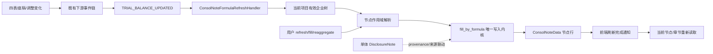

# 设计文档：合并附注节点级自动刷新与公式编排

> 需求：#[[file:.kiro/specs/consol-note-node-refresh-and-formula-orchestration/requirements.md]]
> 上游：#[[file:.kiro/specs/consol-node-key-isolation-and-shared-context/requirements.md]]、#[[file:.kiro/specs/consol-elimination-single-source-push/requirements.md]]
> 本设计建立在当前工作树已存在的 `consol_note_data.node_key`、节点树自动推导和附注表头修复之上。

## 一、现状核验与改动边界

### 1.1 已确认的生产事实

| 区域 | 当前实现 | 本 spec 的处理 |
|---|---|---|
| 节点公式内核 | `consol_note_formula_service.fill_by_formula()` 已调用 `load_view_context()`、`find_node()`、`node_measures()`，支持根节点 legacy 读取后复制到节点行，并保护 `manual_cells` | 作为唯一节点公式写入入口；旧入口只做参数适配和结果编排 |
| 旧刷新 | `refresh_note_by_formula()` 只计算 `filled_rows` 后返回 | 改为调用共享填入/保存服务，并返回持久化证据 |
| 批量套用 | `apply_all_formulas()` 从模板重建 `data` | 改用共享行更新逻辑，保留插入行、对象/二维数组和人工格 |
| 旧重新汇总 | `ReaggregateRequest` 未声明 `node_key` 等字段，`reaggregate_consol_notes()` 调用无节点的 `aggregate_section()` | 扩展显式请求模型；兼容壳转接节点级公式/聚合服务，保留原 response envelope |
| 模板分流 | `generate_consol_notes_with_flag()` 和级联 notes 没有稳定传递项目实际模板类型 | 在编排入口解析一次 `resolve_consol_standard()` / `_project_template()`，向生成、刷新和审计调用传递 |
| 事件链 | TB/调整/底稿事件没有节点级附注填入 handler；EventBus 去重键缺 `entry_group_id` | 新增独立 handler；修正去重身份并验证发布方 payload |
| 前端完成态 | 合并页刷新完成只刷新树，附注页只持有旧章节内存数据；stale 入口只清 stale | 增加节点/章节上下文刷新协议，树完成与附注持久化完成分开显示 |
| 存储边界 | 合并 V2 表格渲染使用 `ConsolNoteData`；单体附注使用 `DisclosureNote` | 保持两套结构；provenance 不冒充 V2 table_data |

### 1.2 现状 grep 与计数规则

实施前/每个代码批次前重新 grep 端点、调用方、EventPayload 字段和模板入口。所有数量只能作为当前快照，不能写成行号契约。关键基线是现有四个定向测试文件共 **98 passed, 9 warnings**；并发工作树已有大量修改，测试失败必须先与该基线和会话改动归因。

应复核的端点和符号包括：

- `refresh_note_by_formula`、`fill_note_by_formula`、`apply_all_formulas`、`audit_all_notes`、`audit_note`、`aggregate_data`；
- `ReaggregateRequest`、`reaggregate_consol_notes`、`aggregate_section`；
- `generate_consol_notes_with_flag`、`generate_full_consol_notes`、`refresh_all`；
- `EventPayload`、`_build_dedup_key`、`TRIAL_BALANCE_UPDATED`、`ADJUSTMENT_APPROVED`、`WORKPAPER_SAVED`；
- `onRefreshAll`、`onReaggregateNow`、`onReaggregateNotes`、`onNoteNodeClick`、`capturePageSnapshot`。

## 二、目标架构



核心不变量：

1. 金额上下文只来自现有合并 report view/calc basis/formula values；handler 不计算金额。
2. 任何合并附注写入都携带一个明确作用域：精确 `node_key` 或显式 `legacy_null`。
3. 自动 handler 只在上游事务成功提交后运行独立会话；失败可重试且不污染上游事务。
4. “完成”必须包含数据库新读可见的记录证据；内存 rows 或 HTTP 200 不足。

## 三、节点作用域与共享刷新服务

### 3.1 作用域

沿用 `consol_node_scope.resolve_node_scope()` 与附注已有 `_resolve_note_scope()` 的语义：项目/有效年度/章节先校验；显式 node_key 必须由当前树精确命中；根节点才允许 GET legacy NULL fallback；省略 node_key 的旧调用保持 NULL 兼容。query 参数优先于 body，空字符串不是省略。

建议把“计算并保存一个章节”收敛成 service 层共享操作，路由只负责：权限、请求解析、调用和 response envelope。服务结果至少含：

```python
{
    "project_id": project_id,
    "year": year,
    "node_key": node_key or "legacy_null",
    "section_id": section_id,
    "template_type": template_type,
    "status": "persisted|skipped|failed",
    "record_id": str(record.id) if record else None,
    "manual_preserved": [...],
    "filled_count": int,
    "error": None,
}
```

不引入新的金额算法；可在 `fill_by_formula()` 内部抽取最小共享函数，但只保留一个实际保存路径。

### 3.2 行形状与人工保护

共享服务必须先装载当前作用域记录，再以现有 `fill_rows()` 的行定位规则应用自动值：

- dict 行按稳定标签/行身份定位；
- 二维数组按表头和位置规则定位；
- 用户插入行继续保留；
- `manual_cells` 逐格保护，保护元数据损坏时返回可见失败；
- 保留原数据中的非目标字段、顺序和行形状；
- 结果写回后在同一事务 flush，路由/编排器按现有层级统一 commit；服务不自行 commit。

根节点从 legacy 复制时，复制动作和本次公式应用处于同一个事务/SAVEPOINT 语义中。保存成功后重新查询节点行，响应引用该行的 ID/version。

### 3.3 旧入口适配

旧入口不再拥有独立的“模板重建 + 保存”算法：

- `/refresh` 把请求的节点/标准/模板解析成共享刷新参数；
- `/apply-formulas` 对每个章节调用共享章节刷新并汇总逐章结果；
- `/audit` / `/audit-all` 复用同一作用域和读取上下文，审计结果不得改变自动/手工写入语义；
- `/aggregate` 仅负责聚合视图和结果编排，若它写入 V2 行则必须经共享保存服务；
- `reaggregate` 先兼容旧 section 列表，再把 `node_key`、standard/template_type 传到节点级服务。若历史端点本意只是生成草稿，响应中必须区分 `preview` 与 `persisted`，不能把内存结果称为已刷新。

## 四、Listed/SOE 模板与数据存储边界

1. 在生成/级联入口按项目解析 `resolve_consol_standard()`，通过 `_project_template()` 得到实际 `template_type`；下游函数不再依靠 SOE 默认值。
2. 项目标准、模板类型和章节绑定作为一次请求上下文向下传递，避免章节循环中再次猜测。
3. 合并 V2 的 `ConsolNoteData.data/table_data` 是表格渲染载荷；`DisclosureNote` 只承载单体附注内容。`_persist_consol_sections_v2()` 写入的 `DisclosureNote` provenance 只作来源/审计，不能被 `ConsolNoteTab` 当作合并二维表。
4. 标准解析失败按既有项目标准服务的可观测错误处理；不得静默回退到 SOE。确有历史兼容默认时，必须在结果标注 `template_fallback` 和原因。

## 五、事件自动刷新编排

### 5.1 触发边界

`TRIAL_BALANCE_UPDATED` 是附注自动刷新唯一的金额触发入口。`ADJUSTMENT_APPROVED` 继续由现有 handler 重算并发布该下游事件，附注 handler 不再直接重复刷新。`WORKPAPER_SAVED` 仅在事件明确声明影响附注公式的工作底稿/字段时进入刷新，否则返回 `skipped`。

事件 handler 的建议签名：

```python
async def handle_consol_note_formula_refresh(
    event: EventPayload,
) -> dict[str, object]:
    ...
```

它应：

1. 校验项目/年度/事件载荷并判断项目级 V2 开关；
2. 使用独立 async session，读取当前树一次，按稳定 `node_key` 去重；
3. 解析该项目标准和章节策略，逐节点调用共享刷新 service；
4. 每个节点/章节捕获异常，记录状态、原因和可重试上下文；
5. 返回 `refreshed/skipped/failed` 分项结果，失败不抛回上游事件提交路径；
6. 不把附注正文和凭据写日志。

节点遍历顺序固定为树服务输出的稳定顺序；同一 `node_key` 只执行一次。章节集合来自已有 V2 绑定/生成结果，不凭前端当前页签决定。

### 5.2 去重键

`EventBus._build_dedup_key()` 增加 `entry_group_id`，但只在 payload 实际携带时加入，避免把所有旧事件的 `None` 写成一个跨事件共享身份。发布方和事件构造器必须同步传递字段；调整类事件至少以 `(project_id, year, event_type, wp_id/publish_token, entry_group_id)` 分区。

测试必须先构造两个只差 `entry_group_id` 的真实 `EventPayload`，证明去重键不同，再验证同一组相同身份仍能 debounce；只测字符串函数不够。

### 5.3 事务与故障处理

上游 router/service 遵守“只 flush，外层 commit”规则。自动 handler 在提交后/事件处理线程里打开独立 session；一个节点失败时回滚当前工作单元/保存点并继续其他节点。handler 自身不修改上游事务状态；失败状态写入现有事件日志或可观察结果渠道，若没有专门表则先结构化日志+返回结果，不新增无审计的临时表。

## 六、前端刷新协议

### 6.1 上下文

`ConsolidationIndex.vue` 持有当前节点 `{code, name, nodeKey}` 和当前章节标识。刷新开始时保存 `{refreshId, projectId, year, nodeKey, sectionId}`；完成事件只允许提交到完全相同的上下文。

`ConsolNoteTab.vue` 暴露一个节点/章节刷新方法，例如：

```ts
async function reloadCurrentSectionAfterRefresh(context?: {
  refreshId?: string
  nodeKey?: string
  sectionId?: string
}): Promise<RefreshReloadResult> {
  ...
}
```

命名以现有组件风格为准，重点是保存前后上下文检查和真正 API 重读。不要复制第二个请求守卫；扩展已有 `noteRequestGuard`。

### 6.2 状态

前端至少维护树刷新与附注刷新两条状态轴：

- `tree_pending` → `tree_done` / `tree_failed`；
- `note_pending` → `note_done` / `note_failed` / `note_skipped`。

当前章节重读成功后才显示附注完成。章节重读失败显示中文原因并保持失败态。用户切换节点或章节时使旧 refreshId 失效。

### 6.3 stale 入口

`onReaggregateNow()` 必须调用真实节点感知 API，并把 `{section_ids, node_key, standard/template_type}` 传完整；成功后调用附注组件当前章节重读，失败显示错误。若 stale 仅由项目级标记产生且没有章节明细，API 应返回实际刷新章节/跳过原因供页面展示。

## 七、HTTP 与响应契约

- 保留 `ResponseWrapperMiddleware` 的 `{code,message,data}` 信封和现有权限依赖。
- 新增字段采用可选输入兼容旧客户端，但服务内部会把作用域规范化成明确的 `node_key` 或 `legacy_null`。
- 失败章节不能只放在普通 `rows` 字段中；响应至少带逐项 `results`/`failures` 和持久化 record id。
- 节点/标准/模板冲突为 4xx；自动 handler 的下游失败为结构化结果或日志，不改上游业务响应为失败。

## 八、测试设计

### 8.1 后端 ORM/service

使用真 SQLAlchemy ORM 行和独立事务，至少覆盖：

- 两个不同 node_key 保存同一章节并独立重读；
- 根节点 legacy NULL 回退、首次公式刷新 copy-on-write、legacy 行字节不变；
- `/refresh` 真落库、`manual_cells` 原值保持、对象行/二维数组和插入行；
- 非法 node_key、query/body 优先级、年度/项目/章节错误；
- reaggregate 请求显式 node_key/standard/template_type，旧客户端兼容 NULL；
- Listed/SOE 项目模板真实分流；
- 某节点/章节失败时其余结果和失败原因独立可见。

### 8.2 事件与 HTTP

通过真实 FastAPI `TestClient`/ASGI 请求走权限依赖、ResponseWrapper 和 Pydantic 输入；通过真实 EventBus 发布两个 `entry_group_id` 事件，检查 debounce 结果和 handler 独立 session fail-open。测试不能只 mock `fill_by_formula` 后断言“被调用”，必须在数据库新读或可观测结果中断言写入。

### 8.3 前端

Vitest 覆盖：刷新完成通知带当前节点/章节、当前章节 API 重读、stale 按钮发请求、状态转换、快速切换时旧响应不提交。ESLint 只针对改动区域；单区域 `vue-tsc` 通过后，用临时 TS2322 错误确认目标文件确实被 tsconfig 纳入，再删变异并复跑。

### 8.4 Playwright

开发环境可运行时，真实点击根/母公司/单户节点，观察报表与附注请求的 nodeKey；同章节在两个节点写入不同值后重读，确认互不串值；触发调整/刷新后等待“附注刷新完成”并检查后端新读；检查多级表头、标题、序号和 manual cell。网络/服务不可用时，记录具体端口、HTTP 状态或容器依赖，不把静态证据代替浏览器证据。

## 九、ADR

- **ADR-CNFO-001：`fill_by_formula()` 是合并附注唯一写入内核。** 旧入口适配参数和结果，不保留会覆盖人工格或只返回内存 rows 的旁路。
- **ADR-CNFO-002：刷新完成以持久化新读为准。** HTTP 200、toast 和内存对象都不是完成证据。
- **ADR-CNFO-003：`TRIAL_BALANCE_UPDATED` 是唯一金额触发点。** 调整审批通过现有下游事件进入；底稿保存只按显式影响声明触发。
- **ADR-CNFO-004：自动刷新独立会话、fail-open。** 下游附注错误不能回滚已提交的上游业务事务，但错误必须可观察、可重试。
- **ADR-CNFO-005：`entry_group_id` 是调整事件 debounce 身份。** 发布方和去重器必须共同携带/消费该字段。
- **ADR-CNFO-006：合并与单体附注存储不合并。** `ConsolNoteData` 负责合并 V2 表格渲染，`DisclosureNote` 负责单体记录和 provenance。
- **ADR-CNFO-007：模板类型由项目标准解析一次后向下传递。** 禁止默认 SOE 或由前端标签猜 Listed/SOE。

## 十、风险、降级与非目标

| 风险 | 处理 |
|---|---|
| 真实 PG/合并集团数据不可用 | 用真 ORM/SQLite 验证节点/行形状/事务；PG 与 Playwright 留为未验证并记录 |
| 章节绑定未覆盖所有公式 | handler 只刷新已有绑定章节，返回 skipped 原因；不宣称所有科目闭环 |
| 全量 `vue-tsc` OOM | 使用单区域 tsconfig + TS2322 变异证明，保留 OOM 原因 |
| 并发工作树修改同一文件 | 每批前重新读取；使用精确替换，不覆盖未知改动；失败先重新读取 |
| 自动刷新大批量影响性能 | 稳定节点/章节计划、去重和逐项结果；不在本 spec 引入无依据并发阈值 |
| 工作底稿节点级需求 | 明确留在 `consol-node-key-isolation-and-shared-context` 的范围外，另提 V/R spec |
| Listed/SOE 标准解析失败 | 4xx 或带原因的兼容 fallback，禁止静默 SOE |
