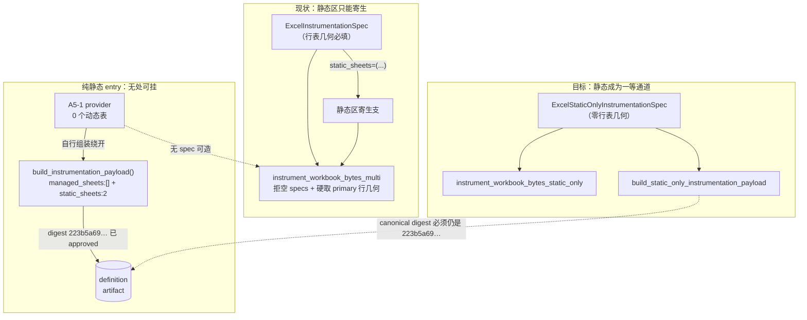
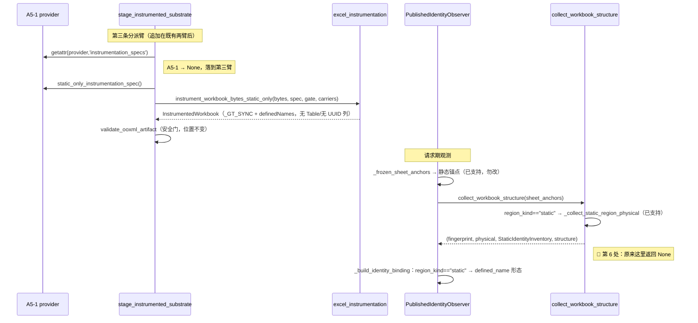
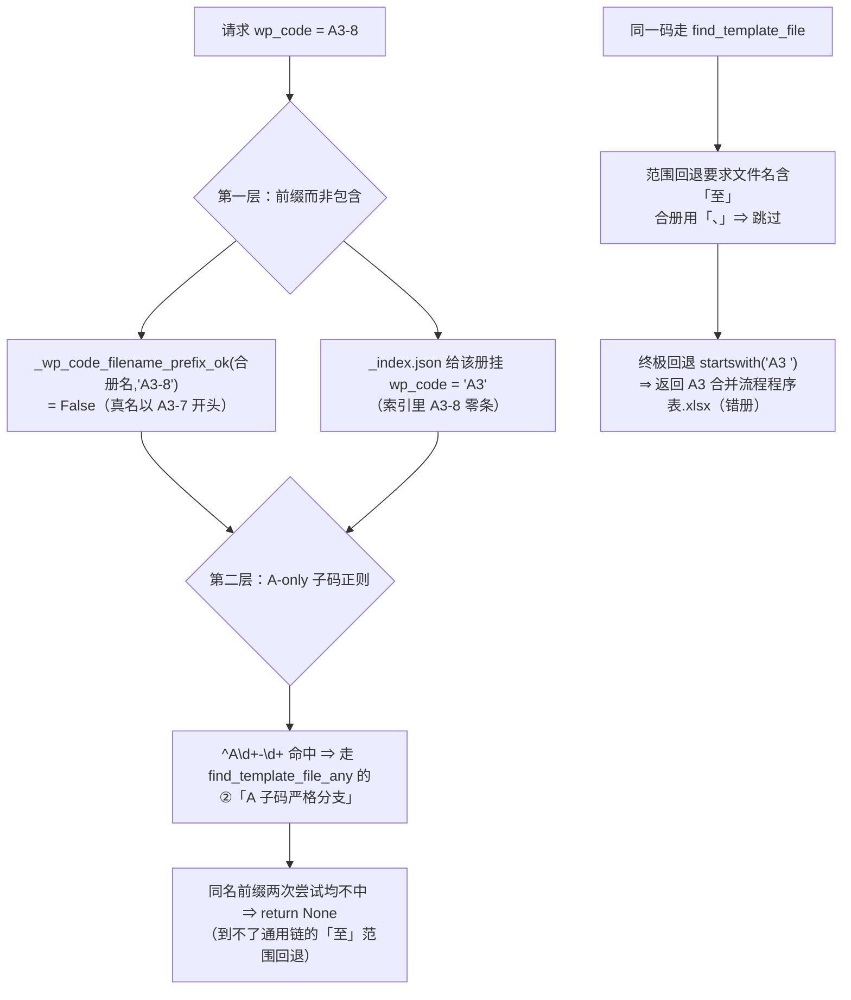

# Design Document: workpaper-sync-pure-static-lane-and-combined-workbook-resolution

## Overview

本 spec 交付**两条互不相干的 lane**，零文件重叠、可独立发布、可独立回滚。

**Lane A —— 纯静态 entry 的 instrumentation 通道。** canary `xlsx/gt-a51-cashflow-audit`
是平台首个「整个 entry 无任何动态行表」的 reviewed entry。它的四条 definition 已发布
`approved`，但 substrate 注入段整条走不通：instrumentation 管线从注入器、spec 校验、
payload 构建、substrate 组装，到身份观测器，**六处**预设「每个 entry 至少有一张动态行
表」。本 lane 把静态支从「寄生在动态 primary 上」上提为平台一等通道，使 canary 走完
发布链并通过一次真栈往返。

**Lane B —— 合册命名的 wp_code 解析。** `backend/wp_templates/A/` 下两本「一个文件装
两个 wp_code」的合册，其第二个码在 `wp_template_finder` 里解析不到自己所在的册：一路
返回 `None`，另一路返回**错的册**（父程序表）。根因是两层叠加，且平台既有的 A-only
正则同时是 D/E/F 十九本合册**得以工作**的原因 —— 修法必须同时评估两侧。

两条 lane 共同的交付纪律：所有计数类判据**现算**，spec 内不写死行号，锚点一律用函数名 /
常量名 / 端点字面量 / 源码形态特征。

---

## Architecture

### 一、复核结论：逐条实证与七处更正

任务书给的数字我全部独立复核（探针 `backend/scripts/analyze/_psl_p{1..5}_*.py`，交付后按
一次性探针纪律删除）。**属实的不再复述**，下面只记 (A) 复核通过的承重锚点、(B) 我算出与
任务书不一致、必须以现算值为准的七处。

#### 1.1 复核通过的承重锚点（现算值）

| 事实 | 现算值 |
|---|---|
| A5-1 权威模板 | `backend/wp_templates/A/A5-1 现金流量表审计.xlsx`，**60894 B**，sha256 `2a331368dad3aaf3ac922c8f46a0052e9ba1ec8c0a3ae0504edddc8153dab462`，与 `verify_template_sha256()` 相等 |
| A5-1 契约 | `review_status="reviewed"`，2 张受管 sheet，两张 `region_boundary_locator.region_kind == "static"`，`row_identity` 全 `None`，`has_dynamic_rows` 全 `False` |
| A5-1 definition digest | template `d1edfca4…`、instrumentation `223b5a69…`（契约内字段与守卫常量两处同值） |
| A5-1 provider 形态 | 无 `instrumentation_spec` / `instrumentation_specs`（两者 `getattr` 均 `None`）；有 `static_sheet_payloads()`（2 项）、`static_identity_bindings()`（2 项）、自组装 `build_instrumentation_payload()` |
| canary 交付台账 | `DELIVERED_PER_ENTRY_CONTRACTS` 内 1 行，`adapter_registered = False` |
| 合册 | `A/A3-7内部往来核对表、A3-8商誉减值测试.xlsx`，**436152 B**，5 sheet：`编制说明` / `A3-7内部往来核对表` / `A3-8商誉减值测试` / `A3-8-1可收回金额测试` / `GT_Custom` |
| 前缀判据 | `_wp_code_filename_prefix_ok(该文件名, "A3-8")` = **False**；同名对 `"A3-7"` = **True** |
| `_index.json` | 该册挂 `wp_code = "A3"`；索引里 `A3-8` / `A3-8-1` / `A2-2` 各 **0** 条 |
| 两路解析 | `find_template_file("A3-8")` → `A3 合并流程程序表.xlsx`（**错册**）；`find_template_file_any("A3-8")` → `None`；`A3-8-1` / `A2-2` 同形态 |
| 对照组 | `D2-2` / `E1-5` / `F2-40` 两路都命中各自范围册；三者 `_LEGACY_A_ONLY_SUB_CODE_RE.match` 均为 **False** |
| 多码册总数 | **21**（A 2 / D 7 / E 4 / F 8） |
| 分隔形态 | 顿号「、」**2**（全 A）· 范围「至」**19** · `~`/`～` **0** · 其他 **0**；2 + 19 = 21 ✓ 无交叠 |
| A-only 正则 | `_LEGACY_A_ONLY_SUB_CODE_RE = re.compile(r"^A\d+-\d+")`，源码注释自承「存量缺陷」并警告改成字母类无关会让数百码变 `None` |
| AST 守卫 | `test_task58_word_canonical_resolver.py::test_finder_no_longer_uses_a_only_regex_for_sub_code_decision` 真用 `ast.parse` + `ast.walk`，断言 `find_template_file_any` 这个 `FunctionDef` 内 `_resolve_most_specific_docx` 调用行号 < `_LEGACY_A_ONLY_SUB_CODE_RE.match` 调用行号，且**两者都必须存在**（`a_only_line is not None` 亦被断言） |
| 模块末尾重绑定 | `find_template_file` / `find_template_file_any` 被重绑定为覆盖层优先薄封装，权威侧留在 `*_unresolved` |
| Task 61 门 | probe **41** 条，`verdict` 分布 `{'': 41}`（全空），`has_validator is False` **38** 条，`lane_entry_keys = ['word-lane/f2-22-stocktake-plan', 'word-lane/f2-23-stocktake-summary']` |
| Word adapter 禁令 | `PENDING_ENGINE_ADAPTERS` 恰 1 行 docx，`blocking_task='59,60,61'`，`forbidden_paths` 含 `app/services/workpaper_sync/adapters/word.py` |
| A 域回归基线 | 5 文件 **159 passed**（`test_a51_component_type_routing` / `test_a_cycle_foundation_canary` / `test_a_entry_connection_blockers` / `test_a_lane2_docx_authority` / `test_a_lane3_runtime_exceptions`） |

#### 1.2 更正 ①：契约分母不是 60，是 62 / 51

`backend/data/workpaper_sync_contracts/*.json` 现算 **62** 份 = `.candidate.` **10** 份
+ 缺 `review_status` 字段 **1** 份（`_l_cycle_positional_key_mapping.json`）
+ `review_status == "reviewed"` **51** 份。

「0 动态表」的份数随分母变：

| 分母 | 0 动态表份数 | 成员 |
|---|---|---|
| 全部 62 份 json | **4** | `_l_cycle_positional_key_mapping.json` · `a51.cashflow_audit.json` · `k2.adjudication_derived.candidate.json` · `l4.bonds_payable.candidate.json` |
| 非 candidate（52） | **2** | `_l_cycle_positional_key_mapping.json` · `a51.cashflow_audit.json` |
| **`review_status == "reviewed"`（51）** | **1** | **`a51.cashflow_audit.json`** |

所以「A5-1 是唯一 0 动态表」**只在 reviewed 分母下成立**，且 reviewed 分母是 **51** 不是
60。`60` 这个数有确定来源：`phase5_a51_cashflow_audit.build_instrumentation_payload()` 的
行内注释写着「实测 60 份契约里唯一如此的 reviewed 契约」—— 那是写入时的快照，现已过期。
本 spec 的判据一律写成「现算 reviewed 分母下唯一」+ 禁写死 51，并把该注释的更正列为任务。

> 这是项目铁律①的典型形态：`slice`/注释里的冻结计数要区分「结构性零反驳」与「快照过期」。
> 此处是**快照过期**，结论（唯一性）不变，分母变了。

#### 1.3 更正 ②：「真缺陷 3 码」须拆成两个分母，不能合并成一个 3

| 分母 | 值 | 成员 |
|---|---|---|
| 合册**文件名声明**了、却解析不到本册的码 | **2** | `A2-2` · `A3-8` |
| 册内**有 sheet**、但文件名**未声明**、也解析不到本册的码 | **1** | `A3-8-1` |
| 需要本 lane 修复的码合计 | **3** | 上两行之和 |

我的第一轮枚举（按文件名正则 `[A-Z]\d+(?:-\d+)*` 抽码）只得 **2**，因为 `A3-8-1` **不在
文件名里**，只在 sheet 名 `A3-8-1可收回金额测试` 里。任务书的 3 是对的，但它不是「文件名
声明的缺陷码数」—— 把两个分母合成一个 3 会让扫描器判据写错（按文件名扫永远得 2，会被当成
漏抓）。故两者在 requirements 里各自成条，且 `A3-8-1` 的修复机制与另两个**不同**（见 §4.3
的祖先码规则）。

#### 1.4 更正 ③：slice 的错处不是「说没有册」

slice 的权威字段名是 **`entry_id`**（不是 `entry_key`；`entries[0]` 的 keys 里
`'entry_key' in ...` 现算 **False**）。`xlsx/gt-a38-goodwill-impairment` 的 `template_ref`
逐字原文：

```json
{
  "resolution_kind": "literal_sheet_name",
  "resolver": "backend/app/services/wp_template_finder.py::find_template_file_any",
  "sheet_name_literal": "A3-8商誉减值测试",
  "why_null": "字面 sheet-name 不是 wp_code（含中文表名）⇒ `find_template_file_any` 现算返回 None。这是**真实缺陷**（见 BP-6），不是本 slice 没查。",
  "workbook": null,
  "workbook_format": null
}
```

它**没有**写「没有这本册」。它的两处问题是**不同性质**的，必须分开登记：

1. **`workbook: null` 是假事实** —— 册在磁盘上，436152 B。这一条是纯错。
2. **`why_null` 的归因不完整** —— 它把 `None` 只归给「字面 sheet 名不是 wp_code」，隐含
   「传对 wp_code 就能解析」。现算反驳：`find_template_file_any("A3-8")` **也是 `None`**
   （四个探针 `A3-8商誉减值测试` / `A3-8` / `A3-8-1可收回金额测试` / `A3-8-1` **全 None**）。
   所以照它做只修第二步（宿主改传 wp_code）**仍然拿不到册**。这一条不是「写错」，是
   「只说了第二层、漏了第一层」，危害是误导修复顺序。

#### 1.5 更正 ④：勘误站点是 2 个测试文件 4 个测试方法，不止 1 处

任务书只点了 `test_a_entry_connection_blockers.py::test_a38_workbook_absent_on_disk`。现扫
另有一个文件三个方法同源：

| 站点 | 断言 | 性质 |
|---|---|---|
| `test_a_entry_connection_blockers.py::test_a38_workbook_absent_on_disk` | `rglob("A3-8*")` 后 `assert not found` | 假事实（glob 锚定文件名开头，真名以 `A3-7` 开头 ⇒ 恒 0 命中） |
| `test_a_lane3_runtime_exceptions.py::TestBP6NoAuthoritativeBook::test_a38_workbook_is_null` | `assert e["template_ref"].get("workbook") is None` | 把 slice 的假事实固化成守卫 |
| 同类 `::test_a38_template_not_on_disk` | `rglob("A3-8*")` 后 `assert len(candidates) == 0`，docstring 写「真因不只是 sheet 名写法，而是根本没有这本册」 | 假事实 + **归因结论本身是错的** |
| 同类 `::test_other_codes_resolve_but_a38_does_not` | 同一 `rglob` 口径做「变异证明」 | 变异证明建立在假事实上 ⇒ 证明无效 |

现算对照：`rglob("A3-8*")` = **0** 命中，`rglob("*A3-8*")` = **1** 命中（就是那本合册）。
0 与 1 的差就是这四条断言的全部成因。

**连带更正：归档 spec 的 AC-46 结论是错的。** `test_a_lane3_runtime_exceptions.py` 的
`TestBP6NoAuthoritativeBook` docstring 写「BP-6: 无权威册（a38），归因须更正」，其更正结论
是「真因是根本没有这本册」。该结论与磁盘事实矛盾。按项目铁律「已归档 spec 一律不回填修改
（append-only）」，AC-46 的**再更正**登记在本 spec，并只改生产代码侧的守卫。

#### 1.6 更正 ⑤：Lane A 有第 6 处阻塞，且它**先炸**

任务书列了 5 处。现读发现第 6 处，且它在执行顺序上**早于**第 5 处：

* 站点：`published_identity_observer.PublishedIdentityObserver._observe_workbook`，返回
  字典里的 `"identity_inventory_sha256": canonical_digest(inventory.inventory_digest_input)`。
* 机理：`inventory` 是 `collect_workbook_structure` 的第 3 个返回值 `primary_inventory`。
  它初值 `None`，**只在动态 Excel-Table 分支内**赋值（`if primary_inventory is None:` 现算
  仅 **1** 处，位于动态分支）。静态锚点走 `region_kind == "static"` 分支后直接 `continue`。
  ⇒ 全静态锚点集合下 `primary_inventory` 恒 `None`，`_observe_workbook` 内**无** `None`
  守卫（现算 `'inventory is None' in src` = False）。
* 后果：纯静态 entry 在请求期观测抛的是裸 `AttributeError`（`'NoneType' object has no
  attribute 'inventory_digest_input'`），**不是**设计好的 `FrozenChildUnusableError`。
* 顺序实证（位置值**现算，禁写死**）：`observe()` 源码内 `_observe_workbook` 的首现位置
  **早于** `_build_identity_binding` 的首现位置 —— 用 `inspect.getsource(observe)` 后取两个
  名字的 `str.find` 偏移比较，并用「相对行序」作第二口径互证（两口径须同结论）
  ⇒ 第 6 处先触发，任务书列的第 5 处（`row_identity` 空 ⇒
  `FrozenChildUnusableError`）**根本到不了**。
* 覆盖面缺口：`test_a_entry_connection_blockers.py` §6 的六条阻塞断言**没有**一条覆盖这个
  站点 ⇒ 现有守卫对它是空白。

这一处必须进 requirements，否则 Lane A 落地后第一次真栈往返会撞裸 `AttributeError`，而
「静态 binding 已支持」的结论会被误判成已完成。

#### 1.7 更正 ⑥：`gate.assert_carrier_allowed('excel_table')` **不抛异常**，它不是硬阻塞

任务书把注入器里两条 `gate.assert_carrier_allowed` 当阻塞列。现算 A5-1 自己的 gate：

```
allowed_carriers  = ['defined_name', 'excel_table', 'hidden_sheet', 'hidden_uuid_column']
forbidden_anchors = ['sheet_display_name', 'sheet_id']
assert_carrier_allowed('excel_table')       -> PASS
assert_carrier_allowed('hidden_uuid_column') -> PASS
```

四个载体**全部放行**（gate 的真源是 Task 5 探针门，不是 entry 的 `IDENTITY_CARRIERS`）。
所以这两条 assert 走纯静态也不会红。真正的问题在**它们的下游**：
`build_instrumentation_payload_for_sheets` 把 `identity_carriers` 写成
`list(sorted(gate.allowed_carriers))` = 全 4 个，而 A5-1 的冻结 payload 只声明
`IDENTITY_CARRIERS = ("defined_name", "hidden_sheet")`（模块注释明写「**不声明**
`excel_table` / `hidden_uuid_column` —— 声明了它们等于宣称有一套本 entry 根本不写的载体」）。

⇒ 这是**语义过度声明 + digest 不相等**，不是「gate 拒绝」。写成「gate 拒绝」会让实现者去
改 gate（错的方向）；正确方向是新通道自带显式 carriers 入参。

#### 1.8 更正 ⑦：§6 现有断言是 6 条不是 5 条，且其中 1 条不是平台阻塞

`TestStaticOnlyInstrumentationGap` 现有 **6** 个阻塞断言方法（docstring 标号 阻塞①~⑥），
而同文件顶部阻塞表写「五处全预设」。两者差异有实义：

| 标号 | 测试方法 | 站点 | 是不是平台阻塞 |
|---|---|---|---|
| ① | `test_multi_injector_rejects_empty_specs_and_hardcodes_row_geometry` | `instrument_workbook_bytes_multi` | 是 |
| ② | `test_instrumentation_spec_requires_row_table_geometry` | `ExcelInstrumentationSpec` 字段集 | 是 |
| ③ | `test_static_only_spec_construction_is_really_rejected` | 同类 `__post_init__`（真构造证明） | 是（与②同类不同机理） |
| ④ | `test_a51_provider_has_no_row_spec_by_design` | A5-1 provider 自身状态 | **不是** —— 这是纯静态的**正确状态** |
| ⑤ | `test_stage_substrate_only_knows_row_spec_entry_points` | `stage_instrumented_substrate` | 是 |
| ⑥ | `test_identity_observer_main_binding_requires_row_identity` | `_build_identity_binding` | 是 |

另：`build_instrumentation_payload_for_sheets`（任务书第 3 处，确有 `if not specs: raise`）
在 §6 里**没有**对应断言 —— 第二处覆盖面缺口。

**结论：平台代码站点合计 6 处** = 任务书 5 处 + §1.6 新增的 `_observe_workbook`；§6 现有
断言覆盖其中 4 处（①②③⑤⑥ 去掉不是阻塞的④，再算上②③同站点），漏 `build_instrumentation_payload_for_sheets`
与 `_observe_workbook` 两处。

#### 1.9 「平台已支持纯静态」清单（禁写成阻塞，会误报）

全部现读确认存在，requirements 里只能作为**正面判据**（对照组），不得列为待做：

| 站点 | 现读事实 |
|---|---|
| `definitions.validate_instrumentation_payload` | 不要求 `managed_sheets` 非空 |
| `published_identity_observer._frozen_sheet_anchors` | 迭代 `("managed_sheets", "transposed_sheets", "static_sheets")` 三集合，按 `region_kind == "static"` 产出静态锚点（键只有 `sheet_key` / `defined_name` / `anchor` / `region_kind`） |
| `published_identity_observer._collect_static_region_physical` | 存在；按 workbook-scope definedName 解析物理 sheet 名，命中 0 或 >1 均显式 `ValueError` |
| `collect_workbook_structure` | 含 `region_kind == "static"` 分派臂 |
| `excel_extract` | `BindingKind.static_region` · `is_static_region()` · `ExcelIdentityBinding.kind` 派生（有 `defined_name` 即静态） · `_resolve_static_region` · `_extract_static_projection` · `managed_tables_of` / `_managed_coordinates` / `_needed_columns_and_rows` 四处静态分派 |
| `excel_materialize` | `_plan_static_writes`，且 `plan_managed_writes` 首行 `if is_static_region(binding)` 分派 |
| `ExcelInstrumentationSpec.static_sheets` | 寄生字段在；`instrument_workbook_bytes_multi` 有静态注入支（只写 definedName，必要时新建 `<definedNames>` 块） |

既有静态区（D4-33 / D4-8 / D4-13 / D2-1 / D1-4 / E1）**全部寄生在同 entry 的动态 primary
spec 上**（`static_sheets=(...)`），因此不受本缺口影响。缺口**只**影响「整个 entry 无动态
表」这一形态 —— 这是 Lane A 零回归的结构性理由。

---

### 二、Lane A 架构

#### 2.1 现状与目标



目标态的三条硬边界：

1. **不碰 `ExcelInstrumentationSpec`。** 新增独立类型，不给既有类加可选字段、不放宽
   `__post_init__`。理由：19 本寄生静态区 + 全部动态 entry 都靠那些校验，放宽即全域失去
   保护，且 §6 阻塞②③ 会以「行表几何变可选」为由打红（那条红是**正确的**警报）。
2. **digest 不变式（本 lane 最强约束）。** 见 §2.3。
3. **DEC-3 不可绕。** 禁给纯静态 sheet 注退化动态表（1 行 Table + UUID 列）当载体 ——
   归档 spec `.kiro/specs/_archive/15-workpaper-sync-engine-hardening/workpaper-sync-static-cell-sheet-writeback/`
   的 DEC-3 明禁。新通道的注入器**结构上**不具备写 Table / 隐藏列的能力（不接受这些入参），
   使违反 DEC-3 不是「靠自觉」而是「写不出来」。

#### 2.2 六处阻塞的处置矩阵

| # | 站点 | 机理（现读） | 处置 | 是否改既有行为 |
|---|---|---|---|---|
| 1 | `instrument_workbook_bytes_multi` | `if not specs: raise`；`_GT_SYNC` 段硬取 `primary.{footer_row, uuid_col, table_name, table_ref, first_data_row, last_data_row}` 六项；`primary_sheet_id = _sheet_id_for(wb, primary.managed_sheet)` | **旁路**：新增 `instrument_workbook_bytes_static_only`，原函数一字不改 | 否 |
| 2 | `ExcelInstrumentationSpec.__post_init__` | 强校验行区间 / `footer_row > last_data_row` / `uuid_col` 在 `managed_last_col` 右侧 / `table_name` 合法 OOXML displayName | **旁路**：新增 `ExcelStaticOnlyInstrumentationSpec`，自带静态语义校验 | 否 |
| 3 | `build_instrumentation_payload_for_sheets` | `if not specs: raise`；`identity_carriers` 写 `sorted(gate.allowed_carriers)`（过度声明，见 §1.7） | **旁路 + 上提**：新增 `build_static_only_instrumentation_payload`，把 A5-1 provider 里那份自组装搬上来 | 否 |
| 4 | `stage_instrumented_substrate` | 只认 `instrumentation_specs` / `instrumentation_spec` 两个 provider 入口名；现算函数体内 `"static"` 与 `"region_kind"` 均**不出现** | **加第三条分派臂**（追加在既有两臂之后） | 否（既有 provider 先命中原臂） |
| 5 | `_build_identity_binding` | 契约无带 `row_identity` 的表即 `FrozenChildUnusableError`；取 `anchors["table_name"]` / `anchors["uuid_column_letter"]`，而静态锚点不带这两键 | **加静态臂**：按 `anchors["region_kind"] == "static"` 走 defined-name 形态 binding | 否（动态路径判据原样保留） |
| 6 | `_observe_workbook` | `canonical_digest(inventory.inventory_digest_input)` 无 `None` 守卫；`inventory` 在全静态锚点下恒 `None` | **消除 `None` 而非特判**：让 `collect_workbook_structure` 在静态路径返回真实的静态清册对象 | 否（动态路径仍返回原对象） |

「旁路而非放宽」是本 lane 的总策略：六处里 3 处旁路、3 处加分派臂，**零处**放宽既有校验。
这使 A 域 159 passed 里除 §6 之外的断言不受影响（§6 变红是设计意图，见 §2.6）。

#### 2.3 digest 不变式（本 lane 最强约束）

canary 的 instrumentation definition **已经 approved 落库**，digest `223b5a69…` 同时出现在
三处：契约 `a51.cashflow_audit.json` 的 `instrumentation_definition_sha256`、守卫常量
`CANARY_INSTRUMENTATION_DEFINITION_SHA256`、以及真库 artifact 行。

⇒ **把 payload 组装上提到平台必须是纯重构：`canonical_digest(新平台构建器输出)` 必须**
**逐位等于 `canonical_digest(现 provider 自组装输出)`。**

这条约束把「上提」从一个开放式重构变成一个有唯一正确答案的任务，并给出天然验收判据
（同一 digest 常量三方相等 + 新旧两条构建路径输出相等）。它同时决定了新构建器的签名必须
能表达 provider 现在表达的每一个差异点：

| 冻结 payload 的特征 | 与平台通用构建器的差异 | 新构建器如何表达 |
|---|---|---|
| `identity_carriers = ["defined_name", "hidden_sheet"]` | 通用构建器写 `sorted(gate.allowed_carriers)` = 4 项 | 显式 `identity_carriers` 入参（不从 gate 推） |
| `identity_anchors = ["defined_name_ref"]` | 通用构建器默认含 `excel_table_sheet_association` | 显式 `identity_anchors` 入参 |
| `managed_sheets = []` | 通用构建器恒非空 | 结构上无此概念 |
| **无** `row_uuid_disposition` 键 | 通用构建器恒写 4 条行 UUID 处置 | 结构上不写（纯静态无行身份，写了等于宣称一套不存在的规则） |
| **无** `transposed_sheets` 键 | 仅在非空时写 | 同 |
| `cell_geometry` 只有 `anchor_role` / `note` / `sheets[]`，`sheets[]` 元素只有 `sheet_key` / `managed_range` / `region_kind` | 通用构建器顶层还写 `managed_range` / `table_ref` / `footer_row` | 静态形态专属几何块 |
| `hidden_metadata_sheet.keys = list(REQUIRED_GT_SYNC_KEYS)`（全 7 键） | 相同 | 原样复用常量，**不新建静态子集** |
| `forbidden_anchors = sorted(gate.forbidden_anchors)` | 相同 | 原样 |

最后一行有个必须显式裁决的点：`REQUIRED_GT_SYNC_KEYS` 现算 7 键，含 `GT_MANAGED_SHEET_ID`
与 `GT_ROW_UUID_COLUMN`。冻结 payload 声明了全 7 键，**不能改**（改则 digest 变）。于是注入
器写 `_GT_SYNC` 时必须给出这 7 个键的值，而纯静态 entry 没有 UUID 列。

**裁决：`GT_ROW_UUID_COLUMN` 写空串 `""` 作为显式「无 UUID 列」哨兵，并用可验证的三联判据**
**把「空」钉成事实而不是含糊**：

* `_GT_SYNC` 里 `GT_ROW_UUID_COLUMN == ""`；
* 注入产物 zip 内**不存在** `xl/tables/` 下任何本 entry 的 Table 部件；
* 注入产物内受管 sheet 的列集合与源模板逐列相等（无新增隐藏列）。

三条同时成立才算「静态注入正确」。只写第一条会退化成「声明了一个空的列」这种含糊态。
注：`GT_ROW_UUID_COLUMN` 的值在**注入产物字节**里，不在 payload 里 ⇒ 写空串**不影响** digest。
`GT_MANAGED_SHEET_ID` 有静态语义（definedName 指向的那张 sheet 的 sheetId，且平台已把它
标注为「降级、非运行时锚点」），照实写。

#### 2.5 发布链与观测链的分派



**`stage_instrumented_substrate` 第三臂的顺序裁决。** 既有两臂是
`instrumentation_specs` → `instrumentation_spec`（`getattr` + `callable`）。新臂追加在
**最后**，并在进入新臂前 fail-closed 断言：provider 暴露 `static_only_instrumentation_spec`
时**不得**同时暴露 `instrumentation_spec(s)` 任一（DEC-3 的结构化守卫 —— 同时有两种 spec
意味着有人给纯静态 entry 造了行表 spec）。

不采用「三者恰暴露其一」的统一断言：现算既有 provider 中存在同时暴露
`instrumentation_spec` 与 `instrumentation_specs` 的形态（`_dynamic_column_bindings` /
`_static_region_bindings` 都写了 `getattr(...,'instrumentation_specs')` 不可用时回落
`instrumentation_spec` 的双入口逻辑），统一断言会打红既有 entry。

**`_build_identity_binding` 静态臂。** 静态锚点只带 `sheet_key` / `defined_name` /
`anchor` / `region_kind` 四键，故静态臂：

```python
# 伪码：静态臂与动态臂的判据对称，都禁「随手挑第一张」
if str(anchors.get("region_kind") or "") == "static":
    static_tables = [
        (sheet.sheet_key, table.table_key)
        for sheet in contract.sheets
        for table in sheet.tables
        if table.row_identity is None
    ]
    if not static_tables:
        raise FrozenChildUnusableError("契约未声明任何静态表 —— 静态受管区无从绑定", ...)
    matched = [tk for sk, tk in static_tables if sk == anchors["sheet_key"]]
    if len(matched) != 1:
        raise FrozenChildUnusableError(
            f"静态主 binding 未能唯一对齐 sheet_key={anchors['sheet_key']!r}"
            f"（匹配 {matched!r}）—— 不得随手挑第一张", ...
        )
    return ExcelIdentityBinding(
        defined_name=anchors["defined_name"],
        table_key=matched[0],
        metadata_sheet=GT_SYNC_SHEET_NAME,
    )
# 动态路径：以下原样保留（含「契约未声明任何带 row_identity 的表」判据与
# anchors["table_name"] / anchors["uuid_column_letter"] 两处取值）
```

静态 binding 的形态与 provider 现有 `static_identity_bindings()` 一致
（`ExcelIdentityBinding.kind` 是派生属性：有 `defined_name` 即 `static_region`），
故 `excel_extract` / `excel_materialize` 侧零改动。

**第 6 处的消除方式：返回真实清册，而不是特判 `None`。**
`collect_workbook_structure` 的静态分派臂当前 `continue` 后不产 inventory。设计改为：静态臂
累积观测到的 `(sheet_key, defined_name, physical_sheet_name)` 三元组，循环结束时若
`primary_inventory is None` 且**存在**静态观测结果，则构造静态清册：

这样 `_observe_workbook` 的 `canonical_digest(inventory.inventory_digest_input)` **无需任何
改动**，且 `identity_inventory_sha256` 对纯静态 entry 仍是一个有反漂移意义的真实观测值
（definedName 被删/改名/指向别的 sheet 都会改 digest），而不是补一个假值或让字段变 Optional。

> 🔴 **需要消费方审计（显式任务，不得假设为零成本）**：`PublishedObservation.identity_inventory`
> 与 `collect_workbook_structure` 第 3 返回值的全部消费方须逐个现读，确认它们只用
> `row_uuids` / `inventory_digest_input` 两个成员，或为静态形态补分派。任务书未提此项，
> 但不做会把 `AttributeError` 从一个站点搬到另一个站点。

#### 2.6 §6 守卫的同步更新（必做，且方向已由守卫自己写明）

Lane A 落地后 `test_a_entry_connection_blockers.py` 的 §6 **按设计变红**。哪几条会红，我做了
静态敏感性预判（现算，非推测）：

| 判据 | 现算现状 | Lane A 落地后 | 会红？ |
|---|---|---|---|
| 解除信号① `static_injection_entry_points(top_level_function_names(XI)) == ()` | `excel_instrumentation` 顶层函数 **32** 个，「含 instrument 且含 static」命中 **0** | 新增 `instrument_workbook_bytes_static_only`（同时含两词） | **红** |
| 解除信号② `"region_kind" not in _build_identity_binding` | 现算 `False`（不含） | 静态臂引入 `region_kind` | **红** |
| 阻塞⑤ `"static" not in stage_instrumented_substrate` 且 `"region_kind" not in ...` | 现算两者都 `False` | 第三臂含 `static` | **红** |
| 阻塞① 注入器仍拒空 specs + 六项 `primary.*` | 原函数不改 | 不变 | 绿 |
| 阻塞②③ 行表几何仍必填 + 真构造仍被拒 | 既有类不改 | 不变 | 绿 |
| 阻塞④ provider 无 `instrumentation_spec(s)`、有静态三件套、`managed_sheets==[]`、`static_sheets` 2 张 | provider 新增的是 `static_only_instrumentation_spec`（名字不在断言的两个名字里）；`build_instrumentation_payload` 保留为委派门面 | 不变 | 绿 |
| 阻塞⑥ `_build_identity_binding` 仍含 row_identity 判据 + 两处取值 | 动态路径原样保留 | 不变 | 绿 |
| 已达成① digest 三方相等 | — | digest 不变式保证 | 绿 |

守卫自己写明了同步动作（解除信号①的断言消息逐字）：「① 删本 §6 的阻塞段 ② 把 A5-1
provider 的 static-only payload 组装上提到该入口 ③ 更新 `DELIVERED_PER_ENTRY_CONTRACTS`
里 canary 的 `adapter_registered`」。本 spec 把这三条写成显式任务，并追加两条：

* ④ 补 §6 覆盖面缺口：`build_instrumentation_payload_for_sheets` 与 `_observe_workbook`
  两处原本无断言（§1.8），改造后它们变成「已支持静态」的正面判据，须建立新断言；
* ⑤ 更正 `build_instrumentation_payload()` docstring 里「60 份契约」的过期分母（§1.2），
  改为现算口径描述 + 不写死数字。

`adapter_registered` 由 `False` 翻 `True` 的**前置条件**：真栈往返（§2.7）通过。代码改完但
往返未做时，该字段**保持 `False`**，任务按项目铁律标 `[ ]*` + 「代码已改但未实测」措辞 ——
不得先翻字段再补实测。

#### 2.7 真栈往返验收

环境（任务书给定，已知就绪）：后端 9980 / 前端 3030 / `audit-onlyoffice` healthy /
登录 `admin/admin123`（token 在 **sessionStorage**，非 localStorage）/
`wpId=2246b5c0-19c3-4d66-bfb2-72d9afdc2996` `projectId=c8621493-70aa-46a9-8285-e0674e4e1418`。

往返判据（四步，缺一步不算通过）：

1. HTML 侧改一个 editable cell（A5-1 契约现算 24 个 editable 字段）并保存；
2. 同步到 OO，在 OO 侧读到同值；
3. 在 OO 侧改另一个 editable cell 并保存；
4. 回读 HTML，两处值都与各自最后一次写入相等，且**公式保护列未被覆盖**（审定表公式列 G
   共 8 个 + 勾稽核对公式列 B 共 7 个，契约标 protected）。

另加一条负向判据：往返后重新观测，`recomputed_structure_hash` 与发布时冻结值相等（证明
往返没有动结构）。

> 真栈往返**不是**可选项：`getDiagnostics` 过与单测全绿都抓不到运行时接线问题（项目铁律）。
> 但它依赖 start-dev.bat 环境 ⇒ 若环境不可用，该任务标 `[ ]*` 并如实写「待环境」，**不得**
> 因此翻 `adapter_registered`。

---

### 三、Lane B 架构

#### 3.1 两层根因



两路的失效形态**不同**，危害也不同：`find_template_file_any` 返回 `None`（可见失败），
`find_template_file` 返回**错的册**（静默错答，更坏）。两者都要修。

#### 3.2 为什么不能改 A-only 正则，也不能只改数据

**不能改正则。** 源码注释自承 `^A\d+-\d+` 是存量缺陷，并记录了实测结论：改成字母类无关会
让 `D2-2` / `E1-3` 这类 Excel 子表也走子码分支，而它们的真实载体是范围式父文件，子码分支的
同名前缀判据匹配不到 ⇒ 数百个 wp_code 变 `None`。现算佐证：D/E/F 十九本合册的码**零缺陷**，
正是因为这条 A-only 正则放它们走通用链。⇒ 正则语义保持不变。

**不能只改 `_index.json`。** 这条捷径必须显式否决，否则实现者会先试它。现读 `find_template_file_any`
的 A 子码分支用的是 `_match_filename_prefix(e["filename"], wp_code)`（按**文件名**前缀），
**不是** `e["wp_code"] == wp_code`。现算 `_match_filename_prefix("A3-7内部往来核对表、A3-8商誉减值测试.xlsx", "A3-8")`
= `False`（两个判据都要求文件名以 `A3-8` 起头）⇒ **给索引补一条 `wp_code="A3-8"` 的记录对
该分支毫无作用**。数据修法在此结构上无解。

**override 表也绕不过。** `backend/app/data/wp_code_overrides.json`（1526 条）里 `A3-8` 的值是
componentType 而非模板路径，且 finder 不读该表。

#### 3.4 两处插入点（加法，零既有行为变更）


**插入位置的理由（逐条现算支撑）**：

* `find_template_file_any` 插在两次同名前缀尝试**之后**、`return None` **之前** ⇒ 当前能
  解析的 A 子码（如 `A3-7`，现算命中合册本身）在更早的步骤已返回，行为不变；当前返回
  `None` 的才进新步骤。
* `find_template_file` 插在范围回退**之后**、终极回退**之前** ⇒ `D2-2` / `E1-5` / `F2-40`
  现算在**范围回退**命中（三者的前缀判据均 `False`，靠 `至` 范围匹配），位置在新步骤之前
  ⇒ 完全不进新步骤；只有原本会掉进「终极回退抢父程序表」的码才进新步骤。
* 两处都**不动** `_LEGACY_A_ONLY_SUB_CODE_RE.match` 与 `_resolve_most_specific_docx` 的
  调用位置与先后 ⇒ AST 守卫（要求两个调用都在且 docx 探测更早）不受影响。
* 两处都**不动**模块末尾的重绑定与 `*_unresolved` 别名 ⇒ 覆盖层优先语义不变。

#### 3.5 两种缺陷形态禁合并（修复后的期望终态不同）

| 码 | 形态 | 册内对应 sheet | 修解析后的终态 |
|---|---|---|---|
| `A3-8` | 文件名声明 + 册内有 sheet | `A3-8商誉减值测试` | **可用**：解析到册 + 能指向 sheet |
| `A3-8-1` | 文件名未声明（祖先 `A3-8` 声明）+ 册内有 sheet | `A3-8-1可收回金额测试` | **可用**：同上，走祖先规则 |
| `A2-2` | 文件名声明 + 册内**无** wp_code 形态 sheet | 现算 22 张 sheet（`temp_temp__` / `说明` / `参数` / `报表格式` / `试算` / `Sheet1` / `未审报表` / `期初核对` / `TB` / `TB(期初)` / `调整事项汇总表` / `' '` / `CF调整` / `审定报表` / `CF主表核查` / `CF附表核查` / `未审BS分析` / `未审PL分析` / `未审比率分析` / `已审BS分析` / `已审PL分析` / `'已审比率分析 '`），以 `A2-2` 起头的 **0** 张 | **仅册可解析**：sheet 层仍无从指向，是**独立的**模板供给缺口，本 lane 不承诺修 |

`A2-2` 必须单独成条并如实写「修好解析也无 sheet 可指」。把三码合成一条「修好就能用」会
在验收时制造假绿。

#### 3.6 a38 两步的顺序（AC-46，不可颠倒）

* **第一步（本 lane）**：解析层 —— `A3-8` / `A3-8-1` 能拿到合册路径。
* **第二步（不在本 lane）**：宿主层 —— slice 记录的 `resolution_kind="literal_sheet_name"` /
  `sheet_name_literal="A3-8商誉减值测试"`，即宿主传中文字面 sheet 名而非 wp_code。

顺序不可颠倒的实证：现算 `find_template_file_any("A3-8")` = `None`。即使第二步先做完（宿主
改传纯 wp_code），解析仍返回 `None` ⇒ 第二步单独做完**零收益**。反之第一步做完后，第二步
才有意义。这条实证同时是 §1.4 更正 ③ 的依据。

本 lane 只做第一步，并在 spec 内把第二步登记为后继（不写成本 spec 任务）。

#### 3.7 四处勘误的处置

| 站点 | 处置 | 禁止的做法 |
|---|---|---|
| `test_a_entry_connection_blockers.py::test_a38_workbook_absent_on_disk` | 改成「册在磁盘上**且** `find_template_file_any` 能解析到它」的正向断言；docstring 的解除信号方向反转（原写「册出现即打红」，改为「解析不到即打红」） | 把 `rglob("A3-8*")` 改成 `rglob("*A3-8*")` 后仍断言 `not found` —— 那会立刻红，但红的原因是假事实被纠正，不是阻塞解除 |
| `test_a_lane3_runtime_exceptions.py::test_a38_workbook_is_null` | 随 slice 的 `workbook` 字段更正同步改为断言真实路径 | 保留 `is None` 断言 |
| 同文件 `::test_a38_template_not_on_disk` | 删除该假事实断言，替换为「合册存在 + 声明码集合含 A3-8」的事实断言；docstring 里「真因是根本没有这本册」这句 AC-46 结论须改写 | 只改断言不改 docstring（归因错误会继续传播到下一轮） |
| 同文件 `::test_other_codes_resolve_but_a38_does_not` | 变异证明重建：对照组改为「`A3-3` / `A5-1` / `A10-1` 经 `find_template_file_any` 能解析」+「`A3-8` 修复**前** `None`、修复**后**得合册」的双向变异 | 继续用 `rglob` 口径做变异证明（建立在假事实上的证明无效） |
| slice `workpaper_sync_abcs_cycle_manifest_slice.json` 的 a38 `template_ref` | `workbook: null` → 真实相对路径；`why_null` 归因补第一层（合册命名 + A-only 正则），或改为 `why_null: null` + 记录已解除 | 只改 `why_null` 文字不改 `workbook` 字段 |

AC-46 的再更正按项目铁律**只登记在本 spec**，不回填归档 spec 文件。

#### 3.8 零回归的验收方式：全域前后差集

Lane B 唯一可信的零回归判据是**全仓 wp_code 前后差集**，不是抽样：

1. 取全域 wp_code 分母（`_index.json` 的 `wp_code` 去重 ∪ `wp_code_overrides.json` 的键 ∪
   `wp_render_schema/*.yaml` 的 stem，**现算并列出分母数，禁写死**）；
2. 对每个码记录改动前 `(find_template_file, find_template_file_any)` 两路结果；
3. 改动后重算；
4. 断言差集**恰好**是 §1.3 的 3 个码，且每个码的新值是预期合册路径；
5. 反向变异：把 `_combined_book_covers` 的 `len(declared) < 2` 收窄条件短路掉，断言差集
   **变大**（证明该收窄条件在起作用，不是恒真装饰）。

第 5 条是必需的：少了它，`len(declared) < 2` 写错也看不出来（项目铁律「结构性零/收窄条件
须配变异证明」）。

---

### 四、两条 lane 的隔离性：生产代码零重叠，测试代码一处共享

任务书要求「零文件重叠」。生产代码侧成立，测试代码侧**不成立**，须如实记录。

| 文件 | Lane A | Lane B |
|---|---|---|
| `app/services/workpaper_sync/excel_instrumentation.py` | ✅ | — |
| `app/services/workpaper_sync/projection_first_publication.py` | ✅ | — |
| `app/services/workpaper_sync/published_identity_observer.py` | ✅ | — |
| `app/services/workpaper_sync/phase5_a51_cashflow_audit.py` | ✅ | — |
| `app/services/workpaper_sync/adapters/registry.py` | ✅（`adapter_registered`） | — |
| `app/services/wp_template_finder.py` | — | ✅ |
| `data/workpaper_sync_abcs_cycle_manifest_slice.json` | — | ✅（a38 `template_ref`） |
| `tests/workpaper_sync/test_a_lane3_runtime_exceptions.py` | — | ✅（3 处勘误） |
| **`tests/workpaper_sync/test_a_entry_connection_blockers.py`** | ✅ §6 `TestStaticOnlyInstrumentationGap` | ✅ `TestNoAuthoritativeWorkbook::test_a38_workbook_absent_on_disk` |
| `tests/workpaper_sync/test_static_only_instrumentation_lane.py`（新建） | ✅ | — |
| `tests/workpaper_sync/test_combined_workbook_wp_code_resolution.py`（新建） | — | ✅ |

**生产代码模块集合交集 = ∅**（现算：Lane A 5 个模块、Lane B 1 个模块 + 1 份数据，无交集）。
唯一共享文件是 `test_a_entry_connection_blockers.py` —— 它同时装着 a38 阻塞（Lane B 的对象）
与 §6 纯静态缺口（Lane A 的对象），这是既有文件的组织方式，本 spec 不重排它。

隔离规则（写进 tasks 的执行约束）：

* 两条 lane 对该文件的编辑**类级别互不相交**：Lane A 只动 `TestStaticOnlyInstrumentationGap`
  及其模块级辅助（`_ROW_GEOMETRY_ATTRS` / `_SUBSTRATE_PROVIDER_ENTRY_NAMES` /
  `static_injection_entry_points` / `top_level_function_names`）；Lane B 只动
  `TestNoAuthoritativeWorkbook::test_a38_workbook_absent_on_disk` 与顶部阻塞表里「无权威册」
  那一行。
* 两条 lane 各自落地后都必须跑**全部** A 域 5 文件（基线 159 passed），不得只跑自己那个文件。
* 若两条 lane 分支并行，该文件的合并由「后落地的一条」负责，且合并后重跑基线。

---

## Components and Interfaces

### 2.4 核心接口（Lane A；数据类型定义见 Data Models）

```python
def build_static_only_instrumentation_payload(
    *,
    spec: ExcelStaticOnlyInstrumentationSpec,
    template_definition_sha256: str,
    template_sha256: str,
    gate: ExcelIdentityCarrierGate,
    identity_carriers: Sequence[str],
    identity_anchors: Sequence[str],
) -> dict[str, Any]:
    """纯静态 entry 的 instrumentation definition canonical payload。"""
```

**Preconditions**：`spec` 已构造成功；`template_definition_sha256` / `template_sha256`
均 `is_digest()`；`identity_carriers` / `identity_anchors` 非空且每一项都过 `gate`。

**Postconditions**：
* 返回值过 `validate_instrumentation_payload()` 与 `_assert_no_forbidden_anchor_declared()`；
* `payload["managed_sheets"] == []` 且 `len(payload["static_sheets"]) == len(spec.static_regions)`；
* `payload` 内**不含** `row_uuid_disposition`、不含 `transposed_sheets`；
* `payload["identity_carriers"] == list(identity_carriers)`（**不**取 `gate.allowed_carriers`）；
* `canonical_digest(payload)` 与同参数下 A5-1 provider 现有 `build_instrumentation_payload()`
  的 digest 相等（digest 不变式）。

```python
def instrument_workbook_bytes_static_only(
    source: bytes,
    spec: ExcelStaticOnlyInstrumentationSpec,
    *,
    gate: ExcelIdentityCarrierGate,
    identity_carriers: Sequence[str],
) -> InstrumentedWorkbook:
    """把纯静态 identity 载体注入干净 workbook 副本：只写 _GT_SYNC + definedNames。"""
```

**Preconditions**：`source` 是合法 xlsx zip 且含 `xl/workbook.xml` /
`xl/_rels/workbook.xml.rels` / `[Content_Types].xml`；`source` 内**不含**既有
instrumentation 部件；`spec.static_regions` 的每个 `excel_name` 在 `source` 里真实存在。

**Postconditions**：
* 产物含隐藏 sheet `_GT_SYNC`，其键集合 ⊇ `REQUIRED_GT_SYNC_KEYS`（7 键全在）；
* `GT_ROW_UUID_COLUMN == ""`（§2.3 哨兵）；
* 产物内**无**任何新增 `xl/tables/` 部件；
* 产物内每张受管 sheet 的列集合与 `source` 内同名 sheet 逐列相等（无新增隐藏列）；
* 每个 `spec.static_regions[i].defined_name` 在 `xl/workbook.xml` 的 `<definedNames>` 里
  恰出现 1 次，ref = `_quote_sheet_name(excel_name) + "!" + managed_ref`；
* `assert_no_runtime_binding(pair_map)` 通过（5 个 runtime binding 键一个都不写）；
* 除上述新增外，产物与 `source` 的可见业务内容等价（公式/标签/值不变）。

**Loop invariants**：逐区注入 definedName 时，「已注入的 definedName 互不重名且都指向
本 workbook 内真实 sheet」保持为真。

### 3.3 设计：合册声明码索引（纯路径、加法式插入）（Lane B）

新增一个纯函数 + 一个查找器，均为模块私有（不进覆盖层薄封装，避免多一个公开入口）：

```python
# backend/app/services/wp_template_finder.py（新增）

#: 范围式命名标记。含这些字符的文件名**不**由本节的合册逻辑处理 ——
#: 范围式由既有「{主码}-N至{主码}-M」回退负责，两者分工不重叠。
_RANGE_MARKERS: tuple[str, ...] = ("至", "~", "～")

_FILENAME_CODE_RE = re.compile(r"[A-Z]+\d+(?:-\d+)*")


def _literal_wp_codes_in_filename(filename: str) -> frozenset[str]:
    """文件名里**字面列举**的 wp_code 集合（不做范围展开）。

    对范围式命名返回空集（fail-closed）：`D4-1至D4-4` 字面只有 D4-1/D4-4，
    当成「声明集」用会漏掉 D4-2/D4-3 ⇒ 宁可不答，不给错答案。
    """
    stem = filename.rsplit(".", 1)[0] if "." in filename else filename
    if any(marker in stem for marker in _RANGE_MARKERS):
        return frozenset()
    return frozenset(_FILENAME_CODE_RE.findall(stem))


def _combined_book_covers(filename: str, wp_code: str) -> bool:
    """该合册是否承载 `wp_code`（本人被声明，或其祖先码被声明）。

    祖先规则解决「册内有 sheet 但文件名未声明」：`A3-8-1可收回金额测试` 这张 sheet
    在册里，而文件名只写到 `A3-8` ⇒ `A3-8-1`.startswith("A3-8" + "-") 成立。
    用 `+ "-"` 而不是裸 startswith，避免 `A3-8` 误命中 `A3-80`。
    """
    declared = _literal_wp_codes_in_filename(filename)
    if len(declared) < 2:
        return False        # 只声明一个码的不是合册，不参与本节逻辑
    return wp_code in declared or any(
        wp_code.startswith(code + "-") for code in declared
    )


def _find_combined_workbook_declaring(wp_code: str) -> Path | None:
    """承载 `wp_code` 的合册（纯路径解析，不读 xlsx 字节）。

    确定性排序 `(名字长度, 名字)`，与 `find_whole_workbook_templates` 同惯例 ——
    不依赖 `iterdir()` 的枚举顺序。
    """
    if not wp_code:
        return None
    subdir = TEMPLATES_DIR / wp_code[0]
    if not subdir.exists():
        return None
    hits = sorted(
        (
            f
            for f in subdir.iterdir()
            if f.suffix.lower() in (".xlsx", ".xlsm")
            and _combined_book_covers(f.name, wp_code)
        ),
        key=lambda p: (len(p.name), p.name),
    )
    return hits[0] if hits else None
```

`_literal_wp_codes_in_filename` 的形式规格：

**Preconditions**：`filename` 为字符串（可含扩展名，可为空串）。

**Postconditions**：
* 含任一 `_RANGE_MARKERS` 字符 ⇒ 返回空集（不做范围展开）；
* 否则返回 `_FILENAME_CODE_RE` 在 stem 上的全部匹配去重集；
* 纯函数：不读磁盘、无副作用、对同一输入恒等输出。

**为什么不实现范围展开**：A 域现算**零本**范围式合册（21 本里 A 的 2 本全是顿号形态，
「至」形态 19 本全在 D/E/F），而 D/E/F 的范围式已由既有回退处理且零缺陷。实现一个当前无
调用场景的展开器，属于「需要存在吗」的第一道否决。扩展点留在 `_RANGE_MARKERS` 的 fail-closed
上：将来真出现 A 域范围册时，它返回空集 ⇒ 表现为「不认」而**不是**「认错」。

---

## Data Models

### StaticRegionSpec 与 ExcelStaticOnlyInstrumentationSpec（§2.4 核心接口的注入声明类型）

```python
# backend/app/services/workpaper_sync/excel_instrumentation.py（新增，不改既有符号）

@dataclass(frozen=True)
class StaticRegionSpec:
    """一张纯静态受管 sheet 的注入声明 —— 零行表几何。"""
    sheet_key: str        # 契约 sheet_key，如 "a511-audit"
    excel_name: str       # 注入时刻的物理 sheet 名（构建期选择器，非运行时锚点）
    template_id: str      # 如 "A511"
    defined_name: str     # workbook-scope definedName，如 "GT_MANAGED_REGION_A511"
    managed_ref: str      # 绝对 A1 矩形，如 "$D$8:$H$15"
    table_key: str        # 契约 table_key，如 "a51_audit_table"


@dataclass(frozen=True)
class ExcelStaticOnlyInstrumentationSpec:
    """整个 entry 无动态行表时的 instrumentation 声明。

    与 ExcelInstrumentationSpec 是**兄弟**而非子类：没有 first_data_row /
    last_data_row / footer_row / uuid_col / managed_last_col / table_name 任何一个。
    """
    entry_id: str
    template_id: str
    template_relative_path: str
    static_regions: tuple[StaticRegionSpec, ...]
    semantic_version: str = "1.0.0"
```

`ExcelStaticOnlyInstrumentationSpec.__post_init__` 的形式规格：

**Preconditions**：无（构造器即校验入口）。

**Postconditions**：
* `entry_id.strip()` 非空，否则 `InstrumentationError`；
* `static_regions` 非空，否则 `InstrumentationError`（纯静态 entry 至少一张静态区，
  否则它没有任何受管面 —— 与「拒空 specs」同性质，但分母是静态区而非行表）；
* 每个 `defined_name` 匹配合法 OOXML defined name（`[A-Za-z_][A-Za-z0-9_.]*`，且不得形如
  A1 引用），否则 `InstrumentationError`；
* 每个 `managed_ref` 匹配绝对矩形 `^\$[A-Z]{1,3}\$\d+:\$[A-Z]{1,3}\$\d+$` 且右下 ≥ 左上，
  否则 `InstrumentationError`；
* `sheet_key` / `defined_name` / `table_key` 三者各自在 `static_regions` 内唯一，否则
  `InstrumentationError`（重名会让锚点解析命中多个，`_collect_static_region_physical`
  在 >1 命中时已 `ValueError`，这里提前到构造期）；
* **不**校验任何行区间 / footer / UUID 列位置 —— 纯静态无此概念。

**Loop invariants**：遍历 `static_regions` 校验时，「已检查的区都合法且其三键未与更早的区
冲突」保持为真。

### StaticIdentityInventory（§2.5「第 6 处的消除方式」构造的静态身份清册）

```python
@dataclass(frozen=True)
class StaticIdentityInventory:
    """纯静态 entry 的身份清册 —— 与行 UUID 清册同位，但载荷是 definedName 锚点。"""
    regions: tuple[tuple[str, str, str], ...]   # (sheet_key, defined_name, physical_sheet)

    @property
    def row_uuids(self) -> tuple[str, ...]:
        return ()          # 结构上无行身份

    @property
    def inventory_digest_input(self) -> dict[str, Any]:
        return {"kind": "static_region", "regions": [list(r) for r in self.regions]}
```

---

## Error Handling

### 五、错误处理

| 场景 | 触发条件 | 系统响应 | 恢复 |
|---|---|---|---|
| 静态 spec 几何非法 | `managed_ref` 不是绝对矩形 / `defined_name` 非法 / 三键重名 | 构造期 `InstrumentationError`，消息含具体字段与实得值 | 修 provider 声明；构造期失败 ⇒ 不产生半成品 artifact |
| 静态注入源册缺 sheet | `spec.static_regions[i].excel_name` 在源 workbook 内不存在 | `InstrumentationError`，消息含缺失的 sheet 名与源册内现有 sheet 名清单 | 说明模板被换过；核对 `template_sha256` |
| 静态 definedName 重名 | 源册已有同名 definedName | `InstrumentationError`（沿用既有静态支的 `Duplicate static definedName` 形态） | 权威册禁改 ⇒ 改 `defined_name` 命名 |
| digest 漂移 | 新平台构建器输出的 canonical digest ≠ `223b5a69…` | 守卫打红并给出两份 payload 的 key 级差异 | 修构建器直到相等；**禁**改契约/常量去迁就 |
| provider 同时暴露两种 spec | 既有 `static_only_instrumentation_spec` 又有 `instrumentation_spec(s)` | `stage_instrumented_substrate` fail-closed 抛错（DEC-3 结构化守卫） | 删掉行表 spec；纯静态 entry 不得有退化动态表 |
| 静态主 binding 未唯一对齐 | 契约静态表与 `anchors["sheet_key"]` 匹配数 ≠ 1 | `FrozenChildUnusableError`，消息含匹配集合 | 不得「随手挑第一张」；修契约声明 |
| 静态观测清册为空 | 锚点集合非空但静态观测三元组为空 | 保持现有 `FrozenChildUnusableError` / `ObservedIdentityDriftError` 语义，**不得**退化成裸 `AttributeError` | 这正是 §1.6 要消除的形态 |
| 合册解析命中多本 | 同一 `wp_code` 被两本合册声明 | `(名字长度, 名字)` 确定性取首个；该情形现算 **0** 例，须配「若将来 >1 则记录并可复现」的判据 | 不依赖 `iterdir()` 顺序 |
| 合册含范围标记 | 文件名同时有「、」与「至」 | `_literal_wp_codes_in_filename` 返回空集 ⇒ 本逻辑不参与（fail-closed） | 交既有范围回退处理 |

---

## Correctness Properties

### 六、正确性属性候选（requirements 阶段形式化为编号 Property）

Phase 1 只列候选与其「为何是属性而非样例」；编号 `### Property N` 与
`**Validates: Requirements X.Y**` 在 requirements 落地后于本文件补齐（design-first 流程的
属性回填步骤）。

**Lane A**

| 候选 | 全称量化陈述 | 归类理由 |
|---|---|---|
| A-1 静态注入不改可见业务面 | 对**任意**合法 xlsx 源册与任意合法静态 spec 集合，静态注入产物与源册在「非 `_GT_SYNC` sheet 的全部单元格值与公式」上逐格相等 | 输入随空间（sheet 数/区数/矩形位置）变化，是不变量类属性 |
| A-2 静态注入不引入动态载体 | 对**任意**静态注入产物，`xl/tables/` 部件数与源册相等，且每张受管 sheet 的列集合与源册相等 | DEC-3 的可执行化；随 spec 变化 |
| A-3 `_GT_SYNC` 键完备 + UUID 哨兵 | 对**任意**静态注入产物，`_GT_SYNC` 键集合 ⊇ `REQUIRED_GT_SYNC_KEYS` 且 `GT_ROW_UUID_COLUMN == ""` 且 5 个 runtime binding 键一个都不写 | 全量键关系，随 spec 变化 |
| A-4 静态 payload digest 不变式 | 对 canary 的固定入参，平台构建器与 provider 自组装的 canonical digest 相等 | **EXAMPLE**（单一冻结入参），不是属性 —— 列在此处以免被当属性写成随机化测试 |
| A-5 锚点往返 | 对**任意**静态 spec 集合，注入后经 `_frozen_sheet_anchors` + `_collect_static_region_physical` 读回的 `(sheet_key → 物理 sheet 名)` 映射等于 spec 声明 | 往返（round-trip）属性，注入/反读互逆 |
| A-6 静态主 binding 唯一性 | 对**任意**契约与静态锚点，主 binding 要么绑到与 `anchors["sheet_key"]` 唯一对齐的静态表，要么显式失败；**永不**静默挑第一张 | 与动态臂对称的判据，随契约表数变化 |
| A-7 观测清册非空即无裸异常 | 对**任意**全静态锚点集合，请求期观测**不**抛 `AttributeError` | §1.6 的防御化；随锚点数变化（含 1 区与多区） |
| A-8 寄生静态区零回归 | 对**任意**既有「动态 primary + 寄生 static_sheets」entry，改造前后注入产物字节相等 | 零回归的量化形式；分母是全部既有寄生 entry |

**Lane B**

| 候选 | 全称量化陈述 | 归类理由 |
|---|---|---|
| B-1 合册声明码解析闭合 | 对合册文件名里**任意**字面声明的 wp_code，两路解析都返回该合册本身 | 分母是「全部合册 × 其声明的全部码」，随册变化 |
| B-2 祖先码同册 | 对**任意** wp_code，若其某个祖先码被某合册声明且该码无自有载体，则解析到同一合册 | 覆盖 `A3-8-1` 形态；随码深度变化 |
| B-3 范围册 fail-closed | 对**任意**含范围标记的文件名，`_literal_wp_codes_in_filename` 返回空集 | 结构性零 + 必配变异证明（无标记时非空） |
| B-4 合册判据拒单码册 | 对**任意**只声明一个码的文件名，`_combined_book_covers` 恒 `False` | 收窄条件的正面判据 |
| B-5 全域解析差集 | 对全域 wp_code 分母，改动前后两路解析结果的差集恰为 3 个预期码 | 零回归的量化形式；分母现算 |
| B-6 边界不越码 | 对**任意**声明码 `C` 与请求码 `C` + 数字（如 `A3-8` vs `A3-80`），祖先规则**不**命中 | `+ "-"` 边界的属性化 |
| B-7 顺序不变式 | 对 `find_template_file_any` 的 AST，`_resolve_most_specific_docx` 调用行号 < `_LEGACY_A_ONLY_SUB_CODE_RE.match` 调用行号，且两者都存在 | **EXAMPLE**（单一结构断言，既有守卫已覆盖）—— 列出以确保不被破坏 |

**明确不做属性测试的**：真栈往返（§2.7，依赖真 OO + 浏览器 ⇒ INTEGRATION，1 次）、
`adapter_registered` 台账翻转（SMOKE）、slice / docstring 文字勘误（EXAMPLE）。

### 六之二、编号属性（requirements 落地后回填）

上两张候选表是承重实证，原样保留。本小节是它们形式化后的编号属性，与
`requirements.md` 的 `## Correctness Properties` 逐条同源同文。

映射关系：编号 1 ~ 7 ← Lane A 的 A-1 / A-2 / A-3 / A-5 / A-6 / A-7 / A-8；
编号 8 ~ 13 ← Lane B 的 B-1 ~ B-6。候选表里判为 **EXAMPLE 而非属性**的两条
**不在**本小节：**A-4**（静态 payload digest 不变式）落在 Requirement 3.8，
**B-7**（AST 顺序不变式）落在 Requirement 16.1 —— 两者分别是单一冻结入参与单一结构断言，
写成随机化属性测试即误用。

PBT 库 `hypothesis`，`max_examples=5`（项目铁律，禁默认 100）。

### Property 1: 静态注入不改可见业务面

对**任意**合法 xlsx 源册与**任意**合法静态 spec 集合，静态注入产物与源册在「非 `_GT_SYNC`
sheet 的全部单元格值与公式」上逐格相等。

**Validates: Requirements 2.12**

### Property 2: 静态注入不引入动态载体

对**任意**静态注入产物，其 `xl/tables/` 部件数与源册相等，且每张受管 sheet 的列集合与源册
同名 sheet 逐列相等 —— DEC-3 的可执行化。

**Validates: Requirements 2.5, 2.6, 2.9, 2.14**

### Property 3: `_GT_SYNC` 键完备且 UUID 列取空串哨兵

对**任意**静态注入产物，`_GT_SYNC` 的键集合 ⊇ `REQUIRED_GT_SYNC_KEYS`，
`GT_ROW_UUID_COLUMN` 恒为空串 `""`，且 5 个 runtime binding 键一个都不被写入。

**Validates: Requirements 2.3, 2.4, 2.8**

### Property 4: 静态锚点往返

对**任意**静态 spec 集合，注入后经 `_frozen_sheet_anchors` 与
`_collect_static_region_physical` 读回的 `(sheet_key → 物理 sheet 名)` 映射等于 spec 的声明
—— 注入与反读互逆。

**Validates: Requirements 2.7, 5.6**

### Property 5: 静态主 binding 唯一性

对**任意**契约与**任意**静态锚点，主 binding 要么绑到与 `anchors["sheet_key"]` 唯一对齐的
静态表，要么以 `FrozenChildUnusableError` 显式失败；不存在「静默取集合首元素」的执行。

**Validates: Requirements 5.1, 5.3, 5.4**

### Property 6: 全静态锚点下观测无裸异常

对**任意**全静态锚点集合（含单区与多区），请求期观测不抛 `AttributeError`，
且 `collect_workbook_structure` 的第 3 返回值不为 `None`。

**Validates: Requirements 6.1, 6.5**

### Property 7: 寄生静态区零回归

对**任意**既有「动态 primary + 寄生 `static_sheets`」entry，改造前后的注入产物逐字节相等。

**Validates: Requirements 7.2, 7.3**

### Property 8: 合册声明码解析闭合

对**任意**合册文件名里字面声明的 wp_code，`find_template_file` 与 `find_template_file_any`
两路入口都返回该合册本身。

**Validates: Requirements 11.1, 11.2, 12.1**

### Property 9: 祖先码解析到同一本合册

对**任意** wp_code，若其某个祖先码被某合册字面声明且该码无自有载体，则解析结果是同一本
合册。

**Validates: Requirements 10.6, 12.2**

### Property 10: 范围式命名 fail-closed

对**任意**含 `_RANGE_MARKERS` 字符的文件名，`_literal_wp_codes_in_filename` 返回空集；
对**任意**不含该类字符且含至少一个码的文件名，返回非空集（结构性零配双向变异证明）。

**Validates: Requirements 10.3, 10.4**

### Property 11: 合册判据拒单码册

对**任意**只字面声明一个码的文件名，`_combined_book_covers` 恒返回 `False`；
短路 `len(declared) < 2` 这一收窄条件后，全域解析差集变大。

**Validates: Requirements 10.5, 15.4**

### Property 12: 全域解析差集恰为预期三码

对全域 wp_code 分母，改动前后两路解析结果的差集恰为 Requirement 12.5 的 3 个码，
且每个码的新值是预期合册路径。

**Validates: Requirements 15.1, 15.3**

### Property 13: 祖先规则不越码边界

对**任意**声明码 `C` 与请求码「`C` 直接拼数字」的形态（如声明 `A3-8` 对请求 `A3-80`），
祖先规则不命中；对「`C` + `-` + 后缀」形态命中。

**Validates: Requirements 10.6**

---

## Testing Strategy

### 七、测试策略

* **单元 + 属性并用**：属性测试覆盖上表标为属性的候选；样例测试覆盖 digest 不变式、AST 顺序、
  三码的具体期望路径、`A2-2` 的「册可解析但 sheet 无从指向」这一负向事实。
* **PBT 库**：`hypothesis`（仓库既有），`max_examples=5`（项目铁律，禁默认 100）。
* **变异证明是硬要求**，至少四处：① `static_injection_entry_points` 的双向变异（既有守卫已有，
  改造后须保持可用）② `_literal_wp_codes_in_filename` 对无范围标记文件名必须非空
  ③ `_combined_book_covers` 的 `len(declared) < 2` 短路后全域差集必须变大
  ④ 静态注入的「无新增 Table 部件」判据在人为注入一个 Table 后必须变红。
* **回归基线**：A 域 5 文件 **159 passed** 为改动前基线；每条 lane 落地后重跑，允许的红只有
  §2.6 表里预判为「红」的三条，且它们必须在同一 lane 内被同步更新为绿。
* **预先存在的失败禁纳入本 spec 范围**（改动前已红，与本 spec 无因果）：
  `test_registration_isolation_and_alignment[d3]` ·
  `test_dedicated_component_registry_contract::test_whole_subset_of_valid_and_fe` ·
  `test_task57_abcs_and_shared_migration::TestGuardSelfChecks::test_the_n_style_per_entry_dual_mode_scanner_finds_nothing_here` ·
  `b60.hour_budget.json` CRLF 致字节稳定性 1 red ·
  `test_task75_published_identity_observer::TestDebtRemovedWithRealImpl` 4 项
  （`phase5_c_control_test` 缺 `resolve_published_frozen_definitions`）。
  每条在 tasks 里记录「改动前后同样红」作为归因证据，不得顺手修。

---

## 八、明确排除（out of scope）与理由

| 排除项 | 理由（现算实证） |
|---|---|
| **16 条 docx entry** | 门是 Task 61 Word pilot：`workpaper_task61_word_pilot_gate_probes.json` 现算 **41** probe，`verdict` 分布 `{'': 41}`（全空）、`has_validator is False` **38** 条；`lane_entry_keys` 只有 `word-lane/f2-22-stocktake-plan` / `word-lane/f2-23-stocktake-summary`（F2 存货监盘，**非 A 类**）。probe 要求真实 OO + 双用户关闭顺序 + 浏览器崩溃恢复。`PENDING_ENGINE_ADAPTERS` 现算恰 1 行 docx，`blocking_task='59,60,61'`，仍禁 `adapters/word.py`。本 spec 不翻这行。 |
| **a177** | `resolution_kind = runtime_sheet_name_expression`，两分支 `A17-7` / `A17-7A` 各自都能解析到自己的 docx，`capability_target_blocked_by` **无** BP-6 ⇒ 与合册命名无关，是设计使然。 |
| **a3-console** | `single_onlyoffice` 是正确 capability：HTML 侧 ProgramRow 9 字段 vs Excel 侧 A3-3 册 33 列，字段交集 **0** ⇒ 不存在可投影的对端。 |
| **a38 第二步（宿主传中文字面 sheet 名）** | 与第一步顺序不可颠倒（§3.6，AC-46）；第一步未做时第二步零收益。登记为后继，不在本 spec。 |
| **范围式合册的码展开** | A 域现算 **0** 本范围式合册；D/E/F 的 19 本范围册现算 **0** 缺陷。实现无调用场景的展开器属过度设计；`_RANGE_MARKERS` 的 fail-closed 保证将来出现时表现为「不认」而非「认错」。 |
| **`A2-2` 的 sheet 层供给** | 该册现算 22 张 sheet，**0** 张以 `A2-2` 起头 ⇒ 是模板供给缺口，与解析层无关。本 lane 只承诺册可解析。 |
| **`_index.json` 重新生成** | 现算证明索引修法对 `find_template_file_any` 的 A 子码分支无作用（§3.2）；且该文件是生成物，手改会漂。 |
| **第二个纯静态 entry 的接入** | 本 lane 只把通道建成并让 canary 走通。`k2.adjudication_derived` / `l4.bonds_payable` 两份 0 动态表契约现算都是 `.candidate.`（未 reviewed），不具备接入前提。 |

---

## 九、依赖

* 既有库：`openpyxl`（模板现读）、`hypothesis`（PBT）、`zipfile` / `xml.etree`（OOXML 直改，
  沿用 `excel_instrumentation` 既有方式，不引入新 OOXML 库）。
* 不新增第三方依赖。
* 真栈往返依赖：后端 9980 / 前端 3030 / `audit-onlyoffice` 容器 healthy / Playwright MCP。
* 权威模板**禁改**：`A/A5-1 现金流量表审计.xlsx`（sha256 `2a331368…`，60894 B）与
  `A/A3-7内部往来核对表、A3-8商誉减值测试.xlsx`（436152 B）在本 spec 内均为只读事实。

---

## 十、探针与临时文件纪律

本 spec 的复核探针位于 `backend/scripts/analyze/_psl_p{1..5}_*.py`，输出
`backend/scripts/analyze/_psl_*.txt`。`_` 前缀 = 一次性、用完即删 ⇒ tasks 内含一条显式清理
任务。含正则的核验一律写探针文件（禁 `python -c`，shell 传参会把 `\d` 变字面反斜杠）；
文件行数与编码一律用 Python 读 bytes + decode 判定（PowerShell 的行数与编码显示不可信）。

交付后在 `.kiro/specs/INDEX.md` 登记：该文件**纯 CRLF**，须
`read_bytes().decode('utf-8')` 处理后 `write_bytes()` 写回，表格第三格内禁裸 pipe，
校验口径「每行恰 4 个未转义 pipe」。
