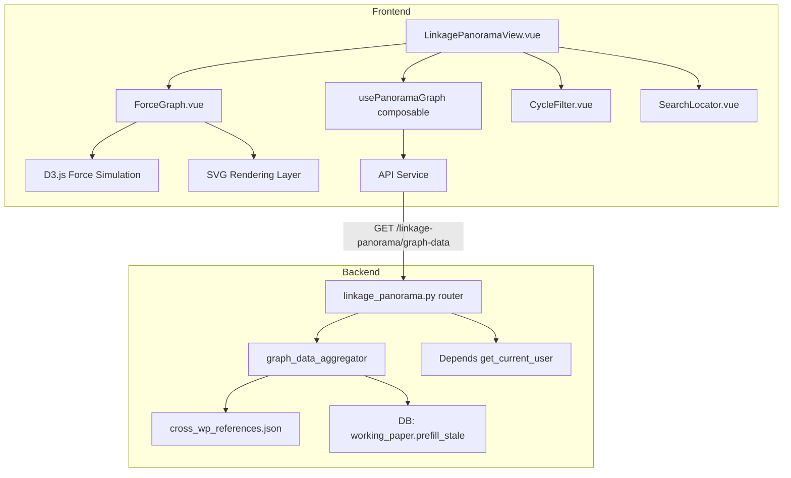

# Design Document — 联动全景图 (Linkage Panorama Graph)

## 变更记录

| 版本 | 日期 | 变更内容 |
|------|------|----------|
| v0.1 | 2026-05-20 | 初始设计 |
| v0.2 | 2026-05-20 | Sprint 0 实测后补强：①CYCLE_INFERENCE_RULES 共享常量 ②cross_module 虚拟节点策略 ③severity 5 级颜色 ④节点数从 60 调整到 128 |

---

## Overview

本设计实现"联动全景图"功能：新建 `/projects/:id/linkage-panorama` 页面，使用 D3.js 力导向图渲染全量 CWR（Cross Workpaper Reference，Sprint 0 实测 400 条 ref / 401 条边 / 128 唯一节点）的宏观依赖关系网络，支持按循环着色、severity 着色、stale 状态叠加、缩放/拖拽/搜索/过滤交互，以及点击节点跳转底稿。

核心设计原则：
- **D3.js 直接操作 SVG**：Vue 3 负责生命周期管理和响应式数据，D3 负责力模拟和 SVG 渲染（不使用 Vue 虚拟 DOM 管理 SVG 元素）
- **单端点聚合**：后端 GET 端点一次返回全量图数据（nodes + edges + stale 状态 + 统计），前端无需多次请求
- **数据规模适中**：128 unique nodes（含 18 个 cross_module 虚拟节点）+ 401 edges，SVG 渲染完全胜任（无需 Canvas）
- **纯只读可视化**：不涉及图编辑，不涉及 WebSocket 实时推送
- **cycle 推断兜底**：A/B/C/S/other 类节点全部归入对应类别（不漏不抛错），module 类节点用虚拟前缀 `__module__` 区分

---

## Architecture

### 系统分层



### 数据流

1. 用户进入 `/projects/:id/linkage-panorama` → Vue Router 加载 LinkagePanoramaView
2. `usePanoramaGraph` composable 调用 `GET /api/projects/{pid}/linkage-panorama/graph-data`
3. 后端从 `cross_wp_references.json` 加载 400 条 CWR → 按 wp_code 去重聚合节点 → 查询 DB stale 状态 → 返回 `{ nodes, edges, statistics }`
4. 前端将 API 响应转换为 D3 force simulation 所需的 `nodes[]` + `links[]` 格式
5. ForceGraph 组件初始化 D3 force simulation → SVG 渲染节点/边 → 布局稳定后启用交互

### Vue 3 + D3.js 生命周期管理策略

```
┌─────────────────────────────────────────────────────┐
│ ForceGraph.vue                                       │
│                                                      │
│  onMounted() {                                       │
│    1. 创建 SVG container (d3.select)                 │
│    2. 初始化 zoom behavior                           │
│    3. 创建 force simulation                          │
│    4. 绑定 tick handler → 更新 SVG 元素位置          │
│  }                                                   │
│                                                      │
│  watch(graphData) {                                   │
│    1. 停止旧 simulation                              │
│    2. 重新绑定 nodes/links 数据                      │
│    3. 重启 simulation                                │
│  }                                                   │
│                                                      │
│  onBeforeUnmount() {                                 │
│    1. simulation.stop()                              │
│    2. 清理 SVG 事件监听                              │
│  }                                                   │
└─────────────────────────────────────────────────────┘
```

关键点：D3 直接操作 DOM（SVG 元素），Vue 不参与 SVG 子元素的虚拟 DOM diff。Vue 仅管理：
- 组件挂载/卸载生命周期
- 响应式 props（graphData、filter 状态）变化时触发 D3 重绘
- 工具栏/面板等非 SVG UI 元素

---

## Components and Interfaces

### 前端组件层级

```
views/LinkagePanoramaView.vue          ← 页面入口（路由组件）
├── 顶部工具栏
│   ├── 项目名称 + "联动全景图" 标题
│   ├── CycleFilter.vue                ← 循环多选过滤器
│   ├── SearchLocator.vue              ← 搜索定位
│   ├── StaleToggle (el-switch)        ← "仅显示 stale" 开关
│   └── 刷新 / 重置视图 / 适应窗口 按钮
├── ForceGraph.vue                     ← D3 力导向图核心组件
│   ├── SVG container
│   │   ├── <defs> (arrow markers)
│   │   ├── <g class="edges">         ← 边 group
│   │   ├── <g class="nodes">         ← 节点 group
│   │   └── <g class="labels">        ← 标签 group
│   └── GraphTooltip.vue              ← hover tooltip
└── GraphLegend.vue                    ← 右下角图例面板
```

### 前端 Composable

```typescript
// usePanoramaGraph.ts
export function usePanoramaGraph(projectId: Ref<string>) {
  // 状态
  const graphData: Ref<GraphDataResponse | null>
  const loading: Ref<boolean>
  const error: Ref<string | null>

  // 派生数据
  const d3Nodes: ComputedRef<D3Node[]>
  const d3Links: ComputedRef<D3Link[]>
  const statistics: ComputedRef<GraphStatistics>

  // 过滤
  const selectedCycles: Ref<string[]>       // 当前选中的循环
  const showOnlyStale: Ref<boolean>
  const filteredNodes: ComputedRef<D3Node[]>
  const filteredLinks: ComputedRef<D3Link[]>

  // 搜索
  function searchNodes(query: string): D3Node[]

  // 操作
  async function fetchGraphData(): Promise<void>
  function getCycleNodeCounts(): Record<string, number>

  return { graphData, loading, error, d3Nodes, d3Links, statistics,
           selectedCycles, showOnlyStale, filteredNodes, filteredLinks,
           searchNodes, fetchGraphData, getCycleNodeCounts }
}
```

### 后端路由

```python
# backend/app/routers/linkage_panorama.py
router = APIRouter(prefix="/projects/{project_id}/linkage-panorama")

@router.get("/graph-data")  # GET /api/projects/{pid}/linkage-panorama/graph-data
async def get_graph_data(
    project_id: UUID,
    current_user = Depends(get_current_user),
    db: AsyncSession = Depends(get_db),
) -> GraphDataResponse:
    ...
```

### 图数据转换逻辑（CWR JSON → D3 nodes/links）

```python
def aggregate_graph_from_cwr(references: list[dict]) -> tuple[list[dict], list[dict]]:
    """
    输入: cross_wp_references.json 的 references 数组（Sprint 0 实测 400 条）
    输出: (nodes, edges)
    
    节点聚合规则:
    - 遍历所有 ref 的 source_wp + targets[].wp_code（标准 CWR）
    - 对 cross_module 类 target（含 target_module 不含 wp_code），生成虚拟节点 __module__{target_module}
    - 按 wp_code/虚拟 id 去重（实测 ~128 unique，含 ~18 模块虚拟节点）
    - 每个节点附加: cycle (按 CYCLE_INFERENCE_RULES 推断), degree (出入度)
    
    边生成规则:
    - 标准 ref：每条 CWR 的每个 wp_code target 生成一条边: source_wp → target.wp_code
    - cross_module ref：source_wp → __module__{target_module}
    - 边附加: ref_id, severity, category, label (target_field 或 sheet)
    """


# CYCLE_INFERENCE_RULES — 共享常量，前后端用同一份逻辑
def infer_cycle(wp_code: str) -> str:
    """
    Cycle 推断函数（前后端共享逻辑）：
    1. __module__ 前缀 → 'module'
    2. BS/IS/CFS/EQ 前缀 → 'report'
    3. 中文'附注'前缀 或 NOTE 前缀 → 'note'
    4. wp_code 首字母 ∈ {A,B,C,D,E,F,G,H,I,J,K,L,M,N,S} 且首字母后非字母（避免 BS/EQ 误命中）→ 该字母
    5. 其余 → 'other'
    """
    if wp_code.startswith('__module__'):
        return 'module'
    cu = wp_code.upper()
    if cu.startswith(('BS', 'IS', 'CFS', 'EQ')):
        return 'report'
    if wp_code.startswith('附注') or cu.startswith('NOTE'):
        return 'note'
    if cu and cu[0] in 'ABCDEFGHIJKLMNS' and (len(cu) == 1 or not cu[1].isalpha()):
        return cu[0]
    return 'other'
```

---

## Data Models

### API Response Schema

```python
class GraphNode(BaseModel):
    id: str              # wp_code (唯一标识)
    wp_code: str
    cycle: str           # D/E/F/G/H/I/J/K/L/M/N/report/note
    label: str           # 显示标签 (如 "H1 固定资产")
    is_stale: bool       # prefill_stale 状态
    degree: int          # 出入度 (被引用次数 + 引用他人次数)

class GraphEdge(BaseModel):
    id: str              # ref_id (如 "CW-01")
    source: str          # source wp_code
    target: str          # target wp_code
    ref_id: str
    severity: str        # blocking/warning/info
    category: str        # depreciation/salary/...
    description: str
    is_stale: bool       # source 或 target 任一 stale

class GraphStatistics(BaseModel):
    node_count: int
    edge_count: int
    stale_node_count: int
    stale_edge_count: int
    blocking_edge_count: int

class GraphDataResponse(BaseModel):
    nodes: list[GraphNode]
    edges: list[GraphEdge]
    statistics: GraphStatistics
```

### 前端 D3 数据类型

```typescript
interface D3Node extends d3.SimulationNodeDatum {
  id: string          // wp_code
  wpCode: string
  cycle: string
  label: string
  isStale: boolean
  degree: number
  // D3 会自动添加 x, y, vx, vy
}

interface D3Link extends d3.SimulationLinkDatum<D3Node> {
  id: string          // ref_id
  source: string | D3Node
  target: string | D3Node
  severity: string
  category: string
  description: string
  isStale: boolean
}
```

### 颜色方案

```typescript
// 节点颜色 — 按循环
export const CYCLE_COLOR_MAP: Record<string, string> = {
  // 业务循环
  D: '#1976D2',  // 蓝
  E: '#00ACC1',  // 青
  F: '#43A047',  // 绿
  G: '#FDD835',  // 金
  H: '#FB8C00',  // 橙
  I: '#3949AB',  // 靛
  J: '#EC407A',  // 粉
  K: '#78909C',  // 灰
  L: '#8D6E63',  // 棕
  M: '#AB47BC',  // 紫
  N: '#E53935',  // 红
  // 辅助类（v0.2 新增）
  A: '#26A69A',  // 蓝绿（A 类报表/调整）
  B: '#7E57C2',  // 淡紫（B 类控制了解）
  C: '#5C6BC0',  // 紫蓝（C 类控制测试）
  S: '#FFA726',  // 浅橙（S 专项程序）
  // 报表/附注/模块/兜底
  report: '#0D47A1',  // 深蓝 (BS/IS/CFS/EQ)
  note: '#4A148C',    // 深紫 (附注)
  module: '#607D8B',  // 蓝灰 (cross_module 虚拟节点)
  other: '#BDBDBD',   // 中灰 (兜底)
}

// 边颜色 — 按 severity（v0.2 扩展为 5 级）
export const SEVERITY_COLOR_MAP: Record<string, string> = {
  blocking: '#D32F2F',     // 红
  warning: '#F57C00',      // 橙
  info: '#9E9E9E',         // 灰
  recommended: '#42A5F5',  // 浅蓝（B/C 控制建议）
  required: '#EF6C00',     // 深橙（A 类必填）
}

// 边线宽 — 按 severity
export const SEVERITY_WIDTH_MAP: Record<string, number> = {
  blocking: 2,
  required: 2,
  warning: 1.5,
  info: 1,
  recommended: 1,
}
```

### Force Simulation 参数

```typescript
const simulation = d3.forceSimulation<D3Node>(nodes)
  .force('link', d3.forceLink<D3Node, D3Link>(links)
    .id(d => d.id)
    .distance(80)           // 边长度
    .strength(0.3))
  .force('charge', d3.forceManyBody()
    .strength(-300)         // 节点间斥力
    .distanceMax(400))      // 斥力最大作用距离
  .force('center', d3.forceCenter(width / 2, height / 2))
  .force('collision', d3.forceCollide()
    .radius(d => nodeRadius(d) + 5))  // 碰撞半径 = 节点半径 + 5px padding
  .alphaDecay(0.02)         // 衰减速率（越小越慢稳定，越精确）
  .velocityDecay(0.4)       // 速度衰减
```

### Stale Overlay CSS 动画

```css
/* 边闪烁 — 0.8s 周期 */
.edge-stale {
  animation: stale-pulse 0.8s ease-in-out infinite alternate;
}
@keyframes stale-pulse {
  from { opacity: 0.4; stroke-width: var(--base-width); }
  to   { opacity: 1.0; stroke-width: calc(var(--base-width) * 2); }
}

/* 节点 stale 虚线边框 */
.node-stale circle {
  stroke: #FDD835;
  stroke-dasharray: 4 2;
  stroke-width: 2px;
}
```

### ADR (Architecture Decision Records)

**ADR-1: D3.js vs ECharts**

- 决策：使用 D3.js 力导向图
- 理由：①ECharts graph 模块对力导向布局的自定义能力有限（无法精细控制 charge/collision/link distance）②D3 是力导向图的事实标准，社区资源丰富 ③项目已有 ECharts 用于柱状图/饼图等，D3 专注图可视化不冲突 ④~60 节点规模 D3 性能绰绰有余
- 权衡：新增 ~200KB 依赖（gzipped ~65KB），但仅在全景图页面按需加载

**ADR-2: SVG vs Canvas**

- 决策：使用 SVG 渲染
- 理由：①~60 节点 + 400 边的规模 SVG 完全胜任（Canvas 优势在 1000+ 节点）②SVG 元素可直接绑定 DOM 事件（hover/click），无需 hit-testing ③SVG 支持 CSS 动画（stale 闪烁）④SVG 元素可被浏览器 DevTools 直接检查
- 权衡：如果未来节点数增长到 500+，需考虑迁移到 Canvas（但 CWR 宏观层不会增长到这个规模）

**ADR-3: Force Simulation 参数选择**

- 决策：charge=-300, linkDistance=80, collision=nodeRadius+5, alphaDecay=0.02
- 理由：①charge=-300 在 60 节点规模下提供足够间距避免重叠 ②linkDistance=80 使相连节点保持适中距离 ③collision 防止节点视觉重叠 ④alphaDecay=0.02 使布局在 ~150 次迭代（约 2.5s）内稳定
- 权衡：低端设备可能需要增大 alphaDecay 加速收敛；可通过 `simulation.alpha(0).stop()` 强制停止

**ADR-4: Vue 3 + D3 集成模式**

- 决策：D3 直接操作 SVG DOM，Vue 仅管理生命周期和响应式触发
- 理由：①Vue 虚拟 DOM 对高频 tick 更新（每帧 60 个节点位置变化）效率低 ②D3 的 data-join 模式（enter/update/exit）天然适合 SVG 元素管理 ③避免 Vue reactivity 系统追踪 D3 内部状态导致性能问题
- 权衡：ForceGraph 组件内部不使用 Vue template 渲染 SVG 子元素，降低了 Vue DevTools 对图内部的可观测性

**ADR-5: 后端聚合策略**

- 决策：后端一次性加载 cross_wp_references.json + 查询 DB stale 状态，聚合后返回
- 理由：①前端无需关心数据来源（JSON 文件 vs DB）②单次请求减少网络往返 ③聚合逻辑在后端可缓存（未来可加 Redis 缓存）④JSON 文件 400 条加载 + 聚合耗时 < 50ms
- 权衡：每次请求都重新加载 JSON 文件（无缓存），如未来响应 > 800ms，启用 `functools.lru_cache(maxsize=1)` + 文件 mtime 失效策略；当前实施先不做缓存

**ADR-6: cross_module 类 target 处理（v0.2 新增）**

- 决策：为 cross_module 类 target 生成虚拟节点 id=`__module__{target_module}`，cycle='module'
- 理由：①Sprint 0 实测 7.75% 边（31/401）属于 cross_module 类，无 wp_code 但有 target_module ②若直接丢弃会损失 B15 重要性→trial_balance 等关键联动 ③虚拟节点用 `__module__` 前缀避免与真实 wp_code 冲突 ④cycle='module' 在颜色映射中独立着色（蓝灰 #607D8B），用户可识别这是模块级而非底稿级节点
- 权衡：虚拟节点不可点击跳转到底稿（只能跳模块对应页面），点击行为按 target_module 路由到对应视图（trial_balance / consolidation / disclosure_notes 等）；如 target_module 无对应路由则 toast 提示

**ADR-7: 节点 cycle 推断兜底（v0.2 新增）**

- 决策：实测识别 5 个无法归类节点（PL/REPORT/T1/TB/disclosure），统一归 'other' cycle 并用中灰着色
- 理由：①spec 起草时未预料到 PL/T1/TB 这类历史遗留命名 ②强行归到 D~N 会误导用户 ③other 兜底 + 中灰着色 + 图例标注"未分类"使其可见但不抢眼 ④后续可独立 spec 修正这些命名（不阻塞本期上线）
- 权衡：other 节点缺少业务循环归属，过滤器不会误把它们当循环节点；图例需明确标注 "其他/未分类"

---

## Correctness Properties

*A property is a characteristic or behavior that should hold true across all valid executions of a system — essentially, a formal statement about what the system should do. Properties serve as the bridge between human-readable specifications and machine-verifiable correctness guarantees.*

### Property 1: Node count invariant

*For any* set of CWR references, the number of nodes in the aggregated graph must equal the number of distinct wp_code values appearing across all `source_wp` fields and all `targets[].wp_code` fields. No wp_code should be duplicated in the node list, and no wp_code referenced by any edge should be missing from the node list.

**Validates: Requirements 9.3**

### Property 2: Edge endpoint validity

*For any* edge in the graph data response, both `edge.source` and `edge.target` must exist as valid node IDs in the `nodes[]` array. There must be no dangling references — every edge endpoint must resolve to an existing node.

**Validates: Requirements 9.2, 2.1**

### Property 3: Stale subset invariant

*For any* graph data response, the set of nodes where `is_stale = true` must be a subset of all nodes, and the set of edges where `is_stale = true` must be a subset of all edges. Furthermore, an edge is stale if and only if at least one of its endpoint nodes is stale.

**Validates: Requirements 8.1, 8.2, 8.5**

---

## Error Handling

| 场景 | HTTP Code | 错误消息 | 处理方式 |
|------|-----------|----------|----------|
| cross_wp_references.json 加载失败 | 503 | "CWR 数据加载失败" | 前端显示错误占位 + 重试按钮 |
| 用户无项目访问权限 | 403 | "权限不足" | 前端跳转到项目列表 |
| 未认证 | 401 | "未登录" | 前端跳转到登录页 |
| project_id 不存在 | 404 | "项目不存在" | 前端显示 404 页面 |
| D3 力模拟超时（> 5s 未稳定） | — | — | 前端强制 `simulation.stop()` + console.warn |
| 节点点击但底稿不存在 | — | toast "该底稿尚未创建" | 不跳转，仅提示 |

### 前端降级策略

- 图数据加载失败：显示 `el-empty` 占位 + "加载失败，点击重试" 按钮
- 力模拟超时：强制停止模拟，以当前布局状态展示（可能有少量重叠）
- 搜索无结果：搜索框下方提示"未找到匹配节点"

---

## Testing Strategy

### 双重测试方法

本功能采用 **单元测试 + 属性测试** 双轨覆盖：

- **单元测试**：验证具体示例、边界条件、错误处理、UI 渲染
- **属性测试**：验证跨所有输入的通用属性（节点计数不变量、边端点有效性、stale 子集关系）

### 属性测试配置

- **库选择**：后端使用 `hypothesis`（Python），前端使用 `fast-check`（TypeScript）
- **最小迭代次数**：每个 property test 至少 100 次迭代
- **标签格式**：`Feature: linkage-panorama-graph, Property {N}: {property_text}`
- **每个 correctness property 对应一个 property-based test**

### 后端测试文件

| 文件 | 覆盖范围 |
|------|----------|
| `backend/tests/test_linkage_panorama_endpoint.py` | API 端点 + 认证 + 错误降级 |
| `backend/tests/test_linkage_panorama_aggregator.py` | 图数据聚合逻辑 + stale 叠加 |
| `backend/tests/test_linkage_panorama_pbt.py` | Property 1-3 属性测试 |

### 前端测试文件

| 文件 | 覆盖范围 |
|------|----------|
| `frontend/src/views/__tests__/LinkagePanorama.spec.ts` | 页面渲染 + 路由注册 + 工具栏交互 |
| `frontend/src/components/__tests__/ForceGraph.spec.ts` | D3 初始化 + 节点/边渲染 + 交互 |
| `frontend/src/composables/__tests__/usePanoramaGraph.spec.ts` | 数据加载 + 过滤 + 搜索逻辑 |
| `frontend/src/composables/__tests__/usePanoramaGraph.pbt.spec.ts` | Property 1-3 前端属性测试 |

### Property → Test 映射

| Property | 测试文件 | 标签 |
|----------|----------|------|
| P1 node count invariant | test_linkage_panorama_pbt.py | `Feature: linkage-panorama-graph, Property 1: node count invariant` |
| P2 edge endpoint validity | test_linkage_panorama_pbt.py | `Feature: linkage-panorama-graph, Property 2: edge endpoint validity` |
| P3 stale subset invariant | test_linkage_panorama_pbt.py | `Feature: linkage-panorama-graph, Property 3: stale subset invariant` |

### 单元测试重点

- **具体示例**：空 CWR 列表 → 空图 / 单条 CWR → 2 节点 1 边 / 全量 400 条 CWR 加载
- **边界条件**：自引用边（source == target）/ 重复 ref_id / 所有节点 stale / 无 stale 节点
- **错误条件**：JSON 加载失败 503 / 未认证 401 / 无权限 403
- **集成点**：过滤后节点数 ≤ 总节点数 / 搜索结果匹配 / 点击跳转路由正确
