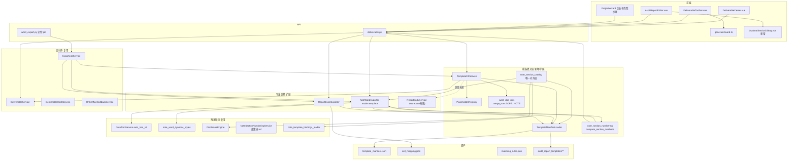
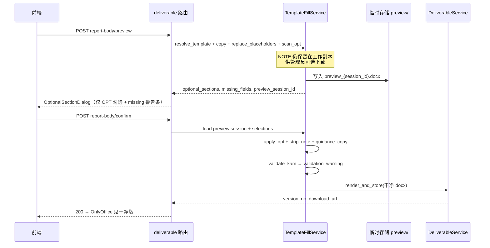
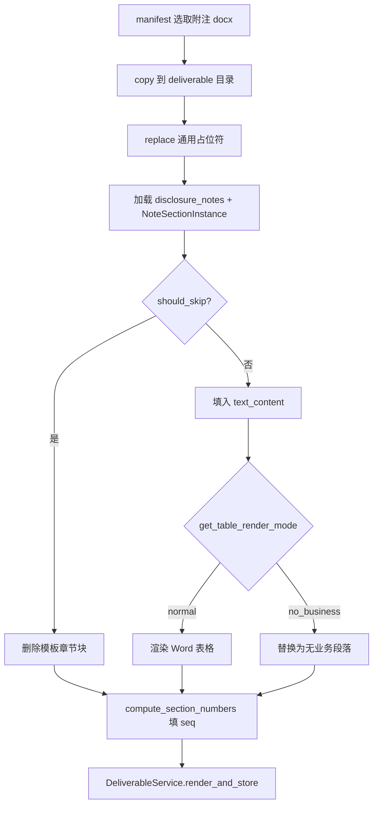

# 设计文档：审计报告模板集成

## 概述

本设计将致同年度审计全套出品物模板（报告正文 Word + 财务报表 Excel + 附注 Word）接入现有交付件中心，通过统一的 `TemplateManifestLoader` + `TemplateFillService` 流水线完成 copy → 占位符替换 → 可选段落确认 → 指引注释清理 → 交付件入库。

**核心策略：扩展而非重建**——复用 `DeliverableService`、`ReportExcelExporter`、`NoteWordExporter`、`NoteTrimService.auto_trim_v2()`，将 `ReportBodyService` JSON 主路径迁移为 Word 模板主路径。

对应需求文档 Phase 1/2/3，设计按 **P0 → P1 → P2** 组织。

> **Supersedes**：`.kiro/specs/audit-report-deliverable-center/design.md` 中「JSON 段落主源」决策。本 spec 以 **Word 模板为主源**；`audit_report_templates_seed.json`（DB JSON 段落种子）仅作迁移期只读参考，不得再作为生成源。

### 关键设计决策

| 决策点 | 选项 | 结论 | 理由 |
|--------|------|------|------|
| 报告正文主源 | JSON 段落 vs Word 模板 | **Word 模板为主源**；`report_body_json` 存元数据（OPT 选择、版本、missing_fields） | 最大程度保留致同原始格式；JSON 段落无法保证页眉页脚/样式 |
| Fill 服务形态 | 新建 vs 重构 | **重构 `WordTemplateFiller` → `TemplateFillService`** | 避免与 `ReportBodyService`、交付件中心三套并行 |
| 模板索引 | 各服务硬编码 vs manifest | **`TemplateManifestLoader` 唯一入口** | manifest 已在仓库，废弃 `TEMPLATE_MAP` |
| 报告生成 API | 单次同步 vs 两阶段 | **preview（不落库）+ confirm（入库）** | OPT 弹窗需用户确认，单次 API 无法承载 |
| Preview 会话 | 内存 vs Redis vs 临时文件 | **临时文件 + DB 轻量 session 表** | 大 docx 不宜放 Redis；重启不丢；TTL 24h 自动清理 |
| 占位符命名 | 仅新键 vs 兼容旧键 | **`PlaceholderRegistry` 双向映射** | 迁移期 `ReportPlaceholderService` 与模板 `{{...}}` 共存 |
| Word runs 分割 | 逐 run 替换 vs 先合并 | **先 `merge_runs_for_replace` 再替换** | python-docx 常见坑；代码库尚无此实现 |
| 附注导出 | 纯模板填充 vs 扩展 NoteWordExporter | **`NoteWordExporter(mode='template')` 主路径** | 复用 `get_table_render_mode`、样式、空表逻辑 |
| 附注对齐 | 三套并行 vs 唯一 catalog | **`note_section_catalog.py` 强制入口** | section_code / variant_key / scope / legacy 归一 |
| 附注显示编号 | 端点内联 vs 共享模块 | **`note_section_numbering.compute_section_numbers()`** | `{{seq:八}}` 与 `get_section_numbers`；按 `note_section` 前缀分组 |
| 附注政策树编号 | 无 vs 已有服务 | **`NoteSectionNumberingService`**（保留） | `section_id` 树、Jinja `ref()`；与显示编号分工 |
| 报表坐标映射 | 扫描 xlsx vs 显式 JSON | **`cell_mapping.json` 显式映射** | 可测试、可 diff；避免运行时启发式找格 |
| 全套生成 | 同步串行 vs ExportJob | **`ExportJob(job_type='full_deliverables')` 异步** | 已有 `export_jobs_v2`；大项目不阻塞 API |
| 灰度切换 | 直接切换 vs feature flag | **`USE_TEMPLATE_FILL_SERVICE`（settings）** | 迁移期可回退到 `ReportBodyService` |
| `.doc` 模板 | 运行时支持 vs 入库转换 | **入库前转 docx，运行时仅 docx** | python-docx 不支持 `.doc` |

## 架构

### 系统分层



### 报告正文两阶段流程

> **提示性表述分层**（详见 `template-preparation.md` §提示性表述）：编制说明在 Phase 0 删除；**仅 `##OPT:` 段**在 preview 弹窗由用户确认；`##NOTE:` 在 confirm 自动剥除；复核/EQCR 不处理模板提示。



### 附注模板填充流程



## 目录与文件布局

### 模板资产（已有 + 待补）

```
backend/data/audit_report_templates/
├── report_body/              # 17 个 docx（.doc 须先转换）
├── financial_statements/     # 4 个 xlsx
├── disclosure_notes/         # 4 个 docx
├── template_manifest.json       # 含 sheet_aliases
├── cell_mapping.json            # 报表内联导出 / 回退
├── section_code_index.json      # 附注 section_code 索引
├── matching_rules.json
└── placeholder_registry.json
```

### 命名对照（避免混用）

| 名称 | 路径/表 | 用途 | 迁移后角色 |
|------|---------|------|-----------|
| **模板资产目录** | `backend/data/audit_report_templates/` | 致同 Word/xlsx 物理文件 + manifest | **唯一生成源** |
| **DB 段落种子** | `audit_report_templates_seed.json` → `audit_report_template` 表 | 旧 JSON 段落模板 | 只读参考，Phase 3 下线生成 |
| **docxtpl 壳** | `report_body_deliverable.docx` | 旧程序化拼装外壳 | 废弃 |
| **附注 JSON 种子** | `note_template_{soe\|listed}.json` | 章节清单、`section_number` 权威 | 附注整理清单 + join 键 |
| **附注 bindings** | `note_template_bindings.json` | 表格取数语义 | 生成时读 binding，不写入 Word |

### 新增/修改代码

```
backend/app/services/
├── template_manifest_loader.py      # 新增
├── template_fill_service.py         # 重构自 word_template_filler.py
├── word_doc_utils.py                # 新增：merge_runs, OPT, NOTE
├── placeholder_registry.py          # 新增
├── note_section_numbering.py        # 新增（从 disclosure_notes 路由提取）
├── report_excel_exporter.py         # 修改：读 manifest + cell_mapping
├── note_word_exporter.py            # 修改：mode=template
├── report_body_service.py           # 修改：deprecated 标记，保留 HTML/KAM 辅助
└── matching_rules_service.py        # 新增：解析对照表 + wizard 推荐

backend/app/routers/
├── deliverable.py                   # 新增 preview/confirm 路由
└── word_export.py                   # 扩展 full_deliverables job

backend/app/models/
├── phase13_schemas.py               # 新增 Preview/Confirm request/response
└── report_models.py                 # 增列

backend/migrations/
└── V066__template_fill_columns.sql  # 新迁移

audit-platform/frontend/src/
├── components/deliverable/OptionalSectionDialog.vue  # 新增
├── services/deliverableApi.ts       # preview/confirm API
└── views/AuditReportEditor.vue      # 接入两阶段生成
```

## 组件设计

### 1. TemplateManifestLoader

**文件**: `backend/app/services/template_manifest_loader.py`

```python
@dataclass(frozen=True)
class ManifestEntry:
    rel_path: Path
    abs_path: Path
    exists: bool

class TemplateManifestLoader:
    def __init__(self, base_dir: Path | None = None): ...

    def reload(self) -> None: ...  # 启动时 + 测试可调用

    def validate(self) -> list[str]: ...  # 返回缺失文件 warnings

    def version(self) -> str: ...

    def resolve_report_body(
        self,
        opinion_type: str,
        company_subtype: str,
        variant: str = "simple",
    ) -> ManifestEntry: ...

    def resolve_financial_statements(
        self, template_type: str, scope: str,
    ) -> ManifestEntry: ...  # key: "{template_type}_{scope}"

    def resolve_disclosure_notes(
        self, template_type: str, scope: str,
    ) -> ManifestEntry: ...
```

- 单例缓存在 `app.state` 或模块级 lazy load
- `abs_path` = `Path(__file__).parents[2] / "data" / "audit_report_templates" / rel_path`
- 启动 hook（`main.py` lifespan）：`loader.validate()` → log warnings
- CI 脚本：`scripts/validate_template_manifest.py` 拒绝 `.doc` 扩展名

### 2. PlaceholderRegistry

**文件**: `backend/app/services/placeholder_registry.py`  
**种子**: `backend/data/audit_report_templates/placeholder_registry.json`

```json
{
  "canonical_to_legacy": {
    "company_full_name": "entity_name",
    "company_short_name": "entity_short_name",
    "signing_cpa": "cpa_name_1",
    "audit_year": "audit_year"
  },
  "opt_groups": {
    "body": "报告正文段落",
    "supplement": "补充信息段落"
  },
  "opt_defaults": {
    "type_a": {
      "emphasis": false,
      "key_audit_matters": true,
      "going_concern": false,
      "comparative": true,
      "other_information": false
    },
    "type_d": {
      "key_audit_matters": false,
      "comparative": true
    }
  },
  "section_group_map": {
    "emphasis": "body",
    "key_audit_matters": "body",
    "going_concern": "body",
    "other_matter": "supplement",
    "comparative": "supplement",
    "other_information": "supplement"
  }
}
```

- `build_placeholder_map(project_id, db)` → `dict[str, str]` 使用 canonical `{{key}}` 无括号形式存值
- `get_opt_defaults(company_subtype)` → 按子类型返回默认勾选；`full_deliverables` job 与 `OptionalSectionDialog` 共用
- 内部调用 `ReportPlaceholderService.get_placeholders()` 再映射

### 3. word_doc_utils

**文件**: `backend/app/services/word_doc_utils.py`

| 函数 | 职责 |
|------|------|
| `merge_runs_for_replace(paragraph)` | 合并相邻 runs 使占位符成连续字符串 |
| `merge_runs_in_doc(doc)` | 遍历 body + headers + footers + tables |
| `replace_placeholders_in_doc(doc, mapping)` | 全文替换 `{{key}}` |
| `scan_optional_sections(doc)` | 解析 `##OPT:id:desc##...##/OPT:id##` |
| `apply_optional_sections(doc, selections)` | 删除未勾选块，保留块去标记 |
| `strip_guidance_notes(doc)` | 删除 `##NOTE:...##`；返回删除计数 |
| `copy_template_to_workdir(src, dest_dir)` | shutil.copy2 保留元数据 |

### 4. TemplateFillService

**文件**: `backend/app/services/template_fill_service.py`（重构 `word_template_filler.py`）

```python
class TemplateFillService:
    def __init__(self, db: AsyncSession, loader: TemplateManifestLoader): ...

    async def preview_report_body(
        self,
        project_id: UUID,
        year: int,
        *,
        opinion_type: str,
        company_subtype: str | None,
        template_variant: str = "simple",
        user_id: UUID,
    ) -> ReportBodyPreviewResult: ...

    async def confirm_report_body(
        self,
        project_id: UUID,
        year: int,
        *,
        preview_session_id: UUID,
        optional_sections: dict[str, bool],
        user_id: UUID,
    ) -> ReportBodyConfirmResult: ...
```

**preview 步骤**：
1. 解析 `company_subtype`（matching_rules → project → fallback）
2. `loader.resolve_report_body(...)` → copy 到 `storage/preview/{session_id}/working.docx`
3. `replace_placeholders_in_doc`
4. `scan_optional_sections` + `PlaceholderRegistry.opt_defaults`
5. 写 `fill_preview_sessions` 表（或 JSON 文件旁路）
6. 返回 `preview_session_id`, `optional_sections`, `missing_fields`

**confirm 步骤**：
1. 加载 session，校验未过期（24h）、`user_id` 一致
2. `apply_optional_sections`
3. 保存 guidance 副本 → `with_notes.docx`
4. `strip_guidance_notes` on working copy
5. `DeliverableService.export_or_new_deliverable` + `render_and_store`
6. 更新 `audit_report.report_body_json` schema（需求 6.8）
7. **KAM 合规校验**（§4.2）：`validate_kam_word_mode` → `validation_warning`，不阻断入库
8. 删除 preview session

#### 4.2 KAM 校验（Word 模式）

迁移后 `validate_kam` 不再读 JSON `sections[].section_id == "kam"`，改为：

```python
def validate_kam_word_mode(
    *,
    optional_sections: dict[str, bool],
    company_type: str,
    is_pie: bool,
    opinion_type: str,
) -> str | None:
```

| 步骤 | 逻辑 |
|------|------|
| 1 | 复用 `ReportBodyService.kam_required(...)`；若 False → 返回 None |
| 2 | 若 `optional_sections.get("key_audit_matters") is False` → 返回 KAM 缺失警告 |
| 3 | 警告文案与现 `validate_kam` 一致；写入 confirm Response `validation_warning` + 前端 Toast |

> 不在 confirm 后扫描 docx 正文判空——选用决策已在 OPT 弹窗完成；段落内容空由 EQCR 复核发现。

### 5. Preview Session 存储

**表**: `fill_preview_sessions`（V066 迁移）

| 列 | 类型 | 说明 |
|----|------|------|
| id | UUID PK | preview_session_id |
| project_id | UUID FK | |
| user_id | UUID FK | |
| year | int | |
| opinion_type | varchar | |
| company_subtype | varchar | |
| template_variant | varchar | |
| template_version | varchar | |
| working_path | text | preview 目录下 docx 路径 |
| optional_sections_json | jsonb | 扫描结果缓存 |
| missing_fields | jsonb | |
| expires_at | timestamptz | created_at + 24h |
| created_at | timestamptz | |

- 定时任务或 confirm 时清理过期 session 目录
- 不落 `word_export_task`，confirm 才创建

### 6. ReportExcelExporter 扩展

**修改**: `backend/app/services/report_excel_exporter.py`

- 删除 `TEMPLATE_MAP`；`_load_template` → `TemplateManifestLoader`
- **双轨填充**（见 template-preparation §3.3）：
  1. 扫描 sheet 内联 `{{row:BS-002:current}}` / `{{row:BS-002:prior}}` / `{{note_ref:BS-002}}`
  2. 表头替换 `{{company_full_name}}`、`{{period_end_date}}` 等
  3. 无内联时回退 `cell_mapping.json`
- `sheet_aliases` 解析实际 sheet 名（如 `1,2-资产负债表(表01国单`）→ `balance_sheet`
- 跳过 `data_type='f'`；`fill_empty_as` 来自 mapping
- 脚本 `export_cell_mapping_from_xlsx.py`：从内联占位符生成 mapping

```json
{
  "soe_standalone": {
    "sheet_aliases": { "balance_sheet": "1,2-资产负债表(表01国单" },
    "headers": { "balance_sheet": { "company_name": "A3", "period_end": "A2" } },
    "rows": {
      "BS-002": { "sheet": "balance_sheet", "current": "C6", "prior": "D6", "fill_empty_as": "blank" }
    }
  }
}
```

### 7. 附注联动铁律（NoteSectionCatalog）

**文件**: `backend/app/services/note_section_catalog.py`（**已实现，禁止绕过**）

| 职责 | API | 消费者 |
|------|-----|--------|
| 变体键 | `build_variant_key(template_type, report_scope)` | `TemplateManifestLoader.resolve_disclosure_notes` |
| Word 路径 | `word_template_relpath(variant_key)` | manifest `disclosure_notes/{variant}.docx` |
| 口径过滤 | `filter_template_sections(sections, report_scope)` | `DisclosureEngine`、`NoteTrimService` |
| 主键归一 | `normalize_section_code` / `resolve_binding_key` | DB 写入、bindings 查表 |
| 标题层级 | `detect_heading_level(section_code)` | `NoteWordExporter`（programmatic 模式） |

**联动数据流**：

```
note_template_{soe|listed}.json (section_number 权威)
    → catalog.filter + normalize → disclosure_notes.note_section
    → catalog.resolve_binding_key → note_template_bindings.json
    → NoteWordExporter(mode=template) ← manifest docx + section_code_index
         ↑ auto_trim_v2 / is_empty 裁剪状态（DB）
         ↑ compute_section_numbers → {{seq:prefix}}
```

### 7. NoteWordExporter 模板模式

**修改**: `backend/app/services/note_word_exporter.py`

```python
async def export(
    self,
    project_id: UUID,
    year: int,
    *,
    template_type: str = "soe",
    report_scope: str = "standalone",
    mode: str = "template",  # template | programmatic
    sections: list[str] | None = None,
    ...
) -> BytesIO:
```

**template 模式算法**（模板须先按 template-preparation §二 整理）：
1. `loader.resolve_disclosure_notes` + 读 `section_code_index.json` 校验块完整
2. 解析 `##SECTION:section_code##…##/SECTION:…##`（与 `##OPT:` 共用块解析器）
3. `section_code` = 种子 `section_number`（国企如 `八、1`、上市如 `五、1`），join `disclosure_notes.note_section`；若直 join 失败则查 `section_code_index.legacy_aliases`
4. 替换 `{{section:code}}` / `{{section:code:N}}`、`{{table:code:N}}`；`##STYLE_REF:table:code##` → 克隆参考表样式后删除标记
5. `{{seq:prefix}}` ← `compute_section_numbers()`
6. 裁剪：按 §7.1 优先级判定 → 删除整 SECTION 块
7. 表格：`get_table_render_mode`；多表 index 对齐 `note_template_bindings.tables[].table_index`

**附注整理产出**：`section_code_index.json`（见 §7.2）

#### 7.1 附注裁剪判定优先级

| 优先级 | 条件 | 动作 |
|--------|------|------|
| 1 | `is_deleted=True` | 删除整 SECTION 块 |
| 2 | `status='not_applicable'`（`auto_trim_v2` 章节级） | 删除整 SECTION 块 |
| 3 | `is_empty=True`（用户「不导出」） | 删除整 SECTION 块 |
| 4 | `text_content` 空且所有 `table_data` 经 `is_empty_table()` 全空 | 删除整 SECTION 块（`should_skip_empty_section` 扩展） |
| 5 | 单表全空但章节保留 | `get_table_render_mode` → `no_business_paragraph` |

`should_skip_empty_section()` 在 Phase 2 扩展为覆盖条件 3–4，与 `NoteTrimService.auto_trim_v2()` 结果一致。

#### 7.2 section_code_index.json 结构

```json
{
  "template_key": "soe_standalone",
  "seed_file": "note_template_soe.json",
  "sections": [
    {
      "section_code": "八、1",
      "section_id": "chapter-08-monetary-funds",
      "section_title": "货币资金",
      "level": 2,
      "content_type": "table",
      "placeholders": ["{{seq:八}}", "{{table:八、1}}"],
      "binding_wp_code": null,
      "legacy_aliases": ["五、1"]
    }
  ]
}
```

- `section_code`：Word `##SECTION:` 与 DB `note_section` 的**主键**（取自种子 `section_number`）
- `legacy_aliases`：历史底稿/公式/映射中的旧编号（如国企 `五、1` ↔ 种子 `八、1`）；join 时 `note_section IN (section_code, *legacy_aliases)`
- `build_section_code_index.py` 从种子 JSON 生成主体；人工补 `legacy_aliases`；`validate_note_template.py` 校验 Word 块与索引一一对应

### 8. 附注编号（双轨，分工明确）

| 轨道 | 模块 | 键 | 用途 |
|------|------|-----|------|
| **显示编号** | `note_section_numbering.py`（待提取） | `note_section`（如 `八、1`） | `{{seq:八}}`、`get_section_numbers` 端点；前缀分组、组内 1 条不编号 |
| **政策树编号** | `note_section_numbering_service.py`（**已有**） | `section_id` | 模板 JSON 政策子节、Jinja `ref()`、五级序号 |

两轨均须先经 **`note_section_catalog.section_applies_to_scope`** 过滤 `consolidated_only`。

```python
# note_section_numbering.py（从 disclosure_notes 路由提取）
def compute_section_numbers(
    tree: list[dict],
    *,
    report_scope: str = "standalone",
    include_deleted: bool = False,
) -> dict[str, str]:
    """返回 {note_section: rendered_number}。"""
```

- `get_section_numbers` 路由改为 thin wrapper
- `NoteWordExporter` 模板模式填 `{{seq:prefix}}` 时调用此函数，**不**混用 `NoteSectionNumberingService`

### 9. MatchingRulesService

**文件**: `backend/app/services/matching_rules_service.py`

```python
def recommend_company_subtype(project_attrs: dict) -> RecommendResult:
    """返回 {subtype, confidence, candidates[]}"""
```

- 读 `matching_rules.json`（从对照表 xlsx 导入脚本生成）
- wizard API：`GET /projects/{id}/template-recommendation`

### 10. 数据库迁移 V066

**文件**: `backend/migrations/V066__template_fill_columns.sql`

```sql
-- projects
ALTER TABLE projects ADD COLUMN IF NOT EXISTS company_subtype VARCHAR(10);

-- audit_report
ALTER TABLE audit_report ADD COLUMN IF NOT EXISTS company_subtype VARCHAR(10);
ALTER TABLE audit_report ADD COLUMN IF NOT EXISTS template_variant VARCHAR(10) DEFAULT 'simple';
ALTER TABLE audit_report ADD COLUMN IF NOT EXISTS template_version VARCHAR(20);

-- fill_preview_sessions（新表）
CREATE TABLE IF NOT EXISTS fill_preview_sessions (...);
```

同步 ORM：`Project`, `AuditReport`, 新模型 `FillPreviewSession`。

### 11. API 契约

#### POST `/api/projects/{project_id}/deliverables/report-body/preview`

**Request**:
```json
{
  "year": 2025,
  "opinion_type": "unqualified",
  "company_subtype": "type_a",
  "template_variant": "simple"
}
```

**Response**:
```json
{
  "preview_session_id": "uuid",
  "optional_sections": [
    {
      "section_id": "emphasis",
      "description": "强调事项段",
      "preview": "我们提醒财务报表使用者关注...",
      "default_keep": false,
      "group": "报告正文段落"
    }
  ],
  "missing_fields": ["signing_partner"],
  "template_version": "2025-v1",
  "company_subtype_resolved": "type_a"
}
```

#### POST `/api/projects/{project_id}/deliverables/report-body/confirm`

**Request**:
```json
{
  "year": 2025,
  "preview_session_id": "uuid",
  "optional_sections": {"emphasis": false, "key_audit_matters": true}
}
```

**Response**（与现有 `ReportBodyRenderResponse` 兼容）:
```json
{
  "task_id": "uuid",
  "version_no": 2,
  "download_url": "/api/...",
  "report_body_json": { "...": "..." },
  "validation_warning": null
}
```

#### 灰度：现有 `POST .../report-body/render`

- `USE_TEMPLATE_FILL_SERVICE=false`（默认迁移期）：走原 `ReportBodyService`
- `true`：内部转调 preview + 自动 confirm（无 OPT 交互，测试用）或 410 提示升级前端

### 12. 配置项

**文件**: `backend/app/core/config.py`

```python
USE_TEMPLATE_FILL_SERVICE: bool = False
TEMPLATE_MANIFEST_DIR: str = "backend/data/audit_report_templates"
FILL_PREVIEW_TTL_HOURS: int = 24
```

### 13. 前端改动

| 组件 | 改动 |
|------|------|
| `OptionalSectionDialog.vue` | 新增：分组勾选 OPT + missing 警告条（§13.1） |
| `AuditReportEditor.vue` | 生成流程：preview → 弹窗 → confirm |
| `deliverableApi.ts` | `previewReportBody` / `confirmReportBody` |
| `DeliverableCenter.vue` | guidance 副本下载入口（§13.2） |
| `DeliverableToolbar.vue` | 全套生成按钮 → 创建 ExportJob + 进度轮询 |
| `ProjectWizard` | 企业子类型步骤 + 系统建议标签 |
| `generateGuard.ts` | 不变；全套 job 服务端校验 |

#### 13.1 OptionalSectionDialog 交互规格

**触发**：`AuditReportEditor` 点击「生成报告」→ `previewReportBody` 成功 → `v-model` 打开弹窗。

**布局**（Element Plus `el-dialog`，宽度 ~640px）：

```
┌─ 生成审计报告正文 ─────────────────────────────┐
│ ⚠ 待补充字段：签字合伙人、报告日期（不阻断生成） │  ← missing_fields 警告条（el-alert type=warning）
├───────────────────────────────────────────────┤
│ ▼ 报告正文段落                                 │
│   ☐ 强调事项段 (emphasis)     [展开预览]       │  ← default_keep 来自 placeholder_registry
│   ☑ 关键审计事项段 (KAM)      [展开预览]       │     上市/type_a 默认勾选 KAM
│ ▼ 补充信息段落                                 │
│   ☐ 持续经营重大不确定性      [展开预览]       │
├───────────────────────────────────────────────┤
│              [取消]  [确认生成]                │
└───────────────────────────────────────────────┘
```

| 行为 | 规则 |
|------|------|
| 默认勾选 | `placeholder_registry.json` → `opt_defaults[company_subtype][section_id]`；无配置时用 `default_keep`（preview 响应） |
| 重新生成 | 读取 `audit_report.report_body_json.optional_sections` **预填**上次勾选；用户可改 |
| 取消/关闭 | 不调用 confirm；preview session 保留至 TTL（可再次打开） |
| 确认生成 | 调用 confirm；`missing_fields` **不阻断** confirm（成品保留 `{{}}` 高亮） |
| KAM 警告 | confirm 返回 `validation_warning` 时 Toast（`el-message` warning），仍跳转交付件中心 |
| 覆盖确认 | 若已有 deliverable version，confirm 前 `ElMessageBox.confirm`「将覆盖当前编辑内容」 |

**分组映射**（`placeholder_registry.json` → `opt_groups`）：

| group key | 中文标题 | 典型 section_id |
|-----------|----------|-------------------|
| `body` | 报告正文段落 | emphasis, going_concern, key_audit_matters |
| `supplement` | 补充信息段落 | other_matter, comparative, other_information |

#### 13.2 guidance_version 下载 UX

confirm 保存的 `with_notes.docx`（含 `##NOTE:`，剥除前副本）**不进入**正式版本链，不作为 OnlyOffice 默认打开文件。

| 项 | 设计 |
|----|------|
| 存储路径 | `storage/deliverables/{project_id}/{task_id}/with_notes_v{n}.docx` |
| 元数据 | `audit_report.report_body_json.guidance_version_path` + `guidance_version_no`（与正式版 version_no 对齐） |
| 入口 | 交付件中心 →「审计报告正文」卡片 → 操作菜单「下载编制参考版（含内部提示）」 |
| 权限 | 与正式版下载相同：`project:read` + 交付件中心访问权；**不**单独限制管理员 |
| 展示 | 列表主行仅显示正式版；参考版为次要操作，文案注明「仅供项目组编制参考，不可对外出具」 |
| 重新生成 | 新 confirm 覆盖 `guidance_version_path`；旧参考版随 task 目录保留（不自动删） |

### 14. ExportJob 全套生成

**job_type**: `full_deliverables`

**payload**:
```json
{
  "year": 2025,
  "template_variant": "simple",
  "steps": ["financial_reports", "disclosure_notes", "report_body"],
  "optional_sections": null
}
```

**报告正文 OPT 默认策略**（无弹窗，job 内自动 confirm）：

1. 若 payload 显式传 `optional_sections` → 直接使用
2. 否则读 `audit_report.report_body_json.optional_sections`（项目上次人工选择）
3. 仍无则读 `placeholder_registry.json` → `opt_defaults[resolved_company_subtype]`
4. 兜底硬编码：

| section_id | 默认 | 说明 |
|------------|------|------|
| `key_audit_matters` | `kam_required(...)` | 上市/PIE 且非 disclaimer → True |
| `emphasis` | False | 无保留强调意见需用户主动选 |
| `going_concern` | False | |
| `other_matter` | False | |
| `comparative` | True | 比较数据段通常保留 |
| `other_information` | False | |

5. job 内对 report_body 步骤：`preview` → 用上述默认 `confirm`（跳过 `OptionalSectionDialog`）
6. KAM 警告仍写入 job 结果 metadata，前端进度完成时 Toast

**执行器**（扩展 `word_export.py` 或新 `full_deliverables_executor.py`）：
1. 校验 `trialBalanceReady` / `reportsReady`
2. 顺序调用三个 render 内部 service 方法
3. 每步写 `export_job_items_v2`；失败可重试单项
4. 进度：`progress_done / progress_total`

### 15. 测试策略

| 层级 | 范围 |
|------|------|
| 单元 | `merge_runs_for_replace`, `scan_optional_sections`, `compute_section_numbers`, `TemplateManifestLoader.validate` |
| 集成 | preview→confirm 不落库/入库、版本递增、OPT 删除 |
| 回归 | `test_deliverable_center_integration`, `test_note_auto_trim_v2` 扩展 |
| 人工 | 每类模板 1 份 spot check（字体/页眉/表格边框） |

### 16. 废弃与兼容时间表

| 组件 | Phase 2 结束 | Phase 3 结束 |
|------|-------------|-------------|
| `ReportBodyService.render_docx` 主路径 | deprecated 日志 | 默认关闭 |
| `WordTemplateFiller` | 标记 deprecated | 删除或仅测试引用 |
| `TEMPLATE_MAP` | 删除 | — |
| `render_report_body` 单阶段 API | 保留兼容 | 移除或仅 flag=false |

## 风险与缓解

| 风险 | 缓解 |
|------|------|
| `.doc` 转换丢格式 | 转换后人工 spot check；保留源文件归档 |
| 附注模板 section_code 对不齐 | `section_code_index.json` + 校验脚本 |
| cell_mapping 工作量大 | 先覆盖 soe_standalone 一张表 POC，再批量 |
| OPT 块跨段落/表格 | 模板规范限制 OPT 不跨 table；解析器单段落优先 |
| preview session 磁盘占用 | TTL 24h + 定时清理 |
| 与 ReportBodyService KAM 校验脱节 | §4.2 `validate_kam_word_mode` 读 OPT 勾选 + `kam_required` |
| 国企/上市 section_code 不一致 | `section_code_index.legacy_aliases` + join 兜底 |
| 存量项目缺 company_subtype | wizard 补填 + matching_rules 推断 + fallback（需求 1.7） |
