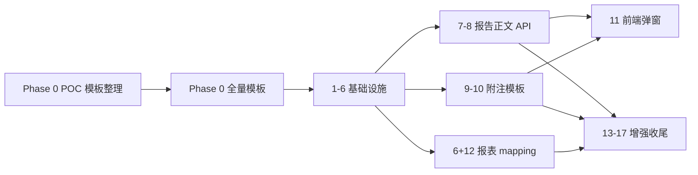

# 实施计划：审计报告模板集成

## 概述

将设计文档转化为可增量交付的编码任务。严格按 **Phase 0 → Phase 1 (P0) → Phase 2 (P1) → Phase 3 (P2)** 组织；每阶段可独立验收。

- 后端：Python（FastAPI + SQLAlchemy + pytest）
- 前端：TypeScript（Vue3 + Element Plus + Vitest）
- 三层一致铁律：迁移 DDL + ORM 模型 + service 同步增列
- 标 `*` 的子任务为可选（测试/脚本/人工验收）
- 实施前阅读 `requirements.md` 与 `design.md`

**当前迁移基线**：最高迁移版本 V065；本 spec 使用 **V066**。

---

# Phase 0：模板资产整理（阻塞项 — 先于一切代码）

> **原则：先整理模板、后写代码；新方案覆盖旧交付件中心 JSON/docxtpl 路径。**
> 规范见 [`template-preparation.md`](./template-preparation.md)。代码 Phase 1 不得早于本 Phase POC 验收。

- [x] 0.0 POC 模板整理（垂直切片 M0）
  - [x] 0.0.1 报告：`1.1 模板A-无保留简版.docx` — 占位符 + OPT + 删说明（`prepare_report_body_poc.py`）
  - [x] 0.0.2a 附注 POC：`soe_standalone.docx` — `一、1` `二、1` `八、1` SECTION（`tag_note_section_poc.py --write`）
  - [x] 0.0.2b 附注 POC：`soe_consolidated.docx` — `一、1` `七、本期纳入合并报表` `八、1` SECTION
  - [x] 0.0.2c 附注 POC：`listed_standalone.docx` — `一、1` `五、1` SECTION
  - [x] 0.0.2d 附注 POC：`listed_consolidated.docx` — `一、1` `五、1` + `十六` 母公司注释章
  - [x] 0.0.3 报表：`soe_standalone.xlsx` — 表头 `{{}}` + BS `BS-002…BS-021` 共 20 行 `{{row:…}}`
  - [x] 0.0.4 产出 POC 段 `section_code_index.json`（四变体共 11 节已索引）
  - [x] 0.0.4b `cell_mapping.json`（soe_standalone 20 行 POC）
  - [x] 0.0.5 已跑 `analyze_note_gap_deep.py`（输出 `_note_gap_deep.txt`；§五全量打标待 Phase 0.6）
  - _Requirements: 2, 3, 4, 5, 9, 10, 12_

- [x] 0.1 `.doc` → `.docx` 批量转换
  - [x] `convert_template_doc_to_docx.py`（LibreOffice headless）
  - [x] 15 份 `.doc` 已转换，原文件归档至 `report_body/_archive_doc/`
  - [x] `template_manifest.json` 路径已更新为 `.docx`
  - [ ]* 人工 spot check ≥3 份（页眉页脚、字体、段落样式）
  - _Requirements: 2.8_

- [x] 0.2 模板 manifest 校验脚本
  - [x] `backend/scripts/validate_template_manifest.py`（`--strict` CI 模式）
  - [x] 校验：文件存在、扩展名白名单、`.doc` 引用 warning
  - [x] pytest 冒烟 `test_template_manifest_validate.py`
  - [x] `validate_template_manifest.py --strict` 已绿（0.1 转换后）
  - [x] 接入 CI pipeline（`seed-validate` job 加 `validate_template_manifest.py --strict`）
  - _Requirements: 2.3, 2.4, 16.1_

- [x] 0.3 种子数据：placeholder_registry.json（POC 段）
  - [x] `placeholder_registry.json`：canonical↔legacy + `opt_defaults` + `opt_groups`
  - [ ]* 全量占位符键对齐报告模板 POC（待 0.6.1 报告模板整理）
  - _Requirements: 3.3, 4.2, 4.8–4.11, 11.7_

- [x] 0.4 附注整理脚本与校验
  - [x] 0.4.1 `validate_note_template.py`：拒绝【、使用说明、XXXX
  - [x] 0.4.2 `build_section_code_index.py`：从 JSON + docx `##SECTION:` 生成索引
  - [x] 0.4.3 POC：`soe_standalone` 索引含 `八、1` + `legacy_aliases: ["五、1"]`
  - [x] 0.4.4 `tag_note_section_poc.py` 覆盖四变体 POC 节
  - _Requirements: 10, 10.10–10.11, 12_

- [x] 0.5 报表整理脚本与校验（POC 段）
  - [x] 0.5.1 `export_cell_mapping_from_xlsx.py` + `prepare_financial_template_poc.py`
  - [x] 0.5.2 `validate_financial_template.py`（≥20 占位符）
  - [x] 0.5.3 manifest `sheet_aliases.soe_standalone`
  - _Requirements: 9, 11_

- [ ] 0.6 全量模板整理
  - [ ] 0.6.1 报告正文 17 份 + doc→docx
  - [x] 0.6.2 附注 4 份全量 SECTION 打标（按变体过滤 `consolidated_only`；见 gap-analysis §四）
  - [x] 0.6.2.1 扩充 `note_template_variant_matrix.json` 覆盖主要账户节
  - [x] 0.6.2.2 bindings 国企键统一 `八、N`，`五、N` → `legacy_aliases`
  - [x] 0.6.3 报表 4 份全量内联占位 + cell_mapping
  - _Requirements: 2–5, 9, 10, 12_

- [ ] 0.9 附注程序预修复（模板模式前，可与 Phase 1 并行）
  - [x] 0.9.0 新建 `note_section_catalog.py`
    - [x] `build_variant_key` / `normalize_report_scope` / `normalize_template_type`
    - [x] `filter_template_sections` + `note_applies_to_report_scope`（`consolidated_only`）
    - [x] `normalize_section_code` / `resolve_binding_key`（国企 `五、N` → `八、N`）
    - [x] `detect_heading_level` / `word_template_relpath`
    - [x] 单元测试 `test_note_section_catalog.py`（12 条）
  - [x] 0.9.1 `DisclosureEngine` + `NoteTrimService` 口径过滤
    - [x] `_load_templates` / `select_md_template` 按 `report_scope` 过滤 JSON sections
    - [x] 写入 DB 时 `normalize_section_code` 统一国企键
  - [x] 0.9.1b 编号服务 + bindings 归一
    - [x] `NoteSectionNumberingService` 识别 `consolidated_only`（`section_applies_to_scope`）
    - [x] `get_binding_for_section` 经 `resolve_binding_key` 回退
  - [x] 0.9.2 显示编号 API
    - [x] 新建 `note_section_numbering.py` → `compute_section_numbers`
    - [x] `GET .../section-numbers?scope=` 调用 catalog 过滤 + 组内递增
    - [x] standalone 排除 `consolidated_only` 后重新编号
    - [x] 单元测试 `test_note_section_numbering.py`（4 条）
  - [x] 0.9.3 `NoteWordExporter` 口径贯通
    - [x] `export(..., report_scope=)` + `_resolve_report_scope` 回退
    - [x] 导出前 `note_applies_to_report_scope` 过滤 notes 列表
    - [x] `_detect_level` 改走 catalog
    - [x] 路由显式传参：`deliverable.py` / `note_export.py` / `disclosure_notes.py` / `export_package_service.py`
  - [x] 0.9.4 `TemplateManifestLoader` 变体路径
    - [x] `resolve_disclosure_notes(template_type, report_scope)` → `build_variant_key` → docx
    - [x] `validate()` 缺失文件 warning，无 template_type 单一路径 fallback
    - [x] 单元测试 `test_template_manifest_loader.py`（7 条）
    - [x] `main.py` lifespan 启动校验（Phase 1 task 2.3）
  - [x] 0.9.5 变体矩阵 / section_code_index（POC 段）
    - [x] POC `section_code_index.json` 含 `legacy_aliases`（`八、1` ← `五、1`）
    - [x] `note_template_variant_matrix.json` 覆盖货币资金/应收账款/固定资产
    - [x] 全量 index 与 JSON 键一致校验（`validate_section_code_index_consistency.py`，非 strict 已绿）
  - [ ] 0.9.6 存量项目附注重生成（数据修复，可选）
    - [ ] standalone 项目重跑 `generate` 后 DB 无 `consolidated_only` 行
    - [ ] 脚本或 migration 说明写入 `note-template-gap-analysis.md` §六
  - _Requirements: 10, 12, 13, 10.14；见 `design.md` §7 联动铁律_

- [ ] 0.7 更新 manifest + CI 绿
  - 全部 `.docx`；`section_code_index.json` / `cell_mapping.json` 入库
  - _Requirements: 2.8, 11.1_

- [x]* 0.8 种子数据：matching_rules.json
  - 脚本从 `年度审计报告模板使用对照表.xlsx` 导出初始规则
  - _Requirements: 7.3_

---

# Phase 1：基础设施 P0

> 范围：需求 2/3/8/11（部分）/15/16（部分）。目标：manifest 接入、占位符底层、DB 字段、灰度开关。

- [x] 1. 配置与灰度开关
  - [x] 1.1 `config.py`：`USE_TEMPLATE_FILL_SERVICE` / `TEMPLATE_MANIFEST_DIR` / `FILL_PREVIEW_TTL_HOURS`
  - [x] 1.2 `.env.example` 补充说明
  - _Requirements: 15.5_

- [x] 2. TemplateManifestLoader
  - [x] 2.1 新建 `backend/app/services/template_manifest_loader.py`
  - [x] 2.2 实现 `reload / validate / version / resolve_report_body / resolve_financial_statements / resolve_disclosure_notes`
  - [x] 2.2.1 `resolve_disclosure_notes` 经 `build_variant_key`（非仅 template_type）
  - [x] 2.3 在 `main.py` lifespan 启动时调用 `validate()` 并 log warnings
  - [x]* 2.4 单元测试 `test_template_manifest_loader.py`
  - _Requirements: 2.2, 2.3, 2.7, 11.1, 11.2_

- [x] 3. word_doc_utils 占位符底层
  - [x] 3.1 新建 `backend/app/services/word_doc_utils.py`
  - [x] 3.2 `merge_runs_for_replace` / `merge_runs_in_doc`
  - [x] 3.3 `replace_placeholders_in_doc`（body + tables + headers + footers）
  - [x] 3.4 `scan_optional_sections` / `apply_optional_sections`
  - [x] 3.5 `strip_guidance_notes` + `copy_template_to_workdir`
  - [x]* 3.6 单元测试 `test_word_doc_utils.py`（7 条）
  - _Requirements: 3.5, 3.6, 3.7, 4.1, 5.1–5.3, 16.1_

- [x] 4. PlaceholderRegistry
  - [x] 4.1 新建 `placeholder_registry.py`
  - [x] 4.2 `build_placeholder_map(project_id)` + canonical↔legacy 映射
  - [x] 4.3 `get_opt_defaults()` / `detect_missing_fields()`
  - [x]* 4.4 单元测试 `test_placeholder_registry.py`（5 条）
  - _Requirements: 3.1–3.4_

- [x] 5. 数据库迁移 V066  ⚠️ **Phase 2 硬阻塞**（task 7 TemplateFillService 依赖 `fill_preview_sessions` 表 + `company_subtype` 列；当前整体未做）
  - [x] 5.1 编写 `V066__template_fill_columns.sql` + `R066__rollback.sql`
    - `projects.company_subtype`
    - `audit_report.company_subtype`, `template_variant`, `template_version`
    - 新表 `fill_preview_sessions`
  - [x] 5.2 同步 ORM：`core.py` Project、`report_models.py` AuditReport、新模型 `FillPreviewSession`
  - [x]* 5.3 契约测试：DDL 列 == ORM 列
  - _Requirements: 1.1, 1.2, 2.9, 8.2, 6.1_

- [x] 6. ReportExcelExporter 切换 manifest
  - [x] 6.1 删除 `TEMPLATE_MAP`；`_load_template` → `TemplateManifestLoader`
  - [x] 6.1b `_resolve_sheet` 使用 manifest `sheet_aliases`
  - [x] 6.2 读 `cell_mapping.json` 填占位格（**未接**：当前 `_fill_existing_sheet` 硬编码第 4 行起 A/B/C 列，与模板真实占位 C/D 列第 6 行起 `{{row:}}` 坐标不匹配，须重写为按 cell_mapping/内联占位定位）
  - [x] 6.3 公式格跳过逻辑（**假绿勘误 2026-06-08**：`_fill_existing_sheet` 实际**无**任何公式格跳过，且会按错误坐标覆盖含 `=SUM` 的合计行；须随 6.2 一并实现 `data_type=='f'` 跳过）
  - [x]* 6.4 `test_report_excel_manifest.py` + `test_financial_template_validate.py`
  - _Requirements: 9.1, 9.3, 9.8, 11.3, 15.4_
  - _阻塞下游：6.2/6.3 未完成前 manifest 模板导出会写错列/覆盖公式；详见任务 20_

---

# Phase 2：核心功能 P1

> 范围：需求 4/5/6/9/10/12/13/14/16（部分）。目标：两阶段 API、附注模板模式、章节编号共享。

- [x] 7. TemplateFillService（报告正文）
  - [x] 7.1 新建 `backend/app/services/template_fill_service.py`（从 `word_template_filler.py` 抽取/report 部分）
  - [x] 7.2 实现 `preview_report_body`：copy → replace → scan OPT → 写 preview session
  - [x] 7.3 实现 `confirm_report_body`：OPT → NOTE → guidance 副本 → `DeliverableService.render_and_store`
  - [x] 7.3.1 实现 `validate_kam_word_mode`（设计 §4.2）；写入 `validation_warning`
  - [x] 7.4 更新 `audit_report.report_body_json` schema（含 `guidance_version_path`）
  - [x] 7.5 preview session TTL 清理（confirm 时删 + 可选 cron）
  - [x]* 7.6 集成测试：preview 不落库、confirm 创建 version、version_no+1
  - _Requirements: 4, 5, 6, 8.5, 16.1_

- [x] 8. deliverable 路由两阶段 API
  - [x] 8.1 `POST .../report-body/preview` + `POST .../report-body/confirm`（`deliverable.py`）
  - [x] 8.2 Pydantic schema 加入 `phase13_schemas.py` 或 `deliverable_schemas.py`
  - [x] 8.3 灰度：`USE_TEMPLATE_FILL_SERVICE=false` 时保留原 `render_report_body`
  - [x] 8.4 `render_report_body` 标记 deprecated docstring
  - [x]* 8.5 API 测试：权限矩阵、preview_session 过期 404
  - _Requirements: 6.1–6.9, 15.3_

- [x] 9. 附注显示编号共享模块（与 NoteSectionNumberingService 分工，见 design §8）
  - [x] 9.1 新建 `note_section_numbering.py`（**非**重命名 `note_section_numbering_service.py`）
  - [x] 9.2 `compute_section_numbers` + `get_section_numbers` 路由接入（已在 0.9.2 完成）
  - [x] 9.3 模板模式 `{{seq:}}` 填充（**依赖 task 10.2**，programmatic 模式暂不编号）
  - [x]* 9.4 单元测试 `test_note_section_numbering.py`
  - _Requirements: 13.1–13.5, 16.1_

- [x] 10. NoteWordExporter 模板模式
  - [x] 10.0 程序模式口径过滤（`report_scope` + catalog，已在 0.9.3 完成）
  - [x] 10.1 `export()` 增加 `mode: Literal["template","programmatic"]`（默认 `programmatic` 至灰度开启）
  - [x] 10.2 实现 `_export_template_mode`（**阻塞：Phase 0.0.2a–d + 0.9.4**）
    - [x] copy `disclosure_notes/{variant_key}.docx`（非 `note_export_template.docx`）
    - [x] `##SECTION:code##` 块定位 + `legacy_aliases` join
    - [x] 空节裁剪后调用 `compute_section_numbers` 填 `{{seq:}}`
  - [x] 10.3 扩展 `should_skip_empty_section`（设计 §7.1 ③④）
    - [x] `is_empty=True` 整节删除
    - [x] 全空表章节（无 text、表全空）删除
  - [x] 10.4 `deliverable.py` `render_disclosure_notes` 灰度切换 `mode=template`
  - [x] 10.5 四份附注 docx 全量 `##SECTION:` 打标（见 Phase 0.6.2）
  - [x]* 10.6 集成测试：standalone 无合并章、裁剪后编号与 API 一致
  - _Requirements: 10, 12, 13, 16.1–16.2_

- [x] 11. 前端两阶段生成
  - [x] 11.1 新建 `OptionalSectionDialog.vue`（设计 §13.1：分组、missing 警告条、展开预览、预填上次勾选）
  - [x] 11.2 `deliverableApi.ts`：`previewReportBody` / `confirmReportBody`
  - [x] 11.3 `AuditReportEditor.vue` 接入 preview → 弹窗 → confirm 流程；KAM 警告 Toast
  - [x] 11.4 重新生成覆盖确认（对接需求 6.5）
  - [x] 11.5 `DeliverableCenter.vue`：「下载编制参考版」次要操作（设计 §13.2）
  - [x]* 11.6 Vitest：`OptionalSectionDialog` 勾选逻辑 + missing_fields 不阻断 confirm
  - _Requirements: 4.3–4.11, 5.8–5.9, 6.4–6.5, 6.10_

- [x] 12. cell_mapping 补全
  - [x] 12.1 补全 4 个 xlsx × 主表 sheet 映射（可分批：soe → listed）
  - [x] 12.2 manifest metadata 记录模板资产总大小
  - _Requirements: 9.2, 9.4, 17.3_

---

# Phase 3：增强与收尾 P2

> 范围：需求 1/7/11/14/15/17。目标：wizard 推荐、全套 job UI、遗留下线。

- [x] 13. MatchingRulesService + wizard
  - [x] 13.1 新建 `matching_rules_service.py`
  - [x] 13.2 `GET /projects/{id}/template-recommendation` API
  - [x] 13.3 前端 ProjectWizard 企业子类型步骤 +「系统建议：模板X」
  - [x] 13.4 导入脚本 `import_matching_rules_from_xlsx.py`
  - _Requirements: 1.4, 1.6, 7_

- [x] 14. 企业子类型表单
  - [x] 14.1 项目创建/编辑表单 4 选项 + 中文说明
  - [x] 14.2 `projects.company_subtype` 读写 API
  - [x] 14.3 存量项目回填：matching_rules → fallback +「待确认」横幅（需求 1.7–1.8）
  - _Requirements: 1.5, 1.7, 1.8_

- [x] 15. ExportJob 全套生成
  - [x] 15.1 `word_export.py` 增加 `job_type='full_deliverables'` 执行器
  - [x] 15.2 顺序：financial_reports → disclosure_notes → report_body
  - [x] 15.2.1 report_body 步骤：自动 preview→confirm；OPT 默认链（payload → 上次选择 → registry → 兜底，设计 §14）
  - [x] 15.3 `DeliverableToolbar.vue` 一键生成 + 进度轮询 `export_jobs_v2`；完成时 KAM 警告 Toast
  - [x] 15.4 job 级前置校验（试算表/报表就绪）
  - [x]* 15.5 测试：单项失败可重试、进度递增、OPT 默认 + KAM metadata
  - _Requirements: 11.3, 11.6–11.8, 14, 16.1, 17.1_

- [x] 16. 生成前置守卫统一
  - [x] 16.1 确认交付件中心三入口 + AuditReportEditor 均调用 `checkGenerateReady`
  - [x] 16.2 全套 job 与服务端校验文案对齐
  - _Requirements: 14_

- [ ] 17. 遗留下线
  - [x] 17.1 删除 `ReportExcelExporter.TEMPLATE_MAP`（若 Phase 1 未删净）
  - [x] 17.2 `WordTemplateFiller` 标记 deprecated（DeprecationWarning + docstring，生产调用保留至 17.3/17.4）
  - [ ] 17.3 `USE_TEMPLATE_FILL_SERVICE` 默认改 `true`
  - [ ] 17.4 移除或限制旧 `render_report_body` 单阶段默认行为
  - [x] 17.5 `ReportBodyService` 保留 `render_html` / `validate_kam` 辅助
  - _Requirements: 15.1–15.4, 6.9_

- [ ]* 18. 人工格式验收
  - 每类模板至少 1 份 spot check 清单（报告 4 意见 × 1 子类型、报表 soe/listed、附注 soe/listed）
  - _Requirements: 16.4_

- [x]* 19. 文档收尾
  - 更新 `.kiro/steering/memory.md` 记录模板填充主路径切换
  - _Requirements: —_

- [x] 20. 报表填充重写（cell_mapping 驱动）— **替换 task 6.2/6.3 占位实现**
  > 背景（2026-06-08 审计发现）：现 `ReportExcelExporter._fill_existing_sheet` 硬编码「第 4 行起、A/B/C 列、行序写入」，与 Phase 0 产出的模板真实占位（表头 `{{}}` + 数据格 C/D 列第 6 行起 `{{row:BS-xxx:current/prior}}`）坐标完全不匹配，且无公式格跳过 → manifest 模板导出会写错列、覆盖 `=SUM` 合计行。须按 design §6「双轨填充」重写。
  - [x] 20.1 新增 `_fill_by_placeholders`：扫描 sheet 内联 `{{row:code:current/prior}}` / `{{note_ref:code}}`，按 `row_code` 从 `report_data` 取值回填该单元格（替换占位文本，非按行序）
  - [x] 20.2 表头替换：`{{company_full_name}}` / `{{period_end_date}}` / `{{audit_year}}` / `{{currency_unit}}`（注意 openpyxl 合并格写左上角）
  - [x] 20.3 回退 `cell_mapping.json`：无内联占位时按 `rows[code].current/prior` 坐标填；`headers` 块填表头
  - [x] 20.4 公式格跳过：写入前判 `cell.data_type == 'f'` 或值以 `=` 开头则跳过（不覆盖合计行）
  - [x] 20.5 `fill_empty_as`：row_code 无数据时按 `blank` 留空 / `zero` 填 0
  - [x] 20.6 `_fill_existing_sheet` 旧行序写入逻辑下线（保留 `_create_workbook_from_scratch` 仅作模板缺失 fallback）
  - [x]* 20.7 集成测试：用 `soe_standalone.xlsx` POC 模板填 BS-002~BS-021 → 断言 C6/D6 被审定数替换、SUM 合计行未被覆盖、表头公司名已填
  - _Requirements: 9.2, 9.3, 9.5, 9.7, 11.3_
  - _依赖：Phase 0.0.3 报表 POC 占位（已完成）+ task 6.1（已完成）_

---

## 任务依赖图

## 验收里程碑

| 里程碑 | 完成标志 | 可演示 |
|--------|----------|--------|
| M0 | Phase 0 POC 完成 | 1 报告 + 1 附注模板通过手工验收清单 |
| M0.5 | Phase 0 全量完成 | 25 个模板整理完毕，manifest CI 绿 |
| M1 | Phase 1 完成 | 报表从 manifest 路径导出 xlsx |
| M2 | Phase 2 完成 | 报告 preview→OPT 弹窗→confirm→OnlyOffice；附注模板导出 |
| M3 | Phase 3 完成 | wizard 推荐 + 一键全套 job + 旧路径下线 |

## 估算（人天，供排期参考）

| Phase | 后端 | 前端 | 资产/模板整理 | 合计 |
|-------|------|------|----------------|------|
| 0 POC | 0 | 0 | 3 | ~4d |
| 0 全量 | 0 | 0 | 12 | ~14d |
| 1 | 5 | 0 | 1 | ~6d |
| 2 | 8 | 4 | 2 | ~14d |
| 3 | 4 | 3 | 1 | ~8d |
| **合计** | | | | **~46d** |

> Phase 0（~18d）含附注 200+ 节打标与报表 row_code 对齐；**代码不得早于 M0 POC**。
