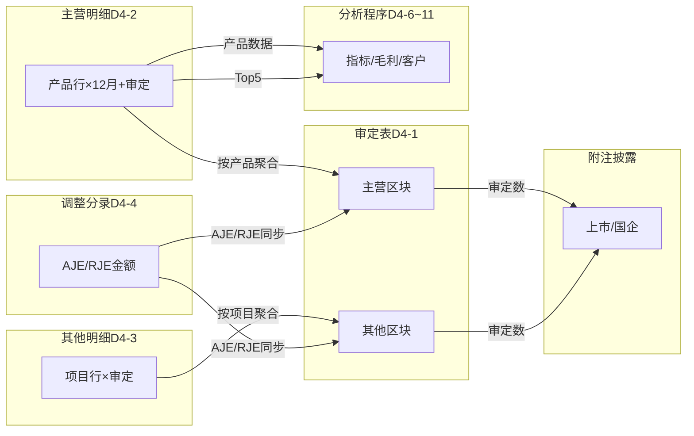

# Design Document: D4 营业收入底稿专属HTML精美组件

## Overview

将D4营业收入底稿从通用`d-form-table`/`audit-sheet`渲染升级为独立专属组件`d4-operating-revenue`。覆盖来自8个xlsx源模板的42个有效sheet（含5个底稿目录合并为1个统一目录Tab+1个"访谈记录与核对示例"模板sheet），科目6001主营业务收入+6051其他业务收入（损益类/贷方科目）。合计~280+公式。

这是平台最大的单科目底稿组件。核心设计目标：
- 新componentType `d4-operating-revenue`，主入口 GtD4OperatingRevenue.vue（嵌套Tab：一级7组×二级N个sheet）
- 每个sheet独立子组件（200-400行）+ 独立composable
- 3个共享composable：useD4FormData.ts + useD4FormulaEngine.ts（纯函数）+ useD4CrossSheet.ts
- 跨sheet数据流通过 allResponses Map computed 响应式链（不走API）
- 5+方EventBus联动 + GtIndexChip 10+处交叉索引
- 双模式（HTML ↔ OnlyOffice）+ 导入导出三级 + AI审计说明
- IPO/舞弊组条件可见性（business_category控制）

科目特征：6001+6051损益类/贷方科目。核心差异vs D3：无余额概念（损益取发生额）、22列月度宽表、CAS14五步法、截止双向测试、关联方价格公允性、IPO增强程序11 sheet、客户/经销商/境外多维检查。

## Architecture

### 分组嵌套Tab结构

```mermaid
graph TD
    subgraph "GtD4OperatingRevenue.vue (主入口 el-tabs)"
        G1[一级Tab: 核心]
        G2[一级Tab: 政策]
        G3[一级Tab: 分析程序]
        G4[一级Tab: 检查程序]
        G5[一级Tab: 关联方]
        G6[一级Tab: IPO/舞弊]
        G7[一级Tab: 其他收入]
    end

    G1 --> D4A[D4A程序表] & D41[D4-1审定表] & D42[D4-2主营明细] & D43[D4-3其他明细] & D44[D4-4调整分录] & NL[附注上市] & NS[附注国企]
    G2 --> D45[D4-5政策检查]
    G3 --> D46[D4-6指标] & D47[D4-7毛利月度] & D48[D4-8产品毛利] & D49[D4-9客户结构] & D410[D4-10客户价格] & D411[D4-11产品价格]
    G4 --> D412[D4-12合同] & D413[D4-13 ERP] & D414[D4-14发生] & D415[D4-15完整] & D416[D4-16出口] & D417[D4-17截止正] & D418[D4-18截止反] & D419[D4-19折扣] & D420[D4-20退货]
    G5 --> D421[D4-21关联价格]
    G6 --> D422A[D4-22A IPO程序] & D422[D4-22 IPO指标] & D423[D4-23发票] & D424[D4-24第三方] & D425[D4-25经销商] & D426[D4-26境外] & D427[D4-27未披露RP] & D428[D4-28核查清单] & D429[D4-29核查详细] & D430[D4-30访谈汇总] & D431[D4-31访谈详细] & D432[D4-32资金流水]
    G7 --> D433[D4-33其他毛利] & D434[D4-34合同测算] & D435[D4-35其他检查] & D436[D4-36其他截止]
end
```


### 文件结构

```
audit-platform/frontend/src/components/workpaper/
├── GtD4OperatingRevenue.vue              # 主入口 嵌套el-tabs（~200行）
├── d4/
│   ├── core/
│   │   ├── D4TabIndex.vue                # 统一底稿目录（~250行，合并8文件目录）
│   │   ├── D4TabAdjudication.vue         # D4-1 审定表（~400行）
│   │   ├── D4TabRevenueDetail.vue        # D4-2 主营明细22列宽表（~400行）
│   │   ├── D4TabOtherRevenue.vue         # D4-3 其他明细（~300行）
│   │   ├── D4TabAdjustment.vue           # D4-4 调整分录（~250行）
│   │   ├── D4TabDisclosureListed.vue     # 附注上市（~300行）
│   │   └── D4TabDisclosureSoe.vue        # 附注国企（~250行）
│   ├── policy/
│   │   └── D4TabPolicyCheck.vue          # D4-5 CAS14五步法（~400行）
│   ├── analysis/
│   │   ├── D4TabIndicator.vue            # D4-6 指标分析（~350行）
│   │   ├── D4TabMarginMonthly.vue        # D4-7 月度毛利（~300行）
│   │   ├── D4TabProductMargin.vue        # D4-8 产品毛利（~250行）
│   │   ├── D4TabCustomerStructure.vue    # D4-9 客户结构（~300行）
│   │   ├── D4TabCustomerPrice.vue        # D4-10 客户价格（~250行）
│   │   └── D4TabProductPrice.vue         # D4-11 产品价格（~250行）
│   ├── inspection/
│   │   ├── D4TabContract.vue             # D4-12 合同检查（~350行）
│   │   ├── D4TabErpCheck.vue             # D4-13 ERP核对（~200行）
│   │   ├── D4TabOccurrence.vue           # D4-14 发生检查（~350行）
│   │   ├── D4TabCompleteness.vue         # D4-15 完整性检查（~350行）
│   │   ├── D4TabExport.vue               # D4-16 出口核对（~250行）
│   │   ├── D4TabCutoffForward.vue        # D4-17 截止正向（~350行）
│   │   ├── D4TabCutoffBackward.vue       # D4-18 截止反向（~350行）
│   │   ├── D4TabDiscount.vue             # D4-19 折扣折让（~300行）
│   │   └── D4TabReturn.vue               # D4-20 退货检查（~350行）
│   ├── related/
│   │   └── D4TabRelatedPrice.vue         # D4-21 关联方价格（~300行）
│   ├── ipo/
│   │   ├── D4TabIpoProcedure.vue         # D4-22A IPO程序表（~200行）
│   │   ├── D4TabIpoIndicator.vue         # D4-22 IPO指标（~300行）
│   │   ├── D4TabInvoiceCompare.vue       # D4-23 发票对比（~250行）
│   │   ├── D4TabThirdParty.vue           # D4-24 第三方回款（~300行）
│   │   ├── D4TabDealer.vue               # D4-25 经销商（~300行）
│   │   ├── D4TabOverseas.vue             # D4-26 境外销售（~250行）
│   │   ├── D4TabUndisclosedRp.vue        # D4-27 未披露关联方（~250行）
│   │   ├── D4TabCustomerChecklist.vue    # D4-28 核查清单（~200行）
│   │   ├── D4TabCustomerDetail.vue       # D4-29 核查详细（~300行）
│   │   ├── D4TabInterviewSummary.vue     # D4-30 访谈汇总（~250行）
│   │   ├── D4TabInterviewDetail.vue      # D4-31 访谈详细（~300行）
│   │   ├── D4TabInterviewTemplate.vue   # 访谈记录与核对示例（~350行，走访模板）
│   │   └── D4TabFundFlow.vue             # D4-32 资金流水（~300行）
│   └── other/
│       ├── D4TabOtherMargin.vue          # D4-33 其他毛利（~250行）
│       ├── D4TabOtherContract.vue        # D4-34 合同测算（~250行）
│       ├── D4TabOtherCheck.vue           # D4-35 其他检查（~300行）
│       └── D4TabOtherCutoff.vue          # D4-36 其他截止（~300行）
├── composables/
│   ├── useD4FormData.ts                  # 数据加载/保存（~200行）
│   ├── useD4FormulaEngine.ts             # 纯函数公式引擎（~200行）
│   ├── useD4CrossSheet.ts                # 跨sheet联动computed（~300行）
│   ├── useD4Adjudication.ts              # D4-1 审定表逻辑（~300行）
│   ├── useD4RevenueDetail.ts             # D4-2 主营明细逻辑（~350行）
│   ├── useD4OtherRevenue.ts              # D4-3 其他明细逻辑（~250行）
│   ├── useD4Adjustment.ts                # D4-4 调整分录逻辑（~150行）
│   ├── useD4PolicyCheck.ts               # D4-5 政策检查逻辑（~200行）
│   ├── useD4Analysis.ts                  # D4-6~11 分析程序通用（~300行）
│   ├── useD4Inspection.ts                # D4-12~20 检查程序通用（~350行）
│   ├── useD4RelatedPrice.ts              # D4-21 关联方价格（~200行）
│   ├── useD4Ipo.ts                       # D4-22A~32 IPO组通用（~300行）
│   ├── useD4OtherGroup.ts               # D4-33~36 其他收入组（~250行）
│   ├── useD4DisclosureListed.ts          # 附注上市（~150行）
│   └── useD4DisclosureSoe.ts             # 附注国企（~100行）

backend/app/routers/wp_render_strategies/
│   ├── _d4_import_export.py              # 导入导出端点（~300行）
│   ├── _d4_resolvers.py                  # Auto Data Resolver（~200行）
│   └── _d4_ai_generate.py               # AI生成端点（~150行）
```

### 跨Sheet核心数据流



## Components and Interfaces

### 1. useD4FormulaEngine.ts — 纯函数公式引擎

```typescript
// 损益类/贷方科目公式：审定=未审+AJE+RJE（不涉及余额概念，取发生额）

/** 安全数值解析：null/undefined/空串/NaN → 0 */
export function parseNum(val: string | number | null | undefined): number

/** 审定数 = 未审 + AJE + RJE */
export function calcAuditedAmount(unadjusted: number, aje: number, rje: number): number

/** 月度合计 = SUM(1月~12月) */
export function calcMonthlyTotal(months: number[]): number

/** 审定数（含调整）= 未审合计 + 审计调整 */
export function calcAuditedWithAdj(unadjustedTotal: number, adjustment: number): number

/** 变动率: 基数=0且本期=0→'' | 基数=0→'N/A' | 其他→(本期-上期)/上期 */
export function calcChangeRate(prior: number, current: number): number | '' | 'N/A'

/** 变动额 = 本期 - 上期 */
export function calcChangeAmount(prior: number, current: number): number

/** 小计/合计 = SUM(数组) */
export function calcSubtotal(values: number[]): number

/** 毛利率 = (收入 - 成本) / 收入，收入=0→0 */
export function calcGrossMarginRate(revenue: number, cost: number): number

/** 占比 = 本项 / 合计 × 100%，合计=0→0 */
export function calcProportion(item: number, total: number): number

/** 价格差异率 = (关联方单价 - 非关联方单价) / 非关联方单价 × 100% */
export function calcPriceDiffRate(relatedPrice: number, nonRelatedPrice: number): number

/** 变动率绝对值是否超阈值 */
export function isChangeRateExceeding(rate: number | '' | 'N/A', threshold: number): boolean

/** 异常率 = 异常笔数 / 已检查笔数 × 100% */
export function calcAnomalyRate(anomalyCount: number, totalChecked: number): number

/** 覆盖率 = 已检查金额 / 收入合计 × 100% */
export function calcCoverageRate(checkedAmount: number, revenueTotal: number): number

/** 截止跨期判断: 凭证日期与参考日期（资产负债表日）是否跨期 */
export function isCrossPeriod(voucherDate: string, referenceDate: string, balanceSheetDate: string): boolean

/** 跨期天数 = |凭证日期 - 参考日期| */
export function calcCrossPeriodDays(voucherDate: string, referenceDate: string): number

/** 资金回流可疑判定: 同一对手短期内入+出且金额接近(差异<10%) */
export function isSuspiciousFundFlow(inAmount: number, outAmount: number, daysDiff: number, threshold?: number): boolean

/** IPO/舞弊组可见性: business_category包含指定关键字 */
export function isIpoGroupVisible(businessCategory: string): boolean
```

### 2. useD4FormData.ts — 基础数据加载/保存

```typescript
export interface UseD4FormDataOptions {
  wpId: Ref<string>
  projectId: Ref<string>
}

export function useD4FormData(options: UseD4FormDataOptions) {
  return {
    allResponses: Ref<Map<string, ChecklistResponse>>,
    isLoading: Ref<boolean>,
    projectContext: Ref<ProjectContext>,  // 含business_category/applicable_standards
    loadAll: () => Promise<void>,
    saveImmediate: (itemId: string, data: Partial<ChecklistResponse>) => Promise<void>,
    saveBatch: (items: Array<{ itemId: string; data: Partial<ChecklistResponse> }>) => Promise<void>,
    debouncedSave: (itemId: string, data: Partial<ChecklistResponse>) => void,
    writebackTrialBalance: (accountCode: string, auditedAmount: number) => Promise<void>,
  }
}
```

### 3. useD4CrossSheet.ts — 跨Sheet联动

```typescript
export interface UseD4CrossSheetOptions {
  allResponses: Ref<Map<string, ChecklistResponse>>
  projectContext: Ref<ProjectContext>
}

export function useD4CrossSheet(options: UseD4CrossSheetOptions) {
  return {
    // D4-2 → D4-1 按产品聚合
    mainRevenueByProduct: ComputedRef<Record<string, { current: number; prior: number }>>,
    mainRevenueTotal: ComputedRef<{ current: number; prior: number }>,
    // D4-3 → D4-1 按项目聚合
    otherRevenueByItem: ComputedRef<Record<string, { current: number; prior: number }>>,
    otherRevenueTotal: ComputedRef<{ current: number; prior: number }>,
    // D4-4 → D4-1 AJE/RJE
    adjustmentTotals: ComputedRef<{ mainAje: number; mainRje: number; otherAje: number; otherRje: number }>,
    // D4-2 → D4-8 产品毛利数据
    productRevenueForMargin: ComputedRef<ProductRevenueRow[]>,
    // D4-2 → D4-9 客户结构数据（Top5/Top10）
    customerStructureData: ComputedRef<CustomerRankRow[]>,
    // D4-1 → 附注
    adjudicationForDisclosure: ComputedRef<DisclosureSourceData>,
    // IPO组可见性
    ipoGroupVisible: ComputedRef<boolean>,
    // D4-2/D4-3行结构→D4-1行同步
    syncProductRowToAdjudication: (action: 'add' | 'remove', product: string) => void,
    syncOtherItemRowToAdjudication: (action: 'add' | 'remove', item: string) => void,
    // 附注成本跨循环取数（科目6401+6402从TB取）
    costFromTb: ComputedRef<{ mainCost: number; otherCost: number; priorMainCost: number; priorOtherCost: number }>,
    // 出口/境外适用性
    hasExportBusiness: ComputedRef<boolean>,
    // 状态
    crossSheetStatus: Ref<'loaded' | 'loading' | 'error'>,
  }
}
```

### 4. useD4Adjudication.ts — 审定表D4-1

```typescript
export interface AdjudicationRow {
  rowKey: string
  label: string
  isFixed: boolean
  currentUnadjusted: number
  currentAje: number
  currentRje: number
  currentAudited: number    // = 未审 + AJE + RJE
  priorUnadjusted: number
  priorAje: number
  priorRje: number
  priorAudited: number      // = 未审 + AJE + RJE
  isFromCrossSheet: boolean
  isEditable: boolean
}

export interface AdjudicationSection {
  sectionKey: 'main-revenue' | 'other-revenue'
  sectionLabel: string      // '一、主营业务收入' | '二、其他业务收入'
  rows: AdjudicationRow[]
  subtotalRow: AdjudicationRow   // 小计
}

export function useD4Adjudication(options: UseD4BaseOptions) {
  return {
    sections: ComputedRef<AdjudicationSection[]>,
    grandTotalRow: ComputedRef<AdjudicationRow>,  // 营业收入合计 = 主营小计 + 其他小计
    trialBalanceRow: ComputedRef<{ amount6001: number; amount6051: number; total: number }>,
    differenceRow: ComputedRef<number>,  // 审定合计 - TB数
    // 交叉验证警告
    mainCrossValidation: ComputedRef<string | null>,  // D4-1 vs D4-2
    otherCrossValidation: ComputedRef<string | null>, // D4-1 vs D4-3
    // 审计说明/结论
    auditNote: Ref<string>,
    auditConclusion: Ref<string>,
    // 操作
    updateCell: (rowKey: string, field: string, value: number) => void,
    addProductRow: () => void,
    removeProductRow: (rowKey: string) => void,
    publishAdjudicated: () => void,  // EventBus → TB回写6001+6051
  }
}
```

### 5. useD4RevenueDetail.ts — 主营明细D4-2（22列月度宽表）

```typescript
export interface RevenueDetailRow {
  rowId: string
  product: string           // A: 项目（产品/服务）
  months: number[]          // B~M: 1月~12月 (12个值)
  periodTotal: number       // N: =SUM(months)（自动）
  auditAdjustment: number   // O: 本期审计调整
  audited: number           // P: =N+O（自动）
  priorUnadjusted: number   // Q: 上期未审数
  priorAdjustment: number   // R: 上期审计调整
  priorAudited: number      // S: =Q+R（自动）
  unadjustedChangeRate: number | '' | 'N/A'  // T: =(N-Q)/Q（自动）
  auditedChangeRate: number | '' | 'N/A'     // U: =(P-S)/S（自动）
  remark: string            // V: 备注
}

export function useD4RevenueDetail(options: UseD4BaseOptions) {
  return {
    rows: Ref<RevenueDetailRow[]>,
    filteredRows: ComputedRef<RevenueDetailRow[]>,
    subtotalRow: ComputedRef<RevenueDetailRow>,   // 合计行
    verificationRow: ComputedRef<{ diff: number }>,  // 核对行 = 合计 - TB数(6001)
    searchQuery: Ref<string>,
    addRow: () => void,
    removeRow: (rowId: string) => void,
    updateCell: (rowId: string, field: string, value: any) => void,
    importFromLedger: () => Promise<void>,  // 从序时账导入
  }
}
```

### 6. useD4OtherRevenue.ts — 其他明细D4-3

```typescript
export interface OtherRevenueRow {
  rowId: string
  item: string              // 项目
  currentUnadjusted: number
  currentAdjustment: number
  currentAudited: number    // = 未审 + 调整（自动）
  currentProportion: number // = 本行/合计×100%（自动）
  priorUnadjusted: number
  priorAdjustment: number
  priorAudited: number      // = 未审 + 调整（自动）
  priorProportion: number   // 自动
  changeAmount: number      // = 本期审定 - 上期审定（自动）
  changeRate: number | '' | 'N/A'  // 自动
  remark: string
}

export function useD4OtherRevenue(options: UseD4BaseOptions) {
  return {
    rows: Ref<OtherRevenueRow[]>,
    subtotalRow: ComputedRef<OtherRevenueRow>,
    verificationRow: ComputedRef<{ diff: number }>,  // 合计 - TB数(6051)
    addRow: () => void,
    removeRow: (rowId: string) => void,
    updateCell: (rowId: string, field: string, value: any) => void,
  }
}
```

### 7. useD4Adjustment.ts — 调整分录D4-4

```typescript
export interface D4AdjustmentRow {
  rowId: string
  description: string
  category: string        // 报表调整/账项调整/其他
  reportItem: string
  accountName: string
  noteItem: string
  placeholder: string
  debitAmount: number
  creditAmount: number
  indexRef: string
  remark: string
}

export function useD4Adjustment(options: UseD4BaseOptions) {
  return {
    rows: Ref<D4AdjustmentRow[]>,
    debitTotal: ComputedRef<number>,
    creditTotal: ComputedRef<number>,
    isBalanced: ComputedRef<boolean>,
    balanceDiff: ComputedRef<number>,
    addRow: () => void,
    removeRow: (rowId: string) => void,
    updateCell: (rowId: string, field: string, value: any) => void,
    publishAdjustment: () => void,
    pushToA13: (rowIds: string[]) => void,
  }
}
```

### 8. useD4Analysis.ts — 分析程序组D4-6~11通用

```typescript
export interface IndicatorRow {
  key: string
  name: string
  currentValue: number
  priorValue: number
  change: number
  industryRef: string
  conclusion: 'normal' | 'abnormal' | 'attention'
}

export interface MarginRow {
  product: string
  months: number[]          // 12个月毛利率
  priorMonths: number[]     // 上期12月
  annual: number
  priorAnnual: number
  change: number
}

export interface CustomerRankRow {
  rank: number
  name: string
  amount: number
  proportion: number
}

export function useD4Analysis(options: UseD4BaseOptions & { crossSheet: ReturnType<typeof useD4CrossSheet> }) {
  return {
    // D4-6 指标
    indicators: Ref<IndicatorRow[]>,
    // D4-7 月度毛利
    marginMonthly: ComputedRef<MarginRow[]>,
    // D4-8 产品毛利
    productMargins: ComputedRef<ProductMarginRow[]>,
    // D4-9 客户结构
    top5Customers: ComputedRef<CustomerRankRow[]>,
    top10Customers: ComputedRef<CustomerRankRow[]>,
    hhi: ComputedRef<number>,
    concentrationWarning: ComputedRef<string | null>,  // Top5>50%
    // D4-10/11 价格
    customerPrices: Ref<CustomerPriceRow[]>,
    productPrices: Ref<ProductPriceRow[]>,
    // EventBus
    publishSignificantChange: (item: string, rate: number) => void,
  }
}
```

### 9. useD4Inspection.ts — 检查程序组D4-12~20通用

```typescript
export interface CutoffRow {
  rowId: string
  voucherNo: string
  voucherDate: string
  customerName: string
  amount: number
  shipDate?: string         // D4-17: 发货日
  signDate?: string         // D4-17: 签收日
  acceptDate?: string       // D4-17: 验收日
  isCrossPeriod: boolean    // 自动判定
  crossPeriodDays: number   // 自动计算
  adjustSuggestion: string
  remark: string
}

export interface SamplingParams {
  testPopulation: string
  specificSamples: string
  samplingPopulation: string
  samplingMethod: string
  targetSampleSize: number
  currentSampleSize: number
}

export function useD4Inspection(options: UseD4BaseOptions) {
  return {
    // D4-12 合同检查
    contractRows: Ref<ContractRow[]>,
    coverageRate: ComputedRef<number>,
    // D4-13 ERP
    erpRows: Ref<ErpCheckRow[]>,
    // D4-14/15 发生/完整性
    occurrenceSampling: Ref<SamplingParams>,
    occurrenceRows: Ref<VoucherCheckRow[]>,
    completenessSampling: Ref<SamplingParams>,
    completenessRows: Ref<VoucherCheckRow[]>,
    // D4-16 出口
    exportRows: Ref<ExportCheckRow[]>,
    // D4-17/18 截止
    cutoffForwardRows: Ref<CutoffRow[]>,
    cutoffBackwardRows: Ref<CutoffRow[]>,
    cutoffSummary: ComputedRef<{ total: number; crossCount: number; crossAmount: number; adjustAmount: number }>,
    // D4-19/20 折扣/退货
    discountRows: Ref<DiscountRow[]>,
    returnRows: Ref<ReturnRow[]>,
    postReturnRows: Ref<ReturnRow[]>,
    // 通用
    anomalyRate: (rows: any[]) => ComputedRef<number>,
    addSample: (section: string) => void,
  }
}
```

### 10. useD4Ipo.ts — IPO/舞弊组D4-22A~32

```typescript
export function useD4Ipo(options: UseD4BaseOptions & { visible: Ref<boolean> }) {
  return {
    // D4-23 发票对比
    invoiceRows: Ref<InvoiceCompareRow[]>,
    // D4-24 第三方回款
    thirdPartyRows: Ref<ThirdPartyRow[]>,
    // D4-25 经销商
    dealerRows: Ref<DealerRow[]>,
    // D4-26 境外
    overseasRows: Ref<OverseasRow[]>,
    // D4-27 未披露关联方
    undisclosedRpRows: Ref<UndisclosedRpRow[]>,
    // D4-28~29 客户核查
    customerChecklistRows: Ref<ChecklistRow[]>,
    customerDetailRows: Ref<CustomerDetailRow[]>,
    // D4-30~31 访谈
    interviewSummaryRows: Ref<InterviewSummaryRow[]>,
    interviewDetailRows: Ref<InterviewDetailRow[]>,
    // D4-32 资金流水
    fundFlowRows: Ref<FundFlowRow[]>,
    suspiciousFlows: ComputedRef<FundFlowRow[]>,  // 自动标记可疑项
  }
}
```

### 11. 后端接口

```python
# _d4_import_export.py
# POST /api/workpapers/{wp_id}/d4/export-template?sheet=D4-2
# POST /api/workpapers/{wp_id}/d4/export-data?sheet=D4-2
# POST /api/workpapers/{wp_id}/d4/import-data?sheet=D4-2

# _d4_resolvers.py
@register_resolver('d4_tb_unadjusted')     # trial_balance 6001+6051
@register_resolver('d4_ledger_monthly')     # tb_ledger 6001按月汇总
@register_resolver('d4_analysis_indicators') # 多科目余额计算指标

# _d4_ai_generate.py
# POST /api/workpapers/{wp_id}/d4/ai-generate
# sections: adj-note/adj-conclusion/revenue-change/policy-evaluation/
#           analysis-note/return-analysis/related-price/interview-questions
```

## Data Models

### checklist_responses item_id 命名规范

| Sheet | 前缀 | 示例 |
|-------|------|------|
| D4-1 审定表 | `D4-1-adj-` | `D4-1-adj-main-{rowKey}-currentUnadj`, `D4-1-adj-note` |
| D4-2 主营明细 | `D4-2-` | `D4-2-rows`（remark存JSON数组） |
| D4-3 其他明细 | `D4-3-` | `D4-3-rows`（remark存JSON数组） |
| D4-4 调整分录 | `D4-4-` | `D4-4-rows`（remark存JSON数组） |
| D4-5 政策检查 | `D4-5-` | `D4-5-step{1-5}-situation`, `D4-5-step{1-5}-conclusion` |
| D4-6~11 分析 | `D4-{N}-` | `D4-6-indicators`, `D4-7-rows`, `D4-8-rows` |
| D4-12 合同 | `D4-12-` | `D4-12-rows`（remark存JSON数组） |
| D4-13 ERP | `D4-13-` | `D4-13-rows` |
| D4-14~15 凭证 | `D4-{N}-` | `D4-14-params`, `D4-14-rows` |
| D4-16 出口 | `D4-16-` | `D4-16-rows` |
| D4-17~18 截止 | `D4-{N}-` | `D4-17-rows`, `D4-18-rows` |
| D4-19~20 折扣/退货 | `D4-{N}-` | `D4-19-rows`, `D4-20-rows`, `D4-20-post-rows` |
| D4-21 关联价格 | `D4-21-` | `D4-21-rows` |
| D4-22A~32 IPO | `D4-{N}-` | `D4-23-rows`, `D4-24-rows`, `D4-32-rows` |
| D4-33~36 其他 | `D4-{N}-` | `D4-33-rows`, `D4-34-rows` |
| 附注上市 | `D4-note-listed-` | `D4-note-listed-section1-rows` |
| 附注国企 | `D4-note-soe-` | `D4-note-soe-section1-rows` |

### D4-2 主营明细22列行结构

```json
// item_id: "D4-2-rows", remark字段:
[
  {
    "rowId": "row-uuid-1",
    "product": "产品A",
    "months": [100000, 120000, 95000, 110000, 130000, 125000, 140000, 135000, 128000, 142000, 138000, 145000],
    "auditAdjustment": 0,
    "priorUnadjusted": 1400000,
    "priorAdjustment": 0,
    "remark": ""
  }
]
```

注意：`periodTotal`/`audited`/`priorAudited`/`unadjustedChangeRate`/`auditedChangeRate` 由前端公式引擎实时计算，不存储。

### 跨Sheet数据映射

| D4-1目标 | 数据来源 | 路径 |
|----------|---------|------|
| 主营-产品A(本期审定) | D4-2 rows where product='产品A' | audited |
| 主营小计(本期审定) | D4-2 subtotalRow | audited |
| 其他-项目X(本期审定) | D4-3 rows where item='项目X' | currentAudited |
| 其他小计(本期审定) | D4-3 subtotalRow | currentAudited |
| 主营AJE列 | D4-4 rows where accountName contains '6001' | SUM(debit-credit) |
| 其他AJE列 | D4-4 rows where accountName contains '6051' | SUM(debit-credit) |
| 附注(1)收入合计 | D4-1 grandTotal.currentAudited | 直接引用 |
| 附注(2)分产品 | D4-2 rows per product | audited per product |
| D4-8 产品毛利 | D4-2 rows (收入) + 对应成本 | computed |
| D4-9 客户Top5 | D4-2 rows sorted by audited desc | top 5 |

### EventBus事件清单

| 事件名 | 发布者 | 消费者 | Payload |
|--------|--------|--------|---------|
| `substantive:adjudicated` | D4-1 | TB回写 | `{ wpCode:'D4', accountCode:'6001,6051', auditedAmount: { main, other } }` |
| `adjustment:created` | D4-4 | D4-1, A13 | `{ wpCode:'D4', entryType:'AJE'\|'RJE', amount, accountCode }` |
| `analytical:significant-change` | D4-6~11 | A1-13 | `{ wpCode:'D4', indicator, changeRate }` |
| `risk:updated` | B50 | D4A | `{ riskLevel, affectedAccounts }` |
| `disclosure:note-text-updated` | 附注 | 附注模块 | `{ wpCode:'D4', section, text }` |

## Correctness Properties

*A property is a characteristic or behavior that should hold true across all valid executions of a system—essentially, a formal statement about what the system should do. Properties serve as the bridge between human-readable specifications and machine-verifiable correctness guarantees.*

### Property 1: 损益类审定数公式链正确性

*For any* D4-2行输入（12个月金额 + 审计调整 + 上期未审 + 上期调整），以下公式链必须成立：
- 本期未审合计 N = SUM(1月~12月)
- 本期审定数 P = N + O（审计调整）
- 上期审定数 S = Q + R（上期未审 + 上期调整）
- 未审变动比例 T = (N-Q)/Q（Q=0特殊处理）
- 审定变动比例 U = (P-S)/S（S=0特殊处理）

同时适用于D4-3：审定数 = 未审 + 调整；变动额 = 本期审定 - 上期审定；变动比例 = (本期-上期)/上期。

**Validates: Requirements 1.5, 2.3, 3.2, 4.2**

### Property 2: 合计行恒等于明细行之和

*For any* 明细行列表（1~N行，每行含K个数值列），合计行的每个数值列应等于对应列所有明细行值的SUM。适用于D4-1小计/合计、D4-2合计、D4-3合计、D4-12覆盖率分母、D4-14/15/17/18汇总。

**Validates: Requirements 2.4, 3.3, 4.3, 9.4, 10.5, 11.5, 15.7**

### Property 3: 动态行添加保持结构不变量

*For any* 当前行列表（长度N），执行addRow()后行列表长度应为N+1，新行所有数值字段为0，新行位于合计行之前。

**Validates: Requirements 3.4, 4.4, 5.2, 9.2, 13.4**

### Property 4: 变动率阈值高亮判定

*For any* 数值 r（非空非'N/A'）和阈值 t，`isChangeRateExceeding(r, t)` 返回 true 当且仅当 `|r| > t`。覆盖30%/20%/10%/5%多级阈值。

**Validates: Requirements 3.6, 4.5, 8.2, 8.3, 8.5, 13.3, 25.8**

### Property 5: 跨Sheet聚合正确性（D4-2/D4-3→D4-1）

*For any* D4-2行数据集按产品分组，每组的audited之和应等于D4-1主营区块对应行的currentAudited值。同理D4-3→D4-1其他区块。且D4-1营业收入合计 = 主营小计 + 其他小计。

**Validates: Requirements 2.4, 2.6, 2.7, 17.1, 17.2**

### Property 6: 调整分录借贷平衡检查

*For any* 调整分录行列表，isBalanced为true当且仅当SUM(debitAmount) === SUM(creditAmount)。

**Validates: Requirements 5.3**

### Property 7: 调整分录EventBus同步正确性

*For any* adjustment:created事件payload（含entryType='AJE'|'RJE', amount, accountCode），审定表D4-1对应区块（6001→主营/6051→其他）的AJE/RJE列应正确累加该金额。

**Validates: Requirements 5.5, 17.3, 18.2**

### Property 8: 差异行与交叉验证

*For any* (审定合计, TB数) 对，差异 = 审定合计 - TB数。差异≠0时产生红色高亮。
*For any* (D4-1主营小计, D4-2合计行audited) 对，不一致时产生黄色警告（含差额）。

**Validates: Requirements 2.5, 2.6, 2.7**

### Property 9: 截止跨期自动判断

*For any* 凭证日期和参考日期（发货/签收/验收），当两个日期分别位于资产负债表日两侧时，isCrossPeriod=true，跨期天数=两日期之差绝对值。

**Validates: Requirements 11.3**

### Property 10: 毛利率公式正确性

*For any* (收入, 成本) 对，毛利率 = (收入-成本)/收入。收入=0时返回0。适用于D4-7/D4-8/D4-33。

**Validates: Requirements 8.2, 8.3, 15.1**

### Property 11: 关联方价格差异率

*For any* (关联方单价, 非关联方单价) 对，差异率 = (关联-非关联)/非关联×100%。非关联=0时返回'N/A'。差异率绝对值>10%黄色、>20%红色。

**Validates: Requirements 13.2, 13.3**

### Property 12: 客户集中度Top5计算

*For any* 明细行数据集（N行），Top5为按期末金额降序排列前5行（N<5则取全部）。Top5占比 = Top5金额之和/合计×100%。占比>50%时产生集中度警告。

**Validates: Requirements 8.4**

### Property 13: IPO/舞弊组可见性控制

*For any* business_category字符串，IPO组Tab可见当且仅当字符串包含'ipo'|'listed'|'neeq'|'restructuring'|'fraud_risk'之一（大小写不敏感）。

**Validates: Requirements 14.1, 26.7**

### Property 14: 资金回流可疑判定

*For any* (流入金额, 流出金额, 天数差) 三元组，当同一对手方的入账和出账金额差异<10%且天数差<30天时，标记为可疑。

**Validates: Requirements 14.11**

### Property 15: 导入导出Round-Trip

*For any* 有效的D4-2动态行数组（每行含product+months+adjustments），JSON.stringify序列化后再JSON.parse反序列化应产生等价数据。扩展：导出xlsx再导入应还原等价行。

**Validates: Requirements 20.6, 24.2**

### Property 16: 金额格式化规则

*For any* 数值amount，格式化输出满足：正数→千分位分隔保留2位小数；负数→红色+括号格式如(1,234.56)；零→显示"-"。百分比列：保留2位小数+%后缀。

**Validates: Requirements 25.1, 25.2, 25.3, 25.4**

### Property 17: EventBus审定数回写正确性

*For any* D4-1审定数变化，writebackTrialBalance应向trial_balance写入正确金额到科目6001（主营审定数）和6051（其他审定数），并发布substantive:adjudicated事件。

**Validates: Requirements 2.10, 18.1**

### Property 18: 异常率与覆盖率计算

*For any* 检查行列表，异常率 = 标记为异常的行数 / 总行数 × 100%。覆盖率 = 已检查合同金额 / 主营收入合计 × 100%。

**Validates: Requirements 9.4, 10.5, 11.5**

### Property 19: 搜索过滤正确性

*For any* 搜索关键字q和D4-2行列表，filteredRows中每行的product应包含q（大小写不敏感），且所有匹配行都应出现（无遗漏无多余）。

**Validates: Requirements 3.9**

### Property 20: 占比计算正确性

*For any* (本行审定值, 合计审定值) 对，占比 = 本行/合计×100%。合计=0时占比=0。所有行占比之和应等于100%（浮点精度内）。

**Validates: Requirements 4.2**

## Error Handling

| 场景 | 处理方式 |
|------|---------|
| 跨sheet数据加载失败（allResponses中key不存在） | 显示"-"占位符 + 黄色三角警告图标 |
| checklist_responses API失败 | ElMessage.warning；保留本地已有数据 |
| 导入xlsx格式不匹配 | 返回400 + 错误列名列表；ElMessage.error展示 |
| 导入xlsx行数超限(>500行) | 后端截断 + 返回警告摘要 |
| parseNum遇到NaN/Infinity | 统一返回0 |
| OnlyOffice健康检查失败 | 禁用"在线编辑" + tooltip |
| EventBus事件publish失败 | console.warn不阻塞 |
| 动态行JSON解析失败 | 回退空数组 + ElMessage.warning |
| writebackTrialBalance失败 | ElMessage.warning |
| AI生成接口超时/失败 | ElMessage.warning + 不阻塞手动编辑 |
| TB数据尚未导入 | 灰色"待导入TB"占位文字 |
| 跨sheet引用值计算失败 | 浅蓝背景改为灰色 + "数据异常"tooltip |
| 虚拟滚动行数<阈值 | 自动降级为普通el-table渲染 |

## Testing Strategy

### 单元测试（vitest）

- useD4FormulaEngine.ts 全部纯函数：边界值、零值、负数、NaN、Infinity
- 跨sheet聚合：D4-2→D4-1按产品聚合、D4-3→D4-1按项目聚合、D4-4→D4-1 AJE/RJE同步
- 截止跨期判断：日期跨越/未跨越资产负债表日各种边界
- IPO可见性：各business_category组合
- 资金回流判定：金额接近/不接近、天数各种组合
- 金额格式化：千分位、负数括号、零值、百分比
- 搜索过滤：空串、中文、特殊字符
- EventBus事件payload结构
- 借贷平衡验证
- Top5排序+集中度警告

### Property-Based Tests（fast-check）

每个correctness property对应一个PBT测试，最少100次迭代。

库选择：**fast-check**（项目已有，前端PBT标准选择）

标签格式：`Feature: d4-operating-revenue, Property {N}: {title}`

| Property | 测试文件 | 生成器 |
|----------|---------|--------|
| P1 公式链 | `useD4FormulaEngine.spec.ts` | `fc.float({min:-1e9,max:1e9})` × 14 (12月+adj) |
| P2 合计行 | `useD4FormulaEngine.spec.ts` | `fc.array(fc.float, {minLength:1, maxLength:30})` |
| P3 动态行 | `useD4RevenueDetail.spec.ts` | `fc.array(RevenueDetailRow生成器)` |
| P4 阈值判定 | `useD4FormulaEngine.spec.ts` | `fc.float({min:-10,max:10})` + `fc.float({min:0.01,max:1})` |
| P5 跨Sheet聚合 | `useD4CrossSheet.spec.ts` | 自定义 RevenueDetailRow[] + product枚举 |
| P6 借贷平衡 | `useD4Adjustment.spec.ts` | `fc.array(fc.record({debit:fc.float,credit:fc.float}))` |
| P7 AJE同步 | `useD4Adjudication.spec.ts` | `fc.constantFrom('AJE','RJE')` + `fc.float` + accountCode |
| P8 差异/交叉验证 | `useD4Adjudication.spec.ts` | `fc.float` × 4 (合计/TB/D4-2/D4-3) |
| P9 截止跨期 | `useD4Inspection.spec.ts` | `fc.date` × 3 (voucher/ref/balanceSheet) |
| P10 毛利率 | `useD4FormulaEngine.spec.ts` | `fc.float({min:0,max:1e9})` × 2 |
| P11 关联价格差异 | `useD4FormulaEngine.spec.ts` | `fc.float({min:0.01,max:1e6})` × 2 |
| P12 Top5集中度 | `useD4Analysis.spec.ts` | `fc.array(fc.float({min:0}), {minLength:1,maxLength:50})` |
| P13 IPO可见性 | `useD4FormulaEngine.spec.ts` | `fc.string` + fc.constantFrom keywords |
| P14 资金回流 | `useD4Ipo.spec.ts` | `fc.float` × 2 + `fc.nat({max:60})` |
| P15 Round-trip | `d4ImportExport.spec.ts` | 自定义 RevenueDetailRow[] JSON生成器 |
| P16 金额格式化 | `useD4FormulaEngine.spec.ts` | `fc.float({min:-1e12,max:1e12})` |
| P17 EventBus回写 | `useD4Adjudication.spec.ts` | `fc.float` × 2 (main/other audited) |
| P18 异常率/覆盖率 | `useD4Inspection.spec.ts` | `fc.nat` × 2 + `fc.float` × 2 |
| P19 搜索过滤 | `useD4RevenueDetail.spec.ts` | `fc.string` + `fc.array(RowGen)` |
| P20 占比计算 | `useD4FormulaEngine.spec.ts` | `fc.float({min:0})` × 2 |

### 后端集成测试（hypothesis）

- 导入导出round-trip：生成随机D4-2行数据→export→import→验证等价
- resolver测试：d4_tb_unadjusted/d4_ledger_monthly/d4_analysis_indicators
- render策略函数：验证返回结构含必需字段

### 注册与契约测试

- htmlRendererRegistry.spec.ts：验证'd4-operating-revenue'已注册
- VALID_COMPONENT_TYPES契约：验证后端允许'd4-operating-revenue'
- wp_code_overrides契约：验证D4/D4-1~D4-36映射正确
- RENDERER_DISPATCH契约：验证'd4-operating-revenue'策略已注册

### 测试配置

```typescript
// fast-check 配置
fc.assert(fc.property(...), { numRuns: 100 })

// 标签示例
// Feature: d4-operating-revenue, Property 1: 损益类审定数公式链正确性
```
