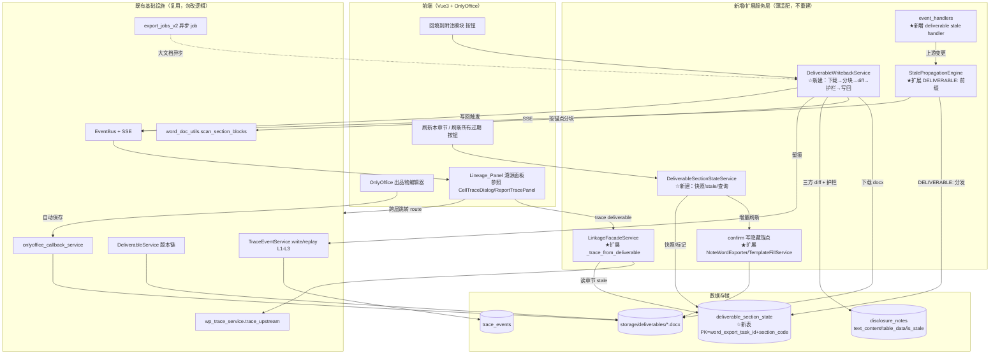
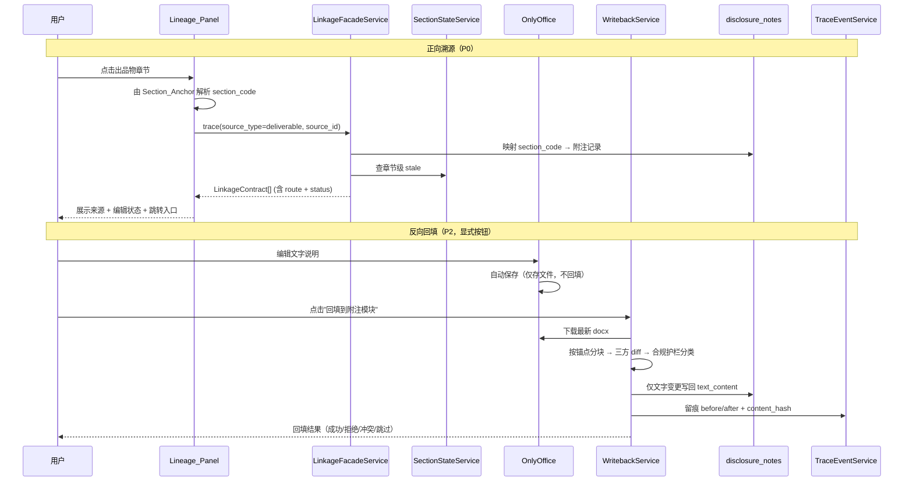

# 设计文档：出品物溯源与回填（deliverable-lineage-and-writeback）

## 概述

本功能为审计全链路打通**双向数据流**：让**附注出品物（disclosure_notes → 附注 docx）**正向追溯其数据来源（调整分录→审定表→报表→附注），并将出品物中人工撰写的文字说明安全反向回填到上游附注模块。

**核心定位：扩展接入已有体系，而非重建。** 经 codegraph 实证，约 80% 的溯源/联动/Stale/回填/留痕基础设施已经存在并在生产运行。本设计的全部新增点都以"接入/适配/扩展已有服务"为前提：

- 溯源穿透复用 `LinkageFacadeService.trace(...)`（已支持 tb/workpaper/note/report 四源），**仅新增 `deliverable` 分支**；
- Stale 传播复用 `StalePropagationEngine.on_change(uri, ...)`（已支持 `WP:`/`REPORT:`/`NOTE:` 三前缀的 `_mark_stale_by_uri`），**仅新增 `DELIVERABLE:` 前缀分发**；
- 事件订阅复用 `EventBus` + `event_handlers`，**仅新增一个 handler**；
- 留痕复用 `TraceEventService.write/replay`（L1/L2/L3），**不新建留痕表**；
- 章节块定位复用 `word_doc_utils.scan_section_blocks / delete_section_block / remove_section_markers` 与 `NoteWordExporter._export_template_mode` 的算法。

**唯一允许新建的是数据结构**：出品物层的章节级 stale 状态与源数据快照哈希在现有 schema 无承载位置，故新建 `deliverable_section_state` 表。注意：上游 `disclosure_notes.is_stale` **本就是章节级行存储**（每个 `note_section` 占单独一行，`is_stale` 是行级字段），存储粒度并不缺——真正问题是 event_handlers 按 `WHERE project_id AND year` 一律全标，丢失"哪章变"的精度。新表的必要性**不在于上游缺章节粒度**，而在于**出品物层从未有任何章节状态承载（全新维度）**：出品物从未接入任何 stale/快照体系。"勿重建"约束指**服务/引擎逻辑**，不禁止新增承载状态的表。

**出品物身份模型（codegraph 实证，贯穿本设计）**：本系统**没有** `deliverable_id` 这一概念。出品物的真实身份模型是：

- **`WordExportTask`（主表）**：主键 `id`（即 task_id），含 `doc_type`/`project_id`/`status` 等字段，是出品物的稳定身份载体；
- **`WordExportTaskVersion`（版本链）**：外键 `word_export_task_id` + `version_no`，承载每一次重新生成的版本快照；
- **附注出品物 = `doc_type='disclosure_notes'` 的一个 `WordExportTask`**，由该 task 承载整份附注 docx（含所有 `##SECTION:` 章节块）。

因此本设计全程以 **`word_export_task_id`（UUID，关联 `word_export_task.id`）** 作为出品物章节状态、API 路径、`DELIVERABLE:` URI、服务签名的身份键，**不使用 `deliverable_id`**。

**章节 stale 绑定 task 级（非 version 级，关键决策）**：章节级 stale 状态绑定到 `word_export_task` 维度（跨版本稳定），而非具体 `version_no`。理由：重新生成新版本后，上游变更导致的 stale 状态应延续到 task 维度，不能因版本递增而丢失。`deliverable_section_state` 唯一约束为 `(word_export_task_id, section_code)`；保留 `version_no`（nullable）作为"该快照对应版本"的记录列，但**不参与主键/唯一约束**。

> **快照分层复用（见决策 D9）**：快照与过期检测复用既有 `DeliverableSnapshotService`。**分层配合，非平行新建**：doc 级复用现有 `DeliverableSnapshotService.tb_hash`（整张试算表 MD5，作为"整份变没变"的廉价闸门）；章节级 Source_Snapshot_Hash 在 `tb_hash` 口径上**细化到 `section_code` + `text_content`**（`tb_hash` 不含 `text_content`）。stale 检测先比 doc 级 `tb_hash` 判整份是否变，变了才逐章算 section hash 定位具体章节。

**范围（MVP）**：本期仅覆盖**附注出品物**。报告正文 Word（OPT 段落，无 section_code）与财务报表 Excel（单元格 `{{row:}}` 占位）的溯源/回填不在本期范围（见 requirements 附录 D）。

**三项关键决策（已与用户确认，贯穿本设计）**：

1. **仅附注**——MVP 只做附注链路，验证"段落锚点 + 章节级 stale + 显式回填"三件套后再推广。
2. **允许新数据结构**——逻辑层严禁重建，但状态承载层可新建 `deliverable_section_state` 表。
3. **显式按钮触发回填**——回填由用户在出品物界面点击"回填到附注模块"按钮触发，OnlyOffice 自动保存只走现有 `onlyoffice_callback_service` 完成文件存储/版本，绝不自动回填。

**实施前置硬依赖**：本功能须等 `audit-report-template-integration` 的 task 0.6（附注模板整理，含 0.6.2 全量打标）完成 + task 10.2/10.4 灰度可用（`USE_TEMPLATE_FILL_SERVICE=true`）后才能开始编码。段落锚点写入与单章节增量刷新都建立在 template 模式的章节块定位能力之上（见末节"实施前置依赖重申"）。

---

## 架构

### 整体接入图



★ = 扩展已有；☆ = 新建（仅适配/状态承载，不重建总线/引擎）

### 数据流（正向溯源 + 反向回填）



---

## 关键设计决策

| # | 决策点 | 候选选项 | 结论 | 理由 |
|---|--------|----------|------|------|
| D1 | **段落锚点形式** | (a) 隐藏书签 `w:bookmarkStart/End name="sec_xxx"`；(b) 自定义 `docProperty`；(c) SDT 内容控件 `w:sdt` | **推荐 (a) 隐藏书签**，设计阶段做 POC 二次确认（需求 2.2） | 书签是 OOXML 原生定位机制，python-docx 可经 `w:body` 直接增删 `w:bookmarkStart/End` 元素、按 name 定位；OnlyOffice 完整支持书签且编辑时不可见、不影响排版。docProperty 是文档级全局属性、无法绑定到具体段落（一个属性对应一处，章节多则需多属性且无段落位置）。SDT 内容控件虽能绑段落但 OnlyOffice 对自定义 SDT 的保真度历史上不稳定，且会改变正文结构、增加被用户误删风险。 |
| D2 | **章节级 stale 存储** | (a) 复用 `disclosure_notes.is_stale`；(b) 新建 `deliverable_section_state` 表 | **新建表** | 新表的必要性在于**出品物层从未有任何章节状态承载（全新维度）**——出品物从未接入任何 stale/快照体系，须按 `(word_export_task_id, section_code)` 绑定具体出品物的源快照，现有 schema 无承载位置。**并非上游缺粒度**：上游 `disclosure_notes.is_stale` 本就是章节级行存储（每 `note_section` 一行），只是 event_handlers 按 `WHERE project_id AND year` 一律全标丢失了"哪章变"精度。这是 requirements 明确允许的"数据结构例外"。 |
| D3 | **回填触发方式** | (a) OnlyOffice 自动保存回调触发；(b) 用户显式按钮触发 | **显式按钮** | 自动保存频繁（编辑中途即触发），自动回填会造成大量噪声写入、频繁触发 `NOTE_SECTION_SAVED` 级联与 stale 抖动。显式按钮给用户明确的"我现在要把文字同步回附注"语义，配合合规护栏一次性分类裁决。`onlyoffice_callback_service` 保存路径保持不变（仅存文件/版本）。 |
| D4 | **章节级 diff 算法** | (a) 依赖 OnlyOffice 段落级 diff；(b) 下载 docx 按锚点分块后文本比对 | **下载分块文本比对** | OnlyOffice callback 只提供"文件已保存"信号 + 下载 URL，**不提供段落级 diff**。故回填时下载最新 docx → `scan_section_blocks` 按锚点（书签区间）切出每章节块 → 提取块内文字 → 与 DB `text_content` 比对，自行计算章节级 diff。 |
| D5 | **DELIVERABLE: URI 接入** | (a) 新建并行传播引擎；(b) 扩展 `StalePropagationEngine._mark_stale_by_uri` | **扩展现有引擎** | 现有 `_mark_stale_by_uri` 已按 `uri.split(":")` 前缀分发到 WP/REPORT/NOTE 三类 UPDATE。新增 `DELIVERABLE:` 分支，UPDATE `deliverable_section_state.is_stale`，复用同一 `on_change → BFS → _mark_stale_by_uri → _notify_frontend` 流程，零并行引擎。 |
| D6 | **自触发 stale 循环防护**（需求 4.9） | (a) 不防护；(b) 回填写回时携带来源标记，handler 据此跳过来源出品物 | **来源标记跳过** | 回填写回 `text_content` 会触发 `NOTE_SECTION_SAVED`，若不防护会把"自己刚回填的出品物"标 stale，造成"回填后立即过期"的体验循环。回填时在事件 `extra` 携带 `writeback_source_deliverable_id`，新增 handler 在标 deliverable stale 时跳过该 id。 |
| D7 | **大文档处理** | (a) 同步；(b) `export_jobs_v2` 异步 | **章节数 > 100 走异步**（需求 10.2） | 回填/全量刷新涉及大型出品物时通过现有 `export_jobs_v2` 返回 job_id + 进度，不阻塞主 API。 |
| D8 | **确定性哈希算法** | (a) Python `hash()`；(b) `hashlib.sha256` 规范化 JSON | **sha256 + 规范化序列化** | `hash()` 进程间不稳定（PYTHONHASHSEED）。须对相同输入产生相同哈希（需求 10.5），用 `json.dumps(..., sort_keys=True, ensure_ascii=False)` 规范化后 sha256，避免 dict 键序/浮点表示导致的误报。 |
| D9 | **快照分层复用 DeliverableSnapshotService** | (a) 新建平行章节快照体系；(b) 在既有 doc 级 `tb_hash` 上分层细化 | **分层复用，非平行新建** | **doc 级**复用现有 `DeliverableSnapshotService.tb_hash`（整张试算表 MD5），作为"整份变没变"的廉价闸门；**章节级** Source_Snapshot_Hash 在 `tb_hash` 口径上细化到 `section_code` + `text_content`（`tb_hash` 不含 `text_content`）。两层配合：stale 检测先比 doc 级 `tb_hash` 整份判断，变了才逐章算 section hash 定位具体章节（对齐需求 4.2），避免每次全章哈希的开销，也不重复造快照轮子。 |

### D1 段落锚点 POC 验证计划（需求 2.2）

POC 在实施前以最小脚本独立验证隐藏书签的双方可读可定位，**不改生产模板**：

1. **写入**：用 python-docx 在一份合成附注 docx 的章节块 `open_el` 前插入 `<w:bookmarkStart w:id w:name="sec_八_1"/>`、`close_el` 后插入 `<w:bookmarkEnd w:id/>`，保存。
2. **OnlyOffice 往返**：上传到 OnlyOffice Docker（9.4.0 已确认可用）→ 打开确认书签不可见、排版无变化 → 编辑无关章节后保存 → 经 signed-download 重新下载。
3. **python-docx 回读**：对下载回来的 docx 重新 `scan_section_blocks` + 按 name 定位书签区间，断言能正确切出对应章节块的文字。
4. **结论判定**：①不可见 ②往返不丢 ③可按 name 定位三项全过 → 采用书签；任一不过 → 回退评估 SDT 内容控件（POC 同口径补测）。

> POC 结果将回写本设计，确定最终锚点形式后才进入需求 2 的编码实施。

---

## 组件与接口

### 既有组件复用关系（实证签名）

| 组件 | 实证签名 | 本功能用法 |
|------|----------|------------|
| `LinkageFacadeService.trace` | `async trace(*, project_id, source_type, source_id, cell=None, year=None) -> list[dict]` | 新增 `source_type == "deliverable"` 分支 |
| `word_doc_utils.scan_section_blocks` | `scan_section_blocks(doc) -> list[SectionBlock]`（body 级遍历 `<w:p>`+`<w:tbl>`，SectionBlock 含 `section_code/open_el/close_el/elements`） | 回填分块 + 增量刷新定位 |
| `word_doc_utils.delete_section_block` | `delete_section_block(block) -> int` | 增量刷新替换前删除旧块 |
| `word_doc_utils.remove_section_markers` | `remove_section_markers(doc) -> int`（删 `##SECTION:##` + 清 `##STYLE_REF:##`） | confirm 写锚点后再清可见标记 |
| `StalePropagationEngine.on_change` | `async on_change(source_uri, project_id, year) -> dict` | 上游变更入口 |
| `StalePropagationEngine._mark_stale_by_uri` | `async _mark_stale_by_uri(uris, project_id, year) -> dict[str,int]` | 扩展 DELIVERABLE 分支 |
| `TraceEventService.write` | `async write(db, project_id, event_type, object_type, object_id, actor_id, action, ..., before_snapshot, after_snapshot, content_hash, ...) -> trace_id` | 回填/冲突留痕 |
| `TraceEventService.replay` | `async replay(db, trace_id, level="L1") -> dict` | 留痕回放 |
| `DeliverableSnapshotService`（doc 级 `tb_hash`） | doc 级整张试算表 MD5，绑 `WordExportTask.source_snapshot_refs`（不含 `text_content`、不分章节） | **复用为廉价闸门**：分层 stale 检测先判 doc 级 `tb_hash`（D9），变了才逐章算 section hash |
| `NoteWordExporter._export_template_mode` | `async _export_template_mode(project_id, year, *, template_type, report_scope, sections, ...) -> BytesIO`（调用 scan_section_blocks + delete_section_block + remove_section_markers） | 增量刷新复用章节块定位算法；confirm 写锚点接入点 |

### 1. LinkageFacadeService 扩展（需求 1，P0）

在现有 `trace` 的 `if/elif` 链新增分支，并实现 `_trace_from_deliverable`：

```python
# trace() 内新增分支
elif source_type == "deliverable":
    contracts = await self._trace_from_deliverable(
        project_id=project_id, source_id=source_id, cell=cell, year=year,
    )

async def _trace_from_deliverable(
    self, *, project_id: UUID, source_id: str, cell: str | None, year: int | None,
) -> list[dict[str, Any]]:
    """出品物章节 → 附注 → 上游溯源。

    source_id 约定：'{word_export_task_id}:{section_code}'。
    1. 拆解 source_id，按 section_code 映射 disclosure_notes 记录（含 legacy_alias 归一）。
    2. 若无匹配记录 → 返回明确的"无匹配来源"结果并记录 section_code（需求 1.4）。
    3. 复用 wp_trace_service.trace_upstream 继续向上游展开（附注→报表→审定表→调整分录，需求 1.5）。
    4. 沿用 LinkageContract（含 route），附加章节级 stale 状态（来自 deliverable_section_state）。
    仅读取，不修改 disclosure_notes（需求 1.6）。
    """
```

- 沿用现有 `LinkageContract`，`route` 字段支持跨层跳转（需求 3）；
- stale 附加在现有 `_enrich_conflict_stale` 之外补一步章节级 stale 查询（读 `deliverable_section_state.is_stale`）。

### 2. 段落锚点写入（需求 2，P0，阻塞于 task 10.2/10.4）

在 `NoteWordExporter._export_template_mode`（及 `TemplateFillService` confirm 路径）的清理标记**之前**插入锚点写入步骤。当前算法末尾是"7. 清理残留标记 `remove_section_markers`"，改为：

```
6.5（新增）write_section_anchors(doc, kept_codes)
        # 对每个保留章节块，在 open_el 前插入 w:bookmarkStart、close_el 后插入 w:bookmarkEnd
        # 锚点名 = anchor_name(section_code)
7. remove_section_markers(doc)   # 仍清除可见 ##SECTION:## 标记
```

锚点命名（需求 2.6，双向可映射）：

```python
def anchor_name(section_code: str) -> str:
    """section_code → 安全锚点名。'八、1' → 'sec_八_1'。
    OOXML 书签名禁空格，用确定性替换保证可逆。"""
    safe = section_code.strip().replace("、", "_").replace(" ", "").replace("·", "_")
    return f"sec_{safe}"

def section_code_from_anchor(name: str) -> str | None:
    """逆映射：'sec_八_1' → '八、1'（结合 section_code_index 校验存在性）。"""
```

- 被裁剪删除（未导出）的章节**不写锚点**（需求 2.5）——只对 `kept_codes` 写；
- 锚点保持隐藏，不影响可见正文与对外格式（需求 2.3）；
- 阻塞标注：`USE_TEMPLATE_FILL_SERVICE=false` 期间该步骤标"阻塞中"，灰度开启后实施（需求 2.7、7）。

### 3. DeliverableSectionStateService（新建，需求 4/5/8）

```python
class DeliverableSectionStateService:
    """出品物章节级状态：快照计算 / stale 标记 / 查询。
    仅承载状态，不含传播逻辑（传播复用 StalePropagationEngine）。"""

    def __init__(self, db: AsyncSession): ...

    async def compute_source_snapshot_hash(
        self, project_id: UUID, year: int, section_code: str,
    ) -> str:
        """计算章节源快照哈希（需求 4.1 / 10.5）。
        覆盖：disclosure_notes.text_content + table_data + 相关 audited_amount。
        规范化 JSON（sort_keys, ensure_ascii=False）→ sha256，确定性。
        与 doc 级 tb_hash 分层配合（D9）：tb_hash 不含 text_content，
        本章节级 hash 在其口径上细化到 section_code + text_content。"""

    async def snapshot_on_confirm(
        self, word_export_task_id: UUID, project_id: UUID, year: int, kept_codes: list[str],
    ) -> None:
        """confirm 生成时为每个保留章节 upsert 快照 + 清 stale（需求 4.1/4.6）。"""

    async def mark_section_stale(
        self, word_export_task_id: UUID, section_code: str, *, source_uri: str,
    ) -> int:
        """被 StalePropagationEngine 调用，置章节 is_stale=true。"""

    async def clear_section_stale(
        self, word_export_task_id: UUID, section_code: str, new_hash: str,
    ) -> None:
        """增量刷新/全量刷新后清 stale + 更新快照（需求 4.6 / 5.3）。"""

    async def get_section_states(
        self, word_export_task_id: UUID,
    ) -> list[dict]:
        """供 Lineage_Panel 与回填冲突检测查询章节状态 + 基线 hash。"""

    async def detect_upstream_drift(
        self, word_export_task_id: UUID, project_id: UUID, year: int, section_code: str,
    ) -> bool:
        """冲突检测用（需求 8.1）：当前 DB 内容哈希 ≠ 生成时基线 hash → 上游已独立修改。"""
```

### 4. StalePropagationEngine 扩展（需求 4.2/4.4，P1）

在 `_mark_stale_by_uri` 的前缀分组逻辑新增 `DELIVERABLE`：

```python
# URI 约定：DELIVERABLE:{word_export_task_id}:{section_code}
elif module == "DELIVERABLE" and code:
    deliverable_codes.append((code, parts[2] if len(parts) > 2 else ""))
# ...
if deliverable_codes:
    # UPDATE deliverable_section_state SET is_stale=true
    # WHERE word_export_task_id=:wid AND section_code=:sc
    counts["deliverable"] = ...
```

- 复用现有 `on_change → _bfs → _mark_stale_by_uri → _notify_frontend`，零并行引擎；
- SSE 推送复用 `_notify_frontend`，前端 Lineage_Panel 经现有 `LINKAGE_STALE_CHANGED` 事件感知（需求 4.7）。

### 5. event_handlers 新增 handler（需求 4.3/4.9，P1）

```python
async def on_upstream_changed_mark_deliverable_stale(payload: EventPayload) -> None:
    """上游 disclosure_notes/financial_report/adjustments 变更 → 标受影响出品物章节 stale。
    自触发防护（需求 4.9）：
      若 payload.extra.get('writeback_source_deliverable_id') == 本出品物 word_export_task_id，则跳过该出品物。
      （事件 extra 的语义键名沿用 writeback_source_deliverable_id，其值指代来源出品物的 word_export_task_id。）
    流程：
      1. 由变更 section_code/row_code 反查依赖它的出品物章节（deliverable_section_state）。
      2. 对每个受影响 (word_export_task_id, section_code) 调 StalePropagationEngine
         on_change(f'DELIVERABLE:{word_export_task_id}:{section_code}', ...) 或直接 mark。
      3. 跳过 writeback_source_deliverable_id（= 来源出品物 word_export_task_id）。
    """
```

订阅现有事件（调整分录变更、`REPORTS_UPDATED`、`NOTE_SECTION_SAVED`），不新建事件类型。

### 6. DeliverableWritebackService（新建，需求 6/7/8/9，P2）

```python
class DeliverableWritebackService:
    """OnlyOffice 文字回填管道（显式按钮触发）。"""

    async def writeback(
        self, word_export_task_id: UUID, project_id: UUID, year: int, actor_id: UUID,
        *, resolutions: dict[str, str] | None = None,
    ) -> WritebackResult:
        """显式回填主流程（需求 7）：
        0. 终态检查（需求 11.1/11.3）：查 WordExportTask.status，若 ∈ {signed, confirmed,
           archived} 终态 → 拒绝回填，返回中文说明（"该出品物已签字/确认/归档，不可回填或
           刷新；如需修改请走撤回/解锁流程"），不创建新版本。复用现有终态判定常量
           （TERMINAL_REEXPORT_STATUSES / create_version 对 archived 抛 ValueError 的同一判定）。
        1. 下载最新已保存 docx（DeliverableService 当前版本）。
        2. scan_section_blocks 按 Section_Anchor 分块，提取每章节文字（需求 7.3/7.4）。
        3. 锚点缺失/损坏的章节 → 跳过并列入"无法定位、未回填"（需求 7.9）。
        4. 对每章节做合规护栏分类（见下节），仅文字变更进入候选（需求 6/7.5）。
        5. 冲突检测（detect_upstream_drift）：上游已独立改 → 暂停该章节，呈现三方内容
           等待 resolutions 裁决（需求 8）。
        6. 写回 disclosure_notes.text_content（仅文字、无冲突或已裁决）。
        7. 写回成功触发 NOTE_SECTION_SAVED，extra 携带 writeback_source_deliverable_id
           （值为来源出品物 word_export_task_id，需求 7.6/4.9）。
        8. 更新该章节 source_snapshot_hash 为最新基线（需求 8.6）。
        9. 全程 TraceEventService.write 留痕（含被拒变更 + 拒绝原因，需求 9）。
        下载/解析失败 → 中止本次、保留 DB 原值、记录原因（需求 7.8）。"""

    def _extract_section_text(self, doc, anchor_name: str) -> str | None:
        """按书签区间提取章节文字（复用 scan_section_blocks 块边界 + 书签定位）。"""

    def _classify_change(self, section_code, old_note, new_text) -> ChangeClassification:
        """合规护栏分类（需求 6，见下节）。"""
```

`WritebackResult` 含：`written[]`（已回填章节）、`rejected[]`（被护栏拒绝 + 原因）、`conflicts[]`（待裁决三方内容）、`skipped[]`（锚点丢失）、`trace_id`。

### 7. 单章节增量刷新（需求 5，P1，阻塞于 task 10.2）

复用 `_export_template_mode` 的章节块定位，新增"只刷一章"路径：

```python
async def refresh_section(
    self, word_export_task_id, project_id, year, section_code, actor_id,
) -> RefreshResult:
    """单章节增量刷新（需求 5）：
    0. 终态检查（需求 11.1/11.3）：查 WordExportTask.status，若 ∈ {signed, confirmed,
       archived} 终态 → 拦截并提示终态约束，不创建新版本；复用 create_version 归档锁同一判定。
    1. 下载当前 docx，scan_section_blocks 经 Section_Anchor 定位目标块（需求 5.2）。
    2. 若覆盖用户已编辑内容 → 需用户确认（需求 5.5）。
    3. delete_section_block + 用最新 disclosure_notes 内容重新填充该块。
    4. 仅更新该章节 source_snapshot_hash + 清 stale，不影响其他章节（需求 5.3）。
    5. 经 DeliverableService 创建新版本 version_no+1，保留旧版本（需求 5.4）。
    不全量重生成整份文档（需求 5.1）。"""

async def refresh_all_stale_sections(self, word_export_task_id, ...) -> RefreshResult:
    """批量刷新所有 stale 章节，逐章节复用 refresh_section，
    保留未过期且已人工编辑的章节，覆盖人工编辑按 5.5 统一提示确认（需求 5.7）。
    主流程开头同样做终态检查（需求 11.1/11.3）：终态出品物拦截，不创建新版本。"""
```

### 8. 前端 Lineage_Panel（需求 3，P0）

- 参照 `CellTraceDialog` / `ReportTracePanel` / `useLinkageTraceDrawer` 布局与状态管理，**不新建并行溯源面板体系**（需求 3.4）；
- 选中章节 → 经 Section_Anchor 解析 `section_code` → 调 `trace(source_type='deliverable')` → 展示来源类型/标识/编辑状态（含 stale）（需求 3.1/3.2）；
- 跳转复用 `LinkageContract.route`（需求 3.3）；
- 锚点缺失（旧版本出品物）→ 提示"该出品物版本不支持溯源，请重新生成"，不报错（需求 3.5）；
- 所有可见文本中文化（需求 3.6）；
- "回填到附注模块"/"刷新本章节"/"刷新所有过期"按钮 + 冲突三方裁决弹窗；
- **终态出品物只读（需求 11.4）**：当出品物处于 `signed`/`confirmed`/`archived` 终态时，Lineage_Panel 仍允许查看溯源（只读），但**禁用**"回填到附注模块"/"刷新本章节"/"刷新所有过期"入口（按钮 disabled + 悬浮提示"该出品物已签字/确认/归档，不可回填或刷新"），避免对定稿发起改写。

---

## 数据模型

### 新表 `deliverable_section_state`

按 `(word_export_task_id, section_code)` 粒度承载章节级 stale、源快照哈希、回填基线。**绑 task 级（跨版本稳定）**：身份键为 `word_export_task_id`（关联 `word_export_task.id`），章节状态延续到 task 维度，重新生成新版本（`version_no` 递增）后既有 stale 状态不丢失；`version_no` 仅作记录列，不参与主键/唯一约束。

> **前瞻性（对齐 requirements 附录 D）**：本表字段**不绑死附注 doc_type**，以 `word_export_task_id + section_code` 为通用主键。本期只接 `doc_type='disclosure_notes'`，未来报表/报告正文出品物可复用**同一张表 + 同一套溯源/回填/stale 机制**，无需另起炉灶。

| 列 | 类型 | 说明 |
|----|------|------|
| `id` | UUID PK | `gen_random_uuid()` |
| `word_export_task_id` | UUID NOT NULL | 出品物标识（关联 `word_export_task.id`，即 task_id；绑 task 级跨版本稳定） |
| `version_no` | INT NULL | 该快照对应的出品物版本号（记录用，**不入主键/唯一约束**） |
| `project_id` | UUID NOT NULL | 项目（查询/权限过滤） |
| `year` | INT NOT NULL | 年度 |
| `section_code` | VARCHAR(64) NOT NULL | 章节编码（= disclosure_notes.note_section，canonical） |
| `source_snapshot_hash` | VARCHAR(64) | 生成时源快照 sha256（text_content+table_data+audited_amount） |
| `is_stale` | BOOLEAN NOT NULL DEFAULT false | 章节级过期标记 |
| `last_writeback_baseline_hash` | VARCHAR(64) | 最近回填后基线哈希（冲突检测用） |
| `anchor_name` | VARCHAR(64) | 该章节在 docx 中的锚点名（sec_xxx，便于回填定位/校验） |
| `created_at` | TIMESTAMPTZ NOT NULL DEFAULT now() | TimestampMixin |
| `updated_at` | TIMESTAMPTZ NOT NULL DEFAULT now() | TimestampMixin |

约束与索引：

- PK `id`；
- 唯一约束 `uq_deliverable_section (word_export_task_id, section_code)`；
- 索引 `idx_dss_project_year (project_id, year)`、`idx_dss_stale (word_export_task_id, is_stale)`、`idx_dss_section (project_id, year, section_code)`（供 event_handlers 反查依赖某 section_code 的出品物章节）。

### 迁移 V067 + 回滚 R067（当前最高 V066）

`V067__deliverable_section_state.sql`（CREATE TABLE IF NOT EXISTS，含 created_at/updated_at 显式列——遵循 TimestampMixin 铁律；表注释说明绑 task 级 + 通用可扩展）：

```sql
-- deliverable_section_state：出品物章节级状态承载（章节 stale + 源快照 hash + 回填基线）
-- 身份键 word_export_task_id 绑 task 级（跨版本稳定），version_no 仅记录列不入唯一约束
-- 字段不绑死附注 doc_type，未来报表/报告正文出品物可复用同表
CREATE TABLE IF NOT EXISTS deliverable_section_state (
    id UUID PRIMARY KEY DEFAULT gen_random_uuid(),
    word_export_task_id UUID NOT NULL,
    version_no INT,
    project_id UUID NOT NULL,
    year INT NOT NULL,
    section_code VARCHAR(64) NOT NULL,
    source_snapshot_hash VARCHAR(64),
    is_stale BOOLEAN NOT NULL DEFAULT false,
    last_writeback_baseline_hash VARCHAR(64),
    anchor_name VARCHAR(64),
    created_at TIMESTAMPTZ NOT NULL DEFAULT now(),
    updated_at TIMESTAMPTZ NOT NULL DEFAULT now()
);
CREATE UNIQUE INDEX IF NOT EXISTS uq_deliverable_section
    ON deliverable_section_state (word_export_task_id, section_code);
CREATE INDEX IF NOT EXISTS idx_dss_project_year
    ON deliverable_section_state (project_id, year);
CREATE INDEX IF NOT EXISTS idx_dss_stale
    ON deliverable_section_state (word_export_task_id, is_stale);
CREATE INDEX IF NOT EXISTS idx_dss_section
    ON deliverable_section_state (project_id, year, section_code);
```

`R067__rollback.sql`：`DROP TABLE IF EXISTS deliverable_section_state;`

### ORM 模型（三层一致：DDL = ORM = service）

加入 `audit_platform_models.py`，继承 `TimestampMixin`：

```python
class DeliverableSectionState(Base, TimestampMixin):
    __tablename__ = "deliverable_section_state"
    id: Mapped[UUID] = mapped_column(primary_key=True, default=uuid4)
    word_export_task_id: Mapped[UUID] = mapped_column(nullable=False)
    version_no: Mapped[int | None] = mapped_column(nullable=True)  # 记录列，不入主键/唯一约束
    project_id: Mapped[UUID] = mapped_column(nullable=False)
    year: Mapped[int] = mapped_column(nullable=False)
    section_code: Mapped[str] = mapped_column(String(64), nullable=False)
    source_snapshot_hash: Mapped[str | None] = mapped_column(String(64))
    is_stale: Mapped[bool] = mapped_column(default=False, nullable=False)
    last_writeback_baseline_hash: Mapped[str | None] = mapped_column(String(64))
    anchor_name: Mapped[str | None] = mapped_column(String(64))
    __table_args__ = (
        UniqueConstraint("word_export_task_id", "section_code", name="uq_deliverable_section"),
    )
```

### Source_Snapshot_Hash 计算口径（需求 4.1 / 10.5）

```
snapshot_input = {
    "section_code": <canonical section_code>,
    "text_content": <disclosure_notes.text_content 或 "">,
    "table_data":   <disclosure_notes.table_data 规范化（dict 按 sort_keys）>,
    "audited_amounts": <该章节依赖的 audited_amount 列表，按 account_code 排序，金额转字符串>,
}
hash = sha256(
    json.dumps(snapshot_input, sort_keys=True, ensure_ascii=False, separators=(",", ":")).encode("utf-8")
).hexdigest()
```

确定性保证：键序固定（sort_keys）、中文不转义（ensure_ascii=False）、金额统一转字符串（避免浮点表示漂移）、相关 audited_amount 按科目编码排序。相同输入恒产生相同哈希，stale 检测无误报（需求 10.5）。

### 回填冲突三方模型（需求 8.2）

冲突呈现时携带三方内容供用户裁决：

```python
class WritebackConflict(TypedDict):
    section_code: str
    deliverable_value: str   # 出品物侧编辑值（本次下载提取）
    upstream_value: str      # 上游当前值（DB disclosure_notes.text_content）
    baseline_value: str      # 生成时基线值（按 source_snapshot_hash 对应版本）
```

---

## 正确性属性（Correctness Properties）

*属性（property）是一种在系统所有有效执行中都应恒成立的特征或行为——本质上是关于系统应当做什么的形式化陈述。属性是人类可读规格与机器可验证正确性保证之间的桥梁。*

下列属性由验收标准经 prework 分析、去冗余整合而来（金额禁倒灌等合规护栏整合为单一分类属性；留痕写入/回放整合为往返属性）。每条属性均为全称量化，供后续属性化测试实现。

### Property 1：deliverable→附注映射正确性

*对任意* 出品物章节 `(word_export_task_id, section_code)`，当该 `section_code`（含 legacy_alias 归一）在 `disclosure_notes` 存在对应记录时，`trace(source_type='deliverable', source_id='{word_export_task_id}:{section_code}')` 返回的契约必映射到该附注记录并包含其编辑状态。

**Validates: Requirements 1.2**

### Property 2：契约结构复用（含 route）

*对任意* deliverable 溯源返回的契约，其结构必符合现有 `LinkageContract`（不新增并行契约类型）且包含 `route` 字段以支持跨层跳转。

**Validates: Requirements 1.3**

### Property 3：溯源只读不变量

*对任意* deliverable 溯源调用，调用前后 `disclosure_notes` 的内容保持不变；且将出品物章节标 stale 时只更新 `deliverable_section_state`，绝不翻转 `disclosure_notes.is_stale`。

**Validates: Requirements 1.6, 4.4**

### Property 4：上游链路延续

*对任意* 映射到具有上游链路（附注→报表→审定表→调整分录）的附注的出品物章节，deliverable 溯源结果必包含经 `wp_trace_service.trace_upstream` 展开的上游链接。

**Validates: Requirements 1.5**

### Property 5：保留章节有锚点、裁剪章节无锚点

*对任意* 保留章节集合与裁剪章节集合，confirm 生成的 docx 中每个保留章节的 `section_code` 都有可解析的 Section_Anchor，而每个被裁剪删除的章节都没有对应锚点。

**Validates: Requirements 2.1, 2.5**

### Property 6：锚点写入保留可见正文、清除可见标记

*对任意* 附注 docx，写入隐藏锚点不改变文档的可见正文文本；且 confirm 完成后文档不再含可见 `##SECTION:##` 标记同时含隐藏锚点。

**Validates: Requirements 2.3, 2.4**

### Property 7：锚点命名往返

*对任意* 有效 `section_code`，`section_code_from_anchor(anchor_name(section_code)) == section_code`（锚点名与章节编码可双向映射）。

**Validates: Requirements 2.6**

### Property 8：confirm 计算并存储章节快照哈希

*对任意* 保留章节，confirm 生成出品物版本后，`deliverable_section_state` 中存在该章节的快照行，且其 `source_snapshot_hash` 等于 `compute_source_snapshot_hash` 对该章节的计算结果。

**Validates: Requirements 4.1**

### Property 9：DELIVERABLE: URI 标记正确行

*对任意* `DELIVERABLE:{word_export_task_id}:{section_code}` 形式的 URI，经 `StalePropagationEngine._mark_stale_by_uri` 处理后，恰好对应的 `deliverable_section_state` 行被置 `is_stale=true`，其他模块表（WP/REPORT/NOTE）不受影响。

**Validates: Requirements 4.2, 4.4**

### Property 10：上游变更标记依赖出品物章节 stale

*对任意* 上游变更（disclosure_notes/financial_report/adjustments）影响某 `section_code`，所有依赖该 `section_code` 的出品物章节都被标记为 stale。

**Validates: Requirements 4.3**

### Property 11：自回填不标记来源出品物自身 stale

*对任意* 携带 `writeback_source_deliverable_id = X` 的回填触发的 `NOTE_SECTION_SAVED` 事件，stale handler 不得将出品物 X 自身的章节标记为 stale（但可标记其他依赖同一附注的出品物）。

**Validates: Requirements 4.9**

### Property 12：增量刷新只影响目标 stale 章节集合

*对任意* 含 stale 与非 stale 混合章节的出品物，单章节/批量刷新只更新目标 stale 章节，其余章节的正文内容与状态行均保持不变。

**Validates: Requirements 5.1, 5.3, 5.7**

### Property 13：刷新后目标章节内容等于最新附注

*对任意* 被刷新的章节，刷新后该章节在 docx 中的文字内容等于最新 `disclosure_notes` 对应章节的内容。

**Validates: Requirements 5.2**

### Property 14：刷新/回填创建新版本且保留旧版本

*对任意* 单章节或批量刷新操作，出品物 `version_no` 递增 1，且旧版本仍可经 `DeliverableService` 版本链检索。

**Validates: Requirements 5.4**

### Property 15：基线对账（刷新/裁决写回后）

*对任意* 刷新或冲突裁决写回后，相应章节的 stale 标记被清除，且其基线哈希（`source_snapshot_hash` / `last_writeback_baseline_hash`）等于当前源内容哈希。

**Validates: Requirements 4.6, 8.6**

### Property 16：回填合规护栏分类

*对任意* 出品物变更项，回填管道将其分类为文字说明 / 表格数字 / 标题三类之一；只有文字说明类被写回 `disclosure_notes.text_content`，`table_data` 绝不被修改，标题变更被忽略，且表格/标题类变更的拒绝结果携带指引走调整分录（AJE/RJE）的中文说明。

**Validates: Requirements 6.1, 6.2, 6.3, 6.4, 6.5, 6.6, 7.5**

### Property 17：章节级 diff 精确识别变更章节

*对任意* 下载的 docx 与 DB 内容对，按 Section_Anchor 分块文本比对计算出的变更章节集合恰好等于实际发生文字变更的章节集合（不依赖 OnlyOffice 段落级 diff）。

**Validates: Requirements 7.3, 7.4**

### Property 18：部分锚点丢失的隔离处理

*对任意* 存在部分章节锚点被删/破坏的 docx，回填跳过这些无法定位的章节并在结果中明确列出"无法定位、未回填"，同时不影响其他锚点完好章节的正常回填。

**Validates: Requirements 7.9**

### Property 19：冲突检测谓词

*对任意* 章节，回填时判定为冲突当且仅当该章节当前 DB 内容哈希 ≠ 生成时基线哈希（即上游在出品物生成后被独立修改过）。

**Validates: Requirements 8.1**

### Property 20：冲突呈现三方且非裁决不写回

*对任意* 被判定冲突的章节，回填结果必包含含三方内容（出品物侧编辑值、上游当前值、生成时基线值）的冲突条目，且在用户提供显式裁决前该章节绝不被自动写回。

**Validates: Requirements 8.2, 8.3**

### Property 21：回填留痕写入→回放往返

*对任意* 回填或冲突裁决写回操作，经 `TraceEventService.write` 写入留痕后，`replay(trace_id, level)` 能取回该留痕事件链（与现有溯源留痕使用同一回放入口）。

**Validates: Requirements 7.7, 8.5, 9.1, 9.4**

### Property 22：留痕字段完整性

*对任意* 回填留痕事件，其内容完整包含操作人、时间、出品物标识与版本、目标 `section_code`、before/after `text_content` snapshot 及 content_hash。

**Validates: Requirements 9.2**

### Property 23：被拒变更留痕

*对任意* 因合规护栏被拒绝的变更项，系统记录一条包含被拒变更内容及拒绝原因的留痕。

**Validates: Requirements 9.3**

### Property 24：回填权限闸门

*对任意* 不具备 `project:write`（或等同附注编辑权限）的用户，触发回填必被拒绝；仅具备 `project:read` 的用户只能查看溯源面板，不能触发回填。

**Validates: Requirements 10.3**

### Property 25：应用审计日志写入

*对任意* 回填或刷新操作，`app_audit_log` 中存在对应的操作记录。

**Validates: Requirements 10.4**

### Property 26：快照哈希确定性

*对任意* 源内容输入，`compute_source_snapshot_hash` 多次调用（含跨进程）产生相同哈希；且内容相等但对象不同的输入产生相同哈希（stale 检测无误报）。

**Validates: Requirements 10.5**

### Property 27：现有四类源向后兼容

*对任意* 现有 `tb`/`workpaper`/`note`/`report` 源类型的 `trace` 调用，本功能上线前后返回结果保持一致（不修改既有溯源行为）。

**Validates: Requirements 10.6**

### Property 28：终态出品物禁止回填与刷新

*对任意* 处于终态（`signed`/`confirmed`/`archived`）的出品物，触发回填（writeback）或刷新（refresh_section / refresh_all_stale_sections）必被拒绝，且不创建新版本（`version_no` 不递增）。

**Validates: Requirements 11.1, 11.3**

---

## 回填合规护栏设计（需求 6 核心）

回填的审计合规底线：**只允许文字说明（text_content）回填，金额/表格数字严禁从出品物倒灌，标题忽略不回填。** 这是审计数据链可信度的强约束（对应 Property 16）。

### 变更项字段分类算法

回填管道对每个被识别为"变更"的章节块，逐变更项分类：

```python
class ChangeKind(str, Enum):
    TEXT = "text"      # 文字说明（text_content）→ 放行
    TABLE = "table"    # 表格数字（table_data）→ 拒绝
    TITLE = "title"    # 章节标题（section_code + {{seq:}} 生成）→ 忽略

def _classify_change(self, section_code, old_note, new_block) -> list[ChangeClassification]:
    """对一个章节块内的变更项分类。
    判定依据（按块内结构定位，不靠正则猜测）：
      - 章节块内的「表格元素」(<w:tbl>) 中的数字单元格 → TABLE
      - 章节标题段落（块首标题行，由 {{seq:}} 编号 + section 名构成）→ TITLE
      - 其余正文段落（叙述性文字）→ TEXT
    """
```

分类与处置矩阵：

| 变更类型 | 定位依据 | 处置 | 结果 | 对应附录 B |
|----------|----------|------|------|-----------|
| TEXT 文字说明 | 章节块内非标题、非表格的正文段落 | **放行**写回 `text_content` | `written[]` | ✅ 可回填 |
| TABLE 表格数字 | 章节块内 `<w:tbl>` 数字单元格 | **拒绝**，提示"金额变更须通过调整分录（AJE/RJE）修正，不可从出品物回填" | `rejected[]` + 中文原因 | ❌ 严禁回填 |
| TITLE 章节标题 | 块首标题行（`{{seq:}}` 编号 + 名称） | **忽略**（不写）并记录 | `rejected[]`（kind=title，记录态） | ⚠️ 忽略不回填 |

- 表格数字变更（相对生成时基线）→ 拒绝该变更并留痕（需求 6.3 + 9.3）；
- 标题文字变更 → 忽略并记录（需求 6.4）；
- 所有拒绝项给出明确中文拒绝说明，指引走调整分录路径（需求 6.6）；
- 该护栏分类是回填写回的**前置闸门**，任何写回都必须先通过分类（需求 6.5）。

---

## 章节级 diff + 冲突检测算法（需求 7/8）

### 章节级 diff（需求 7.3/7.4）

OnlyOffice 不提供段落级 diff，故自行计算：

```
1. 下载最新已保存 docx（DeliverableService 当前版本）
2. doc = Document(docx); blocks = scan_section_blocks(doc)
   （注：成品 docx 已无 ##SECTION:## 可见标记，改以书签区间界定块；
     回填用 anchor_name → 书签 start/end 之间的 body 元素切块）
3. 对每个章节：
     deliverable_text = 提取块内 TEXT 段落文字（剔除标题/表格）
     db_text          = disclosure_notes.text_content（按 section_code 归一查）
     if normalize(deliverable_text) != normalize(db_text):
         标记为「变更章节」
4. 仅对「变更章节」进入护栏分类 + 冲突检测 + 写回
```

`normalize()`：去首尾空白、统一换行、合并连续空白，避免格式噪声误判变更。

### 三方比对冲突检测（需求 8）

每个变更章节涉及三个值：

```
deliverable_value : 出品物侧当前编辑值（本次下载提取）
upstream_value    : 上游当前值（DB disclosure_notes.text_content）
baseline_value    : 生成时基线值（出品物生成时的源快照对应内容）
```

冲突判定（Property 19）：

```
current_db_hash = compute_source_snapshot_hash(... 当前 DB ...)
baseline_hash   = deliverable_section_state.source_snapshot_hash（生成时基线）

if current_db_hash == baseline_hash:
    # 上游自出品物生成后未变 → 无冲突，可直接写回（经护栏）
    write_back(deliverable_value)
else:
    # 上游已被独立修改 → 冲突
    if deliverable_value == upstream_value:
        # 双方改成一样 → 实质无冲突，幂等跳过
        skip(reason="一致")
    else:
        # 真冲突 → 暂停，呈现三方内容等待裁决（不静默覆盖）
        conflicts.append(WritebackConflict(section_code, deliverable_value, upstream_value, baseline_value))
```

- 冲突复用 `LinkageFacadeService` 已有 conflict/stale 状态能力（需求 8.4），不新建判定逻辑；
- 用户裁决（保留出品物值 / 保留上游值 / 自定义）经 `resolutions` 参数回传，写回后更新基线哈希（需求 8.6 / Property 15）；
- 检测、裁决、写回全程 `TraceEventService` 留痕（需求 8.5 / Property 21）。

---

## API 契约

所有端点在 `backend/app/routers/` 下新增，必在 `router_registry` 注册（铁律）。返回体经现有 `ResponseWrapperMiddleware` 包成 `{code, message, data}`（前端需解信封）。

### 溯源查询

```
GET /api/projects/{project_id}/deliverables/{word_export_task_id}/trace
  query: section_code (str, 必填), year (int, 可选)
  权限: project:read
  resp.data: { contracts: LinkageContract[], section_state: { is_stale, source_snapshot_hash } }
  超时 2s 返回明确错误（需求 10.1）
```

### 章节状态查询

```
GET /api/projects/{project_id}/deliverables/{word_export_task_id}/section-states
  权限: project:read
  resp.data: { sections: [{ section_code, is_stale, anchor_name, source_snapshot_hash }] }
```

### 回填触发（显式）

```
POST /api/projects/{project_id}/deliverables/{word_export_task_id}/writeback
  权限: project:write（无权限 403，需求 10.3）
  body: { year: int, resolutions?: { [section_code]: "deliverable"|"upstream"|"<custom>" } }
  行为: 终态出品物（signed/confirmed/archived）拒绝并返回中文说明（需求 11.1/11.3）；
        章节数 ≤ 100 同步返回；> 100 走 export_jobs_v2 返回 { job_id }（需求 10.2）
  resp.data: WritebackResult { written[], rejected[], conflicts[], skipped[], trace_id }
            | { job_id }（异步）
```

### 单/批量刷新

```
POST /api/projects/{project_id}/deliverables/{word_export_task_id}/refresh-section
  权限: project:write
  body: { year: int, section_code: str, confirm_overwrite?: bool }
  行为: 终态出品物拒绝并提示终态约束，不创建新版本（需求 11.1/11.3）
  resp.data: RefreshResult { version_no, refreshed: [section_code], requires_confirm?: bool }

POST /api/projects/{project_id}/deliverables/{word_export_task_id}/refresh-stale
  权限: project:write
  body: { year: int, confirm_overwrite?: bool }
  行为: 终态出品物拒绝（需求 11.1/11.3）；批量刷新所有 stale 章节；> 100 走异步
  resp.data: RefreshResult | { job_id }
```

### 冲突裁决

冲突裁决复用回填端点：首次回填返回 `conflicts[]`，前端收集用户选择后再次 `POST .../writeback` 携带 `resolutions` 完成写回（避免新增并行裁决端点）。

### 留痕回放（复用现有）

回填留痕经现有 `TraceEventService.replay` 入口回放，不新增端点（需求 9.4）。

---

## 前端设计

### Lineage_Panel 组件

- 位置：出品物 OnlyOffice 编辑界面左侧引用面板；
- 参照 `CellTraceDialog` / `ReportTracePanel` / `useLinkageTraceDrawer` 的布局与状态管理（需求 3.4），复用 `useLinkageTraceDrawer` 抽屉状态；
- 交互：用户在 OnlyOffice 中选中/点击章节 → 经 OnlyOffice JS API 取当前书签/光标位置 → 解析 `anchor_name` → `section_code_from_anchor` → 调溯源查询端点；
- 展示：来源类型（附注/报表/审定表/调整分录）、来源标识、当前编辑状态（含 stale 徽标"源数据已变更"）；
- 跳转：点击来源的跳转入口 → 用 `LinkageContract.route` 经 vue-router 导航（需求 3.3）；
- 降级：无可解析锚点（旧版本出品物）→ 显示"该出品物版本不支持溯源，请重新生成"，不报错（需求 3.5）；
- 中文化：所有可见文本中文，技术术语（SQL/UUID/API）保留英文（需求 3.6）；遵循 GT 紫令牌。

### OnlyOffice 集成点

- 编辑器复用现有 JS API 方式（`new DocsAPI.DocEditor(containerId, config)`，非 iframe src）；
- 自动保存走现有 `onlyoffice_callback_service` 仅存文件/版本，**不触发回填**（需求 7.1/7.2）；
- 工具栏新增三个显式按钮：
  - "回填到附注模块" → 调回填端点 → 展示 `WritebackResult`（成功/拒绝/冲突/跳过分组）；
  - "刷新本章节" → 调单章节刷新端点（覆盖人工编辑前弹确认，需求 5.5）；
  - "刷新所有过期" → 调批量刷新端点；
- 冲突裁决弹窗：三栏对照（出品物值 / 上游值 / 基线值）+ 单选保留方 → 收集后再次提交 `resolutions`（需求 8.2/8.3）。

### 书签定位说明

OnlyOffice JS API 可读取文档书签列表与当前选区。前端经 `getBookmarks`/选区位置反查所在 `sec_xxx` 书签 → 派生 `section_code`。若 OnlyOffice JS API 书签能力在 POC 中不足，则降级为"按光标所在章节标题就近匹配"，POC 阶段一并验证。

---

## 错误处理

| 场景 | 处理 | 对应需求 |
|------|------|----------|
| section_code 在 disclosure_notes 不存在 | 返回明确"无匹配来源"结果，记录该 section_code 供排查，不抛异常 | 1.4 |
| 出品物无可解析锚点（旧版本） | Lineage_Panel 提示"该版本不支持溯源，请重新生成"，不报错 | 3.5 |
| docx 下载失败 | 中止本次回填，保留 disclosure_notes 原值，记录失败原因，返回错误 | 7.8 |
| docx 解析失败 | 同上中止 + 保留原值 + 记录 | 7.8 |
| 部分章节锚点丢失 | 跳过无法定位的章节，列入 `skipped[]`，其他章节正常回填 | 7.9 |
| 回填命中表格/标题变更 | 拒绝该变更，`rejected[]` + 中文 AJE 指引，留痕 | 6.3/6.4/6.6/9.3 |
| 回填冲突 | 暂停该章节，呈现三方内容，等待裁决，不静默覆盖 | 8.2/8.3 |
| 终态出品物（signed/confirmed/archived）触发回填/刷新 | 在执行前拦截，返回中文提示（"该出品物已签字/确认/归档，不可回填或刷新；如需修改请走撤回/解锁流程"），不创建新版本；复用 create_version 归档锁同一终态判定 | 11.1/11.3 |
| trace 查询超时（> 2s） | 返回明确超时错误，不无限等待 | 10.1 |
| 无 project:write 权限触发回填 | 403 拒绝 | 10.3 |
| StalePropagationEngine 图未加载（降级） | 复用现有 `_fallback_mark_stale` 降级路径 | 4.2 复用既有 |
| TraceEventService 写入失败 | 复用既有"写入失败不阻断主业务"语义，仅记录错误日志 | 9.1 复用既有 |
| 异步 job 失败（大文档） | export_jobs_v2 标记 job 失败 + 进度回传错误，单章节失败隔离不影响其他 | 10.2 |

事务边界：service 只 flush 不 commit，由 router 统一 commit 保原子（铁律）；回填写回 disclosure_notes + 更新 deliverable_section_state + 写 trace_event + app_audit_log 在同一事务，任一失败整体回滚。

---

## 测试策略

### 双重测试方法

- **单元测试**：覆盖具体示例、边界与错误条件（prework 标记为 example/edge 的验收标准）；
- **属性测试**：覆盖上述 28 条正确性属性的全称命题，跨随机输入验证。
- 两者互补：单元测试抓具体 bug，属性测试验证普遍正确性。

### 属性测试配置

- 库：Python 用 **hypothesis**（已在仓库使用，禁从零实现属性测试框架）；
- 迭代次数：遵循用户铁律 **`max_examples=5`**（非默认 100；用户明确要求，必要时可降至 3）；
- 每条属性测试由**单个**属性化测试实现，并加注释标签：
  `# Feature: deliverable-lineage-and-writeback, Property {N}: {属性文本}`；
- 生成器须覆盖边界（prework 标 edge-case）：空 text_content、非 ASCII/中文/特殊字符、表格混合内容、锚点缺失、legacy_alias 章节、stale/非 stale 混合、上游已变更/未变更。

### 属性 → 测试映射要点

| 属性 | 测试要点 | 类型 |
|------|----------|------|
| P1/P2/P4 | 随机生成附注 + 出品物章节映射，断言契约映射正确、含 route、上游链延续 | 属性 |
| P3 | 溯源前后 disclosure_notes 快照相等；标 deliverable stale 不动 notes.is_stale | 属性（不变量） |
| P5/P6/P7 | 合成 docx：保留/裁剪集合 → 锚点覆盖；可见文本不变 + 无可见标记；锚点名往返 | 属性 |
| P8/P26 | confirm 后快照行存在且 hash 匹配；同输入跨调用同 hash | 属性（往返/确定性） |
| P9/P10/P11 | DELIVERABLE: uri 标对行；上游变更标依赖章节；自回填不标来源出品物 | 属性 |
| P12/P13/P14/P15 | 混合 stale 出品物增量刷新：仅 stale 变、目标内容最新、版本+1、基线对账 | 属性（不变量/往返） |
| P16 | 合规护栏：金额/表格/标题被拒、仅文字放行、拒绝含中文 AJE 指引 | 属性（合规底线，需求 6.7 强制覆盖） |
| P17/P18 | 章节级 diff 精确识别变更集；部分锚点丢失跳过+列出、其他正常 | 属性 |
| P19/P20 | 冲突谓词（hash 比对）；三方呈现 + 非裁决不写回 | 属性 |
| P21/P22/P23 | 留痕 write→replay 往返；字段完整；被拒变更留痕 | 属性（往返/完整性） |
| P24 | 无 project:write 回填被拒；project:read 只读 | 属性（授权） |
| P25 | 回填/刷新写 app_audit_log | 属性 |
| P27 | 现有四类源 trace 回归一致（黄金值对照） | 属性（回归） |
| P28 | 终态出品物（signed/confirmed/archived）回填/刷新被拒且不创建新版本 | 属性（授权/边界，需求 11.1/11.3） |

### 单元测试（example/edge）

- 1.1（deliverable 分支存在）、1.4（缺失 section_code 无匹配）、3.2/3.5（面板渲染/降级提示）、4.7（EventBus 发布）、5.5（覆盖确认）、7.1/7.2（自动保存不回填）、7.6（NOTE_SECTION_SAVED 携带来源标记）、7.8（下载失败保留原值）、10.1（超时错误）、10.2（>100 走异步）。

### 验证铁律

- 后端：`python -m pytest`（加 `rtk` 前缀压缩输出）；
- 前端：vitest + Playwright 实测（getDiagnostics 过 ≠ 运行时无错）；
- 合规护栏（P16）测试为审计底线，必须覆盖金额/表格/标题被拒 + 仅文字放行四类用例（需求 6.7）；
- POC（D1 锚点）须在编码前独立验证 OnlyOffice + python-docx 双方可读可定位。

---

## 实施前置依赖重申

本功能为下游 spec，**在以下前置条件全部满足前不得开始编码实施**（requirements「实施前置依赖」硬约束）：

1. **附注模板整理完成**——`audit-report-template-integration` task 0.6（含 0.6.2 附注四份 `##SECTION:` 全量打标）。出品物段落锚点依赖附注模板的 `##SECTION:section_code##` 块结构与 `section_code_index.json`。当前 0.6.2 附注打标已完成（chapter-scoped 攻克），但模板 SECTION 块内仍是参考内容而非 `{{section}}/{{table}}/{{seq}}` 填充占位符，且残留【】指引。
2. **附注 template 模式真正可用**——task 10.2（`NoteWordExporter._export_template_mode`，机制已由合成 docx 测试证实正确）+ task 10.4（`render_disclosure_notes` 灰度切 `mode=template`）。当前 `USE_TEMPLATE_FILL_SERVICE` 仍默认 `false`（灰度未切，须先完成模板占位插入 + `strip_bracket_guidance` 清【】+ 人工 spot check task 18）。

实施门控：

- 需求 2（段落锚点写入）与需求 5（单章节增量刷新）在 `USE_TEMPLATE_FILL_SERVICE=true` 之前标注为"阻塞中"；
- 需求 1/3（溯源面板，只读）可在锚点就绪后先行；但锚点本身依赖 confirm 写入（需求 2），故 P0 整体仍门控于灰度开启。

---

## 风险与缓解

| 风险 | 影响 | 缓解 |
|------|------|------|
| **锚点被 OnlyOffice 编辑破坏/误删** | 章节无法定位 → 溯源失效、回填跳过 | D1 POC 验证往返保真；回填对锚点丢失章节优雅跳过 + 明确列出（需求 7.9 / P18）；`deliverable_section_state.anchor_name` 留存便于校验；必要时提供"重新生成补锚点"路径 |
| **自触发 stale 循环** | 回填后立即"已过期"，体验恶化 | 回填事件携带 `writeback_source_deliverable_id`，handler 跳过来源出品物（需求 4.9 / P11）；属性测试守护 |
| **确定性哈希误报** | 内容未变却判 stale/冲突，干扰用户 | sha256 + 规范化 JSON（sort_keys/ensure_ascii=False/金额转字符串）（D8 / P26）；`normalize()` 消除格式噪声；属性测试验证确定性 |
| **金额倒灌绕过护栏** | 破坏审计数据链可信度（合规底线） | 护栏分类为写回前置闸门，table_data 永不写（P16）；强制属性测试覆盖（需求 6.7）；写回字段白名单仅 text_content |
| **OnlyOffice JS API 书签能力不足** | 前端无法按选区反查 section_code | POC 阶段一并验证；降级为"光标所在章节标题就近匹配" |
| **template 模式灰度未开导致长期阻塞** | 本功能无法启动 | 明确门控 + 阻塞标注；推动上游 task 0.6.1/10.2/10.4/18 完成；溯源只读部分待锚点就绪后优先验证 |
| **大型出品物（>100 章节）阻塞主链路** | API 超时、性能退化 | 走现有 export_jobs_v2 异步 + 进度（需求 10.2）；trace 查询 2s 超时返回明确错误（需求 10.1） |
| **终态边界遗漏导致定稿被改写** | 签字/确认/归档后的审计定稿被回填/刷新自动改写 → 破坏审计轨迹不可篡改性 | 回填/刷新主流程开头统一做终态检查，复用 `DeliverableService.create_version` 归档锁同一终态判定（needs 11.1/11.3 / P28）；前端终态时禁用入口（需求 11.4）；属性测试守护 |
| **legacy_alias 映射遗漏** | DB 五、N 与模板 八、N 错配 → 映射失败 | 复用 `_export_template_mode` 已验证的 `section_code_index.json` legacy_aliases join；映射失败返回明确"无匹配"（需求 1.4） |
