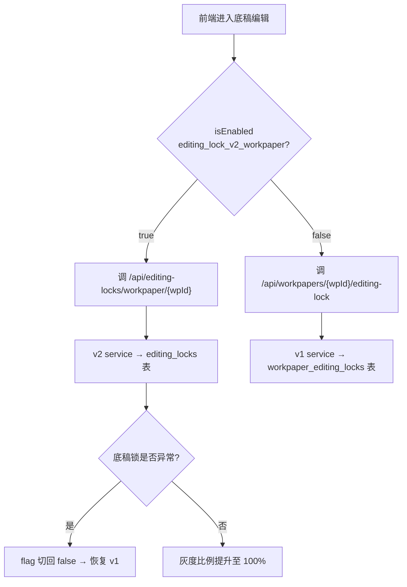
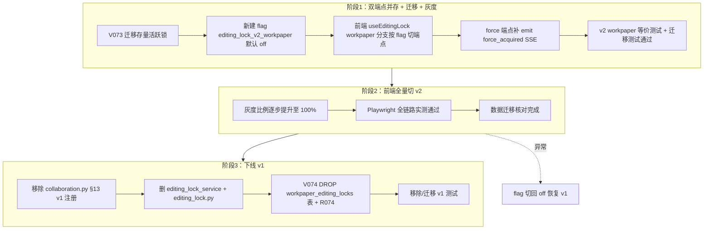

# Design Document — editing-lock-v1-v2-consolidation

## Overview

本特性把两套并存的编辑软锁实现收口为一套：将 v1 底稿专用锁（表 `workpaper_editing_locks`，按 `wp_id`）的全部行为并入 v2 通用锁（表 `editing_locks`，按 `(resource_type, resource_id)`），以 `resource_type='workpaper'` + `resource_id = wp_id::text` 承载底稿锁。收口分三阶段推进：**阶段 1** 双端点并存 + 数据迁移 + 灰度开关；**阶段 2** 前端全量切 v2；**阶段 3** 删除 v1 service/router/注册并 DROP v1 表。整个过程满足零停机与可回退。

设计遵循仓库铁律：三层一致校验（迁移 SQL + ORM `Mapped[]` + service）、service 只 flush 不 commit / router 统一 commit、router_registry 必注册、PG-only SQL 加 SQLite dialect 检测、event_bus 两路径勿混（轻量 SSE 通知用 `broadcast_raw`）、前端 apiProxy 单层解构。

### 现状确认（已用 codegraph + 代码核实）

下表为已读源码核实的真实现状，非推测：

| 维度 | v1（现役） | v2（现役） |
|------|-----------|-----------|
| service | `backend/app/services/editing_lock_service.py` | `backend/app/services/editing_lock_service_v2.py` |
| router | `backend/app/routers/editing_lock.py` 前缀 `/api/workpapers` | `backend/app/routers/editing_locks.py` 前缀 `/api/editing-locks` |
| 表 / ORM | `workpaper_editing_locks` / `WorkpaperEditingLock` | `editing_locks` / `EditingLock` |
| 锁维度 | `wp_id`（UUID，FK→`working_paper.id`） | `(resource_type, resource_id)`（resource_id 为 String(255)，无 FK） |
| 持有者字段 | `staff_id`（FK→`users.id`） | `holder_id`（FK→`users.id`）+ `holder_name`（可空） |
| 活跃锁唯一约束 | 无（`wp_id` 仅普通索引，允许多活跃锁共存） | 部分唯一索引 `uq_editing_locks_active ON (resource_type, resource_id) WHERE released_at IS NULL`（活跃锁 ≤ 1） |
| 时间字段类型 | `DateTime(timezone=True)`，但 service 写入用 **naive UTC**（`_now_naive()`） | `DateTime(timezone=True)`，service 写入用 **aware UTC**（`_now()`） |
| 并发保护 | 无显式行锁 | `SELECT ... FOR UPDATE` + SAVEPOINT 捕获 IntegrityError |
| 注册位置 | `router_registry/collaboration.py` §13 | `router_registry/collaboration.py` §12c |
| 前端入口 | `useEditingLock.ts` 中 `resourceType==='workpaper'` 分支 → `/api/workpapers/{wpId}/editing-lock` | `useEditingLock.ts` 中其它 `resourceType` 分支 → `/api/editing-locks/{type}/{id}` |

核实出的两个关键事实，直接影响设计：

1. **后端目前无 emit `editing_lock.force_acquired` SSE 事件**。两套 service 的 `force_acquire_lock` 均只操作 DB（释放旧锁 + 创建新锁）返回 `previous_holder`，没有任何 `event_bus.publish` 或 `broadcast_raw` 调用。但前端 `useEditingLock.ts` 的 `onSSEEvent` 已实现双匹配监听（workpaper 按 `wp_id`，通用锁按 `resource_type+resource_id`）。即前端已就绪，后端从未推送 → 当前强抢通知实际不工作。收口时需补 emit（详见 SSE 兼容设计）。

2. **当前最高迁移版本为 V072**（`V072__word_export_task_doc_type_widen.sql`）。新迁移用 **V073**（配对 R073），表下线用 **V074**（配对 R074）。

### 灰度开关基础设施现状

- 后端有 DB-backed feature flag：`FeatureFlagService.is_enabled(db, flag_key, user_id=...)`（表 `FeatureFlag`，5s TTL 缓存 + 稳定哈希灰度），路由 `/api/feature-flags-v2`。旧内存开关 `/api/feature-flags` 已 deprecated。
- 前端 `useFeatureFlags()` 的 `isEnabled(key)` 实测形态：`async`，调 `GET /api/feature-flags-v2/{key}` 取 `data.enabled`（**仅全局布尔**），catch 时 `return false`。**关键事实：前端这条 isEnabled 路径只读全局 `enabled`，不消费 `rollout_percentage`/`whitelist_user_ids`** —— 即前端层面只有"全开/全关"，没有按用户百分比灰度的能力。
- 因此本特性的 Rollout_Flag 在**前端**是全局开关（非百分比）。如需真正的按用户百分比/白名单灰度，须改走后端 `FeatureFlagService.is_enabled(db, key, user_id=)`（需把判定下沉到后端、前端传 user 上下文），本特性范围内**采用前端全局开关**：默认 false（全量 v1），验证就绪后整体翻 true（全量 v2）。design 与需求中"灰度比例提升"措辞均按此口径理解（运维粒度=全局布尔，不是前端百分比滚动）。

### isEnabled 调用成本与失败语义

- `isEnabled` 每次调用打一次 HTTP（后端有 5s TTL 缓存兜底）。本特性 composable 在锁生命周期内只解析一次并冻结快照（见组件 5），避免每次 acquire/heartbeat 都打。
- **catch→false 的回退在阶段 3 后是陷阱**：`isEnabled` 失败保守返回 false → 走 v1 端点。但阶段 3 删除 v1 后，v1 端点已不存在，此时 flag 端点抖动会让前端回退到**已删除的 v1 → 404**。因此下线 v1 的前置动作必须包含"前端移除 v1 回退分支、默认值改为 v2"（见组件 5 与阶段 3 门控），消除"回退到不存在端点"的生命周期冲突。

## Architecture

### 目标架构数据流（迁移后，灰度开 v2 时）

```mermaid
flowchart LR
    subgraph FE[前端]
        WP[WorkpaperEditor.vue]
        UEL["useEditingLock.ts<br/>resourceType='workpaper'"]
        FF["useFeatureFlags()<br/>isEnabled('editing_lock_v2_workpaper')"]
    end
    subgraph BE[后端]
        R2["editing_locks.py router<br/>/api/editing-locks/workpaper/{id}"]
        R1["editing_lock.py router<br/>/api/workpapers/{id}/editing-lock<br/>（阶段1保留）"]
        S2[editing_lock_service_v2]
        S1["editing_lock_service<br/>（阶段1保留）"]
        EB["event_bus.broadcast_raw<br/>editing_lock.force_acquired"]
    end
    subgraph DB[(数据库)]
        T2["editing_locks 表<br/>resource_type='workpaper'<br/>resource_id=wp_id::text"]
        T1["workpaper_editing_locks 表<br/>（阶段1保留, V074删）"]
    end

    WP --> UEL
    UEL -->|flag ON| R2
    UEL -.->|flag OFF 回退| R1
    FF --> UEL
    R2 --> S2 --> T2
    R1 --> S1 --> T1
    R2 -->|force| EB
    EB -->|SSE| UEL
```

### 灰度切换决策流



### 端点等价映射

v2 通用端点覆盖 v1 的全部行为，前端把 `resource_type='workpaper'` 传入既有 v2 路由即可。**但有一处行为差异必须在 service 层补齐**（见组件 3）：v1 `acquire_lock` 对"同一持有人重复 acquire"会续期返回成功，而 v2 现有 `acquire_lock` 查到任何活跃锁即返回 `locked=True`（不判是否本人）→ 直接转 409。前端 `useEditingLock` 在 `watch(resourceId)` 变化、组件重挂载时会重复 acquire，若不补齐，同人重进自己持锁的底稿会被 409 挡住、`isMine` 被错置为 false。因此本特性必须给 v2 `acquire_lock` 增加同 `holder_id` 续期分支。

| 行为 | v1 端点 | v2 等价端点（resource_type=workpaper） |
|------|---------|---------------------------------------|
| acquire | `POST /api/workpapers/{wpId}/editing-lock` | `POST /api/editing-locks/workpaper/{wpId}` |
| heartbeat | `PATCH /api/workpapers/{wpId}/editing-lock/heartbeat` | `PATCH /api/editing-locks/workpaper/{wpId}/heartbeat` |
| release | `DELETE /api/workpapers/{wpId}/editing-lock` | `DELETE /api/editing-locks/workpaper/{wpId}` |
| force | `POST /api/workpapers/{wpId}/editing-lock/force` | `POST /api/editing-locks/workpaper/{wpId}/force` |
| 活跃锁列表 | `GET /api/workpapers/editing-locks/active`（**死端点，无前端消费者**） | `GET /api/editing-locks/active?resource_type=workpaper`（不需复刻 wp_code/wp_name/staff_name 富字段） |

## Components and Interfaces

### 1. 数据迁移脚本 V073 / R073

`backend/migrations/V073__migrate_workpaper_locks_to_editing_locks.sql`

职责：把 `workpaper_editing_locks` 活跃锁（`released_at IS NULL`）迁入 `editing_locks`，字段映射 + 去重 + 幂等。R073 为回退脚本，删除迁入的 workpaper 锁。

接口契约（SQL 行为）：
- 只迁 `released_at IS NULL` 的活跃锁。
- 映射：`resource_type='workpaper'`、`resource_id = wp_id::text`、`holder_id = staff_id`、`holder_name` 从 `users` 回填（LEFT JOIN，无则 NULL）。
- 保留 `acquired_at`、`heartbeat_at`。**时区规整**：v1 service 用 `_now_naive()` 写入 naive UTC 值，存进 `TIMESTAMP WITH TIME ZONE` 列时会被 PG 按 **session timezone** 解释（可能非 UTC）。⚠️ **不可武断写 `AT TIME ZONE 'UTC'`**——对已是 timestamptz 的列再 `AT TIME ZONE` 会转成 without-tz、方向可能反。正确做法：**迁移前先实测**——查 PG `SHOW timezone` + 抽样 v1 存量锁的真实 timestamptz 值（`SELECT heartbeat_at, heartbeat_at AT TIME ZONE 'UTC' FROM workpaper_editing_locks LIMIT 5`），确认 naive 值入库时的偏移方向，再定规整表达式。目标：迁后锁在 v2 `heartbeat_at > now-5min` 判定下与源语义一致，不因 CST 8h 偏移被立即判过期或永不过期。若实测确认 v1 写入与 PG session 均为 UTC（无偏移），则直接平移即可、无需转换。
- 同 `wp_id` 多活跃锁去重：`DISTINCT ON (wp_id) ... ORDER BY wp_id, heartbeat_at DESC`，取最新一条。
- 幂等：`WHERE NOT EXISTS`（目标表已有同资源活跃锁则跳过），配合 `uq_editing_locks_active` 部分唯一索引兜底。
- PG-only 执行模型（已实证）：`migrations/V*.sql` **仅在真实 PG 启动时由 MigrationRunner 加载执行**；后端测试 fixture 用 `sqlite+aiosqlite:///:memory:` + `Base.metadata.create_all` 建表，**从不加载 V*.sql**（既有 V005/V047 等也大量用 `::text`/`AT TIME ZONE`/RLS，同理不在 SQLite 跑）。因此 V073 含 `DISTINCT ON`/`::text` **无需**任何"dialect 跳过分支"（MigrationRunner 也没有这种分支）——它本就不会在 SQLite 测试中被执行。**推论**：V073 迁移的正确性测试（Property 1/2/3/14）必须标 `pg_only`（真实 PG 才跑，conftest 对非 PG 自动 skip），不能用 SQLite in-memory 跑迁移。

### 2. EditingLock ORM（无需改动）

`backend/app/models/editing_lock_models.py` 现有 `Mapped[]` 列已完全覆盖迁移目标列（resource_type/resource_id/holder_id/holder_name/acquired_at/heartbeat_at/released_at + TimestampMixin 的 created_at/updated_at）。迁移不引入新列 → ORM 不变，满足三层一致。

### 3. editing_lock_service_v2（需补"同人续期"分支）

现有 `acquire_lock / heartbeat_lock / release_lock / force_acquire_lock / get_active_locks` 是通用实现，传 `resource_type='workpaper'` 即可承载底稿锁，全部遵循 service 只 flush 不 commit。

**必须改动（行为对齐 v1）**：`acquire_lock` 当前查到活跃锁就无条件返回 `locked=True`。需在"有活跃锁"分支前插入同人判断——若 `active_lock.holder_id == holder_id`，刷新 `heartbeat_at` 并返回 `{"locked": False, "lock_id": ..., "acquired_at": ...}`（续期成功），仅当持有人为他人时才返回 `locked=True`。force_acquire 的 SSE emit 放 router 层（见组件 4 / SSE 设计）。

### 4. editing_locks.py router（force 端点补条件化 SSE emit）

force-acquire 端点在 `db.commit()` 后补 emit `editing_lock.force_acquired`（broadcast_raw 轻量路径）。**payload 中 `wp_id` 字段须条件化**：仅当 `resource_type == 'workpaper'` 时填 `wp_id = resource_id`，其它 resource_type（附注/报告等）省略 `wp_id` 或置 null，避免把非底稿的 resource_id 误塞进 `wp_id`。`resource_type` + `resource_id` 始终填，供前端通用锁路径按 `(resource_type, resource_id)` 匹配。

### 5. 前端 useEditingLock.ts（workpaper 分支灰度化）

改造点：把"`isWorkpaper` 固定走 v1 端点"改为"`isWorkpaper && !v2Enabled` 走 v1，否则走 v2"。新增 `v2Enabled` 标志，从 `useFeatureFlags().isEnabled('editing_lock_v2_workpaper')` 取，带本地兜底默认 false。URL 构造分支据此切换。调用方组件参数不变（仍传 `resourceType:'workpaper'`），满足需求 4.3。

**flag 竞态防护（需求 4.3a）**：`isEnabled` 是 async（每次打一次 HTTP），`onMounted` 的 `acquire()` 必须 **await** `v2Enabled` 解析完成后再发请求（否则可能在 flag resolve 前用错端点）。且单个锁的完整生命周期（acquire → heartbeat → release）必须**锁定同一个 `v2Enabled` 快照**：首次 acquire 时把解析结果冻结到局部 ref，heartbeat/release 复用该冻结值，不中途重读 flag——否则灰度翻转会导致"acquire 走 v2、release 走 v1"跨表锁泄漏。

**阶段 3 下线 v1 后的回退分支移除（避免 404）**：`isEnabled` catch 时返回 false（保守回退 v1）。阶段 1/2 期间 v1 端点尚在，回退安全；但阶段 3 删除 v1 端点后，flag 端点抖动→false→请求已删除的 v1→404。因此阶段 3 的前端改动必须：移除 useEditingLock 的 v1 分支、`v2Enabled` 默认值改为 true（或直接删除分流逻辑只留 v2），使 v1 下线后不再有任何代码路径指向 v1 端点。此项列入阶段 3 任务。

### 6. Rollout_Flag（复用 DB feature flag，前端为全局开关）

flag key `editing_lock_v2_workpaper`，flag 表 V068 已建，无需新建。**前端 `isEnabled` 只读全局 `enabled` 布尔，不消费 `rollout_percentage`/`whitelist_user_ids`**——本特性前端灰度粒度=全局开关（默认 false 全量 v1 → 验证就绪后翻 true 全量 v2），回退=enabled 置 false（仅阶段 1/2 有效，阶段 3 v1 下线后回退分支已移除）。若未来需要按用户百分比灰度，须把判定下沉到后端 `FeatureFlagService.is_enabled(db, key, user_id=)`，不在本特性范围。

## Data Models

### editing_locks 表（目标，已存在，迁移后承载 workpaper 锁）

```
id            UUID PK
resource_type VARCHAR(50)  NOT NULL   -- 迁入值 'workpaper'
resource_id   VARCHAR(255) NOT NULL   -- 迁入值 wp_id::text
holder_id     UUID NOT NULL FK→users.id   -- 迁自 staff_id
holder_name   VARCHAR(255) NULL           -- 从 users 回填
acquired_at   TIMESTAMPTZ NOT NULL        -- 保留源值
heartbeat_at  TIMESTAMPTZ NOT NULL        -- 保留源值
released_at   TIMESTAMPTZ NULL
created_at    TIMESTAMPTZ NOT NULL DEFAULT now()   -- TimestampMixin
updated_at    TIMESTAMPTZ NOT NULL DEFAULT now()   -- TimestampMixin
-- 部分唯一索引 uq_editing_locks_active (resource_type, resource_id) WHERE released_at IS NULL
```

### 字段映射表（V073 迁移核心）

| 源 `workpaper_editing_locks` | 目标 `editing_locks` | 转换规则 |
|------------------------------|----------------------|----------|
| `wp_id` (UUID) | `resource_id` (String) | `wp_id::text` |
| —（固定值） | `resource_type` | 常量 `'workpaper'` |
| `staff_id` | `holder_id` | 直接映射 |
| —（v1 无此字段） | `holder_name` | `LEFT JOIN users ON staff_id=users.id` 取 username/full_name，无则 NULL |
| `acquired_at` | `acquired_at` | 保留 |
| `heartbeat_at` | `heartbeat_at` | 保留 |
| `released_at` (=NULL) | `released_at` | 只迁 NULL 行 |

### SSE Force_Acquired_Event payload（兼容前端双匹配，wp_id 条件化）

```json
// resource_type='workpaper' 时（wp_id == resource_id）
{
  "event_type": "editing_lock.force_acquired",
  "wp_id": "<wp_id::text>",
  "resource_type": "workpaper",
  "resource_id": "<wp_id::text>",
  "new_holder_id": "<新持有者 UUID>",
  "new_holder_name": "<新持有者显示名>",
  "previous_holder_id": "<前持有者 UUID 或 null>"
}
// resource_type != 'workpaper' 时（省略/置空 wp_id，不塞 resource_id）
{
  "event_type": "editing_lock.force_acquired",
  "wp_id": null,
  "resource_type": "disclosure_note",
  "resource_id": "<note_id>",
  "new_holder_id": "...", "new_holder_name": "...", "previous_holder_id": "..."
}
```

前端 `onSSEEvent` 对 workpaper 按 `wp_id` 匹配、对通用锁按 `(resource_type, resource_id)` 匹配。workpaper 路径 `wp_id == resource_id` 确保两种匹配都识别；非 workpaper 资源不污染 `wp_id` 字段。

## Correctness Properties

*A property is a characteristic or behavior that should hold true across all valid executions of a system—essentially, a formal statement about what the system should do. Properties serve as the bridge between human-readable specifications and machine-verifiable correctness guarantees.*

下列属性由验收准则经 prework 分析后转化而来。结构性约束（三层一致、service 只 flush 不 commit、下线操作步骤、测试覆盖要求）不可作为通用属性，已在 prework 标记为 no，分别由 schema drift 检测、代码审查、发布纪律与 Testing Strategy 承接。

### Property 1: 迁移字段映射正确性

*For any* `workpaper_editing_locks` 中的活跃锁集合（每条 `released_at IS NULL`），执行 V073 迁移后，`editing_locks` 中对应记录应满足 `resource_type='workpaper'`、`resource_id = wp_id::text`、`holder_id = staff_id`，且 `acquired_at`、`heartbeat_at` 与源记录相等，`holder_name` 在 `users` 中可解析时等于该用户名、否则为 NULL。

**Validates: Requirements 1.1, 1.2, 1.3**

### Property 2: 迁移后同资源活跃锁唯一（去重 + 幂等）

*For any* `workpaper_editing_locks` 活跃锁集合（含同一 `wp_id` 的多条活跃锁），无论 V073 迁移执行一次还是多次，`editing_locks` 中每个 `(resource_type='workpaper', resource_id)` 的活跃锁数量恒为 1，且保留的那条对应源表中 `heartbeat_at` 最新者。

**Validates: Requirements 1.4, 1.5**

### Property 3: 迁移非破坏性

*For any* `workpaper_editing_locks` 表数据，执行 V073 迁移前后，源表 `workpaper_editing_locks` 的全部行内容保持不变（迁移只读源表，不 UPDATE / DELETE 源行）。

**Validates: Requirements 6.4**

### Property 4: 底稿锁 acquire 创建

*For any* `resource_type='workpaper'` 的底稿且当前无 Active_Lock，调用 acquire 后应存在恰一条该资源的活跃锁且返回获取成功（`locked=False`）。

**Validates: Requirements 3.1**

### Property 5: 底稿锁 acquire 冲突

*For any* 已被他人持有 Active_Lock 的底稿，调用 acquire 应返回锁冲突（`locked=True`，router 层转 HTTP 409）并携带当前持有者标识。

**Validates: Requirements 3.2**

### Property 6: 底稿锁 heartbeat 续期

*For any* 由某持有者持有的 Workpaper_Lock，该持有者调用 heartbeat 后 `heartbeat_at` 应被刷新为更新的时间且返回续期成功（`refreshed=True`）。

**Validates: Requirements 3.3**

### Property 7: 底稿锁 heartbeat 无锁失败

*For any* 无 Active_Lock 的底稿，调用 heartbeat 应返回续期失败（`refreshed=False`，router 层转 HTTP 404）。

**Validates: Requirements 3.4**

### Property 8: 底稿锁 release 释放

*For any* 由某持有者持有的 Workpaper_Lock，该持有者调用 release 后该锁的 `released_at` 应被设置，且该资源不再有 Active_Lock。

**Validates: Requirements 3.5**

### Property 9: 底稿锁 force 抢占

*For any* 已被他人持有 Active_Lock 的底稿，调用 force 后原活跃锁应被释放、调用者成为唯一活跃锁持有者，且返回的 `previous_holder_id` 等于原持有者。

**Validates: Requirements 3.6**

### Property 10: force-acquire SSE 事件完整性

*For any* `resource_type='workpaper'` 的 force-acquire 操作，系统应广播恰一个 `event_type='editing_lock.force_acquired'` 事件，且其 payload 同时包含 `wp_id`、`resource_type='workpaper'`、`resource_id`，满足 `wp_id == resource_id == 源 wp_id::text`。

**Validates: Requirements 5.1, 5.2**

### Property 11: 前端按 Rollout_Flag 路由底稿锁端点

*For any* `resourceType='workpaper'` 的锁操作，当 Rollout_Flag 启用 v2 时前端构造的 URL 应指向 `/api/editing-locks/workpaper/{wpId}` 系列端点，当未启用时应指向 `/api/workpapers/{wpId}/editing-lock` 系列端点。

**Validates: Requirements 4.1, 4.2**

### Property 12: 前端强抢状态更新

*For any* 本地处于持锁状态（`isMine=true`）的底稿，当收到匹配本底稿的 `editing_lock.force_acquired` 事件时，前端应将 `isMine` 置为 false 并将 `lockedBy` 更新为新持有者；对不匹配的事件或本地非持锁状态则不改变。

**Validates: Requirements 5.3**

### Property 13: 底稿锁同人重复 acquire 续期（不冲突）

*For any* 由某持有者持有 Active_Lock 的底稿，**同一持有者**再次调用 acquire 应返回获取成功（`locked=False`）并刷新 `heartbeat_at`，且该资源活跃锁数量保持为 1（不新增、不返回 409）。

**Validates: Requirements 3.2a**

### Property 14: 迁移时区规整后过期判定一致

*For any* `workpaper_editing_locks` 中 `heartbeat_at` 在"未过期窗口内"（now-5min 之后）的活跃锁（源为 naive UTC），迁移到 `editing_locks` 后，在 v2 的 `heartbeat_at >= now-5min` 判定下应仍被视为活跃（未因 naive→aware 时区偏移被误判过期）；源 `heartbeat_at` 早于窗口的锁迁后应仍判过期。

**Validates: Requirements 1.2**

## Error Handling

- **锁冲突（409）**：v2 router acquire 端点在 service 返回 `locked=True` 时抛 `HTTPException(409, detail={error_code:'LOCK_HELD', locked_by, locked_by_name, acquired_at})`，与 v1 的 409 结构一致，前端 `onSSEEvent`/acquire catch 已能解析。
- **无活跃锁（404）**：heartbeat / release 在 service 返回失败时 router 抛 404，与 v1 等价。前端 catch 静默处理（心跳失败不打断编辑）。
- **并发插入冲突**：v2 acquire 用 `SELECT ... FOR UPDATE` + SAVEPOINT（`begin_nested`）捕获 `IntegrityError`（撞 `uq_editing_locks_active`），转为锁冲突响应，不污染外层事务（避免 asyncpg 事务 aborted 后 SAVEPOINT 被拒）。
- **迁移并发安全**：V073 迁移期间若有新锁写入，幂等的 `WHERE NOT EXISTS` + 部分唯一索引保证不产生重复活跃锁；冲突行被 `ON CONFLICT DO NOTHING`（或 NOT EXISTS 守护）跳过。
- **SSE 广播失败**：`broadcast_raw` 内部对 SSE 队列满、无 running loop（测试环境）均已 try/except 容错，不阻断 force-acquire 的 DB 操作（事件推送是 best-effort 通知，锁状态以 DB 为准）。
- **DB 不可达（feature flag）**：`FeatureFlagService` DB 读失败返回 stale 缓存或保守关闭（false），即灰度开关故障时安全回退到 v1 端点。
- **孤儿锁（开放问题 ②，见下）**：底稿被删后遗留的 workpaper 锁由 heartbeat 5 分钟过期惰性清理覆盖。

## 开放问题的设计决策

### 决策 ①：历史锁（released_at IS NOT NULL）不迁移

**决策**：V073 只迁活跃锁（`released_at IS NULL`），历史锁保留在 `workpaper_editing_locks` 表中直至阶段 3 的 V074 删表，删表前不单独归档。

**理由**：
1. 编辑软锁是瞬态协作信号，不是审计追溯对象——真正的审计轨迹在 `app_audit_log` 与版本链，历史锁无审计价值。
2. v2 部分唯一索引 `uq_editing_locks_active` 只约束活跃锁，迁入历史锁不违反约束，但会污染 `editing_locks` 表并增加去重复杂度，收益为零。
3. 监控统计（活跃锁列表 `/active`）只看 Active_Lock，历史锁不进任何现役查询。
4. V074 删表是阶段 3 动作，届时历史锁随表一并丢弃；若后续确有归档需求，可在 V074 前追加一次性归档脚本，不影响本次收口主线。

### 决策 ②：孤儿锁依赖惰性过期清理 + acquire 时不强制校验底稿存在性

**决策**：v2 `resource_id` 无 FK，收口后底稿锁失去 FK 级联保护。对底稿删除后遗留的孤儿 workpaper 锁，**依赖现有 heartbeat 5 分钟过期惰性清理**，不新增定时清理任务，acquire 时**不**额外校验底稿存在性。

**理由**：
1. 孤儿锁的唯一危害是"占用一个已不存在底稿的活跃锁名额"，而该底稿已删除、不会再有人 acquire 它，孤儿锁不会阻塞任何真实编辑。
2. heartbeat 惰性清理已保证：原持有者页面关闭/路由离开触发 release，或 5 分钟无心跳后 `_expire_stale_locks` 在下次同资源 acquire 时将其标记 released。孤儿锁最长存活 5 分钟即被动失效，无实际影响。
3. acquire 时校验底稿存在性需对每次 acquire 增加一次 `working_paper` 存在性查询，为极低频的孤儿场景付出高频性能成本，不划算。
4. v2 设计本就是"通用资源锁"，resource_id 对任意资源类型不持 FK 是有意的解耦设计（附注、报告同样无 FK），底稿锁并入后保持一致，不为单一资源类型破例。
5. 若未来孤儿锁统计确需清零，可在惰性清理之外补一个低频（如每日）批量清理 job，但当前不纳入收口范围。

## Testing Strategy

### 双测试策略

采用单元测试 + 属性测试互补：单元测试覆盖具体示例、边界与错误条件；属性测试覆盖跨输入的通用属性。两者均必要。

### 属性测试配置

- 使用 Python `hypothesis` 库（项目既有），**不**自行实现 PBT 框架。
- 按用户铁律，`max_examples=5`（非默认 100；本仓库统一要求）。
- 每个属性测试用注释标注对应设计属性：`# Feature: editing-lock-v1-v2-consolidation, Property {number}: {property_text}`。
- 每条 Correctness Property 由**单个**属性测试实现。

### 属性测试映射

| Property | 测试焦点 | 生成器 |
|----------|---------|--------|
| 1 迁移字段映射 | 随机源活跃锁集合 → 迁移 → 断言字段映射/时间保留/holder_name 回填 | 随机 wp_id/staff_id/时间，部分 staff_id 有/无对应 user |
| 2 活跃锁唯一(去重+幂等) | 同 wp_id 多活跃锁 + 迁移执行 1/2 次 → 断言活跃锁=1 且取 heartbeat_at 最新 | 随机同 wp_id 多锁 + 随机执行次数 |
| 3 迁移非破坏性 | 迁移前后 workpaper_editing_locks 行快照相等 | 随机源表数据 |
| 4 acquire 创建 | 无锁底稿 acquire → 活跃锁=1 + 成功 | 随机 wp_id/holder |
| 5 acquire 冲突 | 他人持锁 acquire → locked=True | 随机两个不同 holder |
| 6 heartbeat 续期 | 持锁 heartbeat → heartbeat_at 增大 | 随机持有者 |
| 7 heartbeat 无锁 | 无锁 heartbeat → refreshed=False | 随机 wp_id |
| 8 release 释放 | 持锁 release → released_at 设置 + 无活跃锁 | 随机持有者 |
| 9 force 抢占 | 他人持锁 force → 新持有者唯一 + previous_holder 正确 | 随机两 holder |
| 10 force SSE 事件 | force → broadcast_raw 被调一次 + payload 三字段完整 | 随机 wp_id/holder，mock broadcast_raw 验真调用 |
| 11 前端 flag 路由 | flag on/off × 四操作 → 断言 URL 前缀 | 随机 flag 布尔 + wpId（vitest fast-check 或参数化）|
| 12 前端强抢状态 | 随机持锁状态 + 匹配/不匹配事件 → 断言 isMine/lockedBy | vitest，随机 payload |
| 13 同人 acquire 续期 | 持锁后同人再 acquire → locked=False + 活跃锁=1 + heartbeat 刷新 | 随机 holder，同人重复 |
| 14 迁移时区规整 | naive 源锁(窗口内/外) → 迁移 → 断言活跃判定一致 | 随机 heartbeat_at 跨过期窗口 |

后端属性测试分两类执行环境（已实证 conftest 用 `sqlite+aiosqlite:///:memory:` + `pg_only` mark 机制）：
- **迁移类（Property 1/2/3/14）必须标 `pg_only`**：V073 是 PG-only SQL（`DISTINCT ON`/`::text`），只能在真实 PG 跑；conftest 对非 PG `DATABASE_URL` 自动 skip。这类测试在 PG 环境下用 MigrationRunner 实际执行 V073 后断言。
- **v2 锁行为类（Property 4-9/13）走 SQLite in-memory 即可**：这些走 `editing_lock_service_v2` 的 ORM 路径（SQLAlchemy，无裸 PG SQL），SQLite 兼容（注意 `SELECT FOR UPDATE` 在 SQLite 被忽略、`begin_nested` SAVEPOINT 行为有差异，并发冲突分支的真实验证仍需 pg_only 补充）。
- 前端属性测试（11/12）用 vitest，mock `useFeatureFlags`（真实存在方法，注意 `isEnabled` 是 async）与 `api`，断言 URL 选择与状态更新；mock 必须 mock 真实存在的方法并用 `assert` 验真调用，禁止 `try/except: pass` 吞调用。

### 单元测试

- v2 workpaper 锁等价测试：acquire/heartbeat/release/force/并发，替换将下线的 v1 `test_editing_lock.py` / `test_editing_lock_concurrent.py`（需求 8.1）。
- 迁移正确性 example：构造已知源数据断言迁移结果（需求 8.2，与 Property 1/2 互补）。
- 幂等 example：重复执行迁移断言活跃锁=1（需求 8.3，与 Property 2 互补）。
- force_acquired SSE example：验证 payload 字段值精确匹配。
- 边界：同一用户重复 acquire（v1 自动续期语义在 v2 下的等价行为）、空 holder_name、无对应 user 的 staff_id。

### 集成 / E2E

- Playwright 全链路实测（需求 4.4 / 6.1 / 6.2）：灰度开 v2 后进入底稿编辑，验证 acquire → heartbeat → release → force-acquire 全链路成功，两个用户并发验证强抢通知到达。E2E 验收为阶段 2 前置条件。
- 双端点并存可用性 example（需求 6.1/6.2）：阶段 1 期间断言 v1 与 v2 两路由均非 404。

### 三层一致与契约守护

- 迁移引用的表/列由现有 `test_raw_sql_schema_contract.py`（表级）+ `test_raw_sql_column_contract.py`（列级 pg_only sqlglot）守护。
- ORM↔DB 漂移由 lifespan `_run_schema_drift_check` 守护。
- 本迁移不引入新列，三层一致天然满足（editing_locks ORM 已覆盖全部目标列）。

## 阶段实施流程（零停机 + 可回退）



**阶段门控（需求 7.4）**：阶段 3 仅在前端全量切 v2、存量数据迁移核对、Playwright 全链路通过、测试覆盖迁移完成四项全部满足后执行；任一未满足保留 v1 不删。
