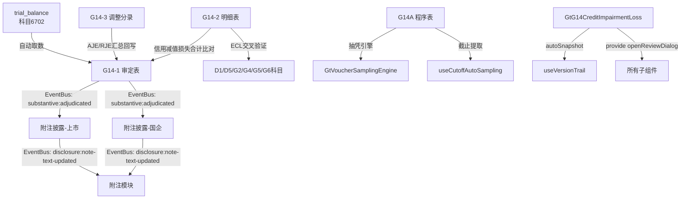

# Design Document: G14 信用减值损失底稿专属HTML精美组件

## Overview

G14信用减值损失专属组件`g14-credit-impairment-loss`。覆盖1个xlsx源模板/6有效sheet。科目6702信用减值损失（**损益类/借方费用类**）。**G循环中信用风险管理核心科目**，汇总各金融资产ECL减值计提/转回的净损失，与D1/D5/G2/G4/G5/G6各科目减值数据交叉验证。

核心架构：
- componentType `g14-credit-impairment-loss`，主入口 GtG14CreditImpairmentLoss.vue
- **sheetName v-if dispatch模式**：6 sheets用v-if分发（不用el-tabs）
- 无子目录分组（仅6个sheet，文件扁平即可）
- 损益类/借方费用类公式：本期发生额 = 借方 - 贷方（损失为正）
- EventBus联动：publish `substantive:adjudicated`(accountCode='6702') + `disclosure:note-text-updated`
- 双模式（HTML ↔ OnlyOffice）+ 导入导出(useG14ImportExport, 2张表) + AI(2 section)
- 五大集成：版本链✅ 抽凭✅ 截止✅ 附注EventBus✅ 复核✅ （无OCR，无凭证检查表）
- 无虚拟滚动需求（最大36行）
- 交叉验证：G14-2明细与D1/D5/G2/G4/G5/G6各科目减值数据勾稽
- **坏账准备滚动验证**：期末=期初+计提-转回-核销，不平衡红色高亮

## Architecture

### sheetName分发模式

GtG14CreditImpairmentLoss.vue 接收 `sheetName` prop，用正则提取编码(G14A/G14-1/G14-2/G14-3/附注(上市)/附注(国企))，`v-if` 分发到对应子组件。

```
sheetName → regex提取编码 → v-if匹配 → defineAsyncComponent子组件渲染
                                     ↘ 未匹配 → OnlyOffice fallback

6 sheets（扁平结构，无子目录）:
├── G14A   审计程序表（复用a-program-console + 抽凭引擎 + 截止提取）
├── G14-1  审定表（36行×11列，按减值来源科目分层，损益类/借方费用）
├── G14-2  明细表（36行×13列，坏账准备滚动+交叉验证）
├── G14-3  调整分录汇总（24行×10列，AJE/RJE + 借贷平衡）
├── 附注披露信息（上市公司）（18行×5列）
└── 附注披露信息（国企）（15行×7列）
```

### 高层数据流



### 文件结构

```
audit-platform/frontend/src/components/workpaper/
├── GtG14CreditImpairmentLoss.vue                     # 主入口 sheetName v-if分发（defineAsyncComponent lazy×6）
├── g14-credit-impairment-loss/
│   ├── G14TabProcedure.vue                           # G14A 程序表（复用a-program-console+selfLoad+抽凭+截止）
│   ├── G14TabAdjudication.vue                        # G14-1 审定表（36行×11列，损益类借方+分组）
│   ├── G14TabDetail.vue                              # G14-2 明细表（36行×13列+坏账滚动+交叉验证+动态行）
│   ├── G14TabAdjustment.vue                          # G14-3 调整分录（AJE/RJE+借贷平衡+动态行）
│   ├── G14TabDisclosureListed.vue                    # 附注披露(上市)(18行×5列)
│   └── G14TabDisclosureSOE.vue                       # 附注披露(国企)(15行×7列)
├── composables/
│   ├── useG14FormulaEngine.ts                        # G14公式引擎(6个纯函数+parseNum)
│   ├── useG14FormData.ts                             # 数据加载/保存/selfLoad/writebackTB
│   ├── useG14ImportExport.ts                         # 导入导出composable(2张表: G14-2/G14-3)
│   └── useG14DualMode.ts                             # 双模式OO切换+localStorage

backend/app/routers/wp_render_strategies/
├── _g14_credit_impairment_loss.py                    # render策略+注册RENDERER_DISPATCH
├── _g14_credit_impairment_loss_service.py            # 业务逻辑(公式验证/TB取数/EventBus)
├── _g14_credit_impairment_loss_import_export.py      # 导入导出端点(2张表×3=6端点)
└── _g14_credit_impairment_loss_ai.py                 # AI生成2 section
```

### EventBus事件

| 事件名 | 发布者 | 消费者 | payload |
|--------|--------|--------|---------|
| `substantive:adjudicated` | G14-1审定表 | 附注披露(上市/国企) + trial_balance | `{accountCode:'6702', adjudicatedAmount}` |
| `disclosure:note-text-updated` | 附注披露 | 附注模块 | `{accountCode:'6702', text}` |

### 后端AI Section清单

```
adjudication-analysis / impairment-conclusion
```

## Components and Interfaces

### 前端组件接口

```typescript
// GtG14CreditImpairmentLoss.vue props
interface G14CreditImpairmentLossProps {
  htmlData: Record<string, any> | null
  sheetName: string
  wpId: string
  projectId: string
  readonly?: boolean
}

// sheetName正则匹配映射
const SHEET_CODE_MAP: Record<string, string> = {
  'G14A': 'procedure',
  'G14-1': 'adjudication',
  'G14-2': 'detail',
  'G14-3': 'adjustment',
  '附注披露信息（上市公司）': 'disclosureListed',
  '附注披露信息（国企）': 'disclosureSOE',
}
```

### G14-1 审定表数据模型（36行×11列，损益类/借方费用）

```typescript
interface G14AdjudicationData {
  groups: G14AdjudicationGroup[]       // 按减值来源科目分组
  trialBalanceAmount: number           // 试算表取数(科目6702)
  variance: number                     // 差异=审定-试算表
}

interface G14AdjudicationGroup {
  groupName: string
  // "应收账款信用减值损失" / "其他应收款信用减值损失" /
  // "应收票据信用减值损失" / "应收款项融资信用减值损失" /
  // "债权投资信用减值损失" / "其他债权投资信用减值损失" /
  // "长期应收款信用减值损失" / "应收利息信用减值损失" / "合计"
  rows: G14AdjudicationRow[]
  subtotal: G14AdjudicationTotals
}

interface G14AdjudicationRow {
  id: string
  item: string                         // 项目名称（减值来源科目）
  currentUnadjusted: number            // 本期未审数
  currentAdjustment: number            // 本期调整数（AJE+RJE）
  currentAudited: number               // 公式: 未审 + 调整
  priorUnadjusted: number              // 上期未审数
  priorAdjustment: number              // 上期调整数
  priorAudited: number                 // 公式: 未审 + 调整
  changeAmount: number                 // 公式: 本期审定 - 上期审定
  changeRate: number | null            // 公式: (本期-上期)/|上期|, 上期=0时null
  reasonAnalysis: string               // |变动率|>20%时必填(橙色高亮)
  indexRef: string                     // 索引(GtIndexChip)
}

interface G14AdjudicationTotals {
  currentAudited: number
  priorAudited: number
  changeAmount: number
  changeRate: number | null
}
```

### G14-2 明细表数据模型（36行×13列）

```typescript
interface G14DetailRow {
  id: string
  seq: number
  sourceAccount: string                // 来源科目名称
  sourceAccountCode: string            // 来源科目代码(D1/D5/G2/G4/G5/G6)
  assessedAsset: string                // 被评估资产
  provisionMethod: '组合' | '单项'     // 计提方式(下拉)
  openingProvision: number             // 期初坏账准备
  currentProvision: number             // 本期计提
  currentReversal: number              // 本期转回
  currentWriteoff: number              // 本期核销
  closingProvision: number             // 期末坏账准备
  netImpairmentLoss: number            // 公式: 本期计提 - 本期转回
  priorImpairmentLoss: number          // 上期信用减值损失
  sourceIndex: string                  // 源科目索引(GtIndexChip)
  crossVerification: 'consistent' | 'inconsistent' | 'pending'  // 交叉验证结论(下拉)
  rollForwardBalanced: boolean         // 公式: 期末 === 期初+计提-转回-核销（容差0.01）
}
```

### G14-3 调整分录数据模型（24行×10列）

```typescript
interface G14AdjustmentEntry {
  id: string
  seq: number
  entryType: 'AJE' | 'RJE'            // 分录类型
  date: string                         // 日期
  summary: string                      // 摘要
  accountCode: string                  // 科目编码
  accountName: string                  // 科目名称
  debitAmount: number                  // 借方金额
  creditAmount: number                 // 贷方金额
  preparedBy: string                   // 编制人
  remark: string                       // 备注
}
```

### 附注数据模型

```typescript
interface G14DisclosureSection {
  id: string
  title: string
  rows?: DisclosureRow[]
  textContent?: string                 // 文本区内容（AI辅助）
}
```

## Data Models

### 存储结构（working_paper.content JSON）

```typescript
interface G14Content {
  // G14-1 审定表
  adjudication: {
    groups: G14AdjudicationGroup[]
  }
  // G14-2 明细表
  detail: {
    rows: G14DetailRow[]
  }
  // G14-3 调整分录
  adjustment: {
    entries: G14AdjustmentEntry[]
  }
  // 附注
  disclosureListed: { sections: G14DisclosureSection[] }
  disclosureSOE: { sections: G14DisclosureSection[] }
}
```

### API接口

```python
# _g14_credit_impairment_loss.py
# RENDERER_DISPATCH注册
def render_g14_credit_impairment_loss(wp_id: str, config: dict) -> dict:
    """Render策略函数，返回componentType='g14-credit-impairment-loss'和sheets配置"""

# _g14_credit_impairment_loss_import_export.py
POST /api/workpapers/{wp_id}/g14/export-template?sheet={code}
POST /api/workpapers/{wp_id}/g14/export-data?sheet={code}
POST /api/workpapers/{wp_id}/g14/import-data?sheet={code}  # multipart/form-data
# sheet codes: G14-2 / G14-3

# _g14_credit_impairment_loss_ai.py
POST /api/workpapers/{wp_id}/g14/ai/{section}
# section: adjudication-analysis / impairment-conclusion

# _g14_credit_impairment_loss_service.py
class G14CreditImpairmentLossService:
    async def get_trial_balance_data(project_id, year) -> dict
    async def save_adjudication(wp_id, data) -> dict
    async def validate_formulas(data) -> list[ValidationError]
    async def validate_roll_forward(rows: list) -> list[RollForwardError]
```

### trial_balance 取数

```sql
-- G14-1审定表自动取数（损益类/借方费用类取发生额）
-- 借方费用类：本期发生额 = 借方 - 贷方
SELECT standard_account_code, unadjusted_amount, aje_adjustment, audited_amount
FROM trial_balance
WHERE project_id = :project_id
  AND year = :year
  AND standard_account_code LIKE '6702%'
```

### 注册四件套

```python
# 1. htmlRendererRegistry (前端)
'g14-credit-impairment-loss': () => import('./workpaper/GtG14CreditImpairmentLoss.vue')

# 2. wp_code_overrides.json (7条)
{
  "G14A-信用减值损失审计程序表": "g14-credit-impairment-loss",
  "G14-1-审定表": "g14-credit-impairment-loss",
  "G14-2-明细表": "g14-credit-impairment-loss",
  "G14-3-调整分录汇总": "g14-credit-impairment-loss",
  "G14-附注披露信息（上市公司）": "g14-credit-impairment-loss",
  "G14-附注披露信息（国企）": "g14-credit-impairment-loss",
  "G14-底稿目录": "g14-credit-impairment-loss"
}

# 3. VALID_COMPONENT_TYPES (后端)
'g14-credit-impairment-loss'

# 4. RENDERER_DISPATCH (后端)
'g14-credit-impairment-loss': render_g14_credit_impairment_loss
```

## Formula Engine Design (useG14FormulaEngine.ts)

### 6个纯函数 + parseNum

```typescript
/**
 * 安全数值转换：null/undefined/NaN/空字符串 → 0
 */
export function parseNum(v: unknown): number

/**
 * 审定数 = 未审数 + 调整数
 * 损益类借方费用，不区分AJE/RJE合并为一个adjustment
 */
export function calcAdjustedAmount(unadjusted: number, adjustment: number): number

/**
 * 净信用减值损失 = 本期计提 - 本期转回
 * 即ECL净计提额
 */
export function calcNetImpairmentLoss(provision: number, reversal: number): number

/**
 * 坏账准备滚动 = 期初 + 计提 - 转回 - 核销
 * 用于验证期末坏账准备是否平衡
 */
export function calcProvisionRollForward(
  opening: number, provision: number, reversal: number, writeoff: number
): number

/**
 * 变动率 = (本期 - 上期) / |上期|
 * 上期=0时返回null（避免除零）
 */
export function calcChangeRate(prior: number, current: number): number | null

/**
 * 借贷平衡校验：|SUM(debits) - SUM(credits)| < 0.01
 */
export function isDebitCreditBalanced(debits: number[], credits: number[]): boolean

/**
 * 差异计算：computed - actual
 * 用于坏账准备滚动验证差异 / 审定表与明细交叉差异
 */
export function calcVariance(computed: number, actual: number): number
```

### 损益类取数逻辑（借方费用类）

```typescript
// 损益类科目6702：本期发生额 = 借方 - 贷方（损失为正，借方增加费用）
// trial_balance存储v2正数口径，损益取发生额
// G14-1审定表：currentUnadjusted从tb取"本期未审发生额"
// 区别于G13（贷方收益类）：G14是借方费用类
```

## Integration Design（5大集成接入点）

### 1. 版本链 (useVersionTrail)

```typescript
// GtG14CreditImpairmentLoss.vue 主入口
const { autoSnapshot, showVersionTrail } = useVersionTrail(wpId)
async function handleSave() {
  await saveData()
  await autoSnapshot()
}
```

### 2. 抽凭引擎 (G14A程序表)

```typescript
// G14TabProcedure.vue
<GtVoucherSamplingEngine
  :project-id="projectId"
  :account-codes="['6702']"
  dialog-mode
  @samples-ready="fillSamples"
/>
```

### 3. 截止自动提取 (useCutoffAutoSampling)

```typescript
// G14TabProcedure.vue 截止测试步骤
const { fetchCutoffSamples } = useCutoffAutoSampling({
  projectId, accountCode: '6702', days: 5
})
```

### 4. 附注EventBus

```typescript
// G14TabAdjudication.vue (发布者)
watch(reportAmount, (val) => {
  eventBus.publish('substantive:adjudicated', {
    accountCode: '6702', adjudicatedAmount: val
  })
})

// G14TabDisclosureListed.vue / G14TabDisclosureSOE.vue (消费者)
eventBus.subscribe('substantive:adjudicated', (payload) => {
  if (payload.accountCode === '6702') refreshData()
})

// 附注文本变更发布
eventBus.publish('disclosure:note-text-updated', {
  accountCode: '6702', text: noteText
})
```

### 5. 复核对话 (provide/inject)

```typescript
// GtG14CreditImpairmentLoss.vue (主入口)
const { openReviewDialog } = useReviewDialog(wpId)
provide('openReviewDialog', openReviewDialog)

// 子组件 (section标题栏右侧按钮)
const openReviewDialog = inject('openReviewDialog')
```

## G14-2 ECL交叉验证设计

G14明细表核心特色：与D1/D5/G2/G4/G5/G6各科目减值数据勾稽 + 坏账准备滚动验证。

```typescript
// 交叉验证逻辑
interface ECLCrossVerificationResult {
  sourceAccount: string                // 来源科目名称
  sourceAccountCode: string            // D1/D5/G2/G4/G5/G6
  g14ImpairmentLoss: number            // G14记录的减值损失
  sourceAccountImpairment: number      // 源科目记录的减值计提
  variance: number                     // 差异
  isConsistent: boolean                // |差异| < 0.01
}

// 坏账准备滚动验证
interface RollForwardValidation {
  opening: number
  provision: number
  reversal: number
  writeoff: number
  closingActual: number
  closingComputed: number              // opening + provision - reversal - writeoff
  isBalanced: boolean                  // |closingComputed - closingActual| < 0.01
}

// 验证逻辑：
// 1. G14-2每行的netImpairmentLoss应与对应源科目的减值计提一致
// 2. 每行的closingProvision应 === calcProvisionRollForward(opening, provision, reversal, writeoff)
// 3. sourceIndex字段(GtIndexChip)可直接跳转至源科目底稿对应行
```

## Correctness Properties

*A property is a characteristic or behavior that should hold true across all valid executions of a system—essentially, a formal statement about what the system should do. Properties serve as the bridge between human-readable specifications and machine-verifiable correctness guarantees.*

### Property 1: 审定数公式

*For any* unadjusted, adjustment ∈ ℝ: `calcAdjustedAmount(unadjusted, adjustment)` === `unadjusted + adjustment`

**Validates: Requirements 2.2, 4.2**

### Property 2: 净信用减值损失公式

*For any* provision, reversal ∈ ℝ≥0: `calcNetImpairmentLoss(provision, reversal)` === `provision - reversal`

**Validates: Requirements 3.2, 4.3**

### Property 3: 坏账准备滚动恒等

*For any* opening, provision, reversal, writeoff ∈ ℝ≥0: `calcProvisionRollForward(opening, provision, reversal, writeoff)` === `opening + provision - reversal - writeoff`

**Validates: Requirements 3.3, 4.4**

### Property 4: 坏账准备滚动验证检测

*For any* opening, provision, reversal, writeoff, closingActual ∈ ℝ≥0: WHEN |calcProvisionRollForward(opening, provision, reversal, writeoff) - closingActual| > 0.01 THEN 系统标记为不平衡; WHEN ≤ 0.01 THEN 系统标记为平衡

**Validates: Requirements 3.4**

### Property 5: 变动率方向性与除零保护

*For any* current > prior > 0: `calcChangeRate(prior, current)` > 0;
*For any* current < prior, prior > 0: `calcChangeRate(prior, current)` < 0;
`calcChangeRate(0, any)` === null

**Validates: Requirements 2.5, 4.2**

### Property 6: 借贷平衡恒等

*For any* debits[], credits[] ∈ ℝ[]: `isDebitCreditBalanced(debits, credits)` ↔ (|SUM(debits) - SUM(credits)| < 0.01)

**Validates: Requirements 4.1, 4.2**

### Property 7: parseNum健壮性

*For any* input ∈ {null, undefined, '', NaN, '  ', 'abc'}: `parseNum(input)` === 0;
*For any* n ∈ ℝ (finite): `parseNum(n)` === n

**Validates: Requirements 4.2**

## Error Handling

| 场景 | 处理策略 |
|------|---------|
| render-config 加载失败 | selfLoad重试1次 → 失败显示"加载失败"占位 + 重试按钮 |
| trial_balance 取数无数据 | 审定表显示0值 + 橙色提示"未找到科目6702数据" |
| 坏账准备滚动不平衡 | 红色高亮期末坏账准备单元格 + tooltip显示差异金额 |
| 公式计算溢出/NaN | parseNum兜底→0，公式列显示"—" |
| 导入Excel格式不匹配 | 后端返回422 + 具体列错误信息 → 前端ElMessage.error |
| EventBus消息丢失 | 附注组件mounted时主动拉取最新审定数（非纯被动监听） |
| 保存时网络异常 | 自动重试3次(指数退避) → 失败后localStorage暂存 + 恢复提示 |
| sheetName无法识别 | fallback到OnlyOffice渲染（确保不白屏） |
| ECL交叉验证源科目未打开 | 显示"待验证"状态 + 提示用户先完成源科目底稿 |
| G14-2总计与G14-1合计不一致 | 红色提示差异金额，引导用户核查 |

## Testing Strategy

### 测试分层

| 层 | 工具 | 范围 | 数量估计 |
|----|------|------|---------|
| PBT(前端) | vitest + fast-check | 6个公式函数×7属性 | ~10 test cases |
| PBT(后端) | pytest + hypothesis | 公式验证 | ~7 test cases |
| 单元测试(前端) | vitest | composable逻辑/数据转换 | ~12 test cases |
| 单元测试(后端) | pytest | service/renderer/import-export | ~8 test cases |
| 集成测试 | pytest | API端点(6导入导出+2AI+render) | ~6 test cases |
| E2E | Playwright | 关键用户路径(审定+明细滚动验证) | ~3 scenarios |

### PBT配置

- 前端：fast-check，`numRuns: 100`
- 后端：hypothesis，`max_examples=5`
- 每个PBT测试注释标注对应属性编号
- Tag格式：`Feature: g14-credit-impairment-loss, Property {N}: {描述}`

### 关键测试路径

1. **审定表完整流程**：TB取数(6702) → 借方费用公式 → 填写调整 → 审定计算 → EventBus发布 → 附注刷新
2. **明细坏账滚动验证**：填入期初/计提/转回/核销/期末 → 自动计算滚动 → 平衡检测 → 不平衡红色高亮
3. **ECL交叉验证**：填入减值数据 → 自动计算净损失 → 与源科目(D1/D5/G2/G4/G5/G6)比对 → 差异标记
4. **调整分录回写**：录入AJE/RJE → 借贷平衡校验 → 回写G14-1审定表adjustment列

### PBT测试文件

```
audit-platform/frontend/src/components/workpaper/composables/__tests__/
└── useG14FormulaEngine.spec.ts        # 7个PBT属性 + fast-check

backend/tests/
└── test_g14_credit_impairment_loss_pbt.py  # 后端PBT验证(hypothesis)
```
