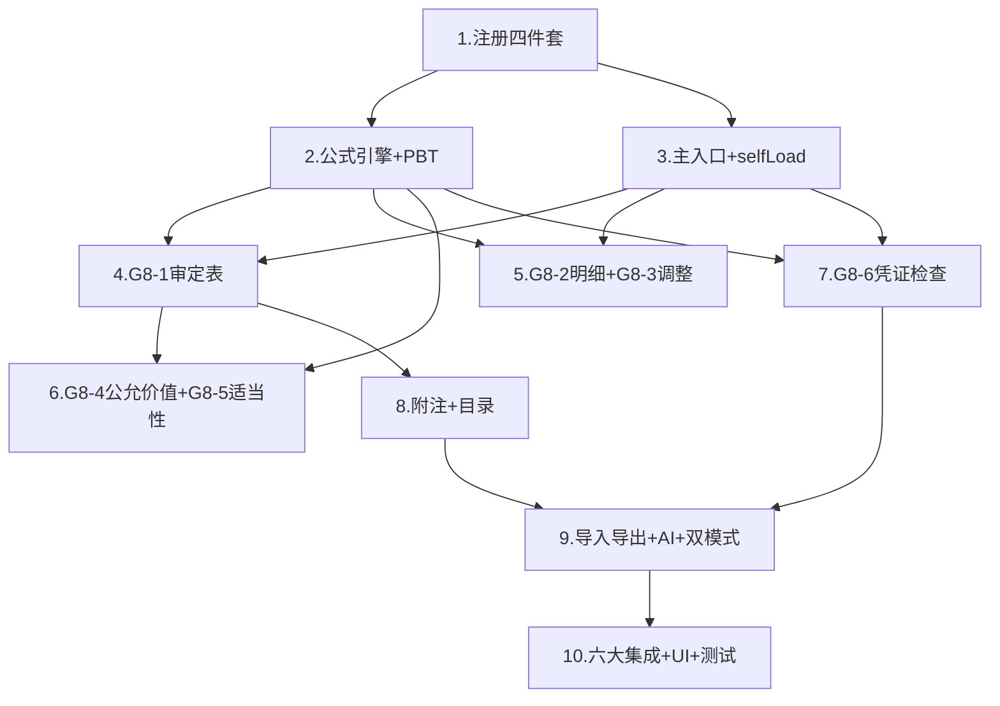

# Implementation Plan: G8 其他权益工具投资底稿专属HTML精美组件

## Overview

G8其他权益工具投资专属组件 `g8-other-equity-instruments`，覆盖10个sheet（G8A/G8-1~G8-6/附注披露(上市)/附注披露(国企)/底稿目录）。采用sheetName v-if dispatch模式 + defineAsyncComponent懒加载×10 + 公式引擎composable(7纯函数+parseNum) + 六大集成联动。按D~N底稿开发标准8步组织为8波次。特色：指定适当性检查G8-5(CAS22问卷) + 公允价值三层次G8-4(Level3必填校验) + OCI核算(公允价值变动计入其他综合收益)。

## Task Dependency Graph



```json
{
  "waves": [
    { "id": "wave-1", "name": "基础注册", "tasks": [1] },
    { "id": "wave-2", "name": "公式引擎+PBT", "tasks": [2] },
    { "id": "wave-3", "name": "主入口+数据层", "tasks": [3] },
    { "id": "wave-4", "name": "核心表(审定+明细+调整)", "tasks": [4, 5] },
    { "id": "wave-5", "name": "估值(公允价值测试+适当性检查)", "tasks": [6] },
    { "id": "wave-6", "name": "凭证检查+虚拟滚动", "tasks": [7] },
    { "id": "wave-7", "name": "附注+目录+导入导出+AI", "tasks": [8, 9] },
    { "id": "wave-8", "name": "六大集成+UI+测试", "tasks": [10] }
  ]
}
```

## Tasks

- [ ] 1. 注册四件套 + render策略
  - [ ] 1.1 后端注册：VALID_COMPONENT_TYPES + RENDERER_DISPATCH + render策略函数
    - 创建 `backend/app/routers/wp_render_strategies/_g8_other_equity_instruments.py`
    - 在 `VALID_COMPONENT_TYPES` 列表中添加 `'g8-other-equity-instruments'`
    - 在 `RENDERER_DISPATCH` 中注册 `'g8-other-equity-instruments': render_g8_other_equity_instruments`
    - render函数返回10个sheet的配置（componentType/sheetName/columns/rows）
    - _Requirements: 1.1, 1.5_

  - [ ] 1.2 前端注册：htmlRendererRegistry + 主入口骨架
    - 在 `htmlRendererRegistry` 中添加 `'g8-other-equity-instruments': () => import('./workpaper/GtG8OtherEquityInstruments.vue')`
    - 创建 `GtG8OtherEquityInstruments.vue` 骨架（接收props，v-if分发占位，defineAsyncComponent×10）
    - _Requirements: 1.1, 1.2, 1.3_

  - [ ] 1.3 wp_code_overrides.json添加10条映射
    - G8A/G8-1~G8-6/附注披露(上市公司)/附注披露(国企)/底稿目录 → 'g8-other-equity-instruments'
    - _Requirements: 1.4_

  - [ ] 1.4 创建子目录结构 + 子组件占位
    - 创建 `g8-other-equity-instruments/core/` + `valuation/` + `voucher/` 三个子目录
    - core/ 下7个占位：G8TabProcedure/G8TabAdjudication/G8TabDetail/G8TabAdjustment/G8TabDisclosureListed/G8TabDisclosureSOE/G8TabDirectory
    - valuation/ 下2个占位：G8TabFairValueTest/G8TabDesignationCheck
    - voucher/ 下1个占位：G8TabVoucherCheck
    - _Requirements: 1.1, 1.2_

- [ ] 2. 公式引擎composable + PBT测试
  - [ ] 2.1 实现useG8FormulaEngine.ts（7个纯函数 + parseNum）
    - 创建 `audit-platform/frontend/src/components/workpaper/composables/useG8FormulaEngine.ts`
    - 实现 parseNum（null/undefined/NaN/空串/'  '/'abc'→0，有效数值→原值）
    - 实现 calcDebitBalance(opening, debit, credit)：opening + debit - credit（借方余额）
    - 实现 calcAdjustedAmount(unadjusted, adjustment)：unadjusted + adjustment（审定数，G8只有账项调整）
    - 实现 calcEndingBalance(openingAdjusted, increase, decrease, fvChange)：openingAdjusted + increase - decrease + fvChange（期末余额）
    - 实现 calcFairValueDiff(audited, unadjusted)：audited - unadjusted（公允价值差异）
    - 实现 calcChangeRate(prior, current)：prior=0返回null，否则(current-prior)/prior
    - 实现 isDebitCreditBalanced(debits[], credits[])：|SUM(debits)-SUM(credits)| < 0.01
    - 所有函数无副作用，输入通过parseNum清洗
    - _Requirements: 10.1~10.8_

  - [ ]* 2.2 PBT: Property 1 — 借方余额公式
    - **Property 1: calcDebitBalance(opening, debit, credit) === opening + debit - credit**
    - **Validates: Requirements 3.3, 10.1**
    - fast-check numRuns ≥ 100

  - [ ]* 2.3 PBT: Property 2 — 审定数公式
    - **Property 2: calcAdjustedAmount(unadjusted, adjustment) === unadjusted + adjustment**
    - **Validates: Requirements 3.4, 5.2, 10.2**

  - [ ]* 2.4 PBT: Property 3 — 期末余额公式
    - **Property 3: calcEndingBalance(openingAdjusted, increase, decrease, fvChange) === openingAdjusted + increase - decrease + fvChange**
    - **Validates: Requirements 5.3, 10.3**

  - [ ]* 2.5 PBT: Property 4 — 公允价值差异
    - **Property 4: calcFairValueDiff(audited, unadjusted) === audited - unadjusted**
    - **Validates: Requirements 7.4, 10.4**

  - [ ]* 2.6 PBT: Property 5 — 变动率方向性与除零保护
    - **Property 5: ∀ current>prior>0: calcChangeRate(prior,current)>0; ∀ current<prior,prior>0: result<0; calcChangeRate(0,any)===null**
    - **Validates: Requirements 3.8, 10.5**

  - [ ]* 2.7 PBT: Property 6 — 借贷平衡恒等
    - **Property 6: isDebitCreditBalanced(debits, credits) ↔ (|SUM(debits)-SUM(credits)| < 0.01)**
    - **Validates: Requirements 6.2, 9.5, 10.6**

  - [ ]* 2.8 PBT: Property 7 — parseNum健壮性
    - **Property 7: parseNum(null/undefined/''/NaN/'  '/'abc')===0; parseNum(n∈ℝ)===n**
    - **Validates: Requirements 10.7**

  - [ ]* 2.9 PBT: Property 8 — 期末余额与审定一致性（组合性质）
    - **Property 8: calcAdjustedAmount(calcEndingBalance(openAdj,inc,dec,fv), adj) === openAdj+inc-dec+fv+adj**
    - **Validates: Requirements 5.2, 5.3, 10.2, 10.3**

  - [ ] 2.10 单元测试：parseNum边界 + 除零保护 + 浮点精度
    - parseNum(null/undefined/NaN/''/非数字) → 0
    - calcChangeRate(0, x) → null
    - isDebitCreditBalanced浮点精度验证（差额=0.009→true, 0.011→false）
    - _Requirements: 10.5, 10.7_

- [ ] 3. 主入口sheetName分发 + selfLoad + 数据composable
  - [ ] 3.1 GtG8OtherEquityInstruments.vue 完整实现
    - sheetName正则提取编码（SHEET_CODE_MAP: G8A/G8-1~G8-6/附注披露(上市)/附注披露(国企)/底稿目录 → 10个映射）
    - v-if分发到10个defineAsyncComponent子组件
    - selfLoad模式：htmlData为null时调用render-config?force_component_type=g8-other-equity-instruments
    - 未匹配sheetName → OnlyOffice fallback
    - _Requirements: 1.1, 1.2, 1.6, 1.7_

  - [ ] 3.2 useG8FormData.ts composable
    - 数据加载/保存统一入口（G8Content结构）
    - selfLoad逻辑（bundle内嵌场景htmlData为null）
    - trial_balance取数(科目1503)
    - 保存触发autoSnapshot + WORKPAPER_SAVED
    - writebackTB回写试算表
    - _Requirements: 3.5, 11.1_

  - [ ] 3.3 useG8DualMode.ts composable
    - HTML↔OnlyOffice切换
    - localStorage持久化用户偏好
    - 切换时数据不丢失
    - _Requirements: 12.6_

- [ ] 4. G8-1 审定表（29行，借方科目公允价值计量）
  - [ ] 4.1 G8TabAdjudication.vue 组件
    - 29行×11列：项目|期初(未审|账项调整|审定)|期末(未审|账项调整|审定)|变动额|变动率|原因分析
    - 第一行分组标题"公允价值"，下方按被投资单位逐项列示
    - 底部合计行
    - 试算表数自动取数(科目1503) + 差异=审定-试算表（差异≠0红色）
    - 公式联动：借方余额/审定数/变动额/变动率
    - |变动率|>20%橙色高亮+必填原因分析
    - EventBus发布 `substantive:adjudicated`(accountCode='1503', adjudicatedAmount)
    - _Requirements: 3.1~3.9_

  - [ ]* 4.2 单元测试：审定表公式联动 + 高亮逻辑
    - 借方余额公式计算正确
    - 差异≠0红色触发
    - |变动率|>20%橙色+必填验证
    - EventBus publish正确payload
    - _Requirements: 3.3~3.9_

- [ ] 5. Checkpoint - 核心审定逻辑验证
  - Ensure all tests pass, ask the user if questions arise.

- [ ] 6. G8-2 明细表（24列→2区段Tab）+ G8-3 调整分录
  - [ ] 6.1 G8TabDetail.vue 组件（2区段Tab）
    - Tab1: 被投资单位基础信息(12列)：名称|投资比例|期初余额|期初调整|期初审定(公式)|增加|减少|公允价值变动|期末余额(公式)|调整数|审定数(公式)|指定OCI原因
    - Tab2: 公允价值+OCI(12列)：名称|OCI累计变动|本期OCI变动|OCI转留存|转入原因|发函|层次(L1/L2/L3下拉)|估值方法|持股数|每股公允价值|公允价值合计|备注
    - Tab切换行同步
    - 底部合计行
    - 动态行增删（ElMessageBox.prompt输入被投资单位名称）
    - _Requirements: 5.1~5.6_

  - [ ] 6.2 G8TabAdjustment.vue 组件
    - 24行×10列：序号|分录类型(AJE/RJE)|日期|摘要|科目代码|科目名称|借方金额|贷方金额|编制人|备注
    - 借贷平衡校验：|SUM(借)-SUM(贷)|<0.01
    - 不平衡红色高亮+差额显示
    - 动态行增删（ElMessageBox.prompt输入摘要）
    - 保存时AJE/RJE汇总回写G8-1审定表
    - _Requirements: 6.1~6.5_

  - [ ]* 6.3 单元测试：G8-2公式联动 + G8-3借贷平衡
    - calcEndingBalance正确计算期末余额
    - calcAdjustedAmount正确计算审定数
    - isDebitCreditBalanced判定逻辑
    - AJE/RJE汇总回写金额正确
    - _Requirements: 5.2, 5.3, 6.2, 6.5_

- [ ] 7. G8-4 公允价值测试表（19列→2区段Tab，Level3必填）+ G8-5 指定适当性检查
  - [ ] 7.1 G8TabFairValueTest.vue 组件（2区段Tab + Level3必填校验）
    - 顶部方法论上下文（琥珀色左边线+浅黄背景）：三层次定义说明
    - Tab1: 基础信息+审定(10列)：名称|初始投资日期|未审(数量/单价/FV)|审定(数量/单价/FV)|差异(公式)|层次(L1/L2/L3下拉)
    - Tab2: 估值详情(9列)：名称|估值方法(下拉)|与上期一致(是/否)|来源机构|输入值来源(textarea)|估值技术|不可观察输入值描述(textarea)|数值|估值文件索引号
    - Tab切换行同步
    - **Level3必填校验**：层次=Level3时Tab2(估值技术+不可观察输入值描述)不能为空，红框高亮+toast
    - |差异|>重要性水平红色高亮
    - 底部审计结论textarea（AI辅助）+ 编制提示details折叠
    - 动态行增删（ElMessageBox.prompt输入被投资单位名称）
    - _Requirements: 7.1~7.8_

  - [ ] 7.2 G8TabDesignationCheck.vue 组件（问卷式CAS22合规）
    - 顶部方法论上下文（琥珀色左边线+浅黄背景）：CAS22指定条件4项
    - 四section问卷：(一)指定是否符合准则/(二)管理层持有目的/(三)金融资产分类合规/(四)指定不可撤销性
    - 列结构：序号|检查项目|审计要求|证据/回复(textarea)|合规(合规/不合规/不适用 下拉)|审计结论(textarea)|索引
    - 每section标题行右侧AI辅助按钮 + 复核按钮
    - 底部综合审计结论textarea + 编制提示details折叠
    - _Requirements: 8.1~8.5_

  - [ ]* 7.3 单元测试：Level3必填校验 + 公允价值差异
    - Level3时valuationTechnique/unobservableInputDesc为空→校验失败
    - Level1/Level2时Tab2非必填→校验通过
    - calcFairValueDiff正确计算差异
    - _Requirements: 7.3, 7.4_

- [ ] 8. Checkpoint - 估值与适当性逻辑验证
  - Ensure all tests pass, ask the user if questions arise.

- [ ] 9. G8-6 凭证检查表（18列→3区段Tab + 虚拟滚动 + OCR）
  - [ ] 9.1 G8TabVoucherCheck.vue 组件（3区段Tab + 102行虚拟滚动）
    - Tab1: 凭证基础(7列)：日期|凭证编号|业务内容|对方科目|借方|贷方|📎附件
    - Tab2: 核对内容(6列)：文件描述|✓完整|✓授权|✓账务正确|✓公允价值正确|✓OCI正确
    - Tab3: 结论(5列)：索引号(GtIndexChip)|是否异常|异常说明(textarea)|风险等级(高/中/低)|备注
    - 102行虚拟滚动
    - 3个Tab行同步
    - 顶部借贷差额汇总（差额≠0红色）
    - Tab2任一核对项✗→Tab3"是否异常"自动置"是"+红色高亮
    - 📎附件列：上传→POST /d4/contract-ocr→ElMessageBox确认→merge填入当前行
    - GtIndexChip索引列跳转
    - 动态行增删
    - 集成GtVoucherSamplingEngine（dialog→样本填入）
    - _Requirements: 9.1~9.8_

  - [ ]* 9.2 单元测试：异常自动检测 + 借贷平衡
    - Tab2 check1~check5任一false→isAbnormal=true
    - Tab2全部true→isAbnormal保持原值
    - 借贷差额计算正确
    - _Requirements: 9.5, 9.6_

- [ ] 10. 附注披露 + 底稿目录
  - [ ] 10.1 G8TabDisclosureListed.vue（上市公司附注，18行×7列）
    - 结构化表格
    - 监听EventBus `substantive:adjudicated`(accountCode='1503')自动刷新
    - 发布 `disclosure:note-text-updated`(accountCode='1503')
    - 每文本区section标题行AI辅助按钮
    - _Requirements: 4.1, 4.3, 4.4, 4.5_

  - [ ] 10.2 G8TabDisclosureSOE.vue（国企附注，20行×7列）
    - 结构化表格
    - 同上市版本EventBus逻辑（subscribe + publish）
    - _Requirements: 4.2, 4.3, 4.4, 4.5_

  - [ ] 10.3 G8TabDirectory.vue（底稿目录）+ G8TabProcedure.vue（G8A程序表）
    - 底稿目录：索引号列GtIndexChip可点击跳转
    - G8A程序表：复用a-program-console componentType + selfLoad + 抽凭引擎 + 截止自动提取
    - _Requirements: 2.1~2.5, 13.9_

- [ ] 11. 导入导出 + AI辅助
  - [ ] 11.1 useG8ImportExport.ts composable
    - 4张动态行表格导入导出：G8-2/G8-3/G8-4/G8-6
    - 后端三端点：export-template / export-data / import-data
    - 宽表区段分sheet导出：G8-2(2sheet)/G8-4(2sheet)/G8-6(3sheet)
    - G8-3单sheet导出
    - 使用http(axios)不用原生fetch
    - el-dropdown"导入导出▾"(导出模板/导出数据/导入数据)
    - _Requirements: 12.1~12.3_

  - [ ] 11.2 后端 _g8_other_equity_instruments_import_export.py
    - 12个端点（4表×3端点）
    - openpyxl解析验证 + 格式不匹配422 + 具体列错误信息
    - 宽表按区段分sheet：G8-2(2sheet)/G8-4(2sheet)/G8-6(3sheet)
    - StreamingResponse中文文件名RFC5987编码
    - _Requirements: 12.1~12.3_

  - [ ] 11.3 后端 _g8_other_equity_instruments_ai.py
    - 4个AI section端点：adjudication-analysis / fair-value-conclusion / designation-conclusion / voucher-conclusion
    - _Requirements: 12.4, 12.5_

  - [ ] 11.4 后端 _g8_other_equity_instruments_service.py
    - G8OtherEquityInstrumentsService类
    - get_trial_balance_data(project_id, year)：科目1503取数
    - save_adjudication(wp_id, data)：保存审定+回写TB
    - validate_formulas(data)：公式验证
    - _Requirements: 3.5, 3.7_

- [ ] 12. 六大集成联动
  - [ ] 12.1 版本链集成
    - 主入口useVersionTrail(wpId) + autoSnapshot on save + "版本历史"按钮 + GtWpVersionTrail drawer
    - _Requirements: 11.1_

  - [ ] 12.2 抽凭引擎 + 截止自动提取集成
    - G8-6凭证检查表集成GtVoucherSamplingEngine（dialog→样本填入借方/贷方区）
    - G8A程序表集成GtVoucherSamplingEngine（dialog模式，科目1503）
    - G8A程序表集成useCutoffAutoSampling（accountCode='1503', days=5）
    - _Requirements: 11.2, 11.3_

  - [ ] 12.3 附注EventBus + 行级OCR + 复核对话集成
    - G8-1审定表 → publish `substantive:adjudicated`(accountCode='1503')
    - 附注(上市/国企) → subscribe + publish `disclosure:note-text-updated`
    - G8-6 Tab1📎附件列：上传→POST /d4/contract-ocr→ElMessageBox确认→merge填入
    - 主入口provide openReviewDialog → 子组件inject → section标题栏右侧按钮
    - _Requirements: 11.4, 11.5, 11.6_

- [ ] 13. UI规范 + 性能优化
  - [ ] 13.1 UI铁律落实
    - 表格字体13px
    - AI+复核按钮右对齐在section标题同行
    - 公式列虚线下划线+cursor:help+tooltip来源
    - 列宽min-width自适应
    - 审计说明/结论el-card包裹
    - 编制提示details折叠底部
    - 动态行新增ElMessageBox.prompt确认
    - 区段Tab切换流畅（无闪烁/行同步无延迟）
    - _Requirements: 13.1~13.8_

  - [ ] 13.2 虚拟滚动 + 性能
    - G8-6(102行)启用虚拟滚动
    - 虚拟滚动异常时降级为分页模式(每页30行)
    - defineAsyncComponent懒加载所有10个子组件
    - _Requirements: 13.6, 13.7_

- [ ] 14. 集成测试 + E2E
  - [ ] 14.1 后端集成测试
    - render策略返回10 sheets配置正确
    - 导入导出12端点基础契约测试
    - AI 4端点响应格式
    - trial_balance取数(1503)
    - _Requirements: 1.1~1.5, 12.1~12.5_

  - [ ]* 14.2 后端PBT（hypothesis, max_examples=5）
    - P1借方余额 / P2审定数 / P3期末余额 / P4公允价值差异 / P5变动率 / P6借贷平衡 / P7 parseNum / P8组合一致性
    - _Requirements: 10.1~10.8_

  - [ ]* 14.3 Playwright E2E
    - 场景1：审定表填写→借方公式→差异高亮→EventBus→附注刷新
    - 场景2：公允价值测试→Level3选择→Tab2必填校验→估值详情填入→差异计算
    - 场景3：指定适当性检查→CAS22四section→逐项合规判断→AI辅助结论
    - 场景4：凭证检查→抽凭填入→Tab2核对→任一✗→Tab3自动异常→OCR识别
    - _Requirements: 3.1~13.9_

- [ ] 15. Final checkpoint - 全部测试通过
  - Ensure all tests pass, ask the user if questions arise.

## Notes

- G8特色区别于G1交易性金融资产：①指定适当性检查(G8-5 CAS22问卷) ②OCI核算(公允价值变动不进损益) ③公允价值三层次(Level3必填校验)
- 10个sheet < G5(16个)，采用三子目录组织（core/valuation/voucher），比G5简约
- 科目代码1503，借方/资产类，公式基于借方余额逻辑
- 宽表拆分3张：G8-2(2区段)/G8-4(2区段)/G8-6(3区段)，区段Tab行同步是关键UX
- 导入导出4张表(G8-2/G8-3/G8-4/G8-6)×3端点=12个后端端点
- G8-5适当性检查为问卷式(19列多为合并textarea)，不需区段拆分
- Level3必填校验逻辑：fairValueLevel='Level3'时强制Tab2估值技术+不可观察输入值非空
- G8-6虚拟滚动102行+3区段Tab是最复杂的交互组件
- Tasks marked with `*` are optional and can be skipped for faster MVP
- Each task references specific requirements for traceability
- Property tests validate universal correctness properties (8 properties via fast-check)
- Checkpoints ensure incremental validation

## Task Dependency Graph

```json
{
  "waves": [
    { "id": 0, "tasks": ["1.1", "1.2", "1.3", "1.4"] },
    { "id": 1, "tasks": ["2.1"] },
    { "id": 2, "tasks": ["2.2", "2.3", "2.4", "2.5", "2.6", "2.7", "2.8", "2.9", "2.10", "3.1", "3.2", "3.3"] },
    { "id": 3, "tasks": ["4.1", "6.1", "6.2"] },
    { "id": 4, "tasks": ["4.2", "6.3", "7.1", "7.2"] },
    { "id": 5, "tasks": ["7.3", "9.1"] },
    { "id": 6, "tasks": ["9.2", "10.1", "10.2", "10.3", "11.1", "11.2", "11.3", "11.4"] },
    { "id": 7, "tasks": ["12.1", "12.2", "12.3", "13.1", "13.2", "14.1", "14.2", "14.3"] }
  ]
}
```
