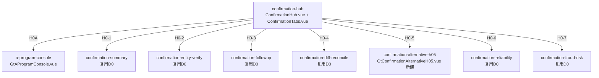

# Design Document: H0 固定资产循环函证模块

## Overview

H0固定资产循环函证模块对齐D0实际架构：**复用D0共享函证组件** + **新建H0-5替代程序组件**。

D0函证模块已验证架构：9个跨循环共享componentType + confirmation-hub统一入口。E0/F0/G0/H0/K0/L0全部通过overrides映射复用，不为每个循环重复开发（🔴铁律：函证模块跨循环共享）。

**H0唯一需要新建的**：
- `confirmation-alternative-h05`：固定资产/在建工程替代程序（4区块按固定资产循环科目）

参照D0-5(GtConfirmationAlternativeD05)模式，H0-5结构完全相同，只是4区块的检查内容按固定资产循环科目不同（H0只有1个替代程序，不像F0有F0-5/F0-6两个）。

## Architecture

### D0共享函证架构（H0直接复用）



### 文件结构（仅新建部分）

```
audit-platform/frontend/src/components/workpaper/confirmation/
├── alternativeH05/
│   └── GtConfirmationAlternativeH05.vue    # 新建 (~400行, 参照alternativeD05)
├── h0-confirmation/composables/
│   ├── useAlternativeH05Data.ts            # 4区块数据管理
│   ├── useH0FormulaEngine.ts               # 合计/比例/差异纯函数
│   └── useH0ImportExport.ts                # 导入导出composable
└── ... (D0已有的shared目录不动)

backend/app/routers/wp_render_strategies/
├── _h0_confirmation.py                     # render策略 + 注册RENDERER_DISPATCH(1个)
├── _h0_confirmation_import_export.py       # 导入导出3端点
└── _h0_confirmation_ai.py                  # AI生成2 section
```

### H0-5 替代程序4区块设计

参照D0-5模式，H0-5的4区块为固定资产循环科目（每区块左右视觉分组：记账凭证5列 | 检查证据N列）：

| 区块 | 标题 | 记账凭证列 | 检查证据列 |
|------|------|-----------|-----------|
| ① | 期后验收/权属证据检查 | 日期/凭证编号/业务内容/对方科目/金额 | 验收单日期编号/资产名称/规格型号/数量 \| 权属证书编号/权属人/取得日期 \| 索引号/是否异常 |
| ② | 期末余额支持性证据(合同/发票/付款凭证) | 日期/凭证编号/业务内容/对方科目/金额 | 采购合同日期编号/供应商/合同金额 \| 采购发票日期编号/金额 \| 付款凭证日期/金额/索引号/是否异常 |
| ③ | 本期新增资产检查 | 日期/凭证编号/业务内容/对方科目/金额 | 请购审批单日期编号/是否恰当审批 \| 到货验收单日期/资产名称/数量 \| 转固日期/原值/索引号/是否异常 |
| ④ | 抵押担保/融资租赁证据 | 日期/凭证编号/业务内容/对方科目/金额 | 抵押合同编号/抵押权人/担保金额 \| 融资租赁合同编号/出租方/租赁期 \| 他项权证编号/索引号/是否异常 |

## Components and Interfaces

### 组件接口（参照D0-5）

```typescript
// GtConfirmationAlternativeH05 props（与D05完全一致）
interface Props {
  htmlData: Record<string, any> | null
  sheetName: string
  wpId: string
  projectId: string
  readonly?: boolean
}

// 4区块配置
const BLOCKS_H05 = [
  { key: 'acceptance_ownership', title: '期后验收/权属证据检查', columns: [...] },
  { key: 'balance_evidence',     title: '期末余额支持性证据',    columns: [...] },
  { key: 'new_asset_check',      title: '本期新增资产检查',      columns: [...] },
  { key: 'mortgage_lease',       title: '抵押担保/融资租赁证据',  columns: [...] },
]

// 余额汇总区
interface AlternativeH05Summary {
  investmentType: string       // 函证项目(固定资产/在建工程)
  openingBalance: number       // 年初余额
  debitAmount: number          // 借方发生额
  creditAmount: number         // 贷方发生额
  closingBalance: number       // 期末余额
  currentAddition: number      // 本期新增金额
  ownershipCheckRatio: number  // 权属证据检查比例
  postAcceptanceRatio: number  // 期后验收检查比例
}
```

### 公式引擎接口

```typescript
// useH0FormulaEngine.ts（纯函数，可PBT）
function calcBlockTotal(amounts: number[]): number                 // Σ amounts, 空→0
function calcCheckRatio(checked: number, balance: number): number  // balance>0 ? checked/balance : 0
function calcRowVariance(book: number, evidence: number): number   // book - evidence
function isAbnormal(variance: number): boolean                     // |variance| > 0
```

### 后端接口

```python
# _h0_confirmation.py
def render_h0_alternative(wp_id: str, config: dict) -> dict:
    """Render策略: confirmation-alternative-h05（复用confirmation通用renderer）"""

# _h0_confirmation_import_export.py
POST /api/workpapers/{wp_id}/h0/export-template?sheet=H0-5
POST /api/workpapers/{wp_id}/h0/export-data?sheet=H0-5
POST /api/workpapers/{wp_id}/h0/import-data?sheet=H0-5

# _h0_confirmation_ai.py
POST /api/workpapers/{wp_id}/h0/ai/{section}
# section: alternative-audit-note / alternative-audit-conclusion
```

### 数据流

```mermaid
graph LR
    H01[H0-1 函证结果汇总] -->|未回函公司列表| H05[H0-5 替代程序]
    H05 -->|检查结果| CONC[函证结论]
    OCR[/d4/contract-ocr] -->|行级OCR识别| H05
    H05 -->|autoSnapshot on save| VT[useVersionTrail 版本快照]
```

## Data Models

### 持久化（与D0-5模式一致）

item_id前缀：`H0-5-alt-{entity_id}-block{N}-rows`

存储在checklist_responses.remark (JSON数组)。余额汇总/抽样参数/审计说明结论分别用独立item_id存储（结构化数据不塞进textarea content）。

## Error Handling

1. **Master-Detail加载失败**：左侧公司列表加载失败时显示错误提示+重试按钮
2. **合计计算异常**：parseNum兜底（NaN→0），确保合计始终为数值
3. **检查比例除零**：期末余额=0时比例返回0（不显示NaN/Infinity）
4. **导入格式错误**：后端返回详细错误列表（sheet名/行号/字段/原因），不写入脏数据
5. **OCR识别失败**：返回空结果时toast"未识别到有效资产信息"，保留原行
6. **反向联动失败**：H0-1未回函列表为空时，H0-5显示"暂无待替代程序公司"
7. **selfLoad兜底**：bundle内嵌场景htmlData为null时组件自加载render-config

## Testing Strategy

| 类型 | 范围 | 框架 |
|------|------|------|
| Unit | H0-5 4区块列配置+CRUD+合计行 | vitest |
| PBT | useH0FormulaEngine P1~P4（合计/比例/差异/异常） | vitest + fast-check |
| Contract | VALID_COMPONENT_TYPES + htmlRendererRegistry包含h05 | vitest |
| Integration | confirmation-hub路由到H0-5 + 导入导出round-trip | vitest mock |

## Correctness Properties

### Property 1: 区块合计公式
∀ amounts ∈ ℝ*: calcBlockTotal(amounts) === Σ amounts；calcBlockTotal([]) === 0
**Validates: Requirements 5.1, 2.7**

### Property 2: 检查比例公式
∀ checked ∈ ℝ≥0, balance ∈ ℝ: calcCheckRatio(checked, balance) === balance>0 ? checked/balance : 0
**Validates: Requirements 5.2, 2.3**

### Property 3: 行差异公式与零差异恒等
∀ book, evidence ∈ ℝ: calcRowVariance(book, evidence) === book - evidence；calcRowVariance(v, v) === 0
**Validates: Requirements 5.3**

### Property 4: 异常判定
∀ book, evidence ∈ ℝ: isAbnormal(calcRowVariance(book, evidence)) === (book ≠ evidence)
**Validates: Requirements 5.4, 2.7**
