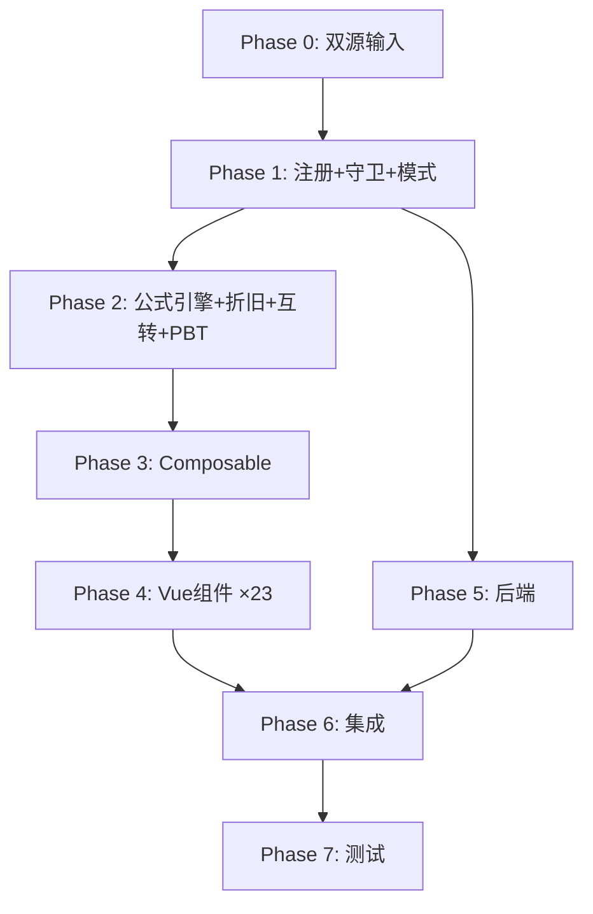

# Implementation Plan: H7 生产性生物资产底稿专属HTML精美组件

## Overview

H7生产性生物资产底稿专属组件`h7-biological-assets`。行业特殊+双计量模式底稿（26有效sheet/1 xlsx/~250+公式）。

主入口 GtH7BiologicalAssets.vue（sheetName v-if + 行业守卫 + measurementModel，defineAsyncComponent lazy）+ 23个子组件 + 18个composable + 后端4个py文件。

科目：1621生产性生物资产（借方/资产类）+ 累计折旧（贷方/备抵类）
公式特征：双计量模式+行业限制+产量记录(独有)+折旧直线法+互转三方向

## Tasks

### Phase 0: 双源输入验证

- [x] 0.1 openpyxl脚本读取H7生产性生物资产.xlsx全部26 sheet
  - 提取：sheet名/列头/行数/公式/合并区域/数据类型
  - 产出：h7_structure_summary.json
  - 验证：26 sheet结构（含双模式sheet对）与本spec一致
  - _Requirements: 双源输入流程_

- [x] 0.2 H固定资产循环底稿模板库md交叉验证
  - 核对：行业适用性/双计量模式/互转规则/产量记录
  - 产出：h7_conflict_resolution.md
  - _Requirements: 双源输入流程_

### Phase 1: 注册+契约测试

- [x] 1.1 注册componentType和映射
  - wp_code_overrides: H7/H7-1~H7-17/H7A → 'h7-biological-assets'
  - VALID_COMPONENT_TYPES + htmlRendererRegistry注册
  - 创建 GtH7BiologicalAssets.vue 骨架（sheetName v-if + measurementModel + 行业守卫 + selfLoad）
  - _Requirements: 1.1-1.9, 1.11, 1.13_

- [x] 1.2 编写注册契约测试
  - htmlRendererRegistry / VALID_COMPONENT_TYPES / wp_code_overrides / RENDERER_DISPATCH
  - _Requirements: 1.6, 1.7, 1.8_

- [x] 1.3 创建 useH7IndustryGuard.ts + useH7MeasurementModel.ts
  - 行业守卫：check industry IN ['agriculture','forestry','livestock','fishery']
  - 计量模式：el-segmented + 4对sheet显隐 + 数据独立存储
  - _Requirements: 1.11-1.14, 13.1-13.3, 14.1-14.4_

### Phase 2: 公式引擎+PBT

- [x] 2.1 创建 `useH7FormulaEngine.ts`
  - calcAuditedAmount / calcAssetEndBalance / calcContraEndBalance / calcFairEndBalance
  - calcNetValue / calcSubtotal / calcChangeRate / calcPriceDiffRate / calcFairValueDiffRate
  - _Requirements: 2.3-2.5, 8.2, 10.3_

- [x] 2.2 创建 `useH7DepreciationEngine.ts`
  - calcStraightLine / calcMonthlyDep / calcDepAfterImpairment / calcAccDep
  - _Requirements: 11.1-11.4_

- [x] 2.3 创建 `useH7TransferEngine.ts`
  - calcProdToConsumable / calcProdToPublic / calcTransferDiff
  - _Requirements: 8.4-8.5_

- [x]* 2.4 编写 Property P1 PBT：审定数公式链
  - 生成器：fc.float({min:-1e9, max:1e9}) × 3
  - 断言：calcAuditedAmount(u, a, r) === u + a + r
  - **Feature: h7-biological-assets, Property P1: 审定数公式链**

- [x]* 2.5 编写 Property P2 PBT：资产类期末余额
  - 生成器：fc.float({min:0, max:1e9}) × 3
  - 断言：calcAssetEndBalance(b, d, c) === b + d - c
  - **Feature: h7-biological-assets, Property P2: 资产类期末余额**

- [x]* 2.6 编写 Property P3 PBT：备抵类期末余额
  - 生成器：fc.float({min:0, max:1e9}) × 3
  - 断言：calcContraEndBalance(b, d, c) === b + c - d
  - **Feature: h7-biological-assets, Property P3: 备抵类期末余额**

- [x]* 2.7 编写 Property P4 PBT：公允价值模式期末
  - 生成器：fc.float({min:-1e9, max:1e9}) × 4
  - 断言：calcFairEndBalance(b, i, d, fc) === b + i - d + fc
  - **Feature: h7-biological-assets, Property P4: 公允模式期末**

- [x]* 2.8 编写 Property P5 PBT：直线法折旧
  - 生成器：cost>0, salvageRate∈[0,1), usefulLife>0
  - 断言：calcStraightLine(cost, rate, life) === cost×(1-rate)/life
  - **Feature: h7-biological-assets, Property P5: 直线法折旧**

- [x]* 2.9 编写 Property P6 PBT：月折旧
  - 生成器：fc.float({min:0, max:1e8})
  - 断言：calcMonthlyDep(annual) === annual / 12
  - **Feature: h7-biological-assets, Property P6: 月折旧**

- [x]* 2.10 编写 Property P7 PBT：互转差额
  - 生成器：fc.float({min:0, max:1e9}) × 2
  - 断言：calcTransferDiff(out, in) === out - in
  - **Feature: h7-biological-assets, Property P7: 互转差额**

- [x]* 2.11 编写 Property P8 PBT：合计行恒等
  - 生成器：fc.array(fc.float, {minLength:1, maxLength:50})
  - 断言：calcSubtotal(arr) === Σarr
  - **Feature: h7-biological-assets, Property P8: 合计行恒等**

- [x]* 2.12 编写 Property P9 PBT：净值公式
  - 生成器：fc.float({min:0, max:1e9}) × 3
  - 断言：calcNetValue(c, d, i) === c - d - i
  - **Feature: h7-biological-assets, Property P9: 净值公式**

- [x]* 2.13 编写 Property P10 PBT：变动率
  - 生成器：current≥0, prior>0
  - 断言：calcChangeRate(c, p) === (c-p)/p × 100
  - **Feature: h7-biological-assets, Property P10: 变动率公式**

- [x]* 2.14 编写 Property P11 PBT：公允价值差异率
  - 生成器：assessed>0, book>0
  - 断言：calcFairValueDiffRate(a, b) === (a-b)/b × 100
  - **Feature: h7-biological-assets, Property P11: 公允价值差异率**

- [x]* 2.15 编写 Property P12 PBT：减值后折旧
  - 生成器：netValue>0, salvageRate∈[0,1), remainLife>0
  - 断言：calcDepAfterImpairment(nv, rate, life) === nv×(1-rate)/life
  - **Feature: h7-biological-assets, Property P12: 减值后折旧**

### Phase 3: Composable层

- [ ] 3.1 创建 useH7FormData.ts
  - selfLoad + checklist_responses + writebackTB(1621+累计折旧)
  - _Requirements: 1.9, 1.10, 2.7_

- [ ] 3.2 创建 useH7CrossSheet.ts
  - adjudicationVsDetail / depreciationVsAdjudication / transferDiffCheck
  - _Requirements: 2.6, 7.6_

- [ ] 3.3 创建 useH7DualMode.ts + useH7ImportExport.ts
  - 双模式切换 + 导入导出三级
  - _Requirements: 3.4_

- [ ] 3.4 创建 sheet-specific composables（16个）
  - useH7AdjudicationCost / useH7AdjudicationFair / useH7DetailCost / useH7DetailFair
  - useH7Adjustment / useH7PolicyCheck / useH7Analysis
  - useH7AdditionCheck / useH7DisposalCheck / useH7Stocktake
  - useH7Depreciation / useH7FairValueReview / useH7TransferReview
  - useH7Impairment / useH7RelatedParty / useH7ProductionRecord
  - _Requirements: 2~10 全部_

### Phase 4: Vue子组件

- [ ] 4.1 创建 H7TabIndex.vue 底稿目录
  - 26行sheet列表+进度条+行业标识+计量模式指示
  - _Requirements: 1.2_

- [ ] 4.2 创建 H7TabAdjudicationCost/Fair.vue 审定表（双版本）
  - 成本51公式双区块 / 公允51公式单区块 + TB回写
  - _Requirements: 2.1-2.8_

- [ ] 4.3 创建 H7TabDetailCost/Fair.vue 明细表（双版本）
  - 成本51列3区段 / 公允47列3区段 + 动态行 + 导入导出
  - _Requirements: 3.1-3.4_

- [ ] 4.4 创建 H7TabAdjustment.vue + H7TabPolicyCheck.vue + H7TabAnalysis.vue
  - 调整10列 + CAS5政策段落 + 分析OO
  - _Requirements: 4.1-4.4_

- [ ] 4.5 创建 H7TabAdditionCost/Fair.vue + H7TabDisposalCost/Fair.vue（4个）
  - 增加22/21列 + 减少24/25列 + 抽凭 + OCR
  - _Requirements: 5.1-5.5_

- [ ] 4.6 创建 H7TabStocktakePlan/Check/Summary.vue 监盘三阶段
  - 计划15列 + 检查17列 + 小结叙述式 + 数据流联动
  - _Requirements: 6.1-6.4_

- [ ] 4.7 创建 H7TabDepreciationNoImpair/WithImpair.vue + H7TabDepreciationAlloc.vue
  - 折旧分支选择器 + OO渲染 + 分配11公式 + 仅成本模式
  - _Requirements: 7.1-7.6_

- [ ] 4.8 创建 H7TabFairValueReview.vue
  - 公允价值复核13列 + 差异率计算 + 公允模式核心
  - _Requirements: 8.1-8.2_

- [ ] 4.9 创建 H7TabTransferReview.vue + H7TabProductionRecord.vue
  - 互转审核21列三方向 + 产量记录（H7独有）
  - _Requirements: 8.3-8.5, 9.1-9.5_

- [ ] 4.10 创建 H7TabImpairment.vue + H7TabRecoverable.vue
  - 减值OO + DCF OO（仅成本模式）
  - _Requirements: 10.1-10.2_

- [ ] 4.11 创建 H7TabRelatedParty.vue
  - 15列+价差率+动态行+统计摘要
  - _Requirements: 10.3-10.4_

- [ ] 4.12 创建 H7TabDisclosureListed/Soe.vue
  - 附注嵌套表
  - _Requirements: 1.2_

### Phase 5: 后端

- [ ] 5.1 创建 h7_biological_assets_renderer.py
  - RENDERER_DISPATCH + 行业校验
  - _Requirements: 1.6, 13.3_

- [ ] 5.2 创建 h7_biological_assets.py 路由（4端点）
  - /h7/export-template | /h7/export-data | /h7/import-data | /h7/industry-check
  - _Requirements: 3.4, 13.3_

- [ ] 5.3 创建 h7_biological_assets_service.py
  - 业务逻辑+行业判断+折旧验证+互转验证
  - _Requirements: 11.1-11.4, 13.1-13.3_

### Phase 6: 集成

- [ ] 6.1 EventBus集成
  - publish 'substantive:adjudicated'（H7-1→附注）
  - publish 'adjustment:created'（H7-3→A13）
  - publish depletion allocation（H7-12→D5）
  - _Requirements: 12.1-12.4_

- [ ] 6.2 跨底稿联动
  - H7折旧分配→D5 + H7审定→TB回写 + H7处置→H10
  - _Requirements: 12.1-12.4_

### Phase 7: 测试

- [ ] 7.1 单元测试：useH7FormulaEngine + useH7DepreciationEngine + useH7TransferEngine
  - 边界：零值/大数/NaN/公允模式切换
  - _Requirements: P1-P12_

- [ ] 7.2 集成测试：双计量模式+行业守卫+跨sheet
  - 模式切换数据隔离 / 行业拦截 / 审定↔明细一致
  - _Requirements: 2.6, 13.1-13.3, 14.1-14.4_

- [ ] 7.3 Playwright E2E
  - 完整流程：行业选择→打开H7→切换模式→审定→折旧→监盘→产量→保存
  - _Requirements: 全部_

## Task Dependency Graph

