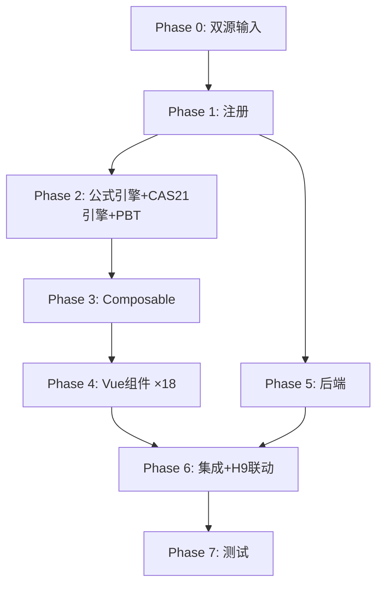

# Implementation Plan: H8 使用权资产底稿专属HTML精美组件

## Overview

H8使用权资产底稿专属组件`h8-right-of-use-assets`。CAS21核心底稿（20有效sheet/1 xlsx/~250+公式）。

主入口 GtH8RightOfUseAssets.vue（sheetName v-if + H8-6/H8-8双分支选择器，defineAsyncComponent lazy）+ 18个子组件 + 14个composable + 后端3个py文件。

科目：1901使用权资产（借方/资产类）+ 累计折旧（贷方/备抵类）
公式特征：CAS21初始计量=H9+直接费用-激励；折旧期=min(租赁期,寿命)；H9强联动

## Tasks

### Phase 0: 双源输入验证

- [ ] 0.1 openpyxl脚本读取H8使用权资产.xlsx全部20 sheet
  - 提取结构+验证含H8-6/H8-8各2分支
  - 产出：h8_structure_summary.json
  - _Requirements: 双源输入流程_

- [ ] 0.2 H固定资产循环底稿模板库md交叉验证
  - 核对：CAS21准则要求/H9联动关系/简化处理条件
  - 产出：h8_conflict_resolution.md
  - _Requirements: 双源输入流程_

### Phase 1: 注册+契约测试

- [ ] 1.1 注册componentType和映射
  - wp_code_overrides: H8/H8-1~H8-14/H8A → 'h8-right-of-use-assets'
  - VALID_COMPONENT_TYPES + htmlRendererRegistry注册
  - 创建 GtH8RightOfUseAssets.vue 骨架（sheetName v-if + 双分支 + selfLoad + H9联动状态）
  - _Requirements: 1.1-1.10_

- [ ] 1.2 编写注册契约测试
  - htmlRendererRegistry / VALID_COMPONENT_TYPES / wp_code_overrides / RENDERER_DISPATCH
  - _Requirements: 1.6, 1.7, 1.8_

### Phase 2: 公式引擎+PBT

- [ ] 2.1 创建 `useH8FormulaEngine.ts`
  - calcAuditedAmount / calcAssetEndBalance / calcContraEndBalance / calcNetValue / calcSubtotal
  - _Requirements: 2.3-2.4_

- [ ] 2.2 创建 `useH8CAS21Engine.ts`（核心）
  - calcInitialMeasurement / calcDepreciationPeriod / calcTerminationGainLoss
  - calcRemeasurement / isShortTermLease / isLowValueLease
  - _Requirements: 10.1-10.4, 8.2-8.3_

- [ ]* 2.3 编写 Property P1 PBT：审定数公式链
  - 断言：calcAuditedAmount(u, a, r) === u + a + r
  - **Feature: h8-right-of-use-assets, Property P1: 审定数公式链**

- [ ]* 2.4 编写 Property P2 PBT：资产类期末余额
  - 断言：calcAssetEndBalance(b, d, c) === b + d - c
  - **Feature: h8-right-of-use-assets, Property P2: 资产类期末余额**

- [ ]* 2.5 编写 Property P3 PBT：备抵类期末余额
  - 断言：calcContraEndBalance(b, d, c) === b + c - d
  - **Feature: h8-right-of-use-assets, Property P3: 备抵类期末余额**

- [ ]* 2.6 编写 Property P4 PBT：CAS21初始计量
  - 生成器：fc.float({min:0, max:1e9}) × 3 (leaseLiability, directCost, incentive)
  - 断言：calcInitialMeasurement(ll, dc, inc) === ll + dc - inc
  - **Feature: h8-right-of-use-assets, Property P4: CAS21初始计量公式**

- [ ]* 2.7 编写 Property P5 PBT：折旧期=min(租赁期,寿命)
  - 生成器：fc.integer({min:1, max:600}) × 2 (leaseTerm, usefulLife)
  - 断言：calcDepreciationPeriod(lt, ul) === Math.min(lt, ul)
  - **Feature: h8-right-of-use-assets, Property P5: 折旧期min公式**

- [ ]* 2.8 编写 Property P6 PBT：终止损益
  - 生成器：fc.float({min:0, max:1e9}) × 2
  - 断言：calcTerminationGainLoss(lb, nv) === lb - nv
  - **Feature: h8-right-of-use-assets, Property P6: 终止损益**

- [ ]* 2.9 编写 Property P7 PBT：短期租赁判断
  - 生成器：fc.integer({min:1, max:36})
  - 断言：isShortTermLease(m) === (m <= 12)
  - **Feature: h8-right-of-use-assets, Property P7: 短期租赁判断**

- [ ]* 2.10 编写 Property P8 PBT：低价值租赁判断
  - 生成器：fc.float({min:1, max:100000})
  - 断言：isLowValueLease(v) === (v <= 40000)
  - **Feature: h8-right-of-use-assets, Property P8: 低价值租赁判断**

- [ ]* 2.11 编写 Property P9 PBT：合计行恒等
  - 断言：calcSubtotal(arr) === Σarr
  - **Feature: h8-right-of-use-assets, Property P9: 合计行恒等**

- [ ]* 2.12 编写 Property P10 PBT：净值公式
  - 断言：calcNetValue(c, d, i) === c - d - i
  - **Feature: h8-right-of-use-assets, Property P10: 净值公式**

### Phase 3: Composable层

- [ ] 3.1 创建 useH8FormData.ts
  - selfLoad + checklist_responses + writebackTB(1901+累计折旧)
  - _Requirements: 1.9, 1.10, 2.7_

- [ ] 3.2 创建 useH8CrossSheet.ts
  - adjudicationVsDetail / h8VsH9Linkage / depreciationVsAdjudication
  - _Requirements: 2.5, 2.6, 6.6, 11.1-11.4_

- [ ] 3.3 创建 useH8DualMode.ts + useH8ImportExport.ts
  - 双模式切换 + 导入导出三级
  - _Requirements: 3.3_

- [ ] 3.4 创建 sheet-specific composables（10个）
  - useH8Adjudication / useH8Detail / useH8Adjustment
  - useH8LeaseIdentification / useH8LeaseTerm / useH8LeaseModification
  - useH8Measurement / useH8Depreciation / useH8DisposalCheck / useH8SimplifiedCheck
  - _Requirements: 2~9 全部_

### Phase 4: Vue子组件

- [ ] 4.1 创建 H8TabIndex.vue 底稿目录
  - 20行+进度条+H9联动状态指示
  - _Requirements: 1.2_

- [ ] 4.2 创建 H8TabAdjudication.vue 审定表H8-1
  - 双区块51公式+H9联动校验区域+TB回写
  - _Requirements: 2.1-2.8, 11.1-11.4_

- [ ] 4.3 创建 H8TabDetail.vue + H8TabAdjustment.vue
  - 明细58列4区段(含初始计量公式) + 调整10列
  - _Requirements: 3.1-3.4_

- [ ] 4.4 创建 H8TabLeaseIdentification/LeaseTerm/LeaseModification.vue
  - 租赁识别90行段落 + 租赁期52行段落 + 变更100行表格
  - _Requirements: 4.1-4.5_

- [ ] 4.5 创建 H8TabMeasurementAnnual/Monthly.vue
  - H8-6分支选择器 + OO渲染 + CAS21公式说明
  - _Requirements: 5.1-5.6_

- [ ] 4.6 创建 H8TabDepreciationNoImpair/WithImpair.vue + H8TabDepreciationAlloc.vue
  - H8-8分支选择器 + OO + 折旧分配
  - _Requirements: 6.1-6.6_

- [ ] 4.7 创建 H8TabImpairment.vue + H8TabRecoverable.vue
  - 减值OO + DCF OO
  - _Requirements: 7.1-7.2_

- [ ] 4.8 创建 H8TabDisposalCheck.vue
  - 28列租赁终止+终止损益计算+H9同步
  - _Requirements: 7.3-7.5_

- [ ] 4.9 创建 H8TabSimplifiedCheck.vue
  - 18列+短期/低价值自动判断+统计摘要+不合规高亮
  - _Requirements: 8.1-8.4_

- [ ] 4.10 创建 H8TabRelatedParty.vue + H8TabDisclosure(Listed/Soe).vue
  - 关联15列 + 附注
  - _Requirements: 9.1, 1.2_

### Phase 5: 后端

- [ ] 5.1 创建 h8_right_of_use_assets_renderer.py
  - RENDERER_DISPATCH注册 + CAS21验证逻辑
  - _Requirements: 1.6_

- [ ] 5.2 创建 h8_right_of_use_assets.py 路由（3端点）
  - 导出模板/导出数据/导入数据
  - _Requirements: 3.3_

- [ ] 5.3 创建 h8_right_of_use_assets_service.py
  - CAS21计量验证 + H9联动验证 + 简化处理判断
  - _Requirements: 10.1-10.4, 11.1-11.4_

### Phase 6: 集成

- [ ] 6.1 EventBus集成
  - publish 'substantive:adjudicated' / 'adjustment:created'
  - subscribe H9 lease liability updates
  - bidirectional H8↔H9 linkage
  - _Requirements: 9.2-9.4, 11.1-11.4_

- [ ] 6.2 跨底稿联动
  - H8-2每笔租赁 ↔ H9对应摊销行 GtIndexChip
  - H8-12终止 → H9同步终止
  - H8-1审定 → TB回写
  - _Requirements: 9.4, 7.5, 2.7_

### Phase 7: 测试

- [ ] 7.1 单元测试：useH8FormulaEngine + useH8CAS21Engine
  - CAS21核心公式 + 简化判断 + 终止损益
  - _Requirements: P1-P10_

- [ ] 7.2 集成测试：H8-H9联动
  - 初始计量一致性 / 终止同步 / 合同配对
  - _Requirements: 11.1-11.4_

- [ ] 7.3 Playwright E2E
  - 完整流程：打开H8→审定→初始计量(切分支)→折旧→简化检查→H9联动验证→保存
  - _Requirements: 全部_

## Task Dependency Graph

