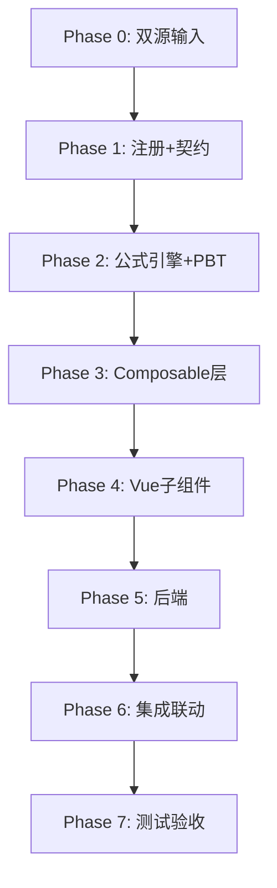

# Implementation Plan: I1 无形资产、累计摊销及减值准备底稿专属HTML精美组件

## Overview

I1无形资产底稿专属组件`i1-intangible-assets`。I循环最大单底稿（18有效sheet/1 xlsx/~200+公式）。

主入口 GtI1IntangibleAssets.vue（sheetName v-if分发，defineAsyncComponent lazy）+ 14个子组件 + 14个composable + 后端4个py文件。

科目：1701无形资产（借方/资产类）+ 1702累计摊销（贷方/备抵类）+ 1703减值准备（贷方/备抵类）
公式特征：期末=期初+借方-贷方（资产类）；期末=期初+贷方-借方（备抵类）；审定=未审+AJE+RJE；三角勾稽；净值=原值-摊销-减值

## Task Dependency Graph

## Tasks

### Phase 0: 双源输入验证

- [ ] 0.1 openpyxl脚本读取I1无形资产.xlsx全部18 sheet
  - 提取：sheet名/列头/行数/公式单元格/合并区域/数据类型
  - 产出：i1_structure_summary.json
  - 验证：18 sheet结构与本spec描述一致
  - _Requirements: 双源输入流程_

- [ ] 0.2 I无形资产循环底稿模板库md交叉验证
  - 核对：审计目标/程序清单/联动关系/认定对应/交叉引用
  - 冲突解决：列名以xlsx为准，联动方向以md为准
  - 产出：i1_conflict_resolution.md（如有冲突）
  - _Requirements: 双源输入流程_

### Phase 1: 注册+契约测试

- [ ] 1.1 注册componentType和映射
  - wp_code_overrides: I1/I1-2~I1-13/I1A → 'i1-intangible-assets'
  - VALID_COMPONENT_TYPES + htmlRendererRegistry注册
  - 创建 GtI1IntangibleAssets.vue 骨架（sheetName v-if + selfLoad）
  - _Requirements: 1.1-1.10_

- [ ] 1.2 编写注册契约测试
  - htmlRendererRegistry / VALID_COMPONENT_TYPES / wp_code_overrides / RENDERER_DISPATCH
  - _Requirements: 1.6, 1.7, 1.8_

### Phase 2: 公式引擎+PBT

- [ ] 2.1 创建 `composables/useI1FormulaEngine.ts`，实现全部纯函数
  - calcAuditedAmount / calcAssetEndBalance / calcContraEndBalance
  - calcTriangleReconciliation / calcNetValue / calcChangeRate
  - calcSubtotal / calcProportion / calcDisposalGainLoss / calcTitleDiff
  - _Requirements: 2.3-2.8, 3.3, 7.2, 9.3, 10.2_

- [ ] 2.2 创建 `composables/useI1AmortizationEngine.ts`，实现摊销纯函数
  - calcStraightLineAmort / calcRemainingLifeAmort / calcAmortWithImpairment
  - calcDcfPresentValue / calcTerminalValue / calcRecoverableAmount / calcImpairmentAmount
  - _Requirements: 11.4-11.5, 12.2, 13.2-13.3_

- [ ]* 2.3 编写 Property P1 PBT：审定数公式链
  - 生成器：fc.float({min:-1e9, max:1e9}) × 3
  - 断言：calcAuditedAmount(u, a, r) === u + a + r
  - **Feature: i1-intangible-assets, Property P1: 审定数公式链正确性**

- [ ]* 2.4 编写 Property P2 PBT：资产类期末余额
  - 生成器：fc.float({min:0, max:1e9}) × 3
  - 断言：calcAssetEndBalance(b, d, c) === b + d - c
  - **Feature: i1-intangible-assets, Property P2: 资产类期末余额（借方科目1701）**

- [ ]* 2.5 编写 Property P3 PBT：备抵类期末余额
  - 生成器：fc.float({min:0, max:1e9}) × 3
  - 断言：calcContraEndBalance(b, d, c) === b + c - d
  - **Feature: i1-intangible-assets, Property P3: 备抵类期末余额（贷方科目1702/1703）**

- [ ]* 2.6 编写 Property P4 PBT：三角勾稽恒等式
  - 生成器：fc.float({min:0, max:1e9}) × 3, end=begin+increase-decrease
  - 断言：calcTriangleReconciliation(b, i, d, b+i-d) === 0
  - **Feature: i1-intangible-assets, Property P4: 三角勾稽恒等式**

- [ ]* 2.7 编写 Property P5 PBT：合计行恒等
  - 生成器：fc.array(fc.float, {minLength:1, maxLength:50})
  - 断言：calcSubtotal(arr) === arr.reduce((a,b)=>a+b, 0)
  - **Feature: i1-intangible-assets, Property P5: 合计行恒等于明细行之和**

- [ ]* 2.8 编写 Property P6 PBT：直线法摊销
  - 生成器：cost>0, salvage∈[0,cost), months>0
  - 断言：calcStraightLineAmort(cost, salvage, months) === (cost-salvage)/months
  - **Feature: i1-intangible-assets, Property P6: 直线法月摊销正确性**

- [ ]* 2.9 编写 Property P7 PBT：剩余年限法摊销（含减值）
  - 生成器：cost>accAmort+impairment, remainingMonths>0
  - 断言：calcAmortWithImpairment(cost, salvage, accAmort, impairment, rem) === (cost-salvage-accAmort-impairment)/rem
  - **Feature: i1-intangible-assets, Property P7: 剩余年限法摊销（含减值重算基数）**

- [ ]* 2.10 编写 Property P8 PBT：DCF现值计算
  - 生成器：fc.array(fc.float({min:1, max:1e6}), {minLength:1, maxLength:10}), r>0
  - 断言：calcDcfPresentValue(cfs, r) === Σ(cf_i/(1+r)^(i+1))
  - **Feature: i1-intangible-assets, Property P8: DCF现值计算正确性**

- [ ]* 2.11 编写 Property P9 PBT：可收回金额MAX选取
  - 生成器：fc.float × 2
  - 断言：calcRecoverableAmount(fv, dcf) === Math.max(fv, dcf)
  - **Feature: i1-intangible-assets, Property P9: 可收回金额=MAX(公允-处置费, DCF)**

- [ ]* 2.12 编写 Property P10 PBT：减值金额非负且≤账面
  - 生成器：bookValue>0, recoverable≥0
  - 断言：calcImpairmentAmount(bv, ra) ∈ [0, bv]
  - **Feature: i1-intangible-assets, Property P10: 减值金额∈[0, 账面净值]**

- [ ]* 2.13 编写 Property P11 PBT：摊销分配合计=总额
  - 生成器：分配比例数组(归一化) + total>0
  - 断言：各部门分配额之和 === total（精度0.01）
  - **Feature: i1-intangible-assets, Property P11: 摊销分配合计=摊销总额**

- [ ]* 2.14 编写 Property P12 PBT：借贷平衡
  - 生成器：entries[]{debit, credit}
  - 断言：isBalanced === (Σdebit === Σcredit)
  - **Feature: i1-intangible-assets, Property P12: 借贷平衡检查**

### Phase 3: Composable层

- [ ] 3.1 创建 useI1FormData.ts
  - allResponses Map加载 + selfLoad + writebackTB(1701+1702+1703)
  - _Requirements: 1.9, 2.10_

- [ ] 3.2 创建 useI1CrossSheet.ts
  - detailTotals / adjudicationFromDetail / amortizationForAlloc / disclosureAutoFill
  - _Requirements: 2.4-2.9, 10.2, 11.7_

- [ ] 3.3 创建 useI1Adjudication.ts
  - 三区块固定行 + 三角勾稽 + TB取数行
  - _Requirements: 2.1-2.11_

- [ ] 3.4 创建 useI1Detail.ts
  - 4区段Tab + 行同步 + 合计行 + 交叉验证
  - _Requirements: 3.1-3.7_

- [ ] 3.5 创建 useI1Amortization.ts
  - 分支选择器状态 + 摊销矩阵计算
  - _Requirements: 11.1-11.7_

- [ ] 3.6 创建 useI1Impairment.ts
  - 减值测试+DCF+可收回金额联动
  - _Requirements: 12.1-12.4, 13.1-13.5_

- [ ] 3.7 创建 useI1Disclosure.ts + useI1ImportExport.ts + useI1DualMode.ts
  - _Requirements: 14.1-14.4_

### Phase 4: Vue子组件

- [ ] 4.1 创建 I1TabIndex.vue（底稿目录+进度）
- [ ] 4.2 创建 I1TabAdjudication.vue（三区块审定表+51公式）
- [ ] 4.3 创建 I1TabDetail.vue（56列4区段Tab）
- [ ] 4.4 创建 I1TabAdjustment.vue（调整分录）
- [ ] 4.5 创建 I1TabPolicyCheck.vue（摊销减值政策段落型）
- [ ] 4.6 创建 I1TabAdditionCheck.vue（增加检查+OCR+抽凭）
- [ ] 4.7 创建 I1TabDisposalCheck.vue（减少明细）
- [ ] 4.8 创建 I1TabUsefulLifeCheck.vue（使用寿命检查）
- [ ] 4.9 创建 I1TabTitleCheck.vue（权属检查94行+虚拟滚动）
- [ ] 4.10 创建 I1TabAmortizationAlloc.vue（摊销分配7公式）
- [ ] 4.11 创建 I1TabAmortizationNoImpair.vue（I1-10, 30公式）
- [ ] 4.12 创建 I1TabAmortizationWithImpair.vue（I1-11, 63公式）
- [ ] 4.13 创建 I1TabImpairmentTest.vue（减值测试14公式）
- [ ] 4.14 创建 I1TabRecoverableTest.vue（DCF可收回金额10公式）
- [ ] 4.15 创建 I1TabDisclosureListed.vue + I1TabDisclosureSoe.vue（附注双版本）

### Phase 5: 后端

- [ ] 5.1 创建 _i1_intangible_assets.py render策略 + RENDERER_DISPATCH注册
- [ ] 5.2 创建 _i1_import_export.py 导入导出3端点
- [ ] 5.3 创建 _i1_ai_generate.py AI生成端点
- [ ] 5.4 创建 _i1_amortization_engine.py 摊销引擎验证端点
- [ ] 5.5 更新 wp_render_schema: i1-intangible-assets.yaml

### Phase 6: 集成联动

- [ ] 6.1 EventBus集成：TB回写(1701+1702+1703) + substantive:adjudicated
- [ ] 6.2 EventBus集成：adjustment:created → A13同步
- [ ] 6.3 cross_wp_references: I2资本化转入→I1-5增加
- [ ] 6.4 cross_wp_references: I1-9摊销分配→K8/K9/I6
- [ ] 6.5 GtIndexChip跳转：I1→I2/K8/K9/I6/A13
- [ ] 6.6 附注EventBus：disclosure:note-text-updated
- [ ] 6.7 双模式OO集成 + 健康检查

### Phase 7: 测试验收

- [ ] 7.1 Vitest单元测试：useI1FormulaEngine全函数覆盖
- [ ] 7.2 Vitest单元测试：useI1AmortizationEngine全函数覆盖
- [ ] 7.3 Vitest组件测试：GtI1IntangibleAssets sheetName分发
- [ ] 7.4 后端pytest：render策略+导入导出+摊销验证
- [ ] 7.5 Playwright E2E：审定表编辑→三角勾稽→TB回写全链路
- [ ] 7.6 Playwright E2E：摊销分支切换→计算→分配联动
