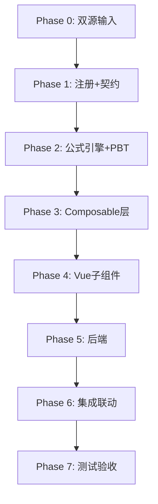

# Implementation Plan: I2 开发支出底稿专属HTML精美组件

## Overview

I2开发支出底稿专属组件`i2-development-expenditure`。I循环最大sheet数底稿（21有效sheet/1 xlsx/~150+公式）。

主入口 GtI2DevelopmentExpenditure.vue（sheetName v-if分发）+ 18个子组件 + 13个composable + 后端4个py文件。

科目：1717开发支出（借方/资产类）
公式特征：资产类期末=期初+借方-贷方；审定=未审+AJE+RJE；CAS6五条件逻辑判断；I6↔I2双向联动校验

## Task Dependency Graph

## Tasks

### Phase 0: 双源输入验证

- [ ] 0.1 openpyxl脚本读取I2开发支出.xlsx全部21 sheet
  - 产出：i2_structure_summary.json
  - _Requirements: 双源输入流程_

- [ ] 0.2 底稿模板库md交叉验证
  - 核对CAS6五条件/I6联动/I1转入
  - _Requirements: 双源输入流程_

### Phase 1: 注册+契约测试

- [ ] 1.1 注册componentType和映射
  - wp_code_overrides: I2/I2-1~I2-16/I2A → 'i2-development-expenditure'
  - VALID_COMPONENT_TYPES + htmlRendererRegistry + GtI2DevelopmentExpenditure.vue骨架
  - _Requirements: 1.1-1.10_

- [ ] 1.2 编写注册契约测试
  - _Requirements: 1.6-1.8_

### Phase 2: 公式引擎+PBT

- [ ] 2.1 创建 useI2FormulaEngine.ts
  - calcAuditedAmount / calcAssetEndBalance / calcTriangleReconciliation
  - calcNetValue / calcSubtotal / calcChangeRate / calcVarianceFromExpected
  - _Requirements: 2.2-2.5, 4.2_

- [ ] 2.2 创建 useI2CapitalizationEngine.ts
  - evaluateCapitalization / calcResearchTotal / validateResearchSplit
  - _Requirements: 5.1-5.8, 9.1-9.5_

- [ ]* 2.3 编写 Property P1 PBT：审定数公式链
  - 断言：calcAuditedAmount(u, a, r) === u + a + r
  - **Feature: i2-development-expenditure, Property P1: 审定数公式链**

- [ ]* 2.4 编写 Property P2 PBT：资产类期末余额
  - 断言：calcAssetEndBalance(b, d, c) === b + d - c
  - **Feature: i2-development-expenditure, Property P2: 资产类期末余额（1717）**

- [ ]* 2.5 编写 Property P3 PBT：三角勾稽恒等式
  - 断言：calcTriangleReconciliation(b, i, d, b+i-d) === 0
  - **Feature: i2-development-expenditure, Property P3: 三角勾稽恒等式**

- [ ]* 2.6 编写 Property P4 PBT：CAS6五条件逻辑
  - 生成器：5个条件随机yes/no/na
  - 断言：全yes→isMet=true；任一no→isMet=false；na不影响
  - **Feature: i2-development-expenditure, Property P4: CAS6五条件逻辑正确性**

- [ ]* 2.7 编写 Property P5 PBT：研发总额=费用化+资本化
  - 生成器：expense≥0, capitalized≥0
  - 断言：calcResearchTotal(e, c) === e + c
  - **Feature: i2-development-expenditure, Property P5: 研发总额=费用化+资本化**

- [ ]* 2.8 编写 Property P6 PBT：合计行恒等
  - 断言：calcSubtotal(arr) === Σarr
  - **Feature: i2-development-expenditure, Property P6: 合计行恒等**

- [ ]* 2.9 编写 Property P7 PBT：借贷平衡
  - 断言：isBalanced === (Σdebit === Σcredit)
  - **Feature: i2-development-expenditure, Property P7: 借贷平衡**

- [ ]* 2.10 编写 Property P8 PBT：减值金额∈[0,账面]
  - 断言：impairment ∈ [0, bookValue]
  - **Feature: i2-development-expenditure, Property P8: 减值金额非负且≤账面**

- [ ]* 2.11 编写 Property P9 PBT：截止测试日期差
  - 生成器：记账日/单据日随机
  - 断言：|记账日-单据日|≤阈值 → 不跨期
  - **Feature: i2-development-expenditure, Property P9: 截止测试日期差判断**

- [ ]* 2.12 编写 Property P10 PBT：转入I1金额一致性
  - 生成器：转入明细数组
  - 断言：sum(transfers) === auditTableTransferColumn
  - **Feature: i2-development-expenditure, Property P10: 转入I1金额=审定表转无形列**

### Phase 3: Composable层

- [ ] 3.1 创建 useI2FormData.ts（selfLoad + writebackTB 1717）
- [ ] 3.2 创建 useI2CrossSheet.ts（I6联动 + I1转入 + 明细聚合）
- [ ] 3.3 创建 useI2Adjudication.ts（三角勾稽 + TB）
- [ ] 3.4 创建 useI2Detail.ts（61列4区段）
- [ ] 3.5 创建 useI2Analysis.ts（31公式实质性分析）
- [ ] 3.6 创建 useI2Cutoff.ts（截止双向 + autoSampling）
- [ ] 3.7 创建 useI2Impairment.ts + useI2Disclosure.ts + useI2ImportExport.ts + useI2DualMode.ts

### Phase 4: Vue子组件

- [ ] 4.1 创建 I2TabIndex.vue
- [ ] 4.2 创建 I2TabAdjudication.vue（61公式）
- [ ] 4.3 创建 I2TabDetail.vue（61列4区段）
- [ ] 4.4 创建 I2TabAdjustment.vue
- [ ] 4.5 创建 I2TabAnalysis.vue（31公式）
- [ ] 4.6 创建 I2TabCapitalization.vue（CAS6五条件核心！66列）
- [ ] 4.7 创建 I2TabProjectDetail.vue（73列5区段）
- [ ] 4.8 创建 I2TabMaterialCheck.vue + I2TabStaffCheck.vue + I2TabWorkHourCheck.vue + I2TabOutsourceCheck.vue
- [ ] 4.9 创建 I2TabTargetedCheck.vue
- [ ] 4.10 创建 I2TabCutoffForward.vue + I2TabCutoffBackward.vue
- [ ] 4.11 创建 I2TabImpairment.vue + I2TabRecoverable.vue
- [ ] 4.12 创建 I2TabDisclosureListed.vue + I2TabDisclosureSoe.vue

### Phase 5: 后端

- [ ] 5.1 创建 _i2_development_expenditure.py render策略 + RENDERER_DISPATCH
- [ ] 5.2 创建 _i2_import_export.py 导入导出3端点
- [ ] 5.3 创建 _i2_ai_generate.py AI生成（含CAS6建议）
- [ ] 5.4 创建 _i2_capitalization_engine.py 资本化判断端点
- [ ] 5.5 更新 wp_render_schema: i2-development-expenditure.yaml

### Phase 6: 集成联动

- [ ] 6.1 EventBus: TB回写(1717) + substantive:adjudicated
- [ ] 6.2 EventBus: I6↔I2双向联动（research:expense-updated / development:capitalized-updated）
- [ ] 6.3 EventBus: I2→I1转入（development:capitalized-to-intangible）
- [ ] 6.4 cross_wp_references: I2↔I6双向 + I2→I1-5
- [ ] 6.5 GtIndexChip: I2→I6/I1/A13
- [ ] 6.6 截止测试useCutoffAutoSampling集成
- [ ] 6.7 附注EventBus + 双模式OO

### Phase 7: 测试验收

- [ ] 7.1 Vitest: useI2FormulaEngine + useI2CapitalizationEngine
- [ ] 7.2 Vitest组件: sheetName分发 + CAS6面板交互
- [ ] 7.3 后端pytest: render+导入导出+资本化判断
- [ ] 7.4 Playwright E2E: CAS6五条件判断全流程
- [ ] 7.5 Playwright E2E: I6↔I2联动校验
