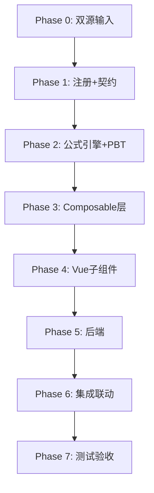

# Implementation Plan: I3 商誉底稿专属HTML精美组件

## Overview

I3商誉底稿专属组件`i3-goodwill`。I循环DCF核心底稿（15有效sheet/1 xlsx/~120+公式）。

主入口 GtI3Goodwill.vue（sheetName v-if分发）+ 11个子组件 + 11个composable + 后端4个py文件。

科目：1711商誉（借方/资产类，**不摊销！**仅年度减值测试）
公式特征：期末=期初+新并购-减值（不摊销）；DCF现值；减值先冲商誉再分摊；审定=未审+AJE+RJE

## Task Dependency Graph

## Tasks

### Phase 0: 双源输入验证

- [ ] 0.1 openpyxl脚本读取I3商誉.xlsx全部15 sheet
  - 确认1个历史遗留sheet已被regex skip
  - 产出：i3_structure_summary.json
  - _Requirements: 双源输入流程_

- [ ] 0.2 底稿模板库md交叉验证
  - 核对DCF模型/CGU分摊/减值分摊规则
  - _Requirements: 双源输入流程_

### Phase 1: 注册+契约测试

- [ ] 1.1 注册componentType和映射
  - wp_code_overrides: I3/I3-1~I3-8/I3A → 'i3-goodwill'
  - VALID_COMPONENT_TYPES + htmlRendererRegistry + GtI3Goodwill.vue骨架
  - _Requirements: 1.1-1.10_

- [ ] 1.2 编写注册契约测试
  - _Requirements: 1.6-1.8_

### Phase 2: 公式引擎+PBT

- [ ] 2.1 创建 useI3FormulaEngine.ts（商誉不摊销！）
  - calcAuditedAmount / calcGoodwillEndBalance / calcGoodwillNetValue
  - calcInitialGoodwill / calcSubtotal / calcImpairmentAllocation
  - _Requirements: 2.2-2.7, 4.2, 5.2-5.4_

- [ ] 2.2 创建 useI3DcfEngine.ts
  - calcDcfPresentValue / calcTerminalValue / calcWacc
  - calcRecoverableAmount / calcSensitivity
  - _Requirements: 6.2-6.5_

- [ ]* 2.3 编写 Property P1 PBT：审定数公式链
  - 断言：calcAuditedAmount(u, a, r) === u + a + r
  - **Feature: i3-goodwill, Property P1: 审定数公式链**

- [ ]* 2.4 编写 Property P2 PBT：商誉期末余额（不摊销！）
  - 生成器：begin≥0, newAcq≥0, impairment∈[0, begin+newAcq]
  - 断言：calcGoodwillEndBalance(b, n, i) === b + n - i
  - **Feature: i3-goodwill, Property P2: 商誉期末=期初+新并购-减值（不摊销）**

- [ ]* 2.5 编写 Property P3 PBT：初始商誉=合并成本-净资产公允
  - 生成器：mergerCost > netAssetFV
  - 断言：calcInitialGoodwill(mc, nafv) === mc - nafv
  - **Feature: i3-goodwill, Property P3: 初始商誉=合并成本-可辨认净资产公允**

- [ ]* 2.6 编写 Property P4 PBT：减值先冲商誉
  - 生成器：totalImpairment>0, goodwillAmount>0, otherAssets[]
  - 断言：goodwillImpairment === MIN(total, goodwill)；剩余按比例分摊
  - **Feature: i3-goodwill, Property P4: 减值先冲商誉再分摊**

- [ ]* 2.7 编写 Property P5 PBT：DCF现值计算
  - 断言：calcDcfPresentValue(cfs, r) === Σ(cf/(1+r)^(i+1))
  - **Feature: i3-goodwill, Property P5: DCF现值计算正确性**

- [ ]* 2.8 编写 Property P6 PBT：可收回金额MAX
  - 断言：calcRecoverableAmount(fv, dcf) === Math.max(fv, dcf)
  - **Feature: i3-goodwill, Property P6: 可收回金额=MAX(公允-处置费, DCF)**

- [ ]* 2.9 编写 Property P7 PBT：减值金额非负且≤资产组账面
  - 断言：impairment ∈ [0, cguBookValue]
  - **Feature: i3-goodwill, Property P7: 减值金额∈[0, 资产组账面]**

- [ ]* 2.10 编写 Property P8 PBT：合计行恒等
  - 断言：calcSubtotal(arr) === Σarr
  - **Feature: i3-goodwill, Property P8: 合计行恒等**

### Phase 3: Composable层

- [ ] 3.1 创建 useI3FormData.ts（selfLoad + writebackTB 1711）
- [ ] 3.2 创建 useI3CrossSheet.ts（明细聚合 + 减值联动）
- [ ] 3.3 创建 useI3Adjudication.ts（商誉不摊销审定逻辑）
- [ ] 3.4 创建 useI3Detail.ts（30列3区段）
- [ ] 3.5 创建 useI3Impairment.ts（CGU分摊+先冲商誉逻辑）
- [ ] 3.6 创建 useI3Disclosure.ts + useI3ImportExport.ts + useI3DualMode.ts

### Phase 4: Vue子组件

- [ ] 4.1 创建 I3TabIndex.vue
- [ ] 4.2 创建 I3TabAdjudication.vue（66公式，不摊销！）
- [ ] 4.3 创建 I3TabDetail.vue（30列3区段）
- [ ] 4.4 创建 I3TabAdjustment.vue
- [ ] 4.5 创建 I3TabInitialValue.vue（入账测算12公式）
- [ ] 4.6 创建 I3TabTargetedCheck.vue
- [ ] 4.7 创建 I3TabImpairmentTest.vue（CGU分摊）
- [ ] 4.8 创建 I3TabRecoverableTest.vue（DCF核心100×16+虚拟滚动）
- [ ] 4.9 创建 I3TabReviewProcess.vue（153行大表+虚拟滚动）
- [ ] 4.10 创建 I3TabDisclosureListed.vue + I3TabDisclosureSoe.vue

### Phase 5: 后端

- [ ] 5.1 创建 _i3_goodwill.py render策略 + RENDERER_DISPATCH
- [ ] 5.2 创建 _i3_import_export.py 导入导出3端点
- [ ] 5.3 创建 _i3_ai_generate.py AI生成（DCF参数建议）
- [ ] 5.4 创建 _i3_dcf_engine.py DCF引擎验证端点
- [ ] 5.5 更新 wp_render_schema: i3-goodwill.yaml

### Phase 6: 集成联动

- [ ] 6.1 EventBus: TB回写(1711) + substantive:adjudicated
- [ ] 6.2 EventBus: adjustment:created → A13
- [ ] 6.3 GtIndexChip: I3-6→I3-7 DCF跳转
- [ ] 6.4 附注EventBus + 双模式OO
- [ ] 6.5 _should_skip_historical_sheet回归验证（I3历史遗留1sheet）

### Phase 7: 测试验收

- [ ] 7.1 Vitest: useI3FormulaEngine + useI3DcfEngine
- [ ] 7.2 Vitest组件: sheetName分发
- [ ] 7.3 后端pytest: render+DCF验证+导入导出
- [ ] 7.4 Playwright E2E: DCF测算→减值分摊→审定表全链路
