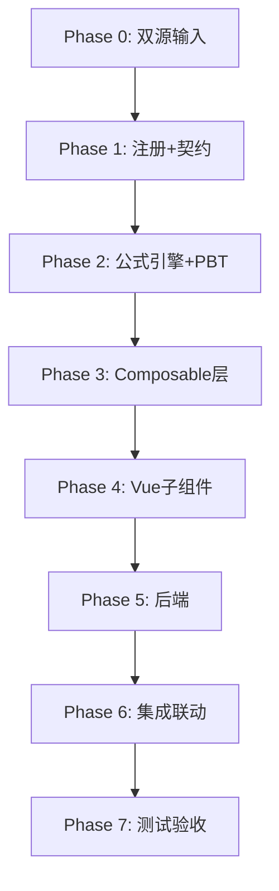

# Implementation Plan: I4 长期待摊费用底稿专属HTML精美组件

## Overview

I4长期待摊费用底稿专属组件`i4-long-term-prepaid`。标准资产类（12有效sheet/1 xlsx/~100+公式）。

主入口 GtI4LongTermPrepaid.vue（sheetName v-if分发）+ 10个子组件 + 9个composable + 后端3个py文件。

科目：1801长期待摊费用（借方/资产类）
公式特征：期末=期初+增加-摊销-减少；审定=未审+AJE+RJE；摊销2方法分支

## Task Dependency Graph

## Tasks

### Phase 0: 双源输入验证

- [ ] 0.1 openpyxl脚本读取I4长期待摊费用.xlsx全部12 sheet
  - 产出：i4_structure_summary.json
  - _Requirements: 双源输入流程_

- [ ] 0.2 底稿模板库md交叉验证
  - _Requirements: 双源输入流程_

### Phase 1: 注册+契约测试

- [ ] 1.1 注册componentType和映射
  - wp_code_overrides: I4/I4-1~I4-7/I4A → 'i4-long-term-prepaid'
  - VALID_COMPONENT_TYPES + htmlRendererRegistry + GtI4LongTermPrepaid.vue骨架
  - _Requirements: 1.1-1.10_

- [ ] 1.2 编写注册契约测试
  - _Requirements: 1.6-1.8_

### Phase 2: 公式引擎+PBT

- [ ] 2.1 创建 useI4FormulaEngine.ts
  - calcAuditedAmount / calcAssetEndBalance / calcTriangleReconciliation / calcSubtotal
  - _Requirements: 2.2-2.5_

- [ ] 2.2 创建 useI4AmortizationEngine.ts
  - calcStraightLineAmort / calcUnitsOfProductionAmort / calcRemainingMonths / calcAmortizationRate
  - _Requirements: 6.4-6.5_

- [ ]* 2.3 编写 Property P1 PBT：审定数公式链
  - 断言：calcAuditedAmount(u, a, r) === u + a + r
  - **Feature: i4-long-term-prepaid, Property P1: 审定数公式链**

- [ ]* 2.4 编写 Property P2 PBT：期末余额
  - 生成器：begin≥0, increase≥0, amort≥0, decrease≥0
  - 断言：calcAssetEndBalance(b, i, a, d) === b + i - a - d
  - **Feature: i4-long-term-prepaid, Property P2: 期末=期初+增加-摊销-减少**

- [ ]* 2.5 编写 Property P3 PBT：直线法摊销
  - 生成器：amount>0, months>0
  - 断言：calcStraightLineAmort(amount, months) === amount/months
  - **Feature: i4-long-term-prepaid, Property P3: 直线法月摊销=金额÷总月数**

- [ ]* 2.6 编写 Property P4 PBT：工作量法摊销
  - 生成器：amount>0, currentUnits≥0, totalUnits>0
  - 断言：calcUnitsOfProductionAmort(a, cu, tu) === a × (cu/tu)
  - **Feature: i4-long-term-prepaid, Property P4: 工作量法摊销正确性**

- [ ]* 2.7 编写 Property P5 PBT：合计行恒等
  - 断言：calcSubtotal(arr) === Σarr
  - **Feature: i4-long-term-prepaid, Property P5: 合计行恒等**

- [ ]* 2.8 编写 Property P6 PBT：借贷平衡
  - 断言：Σdebit === Σcredit
  - **Feature: i4-long-term-prepaid, Property P6: 借贷平衡**

### Phase 3: Composable层

- [ ] 3.1 创建 useI4FormData.ts（selfLoad + writebackTB 1801）
- [ ] 3.2 创建 useI4CrossSheet.ts（明细聚合 + 摊销联动）
- [ ] 3.3 创建 useI4Adjudication.ts（三角勾稽 + TB）
- [ ] 3.4 创建 useI4Detail.ts（25列3区段）
- [ ] 3.5 创建 useI4Disclosure.ts + useI4ImportExport.ts + useI4DualMode.ts

### Phase 4: Vue子组件

- [ ] 4.1 创建 I4TabIndex.vue
- [ ] 4.2 创建 I4TabAdjudication.vue（47公式）
- [ ] 4.3 创建 I4TabDetail.vue（25列3区段）
- [ ] 4.4 创建 I4TabAdjustment.vue
- [ ] 4.5 创建 I4TabPolicyCheck.vue
- [ ] 4.6 创建 I4TabTargetedCheck.vue
- [ ] 4.7 创建 I4TabAmortizationStraight.vue（39公式）
- [ ] 4.8 创建 I4TabAmortizationUnits.vue（21公式）
- [ ] 4.9 创建 I4TabDisclosureListed.vue + I4TabDisclosureSoe.vue

### Phase 5: 后端

- [ ] 5.1 创建 _i4_long_term_prepaid.py render策略 + RENDERER_DISPATCH
- [ ] 5.2 创建 _i4_import_export.py 导入导出3端点
- [ ] 5.3 创建 _i4_ai_generate.py AI生成
- [ ] 5.4 更新 wp_render_schema: i4-long-term-prepaid.yaml

### Phase 6: 集成联动

- [ ] 6.1 EventBus: TB回写(1801) + substantive:adjudicated
- [ ] 6.2 EventBus: adjustment:created → A13
- [ ] 6.3 附注EventBus + 双模式OO
- [ ] 6.4 GtIndexChip跳转

### Phase 7: 测试验收

- [ ] 7.1 Vitest: useI4FormulaEngine + useI4AmortizationEngine
- [ ] 7.2 Vitest组件: sheetName分发 + 分支选择器
- [ ] 7.3 后端pytest: render+导入导出
- [ ] 7.4 Playwright E2E: 摊销分支切换+计算验证
