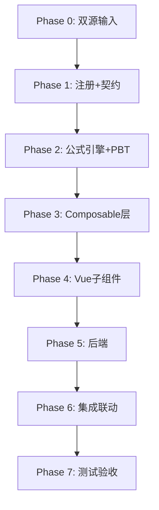

# Implementation Plan: I5 其他非流动资产底稿专属HTML精美组件

## Overview

I5其他非流动资产底稿专属组件`i5-other-noncurrent-assets`。I循环最简单底稿（9有效sheet/1 xlsx/~80+公式）。

主入口 GtI5OtherNoncurrentAssets.vue（sheetName v-if分发）+ 7个子组件 + 8个composable + 后端3个py文件。

科目：1911其他非流动资产（借方/资产类）
公式特征：标准资产类期末=期初+增加-减少；审定=未审+AJE+RJE；三角勾稽

## Task Dependency Graph

## Tasks

### Phase 0: 双源输入验证

- [ ] 0.1 openpyxl脚本读取I5其他非流动资产.xlsx全部9 sheet
  - 产出：i5_structure_summary.json
  - _Requirements: 双源输入流程_

- [ ] 0.2 底稿模板库md交叉验证
  - _Requirements: 双源输入流程_

### Phase 1: 注册+契约测试

- [ ] 1.1 注册componentType和映射
  - wp_code_overrides: I5/I5-1~I5-4/I5A → 'i5-other-noncurrent-assets'
  - VALID_COMPONENT_TYPES + htmlRendererRegistry + GtI5OtherNoncurrentAssets.vue骨架
  - _Requirements: 1.1-1.10_

- [ ] 1.2 编写注册契约测试
  - _Requirements: 1.6-1.8_

### Phase 2: 公式引擎+PBT

- [ ] 2.1 创建 useI5FormulaEngine.ts
  - calcAuditedAmount / calcAssetEndBalance / calcTriangleReconciliation / calcSubtotal / calcChangeRate
  - _Requirements: 2.2-2.5_

- [ ]* 2.2 编写 Property P1 PBT：审定数公式链
  - 断言：calcAuditedAmount(u, a, r) === u + a + r
  - **Feature: i5-other-noncurrent-assets, Property P1: 审定数公式链**

- [ ]* 2.3 编写 Property P2 PBT：资产类期末余额
  - 断言：calcAssetEndBalance(b, i, d) === b + i - d
  - **Feature: i5-other-noncurrent-assets, Property P2: 期末=期初+增加-减少**

- [ ]* 2.4 编写 Property P3 PBT：三角勾稽恒等式
  - 断言：calcTriangleReconciliation(b, i, d, b+i-d) === 0
  - **Feature: i5-other-noncurrent-assets, Property P3: 三角勾稽恒等式**

- [ ]* 2.5 编写 Property P4 PBT：合计行恒等
  - 断言：calcSubtotal(arr) === Σarr
  - **Feature: i5-other-noncurrent-assets, Property P4: 合计行恒等**

- [ ]* 2.6 编写 Property P5 PBT：借贷平衡
  - 断言：Σdebit === Σcredit
  - **Feature: i5-other-noncurrent-assets, Property P5: 借贷平衡**

### Phase 3: Composable层

- [ ] 3.1 创建 useI5FormData.ts（selfLoad + writebackTB 1911）
- [ ] 3.2 创建 useI5CrossSheet.ts（明细聚合）
- [ ] 3.3 创建 useI5Adjudication.ts + useI5Detail.ts
- [ ] 3.4 创建 useI5Disclosure.ts + useI5ImportExport.ts + useI5DualMode.ts

### Phase 4: Vue子组件

- [ ] 4.1 创建 I5TabIndex.vue
- [ ] 4.2 创建 I5TabAdjudication.vue（61公式，89行虚拟滚动）
- [ ] 4.3 创建 I5TabDetail.vue（26列3区段，63行虚拟滚动）
- [ ] 4.4 创建 I5TabAdjustment.vue
- [ ] 4.5 创建 I5TabTargetedCheck.vue
- [ ] 4.6 创建 I5TabDisclosureListed.vue + I5TabDisclosureSoe.vue

### Phase 5: 后端

- [ ] 5.1 创建 _i5_other_noncurrent_assets.py render策略 + RENDERER_DISPATCH
- [ ] 5.2 创建 _i5_import_export.py 导入导出3端点
- [ ] 5.3 创建 _i5_ai_generate.py AI生成
- [ ] 5.4 更新 wp_render_schema: i5-other-noncurrent-assets.yaml

### Phase 6: 集成联动

- [ ] 6.1 EventBus: TB回写(1911) + substantive:adjudicated
- [ ] 6.2 EventBus: adjustment:created → A13
- [ ] 6.3 附注EventBus + 双模式OO
- [ ] 6.4 GtIndexChip跳转

### Phase 7: 测试验收

- [ ] 7.1 Vitest: useI5FormulaEngine
- [ ] 7.2 Vitest组件: sheetName分发
- [ ] 7.3 后端pytest: render+导入导出
- [ ] 7.4 Playwright E2E: 审定编辑→TB回写
