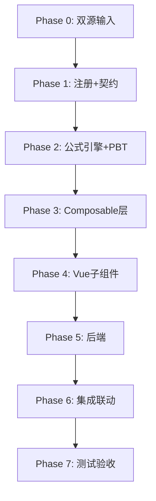

# Implementation Plan: I6 研发费用底稿专属HTML精美组件

## Overview

I6研发费用底稿专属组件`i6-research-development-expense`。I循环唯一损益类底稿（11有效sheet/1 xlsx/~120+公式）。

主入口 GtI6ResearchDevelopmentExpense.vue（sheetName v-if分发）+ 9个子组件 + 9个composable + 后端3个py文件。

科目：6602研发费用（**损益类/贷方科目！取发生额非余额**）
公式特征：损益净发生额=借方-贷方；审定=未审+AJE+RJE；VR-I6-01: 费用化+资本化=研发总额；月度12列横向

## Task Dependency Graph

## Tasks

### Phase 0: 双源输入验证

- [ ] 0.1 openpyxl脚本读取I6研发费用.xlsx全部11 sheet
  - 确认损益类取数规则 + 月度12列结构
  - 产出：i6_structure_summary.json
  - _Requirements: 双源输入流程_

- [ ] 0.2 底稿模板库md交叉验证
  - 核对I6↔I2联动规则/VR-I6-01/截止测试
  - _Requirements: 双源输入流程_

### Phase 1: 注册+契约测试

- [ ] 1.1 注册componentType和映射
  - wp_code_overrides: I6/I6-1~I6-6/I6A → 'i6-research-development-expense'
  - VALID_COMPONENT_TYPES + htmlRendererRegistry + GtI6ResearchDevelopmentExpense.vue骨架
  - _Requirements: 1.1-1.10_

- [ ] 1.2 编写注册契约测试
  - _Requirements: 1.6-1.8_

### Phase 2: 公式引擎+PBT

- [ ] 2.1 创建 useI6FormulaEngine.ts（损益类！）
  - calcAuditedAmount / calcIncomeStatementNet(debit,credit)=debit-credit
  - calcSubtotal / calcMonthlyTotal / calcChangeRate
  - calcResearchTotal / validateVRI601
  - _Requirements: 2.2-2.6, 4.4, 10.1-10.3_

- [ ]* 2.2 编写 Property P1 PBT：审定数公式链
  - 断言：calcAuditedAmount(u, a, r) === u + a + r
  - **Feature: i6-research-development-expense, Property P1: 审定数公式链**

- [ ]* 2.3 编写 Property P2 PBT：损益类净发生额（借-贷）
  - 生成器：fc.float({min:0, max:1e9}) × 2 (debit, credit)
  - 断言：calcIncomeStatementNet(dr, cr) === dr - cr
  - **Feature: i6-research-development-expense, Property P2: 损益净发生额=借方-贷方**

- [ ]* 2.4 编写 Property P3 PBT：月度合计=SUM(12月)
  - 生成器：fc.array(fc.float, {minLength:12, maxLength:12})
  - 断言：calcMonthlyTotal(months) === months.reduce((a,b)=>a+b,0)
  - **Feature: i6-research-development-expense, Property P3: 月度合计=SUM(1月~12月)**

- [ ]* 2.5 编写 Property P4 PBT：VR-I6-01校验
  - 生成器：expense≥0, capitalized≥0, total=expense+capitalized
  - 断言：validateVRI601(e, c, e+c).isValid === true
  - **Feature: i6-research-development-expense, Property P4: VR-I6-01费用化+资本化=总额**

- [ ]* 2.6 编写 Property P5 PBT：合计行恒等
  - 断言：calcSubtotal(arr) === Σarr
  - **Feature: i6-research-development-expense, Property P5: 合计行恒等**

- [ ]* 2.7 编写 Property P6 PBT：借贷平衡
  - 断言：Σdebit === Σcredit
  - **Feature: i6-research-development-expense, Property P6: 借贷平衡**

- [ ]* 2.8 编写 Property P7 PBT：截止测试日期差
  - 生成器：记账日/单据日随机
  - 断言：|记账日-单据日|≤5 → 不跨期
  - **Feature: i6-research-development-expense, Property P7: 截止测试日期差判断**

- [ ]* 2.9 编写 Property P8 PBT：变动率计算
  - 生成器：current∈R, prior>0
  - 断言：calcChangeRate(c, p) === (c-p)/p × 100
  - **Feature: i6-research-development-expense, Property P8: 变动率公式正确性**

### Phase 3: Composable层

- [ ] 3.1 创建 useI6FormData.ts（selfLoad + writebackTB **发生额** 6602）
  - 注意：TB回写使用发生额而非期末余额！（与H10同款）
- [ ] 3.2 创建 useI6CrossSheet.ts（I2双向联动 + VR-I6-01校验 + 月度聚合）
- [ ] 3.3 创建 useI6Adjudication.ts（损益类73公式 + 联动面板）
- [ ] 3.4 创建 useI6Detail.ts（月度12列横向矩阵 + 趋势图数据）
- [ ] 3.5 创建 useI6Cutoff.ts（截止双向 + autoSampling）
- [ ] 3.6 创建 useI6Disclosure.ts + useI6ImportExport.ts + useI6DualMode.ts

### Phase 4: Vue子组件

- [ ] 4.1 创建 I6TabIndex.vue
- [ ] 4.2 创建 I6TabAdjudication.vue（73公式！损益类+I2联动面板）
- [ ] 4.3 创建 I6TabDetail.vue（月度12列横向65列+趋势图）
- [ ] 4.4 创建 I6TabAdjustment.vue
- [ ] 4.5 创建 I6TabTargetedCheck.vue
- [ ] 4.6 创建 I6TabCutoffForward.vue + I6TabCutoffBackward.vue
- [ ] 4.7 创建 I6TabDisclosureListed.vue + I6TabDisclosureSoe.vue

### Phase 5: 后端

- [ ] 5.1 创建 _i6_research_development_expense.py render策略 + RENDERER_DISPATCH
  - 注意：损益类取数逻辑（tb_ledger发生额）
- [ ] 5.2 创建 _i6_import_export.py 导入导出3端点
- [ ] 5.3 创建 _i6_ai_generate.py AI生成
- [ ] 5.4 更新 wp_render_schema: i6-research-development-expense.yaml

### Phase 6: 集成联动

- [ ] 6.1 EventBus: TB回写(**发生额**6602) + substantive:adjudicated
- [ ] 6.2 EventBus: I6↔I2双向联动
  - I6 publish 'research:expense-updated'
  - I6 subscribe 'development:capitalized-updated'
  - VR-I6-01实时校验
- [ ] 6.3 cross_wp_references: I6↔I2双向引用
- [ ] 6.4 GtIndexChip: I6→I2 / I2→I6双向跳转
- [ ] 6.5 截止测试useCutoffAutoSampling集成
- [ ] 6.6 附注EventBus + 双模式OO

### Phase 7: 测试验收

- [ ] 7.1 Vitest: useI6FormulaEngine（损益类公式）
- [ ] 7.2 Vitest组件: sheetName分发 + I2联动面板
- [ ] 7.3 后端pytest: render(损益取数)+导入导出
- [ ] 7.4 Playwright E2E: I6保存→I2联动→VR-I6-01校验全链路
- [ ] 7.5 Playwright E2E: 月度明细横向滚动+趋势图
