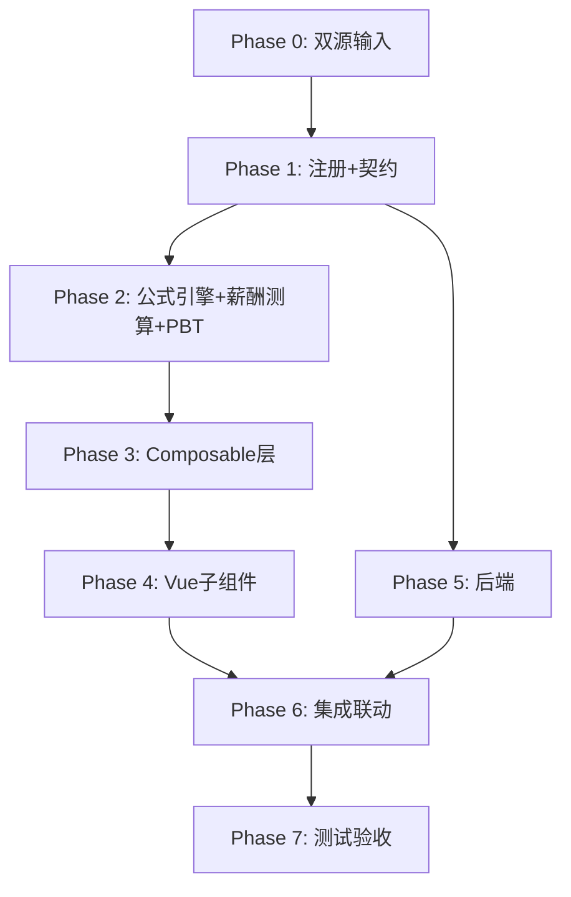

# Implementation Plan: J1 应付职工薪酬底稿专属HTML精美组件

## Overview

J1应付职工薪酬底稿专属组件`j1-employee-compensation`。J循环最大底稿（16有效sheet/1 xlsx/~110+公式）。

主入口 GtJ1EmployeeCompensation.vue（sheetName v-if分发）+ 13个子组件 + 15个composable + 后端3个py文件。

科目：2211应付职工薪酬（**贷方/负债类！**）
公式特征：**负债类贷方**期末=期初+贷方-借方；审定=未审+AJE+RJE；工资测算=人数×均薪×月数；社保=基数×比例×月数；月度12列横向

## Task Dependency Graph

## Tasks

### Phase 0: 双源输入验证

- [ ] 0.1 openpyxl脚本读取J1应付职工薪酬.xlsx全部22 sheet（含6个skip）
  - 提取16个有效sheet结构 + 确认负债类贷方公式方向
  - 产出：j1_structure_summary.json
  - _Requirements: 双源输入流程_

- [ ] 0.2 J应付职工薪酬循环底稿模板库md交叉验证
  - 核对：负债方向/月度分析/5类检查表/K8K9联动
  - 产出：j1_conflict_resolution.md
  - _Requirements: 双源输入流程_

### Phase 1: 注册+契约测试

- [ ] 1.1 注册componentType和映射
  - wp_code_overrides: J1/J1-1~J1-10/J1A → 'j1-employee-compensation'
  - VALID_COMPONENT_TYPES + htmlRendererRegistry注册
  - 创建 GtJ1EmployeeCompensation.vue 骨架（sheetName v-if + selfLoad）
  - _Requirements: 1.1-1.10_

- [ ] 1.2 编写注册契约测试
  - htmlRendererRegistry / VALID_COMPONENT_TYPES / wp_code_overrides / RENDERER_DISPATCH
  - _Requirements: 1.6, 1.7, 1.8_

### Phase 2: 公式引擎+PBT

- [ ] 2.1 创建 `useJ1FormulaEngine.ts`（负债类！与H9同款）
  - calcAuditedAmount / calcLiabilityEndBalance(b,cr,dr)=b+cr-dr
  - calcChangeDiff / calcChangeRate / calcSubtotal / calcProportion
  - calcMonthlyTotal / calcMonthlyAverage / validateAllocationClosure
  - _Requirements: 2.2-2.6, 3.2-3.6, 4.3-4.4_

- [ ] 2.2 创建 `useJ1SalaryCalc.ts`（薪酬测算纯函数）
  - calcSalaryEstimate / calcInsuranceEstimate / calcHousingFundEstimate
  - calcAccrualDiffRate / calcPerCapitaSalary / calcSalaryRevenueRatio / calcIndustryDiffRate
  - _Requirements: 4.6, 5.2-5.4, 6.2-6.5_

- [ ]* 2.3 编写 Property CP-J1-01 PBT：审定数公式链
  - 断言：calcAuditedAmount(u, a, r) === u + a + r
  - **Feature: j1-employee-compensation, Property CP-J1-01: 审定数公式链**

- [ ]* 2.4 编写 Property CP-J1-02 PBT：负债类期末（贷方！）
  - 生成器：fc.float({min:0, max:1e9}) × 3 (begin, credit, debit)
  - 断言：calcLiabilityEndBalance(b, cr, dr) === b + cr - dr
  - **Feature: j1-employee-compensation, Property CP-J1-02: 负债类贷方期末余额**

- [ ]* 2.5 编写 Property CP-J1-03 PBT：月度合计=SUM(12月)
  - 生成器：fc.array(fc.float, {minLength:12, maxLength:12})
  - 断言：calcMonthlyTotal(months) === months.reduce((a,b)=>a+b,0)
  - **Feature: j1-employee-compensation, Property CP-J1-03: 月度合计=SUM(1月~12月)**

- [ ]* 2.6 编写 Property CP-J1-04 PBT：工资测算=人数×均薪×月数
  - 生成器：headcount∈[1,10000], avgSalary∈[1000,100000], months∈[1,12]
  - 断言：calcSalaryEstimate(h, s, m) === h × s × m
  - **Feature: j1-employee-compensation, Property CP-J1-04: 工资测算公式**

- [ ]* 2.7 编写 Property CP-J1-05 PBT：社保测算=基数×比例×月数
  - 生成器：base>0, rate∈(0,0.5), months∈[1,12]
  - 断言：calcInsuranceEstimate(base, rate, m) === base × rate × m
  - **Feature: j1-employee-compensation, Property CP-J1-05: 社保测算公式**

- [ ]* 2.8 编写 Property CP-J1-06 PBT：分配闭合校验
  - 生成器：N个分配项(>0), total=Σ分配项
  - 断言：validateAllocationClosure(items, Σitems).isValid === true
  - **Feature: j1-employee-compensation, Property CP-J1-06: 分配闭合恒等**

- [ ]* 2.9 编写 Property CP-J1-07 PBT：合计行恒等
  - 断言：calcSubtotal(arr) === Σarr
  - **Feature: j1-employee-compensation, Property CP-J1-07: 合计行恒等**

- [ ]* 2.10 编写 Property CP-J1-08 PBT：变动率计算
  - 生成器：current∈R, prior>0
  - 断言：calcChangeRate(c, p) === (c-p)/p × 100
  - **Feature: j1-employee-compensation, Property CP-J1-08: 变动率公式正确性**

### Phase 3: Composable层

- [ ] 3.1 创建 useJ1FormData.ts（selfLoad + writebackTB **期末余额** 2211）
  - 负债类：回写期末余额（非发生额）
- [ ] 3.2 创建 useJ1CrossSheet.ts（明细vs审定 + 月度vs审定 + 分配闭合 + K8K9联动）
- [ ] 3.3 创建 useJ1Adjudication.ts（负债类57公式 + 分类分组）
- [ ] 3.4 创建 useJ1Detail.ts + useJ1MonthlyAnalysis.ts（月度12列矩阵+趋势图）
- [ ] 3.5 创建 useJ1IndustryCompare.ts（行业对比+差异率）
- [ ] 3.6 创建 useJ1AccrualCheck.ts + useJ1AllocationCheck.ts + useJ1GeneralCheck.ts + useJ1NonMonetaryCheck.ts + useJ1SeveranceCheck.ts
- [ ] 3.7 创建 useJ1Disclosure.ts + useJ1ImportExport.ts + useJ1DualMode.ts

### Phase 4: Vue子组件

- [ ] 4.1 创建 J1TabIndex.vue 底稿目录
- [ ] 4.2 创建 J1TabAdjudication.vue 审定表（57公式！负债类+分类分组）
- [ ] 4.3 创建 J1TabDetail.vue 明细表
- [ ] 4.4 创建 J1TabAdjustment.vue 调整分录
- [ ] 4.5 创建 J1TabMonthlyAnalysis.vue 月度分析（12列横向+趋势图+波动高亮）
- [ ] 4.6 创建 J1TabIndustryCompare.vue 同行业对比（差异率+区间）
- [ ] 4.7 创建 J1TabAccrualCheck.vue 计提检查（人数×均薪测算）
- [ ] 4.8 创建 J1TabAllocationCheck.vue 分配检查（闭合校验+K8K9联动）
- [ ] 4.9 创建 J1TabGeneralCheck.vue 一般检查（行级OCR）
- [ ] 4.10 创建 J1TabNonMonetaryCheck.vue 非货币福利检查
- [ ] 4.11 创建 J1TabSeveranceCheck.vue 辞退福利检查（CAS9）
- [ ] 4.12 创建 J1TabDisclosureListed.vue + J1TabDisclosureSoe.vue

### Phase 5: 后端

- [ ] 5.1 创建 _j1_employee_compensation.py render策略 + RENDERER_DISPATCH
  - 负债类公式验证 + 薪酬分类逻辑
- [ ] 5.2 创建 _j1_import_export.py 导入导出3端点
- [ ] 5.3 创建 _j1_ai_generate.py AI生成
- [ ] 5.4 更新 wp_render_schema: j1-employee-compensation.yaml

### Phase 6: 集成联动

- [ ] 6.1 EventBus: TB回写(2211期末余额) + substantive:adjudicated
- [ ] 6.2 EventBus: compensation:adjusted → K8/K9联动
- [ ] 6.3 cross_wp_references: J1→K8/K9
- [ ] 6.4 GtIndexChip: J1→K8管理费用 / J1→K9销售费用 跳转
- [ ] 6.5 分配检查J1-7 ↔ K8/K9交叉验证
- [ ] 6.6 附注EventBus + 双模式OO

### Phase 7: 测试验收

- [ ] 7.1 Vitest: useJ1FormulaEngine（负债类公式）+ useJ1SalaryCalc（薪酬测算）
- [ ] 7.2 Vitest组件: sheetName分发 + 5类检查表渲染
- [ ] 7.3 后端pytest: render(负债类)+导入导出+薪酬分配验证
- [ ] 7.4 Playwright E2E: J1保存→TB回写→K8/K9联动全链路
- [ ] 7.5 Playwright E2E: 月度12列滚动+趋势图+波动高亮
