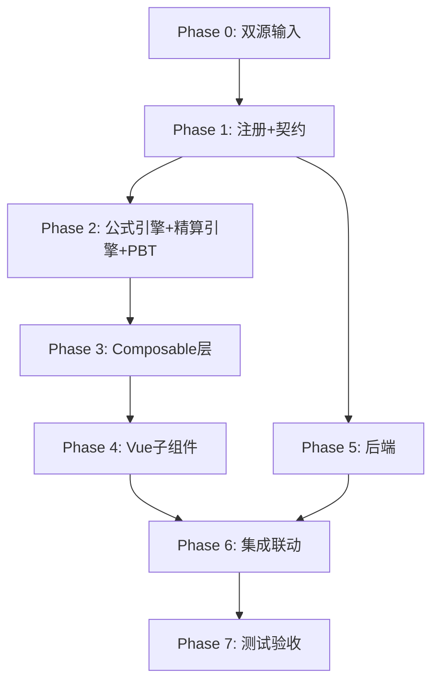

# Implementation Plan: J2 长期应付职工薪酬-设定受益计划净资产底稿专属HTML精美组件

## Overview

J2长期应付职工薪酬底稿专属组件`j2-defined-benefit-plan`。精算核心底稿（9有效sheet/1 xlsx/~90+公式）。

主入口 GtJ2DefinedBenefitPlan.vue（sheetName v-if分发）+ 7个子组件 + 10个composable + 后端3个py文件。

科目：2221长期应付职工薪酬（**贷方/负债类！**）
公式特征：**负债类贷方**期末=期初+贷方-借方；审定=未审+AJE+RJE；利息成本=期初DBO×折现率；净负债=DBO-计划资产；精算假设范围校验

## Task Dependency Graph

## Tasks

### Phase 0: 双源输入验证

- [ ] 0.1 openpyxl脚本读取J2长期应付职工薪酬.xlsx全部9 sheet（含1个skip L2A）
  - 提取有效sheet结构 + 确认负债类贷方+精算公式
  - 产出：j2_structure_summary.json
  - _Requirements: 双源输入流程_

- [ ] 0.2 J应付职工薪酬循环底稿模板库md交叉验证
  - 核对：精算假设要求/ISA620/DBO公式/B51联动
  - 产出：j2_conflict_resolution.md
  - _Requirements: 双源输入流程_

### Phase 1: 注册+契约测试

- [ ] 1.1 注册componentType和映射
  - wp_code_overrides: J2/J2-1~J2-4/J2A → 'j2-defined-benefit-plan'
  - VALID_COMPONENT_TYPES + htmlRendererRegistry注册
  - 创建 GtJ2DefinedBenefitPlan.vue 骨架（sheetName v-if + selfLoad）
  - _Requirements: 1.1-1.10_

- [ ] 1.2 编写注册契约测试
  - htmlRendererRegistry / VALID_COMPONENT_TYPES / wp_code_overrides / RENDERER_DISPATCH
  - _Requirements: 1.6, 1.7, 1.8_

### Phase 2: 公式引擎+PBT

- [ ] 2.1 创建 `useJ2FormulaEngine.ts`（负债类！与H9/J1同款）
  - calcAuditedAmount / calcLiabilityEndBalance(b,cr,dr)=b+cr-dr
  - calcChangeRate / calcSubtotal / calcProportion
  - _Requirements: 2.2-2.6_

- [ ] 2.2 创建 `useJ2ActuarialEngine.ts`（核心精算纯函数）
  - calcEndDBO / calcInterestCost / calcNetLiability
  - calcActuarialGainLoss / validateAssumptions / calcSensitivity
  - _Requirements: 4.1-4.6_

- [ ]* 2.3 编写 Property CP-J2-01 PBT：审定数公式链
  - 断言：calcAuditedAmount(u, a, r) === u + a + r
  - **Feature: j2-defined-benefit-plan, Property CP-J2-01: 审定数公式链**

- [ ]* 2.4 编写 Property CP-J2-02 PBT：负债类期末（贷方！）
  - 生成器：fc.float({min:0, max:1e9}) × 3 (begin, credit, debit)
  - 断言：calcLiabilityEndBalance(b, cr, dr) === b + cr - dr
  - **Feature: j2-defined-benefit-plan, Property CP-J2-02: 负债类贷方期末余额**

- [ ]* 2.5 编写 Property CP-J2-03 PBT：利息成本=期初DBO×折现率
  - 生成器：beginDBO>0, discountRate∈(0.01, 0.10)
  - 断言：calcInterestCost(dbo, rate) === dbo × rate
  - **Feature: j2-defined-benefit-plan, Property CP-J2-03: 利息成本公式**

- [ ]* 2.6 编写 Property CP-J2-04 PBT：净负债=DBO-计划资产
  - 生成器：dbo≥0, planAssets≥0
  - 断言：calcNetLiability(dbo, pa) === dbo - pa
  - **Feature: j2-defined-benefit-plan, Property CP-J2-04: 净负债公式**

- [ ]* 2.7 编写 Property CP-J2-05 PBT：DBO期末完整公式
  - 生成器：beginDBO≥0, serviceCost≥0, interestCost≥0, loss≥0, gain≥0, payments≥0
  - 断言：calcEndDBO(b, s, i, l, g, p) === b + s + i + l - g - p
  - **Feature: j2-defined-benefit-plan, Property CP-J2-05: DBO期末完整公式**

- [ ]* 2.8 编写 Property CP-J2-06 PBT：合计行恒等
  - 断言：calcSubtotal(arr) === Σarr
  - **Feature: j2-defined-benefit-plan, Property CP-J2-06: 合计行恒等**

- [ ]* 2.9 编写 Property CP-J2-07 PBT：精算假设范围校验
  - 生成器：discountRate∈(0,1), salaryGrowthRate∈(0,1), turnoverRate∈(0,1)
  - 断言：validateAssumptions({rate在合理范围}).isValid === true; 超出范围.isValid === false
  - **Feature: j2-defined-benefit-plan, Property CP-J2-07: 精算假设范围校验**

### Phase 3: Composable层

- [ ] 3.1 创建 useJ2FormData.ts（selfLoad + writebackTB **期末余额** 2221）
  - 负债类：回写期末余额
- [ ] 3.2 创建 useJ2CrossSheet.ts（明细vs审定 + B51联动 + 精算假设变动）
- [ ] 3.3 创建 useJ2Adjudication.ts（三区块DBO/计划资产/净负债 + 67公式）
- [ ] 3.4 创建 useJ2Detail.ts + useJ2AccrualCheck.ts（精算师工作利用+假设评价）
- [ ] 3.5 创建 useJ2Disclosure.ts + useJ2ImportExport.ts + useJ2DualMode.ts

### Phase 4: Vue子组件

- [ ] 4.1 创建 J2TabIndex.vue 底稿目录
- [ ] 4.2 创建 J2TabAdjudication.vue 审定表（67公式！负债类+三区块+精算假设面板）
- [ ] 4.3 创建 J2TabDetail.vue 明细表（DBO+计划资产+净负债）
- [ ] 4.4 创建 J2TabAdjustment.vue 调整分录
- [ ] 4.5 创建 J2TabAccrualCheck.vue 计提检查（精算师利用ISA620+假设逐项对比）
- [ ] 4.6 创建 J2TabDisclosureListed.vue + J2TabDisclosureSoe.vue

### Phase 5: 后端

- [ ] 5.1 创建 _j2_defined_benefit_plan.py render策略 + RENDERER_DISPATCH
  - 负债类公式验证 + 精算数据格式
- [ ] 5.2 创建 _j2_import_export.py 导入导出3端点
- [ ] 5.3 创建 _j2_ai_generate.py AI生成（精算假设合理性分析）
- [ ] 5.4 更新 wp_render_schema: j2-defined-benefit-plan.yaml

### Phase 6: 集成联动

- [ ] 6.1 EventBus: TB回写(2221期末余额) + substantive:adjudicated
- [ ] 6.2 EventBus: actuarial:assumption-changed → B51联动
- [ ] 6.3 cross_wp_references: J2→B51
- [ ] 6.4 GtIndexChip: J2→B51舞弊三因素跳转
- [ ] 6.5 附注EventBus + 双模式OO

### Phase 7: 测试验收

- [ ] 7.1 Vitest: useJ2FormulaEngine（负债类公式）+ useJ2ActuarialEngine（精算公式）
- [ ] 7.2 Vitest组件: sheetName分发 + 三区块审定表 + 精算假设面板
- [ ] 7.3 后端pytest: render(负债类)+导入导出+精算假设验证
- [ ] 7.4 Playwright E2E: J2精算假设变更→B51联动→审定回写全链路
