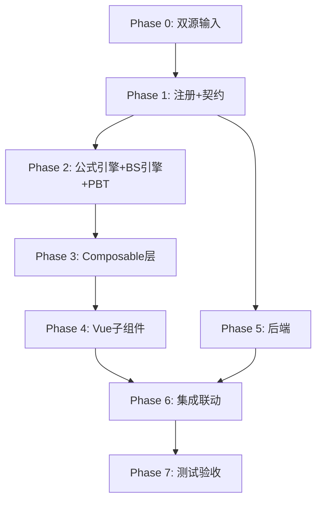

# Implementation Plan: J3 股份支付底稿专属HTML精美组件

## Overview

J3股份支付底稿专属组件`j3-share-based-payment`。期权定价核心底稿（6有效sheet/1 xlsx/~50+公式）。

主入口 GtJ3ShareBasedPayment.vue（sheetName v-if分发）+ 3个子组件 + 8个composable + 后端3个py文件。

科目：**无独立科目**（跨资本公积3002/管理费用6602/应付职工薪酬2211）
公式特征：Black-Scholes期权定价；等待期费用分摊=总FV×(已服务/等待期)-累计已确认；权益结算vs现金结算

## Task Dependency Graph

## Tasks

### Phase 0: 双源输入验证

- [ ] 0.1 openpyxl脚本读取J3股份支付.xlsx全部6 sheet（含2个skip辅助说明）
  - 提取有效sheet结构 + 确认BS参数列+等待期公式
  - 产出：j3_structure_summary.json
  - _Requirements: 双源输入流程_

- [ ] 0.2 J应付职工薪酬循环底稿模板库md交叉验证
  - 核对：CAS11要求/BS模型参数/等待期确认规则/权益vs现金
  - 产出：j3_conflict_resolution.md
  - _Requirements: 双源输入流程_

### Phase 1: 注册+契约测试

- [ ] 1.1 注册componentType和映射
  - wp_code_overrides: J3/J3-1~J3-2/J3A → 'j3-share-based-payment'
  - VALID_COMPONENT_TYPES + htmlRendererRegistry注册
  - 创建 GtJ3ShareBasedPayment.vue 骨架（sheetName v-if + selfLoad）
  - _Requirements: 1.1-1.10_

- [ ] 1.2 编写注册契约测试
  - htmlRendererRegistry / VALID_COMPONENT_TYPES / wp_code_overrides / RENDERER_DISPATCH
  - _Requirements: 1.6, 1.7, 1.8_

### Phase 2: 公式引擎+PBT

- [ ] 2.1 创建 `useJ3FormulaEngine.ts`（费用分摊）
  - calcVestingExpense / calcCumulativeExpense / calcRemainingExpense
  - calcSubtotal / calcTotalFairValue
  - _Requirements: 2.2-2.6, 4.1-4.4_

- [ ] 2.2 创建 `useJ3OptionPricingEngine.ts`（核心！Black-Scholes）
  - normalCDF / calcD1 / calcD2 / calcBlackScholes / validateBSParams
  - _Requirements: 3.1-3.6_

- [ ]* 2.3 编写 Property CP-J3-01 PBT：Black-Scholes定价公式
  - 生成器：S∈(1,1000), K∈(1,1000), T∈(0.1,10), r∈(0.01,0.10), sigma∈(0.1,1.0)
  - 断言：calcBlackScholes(S,K,T,r,σ) === S×N(d1) - K×exp(-r×T)×N(d2)
  - **Feature: j3-share-based-payment, Property CP-J3-01: Black-Scholes定价公式**

- [ ]* 2.4 编写 Property CP-J3-02 PBT：d2=d1-σ×√T
  - 生成器：d1∈R, sigma∈(0.1,1.0), T>0
  - 断言：calcD2(d1, sigma, T) === d1 - sigma × Math.sqrt(T)
  - **Feature: j3-share-based-payment, Property CP-J3-02: d2公式**

- [ ]* 2.5 编写 Property CP-J3-03 PBT：等待期费用分摊累计
  - 生成器：totalFV>0, vestingPeriod∈[1,5], serviceYears∈[0,vestingPeriod]
  - 断言：calcCumulativeExpense(fv, vp, sy) === fv × MIN(sy/vp, 1)
  - **Feature: j3-share-based-payment, Property CP-J3-03: 等待期累计费用**

- [ ]* 2.6 编写 Property CP-J3-04 PBT：剩余费用=总FV-累计
  - 生成器：totalFV>0, cumulative∈[0, totalFV]
  - 断言：calcRemainingExpense(fv, cum) === fv - cum
  - **Feature: j3-share-based-payment, Property CP-J3-04: 剩余费用公式**

- [ ]* 2.7 编写 Property CP-J3-05 PBT：总公允=单位FV×数量
  - 生成器：unitFV>0, quantity>0 (整数)
  - 断言：calcTotalFairValue(u, q) === u × q
  - **Feature: j3-share-based-payment, Property CP-J3-05: 总公允价值公式**

- [ ]* 2.8 编写 Property CP-J3-06 PBT：合计行恒等
  - 断言：calcSubtotal(arr) === Σarr
  - **Feature: j3-share-based-payment, Property CP-J3-06: 合计行恒等**

### Phase 3: Composable层

- [ ] 3.1 创建 useJ3FormData.ts（selfLoad，注意：无单一TB回写！）
  - 跨多科目：不做writebackTB，改用EventBus通知
- [ ] 3.2 创建 useJ3CrossSheet.ts（情况表vs检查表 + M4联动 + J1联动）
- [ ] 3.3 创建 useJ3Detail.ts（18列情况表+费用分摊+BS参数）
- [ ] 3.4 创建 useJ3Check.ts（19列检查表+段落型+CAS11）
- [ ] 3.5 创建 useJ3Disclosure.ts + useJ3ImportExport.ts + useJ3DualMode.ts

### Phase 4: Vue子组件

- [ ] 4.1 创建 J3TabIndex.vue 底稿目录
- [ ] 4.2 创建 J3TabDetail.vue 情况表（18列+BS定价结果+费用分摊+权益/现金标注）
- [ ] 4.3 创建 J3TabCheck.vue 检查表（19列段落型+CAS11+BS参数逐项验证+IPO面板）

### Phase 5: 后端

- [ ] 5.1 创建 _j3_share_based_payment.py render策略 + RENDERER_DISPATCH
  - 跨科目逻辑 + BS参数格式
- [ ] 5.2 创建 _j3_import_export.py 导入导出3端点
- [ ] 5.3 创建 _j3_ai_generate.py AI生成（BS参数合理性分析）
- [ ] 5.4 更新 wp_render_schema: j3-share-based-payment.yaml

### Phase 6: 集成联动

- [ ] 6.1 EventBus: share-payment:expense-recognized → M4/J1联动
- [ ] 6.2 cross_wp_references: J3→M4资本公积 / J3→J1应付职工薪酬
- [ ] 6.3 GtIndexChip: J3→M4 / J3→J1跳转
- [ ] 6.4 权益结算→M4 / 现金结算→J1 自动分流
- [ ] 6.5 双模式OO + IPO适用性判断

### Phase 7: 测试验收

- [ ] 7.1 Vitest: useJ3OptionPricingEngine（BS模型数学精度）+ useJ3FormulaEngine（费用分摊）
- [ ] 7.2 Vitest组件: sheetName分发 + 权益/现金模式切换
- [ ] 7.3 后端pytest: render+导入导出+BS参数验证
- [ ] 7.4 Playwright E2E: J3费用确认→M4联动→J1联动全链路
