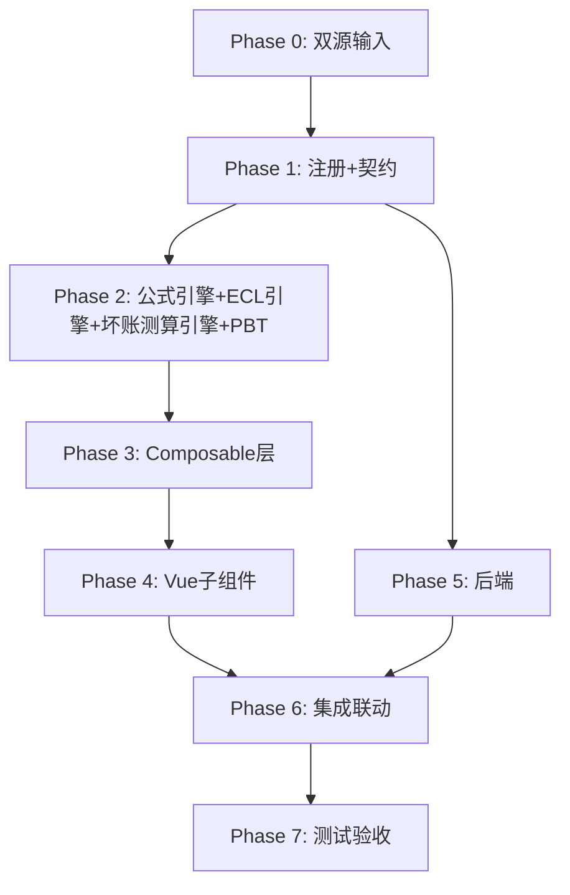

# Implementation Plan: K1 其他应收款底稿专属HTML精美组件

## Overview

K1其他应收款底稿专属组件`k1-other-receivables`。K循环含ECL减值的资产类底稿（16有效sheet/1 xlsx/~110+公式）。

主入口 GtK1OtherReceivables.vue（sheetName v-if分发，defineAsyncComponent lazy）+ 15个子组件 + composable分层 + 后端3个py文件。

科目：1221其他应收款（借方/资产类）+ 坏账准备（贷方/备抵类）
公式特征：资产类期末=期初+借-贷；备抵类期末=期初+贷-借；期末坏账=期初+计提-转回-核销；ECL=EAD×PD×LGD

## Task Dependency Graph

## Tasks

### Phase 0: 双源输入验证

- [ ] 0.1 openpyxl脚本读取K1其他应收款.xlsx全部16 sheet
  - 提取：sheet名/列头/行数/公式单元格/合并区域
  - 产出：k1_structure_summary.json（确认K1-1 47公式/K1-3 21公式/K1-8 11公式）
  - _Requirements: 双源输入流程_

- [ ] 0.2 K其他应收款循环底稿模板库md交叉验证
  - 核对：ECL三阶段/账龄组合/坏账测算/关联方联动
  - 产出：k1_conflict_resolution.md（如有冲突）
  - _Requirements: 双源输入流程_

### Phase 1: 注册+契约测试

- [ ] 1.1 注册componentType和映射
  - wp_code_overrides: K1/K1-1~K1-12/K1A → 'k1-other-receivables'
  - VALID_COMPONENT_TYPES + htmlRendererRegistry注册
  - 创建 GtK1OtherReceivables.vue 骨架（sheetName v-if + defineAsyncComponent + selfLoad）
  - _Requirements: 1.1-1.10_

- [ ] 1.2 编写注册契约测试
  - htmlRendererRegistry / VALID_COMPONENT_TYPES / wp_code_overrides / RENDERER_DISPATCH
  - _Requirements: 1.6, 1.7, 1.8_

### Phase 2: 公式引擎+ECL引擎+坏账测算引擎+PBT

- [ ] 2.1 创建 useK1FormulaEngine.ts
  - calcAuditedAmount / calcAssetEndBalance / calcContraEndBalance / calcBadDebtEnd / calcNetValue / calcTriangleReconciliation / calcProportion / calcSubtotal / calcChangeRate
  - _Requirements: 2.3-2.7, 4.2-4.3, 12.4-12.10_

- [ ] 2.2 创建 useK1ECLEngine.ts + useK1BadDebtCalcEngine.ts
  - determineStage / calcECL / calcAgingLoss / calcProvisionVariance
  - _Requirements: 5.2, 6.2-6.4, 12.1-12.3_

- [ ]* 2.3 编写 Property CP-K1-01 PBT：审定数公式链
  - 断言：calcAuditedAmount(u, a, r) === u + a + r
  - **Feature: k1-other-receivables, Property CP-K1-01: 审定数公式链**

- [ ]* 2.4 编写 Property CP-K1-02 PBT：资产类期末余额
  - 断言：calcAssetEndBalance(b, dr, cr) === b + dr - cr
  - **Feature: k1-other-receivables, Property CP-K1-02: 资产类期末=期初+借-贷**

- [ ]* 2.5 编写 Property CP-K1-03 PBT：备抵类期末余额
  - 断言：calcContraEndBalance(b, cr, dr) === b + cr - dr
  - **Feature: k1-other-receivables, Property CP-K1-03: 备抵类期末=期初+贷-借**

- [ ]* 2.6 编写 Property CP-K1-04 PBT：期末坏账公式
  - 断言：calcBadDebtEnd(b, p, rev, wo) === b + p - rev - wo
  - **Feature: k1-other-receivables, Property CP-K1-04: 期末坏账=期初+计提-转回-核销**

- [ ]* 2.7 编写 Property CP-K1-05 PBT：账面净值
  - 断言：calcNetValue(rec, bd) === rec - bd
  - **Feature: k1-other-receivables, Property CP-K1-05: 账面净值=应收-坏账**

- [ ]* 2.8 编写 Property CP-K1-06 PBT：ECL公式
  - 生成器：ead≥0, pd∈[0,1], lgd∈[0,1]
  - 断言：calcECL(ead, pd, lgd) === ead × pd × lgd
  - **Feature: k1-other-receivables, Property CP-K1-06: ECL=EAD×PD×LGD**

- [ ]* 2.9 编写 Property CP-K1-07 PBT：阶段判定确定性
  - 断言：determineStage(imp, sig) ∈ {1,2,3} 且 imp=true → 3
  - **Feature: k1-other-receivables, Property CP-K1-07: 阶段判定确定性**

- [ ]* 2.10 编写 Property CP-K1-08 PBT：账龄合计恒等
  - 断言：calcSubtotal(agingBuckets) === ΣagingBuckets
  - **Feature: k1-other-receivables, Property CP-K1-08: 账龄合计恒等**

- [ ]* 2.11 编写 Property CP-K1-09 PBT：占比公式
  - 生成器：item∈R, total>0
  - 断言：calcProportion(item, total) === item/total
  - **Feature: k1-other-receivables, Property CP-K1-09: 占比=单项/合计**

### Phase 3: Composable层

- [ ] 3.1 创建 useK1FormData.ts
  - selfLoad + checklist_responses + writebackTB(1221+坏账准备双科目)
  - _Requirements: 1.9, 1.10, 2.8_

- [ ] 3.2 创建 useK1CrossSheet.ts
  - adjudicationVsDetail / badDebtVsCalc(K1-3 vs K1-8) / agingVsBalance
  - _Requirements: 2.9, 3.3, 4.4-4.5, 6.5_

- [ ] 3.3 创建 useK1DualMode.ts + useK1ImportExport.ts
  - 双模式 + 导入导出三级
  - _Requirements: 3.4_

- [ ] 3.4 创建 sheet-specific composables
  - useK1Adjudication / useK1Detail / useK1BadDebt / useK1StageCheck / useK1BadDebtCalc / useK1LargeAmount / useK1Checks
  - _Requirements: 2~9 全部_

### Phase 4: Vue子组件

- [ ] 4.1 创建 K1TabIndex.vue 底稿目录（16行进度条）
  - _Requirements: 1.2_

- [ ] 4.2 创建 K1TabAdjudication.vue 审定表K1-1
  - 双区块(1221+坏账准备)+净值+47公式+三角勾稽+TB回写+89行虚拟滚动
  - _Requirements: 2.1-2.10_

- [ ] 4.3 创建 K1TabDetail.vue 明细表K1-2
  - 36列3区段+账龄+动态行+统计+导入导出+3年以上高亮
  - _Requirements: 3.1-3.6_

- [ ] 4.4 创建 K1TabBadDebtDetail.vue 坏账明细K1-3
  - 21公式+计提转回核销+与K1-8交叉验证
  - _Requirements: 4.1-4.5_

- [ ] 4.5 创建 K1TabStageCheck.vue 三阶段划分K1-7 + K1TabBadDebtCalc.vue 坏账测算K1-8
  - ECL阶段判定+2区段Tab+ECL测算+差异标记+虚拟滚动
  - _Requirements: 5.1-5.5, 6.1-6.6_

- [ ] 4.6 创建 K1TabLargeAmount.vue K1-5 + 检查表组（K1-6/K1-9/K1-10/K1-11/K1-12）
  - 大额分析+政策检查+核销+长期未收回+关联方+综合检查+抽凭+OCR+不合规摘要
  - _Requirements: 7.1-7.4, 8.1-8.6, 9.1-9.2_

- [ ] 4.7 创建 K1TabAdjustment.vue + 附注（K1TabDisclosureListed/Soe.vue）
  - 调整分录借贷平衡+EventBus / 附注双版本+自动取数
  - _Requirements: 10.1-10.3, 11.1_

### Phase 5: 后端

- [ ] 5.1 创建 _k1_other_receivables.py render策略 + RENDERER_DISPATCH注册
  - _Requirements: 1.6_

- [ ] 5.2 创建 _k1_import_export.py 导入导出3端点
  - _Requirements: 3.4, 4.1_

- [ ] 5.3 创建 _k1_ai_generate.py AI生成 + 更新 k1-other-receivables.yaml
  - section: policy-check / large-amount-eval / overdue-eval / overall-opinion
  - _Requirements: 9.2, 10.3_

### Phase 6: 集成联动

- [ ] 6.1 EventBus: TB回写(1221+坏账准备) + substantive:adjudicated → 附注
  - _Requirements: 2.8, 10.3_

- [ ] 6.2 EventBus: adjustment:created → A13 + 附注subscribe刷新
  - _Requirements: 11.1_

- [ ] 6.3 抽凭引擎(GtVoucherSamplingEngine科目1221) + 行级OCR + GtIndexChip跳转 + 双模式OO
  - _Requirements: 7.4, 8.5_

### Phase 7: 测试验收

- [ ] 7.1 单元测试：useK1FormulaEngine + useK1ECLEngine + useK1BadDebtCalcEngine
  - 资产/备抵方向 + ECL + 阶段判定 + 边界(零值/大数)
  - _Requirements: CP-K1-01~09_

- [ ] 7.2 集成测试：ECL阶段链 + 坏账测算 + 跨sheet勾稽
  - 阶段判定→测算→K1-3计提 / 账龄合计一致 / 审定回写
  - _Requirements: 2.9, 4.4, 6.5_

- [ ] 7.3 Playwright E2E
  - 打开K1→审定→明细账龄→阶段划分→坏账测算→保存
  - _Requirements: 全部_
