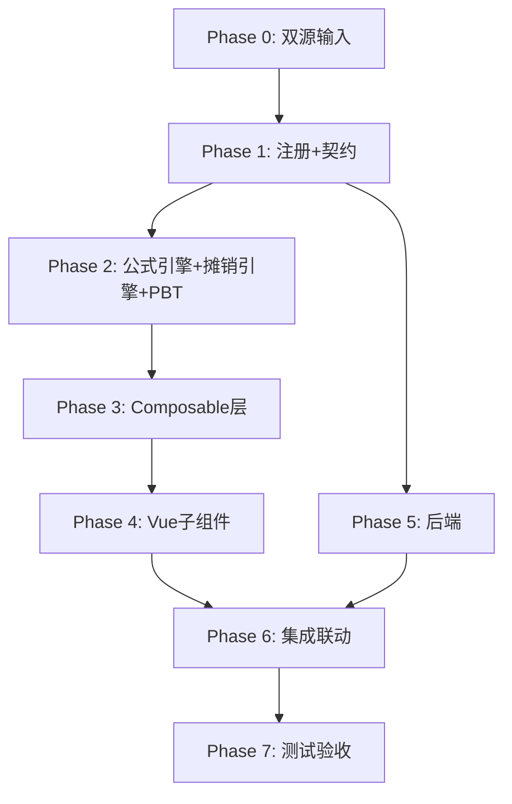

# Implementation Plan: K2 其他流动资产底稿专属HTML精美组件

## Overview

K2其他流动资产底稿专属组件`k2-other-current-assets`。K循环含合同取得成本+摊销测算的资产类底稿（10有效sheet/1 xlsx/~200+公式）。

主入口 GtK2OtherCurrentAssets.vue（sheetName v-if分发，defineAsyncComponent lazy）+ 9个子组件 + composable分层 + 后端3个py文件。

科目：1231其他流动资产（借方/资产类）
公式特征：期末=期初+借-贷；审定=未审+AJE+RJE；直线/进度法摊销

## Task Dependency Graph

## Tasks

### Phase 0: 双源输入验证

- [ ] 0.1 openpyxl脚本读取K2其他流动资产.xlsx全部10 sheet
  - 产出：k2_structure_summary.json（确认K2-1 85公式/K2-4 57公式/K2-5 37公式）
  - _Requirements: 双源输入流程_

- [ ] 0.2 K其他流动资产循环底稿模板库md交叉验证
  - 核对：合同取得成本资本化/摊销方法
  - 产出：k2_conflict_resolution.md
  - _Requirements: 双源输入流程_

### Phase 1: 注册+契约测试

- [ ] 1.1 注册componentType和映射
  - wp_code_overrides: K2/K2-1~K2-6/K2A → 'k2-other-current-assets'
  - VALID_COMPONENT_TYPES + htmlRendererRegistry注册
  - 创建 GtK2OtherCurrentAssets.vue 骨架（sheetName v-if + selfLoad）
  - _Requirements: 1.1-1.10_

- [ ] 1.2 编写注册契约测试
  - htmlRendererRegistry / VALID_COMPONENT_TYPES / wp_code_overrides / RENDERER_DISPATCH
  - _Requirements: 1.6, 1.7, 1.8_

### Phase 2: 公式引擎+摊销引擎+PBT

- [ ] 2.1 创建 useK2FormulaEngine.ts
  - calcAuditedAmount / calcAssetEndBalance / calcTriangleReconciliation / calcSubtotal / calcChangeRate
  - _Requirements: 2.2-2.3, 8.1-8.2, 8.6-8.7_

- [ ] 2.2 创建 useK2AmortizationEngine.ts
  - calcStraightLineAmort / calcProgressAmort / calcAmortizedBalance / calcAmortVariance
  - _Requirements: 5.2-5.5, 8.3-8.5_

- [ ]* 2.3 编写 Property CP-K2-01 PBT：审定数公式链
  - 断言：calcAuditedAmount(u, a, r) === u + a + r
  - **Feature: k2-other-current-assets, Property CP-K2-01: 审定数公式链**

- [ ]* 2.4 编写 Property CP-K2-02 PBT：资产类期末余额
  - 断言：calcAssetEndBalance(b, dr, cr) === b + dr - cr
  - **Feature: k2-other-current-assets, Property CP-K2-02: 期末=期初+借-贷**

- [ ]* 2.5 编写 Property CP-K2-03 PBT：直线法摊销
  - 生成器：cost≥0, totalPeriods>0, currentPeriods≥0
  - 断言：calcStraightLineAmort(cost, tp, cp) === cost/tp × cp
  - **Feature: k2-other-current-assets, Property CP-K2-03: 直线法摊销**

- [ ]* 2.6 编写 Property CP-K2-04 PBT：进度法摊销
  - 断言：calcProgressAmort(cost, cur, prior) === cost × (cur - prior)
  - **Feature: k2-other-current-assets, Property CP-K2-04: 进度法摊销**

- [ ]* 2.7 编写 Property CP-K2-05 PBT：摊余成本
  - 断言：calcAmortizedBalance(cost, acc) === cost - acc
  - **Feature: k2-other-current-assets, Property CP-K2-05: 摊余成本**

- [ ]* 2.8 编写 Property CP-K2-06 PBT：合计行恒等
  - 断言：calcSubtotal(arr) === Σarr
  - **Feature: k2-other-current-assets, Property CP-K2-06: 合计行恒等**

### Phase 3: Composable层

- [ ] 3.1 创建 useK2FormData.ts（selfLoad + writebackTB 1231）
  - _Requirements: 1.9, 1.10, 2.6_

- [ ] 3.2 创建 useK2CrossSheet.ts（adjudicationVsDetail / contractCostVsAmort）
  - _Requirements: 2.5, 4.4-4.5, 5.5_

- [ ] 3.3 创建 useK2DualMode.ts + useK2ImportExport.ts
  - _Requirements: 3.3, 4.6_

- [ ] 3.4 创建 sheet-specific composables
  - useK2Adjudication / useK2Detail / useK2ContractCost / useK2Amortization / useK2Check
  - _Requirements: 2~7 全部_

### Phase 4: Vue子组件

- [ ] 4.1 创建 K2TabIndex.vue 底稿目录
  - _Requirements: 1.2_

- [ ] 4.2 创建 K2TabAdjudication.vue 审定表K2-1（85公式+三角勾稽+TB回写）
  - _Requirements: 2.1-2.7_

- [ ] 4.3 创建 K2TabDetail.vue 明细表K2-2（18列2区段+动态行+导入导出）
  - _Requirements: 3.1-3.4_

- [ ] 4.4 创建 K2TabContractCost.vue 合同取得成本K2-4（57公式+3区段+资本化判断+动态行）
  - _Requirements: 4.1-4.6_

- [ ] 4.5 创建 K2TabAmortization.vue 摊销测算K2-5（37公式+区段Tab+摊销引擎+差异标记+66行虚拟滚动）
  - _Requirements: 5.1-5.7_

- [ ] 4.6 创建 K2TabCheck.vue + K2TabAdjustment.vue + 附注（K2TabDisclosureListed/Soe.vue）
  - 检查表+抽凭+OCR / 调整分录借贷平衡 / 附注双版本
  - _Requirements: 6.1-6.3, 7.1-7.2_

### Phase 5: 后端

- [ ] 5.1 创建 _k2_other_current_assets.py render策略 + RENDERER_DISPATCH注册
  - _Requirements: 1.6_

- [ ] 5.2 创建 _k2_import_export.py 导入导出3端点
  - _Requirements: 3.3, 4.6_

- [ ] 5.3 创建 _k2_ai_generate.py AI生成 + 更新 k2-other-current-assets.yaml
  - section: amort-conclusion / classification-eval / overall-opinion
  - _Requirements: 6.2, 7.1_

### Phase 6: 集成联动

- [ ] 6.1 EventBus: TB回写(1231) + substantive:adjudicated → 附注
  - _Requirements: 2.6, 7.1_

- [ ] 6.2 EventBus: adjustment:created → A13 + 附注subscribe刷新
  - _Requirements: 7.2_

- [ ] 6.3 抽凭引擎 + 行级OCR + GtIndexChip跳转 + 双模式OO
  - _Requirements: 6.2_

### Phase 7: 测试验收

- [ ] 7.1 单元测试：useK2FormulaEngine + useK2AmortizationEngine（直线/进度/边界）
  - _Requirements: CP-K2-01~06_

- [ ] 7.2 集成测试：合同成本→摊销测算→交叉验证 + 审定回写
  - _Requirements: 4.4, 5.5, 2.5_

- [ ] 7.3 Playwright E2E：打开K2→审定→明细→合同成本→摊销测算→保存
  - _Requirements: 全部_
