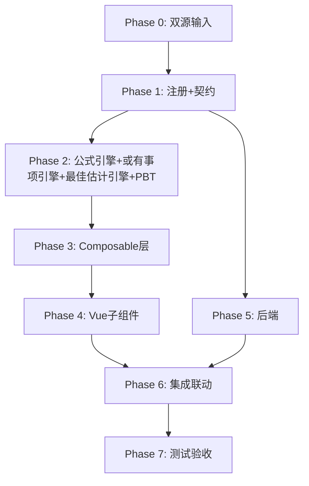

# Implementation Plan: K5 预计负债底稿专属HTML精美组件

## Overview

K5预计负债底稿专属组件`k5-provisions`。K循环含或有事项判断的负债类底稿（10有效sheet/1 xlsx/~100+公式）。

主入口 GtK5Provisions.vue（sheetName v-if分发，defineAsyncComponent lazy）+ 10个子组件 + composable分层（含或有事项引擎+最佳估计引擎）+ 后端3个py文件。

科目：2701预计负债（**贷方/负债类**）
公式特征：负债类期末=期初+计提-转销；或有事项三级可能性；最佳估计数（单值/区间中值/期望值加权）

## Task Dependency Graph

## Tasks

### Phase 0: 双源输入验证

- [ ] 0.1 openpyxl脚本读取K5预计负债.xlsx全部10 sheet
  - 产出：k5_structure_summary.json（确认K5-1 73公式/K5-2 42行）
  - _Requirements: 双源输入流程_

- [ ] 0.2 K预计负债循环底稿模板库md交叉验证
  - 核对：CAS13或有事项/最佳估计数/质保/弃置/诉讼
  - 产出：k5_conflict_resolution.md
  - _Requirements: 双源输入流程_

### Phase 1: 注册+契约测试

- [ ] 1.1 注册componentType和映射
  - wp_code_overrides: K5/K5-1~K5-7/K5A → 'k5-provisions'
  - VALID_COMPONENT_TYPES + htmlRendererRegistry + GtK5Provisions.vue骨架（sheetName v-if + selfLoad）
  - _Requirements: 1.1-1.10_

- [ ] 1.2 编写注册契约测试
  - _Requirements: 1.6-1.8_

### Phase 2: 公式引擎+或有事项引擎+最佳估计引擎+PBT

- [ ] 2.1 创建 useK5FormulaEngine.ts
  - calcAuditedAmount / calcLiabilityEndBalance / calcSubtotal
  - _Requirements: 2.3-2.4, 10.1-10.2, 10.8_

- [ ] 2.2 创建 useK5ContingencyEngine.ts + useK5BestEstimateEngine.ts
  - determineRecognition / calcRangeMidpoint / calcExpectedValue / calcWarrantyProvision / calcPresentValue
  - _Requirements: 4.1-4.4, 5.1-5.5, 6.2, 7.2-7.3, 10.3-10.7_

- [ ]* 2.3 编写 Property CP-K5-01 PBT：审定数公式链
  - 断言：calcAuditedAmount(u, a, r) === u + a + r
  - **Feature: k5-provisions, Property CP-K5-01: 审定数公式链**

- [ ]* 2.4 编写 Property CP-K5-02 PBT：负债类期末余额
  - 断言：calcLiabilityEndBalance(b, p, rel) === b + p - rel
  - **Feature: k5-provisions, Property CP-K5-02: 负债类期末=期初+计提-转销**

- [ ]* 2.5 编写 Property CP-K5-03 PBT：或有确认决策确定性
  - 断言：determineRecognition('very_likely')==='recognize'；'possible'→'disclose'；'remote'→'ignore'
  - **Feature: k5-provisions, Property CP-K5-03: 或有确认决策确定性**

- [ ]* 2.6 编写 Property CP-K5-04 PBT：区间中值
  - 断言：calcRangeMidpoint(u, l) === (u + l) / 2
  - **Feature: k5-provisions, Property CP-K5-04: 区间中值=(上限+下限)/2**

- [ ]* 2.7 编写 Property CP-K5-05 PBT：期望值加权
  - 生成器：amounts[], probs[] 等长，Σprobs=1
  - 断言：calcExpectedValue(amounts, probs) === Σ(amounts[i]×probs[i])
  - **Feature: k5-provisions, Property CP-K5-05: 期望值=Σ(金额×概率)**

- [ ]* 2.8 编写 Property CP-K5-06 PBT：保修支出
  - 断言：calcWarrantyProvision(rev, rate) === rev × rate
  - **Feature: k5-provisions, Property CP-K5-06: 保修支出=收入×保修率**

- [ ]* 2.9 编写 Property CP-K5-07 PBT：现值折现
  - 生成器：future≥0, rate>0, years≥0
  - 断言：calcPresentValue(future, rate, years) === future/(1+rate)^years
  - **Feature: k5-provisions, Property CP-K5-07: 现值=future/(1+rate)^years**

### Phase 3: Composable层

- [ ] 3.1 创建 useK5FormData.ts（selfLoad + writebackTB 2701 负债口径）
  - _Requirements: 1.9, 1.10, 2.7_

- [ ] 3.2 创建 useK5CrossSheet.ts
  - adjudicationVsDetail / warrantyVsAdjudication / decommissionVsAdjudication / litigationVsAdjudication
  - _Requirements: 2.6, 3.4, 6.3, 7.4, 8.2_

- [ ] 3.3 创建 useK5DualMode.ts + useK5ImportExport.ts
  - _Requirements: 3.5, 9.2_

- [ ] 3.4 创建 sheet-specific composables
  - useK5Adjudication / useK5Detail / useK5Warranty / useK5Decommission / useK5Litigation / useK5ProvisionCheck
  - _Requirements: 2~9 全部_

### Phase 4: Vue子组件

- [ ] 4.1 创建 K5TabIndex.vue 底稿目录
  - _Requirements: 1.2_

- [ ] 4.2 创建 K5TabAdjudication.vue 审定表K5-1（负债类73公式+按类型分行+三角勾稽+TB回写）
  - _Requirements: 2.1-2.8_

- [ ] 4.3 创建 K5TabDetail.vue 明细表K5-2（23列3区段+或有判断+三级色标+42行虚拟滚动+动态行）
  - _Requirements: 3.1-3.6, 4.3-4.4, 5.5_

- [ ] 4.4 创建 K5TabWarrantyCheck.vue K5-4 + K5TabDecommissionCheck.vue K5-5
  - 质保测算+弃置现值折现+回连审定+AI辅助
  - _Requirements: 6.1-6.4, 7.1-7.4_

- [ ] 4.5 创建 K5TabLitigationCheck.vue K5-6 + K5TabProvisionCheck.vue K5-7
  - 未决诉讼+律师函联动+可能性判断+综合检查+抽凭+OCR+不合规摘要
  - _Requirements: 8.1-8.5_

- [ ] 4.6 创建 K5TabAdjustment.vue + 附注（K5TabDisclosureListed/Soe.vue含或有负债披露）
  - 调整分录借贷平衡+EventBus / 附注双版本+或有披露段+自动取数
  - _Requirements: 9.1-9.2_

### Phase 5: 后端

- [ ] 5.1 创建 _k5_provisions.py render策略 + RENDERER_DISPATCH注册（负债口径）
  - _Requirements: 1.6_

- [ ] 5.2 创建 _k5_import_export.py 导入导出3端点
  - _Requirements: 3.5, 9.2_

- [ ] 5.3 创建 _k5_ai_generate.py AI生成 + 更新 k5-provisions.yaml
  - section: litigation-eval / warranty-conclusion / decommission-conclusion / contingency-disclosure / overall-opinion
  - _Requirements: 6.4, 8.1, 9.1_

### Phase 6: 集成联动

- [ ] 6.1 EventBus: TB回写(2701) + substantive:adjudicated → 附注
  - _Requirements: 2.7, 9.1_

- [ ] 6.2 EventBus: adjustment:created → A13 + 附注subscribe刷新 + 或有负债披露联动
  - _Requirements: 9.2, 4.4_

- [ ] 6.3 抽凭引擎 + 行级OCR（律师函/评估报告） + GtIndexChip跳转 + 双模式OO
  - _Requirements: 8.4_

### Phase 7: 测试验收

- [ ] 7.1 单元测试：useK5FormulaEngine + useK5ContingencyEngine + useK5BestEstimateEngine
  - 负债方向 + 三级决策 + 区间/期望/现值 + 边界
  - _Requirements: CP-K5-01~07_

- [ ] 7.2 集成测试：或有判断→确认/披露 + 三专项测算回连审定 + 审定回写
  - _Requirements: 2.6, 4.2, 6.3, 7.4_

- [ ] 7.3 Playwright E2E：打开K5→审定→明细或有判断→质保→弃置→诉讼→保存
  - _Requirements: 全部_
