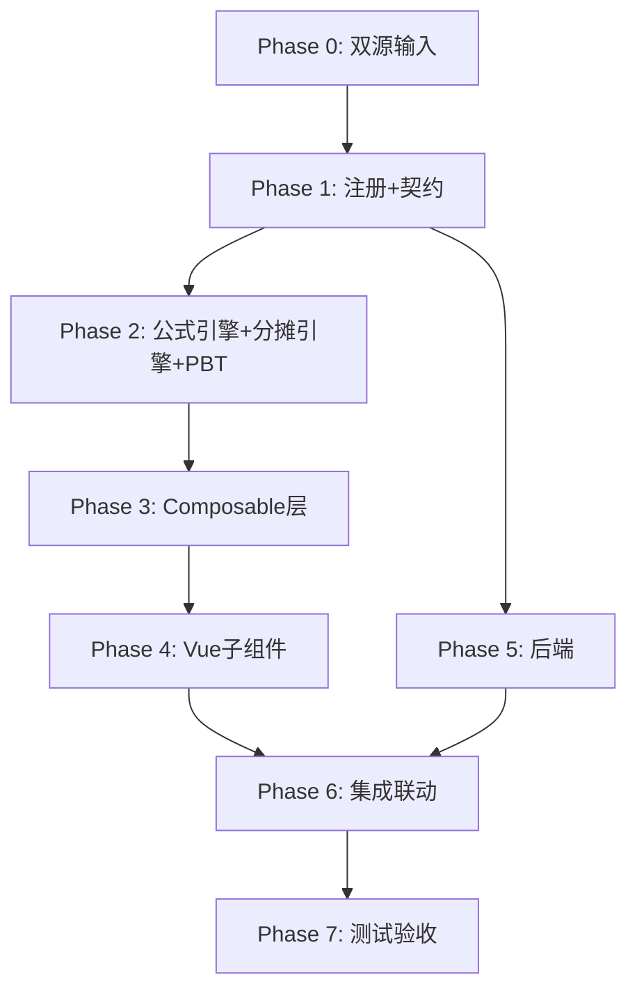

# Implementation Plan: K7 递延收益底稿专属HTML精美组件

## Overview

K7递延收益底稿专属组件`k7-deferred-income`。K循环含政府补助分摊测算的负债类底稿（10有效sheet，1会计提示辅助走OO/1 xlsx/~100+公式）。

主入口 GtK7DeferredIncome.vue（sheetName v-if分发，defineAsyncComponent lazy）+ 8个子组件 + composable分层（含分摊引擎）+ 后端3个py文件。

科目：2401递延收益（**贷方/负债类**）
公式特征：负债类期末=期初+收到-分摊；政府补助直线分摊；期末余额=总额-累计分摊

## Task Dependency Graph

## Tasks

### Phase 0: 双源输入验证

- [ ] 0.1 openpyxl脚本读取K7递延收益.xlsx全部sheet
  - 产出：k7_structure_summary.json（确认K7-1 49公式/K7-2 21公式/K7-4 23公式 + 识别会计提示辅助sheet）
  - _Requirements: 双源输入流程_

- [ ] 0.2 K递延收益循环底稿模板库md交叉验证
  - 核对：CAS16政府补助/与资产或收益相关/分摊去向K10/K12
  - 产出：k7_conflict_resolution.md
  - _Requirements: 双源输入流程_

### Phase 1: 注册+契约测试

- [ ] 1.1 注册componentType和映射
  - wp_code_overrides: K7/K7-1~K7-5/K7A → 'k7-deferred-income'（会计提示辅助走OO fallback）
  - VALID_COMPONENT_TYPES + htmlRendererRegistry + GtK7DeferredIncome.vue骨架（sheetName v-if + selfLoad）
  - _Requirements: 1.1-1.10_

- [ ] 1.2 编写注册契约测试
  - _Requirements: 1.6-1.8_

### Phase 2: 公式引擎+分摊引擎+PBT

- [ ] 2.1 创建 useK7FormulaEngine.ts
  - calcAuditedAmount / calcLiabilityEndBalance / calcSubtotal
  - _Requirements: 2.2-2.3, 7.1-7.2, 7.6_

- [ ] 2.2 创建 useK7GrantAmortEngine.ts
  - calcStraightLineAmort / calcRemainingBalance / calcAmortVariance
  - _Requirements: 4.2-4.5, 7.3-7.5_

- [ ]* 2.3 编写 Property CP-K7-01 PBT：审定数公式链
  - 断言：calcAuditedAmount(u, a, r) === u + a + r
  - **Feature: k7-deferred-income, Property CP-K7-01: 审定数公式链**

- [ ]* 2.4 编写 Property CP-K7-02 PBT：负债类期末余额
  - 断言：calcLiabilityEndBalance(b, rec, am) === b + rec - am
  - **Feature: k7-deferred-income, Property CP-K7-02: 负债类期末=期初+收到-分摊**

- [ ]* 2.5 编写 Property CP-K7-03 PBT：直线分摊
  - 生成器：total≥0, totalPeriods>0, currentPeriods≥0
  - 断言：calcStraightLineAmort(t, tp, cp) === t/tp × cp
  - **Feature: k7-deferred-income, Property CP-K7-03: 直线分摊=总额/总期数×本期期数**

- [ ]* 2.6 编写 Property CP-K7-04 PBT：期末余额
  - 断言：calcRemainingBalance(total, acc) === total - acc
  - **Feature: k7-deferred-income, Property CP-K7-04: 期末余额=总额-累计分摊**

- [ ]* 2.7 编写 Property CP-K7-05 PBT：分摊差异
  - 断言：calcAmortVariance(calc, booked) === calc - booked
  - **Feature: k7-deferred-income, Property CP-K7-05: 分摊差异=测算-企业**

- [ ]* 2.8 编写 Property CP-K7-06 PBT：合计行恒等
  - 断言：calcSubtotal(arr) === Σarr
  - **Feature: k7-deferred-income, Property CP-K7-06: 合计行恒等**

### Phase 3: Composable层

- [ ] 3.1 创建 useK7FormData.ts（selfLoad + writebackTB 2401 负债口径）
  - _Requirements: 1.9, 1.10, 2.6_

- [ ] 3.2 创建 useK7CrossSheet.ts（adjudicationVsDetail / detailVsCalc）
  - _Requirements: 2.5, 3.4, 4.5_

- [ ] 3.3 创建 useK7DualMode.ts + useK7ImportExport.ts
  - _Requirements: 3.3, 6.2_

- [ ] 3.4 创建 sheet-specific composables
  - useK7Adjudication / useK7Detail / useK7AmortizationCalc / useK7Check
  - _Requirements: 2~6 全部_

### Phase 4: Vue子组件

- [ ] 4.1 创建 K7TabIndex.vue 底稿目录
  - _Requirements: 1.2_

- [ ] 4.2 创建 K7TabAdjudication.vue 审定表K7-1（负债类49公式+相关类型分组+三角勾稽+TB回写+54行虚拟滚动）
  - _Requirements: 2.1-2.7_

- [ ] 4.3 创建 K7TabDetail.vue 明细表K7-2（32列3区段+动态行+41行+导入导出）
  - _Requirements: 3.1-3.5_

- [ ] 4.4 创建 K7TabAmortizationCalc.vue 分摊测算K7-4（23公式+分摊引擎+差异标记+AI辅助）
  - _Requirements: 4.1-4.7_

- [ ] 4.5 创建 K7TabDeferredCheck.vue K7-5 + K7TabAdjustment.vue
  - 检查表+抽凭+OCR / 调整分录借贷平衡+EventBus
  - _Requirements: 5.1-5.3, 6.2_

- [ ] 4.6 创建 附注（K7TabDisclosureListed/Soe.vue）
  - 附注双版本+按相关类型披露+自动取数
  - _Requirements: 6.1_

### Phase 5: 后端

- [ ] 5.1 创建 _k7_deferred_income.py render策略 + RENDERER_DISPATCH注册（负债口径）
  - _Requirements: 1.6_

- [ ] 5.2 创建 _k7_import_export.py 导入导出3端点
  - _Requirements: 3.3, 6.2_

- [ ] 5.3 创建 _k7_ai_generate.py AI生成 + 更新 k7-deferred-income.yaml
  - section: amort-conclusion / deferred-check-eval / overall-opinion
  - _Requirements: 4.7, 6.1_

### Phase 6: 集成联动

- [ ] 6.1 EventBus: TB回写(2401) + substantive:adjudicated → 附注
  - _Requirements: 2.6, 6.1_

- [ ] 6.2 EventBus: adjustment:created → A13 + 附注subscribe刷新
  - _Requirements: 6.2_

- [ ] 6.3 分摊去向GtIndexChip联动K10其他收益/K12营业外收入 + 抽凭 + OCR + 双模式OO
  - _Requirements: 6.3, 5.2_

### Phase 7: 测试验收

- [ ] 7.1 单元测试：useK7FormulaEngine + useK7GrantAmortEngine（负债方向 + 分摊 + 边界）
  - _Requirements: CP-K7-01~06_

- [ ] 7.2 集成测试：分摊测算→明细交叉验证 + 分摊去向联动 + 审定回写
  - _Requirements: 2.5, 4.5, 6.3_

- [ ] 7.3 Playwright E2E：打开K7→审定→明细→分摊测算→检查→保存
  - _Requirements: 全部_
