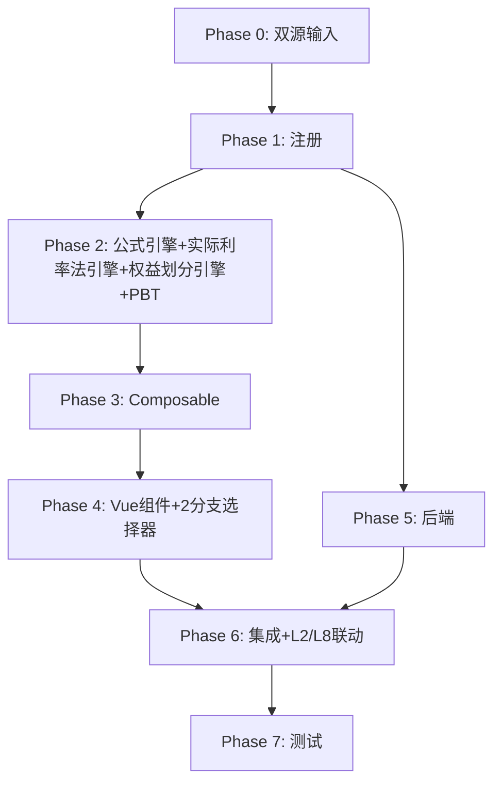

# Implementation Plan: L4 应付债券底稿专属HTML精美组件

## Overview

L4应付债券底稿专属组件`l4-bonds-payable`。L筹资循环最复杂底稿（15 sheet/1 xlsx/~250+公式）。

主入口 GtL4BondsPayable.vue（sheetName v-if + bondBranch provide，lazy）+ 13个子组件 + 14个composable + 后端3个py文件。

科目：2502应付债券（贷方/负债类）
公式特征：**负债类贷方**期末=期初+贷方-借方；**实际利率法**利息=期初摊余成本×EIR；2分支付息；权益负债划分；L4→L2/L8联动

## Tasks

### Phase 0: 双源输入验证

- [ ] 0.1 openpyxl脚本读取L4应付债券.xlsx全部15 sheet
  - 提取结构 + 确认L4-2（89列）+L4-7A/B后续计量2分支+L4-8A/B账面核对2分支+L4-5权益划分
  - 产出：l4_structure_summary.json
  - _Requirements: 双源输入流程_

- [ ] 0.2 L筹资循环底稿模板库md交叉验证
  - 核对：负债类方向/实际利率法/2分支付息/权益负债划分/初始计量/L2-L8联动
  - 产出：l4_conflict_resolution.md
  - _Requirements: 双源输入流程_

### Phase 1: 注册+契约测试

- [ ] 1.1 注册componentType和映射
  - wp_code_overrides: L4/L4-1~L4-9/L4A → 'l4-bonds-payable'
  - VALID_COMPONENT_TYPES + htmlRendererRegistry注册
  - 创建 GtL4BondsPayable.vue 骨架（sheetName v-if + selfLoad + bondBranch provide）
  - _Requirements: 1.1-1.11_

- [ ] 1.2 编写注册契约测试
  - htmlRendererRegistry / VALID_COMPONENT_TYPES / wp_code_overrides / RENDERER_DISPATCH
  - _Requirements: 1.6, 1.7, 1.8_

### Phase 2: 公式引擎+实际利率法引擎+权益划分引擎+PBT

- [ ] 2.1 创建 `useL4FormulaEngine.ts`（负债类！+初始计量）
  - calcAuditedAmount / calcLiabilityEndBalance(b,cr,dr)=b+cr-dr
  - calcInitialAmount / calcPremiumDiscount / calcSubtotal
  - _Requirements: 2.3-2.4, 6.2-6.3_

- [ ] 2.2 创建 `useL4EIREngine.ts`（核心！实际利率法）
  - calcInterestExpense / calcEndAmortizedCost_Bullet / calcEndAmortizedCost_Installment
  - generateSchedule(2分支) / validateSchedule / solveEIR
  - _Requirements: 4.4-4.7, 9.1-9.6_

- [ ] 2.3 创建 `useL4EquityLiabEngine.ts`
  - calcLiabilityComponent / calcEquityComponent
  - _Requirements: 7.2-7.3, 10.1-10.3_

- [ ]* 2.4 编写 Property P1 PBT：审定数公式链
  - 断言：calcAuditedAmount(u, a, r) === u + a + r
  - **Feature: l4-bonds-payable, Property P1: 审定数公式链**

- [ ]* 2.5 编写 Property P2 PBT：负债类期末（贷方！）
  - 断言：calcLiabilityEndBalance(b, cr, dr) === b + cr - dr
  - **Feature: l4-bonds-payable, Property P2: 负债类贷方期末余额**

- [ ]* 2.6 编写 Property P3 PBT：实际利率法利息费用
  - 生成器：amortizedCost>0, eir∈(0,0.2)
  - 断言：calcInterestExpense(cost, eir) === cost × eir
  - **Feature: l4-bonds-payable, Property P3: 实际利率法利息费用**

- [ ]* 2.7 编写 Property P4 PBT：到期一次还本付息摊余成本滚动
  - 断言：calcEndAmortizedCost_Bullet(begin, ie) === begin + ie
  - **Feature: l4-bonds-payable, Property P4: 分支A摊余成本滚动**

- [ ]* 2.8 编写 Property P5 PBT：分期付息摊余成本滚动
  - 断言：calcEndAmortizedCost_Installment(begin, ie, cp) === begin + ie - cp
  - **Feature: l4-bonds-payable, Property P5: 分支B摊余成本滚动**

- [ ]* 2.9 编写 Property P6 PBT：后续计量末期摊余成本≈面值
  - 生成器：initialCost, faceValue, couponRate, eir, periods（自洽）
  - 断言：|generateSchedule(...).last.endCost - faceValue| < 1
  - **Feature: l4-bonds-payable, Property P6: 摊余成本终值趋面值**

- [ ]* 2.10 编写 Property P7 PBT：EIR=0时利息费用为0
  - 断言：calcInterestExpense(cost, 0) === 0
  - **Feature: l4-bonds-payable, Property P7: 零利率利息恒等**

- [ ]* 2.11 编写 Property P8 PBT：初始入账金额
  - 断言：calcInitialAmount(issue, cost) === issue - cost
  - **Feature: l4-bonds-payable, Property P8: 初始入账金额**

- [ ]* 2.12 编写 Property P9 PBT：权益成分分拆
  - 断言：calcEquityComponent(total, liab) === total - liab
  - **Feature: l4-bonds-payable, Property P9: 权益成分分拆**

### Phase 3: Composable层

- [ ] 3.1 创建 useL4FormData.ts
  - selfLoad + checklist_responses + writebackTB(2502)
  - _Requirements: 1.9, 1.10, 2.6_

- [ ] 3.2 创建 useL4CrossSheet.ts
  - adjudicationVsDetail / bookReconVsSubsequent / interestToL2L8
  - _Requirements: 2.5, 5.4, 11.1-11.4_

- [ ] 3.3 创建 useL4DualMode.ts + useL4ImportExport.ts
  - 双模式 + 89列多区段分sheet导出
  - _Requirements: 12.1, 12.2_

- [ ] 3.4 创建 sheet-specific composables
  - useL4Adjudication / useL4Detail / useL4InitialMeasure
  - useL4Subsequent(2分支) / useL4BookRecon / useL4EquityLiabCheck / useL4Adjustment
  - _Requirements: 2~8 全部_

### Phase 4: Vue子组件

- [ ] 4.1 创建 L4TabIndex.vue 底稿目录
  - 15行+进度条
  - _Requirements: 1.2_

- [ ] 4.2 创建 L4TabAdjudication.vue 审定表L4-1
  - 负债类单区块+摊余成本+品种小计+TB回写
  - _Requirements: 2.1-2.7_

- [ ] 4.3 创建 L4TabDetail.vue 明细表L4-2（89列极宽表！）
  - 区段Tab拆分(基础/发行/计息付息/摊余成本/兑付)+行同步+动态行+多区段导出
  - _Requirements: 3.1-3.5_

- [ ] 4.4 创建 L4TabInitialMeasure.vue 初始计量L4-6
  - 发行价-交易费用+溢折价+IRR求解
  - _Requirements: 6.1-6.5_

- [ ] 4.5 创建 L4-7后续计量2分支组件（核心！）
  - L4TabSubsequentBullet.vue(到期一次还本付息) + L4TabSubsequentInstallment.vue(分期付息)
  - 分支选择器+完整摊销表+末期验证+L2/L8联动publish
  - _Requirements: 4.1-4.8_

- [ ] 4.6 创建 L4-8账面核对2分支组件
  - L4TabBookReconBullet.vue + L4TabBookReconInstallment.vue（分支与L4-7同步）
  - 账面vs测算差异高亮
  - _Requirements: 5.1-5.6_

- [ ] 4.7 创建 L4TabEquityLiabCheck.vue + L4TabFinLiabOther.vue
  - 权益负债划分(分拆+权益成分校验) + 其他金融工具明细
  - _Requirements: 7.1-7.5_

- [ ] 4.8 创建 L4TabAdjustment.vue + L4TabBondCheck.vue + L4TabDisclosureListed/Soe.vue
  - 调整借贷平衡 + 检查表结论区 + 附注上市/国企切换
  - _Requirements: 8.1-8.4_

### Phase 5: 后端

- [ ] 5.1 创建 l4_bonds_payable_renderer.py
  - RENDERER_DISPATCH注册 + 负债类公式验证
  - _Requirements: 1.6_

- [ ] 5.2 创建 l4_bonds_payable.py 路由
  - 导出模板/导出数据/导入数据 + 后续计量生成+IRR求解API
  - _Requirements: 4.1, 6.4, 12.2_

- [ ] 5.3 创建 l4_bonds_payable_service.py
  - 实际利率法(2分支)+权益负债划分+初始计量+IRR
  - _Requirements: 4.4-4.7, 6.2-6.4, 7.2-7.3, 9.1-9.6, 10.1-10.3_

### Phase 6: 集成

- [ ] 6.1 EventBus集成
  - publish 'substantive:adjudicated' / 'l4:interest-calculated' / 'adjustment:created'
  - subscribe 附注刷新
  - _Requirements: 2.6, 4.8, 11.1_

- [ ] 6.2 跨底稿联动
  - L4-7利息费用 → L2应付利息/L8财务费用（cross_wp_ref + GtIndexChip）
  - L4审定 → TB回写(2502)
  - _Requirements: 4.8, 11.1-11.4_

- [ ] 6.3 版本链+复核对话集成
  - useVersionTrail(autoSnapshot) + provide openReviewDialog
  - _Requirements: 12.3, 12.4_

### Phase 7: 测试

- [ ] 7.1 单元测试：useL4EIREngine + useL4FormulaEngine + useL4EquityLiabEngine
  - 实际利率法2分支 + 负债类方向 + 权益划分 + 边界(eir=0)
  - _Requirements: P1-P9_

- [ ] 7.2 集成测试：后续计量2分支末期趋面值 + L4→L2/L8联动 + 账面核对
  - _Requirements: 4.5-4.8, 5.1-5.6, 11.1-11.4_

- [ ] 7.3 Playwright E2E
  - 完整流程：打开L4→审定→明细89列→初始计量→后续计量(切分支)→账面核对→权益划分→保存
  - _Requirements: 全部_

## Task Dependency Graph

