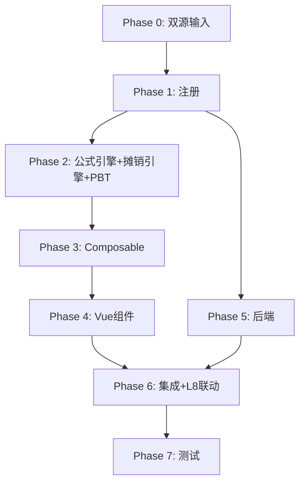

# Implementation Plan: L5 长期应付款底稿专属HTML精美组件

## Overview

L5长期应付款底稿专属组件`l5-long-term-payables`（9 sheet/1 xlsx/~120+公式）。

主入口 GtL5LongTermPayables.vue（sheetName v-if，lazy）+ 10个子组件 + 12个composable + 后端3个py文件。

科目：2701长期应付款（贷方/负债类）+ 未确认融资费用（借方/备抵）
公式特征：**负债类贷方**期末=期初+贷方-借方；未确认融资费用实际利率法摊销；净额=应付款-未确认；L5→L8联动

## Tasks

### Phase 0: 双源输入验证

- [ ] 0.1 openpyxl脚本读取L5长期应付款.xlsx全部9 sheet
  - 提取结构 + 确认L5-5摊销测算表+L5-3未确认明细结构
  - 产出：l5_structure_summary.json
  - _Requirements: 双源输入流程_

- [ ] 0.2 L筹资循环底稿模板库md交叉验证
  - 核对：负债类方向/未确认融资费用摊销/实际利率法/净额/L8联动
  - 产出：l5_conflict_resolution.md
  - _Requirements: 双源输入流程_

### Phase 1: 注册+契约测试

- [ ] 1.1 注册componentType和映射
  - wp_code_overrides: L5/L5-1~L5-7/L5A → 'l5-long-term-payables'
  - VALID_COMPONENT_TYPES + htmlRendererRegistry注册
  - 创建 GtL5LongTermPayables.vue 骨架（sheetName v-if + selfLoad）
  - _Requirements: 1.1-1.11_

- [ ] 1.2 编写注册契约测试
  - htmlRendererRegistry / VALID_COMPONENT_TYPES / wp_code_overrides / RENDERER_DISPATCH
  - _Requirements: 1.6, 1.7, 1.8_

### Phase 2: 公式引擎+摊销引擎+PBT

- [ ] 2.1 创建 `useL5FormulaEngine.ts`（负债类！）
  - calcAuditedAmount / calcLiabilityEndBalance(b,cr,dr)=b+cr-dr
  - calcContraLiabilityEndBalance / calcNetPayable / calcSubtotal
  - _Requirements: 2.3-2.6, 7.1-7.4_

- [ ] 2.2 创建 `useL5AmortizationEngine.ts`（核心）
  - calcAmortization / calcEndCost / generateSchedule / validateSchedule
  - _Requirements: 4.2-4.4, 6.1-6.5_

- [ ]* 2.3 编写 Property P1 PBT：审定数公式链
  - 断言：calcAuditedAmount(u, a, r) === u + a + r
  - **Feature: l5-long-term-payables, Property P1: 审定数公式链**

- [ ]* 2.4 编写 Property P2 PBT：负债类期末（贷方！）
  - 断言：calcLiabilityEndBalance(b, cr, dr) === b + cr - dr
  - **Feature: l5-long-term-payables, Property P2: 负债类贷方期末余额**

- [ ]* 2.5 编写 Property P3 PBT：备抵类期末（未确认融资费用）
  - 断言：calcContraLiabilityEndBalance(b, dr, cr) === b + dr - cr
  - **Feature: l5-long-term-payables, Property P3: 备抵类期末余额**

- [ ]* 2.6 编写 Property P4 PBT：净额
  - 断言：calcNetPayable(payable, unrecognized) === payable - unrecognized
  - **Feature: l5-long-term-payables, Property P4: 长期应付款净额**

- [ ]* 2.7 编写 Property P5 PBT：实际利率法摊销
  - 生成器：amortizedCost>0, eir∈(0,0.2)
  - 断言：calcAmortization(cost, eir) === cost × eir
  - **Feature: l5-long-term-payables, Property P5: 实际利率法摊销**

- [ ]* 2.8 编写 Property P6 PBT：EIR=0时摊销为0
  - 断言：calcAmortization(cost, 0) === 0
  - **Feature: l5-long-term-payables, Property P6: 零利率摊销恒等**

- [ ]* 2.9 编写 Property P7 PBT：摊销表末期未确认余额≈0
  - 生成器：initialCost, repayments, eir, periods（自洽）
  - 断言：|generateSchedule(...).last.endCost| < 1
  - **Feature: l5-long-term-payables, Property P7: 摊销表终值趋零**

### Phase 3: Composable层

- [ ] 3.1 创建 useL5FormData.ts
  - selfLoad + checklist_responses + writebackTB(2701+未确认融资费用)
  - _Requirements: 1.9, 1.10, 2.8_

- [ ] 3.2 创建 useL5CrossSheet.ts
  - adjudicationVsDetail / unrecognizedVsAmortization / amortizationToL8
  - _Requirements: 2.7, 3.6, 4.7, 8.4_

- [ ] 3.3 创建 useL5DualMode.ts + useL5ImportExport.ts
  - _Requirements: 8.1, 8.2_

- [ ] 3.4 创建 sheet-specific composables
  - useL5Adjudication / useL5Detail / useL5UnrecognizedDetail
  - useL5Amortization / useL5RelatedParty / useL5Adjustment
  - _Requirements: 2~5 全部_

### Phase 4: Vue子组件

- [ ] 4.1 创建 L5TabIndex.vue 底稿目录
  - 9行+进度条
  - _Requirements: 1.2_

- [ ] 4.2 创建 L5TabAdjudication.vue 审定表L5-1
  - 负债类双区块+未确认融资费用备抵+净额+TB回写
  - _Requirements: 2.1-2.8_

- [ ] 4.3 创建 L5TabDetail.vue + L5TabUnrecognizedDetail.vue
  - 明细表(30列区段Tab)+未确认明细+动态行+导入导出
  - _Requirements: 3.1-3.6_

- [ ] 4.4 创建 L5TabAmortization.vue 摊销测算表（核心！）
  - 实际利率法摊销+按款项筛选+末期验证+L8联动publish
  - _Requirements: 4.1-4.7_

- [ ] 4.5 创建 L5TabRelatedParty.vue + L5TabLtPayableCheck.vue
  - 关联方检查(公允性) + 检查表结论区+AI辅助
  - _Requirements: 5.1-5.2_

- [ ] 4.6 创建 L5TabAdjustment.vue + L5TabDisclosureListed/Soe.vue
  - 调整借贷平衡 + 附注上市/国企切换
  - _Requirements: 5.3-5.5_

### Phase 5: 后端

- [ ] 5.1 创建 l5_long_term_payables_renderer.py
  - RENDERER_DISPATCH注册 + 负债类公式验证
  - _Requirements: 1.6_

- [ ] 5.2 创建 l5_long_term_payables.py 路由
  - 导出模板/导出数据/导入数据 + 摊销表生成API
  - _Requirements: 4.1, 8.2_

- [ ] 5.3 创建 l5_long_term_payables_service.py
  - 实际利率法摊销+净额+关联方
  - _Requirements: 4.2-4.4, 6.1-6.5_

### Phase 6: 集成

- [ ] 6.1 EventBus集成
  - publish 'substantive:adjudicated' / 'l5:amortization-calculated' / 'adjustment:created'
  - subscribe 附注刷新
  - _Requirements: 2.8, 4.7_

- [ ] 6.2 跨底稿联动
  - L5-5本期摊销 → L8财务费用（cross_wp_ref + GtIndexChip）
  - L5审定 → TB回写(2701+未确认融资费用)
  - _Requirements: 4.7, 8.4_

- [ ] 6.3 版本链+复核对话集成
  - useVersionTrail(autoSnapshot) + provide openReviewDialog
  - _Requirements: 8.3_

### Phase 7: 测试

- [ ] 7.1 单元测试：useL5FormulaEngine + useL5AmortizationEngine
  - 负债类方向 + 备抵方向 + 净额 + 实际利率法 + 边界(eir=0)
  - _Requirements: P1-P7_

- [ ] 7.2 集成测试：摊销表末期趋零 + L5→L8联动 + 未确认明细核对
  - _Requirements: 4.4-4.7, 8.4_

- [ ] 7.3 Playwright E2E
  - 完整流程：打开L5→审定→明细→未确认明细→摊销测算(选款项)→关联方→保存
  - _Requirements: 全部_

## Task Dependency Graph

