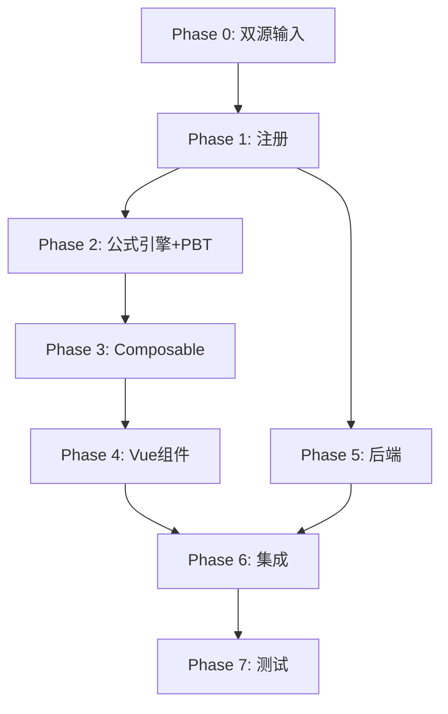

# Implementation Plan: L6 专项应付款底稿专属HTML精美组件

## Overview

L6专项应付款底稿专属组件`l6-special-payables`（8 sheet/1 xlsx/~100+公式）。

主入口 GtL6SpecialPayables.vue（sheetName v-if，lazy）+ 7个子组件 + 9个composable + 后端3个py文件。

科目：2601专项应付款（贷方/负债类）
公式特征：**负债类贷方**期末=期初+贷方-借方；专款专用核查

## Tasks

### Phase 0: 双源输入验证

- [ ] 0.1 openpyxl脚本读取L6专项应付款.xlsx全部8 sheet
  - 提取结构 + 确认审定表L6-1(73公式)+明细表L6-2结构
  - 产出：l6_structure_summary.json
  - _Requirements: 双源输入流程_

- [ ] 0.2 L筹资循环底稿模板库md交叉验证
  - 核对：负债类方向/专款专用核查
  - 产出：l6_conflict_resolution.md
  - _Requirements: 双源输入流程_

### Phase 1: 注册+契约测试

- [ ] 1.1 注册componentType和映射
  - wp_code_overrides: L6/L6-1~L6-4/L6A → 'l6-special-payables'
  - VALID_COMPONENT_TYPES + htmlRendererRegistry注册
  - 创建 GtL6SpecialPayables.vue 骨架（sheetName v-if + selfLoad）
  - _Requirements: 1.1-1.11_

- [ ] 1.2 编写注册契约测试
  - htmlRendererRegistry / VALID_COMPONENT_TYPES / wp_code_overrides / RENDERER_DISPATCH
  - _Requirements: 1.6, 1.7, 1.8_

### Phase 2: 公式引擎+PBT

- [ ] 2.1 创建 `useL6FormulaEngine.ts`（负债类！）
  - calcAuditedAmount / calcLiabilityEndBalance(b,cr,dr)=b+cr-dr / calcSubtotal
  - _Requirements: 2.3-2.4, 6.1-6.3_

- [ ]* 2.2 编写 Property P1 PBT：审定数公式链
  - 断言：calcAuditedAmount(u, a, r) === u + a + r
  - **Feature: l6-special-payables, Property P1: 审定数公式链**

- [ ]* 2.3 编写 Property P2 PBT：负债类期末（贷方！）
  - 生成器：fc.float({min:0, max:1e9}) × 3
  - 断言：calcLiabilityEndBalance(b, cr, dr) === b + cr - dr
  - **Feature: l6-special-payables, Property P2: 负债类贷方期末余额**

- [ ]* 2.4 编写 Property P3 PBT：小计求和
  - 断言：calcSubtotal(arr) === Σarr
  - **Feature: l6-special-payables, Property P3: 分类小计**

- [ ]* 2.5 编写 Property P4 PBT：明细合计=审定合计
  - 断言：Σ明细.期末 === 审定表合计.期末
  - **Feature: l6-special-payables, Property P4: 明细审定勾稽**

- [ ]* 2.6 编写 Property P5 PBT：期末非负
  - 生成器：begin≥0, credit≥0, debit≤begin+credit
  - 断言：calcLiabilityEndBalance(b, cr, dr) >= 0
  - **Feature: l6-special-payables, Property P5: 期末非负**

### Phase 3: Composable层

- [ ] 3.1 创建 useL6FormData.ts
  - selfLoad + checklist_responses + writebackTB(2601)
  - _Requirements: 1.9, 1.10, 2.6_

- [ ] 3.2 创建 useL6CrossSheet.ts
  - adjudicationVsDetail
  - _Requirements: 2.5, 3.5_

- [ ] 3.3 创建 useL6DualMode.ts + useL6ImportExport.ts
  - _Requirements: 6.4, 6.5_

- [ ] 3.4 创建 sheet-specific composables
  - useL6Adjudication / useL6Detail / useL6SpecialCheck / useL6Adjustment
  - _Requirements: 2~5 全部_

### Phase 4: Vue子组件

- [ ] 4.1 创建 L6TabIndex.vue 底稿目录
  - 8行+进度条
  - _Requirements: 1.2_

- [ ] 4.2 创建 L6TabAdjudication.vue 审定表L6-1
  - 负债类单区块+项目小计+TB回写
  - _Requirements: 2.1-2.7_

- [ ] 4.3 创建 L6TabDetail.vue 明细表L6-2
  - 33列区段Tab切换+动态行+导入导出
  - _Requirements: 3.1-3.5_

- [ ] 4.4 创建 L6TabSpecialCheck.vue 检查表L6-4
  - 专款专用核查+用途不符高亮+结论区+AI辅助
  - _Requirements: 4.1-4.4_

- [ ] 4.5 创建 L6TabAdjustment.vue + L6TabDisclosureListed/Soe.vue
  - 调整借贷平衡 + 附注上市/国企切换
  - _Requirements: 5.1-5.3_

### Phase 5: 后端

- [ ] 5.1 创建 l6_special_payables_renderer.py
  - RENDERER_DISPATCH注册 + 负债类公式验证
  - _Requirements: 1.6_

- [ ] 5.2 创建 l6_special_payables.py 路由
  - 导出模板/导出数据/导入数据
  - _Requirements: 6.5_

- [ ] 5.3 创建 l6_special_payables_service.py
  - 负债类公式验证+专款专用核查
  - _Requirements: 2.4, 4.1_

### Phase 6: 集成

- [ ] 6.1 EventBus集成
  - publish 'substantive:adjudicated' / 'adjustment:created'
  - subscribe 附注刷新
  - _Requirements: 2.6, 2.7_

- [ ] 6.2 跨底稿联动
  - L6审定 → TB回写(2601)
  - _Requirements: 2.6_

- [ ] 6.3 版本链+复核对话集成
  - useVersionTrail(autoSnapshot) + provide openReviewDialog
  - _Requirements: 6.6_

### Phase 7: 测试

- [ ] 7.1 单元测试：useL6FormulaEngine
  - 负债类方向 + 小计 + 明细勾稽
  - _Requirements: P1-P5_

- [ ] 7.2 集成测试：审定→明细勾稽 + TB回写
  - _Requirements: 2.5, 2.6_

- [ ] 7.3 Playwright E2E
  - 完整流程：打开L6→审定→明细→专款专用检查→保存
  - _Requirements: 全部_

## Task Dependency Graph

