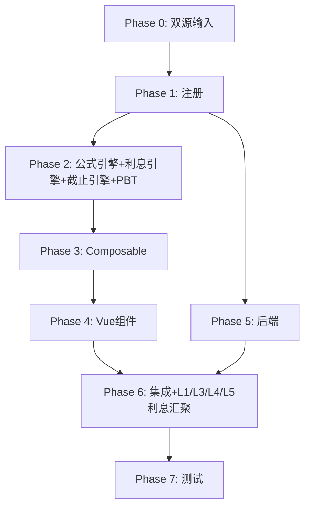

# Implementation Plan: L8 财务费用底稿专属HTML精美组件

## Overview

L8财务费用底稿专属组件`l8-financial-expenses`（10 sheet/1 xlsx/~150+公式）。L筹资循环损益类底稿（利息汇聚终点）。

主入口 GtL8FinancialExpenses.vue（sheetName v-if，lazy）+ 9个子组件 + 12个composable + 后端3个py文件。

科目：6603财务费用（**损益类/取发生额**！从tb_ledger取本期借贷发生额）
公式特征：**损益类发生额**=借方发生-贷方发生；利息支出测算接收L1/L3/L4/L5；截止测试

## Tasks

### Phase 0: 双源输入验证

- [ ] 0.1 openpyxl脚本读取L8财务费用.xlsx全部10 sheet
  - 提取结构 + 确认明细表L8-2(37公式)+L8-4非金融利息+L8-5截止测试结构
  - 产出：l8_structure_summary.json
  - _Requirements: 双源输入流程_

- [ ] 0.2 L筹资循环底稿模板库md交叉验证
  - 核对：损益类发生额口径/利息汇聚L1-L3-L4-L5/截止测试/汇兑损益/非金融机构利息
  - 产出：l8_conflict_resolution.md
  - _Requirements: 双源输入流程_

### Phase 1: 注册+契约测试

- [ ] 1.1 注册componentType和映射
  - wp_code_overrides: L8/L8-1~L8-6/L8A → 'l8-financial-expenses'
  - VALID_COMPONENT_TYPES + htmlRendererRegistry注册
  - 创建 GtL8FinancialExpenses.vue 骨架（sheetName v-if + selfLoad）
  - _Requirements: 1.1-1.11_

- [ ] 1.2 编写注册契约测试
  - htmlRendererRegistry / VALID_COMPONENT_TYPES / wp_code_overrides / RENDERER_DISPATCH
  - _Requirements: 1.6, 1.7, 1.8_

### Phase 2: 公式引擎+利息引擎+截止引擎+PBT

- [ ] 2.1 创建 `useL8FormulaEngine.ts`（损益类！取发生额）
  - calcAuditedAmount / calcOccurrence(dr,cr)=dr-cr
  - calcNetFinanceExpense / calcChangeRate / calcSubtotal
  - _Requirements: 2.3-2.4, 3.2-3.3, 8.1-8.4_

- [ ] 2.2 创建 `useL8InterestEngine.ts`
  - aggregateInterest(L1/L3/L4/L5) / calcInterestDiff / calcDeductibleInterest / calcExcessInterest
  - _Requirements: 4.5-4.6, 5.2-5.3, 8.5-8.6_

- [ ] 2.3 创建 `useL8CutoffEngine.ts`
  - isCrossPeriod / extractCutoffWindow
  - _Requirements: 6.2-6.4, 8.7_

- [ ]* 2.4 编写 Property P1 PBT：审定数公式链
  - 断言：calcAuditedAmount(u, a, r) === u + a + r
  - **Feature: l8-financial-expenses, Property P1: 审定数公式链**

- [ ]* 2.5 编写 Property P2 PBT：损益类发生额（借-贷！）
  - 生成器：debitOccur≥0, creditOccur≥0
  - 断言：calcOccurrence(dr, cr) === dr - cr
  - **Feature: l8-financial-expenses, Property P2: 损益类发生额**

- [ ]* 2.6 编写 Property P3 PBT：净财务费用
  - 断言：calcNetFinanceExpense(ie,ii,fx,fee,o) === ie-ii+fx+fee+o
  - **Feature: l8-financial-expenses, Property P3: 净财务费用**

- [ ]* 2.7 编写 Property P4 PBT：变动率
  - 生成器：prior≠0
  - 断言：calcChangeRate(cur, prior) === (cur-prior)/prior×100
  - **Feature: l8-financial-expenses, Property P4: 变动率**

- [ ]* 2.8 编写 Property P5 PBT：利息汇总
  - 断言：aggregateInterest(l1,l3,l4,l5) === l1+l3+l4+l5
  - **Feature: l8-financial-expenses, Property P5: 利息来源汇总**

- [ ]* 2.9 编写 Property P6 PBT：可扣除利息
  - 生成器：principal>0, rate∈(0,0.2), days∈[0,365]
  - 断言：calcDeductibleInterest(p, rate, days) === p×rate×days/360
  - **Feature: l8-financial-expenses, Property P6: 可扣除利息**

- [ ]* 2.10 编写 Property P7 PBT：超标利息
  - 断言：calcExcessInterest(booked, deductible) === booked - deductible
  - **Feature: l8-financial-expenses, Property P7: 超标利息**

### Phase 3: Composable层

- [ ] 3.1 创建 useL8FormData.ts
  - selfLoad + checklist_responses + writebackTB(6603发生额口径，从tb_ledger取数)
  - _Requirements: 1.9, 1.10, 2.4, 2.6_

- [ ] 3.2 创建 useL8CrossSheet.ts
  - adjudicationVsDetail / interestFromLCycle / estimatedVsBooked
  - _Requirements: 2.5, 3.6, 4.1-4.8_

- [ ] 3.3 创建 useL8DualMode.ts + useL8ImportExport.ts
  - _Requirements: 8.8_

- [ ] 3.4 创建 sheet-specific composables
  - useL8Adjudication / useL8Detail / useL8NonFinInterest / useL8CutoffTest / useL8Adjustment
  - _Requirements: 2~7 全部_

### Phase 4: Vue子组件

- [ ] 4.1 创建 L8TabIndex.vue 底稿目录
  - 10行+进度条
  - _Requirements: 1.2_

- [ ] 4.2 创建 L8TabAdjudication.vue 审定表L8-1
  - 损益类发生额（本期/上期/变动）+项目小计+TB回写(发生额口径)
  - _Requirements: 2.1-2.7_

- [ ] 4.3 创建 L8TabDetail.vue 明细表L8-2
  - 费用项目分析(利息支出/收入/汇兑/手续费)+净财务费用+变动率+区段Tab
  - _Requirements: 3.1-3.6_

- [ ] 4.4 创建 L8TabNonFinInterest.vue 非金融机构利息测算L8-4
  - 可扣除利息+超标利息(税务提示)
  - _Requirements: 5.1-5.4_

- [ ] 4.5 创建 L8TabCutoffTest.vue 截止测试L8-5
  - 序时账±天数自动提取+跨期高亮+行级抽凭(GtVoucherSamplingEngine)
  - _Requirements: 6.1-6.5_

- [ ] 4.6 创建 L8TabFinExpenseCheck.vue + L8TabAdjustment.vue + L8TabDisclosureListed/Soe.vue
  - 检查表结论区+AI辅助 + 调整借贷平衡 + 附注上市/国企切换
  - _Requirements: 7.1-7.5_

### Phase 5: 后端

- [ ] 5.1 创建 l8_financial_expenses_renderer.py
  - RENDERER_DISPATCH注册 + 损益类发生额验证（从tb_ledger取数）
  - _Requirements: 1.6, 2.4_

- [ ] 5.2 创建 l8_financial_expenses.py 路由
  - 导出模板/导出数据/导入数据 + 利息测算汇总+截止提取API
  - _Requirements: 4.5, 6.1, 8.8_

- [ ] 5.3 创建 l8_financial_expenses_service.py
  - 损益类发生额+利息汇总(L1/L3/L4/L5)+非金融利息+截止测试
  - _Requirements: 2.4, 4.5, 5.2-5.3, 6.2-6.4_

### Phase 6: 集成

- [ ] 6.1 EventBus集成
  - publish 'substantive:adjudicated' / 'adjustment:created'
  - subscribe 'l1:interest-calculated' / 'l3:interest-calculated' / 'l4:interest-calculated' / 'l5:amortization-calculated' + 附注刷新
  - _Requirements: 2.6, 4.1-4.4_

- [ ] 6.2 跨底稿联动
  - L1/L3/L4利息+L5摊销 → L8利息支出测算（cross_wp_ref + GtIndexChip）
  - L8审定 → TB回写(6603发生额)
  - 截止自动提取(useCutoffAutoSampling)
  - _Requirements: 4.1-4.8, 6.1_

- [ ] 6.3 版本链+复核对话集成
  - useVersionTrail(autoSnapshot) + provide openReviewDialog
  - _Requirements: 8.9_

### Phase 7: 测试

- [ ] 7.1 单元测试：useL8FormulaEngine + useL8InterestEngine + useL8CutoffEngine
  - 损益类发生额 + 利息汇总 + 可扣除/超标利息 + 截止跨期
  - _Requirements: P1-P7_

- [ ] 7.2 集成测试：L1/L3/L4/L5→L8利息汇聚 + 截止测试 + 发生额回写
  - _Requirements: 4.1-4.8, 6.1-6.5_

- [ ] 7.3 Playwright E2E
  - 完整流程：打开L8→审定(发生额)→明细→利息测算(接收L循环)→非金融利息→截止测试→保存
  - _Requirements: 全部_

## Task Dependency Graph

