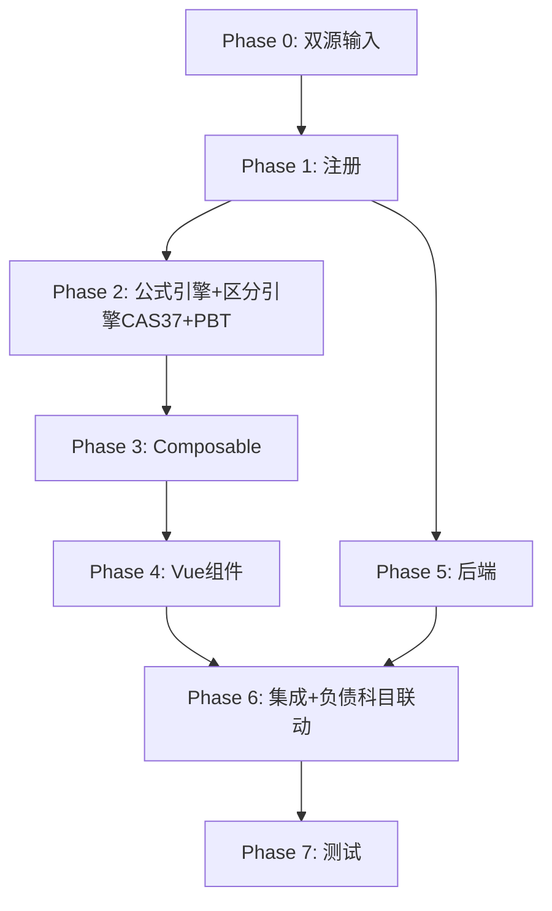

# Implementation Plan: M10 其他权益工具底稿专属HTML精美组件

## Overview

M10其他权益工具底稿专属组件`m10-other-equity-instruments`（10 sheet含1个Q10A修订前skip/1 xlsx/~60+公式）。

主入口 GtM10OtherEquityInstruments.vue（sheetName v-if，lazy）+ 8个子组件 + 11个composable + 后端3个py文件。

科目：4003其他权益工具（贷方/权益类）
公式特征：**权益类贷方**期末=期初+贷方-借方；**负债与权益区分CAS37判定**（永续债/优先股）；权益+负债金额守恒

## Tasks

### Phase 0: 双源输入验证

- [ ] 0.1 openpyxl脚本读取M10其他权益工具.xlsx全部10 sheet
  - 提取结构 + 确认审定表M10-1（29公式）+明细M10-2（45×30，13公式）+区分检查M10-4（64×8）；识别Q10A修订前sheet跳过
  - 产出：m10_structure_summary.json
  - _Requirements: 双源输入流程_

- [ ] 0.2 M股东权益循环底稿模板库md交叉验证
  - 核对：权益类方向/CAS37负债权益区分/权益负债守恒
  - 产出：m10_conflict_resolution.md
  - _Requirements: 双源输入流程_

### Phase 1: 注册+契约测试

- [ ] 1.1 注册componentType和映射
  - wp_code_overrides: M10/M10-1~M10-5/M10A → 'm10-other-equity-instruments'
  - VALID_COMPONENT_TYPES + htmlRendererRegistry注册
  - 创建 GtM10OtherEquityInstruments.vue 骨架（sheetName v-if + selfLoad）
  - _Requirements: 1.1-1.11_

- [ ] 1.2 编写注册契约测试
  - htmlRendererRegistry / VALID_COMPONENT_TYPES / wp_code_overrides / RENDERER_DISPATCH
  - _Requirements: 1.6, 1.7, 1.8_

### Phase 2: 公式引擎+区分引擎+PBT

- [ ] 2.1 创建 `useM10FormulaEngine.ts`（权益类！）
  - calcAuditedAmount / calcEquityEndBalance(b,cr,dr)=b+cr-dr / calcSubtotal
  - _Requirements: 2.3-2.4, 6.4_

- [ ] 2.2 创建 `useM10ClassificationEngine.ts`（CAS37）
  - classifyInstrument / splitAmount / calcClassificationConsistency
  - _Requirements: 4.2-4.3, 6.1-6.3_

- [ ]* 2.3 编写 Property P1 PBT：审定数公式链
  - 断言：calcAuditedAmount(u, a, r) === u + a + r
  - **Feature: m10-other-equity-instruments, Property P1: 审定数公式链**

- [ ]* 2.4 编写 Property P2 PBT：权益类期末（贷方！）
  - 生成器：fc.float({min:0, max:1e9}) × 3
  - 断言：calcEquityEndBalance(b, cr, dr) === b + cr - dr
  - **Feature: m10-other-equity-instruments, Property P2: 权益类贷方期末余额**

- [ ]* 2.5 编写 Property P3 PBT：CAS37分类判定
  - 生成器：fc.boolean()
  - 断言：classifyInstrument(ob) === (ob ? 'liability' : 'equity')
  - **Feature: m10-other-equity-instruments, Property P3: CAS37负债权益判定**

- [ ]* 2.6 编写 Property P4 PBT：金额拆分
  - 断言：splitAmount(total, eq) === total - eq
  - **Feature: m10-other-equity-instruments, Property P4: 权益负债金额拆分**

- [ ]* 2.7 编写 Property P5 PBT：分类金额守恒
  - 断言：calcClassificationConsistency(eq, liab, total) ⟺ eq+liab===total
  - **Feature: m10-other-equity-instruments, Property P5: 权益负债金额守恒**

- [ ]* 2.8 编写 Property P6 PBT：小计求和
  - 断言：calcSubtotal(arr) === Σarr
  - **Feature: m10-other-equity-instruments, Property P6: 分类小计**

### Phase 3: Composable层

- [ ] 3.1 创建 useM10FormData.ts
  - selfLoad + checklist_responses + writebackTB(4003)
  - _Requirements: 1.9, 1.10, 2.6_

- [ ] 3.2 创建 useM10CrossSheet.ts
  - adjudicationVsDetail / classificationConsistency / 负债部分→负债科目
  - _Requirements: 2.5, 4.3-4.4_

- [ ] 3.3 创建 useM10DualMode.ts + useM10ImportExport.ts
  - _Requirements: 6.5, 6.6_

- [ ] 3.4 创建 sheet-specific composables
  - useM10Adjudication / useM10Detail / useM10ClassificationCheck / useM10InstrumentCheck / useM10Adjustment
  - _Requirements: 2~5 全部_

### Phase 4: Vue子组件

- [ ] 4.1 创建 M10TabIndex.vue 底稿目录
  - _Requirements: 1.2_

- [ ] 4.2 创建 M10TabAdjudication.vue 审定表M10-1
  - 权益类单区块+按工具类型(永续债/优先股)小计+TB回写
  - _Requirements: 2.1-2.7_

- [ ] 4.3 创建 M10TabDetail.vue 明细表M10-2
  - 30列区段Tab+动态行(弹prompt工具名)+导入导出
  - _Requirements: 3.1-3.5_

- [ ] 4.4 创建 M10TabClassificationCheck.vue 区分检查M10-4（核心！）
  - CAS37逐条判定(64×8)+权益/负债守恒+AI辅助
  - _Requirements: 4.1-4.5_

- [ ] 4.5 创建 M10TabInstrumentCheck.vue 检查表M10-5
  - 核对清单+结论区+AI辅助
  - _Requirements: 5.1-5.2_

- [ ] 4.6 创建 M10TabAdjustment.vue + M10TabDisclosureListed/Soe.vue
  - 调整借贷平衡 + 附注上市/国企切换
  - _Requirements: 5.3-5.5_

### Phase 5: 后端

- [ ] 5.1 创建 m10_other_equity_instruments_renderer.py
  - RENDERER_DISPATCH注册 + 权益类公式验证
  - _Requirements: 1.6_

- [ ] 5.2 创建 m10_other_equity_instruments.py 路由
  - 导出模板/导出数据/导入数据 + 负债权益区分API
  - _Requirements: 6.6_

- [ ] 5.3 创建 m10_other_equity_instruments_service.py
  - CAS37分类判定+金额守恒校验
  - _Requirements: 4.2-4.3_

### Phase 6: 集成

- [ ] 6.1 EventBus集成
  - publish 'substantive:adjudicated' / 'adjustment:created' + 附注刷新
  - _Requirements: 2.6_

- [ ] 6.2 跨底稿联动
  - M10负债部分 → 负债科目（cross_wp_ref + GtIndexChip）
  - M10审定 → TB回写(4003)
  - _Requirements: 4.4_

- [ ] 6.3 版本链+复核对话集成
  - useVersionTrail(autoSnapshot) + provide openReviewDialog
  - _Requirements: 6.7_

### Phase 7: 测试

- [ ] 7.1 单元测试：useM10FormulaEngine + useM10ClassificationEngine
  - 权益类方向 + CAS37分类判定 + 金额守恒
  - _Requirements: P1-P6_

- [ ] 7.2 集成测试：CAS37区分 + 负债部分联动
  - _Requirements: 4.1-4.5_

- [ ] 7.3 Playwright E2E
  - 完整流程：打开M10→审定→明细→CAS37区分检查→工具检查→保存
  - _Requirements: 全部_

## Task Dependency Graph

