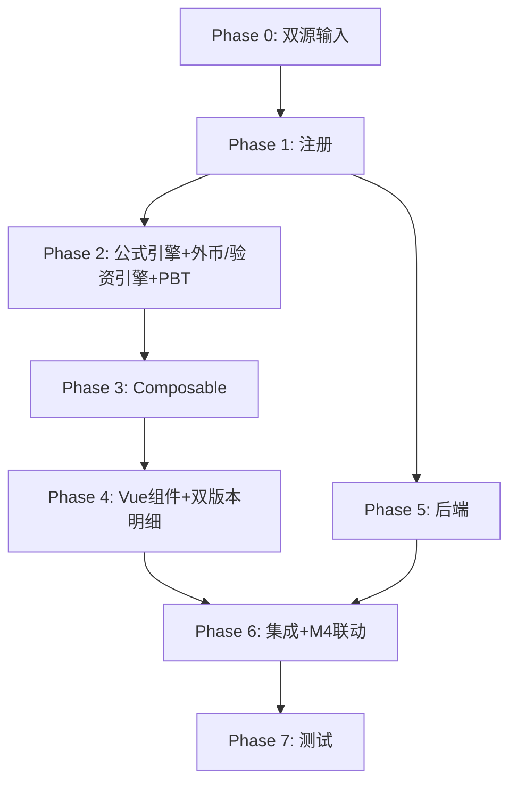

# Implementation Plan: M2 实收资本（股本）底稿专属HTML精美组件

## Overview

M2实收资本（股本）底稿专属组件`m2-paid-in-capital`（11 sheet/1 xlsx/~130+公式）。

主入口 GtM2PaidInCapital.vue（sheetName v-if，lazy）+ 10个子组件 + 11个composable + 后端3个py文件。

科目：4001实收资本/股本（贷方/权益类）
公式特征：**权益类贷方**期末=期初+贷方-借方；上市/非上市双版本明细分支选择器；验资核对；外币投资汇率折算

## Tasks

### Phase 0: 双源输入验证

- [ ] 0.1 openpyxl脚本读取M2实收资本（股本）.xlsx全部11 sheet
  - 提取结构 + 确认审定表M2-1（73公式）+双版本明细M2-2（上市38×36/非上市37×24）+外币投资M2-4（13公式）
  - 产出：m2_structure_summary.json
  - _Requirements: 双源输入流程_

- [ ] 0.2 M股东权益循环底稿模板库md交叉验证
  - 核对：权益类方向/验资核对/双版本明细/外币投资折算
  - 产出：m2_conflict_resolution.md
  - _Requirements: 双源输入流程_

### Phase 1: 注册+契约测试

- [ ] 1.1 注册componentType和映射
  - wp_code_overrides: M2/M2-1~M2-5/M2A → 'm2-paid-in-capital'
  - VALID_COMPONENT_TYPES + htmlRendererRegistry注册
  - 创建 GtM2PaidInCapital.vue 骨架（sheetName v-if + selfLoad）
  - _Requirements: 1.1-1.11_

- [ ] 1.2 编写注册契约测试
  - htmlRendererRegistry / VALID_COMPONENT_TYPES / wp_code_overrides / RENDERER_DISPATCH
  - _Requirements: 1.6, 1.7, 1.8_

### Phase 2: 公式引擎+外币/验资引擎+PBT

- [ ] 2.1 创建 `useM2FormulaEngine.ts`（权益类！）
  - calcAuditedAmount / calcEquityEndBalance(b,cr,dr)=b+cr-dr / calcSubtotal
  - _Requirements: 2.3-2.4, 7.5_

- [ ] 2.2 创建 `useM2FxEngine.ts` + `useM2VerifyEngine.ts`
  - calcFxConverted / calcFxDiff / calcVerifyDiff / calcPaidInRate
  - _Requirements: 4.2-4.3, 5.2-5.3, 7.1-7.4_

- [ ]* 2.3 编写 Property P1 PBT：审定数公式链
  - 断言：calcAuditedAmount(u, a, r) === u + a + r
  - **Feature: m2-paid-in-capital, Property P1: 审定数公式链**

- [ ]* 2.4 编写 Property P2 PBT：权益类期末（贷方！）
  - 生成器：fc.float({min:0, max:1e9}) × 3
  - 断言：calcEquityEndBalance(b, cr, dr) === b + cr - dr
  - **Feature: m2-paid-in-capital, Property P2: 权益类贷方期末余额**

- [ ]* 2.5 编写 Property P3 PBT：外币折算
  - 断言：calcFxConverted(amt, rate) === amt × rate
  - **Feature: m2-paid-in-capital, Property P3: 外币投资折算**

- [ ]* 2.6 编写 Property P4 PBT：折算差异
  - 断言：calcFxDiff(conv, booked) === conv - booked
  - **Feature: m2-paid-in-capital, Property P4: 折算差异**

- [ ]* 2.7 编写 Property P5 PBT：验资差异
  - 断言：calcVerifyDiff(paid, verified) === paid - verified
  - **Feature: m2-paid-in-capital, Property P5: 验资差异**

- [ ]* 2.8 编写 Property P6 PBT：出资到位率
  - 生成器：subscribed≠0
  - 断言：calcPaidInRate(paid, sub) === paid / sub
  - **Feature: m2-paid-in-capital, Property P6: 出资到位率**

- [ ]* 2.9 编写 Property P7 PBT：小计求和
  - 断言：calcSubtotal(arr) === Σarr
  - **Feature: m2-paid-in-capital, Property P7: 分类小计**

### Phase 3: Composable层

- [ ] 3.1 创建 useM2FormData.ts
  - selfLoad + checklist_responses + writebackTB(4001)
  - _Requirements: 1.9, 1.10, 2.6_

- [ ] 3.2 创建 useM2CrossSheet.ts
  - adjudicationVsDetail / detailBranch状态 / 外币差异→M4联动
  - _Requirements: 2.5, 3.1, 4.4_

- [ ] 3.3 创建 useM2DualMode.ts + useM2ImportExport.ts
  - _Requirements: 7.6, 7.7_

- [ ] 3.4 创建 sheet-specific composables
  - useM2Adjudication / useM2Detail(双版本) / useM2CapitalCheck / useM2Adjustment
  - _Requirements: 2~6 全部_

### Phase 4: Vue子组件

- [ ] 4.1 创建 M2TabIndex.vue 底稿目录
  - _Requirements: 1.2_

- [ ] 4.2 创建 M2TabAdjudication.vue 审定表M2-1
  - 权益类单区块+按出资人分类小计+TB回写
  - _Requirements: 2.1-2.7_

- [ ] 4.3 创建 M2TabDetail.vue + M2TabDetailListed.vue + M2TabDetailUnlisted.vue
  - 分支选择器容器 + 上市版(38×36) + 非上市版(37×24) + 动态行 + 导入导出
  - _Requirements: 3.1-3.7_

- [ ] 4.4 创建 M2TabFxInvest.vue 外币投资汇率M2-4
  - 外币折算(13公式)+折算差异→M4提示
  - _Requirements: 4.1-4.5_

- [ ] 4.5 创建 M2TabCapitalCheck.vue 检查表M2-5
  - 验资核对清单+出资到位率+结论区+AI辅助
  - _Requirements: 5.1-5.5_

- [ ] 4.6 创建 M2TabAdjustment.vue + M2TabDisclosureListed/Soe.vue
  - 调整借贷平衡 + 附注上市/国企切换
  - _Requirements: 6.1-6.3_

### Phase 5: 后端

- [ ] 5.1 创建 m2_paid_in_capital_renderer.py
  - RENDERER_DISPATCH注册 + 权益类公式验证
  - _Requirements: 1.6_

- [ ] 5.2 创建 m2_paid_in_capital.py 路由
  - 导出模板/导出数据/导入数据 + 外币折算/验资核对API
  - _Requirements: 7.7_

- [ ] 5.3 创建 m2_paid_in_capital_service.py
  - 外币折算+验资核对+按出资人汇总
  - _Requirements: 4.2, 5.2_

### Phase 6: 集成

- [ ] 6.1 EventBus集成
  - publish 'substantive:adjudicated' / 'adjustment:created'
  - subscribe 附注刷新
  - _Requirements: 2.6_

- [ ] 6.2 跨底稿联动
  - M2外币折算差异 → M4资本公积（cross_wp_ref + GtIndexChip）
  - M2审定 → TB回写(4001)
  - _Requirements: 4.4_

- [ ] 6.3 版本链+复核对话集成
  - useVersionTrail(autoSnapshot) + provide openReviewDialog
  - _Requirements: 7.8_

### Phase 7: 测试

- [ ] 7.1 单元测试：useM2FormulaEngine + useM2FxEngine + useM2VerifyEngine
  - 权益类方向 + 外币折算 + 验资核对
  - _Requirements: P1-P7_

- [ ] 7.2 集成测试：双版本明细切换 + 外币折算→M4 + 验资核对
  - _Requirements: 3.1-3.7, 4.1-4.5, 5.1-5.5_

- [ ] 7.3 Playwright E2E
  - 完整流程：打开M2→审定→明细(切换上市/非上市)→外币投资→验资核对→保存
  - _Requirements: 全部_

## Task Dependency Graph

