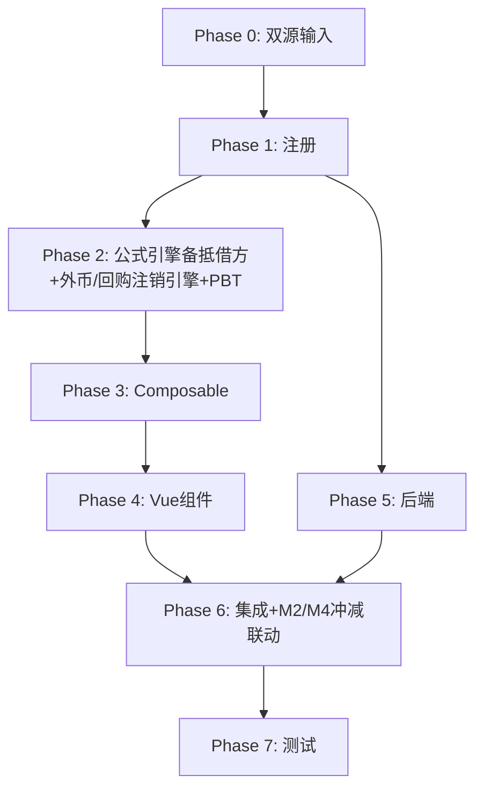

# Implementation Plan: M3 库存股底稿专属HTML精美组件

## Overview

M3库存股底稿专属组件`m3-treasury-stock`（有效sheet含1会计规定辅助skip/1 xlsx/~90+公式）。

主入口 GtM3TreasuryStock.vue（sheetName v-if，lazy）+ 7个子组件 + 11个composable + 后端3个py文件。

科目：4002库存股（**借方/权益备抵类！**）
公式特征：**权益备抵借方**期末=期初+借方-贷方（与其他M权益类相反！）；回购/注销核对；外币投资汇率折算

## Tasks

### Phase 0: 双源输入验证

- [ ] 0.1 openpyxl脚本读取M3库存股.xlsx全部sheet
  - 提取结构 + 确认审定表M3-1（73公式）+明细M3-2（59×19）+外币M3-4；识别会计规定辅助sheet跳过
  - 产出：m3_structure_summary.json
  - _Requirements: 双源输入流程_

- [ ] 0.2 M股东权益循环底稿模板库md交叉验证
  - 核对：**权益备抵借方方向铁律**/回购注销/M2-M4冲减联动
  - 产出：m3_conflict_resolution.md
  - _Requirements: 双源输入流程_

### Phase 1: 注册+契约测试

- [ ] 1.1 注册componentType和映射
  - wp_code_overrides: M3/M3-1~M3-5/M3A → 'm3-treasury-stock'
  - VALID_COMPONENT_TYPES + htmlRendererRegistry注册
  - 创建 GtM3TreasuryStock.vue 骨架（sheetName v-if + selfLoad）
  - _Requirements: 1.1-1.11_

- [ ] 1.2 编写注册契约测试
  - htmlRendererRegistry / VALID_COMPONENT_TYPES / wp_code_overrides / RENDERER_DISPATCH
  - _Requirements: 1.6, 1.7, 1.8_

### Phase 2: 公式引擎+外币/回购注销引擎+PBT

- [ ] 2.1 创建 `useM3FormulaEngine.ts`（**备抵借方！**）
  - calcAuditedAmount / calcContraEquityEndBalance(b,dr,cr)=b+dr-cr / calcSubtotal
  - _Requirements: 2.3-2.4, 7.5_

- [ ] 2.2 创建 `useM3FxEngine.ts` + `useM3TreasuryEngine.ts`
  - calcFxConverted / calcFxDiff / calcRepurchaseAmount / calcCancelDiff
  - _Requirements: 4.2-4.3, 5.2, 5.4, 7.1-7.4_

- [ ]* 2.3 编写 Property P1 PBT：审定数公式链
  - 断言：calcAuditedAmount(u, a, r) === u + a + r
  - **Feature: m3-treasury-stock, Property P1: 审定数公式链**

- [ ]* 2.4 编写 Property P2 PBT：权益备抵类期末（借方！）
  - 生成器：fc.float({min:0, max:1e9}) × 3
  - 断言：calcContraEquityEndBalance(b, dr, cr) === b + dr - cr
  - **Feature: m3-treasury-stock, Property P2: 权益备抵借方期末余额**

- [ ]* 2.5 编写 Property P3 PBT：回购金额
  - 断言：calcRepurchaseAmount(shares, price) === shares × price
  - **Feature: m3-treasury-stock, Property P3: 回购金额**

- [ ]* 2.6 编写 Property P4 PBT：注销冲减差额
  - 断言：calcCancelDiff(ca, dc, dr) === ca - dc - dr
  - **Feature: m3-treasury-stock, Property P4: 注销冲减差额**

- [ ]* 2.7 编写 Property P5 PBT：外币折算
  - 断言：calcFxConverted(amt, rate) === amt × rate
  - **Feature: m3-treasury-stock, Property P5: 外币折算**

- [ ]* 2.8 编写 Property P6 PBT：小计求和
  - 断言：calcSubtotal(arr) === Σarr
  - **Feature: m3-treasury-stock, Property P6: 分类小计**

### Phase 3: Composable层

- [ ] 3.1 创建 useM3FormData.ts
  - selfLoad + checklist_responses + writebackTB(4002)
  - _Requirements: 1.9, 1.10, 2.6_

- [ ] 3.2 创建 useM3CrossSheet.ts
  - adjudicationVsDetail / 注销冲减→M2/M4联动
  - _Requirements: 2.5, 5.3_

- [ ] 3.3 创建 useM3DualMode.ts + useM3ImportExport.ts
  - _Requirements: 7.6, 7.7_

- [ ] 3.4 创建 sheet-specific composables
  - useM3Adjudication / useM3Detail / useM3TreasuryCheck / useM3Adjustment
  - _Requirements: 2~6 全部_

### Phase 4: Vue子组件

- [ ] 4.1 创建 M3TabIndex.vue 底稿目录
  - _Requirements: 1.2_

- [ ] 4.2 创建 M3TabAdjudication.vue 审定表M3-1
  - **权益备抵借方**单区块+"备抵借方"标注+按批次小计+TB回写
  - _Requirements: 2.1-2.7_

- [ ] 4.3 创建 M3TabDetail.vue 明细表M3-2
  - 19列区段Tab+动态行(弹prompt批次名)+导入导出
  - _Requirements: 3.1-3.5_

- [ ] 4.4 创建 M3TabFxInvest.vue 外币投资汇率M3-4
  - 外币回购折算
  - _Requirements: 4.1-4.5_

- [ ] 4.5 创建 M3TabTreasuryCheck.vue 检查表M3-5
  - 回购核对+注销冲减核对(M2/M4)+结论区+AI辅助
  - _Requirements: 5.1-5.5_

- [ ] 4.6 创建 M3TabAdjustment.vue + M3TabDisclosureListed.vue
  - 调整借贷平衡 + 上市附注
  - _Requirements: 6.1-6.3_

### Phase 5: 后端

- [ ] 5.1 创建 m3_treasury_stock_renderer.py
  - RENDERER_DISPATCH注册 + **备抵借方**公式验证
  - _Requirements: 1.6_

- [ ] 5.2 创建 m3_treasury_stock.py 路由
  - 导出模板/导出数据/导入数据 + 外币折算/回购注销API
  - _Requirements: 7.7_

- [ ] 5.3 创建 m3_treasury_stock_service.py
  - 外币折算+回购注销核对+按批次汇总
  - _Requirements: 5.2, 5.4_

### Phase 6: 集成

- [ ] 6.1 EventBus集成
  - publish 'substantive:adjudicated' / 'adjustment:created' + 附注刷新
  - _Requirements: 2.6_

- [ ] 6.2 跨底稿联动
  - M3注销冲减 → M2实收资本 + M4资本公积（cross_wp_ref + GtIndexChip）
  - M3审定 → TB回写(4002)
  - _Requirements: 5.3_

- [ ] 6.3 版本链+复核对话集成
  - useVersionTrail(autoSnapshot) + provide openReviewDialog
  - _Requirements: 7.8_

### Phase 7: 测试

- [ ] 7.1 单元测试：useM3FormulaEngine + useM3FxEngine + useM3TreasuryEngine
  - **备抵借方方向** + 回购金额 + 注销冲减 + 外币折算
  - _Requirements: P1-P6_

- [ ] 7.2 集成测试：注销冲减→M2/M4 + 外币折算
  - _Requirements: 5.1-5.5_

- [ ] 7.3 Playwright E2E
  - 完整流程：打开M3→审定(验证借方)→明细→外币回购→回购注销核对→保存
  - _Requirements: 全部_

## Task Dependency Graph

